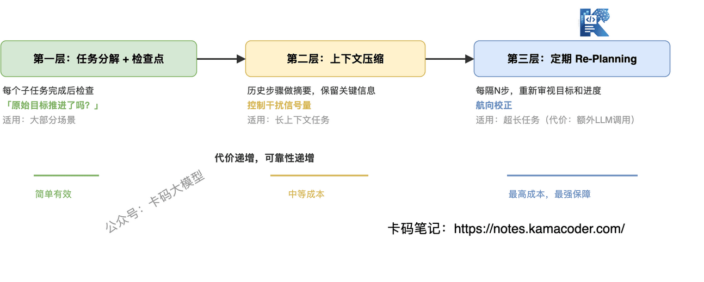

# Дрейф контексту й галюцинації виклику інструментів: детальний розбір і підхід до відповіді

У [розповіді про чотири раунди співбесіди на розробку агентів у ByteDance](./20260506bytedance.md) було дуже вдале питання: «як ви розв'язуєте проблеми дрейфу контексту й галюцинацій під час виклику інструментів в агентах?»

Дехто з інтерв'юерів формулює це так: «а ваш агент після десятка раундів іще надійний?»

Багато хто не знає, що відповісти.

**У чому ж нестабільність? У двох головних проблемах: дрейф контексту й галюцинації виклику інструментів.**

Агент за кілька кроків збивається й забуває початкову задачу; там, де треба викликати інструмент, викликає не той, а там, де не треба, викликає навмання.

Розберімо ці дві проблеми як слід: **чому агент збивається, звідки беруться галюцинації, як це виявити й що з цим робити.**

## Зміст

1. Дрейф контексту: чому агент збивається дорогою
   - Симптом: мета непомітно змінилася
   - Причина: чому це стається, з погляду механізму уваги
   - Три види дрейфу
   - Сигнали виявлення: як зрозуміти, що дрейф стався
   - Пошарові розв'язки: від простого до складного, і ціна кожного
2. Галюцинації виклику інструментів: чому агент викликає те, чого не треба
   - Симптом: не те щоб не вміє — викликає неправильно
   - Причина: чому виникають галюцинації, з погляду ймовірнісної генерації
   - Три типи галюцинацій
   - Розв'язки: кожному типу свій підхід
   - Спільна лінія оборони: валідація на всьому шляху виклику
3. Як відповідати на співбесіді

## 1. Дрейф контексту: чому агент збивається дорогою

### Симптом: мета непомітно змінилася

Ви просите агента «проаналізувати ці дані про продажі й знайти причини падіння». Ідеальний перебіг: прочитати дані → проаналізувати динаміку → локалізувати причину → видати звіт.

А на практиці буває так: прочитав дані → помітив проблему з форматом і почав його виправляти → виправивши, побачив, що бракує якогось поля, і пішов у документацію → у документації зацікавився іншим розділом і взявся аналізувати конкурентів → зробив десять кроків, а початкової задачі «знайти причини падіння» навіть не торкнувся.

**Це і є дрейф контексту: напрямок виконання непомітно відхилився від початкової мети.**

Модель не «подурнішала» — вона на кожному кроці робить «найрозумніший наступний крок за поточного контексту», але «найрозумніший» не дорівнює «найближчий до початкової мети».

### Причина: чому це стається, з погляду механізму уваги

Дехто каже «агент на довгій дистанції збивається», але не пояснює чому. Щоб справді зрозуміти дрейф, треба повернутися до самого Transformer.

У [збірці питань про Transformer](./transformer_interview.md) ми розбирали суть self-attention: кожен токен рахує ваги уваги до всіх токенів і дає зважену суму. З цього механізму випливають два прямі наслідки.

**Перший: в уваги є «ефект недавності».** Ваги self-attention розподіляються нерівномірно — модель схильна давати більшу вагу найсвіжішим токенам.

Початкова інструкція стоїть на самому початку, між нею й поточним моментом лежить купа проміжних результатів, тож до останніх кроків вага уваги до неї вже «розмита». Агент не «забув» мету — просто її частка в його увазі дедалі менша.

**Другий: проміжні результати «перетягують фокус».** Вивід кожного кроку дописується в контекст, і ці проміжні результати самі є новими подразниками.

Скажімо, логи, що виникли під час виправлення формату, чи текст, побачений у документації, притягують увагу моделі. Що довший контекст, то більше шумових сигналів і то легше втопити в них початкову мету.

Це той самий клас проблем, що й **«Lost in Middle»** зі статті про Transformer: інформацію в середині контексту найлегше проґавити, а початкова інструкція опиняється якраз у «середині» або на самому початку.

**Одним реченням: суть дрейфу контексту в тому, що початкова мета поступово втрачає фокус у розподілі уваги.**

### Три види дрейфу

Дрейф дрейфу не рівня, і лікувати треба відповідно до виду.

**Дрейф мети**: агент зісковзує із задачі A на задачу B. Аналізував продажі — узявся аналізувати конкурентів. Початкову мету цілком витіснив новий подразник.

**Дрейф пріоритетів**: задача та сама, але головне й другорядне помінялися місцями. «Знайти причини падіння» було основною лінією, а «виправити формат» — побічною, і ось агент витратив на побічну більшість кроків, а основна не зрушила.

**Дрейф стилю**: і мета, і пріоритети на місці, а от формат виводу змінився. Спочатку видавав структурований JSON, як просили, а за кілька кроків почав писати довгі пояснення природною мовою. Цей дрейф найнепомітніший: на виконання задачі не впливає, а на споживачів результату — ще й як.

### Сигнали виявлення: як зрозуміти, що дрейф стався

Дрейф не стається раптово — у нього є сигнали. Головне, щоб ви моніторили кілька показників:

- **зв'язок поточної дії з початковою метою**: якщо вивід двох кроків поспіль не має прямого стосунку до початкової мети, дрейф дуже ймовірний;
- **частка повторюваних кроків**: агент раз у раз виконує однотипну операцію (наприклад, знову і знову виправляє формат) — отже, застряг у підзадачі;
- **прогрес за початковою метою**: пройшло N кроків, а виконання початкової мети досі 0 % — очевидний збій.

Інженерно можна зробити просту перевірку на дрейф: кожні K кроків віддавати моделі поточний стан і початкову мету, щоб вона оцінила, «чи рухаємося ми досі до мети». Коштує небагато, а дрейф ловить ефективно.

### Пошарові розв'язки: від простого до складного, і ціна кожного

**Шар 1: декомпозиція задачі й контрольні точки за підцілями**

Розкладіть складну задачу на впорядковані підзадачі з чіткими критеріями завершення. Виконавши підзадачу, агент спершу перевіряє «чи просунулася початкова мета», а вже потім вирішує, що робити далі.

Це найпростіший і водночас найдієвіший спосіб, придатний для більшості сценаріїв. Ціна: треба заздалегідь продумати стратегію декомпозиції, а для простих задач це зайві накладні витрати.

**Шар 2: стиснення контексту**

Коли контекст задовгий, робіть підсумок історичних кроків, лишаючи тільки ключове. Ідея — контролювати кількість «шумових сигналів» у контексті, щоб початкова мета зберігала достатню частку уваги.

Ціна: стиснення може загубити деталі, і в деяких сценаріях підсумок виявляється недостатньо точним.

**Шар 3: періодичне перепланування**

Кожні N кроків спиняємо виконання й даємо агентові заново переглянути початкову мету й поточний прогрес, а потім перепланувати подальші кроки. Це схоже на механізм корекції курсу.

Ціна: кожне перепланування — це додатковий виклик моделі, тобто затримка й гроші. Але для довгих задач вона значно менша за вартість переробляти все після того, як агент збився.

## 2. Галюцинації виклику інструментів: чому агент викликає те, чого не треба

### Симптом: не те щоб не вміє — викликає неправильно

Ви дали агентові три інструменти: `search_database`, `search_web`, `send_email`.

Ідеально: користувач питає «яка була виручка минулого місяця», агент викликає `search_database`, отримує дані й відповідає.

А насправді може статися таке:

- агент викликає `search_api` — а такого інструмента у вашому списку взагалі немає;
- агент викликає `search_database`, але передає `date: "завтра"` — хоча інтерфейс вимагає формат `YYYY-MM-DD`;
- користувач просто балакає «сьогодні гарна погода», а агент таки викликає `search_web`, щоб пошукати погоду — хоча інструмент тут узагалі не потрібен.

**Це і є галюцинації виклику інструментів: агент «вигадує» поведінку в роботі з інструментами.**

### Причина: чому виникають галюцинації, з погляду ймовірнісної генерації

Щоб зрозуміти ці галюцинації, треба усвідомити ключовий факт: **модель не шукає інструмент у таблиці — вона його вгадує.**

Кожен крок виводу великої моделі — це семплювання з розподілу ймовірностей. З викликом інструментів так само: модель не «знаходить» у списку найвідповідніший інструмент, а прогнозує за контекстом «найімовірнішу наступну назву інструмента».

Звідси випливає:

- якщо опис інструментів розмитий і кілька з них виглядають однаково доречними, модель обирає за ймовірністю — і помилковий вибір стає галюцинацією;
- якщо типи параметрів не обмежені, модель заповнює їх «на відчуття», і формат чи тип можуть виявитися геть не тими;
- якщо модель навчена бути «надто ініціативною» (надмірно схильною користуватися інструментами), вона викликатиме їх навіть тоді, коли потреби немає.

**Одним реченням: суть галюцинацій виклику інструментів у тому, що ймовірнісна генерація натрапляє на брак структурних обмежень.**

### Три типи галюцинацій

У різних типів різні причини, а отже, і різні розв'язки.

**Тип 1: виклик неіснуючого інструмента**

Агент генерує назву інструмента, якої в списку немає. Скажімо, у вас є лише `search_database` і `search_web`, а він викликає `search_api`.

Причина: між описом інструментів і описом задачі є «семантичний розрив», і модель «вигадує» назву, яка виглядає доречною. Ваш інструмент зветься `search_database`, а в задачі згадано «пошук даних» — і моделі здається, що `search_api` пасує краще.

**Тип 2: неправильний тип чи формат параметра**

Інструмент обрано правильно, а параметр передано хибно. Скажімо, інтерфейс вимагає `limit: integer`, а модель передає `limit: "десять"`; вимагає `date: "YYYY-MM-DD"`, а модель дає `date: "минула п'ятниця"`.

Причина: обмеження щодо типу й формату параметрів не задекларовані чітко в описі інструмента, тож модель генерує значення за звичками природної мови, а не за вимогами інтерфейсу.

**Тип 3: безглуздий виклик інструмента**

Інструмент був не потрібен, а агент усе одно його викликав. Користувач каже «привіт», а агент шукає у `search_web` «привітання».

Причина: у моделі є «схильність користуватися інструментами» — у тренувальних даних діалоги з викликом інструментів часто отримували вищий сигнал винагороди, тож модель надміру тяжіє до викликів, навіть коли вони зайві.

### Розв'язки: кожному типу свій підхід

**Проти типу 1 (не той інструмент): структурований опис інструментів**

Ідея: дати моделі чітке уявлення про «межі» кожного інструмента.

- не пишіть просто «пошук у базі даних», пишіть «пошук у базі даних; підтримуються лише SQL-запити, виклики API не підтримуються»;
- додайте до кожного інструмента few-shot приклади: у якому сценарії його викликати, а в якому ні;
- перевіряйте перед викликом: згенерована моделлю назва інструмента має бути в зареєстрованому списку, інакше виклик відхиляється.

**Проти типу 2 (хибні параметри): обмеження через схему параметрів**

Ідея: замінити «побажання» природною мовою структурними обмеженнями.

- кожен параметр інструмента має мати визначення в JSON Schema: тип, перелік допустимих значень, формат, обов'язковість;
- використовуйте здатність моделі до структурованого виводу (`response_format` або `tool_choice`), щоб параметри генерувалися за схемою;
- перед викликом перевіряйте типи й формати параметрів, а якщо перевірка не пройшла — повторіть спробу.

**Проти типу 3 (безглуздий виклик): перевірка потреби у виклику**

Ідея: дати моделі варіант «не викликати інструмент».

- явно додайте в список варіант «інструмент не потрібен», щоб модель знала: не викликати теж законно;
- додайте перед викликом шар оцінки: чи справді поточний намір користувача потребує інструмента? Якщо це балачка, підтвердження чи підсумок — відповідайте напряму;
- задайте поріг частоти викликів: якщо в одному раунді діалогу інструменти викликано більш ніж N разів, вимагайте підтвердження людини.

### Спільна лінія оборони: валідація на всьому шляху виклику

Хай яка галюцинація, її наслідки можна перехопити «тричастинною» лінією оборони.

**Перед викликом**: перевірити, чи є назва інструмента в реєстрі, чи відповідають параметри схемі, чи виклик узагалі потрібен.

**Під час виклику**: задати таймаут і перехоплення винятків; у разі невдачі не віддавати моделі сиру помилку (це легко провокує наступний раунд галюцинацій), а перетворити її на структуроване повідомлення.

**Після виклику**: перевірити, чи відповідає результат очікуваному формату; за аномального результату — повтор (щонайбільше 2–3 рази), а після вичерпання спроб — понижений режим.

Ця оборона не усуває причини, але ефективно перехоплює більшість наслідків. **Причини лікуються описом інструментів і обмеженнями параметрів, а страхує наскрізна валідація.**

## 3. Як відповідати на співбесіді

Коли інтерв'юер питає про надійність агента, не обмежуйтеся «я вмію фреймворк XX» — покажіть **системне мислення від причин до розв'язків**.

**Орієнтовна відповідь:**

«Ключовими проблемами надійності агента я вважаю дрейф контексту й галюцинації виклику інструментів.

Причина дрейфу лежить у механізмі уваги: що довший контекст, то менша частка початкової мети в розподілі уваги, і агента веде "ефект недавності". Мій розв'язок пошаровий: для коротких задач — декомпозиція з контрольними точками, для довгих — періодичне перепланування як корекція курсу, для дуже довгих — стиснення контексту, щоб обмежити обсяг інформації.

Причина галюцинацій виклику лежить в ймовірнісній генерації: модель не шукає інструмент у таблиці, а прогнозує найімовірнішу наступну назву, і за браку обмежень вона вгадує хибно. Мій розв'язок — лікувати за типом: не той інструмент — структурований опис, хибні параметри — обмеження схемою, зайвий виклик — перевірка потреби. А поверх цього — тричастинна валідація до, під час і після виклику як запобіжник.

Спільне в цих проблем ось що: **це вроджені властивості ймовірнісної моделі генерації, а не баги, тож обмеження й запобіжники треба будувати на інженерному рівні.**»

Така відповідь веде від механізму моделі до інженерного рішення й завершується компромісами — це на клас вище за завчений перелік розв'язків.

Питаючи про надійність агента, інтерв'юер не хоче почути доказ, що «мій агент не помиляється». Він хоче переконатися, що **ви знаєте, які помилки бувають, чому вони стаються і чим ви їх страхуєте**.
