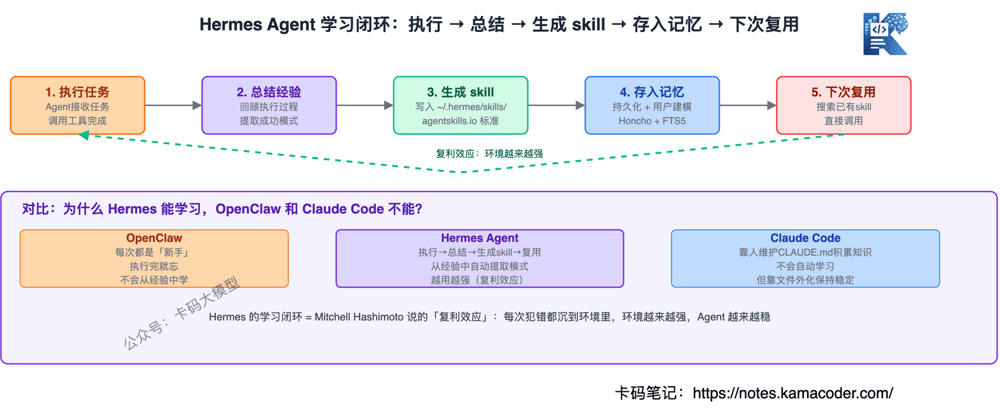
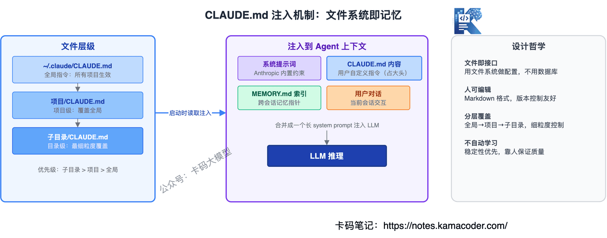
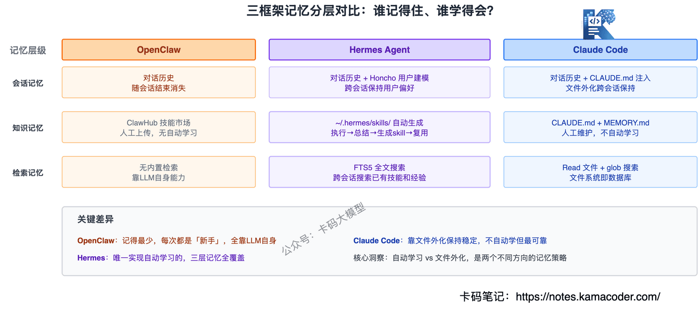
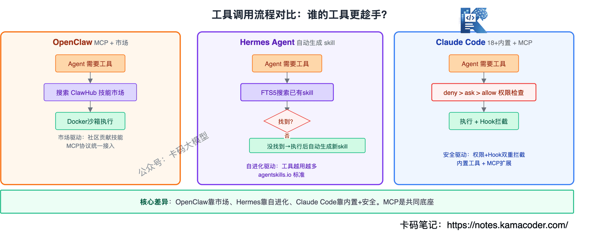
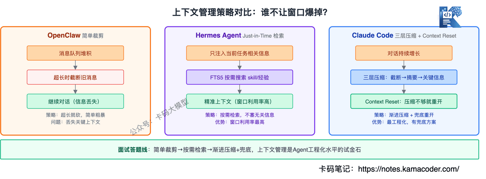
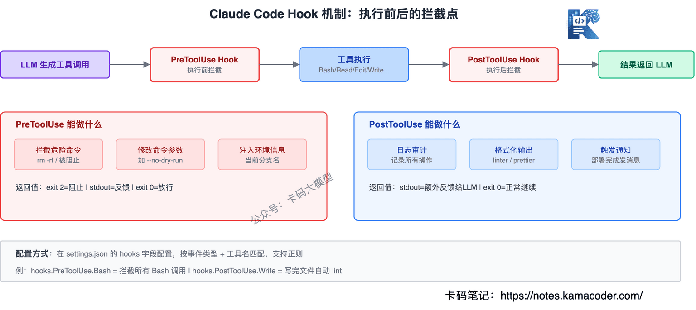
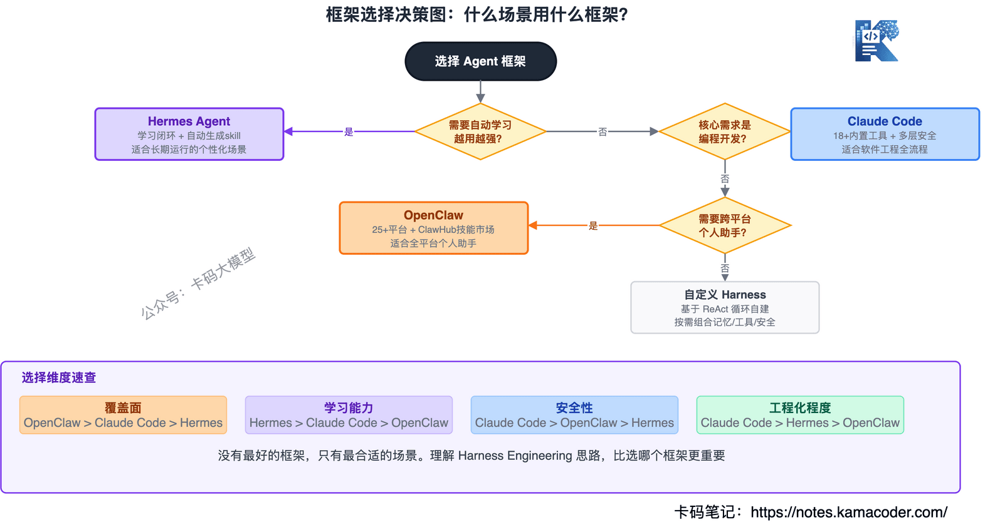

# Порівняння трьох фреймворків — OpenClaw, Hermes Agent і Claude Code: що треба знати на співбесіді

На співбесідах на розробку агентів інтерв'юери раз у раз питають: «**Які агентні фреймворки ви знаєте? Чим відрізняються їхні механізми пам'яті, виклик інструментів і керування контекстом?**»

Назвати OpenClaw, Hermes Agent і Claude Code можуть багато хто, але на першому ж уточненні все стає ясно: назви відомі, а що всередині — ні, і чим вони різняться — теж.

[На співбесіді в ByteDance](./20260506bytedance.md) траплялися саме такі глибокі питання: «як реалізовано систему пам'яті в цих трьох фреймворках» і «як улаштовані хуки в Claude Code».

Ця стаття порівнює всі три **від базової архітектури до ключових механізмів**.

**Позиціювання кожного одним реченням**: OpenClaw — персональний асистент для всіх платформ, Hermes Agent — агент, що самовдосконалюється, Claude Code — продуктовий агент для програмування. Усі три є конкретними реалізаціями Harness Engineering, але пішли різними шляхами.

Повний розбір Harness Engineering є в [окремій статті](./harness_interview.md), а глибокий розбір Claude Code — [тут](./claude_code_deep_dive.md). Ця стаття зосереджена на **порівнянні трьох**, тож деталі не повторюються.

---

## Зміст

* **1. Що це за три фреймворки і звідки вони взялися**
* **2. Архітектура: чим відрізняється базовий задум**
* **3. Пам'ять: як кожен керує станом**
* **4. Виклик інструментів: як кожен викликає інструменти**
* **5. Керування контекстом: що робити, коли вікно заповнене**
* **6. Безпека: як кожен убезпечується від провалів**
* **7. Коли що обирати**
* **8. Часті уточнення на співбесідах**

---

## 1. Що це за три фреймворки і звідки вони взялися

Інтерв'юер спитає: «Ви знайомі з OpenClaw, Hermes Agent і Claude Code? Що це таке?»

### OpenClaw: персональний асистент для всіх платформ

OpenClaw — відкритий персональний AI-асистент; його талісман — космічний лобстер на ім'я Molty, тож у спільноті його так і звуть «лобстером».

Ключове позиціювання — **месенджери насамперед, локальність насамперед**: один процес-шлюз з'єднує понад 25 платформ обміну повідомленнями (WhatsApp, Telegram, Slack, Discord та інші), тож ваш асистент є всюди.

OpenClaw спершу створила спільнота незалежних розробників, а згодом його придбала OpenAI. Тобто його не писала з нуля внутрішня команда великої компанії: спершу був продукт спільноти, і лише потім він потрапив під крило корпорації. Це походження й визначило його гени: **відкритість, відкритий код і рушій спільноти**.

Стек — TypeScript, працює локально, з пріоритетом приватності.

### Hermes Agent: агент, що самовдосконалюється

Hermes Agent — агент від Nous Research зі слоганом «The agent that grows with you» — «агент, що росте разом із вами».

Він зробив дуже важливий крок: **від системи виконання інструментів до системи самовдосконалення**. Усередині є цикл навчання (Learning Loop): агент породжує з досвіду нові вміння й наступного разу просто їх перевикористовує.

Стек — Python, а ключова відмінність — саме цикл навчання.

### Claude Code: продуктовий агент для програмування

Claude Code — офіційний помічник для програмування від Anthropic, той самий клас продуктів, що Cursor і Windsurf, але наразі єдиний, чий повний вихідний код одного разу став публічним: 31 березня 2026 року Anthropic випадково оприлюднила 512 000 рядків коду на TypeScript.

Цей витік уперше показав повну внутрішню структуру продуктового інструмента для програмування з AI: системний промпт, визначення інструментів, правила безпеки, архітектуру субагентів, стратегії керування контекстом.

Стек — TypeScript, а позиціювання — **спеціалізований агент для сценаріїв програмування**.

### Розрізнення одним реченням

| Фреймворк | Позиціювання | Ключова відмінність |
|------|-----------|-----------|
| OpenClaw | Персональний асистент для всіх платформ | Найширше покриття месенджерів, локальна приватність |
| Hermes Agent | Агент, що самовдосконалюється | Цикл навчання: що більше працює, то сильніший |
| Claude Code | Продуктовий агент для програмування | Гранична інженерність, найповніша безпека |


---

## 2. Архітектура: чим відрізняється базовий задум

Інтерв'юер спитає: «Чим відрізняється базова архітектура цих трьох фреймворків?»

### Як реалізовано цикл агента

Ядром усіх трьох є цикл: отримати задачу → подумати → виконати → подивитися на результат → продовжити або завершити. Але «спосіб оркестрації» циклу різний.

**OpenClaw: один агент, лінійний цикл**

OpenClaw має найпростішу структуру: один агент крутить один цикл, ви даєте йому повідомлення, він викликає інструменти й повертає результат. Ані субагентів, ані складної оркестрації — лінійний потік «вхід → виклик інструмента → вихід».

Просто, але складні задачі доводиться або ділити промптом, або планувати зовнішньою системою.

**Hermes Agent: один агент плюс паралельне делегування субагентам**

Hermes додав до одноагентного циклу можливість паралельно делегувати: головний агент роздає підзадачі субагентам, вони виконуються одночасно, а після зведення результатів головний агент вирішує далі.

Але важливіше те, що Hermes вбудував у цикл **цикл навчання**:

```
виконати задачу → підсумувати досвід → згенерувати скіл → зберегти в пам'ять → перевикористати наступного разу
```

Завдяки цьому Hermes не просто «зробив і забув», а стає дедалі сильнішим.



**Claude Code: while-цикл і три типи субагентів**

Ядро Claude Code — while-цикл, який безперервно крутить «подумав → зробив → подивився», доки модель сама не вирішить, що задачу виконано. Псевдокод — кілька рядків:

```
while (true) {
  response = claude.chat(messages)
  if (response.type === 'text') break    // модель вважає задачу виконаною
  if (response.type === 'tool_use') {
    result = executeTool(response.tool, response.params)
    messages.push(result)                 // результат іде в наступний раунд
  }
}
```

Але поверх цього простого циклу є три типи субагентів: Explore (пошук і дослідження), Plan (планування й декомпозиція) і General-purpose (універсальне виконання). Субагент має власне контекстне вікно, а після завершення повертає головному агентові лише підсумок, не забруднюючи головного вікна.

### Порівняння архітектур

| Вимір | OpenClaw | Hermes Agent | Claude Code |
|------|----------|-------------|-------------|
| Основний цикл | Один агент, лінійно | Один агент + паралельні субагенти | while-цикл + три типи субагентів |
| Спосіб оркестрації | Лінійне виконання | Паралельне делегування | Переважно послідовно, субагенти з окремим контекстом |
| Здатність навчатися | Немає | Цикл навчання | Немає (але знання проєкту накопичуються в CLAUDE.md) |
| Складні задачі | Поділ промптом | Паралельні субагенти | Ізольоване виконання субагентами |
| Мова | TypeScript | Python | TypeScript |


### Як відповідати на співбесіді

Спершу спільне: ядром усіх трьох є цикл ReAct. Далі відмінності: OpenClaw виконує лінійно й пасує одиничним задачам; Hermes додав паралельне делегування й цикл навчання, тож пасує довгим задачам, де потрібне накопичення досвіду; Claude Code ізолює складні задачі субагентами, і кожен має власне контекстне вікно, тож вони не забруднюють одне одного.

---

## 3. Пам'ять: як кожен керує станом

Це найважливіша тема співбесіди. Інтерв'юер спитає: «Як реалізовано систему пам'яті в кожному з трьох фреймворків? У чому різниця?»

### OpenClaw: вставляння файлів і локальна персистентність

Пам'ять OpenClaw тримається на трьох файлах:

- **AGENTS.md** — домовленості й контекст рівня проєкту, вставляються в кожен діалог;
- **SOUL.md** — «душа» агента: роль, характер, манера мовлення;
- **TOOLS.md** — опис доступних інструментів і правила їх використання.

На початку кожного діалогу вміст цих трьох файлів просто підставляється в системний промпт. Проміжні результати діалогу зберігаються в локальну файлову систему.

Проблема в тому, що **в OpenClaw немає пам'яті між сесіями**. Кожен діалог — це «новачок», який не пам'ятає, про що йшлося минулого разу й що вже зроблено. AGENTS.md — це написані вами правила, а не досвід, набутий агентом.

### Hermes Agent: шарувата пам'ять, моделювання користувача й пошук між сесіями

Пам'ять Hermes найглибша з трьох і має кілька шарів.

**Шар 1: персистентна пам'ять** — історія діалогів і результати виконання зберігаються локально, тож наступного запуску їх можна завантажити.

**Шар 2: моделювання користувача (Honcho)** — у Hermes вбудовано систему моделювання користувача, яка активно вивчає й фіксує його вподобання, звички й манеру працювати. Це не просто «пам'ятаю, що ви сказали минулого разу», а «розумію, який ви тип людини».

**Шар 3: пошук між сесіями (FTS5)** — через повнотекстовий пошук FTS5 у SQLite агент знаходить дотичні фрагменти в історії діалогів. Питаєте «як був написаний той скрипт розгортання минулого разу» — Hermes знайде це в попередніх сесіях.

**Шар 4: самонагадування** — Hermes сам собі нагадує: «цьому користувачеві минулого разу не сподобалися довгі відповіді», «у цьому проєкті TypeScript». Фактично агент пише собі пам'ятки.

Найважливіше те, що пам'ять Hermes не лише зберігає, а й **перетворюється на вміння**: виконавши складну задачу, він автоматично виділяє з досвіду патерн і генерує файл скіла в `~/.hermes/skills/`, а наступного разу на схожій задачі просто його перевикористовує.

### Claude Code: CLAUDE.md, тека .claude/ і винесений назовні стан

Система пам'яті Claude Code має три шари.

**Шар 1: CLAUDE.md (знання про проєкт)** — лежить у корені проєкту й описує домовленості, стек і стиль коду. Вставляється в кожен діалог, але не в системний промпт, а як повідомлення користувача: пріоритет нижчий за правила безпеки, але вищий за звичайні повідомлення. Це свідоме рішення Anthropic заради безпеки.

CLAUDE.md має ще й ієрархію: кореневий діє глобально, а `CLAUDE.md` у підтеці підставляється лише під час роботи з цією текою. Так різні модулі можуть мати різні домовленості.



**Шар 2: тека .claude/ (стан сесії)** — проміжний стан агента, прогрес задачі й висновки аналізу виносяться у файлову систему. Це і є «винесення стану назовні» з Harness Engineering: стан лежить не в контекстному вікні, а у файлах.

Перевага: навіть після скидання контексту (коли ціле вікно викидається й береться нове) достатньо прочитати файли, щоб зрозуміти, «на якому ми кроці».

**Шар 3: файлова система пам'яті** — Claude Code дозволяє тримати в теці `~/.claude/` довгострокову пам'ять між проєктами: уподобання користувача, типові патерни команд.

### Порівняння механізмів пам'яті

| Вимір | OpenClaw | Hermes Agent | Claude Code |
|------|----------|-------------|-------------|
| Робоча пам'ять | Підставляння AGENTS.md / SOUL.md / TOOLS.md | AGENTS.md + динамічне завантаження | CLAUDE.md як повідомлення користувача |
| Короткострокова пам'ять | Локальна персистентність у файлах | Історія діалогів + пошук FTS5 | Тека .claude/ + файли стану сесії |
| Довгострокова пам'ять | Немає | Моделювання користувача Honcho + пошук між сесіями | Тека ~/.claude/ + ієрархічні CLAUDE.md |
| Накопичення досвіду | Немає (щоразу новачок) | Цикл навчання: виконати → підсумувати → згенерувати скіл | Автоматичного немає, CLAUDE.md веде людина |
| Між сесіями | Не підтримується | Підтримується (FTS5 + Honcho) | Підтримується (винесення у файли) |
| Пошук у пам'яті | Немає | Повнотекстовий FTS5 + семантичне зіставлення | Читання файлів (інструмент Read) |



### Як відповідати на співбесіді

Спершу про шари: робоча пам'ять (підставляння правил) є в усіх трьох, а от короткострокова й довгострокова дуже різняться.

OpenClaw найпростіший: лише підставляння файлів, пам'яті між сесіями немає, щоразу «новачок».

Hermes найглибший: моделювання користувача, пошук між сесіями, цикл навчання; він автоматично породжує вміння з досвіду й стає дедалі сильнішим.

Claude Code найінженерніший: стан виноситься у файлову систему, CLAUDE.md підставляється ієрархічно, автоматичного навчання немає, зате є ізоляція заради безпеки. Ключове рішення — підставляти CLAUDE.md як повідомлення користувача, а не в системний промпт, щоб правила безпеки не можна було перекрити.

---

## 4. Виклик інструментів: як кожен викликає інструменти

Інтерв'юер спитає: «Чим відрізняються механізми виклику інструментів у цих трьох фреймворках?»

### OpenClaw: протокол MCP і маркетплейс скілів ClawHub

Система інструментів OpenClaw побудована на **протоколі MCP**: усі інструменти під'єднуються через стандартизований інтерфейс.

Є також **маркетплейс скілів ClawHub** — інструменти й пакети вмінь від спільноти: встановив і користуйся. Це наче магазин застосунків, і багата екосистема вмінь є великою перевагою OpenClaw.

Щодо середовища виконання, OpenClaw ізолює виконання інструментів через **пісочницю Docker** або SSH-бекенд: інструменти працюють у пісочниці й не чіпають хостову систему напряму.

### Hermes Agent: MCP і самопороджені вміння

Hermes теж використовує MCP, але зробив два кроки вперед у системі інструментів.

**По-перше, уміння можуть породжуватися автоматично**: вони беруться не лише від спільноти — виконавши задачу, агент сам підсумовує набір умінь і зберігає їх у `~/.hermes/skills/` за стандартом `agentskills.io`. Наступного разу на схожій задачі він шукає серед наявних умінь і перевикористовує їх.

**По-друге, білий список інструментів**: агентові доступні не всі інструменти MCP, а лише ті, що динамічно визначені під задачу. Це знижує ймовірність «обрати не той інструмент».

Hermes також підтримує шість типів термінальних бекендів (локальний, Docker, SSH, K8s тощо) для різних середовищ розгортання.

### Claude Code: понад 18 вбудованих інструментів і рівні прав

Claude Code не використовує протокол MCP як основу (хоча під'єднання MCP-серверів підтримує): він пішов шляхом **спеціалізованих вбудованих інструментів** — понад 18 інструментів визначено просто в коді, і в кожного є строга схема параметрів і правила використання.

Інструменти діляться на п'ять груп: робота з файлами (Read/Write/Edit/Glob/Grep), виконання (Bash/NotebookEdit), мережа (WebFetch/WebSearch), агентські (Agent/Skill) і взаємодія (AskUserQuestion/TodoWrite).

Найважливіше рішення — **рівні прав**:

```
deny > ask > allow
```

Перед кожним викликом інструмента перевіряється таблиця прав:

- **deny**: одразу відмова, виклику не буде;
- **ask**: питаємо користувача, і виконується лише після підтвердження;
- **allow**: виконується одразу.

Права налаштовуються з гранулярністю «інструмент + шлях»: наприклад, «дозволити читання теки src/, але запис у src/ лише з підтвердженням».

Є ще одне рішення: **спеціалізований інструмент має пріоритет над універсальною командою**. У системному промпті прямо написано «Prefer dedicated tools over Bash»: можна прочитати через Read — не викликайте `cat`; можна змінити через Edit — не викликайте `sed`. Бо в спеціалізованих інструментів краща обробка помилок і контроль прав.

### Порівняння виклику інструментів

| Вимір | OpenClaw | Hermes Agent | Claude Code |
|------|----------|-------------|-------------|
| Протокол інструментів | MCP | MCP | Вбудовані визначення + підтримка MCP-серверів |
| Джерело інструментів | Маркетплейс спільноти ClawHub | Автогенерація + стандарт agentskills.io | Понад 18 вбудованих |
| Ізоляція виконання | Пісочниця Docker/SSH | Шість термінальних бекендів | Локальне виконання + рівні прав |
| Контроль прав | Ізоляція пісочницею | Білий список інструментів | Три рівні deny > ask > allow |
| Стратегія вибору інструмента | Керується промптом | Динамічний білий список | Опис інструмента як правило + пріоритет спеціалізованих |
| Перевикористання вмінь | Завантаження з маркетплейсу | Автогенерація + стандарт спільноти | Виклик наперед визначених процесів через Skill |



### Як відповідати на співбесіді

Спершу спільне: усі три підтримують під'єднання зовнішніх інструментів через MCP. Далі відмінності: OpenClaw спирається на екосистему спільноти ClawHub — інструментів багато, але агент легко обирає не той; Hermes додав автогенерацію вмінь і динамічний білий список, щоб знизити ймовірність хибного вибору; Claude Code пішов шляхом спеціалізованих інструментів, де кожен має строге визначення й контроль прав, а правила використання вбудовані просто в опис інструмента — тобто подвійна страховка.

---

## 5. Керування контекстом: що робити, коли вікно заповнене

Інтерв'юер спитає: «Як ці три фреймворки керують контекстним вікном? Що робити, коли воно заповнене?»

### OpenClaw: підставляння файлів і динамічне обрізання

Керування контекстом в OpenClaw доволі просте: на початку діалогу підставляється вміст AGENTS.md, SOUL.md і TOOLS.md, а далі накопичується історія розмови.

Коли вікно майже заповнене, OpenClaw робить **динамічне обрізання**: найраніші повідомлення відкидаються за часом, а лишаються найсвіжіші. Це те саме ковзне вікно, що й у більшості чатів: просто й грубо, без тонших стратегій.

OpenAI свого часу наступила на ці граблі в Codex: спершу AGENTS.md перетворився на енциклопедію, він дедалі довшав, і увага моделі сильно розмивалася. Потім перейшли до режиму «змісту»: у головному файлі лишається близько 100 рядків ключового покажчика, а деталі виносяться в підлеглі документи, які агент підвантажує за потреби. Це і є **поступове розкриття (progressive disclosure)**.

### Hermes Agent: just-in-time retrieval і шарувате підставляння

Керування контекстом у Hermes тонше, і в основі лежить **just-in-time retrieval**: не запихати все одразу, а підтягувати потрібне вже під час роботи.

Стратегія шаруватого підставляння:

- **завжди підставляється**: ключові правила з AGENTS.md, мета поточної задачі;
- **підвантажується за потреби**: деталі вмінь, фрагменти минулих сесій, описи інструментів;
- **динамічно замінюється**: залежно від поточного кроку непотрібний уже контекст заміщується новим.

Hermes використовує FTS5 і для пошуку контексту: замість запихати всю історію у вікно, він шукає найдотичніші до поточної задачі фрагменти й підставляє лише їх.

### Claude Code: вікно на 200 тис., три шари стиснення й скидання контексту

Керування контекстом у Claude Code найінженерніше з трьох і має три шари.

**Шар 1: керування історією діалогу**

Контекстне вікно на 200 тис. токенів упорядковане за пріоритетом:

1. системний промпт (близько 8700 токенів, не стискається);
2. історія діалогу (останні N раундів зберігаються повністю);
3. результати інструментів (великі файли автоматично обрізаються).

**Шар 2: автоматичне стиснення**

Коли контекст наближається до межі вікна, Claude Code запускає стиснення:

- ранній діалог стискається в підсумок;
- з великих файлів, повернутих інструментами, лишаються лише ключові фрагменти;
- від виконання субагентів лишається тільки підсумок, а не весь процес.

**Шар 3: скидання контексту (Context Reset)**

Це ключове рішення, запропоноване Anthropic у Harness Engineering: коли стиснення вже не рятує, **усе контекстне вікно просто викидається й береться чисте**.

Звучить брутально, але логіка така: стан уже винесено у файлову систему, тож нове вікно просто читає файли й розуміє, «на якому ми кроці». Це значно краще, ніж тягнути далі в зіпсованому контексті.

Це як із витоком пам'яті: замість відчайдушно оптимізувати, простіше перезапустити процес і відновити стан із диска. **Перезапуск кращий за латання.**


### Порівняння керування контекстом

| Вимір | OpenClaw | Hermes Agent | Claude Code |
|------|----------|-------------|-------------|
| Контекстне вікно | Залежить від базової моделі | Залежить від базової моделі | 200 тис. токенів |
| Стратегія за повного вікна | Динамічне обрізання (ковзне вікно) | Пошук just-in-time | Три шари стиснення + скидання контексту |
| Стратегія щодо файлів правил | Підставляються повністю | Поступове розкриття | Ієрархічний CLAUDE.md, підставляється за текою |
| Керування історією | Обрізання старого | Пошук дотичних фрагментів через FTS5 | Стиснення в підсумок |
| Контекст субагентів | Не підтримується | Спільний для паралельних субагентів | Окреме вікно, повертається підсумок |



### Як відповідати на співбесіді

Спершу про головну суперечність: контекстне вікно є дефіцитним ресурсом, і всі три фреймворки розв'язують питання «що саме класти в обмежене вікно».

OpenClaw найпростіший — ковзне вікно з обрізанням старого. Hermes тонший — підвантажує за потреби й підставляє лише дотичні фрагменти. Claude Code найінженерніший — три шари стиснення, а якщо вже зовсім, то скидання контексту з відновленням стану з файлової системи.

Скидання контексту додає балів: поясніть ідею «перезапуск кращий за латання» й наголосіть, що передумовою є винесення стану у файли, інакше скидання справді означатиме амнезію.

---

## 6. Безпека: як кожен убезпечується від провалів

Інтерв'юер спитає: «Як ці фреймворки забезпечують безпеку? Хіба агент не наробить дурниць?»

### OpenClaw: ізоляція пісочницею

Безпека OpenClaw тримається головно на **ізоляції середовища виконання**: інструменти працюють у контейнері Docker або на віддаленій машині через SSH і не чіпають хостову систему напряму. Навіть якщо агент виконає небезпечну команду, наслідки обмежаться пісочницею.

Але тонкого контролю прав в OpenClaw немає: або в пісочниці можна все, або поза нею нічого. Бракує гранулярності на кшталт «це читати можна, а те писати не можна».

### Hermes Agent: шар обмежень і відновлення

Безпека Hermes втілена в шостому шарі harness — **обмеження й відновлення**:

- **обмеження**: що агентові робити не можна, зашито в код або в лінтер, а не в промпт;
- **перевірка**: до й після кожного кроку автоматична перевірка формату, вмісту й прав;
- **відновлення**: на кожну невдачу є план — обмеження швидкості API означає почекати й повторити, вичерпання токенів — зберегти прогрес.

Hermes також підтримує заплановані задачі (cron): можна налаштувати періодичні перевірки й самовиправлення.

### Claude Code: 23 шари перевірок безпеки й механізм хуків

Безпека Claude Code найповніша з трьох і складається з двох систем.

**Система 1: 23 послідовні шари перевірок**

Перед кожним викликом інструмента проходить 23 шари перевірок — від оцінки прав до перевірки вмісту й фільтрації чутливих даних. В основі — рівні прав `deny > ask > allow`:

1. спершу перевіряється список deny: те, що в ньому, одразу відхиляється;
2. далі список allow: те, що в ньому, одразу пропускається;
3. решта за замовчуванням іде в ask — питаємо користувача.

Права налаштовуються з гранулярністю «інструмент + шлях + параметр». Наприклад: «дозволити читати файли в src/, але запис у src/ потребує підтвердження, а видалення будь-якого файлу заборонено».

**Система 2: механізм хуків (додає балів на співбесіді)**

Хуки — дуже важливий механізм безпеки в Claude Code, і інтерв'юери про них питають особливо охоче.

Суть хука — **вставити власну логіку до й після виклику інструмента**. Працює це так:

```
ввід користувача → попередня обробка хуком → міркування моделі → виклик інструмента → постобробка хуком → результат
```

Хуки підтримують чотири події:

- **PreToolUse**: спрацьовує перед виконанням інструмента — можна перехопити, змінити параметри, записати лог;
- **PostToolUse**: спрацьовує після виконання — можна перевірити результат, додати дію, відфільтрувати чутливі дані;
- **Notification**: подія сповіщення — коли агент надсилає повідомлення користувачеві;
- **Stop**: подія зупинки — коли цикл агента завершується.

Конфігурація лежить у `.claude/settings.json`, наприклад:

```json
{
  "hooks": {
    "PreToolUse": [
      {
        "matcher": "Bash",
        "command": "check-dangerous-cmd.sh"
      }
    ],
    "PostToolUse": [
      {
        "matcher": "Write",
        "command": "scan-secrets.sh"
      }
    ]
  }
}
```

Ця конфігурація означає: перед кожним викликом Bash запускається `check-dangerous-cmd.sh` і перевіряє, чи команда небезпечна; після кожного виконання Write запускається `scan-secrets.sh` і сканує, чи не записано чутливих даних.



**Чому хуки важливі?** Бо вони перетворюють правила безпеки з «написано в промпті, і модель має їх свідомо дотримуватися» на «зашито в рівень виконання й застосовується примусово». Обійти правила з промпта модель цілком може, а от хук — ні: він перехоплює на рівні коду, і модель його не бачить і не змінює.

### Порівняння механізмів безпеки

| Вимір | OpenClaw | Hermes Agent | Claude Code |
|------|----------|-------------|-------------|
| Основна стратегія | Ізоляція пісочницею | Шар обмежень і відновлення | 23 шари перевірок + хуки |
| Гранулярність прав | Рівень пісочниці (усе або нічого) | Білий список інструментів | Інструмент + шлях + параметр |
| Спосіб застосування правил | Ізоляція середовища | Зашито в код | deny > ask > allow + хуки |
| Аудит постфактум | Базові логи | Самонагадування + підсумки моделлю | PostToolUse + журнал аудиту |
| Захист чутливих даних | Ізоляція пісочницею | Шар перевірки | 23 шари перевірки вмісту + сканування хуком |
| Власна логіка безпеки | Немає | Правила лінтера | Скрипти хуків |


### Як відповідати на співбесіді

Спершу про різницю підходів: OpenClaw спирається на ізоляцію (пісочниця), Hermes — на обмеження (зашиті в код), Claude Code — на шарувату перевірку плюс хуки.

Хуки додають балів: поясніть, що вони вставляють власну логіку до й після виклику інструмента й перетворюють правила безпеки з «покладаємося на промпт» на «примусово виконує код». Правила з промпта модель може обійти, а хук — ні.

---

## 7. Коли що обирати

Інтерв'юер спитає: «Для яких сценаріїв пасує кожен із трьох фреймворків?»

### За сценарієм



**OpenClaw** — коли потрібен **AI-асистент, доступний на всіх платформах**, який відповідає в Telegram, Discord, Slack чи будь-де ще. Працює локально, приватність збережена. Найкраще пасує особистому використанню.

**Hermes Agent** — коли потрібен **агент, що стає сильнішим із часом**: учиться з досвіду, сам породжує нові вміння й пам'ятає ваші вподобання між сесіями. Найкраще пасує довготривалим агентам: постійній експлуатації, особистому керуванню знаннями.

**Claude Code** — коли потрібен **безпечний і керований агент для програмування**, здатний працювати в реальному репозиторії, з повноцінним керуванням правами й механізмом хуків. Найкраще пасує командній роботі й продакшн-програмуванню.

### За стадією команди

| Стадія | Рекомендація | Чому |
|------|------|------|
| Окремий розробник | OpenClaw | Швидкий старт, покриття всіх платформ, багата екосистема спільноти |
| Хочете систему, що самовдосконалюється | Hermes Agent | Цикл навчання є ключовою перевагою |
| Корпоративне програмування | Claude Code | Найповніша безпека, найтонша гранулярність прав |
| Співпраця кількох агентів | Hermes Agent | Паралельне делегування субагентам |
| Довгі ланцюжки задач | Claude Code | Скидання контексту + винесення стану |

### Зауваження: вони не конфліктують

Ці три фреймворки не є вибором «або — або». У Hermes є команда `hermes claw migrate` для імпорту конфігурації з OpenClaw. Claude Code теж підтримує під'єднання MCP-серверів, тож з екосистемою інструментів OpenClaw його можна зв'язати.

У реальному проєкті їх цілком можна комбінувати: OpenClaw як вхідна точка для повідомлень, Hermes для фонового самовдосконалення, Claude Code для редагування коду.

---

## 8. Часті уточнення на співбесідах

### Про розуміння понять

**Q: Чому ці три фреймворки порівнюють разом? Що в них спільного?**

Усі три є конкретними реалізаціями Harness Engineering: агент = модель + harness, і всі три роблять саме шар harness. Спільне: цикл ReAct, підтримка протоколу інструментів MCP, керування контекстом. Відмінність — в акцентах на шести компонентах harness: OpenClaw робить наголос на екосистемі інструментів, Hermes — на циклі навчання, Claude Code — на механізмах безпеки.

**Q: Чому інтерв'юери люблять питати саме про ці три?**

Бо вони уособлюють три напрямки еволюції агентних фреймворків: OpenClaw — «система виконання інструментів» (агент здатен працювати), Hermes — «система самовдосконалення» (агент працює дедалі краще), Claude Code — «система інженерної безпеки» (агент працює стабільно). Питаючи про них, інтерв'юер перевіряє ваше розуміння напрямку розвитку агентів.

### Про технічні деталі

**Q: Як саме працює цикл навчання в Hermes?**

Виконавши складну задачу, агент автоматично виділяє з досвіду патерн і генерує файл скіла в `~/.hermes/skills/`. Наступного разу на схожій задачі він шукає серед наявних скілів, перевикористовує їх і водночас поліпшує в процесі. Це перегукується з ідеєю складних відсотків: кожна помилка осідає в середовищі, середовище стає сильнішим, а агент стабільнішим. В OpenClaw такого немає: там щоразу «новачок».

**Q: Як реалізовано хуки в Claude Code? У чому конкретний механізм?**

Хук — це механізм вставляння власних скриптів до й після виклику інструмента. Підтримуються чотири події: PreToolUse (перехопити чи змінити перед виконанням), PostToolUse (перевірити чи відфільтрувати після), Notification, Stop. Конфігурація лежить у `.claude/settings.json`: matcher зіставляє назву інструмента, command вказує скрипт. Ключове: хук виконується на рівні коду, модель його не бачить і не змінює, тож він надійніший за обмеження в промпті.

**Q: Чому CLAUDE.md підставляється як повідомлення користувача, а не в системний промпт?**

Це рішення заради безпеки. Системний промпт має найвищий пріоритет, і якби CLAUDE.md лежав там, користувацькі інструкції були б нарівні з правилами безпеки Anthropic, і через них можна було б обійти обмеження. Як повідомлення користувача він має пріоритет нижчий за правила безпеки, але вищий за звичайні повідомлення — це баланс між безпекою й гнучкістю.

**Q: Чим скидання контексту відрізняється від стиснення? Коли що застосовувати?**

Стиснення зводить історію діалогу в підсумок: місце вивільняється, але модель лишається «втомленою». У Cognition (творці Devin) помітили, що в довгому контексті в моделі виникає «контекстна тривожність»: навіть коли місця вистачає, вона прагне швидше згорнути роботу. Скидання брутальніше: усе вікно викидається, береться нове, а стан відновлюється з файлової системи. Плюс — у моделі немає «втоми»; мінус — потрібне повне винесення стану назовні. Зазвичай спершу застосовують стиснення, а коли його вже не досить — скидання.

### Про продакшн

**Q: Як ви оцінювали фреймворки під час вибору?**

Спершу за сценарієм: потрібне покриття всіх месенджерів — OpenClaw, потрібне самовдосконалення — Hermes, потрібен контроль безпеки в програмуванні — Claude Code. Далі за стеком команди: TypeScript — OpenClaw або Claude Code, Python — Hermes. І наостанок за вимогами безпеки: корпоративний рівень — Claude Code (23 шари перевірок і хуки), особистий проєкт — можна OpenClaw. До того ж вони не конфліктують і можуть використовуватися разом.

**Q: Що робити, коли AGENTS.md дедалі довшає й результат гіршає?**

На ці граблі наступала й сама OpenAI: у ранньому Codex AGENTS.md перетворився на енциклопедію, і агент лише більше плутався. Розв'язок — поступове розкриття: у головному файлі лишається ключовий покажчик (близько 100 рядків), детальні правила виносяться в підлеглі документи, а агент підвантажує їх за потреби. Agent Skills від Anthropic побудовані на тій самій ідеї: не запихати все одразу, а підставляти динамічно за потреби. Якщо ви зараз пишете CLAUDE.md або правила для Cursor, перевірте, чи не перетворюються вони на енциклопедію, — і якщо так, розділіть.

---

## Наостанок

Три фреймворки — три напрямки еволюції: OpenClaw робить агента **здатним працювати** (усі платформи плюс екосистема інструментів), Hermes робить його **дедалі сильнішим** (цикл навчання), Claude Code робить його **стабільним** (інженерна безпека).

На співбесіді не обмежуйтеся назвами. Інтерв'юер хоче почути ваше розуміння цих трьох напрямків: чому агентові треба пройти шлях від «здатен працювати» до «дедалі сильніший» і далі до «працює стабільно»? Бо в реальному продакшні «працює» не дорівнює «надійно», а «працює» не дорівнює «стало».

Запам'ятайте цю лінію: **виконання інструментів → самовдосконалення → інженерна безпека**. Коли вас питають, «як обирати агентний фреймворк», відповідайте за нею.
