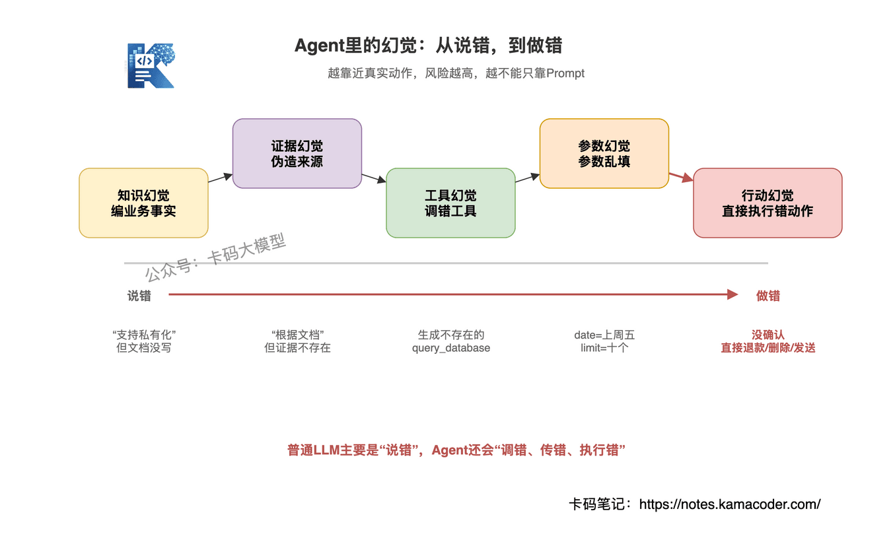

# Як агентна система стримує галюцинації моделі й що робити, коли вони все одно виникають

Раніше була стаття [Дрейф контексту й галюцинації виклику інструментів](./agent_drift_hallucination_interview.md) — там ішлося про те, чому виникають дрейф і галюцинації в інструментах.

Ця продовжує: **як системно стримувати галюцинації і що робити, коли попри обмеження вони все одно з'являються.**

Це класичне питання співбесіди про агентів.

«Як у вашій агентній системі стримуються галюцинації моделі? А якщо після всіх обмежень галюцинація все одно сталася, що робити?»

На це питання дуже легко відповісти поверхово.

Багато хто одразу каже: «Я напишу в промпті, щоб модель не вигадувала й казала "не знаю", коли не знає».

Це правильно?

Правильно, але надто поверхово.

Бо агент — не звичайний чат-бот. У звичайної LLM галюцинація щонайбільше означає одну хибну фразу; а галюцинація агента може призвести до виклику не того інструмента, хибних параметрів, посилання на неіснуючі докази й навіть до виконання дії, якої робити не можна було.

**Проблему галюцинацій в агентах одним реченням у промпті не закрити.**

Справжнє інженерне розв'язання обмежує весь ланцюжок: вхід, інструменти, докази, вивід і запобіжники.

## Зміст

1. Спершу з'ясуймо: галюцинації в агентах бувають різні
2. Загальний підхід: не сподівайтеся, що одна лінія оборони закриє все
3. Лінія 1: обмеження в промпті — задають межі, але не тримають усього
4. Лінія 2: обмеження викликів інструментів — щоб агент не діяв навмання
5. Лінія 3: обмеження доказами — щоб відповідь мала на що спиратися
6. Лінія 4: валідація виводу — генерація ще не є завершенням
7. Галюцинація попри обмеження: що робити
8. Як керувати галюцинаціями в довгій перспективі
9. Як відповідати на співбесіді

## 1. Спершу з'ясуймо: галюцинації в агентах бувають різні

Коли інтерв'юер питає, «як ви працюєте з галюцинаціями в агентах», не починайте одразу з промпта.

Спершу розкладіть типи галюцинацій.

Бо в різних типів різні причини — а отже, і різні розв'язки.

### 1.1. Знаннєва галюцинація

Найпоширеніша: модель вигадує неіснуючі факти.

Скажімо, користувач питає: «Чи підтримує цей продукт розгортання у власному контурі?»

У документації цього немає, а модель відповідає: «Підтримує, і навіть розгортання в Kubernetes».

Це знаннєва галюцинація.

Проблема тут у тому, що **модель силоміць переносить загальний досвід із тренувальних даних на ваш конкретний бізнес.**

### 1.2. Інструментальна галюцинація

Агент викликає неіснуючий інструмент або приписує інструментові більше можливостей, ніж той має.

Скажімо, у системі є лише `search_docs`, а він генерує `query_database`.

Ця галюцинація небезпечніша за знаннєву, бо вже впливає на ланцюжок виконання.

### 1.3. Параметрична галюцинація

Інструмент правильний, а параметри вигадані.

Наприклад, інтерфейс вимагає:

```json
{
  "date": "YYYY-MM-DD",
  "limit": "number"
}
```

А модель передає:

```json
{
  "date": "минула п'ятниця",
  "limit": "десять"
}
```

Назву інструмента вгадано правильно, але параметри не відповідають схемі — і проблема однаково буде.

### 1.4. Доказова галюцинація

Найчастіше трапляється в сценаріях RAG.

Модель нічого дотичного в документах не знайшла, але каже: «Згідно з документацією…»

Або документ A каже лише «повернення коштів підтримується», а модель відповідає «підтримується повернення протягом 7 днів без пояснення причин».

**Ця галюцинація найпідступніша, бо вбрана в шати «джерело є».**

### 1.5. Дієва галюцинація

Найнебезпечніший тип в агентних системах.

Те, що треба підтвердити, не підтверджується; те, що треба погодити, не погоджується; те, що мало бути лише читанням, ненароком стає записом.

Скажімо, користувач лише питає: «Подивися, чи можна повернути кошти за це замовлення».

А агент одразу викликає ендпоїнт повернення й повертає гроші.

Це вже не хибна відповідь, а системний інцидент.



Тож про галюцинації агента не можна казати просто «модель вигадує».

Точніше буде так: **галюцинація агента — це некерована генерація у фактах, інструментах, параметрах, доказах і діях.**

## 2. Загальний підхід: не сподівайтеся, що одна лінія оборони закриє все

Стримувати галюцинації одним шаром не вийде.

Чи треба писати промпт?

Звісно, треба.

Але промпт — це лише перше нагадування про межі, а не сейф.

Справжня інженерна оборона має щонайменше чотири лінії:

1. **обмеження в промпті**: сказати моделі, що можна робити, а чого ні;
2. **обмеження інструментів**: обмежити, які інструменти вона може викликати і як заповнювати параметри;
3. **обмеження доказами**: вимагати, щоб у відповіді було джерело, а без доказів — відмова;
4. **валідація виводу**: після генерації ще раз перевірити, а не пускати результат до користувача без нагляду.


Ці чотири лінії розв'язують різні задачі.

Обмеження в промпті дає моделі знати межі.

Обмеження інструментів не дає їй діяти навмання.

Обмеження доказами не дає вигадувати факти з повітря.

Валідація виводу забезпечує приймання після того, як модель сказала своє.

**Якщо на співбесіді ви назвете ці чотири лінії, це вже клас вище за тих, хто вміє лише про промпт.**

## 3. Лінія 1: обмеження в промпті — задають межі, але не тримають усього

Промпт робити обов'язково.

Але треба знати межі його спроможностей.

### Що промпт може

Він може чітко викласти правила системи:

- не знаєш — кажи, що не знаєш;
- відповідай лише за результатами інструментів і знайденими документами;
- не додавай інформації, якої в документах немає;
- ризиковані дії спершу підтверджуй;
- у виводі має бути джерело або рівень упевненості.

Наприклад, системний промпт може виглядати так:

```text
Відповідай лише на основі наданих результатів інструментів і знайдених документів.
Якщо в доказах немає дотичної інформації, обов'язково відповідай «у наявних матеріалах не згадано».
Для операцій запису — оплати, повернення коштів, видалення, надсилання листів — спершу підтвердь дію з користувачем і не виконуй її самостійно.
```

Такий промпт дуже корисний.

Він принаймні дає моделі знати межі.

### Чого промпт не втримає

Але самим промптом не втримати ось чого:

- чи існує названий інструмент насправді;
- чи відповідає тип параметрів вимогам інтерфейсу;
- чи справді знайдені документи підтверджують відповідь;
- чи справді заблоковано ризиковану операцію;
- чи узгоджений вивід моделі з доказами.

Чому?

Бо промпт по суті лишається обмеженням природною мовою.

Це «сподіваємося, модель дотримається», а не «система примусово виконує».

**Якщо сказати лише «я написав у промпті, щоб модель не галюцинувала», інтерв'юер одразу зрозуміє, що продакшну у вас не було.**


Правильна постава така: промпт декларує правила, а інженерний рівень їх примусово виконує.

## 4. Лінія 2: обмеження викликів інструментів — щоб агент не діяв навмання

Головна відмінність агента від звичайної LLM у тому, що агент викликає інструменти.

Тож галюцинація агента часто полягає не в тому, що він «сказав не те», а в тому, що він «зробив не те».

Завдання шару інструментів — не довіряти моделі, а обмежувати її.

### 4.1. Білий список інструментів

Не відкривайте агентові всі інструменти.

Для поточної задачі давайте лише ті, що потрібні саме зараз.

Якщо користувач просто питає по базі знань, не давайте інструментів повернення коштів, видалення чи надсилання пошти.

Тоді навіть якщо модель захоче зробити зайве, викликати їй буде нічого.

### 4.2. В описі інструмента мають бути межі

Опис не може бути просто таким:

```text
search_order: пошук замовлення
```

Занадто грубо.

Треба писати так:

```text
search_order: інструмент лише для читання; за ID замовлення повертає статус, суму й час.
Не може змінювати замовлення, не може повертати кошти, не може запитувати приватні поля користувача.
```

Що розмитіший опис інструмента, то легше модель ним зловживає.

### 4.3. Перевірка схеми параметрів

У параметрів інструмента обов'язково має бути схема.

Типи, перелічення, обов'язкові поля, формат — усе має бути обмежене.

Наприклад:

```json
{
  "type": "object",
  "properties": {
    "order_id": {
      "type": "string",
      "description": "ID замовлення"
    },
    "action": {
      "type": "string",
      "enum": ["query", "refund_preview"]
    }
  },
  "required": ["order_id", "action"]
}
```

Якщо модель передала хибні параметри, виконувати не можна.

Або повертаємо на повтор, або переходимо в понижений режим.

### 4.4. Observation має походити зі справжнього результату інструмента

Це дуже важливий момент.

Результат інструмента модель не має вигадувати сама.

У циклі агента `Observation` мусить бути справжнім результатом виконання, а не згенерованою моделлю фразою «результати запиту такі».

Інакше виклик інструмента втрачає сенс.

### 4.5. Ризиковані інструменти потребують погодження

Інструменти лише для читання й інструменти запису мають бути розділені.

Запит замовлення — це одне, а повернення коштів — зовсім інше.

Для ризикованих дій треба щонайменше:

- повторне підтвердження користувачем;
- перевірку прав;
- пороги за сумою й обсягом;
- погодження людиною;
- ідемпотентність і механізм відкату.

**Найстрашніше в агентній системі не те, що модель чогось не знає, а те, що вона впевнено виконує хибну дію.**


## 5. Лінія 3: обмеження доказами — щоб відповідь мала на що спиратися

Багато хто вважає, що з під'єднаним RAG галюцинацій не буде.

Це теж хиба.

RAG лише дає моделі зовнішні докази, але не гарантує, що модель їх дотримається.

У статті [Де RAG найважче впровадити](./rag_hardest_parts_interview.md) ми бачили: найважче в RAG не якась одна ланка, а каскадне підсилення помилок у трьох — попередній обробці документів, якості відбору й вірності генерації.

В агентній системі шар доказів має робити щонайменше п'ять речей.

### 5.1. Спершу пошук, потім відповідь

Для питань про бізнес-факти, правила продукту й політики компанії не давайте моделі відповідати з пам'яті.

Спершу пошук.

Хоч якою обізнаною вона є з тренувальних даних, вона не знає правил повернення коштів, які ви оновили вчора.

### 5.2. Обов'язкове посилання на джерело

У відповіді має бути простежуваність до документа.

Наприклад:

```text
Згідно з розділом 3 «Правил повернення коштів», для невідправлених замовлень підтримується повернення тим самим способом оплати.
```

Це потрібно не для солідності, а щоб змусити модель прив'язати висновок до доказу.

### 5.3. Нічого не знайшли — відмовляємося відповідати

Якщо результат пошуку порожній або релевантність низька, не треба відповідати силоміць.

Правильна відповідь:

```text
У наявних матеріалах дотичних правил не знайдено, підтвердити неможливо.
```

Це значно краще, ніж вигадана, але правдоподібна відповідь.

### 5.4. Rerank знижує шум

Багато знайдених документів не означає сильних доказів.

Якщо взяти завелике Top-K, у контекст потрапить шум — і модель радше зіб'ється.

Типова інженерна практика: спершу грубий відбір, потім rerank, а моделі віддаються лише найдотичніші докази.

### 5.5. Перевірка узгодженості відповіді й доказів

Після генерації ще раз перевіряємо:

- чи є ключові висновки з відповіді в доказах?
- чи збігаються числа, дати й обмеження?
- чи не додала модель того, чого в документі немає?

Тут можна використати правила, а можна легку модель у ролі LLM-as-Judge.

Але зважайте: суддя теж помиляється, тож у ризикованих сценаріях не покладайтеся лише на нього — поєднуйте з правилами й ручною перевіркою.


## 6. Лінія 4: валідація виводу — генерація ще не є завершенням

Багато систем вважають «модель згенерувала відповідь» останнім кроком.

Це неправильно.

В агентній системі після генерації має бути приймання.

### 6.1. Валідація структурованого виводу

Якщо можна JSON — не давайте моделі писати вільно.

Скажімо, для класифікації тікетів підтримки вивід має бути таким:

```json
{
  "category": "refund",
  "confidence": 0.86,
  "need_human": false,
  "evidence_ids": ["doc_102", "doc_305"]
}
```

Тоді можна перевірити, чи не бракує полів, чи допустимі значення переліку й чи не нижча впевненість за поріг.

Вільний текст виглядає гладко, але керувати ним важко.

### 6.2. Перевірка бізнес-правил

Модель каже «повернення можливе», а система ще має перевірити:

- чи існує замовлення;
- чи не минув термін повернення;
- чи не аномальна сума;
- чи має користувач права;
- чи дозволяє поточний статус повернення.

Це не можна віддавати на вільний розсуд моделі.

Страхувати має бізнес-код.

**Детерміновані правила не віддавайте на відкуп імовірнісній моделі.**

### 6.3. Перевірка чутливого вмісту

Для медицини, права, фінансів, приватності й внутрішніх даних компанії потрібна додаткова перевірка.

Наприклад:

- чи не розкрито персональні дані;
- чи не дано порад поза повноваженнями;
- чи немає непідтверджених висновків;
- чи не подано пораду як доконаний факт.

У таких сценаріях моделі краще давати лише рекомендацію, а не остаточне рішення.

### 6.4. Кілька моделей або двоетапна перевірка

У складних сценаріях можна додати рев'юера:

етап 1 — Generator генерує відповідь;

етап 2 — Reviewer перевіряє, чи підкріплена вона доказами, чи не порушує правил і чи не потрібне втручання людини.

Це і є ідея Reflection / Review.

Але не зловживайте.

Кожен додатковий виклик моделі підвищує вартість і затримку.

Для простого FAQ це зайве, а для ризикованих дій — виправдано.

## 7. Галюцинація попри обмеження: що робити

Це улюблене уточнення інтерв'юерів.

Бо в реальності агента без галюцинацій на 100 % не буває.

Не можна казати: «Після моїх обмежень галюцинацій не буде».

Це звучить нещиро.

Краща відповідь така: **я визнаю, що галюцинації не усунути повністю, тож у системі є перехоплення, пониження режиму, запис і подальший розбір.**

### 7.1. Спершу перехоплення

У таких випадках результат не можна віддавати користувачеві:

- немає джерела доказів;
- низька впевненість;
- валідація виводу не пройдена;
- параметри інструмента недійсні;
- ризиковану дію не підтверджено;
- результат суперечить доказам.

Перехоплення — це не поразка, а захист системи.

### 7.2. Далі пониження режиму

Що робити після перехоплення? Залежить від сценарію:

- перегенерувати сильнішою моделлю;
- повернути лише знайдені початкові докази;
- попросити користувача доповнити інформацію;
- передати людині;
- для операцій запису — просто спинити виконання.

Скажімо, користувач питає про політику, а в моделі немає доказів: тоді просто показуємо знайдені документи, щоб він прочитав сам, і не даємо моделі їх переказувати.

### 7.3. Ризиковані дії треба відкочувати або погоджувати

Якщо галюцинація зачепила операцію запису, самим «перегенеруймо відповідь» не обійтися.

Помилковий лист, помилкове повернення коштів, помилкове видалення даних — це інциденти на рівні дій.

Тож ризиковані інструменти треба проєктувати заздалегідь:

- процес погодження;
- ідемпотентність;
- механізм відкату;
- журнал операцій;
- ізоляція прав.

Інакше після інциденту ви навіть не знатимете, як відновлюватися.

### 7.4. Трасування обов'язкове

Щойно виникла галюцинація, її треба мати змогу розібрати.

Записувати щонайменше:

- початковий ввід користувача;
- системний промпт;
- знайдені документи;
- параметри викликів інструментів;
- справжні відповіді інструментів;
- кінцевий вивід моделі;
- причину невдалої валідації;
- trace_id.

Без трасування немає розбору.

Без розбору галюцинації повторюватимуться.


## 8. Як керувати галюцинаціями в довгій перспективі

Продакшн-запобіжники лише спиняють кровотечу.

Щоб справді знизити частку галюцинацій, потрібне довгострокове керування.

### 8.1. Спершу класифікувати причини

Кожен випадок галюцинації треба віднести до причини.

Що саме сталося:

- нечітко написані межі в промпті?
- надто розмитий опис інструмента?
- надто вільна схема параметрів?
- RAG не знайшов потрібного документа?
- rerank підняв шум угору?
- валідація виводу не спрацювала?

Без класифікації причин далі можна лише правити навмання.

### 8.2. Додати зразок інциденту в набір для оцінювання

Це часто забувають.

Галюцинація сталася — і справа не закінчується виправленням промпта.

Невдалий випадок треба додати в набір для оцінювання.

Тоді після кожної зміни промпта, інструмента чи RAG проганяється регресійний тест.

Інакше ви виправите один випадок і зламаєте інший.

### 8.3. Побудувати метрики моніторингу

Галюцинації не можна виявляти лише зі скарг користувачів.

Моніторити варто щонайменше:

- частку відповідей без доказів;
- частку відповідей, коли пошук нічого не знайшов;
- частку невдалих викликів інструментів;
- частку невдалої перевірки параметрів;
- частку невдалої валідації виводу;
- частку передавань людині;
- частку виправлень від користувачів.

Ці метрики потрібні не для краси, а щоб бачити, де система псується.

### 8.4. Різні рівні безпеки для різних сценаріїв

Не всім сценаріям потрібна однакова оборона.

Для балачки можна легше.

Для бізнес-консультацій потрібні обмеження доказами.

Для операцій запису — погодження.

Для медицини, фінансів і права — суворіше: часто можна давати лише рекомендацію, а не ухвалювати рішення за користувача.

**Рівень безпеки має відповідати рівню ризику.**

Не ставте важку оборону на просту задачу й не пускайте ризиковану задачу без захисту.

## 9. Як відповідати на співбесіді

Коли інтерв'юер питає, «як агентна система стримує галюцинації і що робити, коли попри обмеження вони виникають», не обмежуйтеся «я напишу промпт».

Покажіть, що ви знаєте типи галюцинацій, ланцюжок і запобіжники.

**Орієнтовна відповідь:**

«Я не стримую галюцинації самим лише промптом. Галюцинації агента бувають не лише знаннєвими: є ще інструментальні, параметричні, доказові й дієві, тож працювати треба пошарово.

**Перша лінія — обмеження в промпті**: чітко сказати, що за браку знань треба відмовитися, відповідати лише за доказами, а ризиковані дії підтверджувати. Але промпт — це нагадування про межі, а не примусовий механізм.

**Друга лінія — обмеження інструментів.**

Для поточної задачі відкриваються лише потрібні інструменти, в описі інструмента чітко окреслені межі його можливостей, параметри обов'язково перевіряються за схемою, а Observation має походити зі справжньої відповіді інструмента. Для операцій запису — контроль прав, повторне підтвердження й погодження.

**Третя лінія — обмеження доказами.**

Питання про бізнес-факти потребують спершу пошуку, у відповіді має бути джерело, а якщо нічого не знайдено — відмова. Після генерації ще перевіряється узгодженість відповіді з доказами, щоб модель не дописала того, чого в документах немає.

**Четверта лінія — валідація виводу.**

У структурованому виводі перевіряються поля, переліки й рівень упевненості, бізнес-правила страхує детермінований код, а в ризикованих сценаріях можна додати рев'юера або ручну перевірку.

Якщо попри все галюцинація сталася, у продакшні результат не пропускається: спершу перехоплення, далі пониження за сценарієм — сильніша модель, повернення самих доказів, прохання доповнити інформацію, передавання людині, а для операцій запису — зупинка або погодження.

Водночас зберігається трасування: промпт, знайдені документи, параметри інструментів, їхні відповіді й вивід моделі. Після інциденту зразок додається в набір для оцінювання, правляться промпт, схема інструмента, відбір у RAG і валідація виводу, а моніторяться частка відповідей без доказів, частка невдалих викликів інструментів, частка передавань людині та інші метрики».

Головне в цій відповіді не обіцянка, що «агент не галюцинуватиме».

А те, що ви кажете інтерв'юерові: **я знаю, що галюцинація можлива завжди, тож у мене є пошарові обмеження, продакшн-запобіжники й подальше керування.**

Оце й є підхід продакшн-системи.
