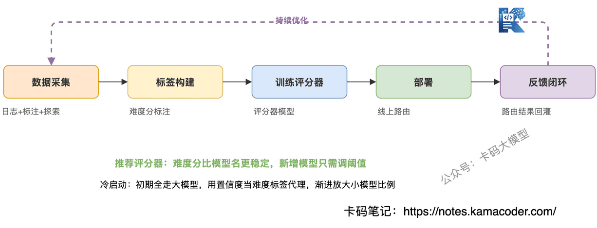
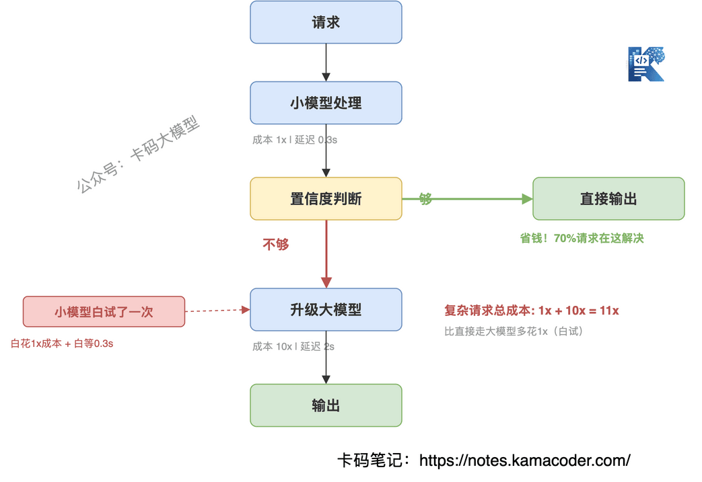

# Гібридна маршрутизація агентів: від «усім однаково» до «кожному своє»

У [розповіді про чотири раунди співбесіди на позицію розробника агентів у ByteDance](./20260506bytedance.md) є питання інтерв'юера: що таке оптимізація гібридної маршрутизації в агентах?

Не всі знають, що це взагалі таке.

Оптимізація гібридної маршрутизації в агентах означає передусім таке: динамічно обирати різні моделі або шляхи виконання залежно від складності задачі — прості задачі віддавати малій моделі (швидко й дешево), складні великій (точно, але дорого), а між ними ставити модель-маршрутизатор, яка ухвалює рішення.

Якщо ваш агент щоразу викликає GPT-5.5 і крутить десяток раундів, долари течуть рікою.

А придивившись до цих викликів, ви побачите, що 80 % із них — прості задачі: побалакати, відповісти на FAQ, змінити формат. Малої моделі там цілком вистачило б.

**Коли всім однаково дається велика модель, гроші згоряють, швидкість падає, а якість на простих задачах майже не краща за малу модель.**

Цю думку багато хто розуміє: прості задачі — дешевій моделі. Але далі виникає питання: а яка задача проста і як це визначити?

Ця стаття розбирає маршрутизацію в агентах: **як зробити, щоб агент у кожному сценарії брав відповідну модель — і економив, і не втрачав якості.**

## Зміст

1. Навіщо маршрутизація: одна модель не витягує
   - Симптом: велика модель не панацея
   - Причина: асиметрія вартості й якості
2. Три стратегії маршрутизації
   - За правилами: швидко, але негнучко
   - За моделлю: гнучко, але потрібні дані
   - Гібридна: інженерний оптимум
3. Як навчати маршрутизатор
   - Звідки брати дані
   - Класифікатор чи оцінювач
   - Проблема холодного старту
4. Каскадне пониження: спершу мала модель, якщо не вийшло — велика
   - Схема каскаду
   - Порахуймо гроші
   - Пастки каскаду
5. Як відповідати на співбесіді

## 1. Навіщо маршрутизація: одна модель не витягує

### Симптом: велика модель не панацея

Перша реакція багатьох команд, що виводять агента в продакшн, — брати всюди найсильнішу модель, GPT-5.5 чи Claude Opus, щоб гарантувати якість.

Але в продакшні реальні дані виглядають так:

Користувач пише «привіт» — GPT-5.5 відповідає «Вітаю! Чим можу допомогти?» — 0,03 долара й 2 секунди затримки.

Користувач просить «підсумуй цей текст» — GPT-5.5 видає підсумок — 0,05 долара й 3 секунди.

Користувач просить «проаналізуй причини падіння продажів і запропонуй стратегію» — GPT-5.5 робить повний аналіз — 0,5 долара й 8 секунд.

Бачите проблему? У перших двох запитах GPT-4.1-mini чи ще менша модель дали б точно таку саму якість, удесятеро дешевше й із меншою затримкою.

**Коли всім однаково дається велика модель, ви не використовуєте її можливості — ви оплачуєте націнку за них марно.**

### Причина: асиметрія вартості й якості

Чому підхід «усім однаково» не працює? Через дві асиметрії.

**Перша: складність задач розподілена з довгим хвостом.** У продакшні 80 % запитів прості й лише 20 % справді потребують спроможностей великої моделі. А ви б'єте по всіх зі стовідсотковою потужністю — з гармати по горобцях.

**Друга: приріст якості й приріст витрат не лінійні.** На простих задачах мала й велика моделі дають майже однакову якість: розрив між GPT-4.1-mini і GPT-5.5 у побутовій балачці значно менший за розрив у ціні. А от на складних задачах перевага великої моделі переважна.

Звідси й головна логіка маршрутизації: **прості задачі — малій моделі, складні — великій, щоб знайти оптимум між вартістю та якістю.**

## 2. Три стратегії маршрутизації

Зрозумівши «навіщо», переходимо до «як». Стратегій три — від простої до складної, кожна зі своїми компромісами.

### За правилами: швидко, але негнучко

Найпрямолінійніший спосіб: класифікувати намір правилами й різні наміри пускати різним моделям.

Наприклад:

- містить «привіт», «дякую», «бувай» → мала модель;
- містить «проаналізуй», «порівняй», «виведи» → велика модель;
- містить «переклади», «підсумуй» → середня модель.

**Переваги**: нуль додаткових витрат (модель-маршрутизатор викликати не треба), мінімальна затримка (if-else спрацьовує миттєво), повна керованість (правила прозорі й піддаються аудиту).

**Фатальна проблема**: вартість підтримки правил вибухає разом із бізнесом. На старті вистачає 5 правил, за пів року їх уже 50, вони конфліктують, межі розмиваються. А головне — правила не впораються із запитами, що «виглядають простими, а насправді складні»: питання «а це число правильне?» може бути й простим підтвердженням, і перевіркою, що потребує міркування, — правилами це не розрізнити.

### За моделлю: гнучко, але потрібні дані

Легка модель (зазвичай на один-два порядки менша за модель міркування) ухвалює рішення про маршрут: на вході запит користувача, на виході «яку модель узяти».

**Переваги**: адаптивність, здатність опрацьовувати довгий хвіст, який правила не покривають. Що більше тренувальних даних, то точніша маршрутизація.

**Фатальна проблема**: потрібні тренувальні дані — тобто треба спершу знати, «яким запитам вистачить малої моделі», а це саме та задача, яку ви й намагаєтеся розв'язати. До того ж модель-маршрутизатор і сама помиляється: віддасть складну задачу малій моделі — і якість завалиться.

### Гібридна: інженерний оптимум

У реальній інженерії ніхто не бере чисті правила чи чисту модель — усі роблять гібрид:

**Часті сценарії перекривають правила**: балачки, FAQ, зміна формату — чіткі прості наміри, які перехоплюються правилами за нуль вартості й нуль затримки.

**Сіру зону віддають моделі**: запити, не покриті правилами, оцінює модель-маршрутизатор. Їй лишається тільки довгий хвіст, тож потреба в тренувальних даних різко падає.

**Запобіжником є велика модель**: якщо маршрутизатор не певен, запит іде до великої моделі. Краще витратити трохи більше, ніж проґавити складну задачу.

Суть гібридної маршрутизації така: **правила перехоплюють очевидно прості випадки, модель розбирається із сірою зоною, а велика модель страхує невизначені складні випадки.** Кожен шар обробляє лише те, у чому певен, а решту передає далі.

## 3. Як навчати маршрутизатор

У гібридній схемі модель-маршрутизатор є ключовим компонентом. Як її навчити?

### Звідки брати дані

Маршрутизаторові потрібні розмічені дані: «цьому запиту мала модель чи велика». Джерел три.

**Логи історичних викликів**: якщо ви вже обробляєте всі запити великою моделлю, у логах природно є інформація про якість її виводу. Міткою може бути впевненість моделі або якість відповіді: висока впевненість — запит простий, низька — складний.

**Ручна розмітка**: узяти вибірку історичних запитів і вручну визначити, чи впорається з ними мала модель. Дорого, але якість міток найнадійніша.

**Активне дослідження**: випадково брати невелику частку запитів (скажімо, 5 %), обробляти їх водночас великою і малою моделлю й порівнювати якість. Якщо мала модель не гірша — позначаємо запит як простий. Це найпряміший спосіб здобути тренувальні дані, ціною невеликої ймовірності просідання якості під час дослідження.

### Класифікатор чи оцінювач

Навчати маршрутизатор можна двома способами.

**Класифікатор**: напряму передбачає, «яку модель узяти», — вихід дискретний (мала / середня / велика). Плюс — просте навчання, мінус — із додаванням нової моделі класифікатор доводиться перенавчати.

**Оцінювач**: передбачає «оцінку складності» задачі — неперервне число від 0 до 1, яке за порогами відображається на рівень моделі. Плюс — гнучкість: додавши модель, досить змінити пороги; мінус — критерії оцінювання треба калібрувати.

Інженерно краще брати оцінювач. Бо перелік моделей може змінюватися (сьогодні три, наступного місяця чотири), а оцінка складності є стабільнішою міткою, ніж назва моделі.

### Проблема холодного старту

Найбільша пастка: на старті історичних даних немає — то як же навчити маршрутизатор?

**Консервативна стратегія**: спочатку пускати все через велику модель, водночас записуючи її впевненість для кожного запиту. За тиждень використати впевненість як замінник мітки складності — висока означає «просто», низька «складно» — і навчити першу версію маршрутизатора.

**Поступове розкриття**: перша версія маршрутизатора обробляє лише запити з дуже високою впевненістю (>0,95) і віддає їх малій моделі. Решта й далі йде до великої. Із накопиченням даних поріг поступово знижують, збільшуючи частку малої моделі.

**Ключовий принцип**: на холодному старті краще витратити більше, ніж зіпсувати якість. Оптимізація вартості — приємний бонус, а якість — це межа.

## 4. Каскадне пониження: спершу мала модель, якщо не вийшло — велика

Крім схеми «спершу маршрутизація, потім вибір моделі», є й інший підхід: **спершу пробує мала модель, а якщо не впоралася — підвищуємо до великої.** Це і є каскадне пониження.

### Схема каскаду

1. Запит надходить, спершу його обробляє мала модель.
2. Оцінюємо впевненість її виводу.
3. Впевненість достатня → беремо результат малої моделі.
4. Впевненість недостатня → передаємо велику модель для повторної обробки.

Звучить ідеально: те, що мала модель подужала, економить гроші, а решту доопрацьовує велика.

Але на практиці є пастки.

### Порахуймо гроші

Припустімо, розподіл ваших запитів такий: 70 % прості, 30 % складні. І нехай мала модель у 10 разів дешевша за велику.

Візьмімо за одиницю вартість одного запиту у великій моделі й порахуймо на 100 запитах.

**Усім однаково велика модель**: 100 запитів × 1 = **100 одиниць**.

**Каскадне пониження**: 70 простих через малу модель = 70 × 0,1 = 7; 30 складних спершу через малу (30 × 0,1 = 3), потім через велику (30 × 1 = 30) = 33. Разом **40 одиниць**.

**Ідеальна маршрутизація**: 70 через малу (7) + 30 через велику (30) = **37 одиниць**.

Отже, каскад дешевший за схему «всім однаково» на 60 %, але дорожчий за ідеальну маршрутизацію приблизно на 8 % — бо ті 30 % складних запитів «даремно» прогнали через малу модель.

### Пастки каскаду

**Перша: подвійна затримка.** Складний запит проходить двічі — спершу малу модель, потім велику, — тож затримка дорівнює сумі часу обох. У чутливих до затримки сценаріях (діалог у реальному часі) каскад може виявитися повільнішим за пряме звернення до великої моделі.

**Друга: вибір порога впевненості.** Надто м'який (низька планка для малої моделі) → складні задачі отримують хибний вивід, якість падає. Надто жорсткий (висока планка) → безліч запитів підвищуються до великої моделі, і каскад стає фікцією.

**Третя: поширення помилок.** Вивід малої моделі — не бінарне «правильно чи ні», а градієнт. Іноді мала модель дає відповідь, яка «виглядає правильною, але містить тонку помилку»: перевірка впевненості може її пропустити, а проблеми виникнуть уже далі за течією.

Каскадне пониження пасує сценаріям, украй чутливим до вартості й терпимим до затримки. Якщо ж вимоги є і до якості, і до затримки, кращий вибір — гібридна маршрутизація: **спершу оцінити й обрати модель, ніж марно ганяти запит через малу.**

## 5. Як відповідати на співбесіді

Коли інтерв'юер питає про оптимізацію вартості агентів, не обмежуйтеся «я візьму малу модель» — покажіть **повний ланцюжок міркувань від суті проблеми до компромісів у рішенні**.

**Орієнтовна відповідь:**

«Суть оптимізації вартості агента — в асиметрії між складністю задач і спроможністю моделей: 80 % запитів прості, і велика модель на них марнується. Моє рішення — тришарова маршрутизація: часті прості сценарії перехоплюють правила за нуль вартості й нуль затримки; сіру зону оцінює модель-маршрутизатор, яка ставить оцінку складності й за нею добирає модель; усе невизначене йде до великої моделі як запобіжник, щоб тримати планку якості.

Маршрутизатор я радше зроблю оцінювачем, а не класифікатором, бо оцінка складності стабільніша за назву моделі: додавши нову модель, досить підкрутити пороги. На холодному старті за мітку складності править упевненість великої моделі, а частку малої нарощують поступово.

Каскадне пониження — спершу мала модель, потім підвищення — виглядає розумно, але складні запити марно проходять через малу модель, а це і зайві витрати, і додаткова затримка. Там, де є вимоги і до якості, і до затримки, оцінити й обрати модель наперед вигідніше, ніж пробувати й підвищувати».

Така відповідь веде від суті проблеми до дизайну рішення й вказує на пастку каскаду — це на клас вище за завчене «мала модель економить гроші».

Маршрутизація — лише одна ланка у вартості й стабільності агента. Як вона поєднується з бюджетними запобіжниками й стратегіями пониження в мультиагентних системах, дивіться в [Multi-Agent Harness](./multi_agent_harness_interview.md); як безперервно моніторити вартість і якість та замкнути цикл оцінювання — у [спостережуваності Agent Harness](./agent_harness_observability_interview.md); загальні принципи й теми про агентів — у [збірці питань про агентів](./agent_interview.md).
