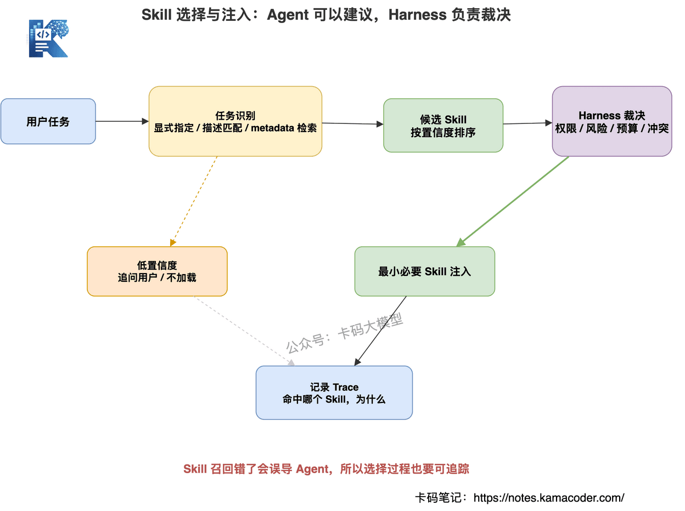

# Як відповідати про Agent Skill: як написати якісний скіл, що справді посилює агента

Нещодавно з'явився доволі новий напрямок питань на співбесідах:

«Якби вам треба було написати скіл для агента, як би ви це зробили?»

Інтерв'юери формулюють це й інакше:

«Чим скіл відрізняється від промпта?»

«Коли скілів побільшало, як їх обирати й ними керувати?»

«Чи не забруднюють скіли контекст?»

«Як оцінити, чи справді скіл корисний?»

Раніше була [збірка питань про агентів](./agent_interview.md), де ми розбирали ReAct, Function Calling, MCP і RAG.

А також стаття [Змагання майбутнього не в кількості агентів, а в стабільності harness](./harness_interview.md) — про те, як harness тримає продакшн-агента.

Ця стаття копає ще одну деталь: **коли спроможностей в агента дедалі більше, як осадити повторюваний досвід у скіли.**

На це питання дуже легко відповісти поверхово.

Багато хто, почувши «скіл», каже:

«Скіл — це ж просто промпт».

Не можна сказати, що це геть неправильно.

Але цього мало.

Бо інтерв'юер уточнить:

- які задачі варто осаджувати у скіли?
- що має бути у скілі, а чого там бути не повинно?
- де межі між скілом і інструментом, MCP, пам'яттю, harness?
- як шукати потрібний, коли скілів забагато?
- що робити, коли скіли конфліктують?
- чи не зіб'є агента хибно написаний скіл?
- як скіли потрапляють в оцінювання й версіювання?

Якщо на це немає відповідей, ви лишаєтеся на етапі «писати промпти».

**Скіл перевіряє не вміння написати інструкцію, а наявність інженерного мислення: чи вмієте ви осаджувати повторюваний досвід у повторно вживану спроможність.**

Розберімо це системно.

## Зміст

1. Спершу висновок: скіл не є довшим промптом
2. Що таке скіл
3. Чим скіл відрізняється від промпта, інструмента, MCP, пам'яті та harness
4. Що має містити якісний скіл
5. Як писати якісні скіли
6. Як агент обирає й викликає скіли
7. Керування контекстом для скілів
8. Як скіли пов'язані з продакшн-агентом
9. Як оцінювати ефективність скіла
10. Типові хиби зі скілами
11. Часті питання на співбесіді
12. Як відповідати на співбесіді

## 1. Спершу висновок: скіл не є довшим промптом

Одразу висновок:

**скіл — це не довший промпт, а осаджені в модуль спроможності досвід, робочий процес, спосіб користування інструментами й стандарти якості, які агент може викликати.**

Тут два ключові слова.

Перше: повторно вживаний.

Друге: модуль спроможності.

Промпт більше про разову задачу.

Скажімо, користувач просить оцінити резюме, і в промпті ви кажете:

«Спершу назви проблеми, потім дай поліпшений варіант».

Це, звісно, працює.

Але якщо щоразу під час оцінювання резюме ви наново пояснюєте моделі каркас із чотирьох складників, порядок розбору, формат виводу, типові проблеми й типові помилки, — це означає, що досвід час осадити у скіл.

Скіл розв'язує таке:

**коли той самий клас задач трапляється раз у раз, агент не повинен щоразу міркувати з нуля.**

Він має перевикористовувати вже осаджений процес.

Тож на співбесіді не називайте скіл «просто промптом».

Краще сказати так:

**промпт розв'язує формулювання разової задачі, а скіл — перевикористання між задачами.**

У цьому й основна цінність скілів.


## 2. Що таке скіл

Визначення може бути таким:

**скіл — це опис повторно вживаної спроможності для певного класу задач, який каже агентові, коли його застосовувати, як діяти, якими інструментами користуватися, за яким стандартом віддавати результат і що робити в разі помилки.**

Зверніть увагу: це не просто рядок на кшталт:

```text
Ти фаховий експерт з оптимізації резюме.
```

Це порожньо.

По-справжньому корисний скіл має відповідати на такі питання:

- у якому сценарії його застосовувати?
- у якому застосовувати не можна?
- яка інформація потрібна на вході?
- які кроки виконання?
- які інструменти в пріоритеті?
- який формат виводу?
- як визначити, що результат придатний?
- що робити за браку інформації?
- що робити, коли інструмент упав?
- які межі безпеки?

Приклад.

Якщо ви пишете скіл для розбору проєктів у резюме, у ньому не має бути просто:

«Допоможи користувачеві поліпшити проєкти в резюме».

Треба написати чітко:

- спершу перевірити, чи є в описі проєкту бізнес-контекст;
- далі перевірити, чи виділено особистий технічний внесок;
- далі подивитися, чи є у складнощах проєкту виклик і розв'язок;
- далі дати поліпшений варіант;
- у виводі обов'язково мають бути і проблемні приклади, і взірцеві;
- не вигадувати досвіду, якого користувач не описував.

Оце і є скіл.

Цінність скіла не в тому, щоб модель «знала термін».

А в тому, щоб на певному класі задач вона стабільніше дотримувалася процесу й меж.

## 3. Чим скіл відрізняється від промпта, інструмента, MCP, пам'яті та harness

Інтерв'юери дуже люблять питати про межі.

Бо багато хто плутає ці поняття.

Ви маєте чітко пояснити, що саме розв'язує кожне.

### 3.1. Скіл і промпт

Промпт — разова інструкція.

Скіл — повторно вживана спроможність.

Промпт схожий на те, як ви кажете моделі просто зараз:

«Цього разу зроби A, B і C».

Скіл схожий на заздалегідь осаджену процедуру:

«Надалі всі задачі цього класу роби ось так».

Отже:

**промпт пасує разовим задачам, скіл — частим і повторюваним.**

### 3.2. Скіл та інструмент

Інструмент є спроможністю виконати дію.

Скіл є методом користування спроможностями.

Скажімо, `search_docs` — це інструмент.

Він шукає документи.

А от «коли шукати, скільки раундів, як зрозуміти, що знайденого досить, і що робити без доказів» — це не завдання самого інструмента.

Це процес, який можна осадити у скіл.

Отже:

**інструмент розв'язує, чи можна це зробити; скіл — як зробити це стабільно.**

### 3.3. Скіл і MCP

MCP — протокол під'єднання інструментів.

Він розв'язує, як стандартизовано виставити інструмент моделі чи агентному застосунку.

У статті [Змагання майбутнього не в кількості агентів, а в стабільності harness](./harness_interview.md) ми бачили, що під'єднання MCP не має лишатися беззахисним: MCP дає екосистему інструментів, а harness — керування.

Скіл не відповідає за протокол.

Скіл каже агентові:

- чи варто брати цей інструмент MCP у поточній задачі;
- що перевірити перед викликом;
- як тлумачити результат виклику;
- як діяти з ризикованими операціями.

Отже:

**MCP дає екосистему інструментів, скіл — методологію задачі.**

### 3.4. Скіл і пам'ять

Пам'ять — сховище досвіду й фактів.

Скіл — виконуваний метод розв'язання задачі.

У пам'яті може лежати:

«Користувач любить лаконічні відповіді».

«Через пробій кешу в цьому проєкті вже був інцидент».

А у скілі має бути написано:

«Розбираючи проєкт, спершу дивимося бізнес-контекст, потім технічний внесок, потім складнощі, потім здобутки».

Пам'ять радше сховище матеріалів.

Скіл радше посібник з експлуатації.

### 3.5. Скіл і harness

Harness — глобальне керування середовищем виконання.

Він відповідає за:

- оркестрацію;
- права на інструменти;
- керування станом;
- бюджет вартості;
- оцінювання траєкторій;
- межі безпеки.

Скіл — локальна спроможність для задачі.

Скажімо, скіл написання документації, скіл розбору логів, скіл оцінювання RAG.

Отже:

**скіл робить стабільнішою окрему задачу, а harness — усю агентну систему.**

Про глобальний каркас виконання йдеться в [збірці питань про Harness Engineering](./harness_interview.md).

А ця стаття — про осадження локальних спроможностей.

## 4. Що має містити якісний скіл

Писати у скілі «будь фаховим» безглуздо.

Такі фрази не мають інженерної цінності.

Якісний скіл має містити щонайменше дев'ять частин.


### 4.1. Сценарії застосування

Коли цей скіл треба брати?

Наприклад:

«Коли користувач просить проаналізувати проєкт у резюме, поліпшити опис досвіду або оцінити особистий внесок».

Що чіткіші сценарії, то менша ймовірність хибного застосування.

### 4.2. Сценарії, де застосовувати не можна

Коли його брати не варто?

Це дуже важливо.

Багато скілів пишуть лише про те, що вони можуть, і мовчать про те, чого не можна.

У результаті на схожій задачі агент іде врозніс.

Скажімо, скіл розбору резюме не має використовуватися для:

- вигадування неіснуючого стажування;
- фальсифікації результатів проєкту;
- вигадування досвіду в компаніях;
- написання вигаданих технічних деталей за користувача.

**У скілі треба писати межі, а не лише спроможності.**

### 4.3. Вимоги до вхідних даних

Скіл має чітко називати, що потрібно на вході. Наприклад:

- вихідний текст резюме;
- цільова позиція;
- контекст проєкту;
- технологічний стек;
- яку частину користувач хоче поліпшити.

Якщо даних бракує, скіл має вимагати від агента перепитати, а не вигадувати.

### 4.4. Кроки виконання

Найважливіше у скілі — процес. Наприклад:

1. спершу визначити тип задачі;
2. далі перевірити повноту інформації;
3. далі проаналізувати за каркасом;
4. далі видати рекомендації щодо поліпшення;
5. наостанок дати варіант, готовий до заміни.

Кроки мають бути чіткими, але не настільки жорсткими, щоб унеможливити адаптацію.

### 4.5. Використання інструментів

Якщо задача потребує інструментів, треба написати:

- який інструмент у пріоритеті;
- коли інструмент не використовувати;
- що робити після збою інструмента;
- як перевірити результат інструмента.

Зверніть увагу: скіл не може обходити Tool Registry.

Він лише скеровує спосіб використання, але не заміняє керування правами.

### 4.6. Формат виводу

Найнестабільніше місце в агента — формат виводу.

У скілі треба чітко зазначити:

- зі скількох частин складається фінальний вивід;
- чи потрібна таблиця;
- чи потрібен код;
- чи потрібні посилання на джерела;
- чи потрібне попередження про ризики.

### 4.7. Стандарти якості

Скіл має сказати агентові, що вважається добре зробленим. Наприклад:

- чи розв'язано мету користувача;
- чи є фактична основа;
- чи зрозуміла структура;
- чи можна це виконати;
- чи немає зайвих відступів від теми.

Без стандартів якості агент видаватиме лише те, що «виглядає завершеним».

### 4.8. Обробка невдач

У реальних задачах збої трапляються постійно.

У скілі треба написати:

- що робити за браку інформації;
- що робити після збою інструмента;
- що робити за браку доказів;
- що робити за браку прав;
- що робити за суперечливих результатів.

У якісного скіла обов'язково є запобіжна стратегія.

### 4.9. Межі безпеки

Наприклад:

- не вигадувати фактів;
- не обходити права;
- не виконувати ризикованих дій;
- не виводити чутливих даних;
- не подавати непевне як доконаний факт.

І тут варто наголосити:

**межі безпеки не можна писати лише у скілі — перехоплення має бути й на інженерному рівні.**

Скіл нагадує.

А примусово виконують harness і Tool Registry.

## 5. Як писати якісні скіли

Добрий скіл не вигадують, сидячи за столом.

Його витягують із реальних задач.

Раджу такий шлях:

**повторювана задача → випадки невдач → процес експерта → досвід роботи з інструментами → зворотний зв'язок від оцінювання → ітерація скіла.**


### 5.1. Виділяти з повторюваних задач

Не для кожної задачі варто писати скіл.

Скіли пасують частим, повторюваним задачам із відносно стабільним процесом. Наприклад:

- розбір резюме;
- аналіз логів;
- оцінювання RAG;
- оптимізація SQL;
- генерація документації;
- рев'ю PR;
- звіти з аналізу даних.

Якщо задача трапилася один раз, писати скіл може бути невигідно.

### 5.2. Доповнювати правилами з випадків невдач

Найцінніше джерело скілів — помилки, які вже зробив агент.

Скажімо, під час оцінювання RAG агент часто дивиться лише на фінальну відповідь і не перевіряє джерела доказів.

Тоді у скіл додаємо:

«Обов'язково перевір, чи підкріплені ключові висновки відповіді знайденими документами».

Це те саме, про що йшлося у статті [Де RAG найважче впровадити](./rag_hardest_parts_interview.md) у розділі про вірність генерації: у RAG мало знайти документи — треба ще й перевірити, чи справді відповідь на них спирається.

Пишучи код, агент часто забуває прогнати тести.

Тоді у скіл додаємо:

«Після зміни коду насамперед запусти відповідні мінімальні тести».

**Добрий скіл виростає з помилок.**

У статті [Як агентна система стримує галюцинації моделі](./agent_hallucination_control_interview.md) ми бачили, що галюцинації не закрити одним реченням у промпті: потрібні інструменти, докази, валідація виводу й запобіжники.

Скіл теж має вбирати досвід із цих невдач, але пам'ятайте: **скіл є м'яким обмеженням, а жорстким є інженерне перехоплення.**

### 5.3. Витягати процедури з роботи експертів

У багатьох експертів є неявний процес.

Скажімо, досвідчений інженер, розбираючи продакшн-інцидент, не кидається одразу правити код.

Він спершу дивиться на обсяг впливу, потім у логи, потім на нещодавні зміни, а потім перевіряє гіпотезу.

Такий процес добре осідає у скіл.

Цінність скіла саме в тому, щоб зробити неявний досвід експерта явним.

### 5.4. Осаджувати найкращі практики роботи з інструментами

Деякі інструменти потужні, але ними погано користуються.

Наприклад, автоматизація браузера, запити до бази, пошук у RAG, платформа логів, пошук по коду.

У скілі можна чітко написати:

- перед запитом звузити коло;
- не брати забагато результатів за раз;
- спершу прочитати схему, потім писати SQL;
- якщо нічого не знайшлося, змінити ключове слово;
- результат інструмента перевіряти вдруге.

Це помітно підвищує стабільність агента.

### 5.5. Ітерувати за результатами оцінювання

Написаний скіл — це ще не кінець.

Треба дивитися на ефект.

Якщо після підключення скіла зросла частка успішних задач, впала частка збоїв інструментів і менше стало помилок формату — він працює.

А якщо після підключення витрата токенів підскочила, а хибних спрацювань побільшало, — можливо, він забруднює контекст.

Отже:

**скіл має входити в цикл оцінювання, а не просто лежати після написання.**

## 6. Як агент обирає й викликає скіли

Коли скілів побільшало, головна проблема вже не в тому, як їх писати.

А в тому, як їх обирати.

Інтерв'юер цілком імовірно спитає:

«Якщо в системі кілька десятків скілів, як агент розуміє, який брати?»

Способів чотири.



### 6.1. Явна вказівка

Користувач або система вказує напряму:

«Цього разу беремо скіл розбору резюме».

Найстабільніший варіант.

Пасує фоновим задачам, фіксованим процесам і автоматизації.

### 6.2. Зіставлення за описом задачі

Система зіставляє ввід користувача з описами скілів.

Скажімо, користувач каже:

«Поліпши мені опис досвіду проєктів».

Знаходиться скіл оптимізації проєктів у резюме.

Гнучко, але залежить від якості описів скілів.

### 6.3. Пошук за метаданими

У кожного скіла мають бути метадані:

- name;
- description;
- domain;
- task_type;
- input_requirements;
- tools;
- risk_level;
- version.

За ними система може шукати й маршрутизувати.

Це керованіше, ніж запихати повні тексти в контекст.

### 6.4. Вставляння під керуванням harness

У продакшні не можна дозволяти агентові самому підвантажувати всі скіли.

Harness має вирішувати, які скіли вставити, за типом задачі, правами користувача, бюджетом контексту й рівнем ризику.

Це узгоджується з логікою harness загалом:

**агент може запропонувати скіл, але вставляти скіли має harness.**

### 6.5. Що робити, коли скіл обрано неправильно

Хибно знайдений скіл може збити агента.

Скажімо, користувач просто питає, «як написати резюме», а система підвантажує скіл «прикрашання резюме вигадками».

Це вже небезпечно.

Тож потрібні:

- оцінка впевненості влучання скіла;
- виявлення конфліктів між кількома скілами;
- перепитування користувача за низької впевненості;
- явне підтвердження для ризикованих скілів;
- запис використання скілів у трасування.

## 7. Керування контекстом для скілів

Коли скілів побільшало, виникає нова проблема:

**скіл задумувався як актив спроможностей, але за поганого керування стає шумом у контексті.**

Багато команд спершу захоплюються й пишуть кілька десятків скілів.

А потім щоразу запихають у задачу цілу купу.

І модель, побачивши гору нерелевантних правил, лише легше збивається.

Це і є забруднення контексту скілами.


### 7.1. Завантаження за потреби

Не кладіть у контекст усі скіли.

Завантажуйте лише мінімальний набір, потрібний поточній задачі.

Скіл має викликатися за потреби, як інструмент, а не звучати фоном постійно.

### 7.2. Пошарові підсумки

Скіл можна поділити на шари:

- метадані — для пошуку й маршрутизації;
- підсумок — для швидкої оцінки доречності;
- повна інструкція — завантажується вже під час виконання.

Так менше марнується контекст.

### 7.3. Пріоритет і область дії

Різні скіли можуть конфліктувати.

Скажімо, один вимагає «відповідати якомога лаконічніше».

Інший — «докладно пояснювати кожен крок».

Тут потрібен пріоритет. Зазвичай такий:

системні правила безпеки > правила рівня проєкту > скіл рівня задачі > уподобання користувача.

Область дії теж має бути чіткою.

Локальний скіл не повинен впливати на всю задачу.

### 7.4. Версіювання

Скіли ітеруються.

Кожна зміна має мати версію.

Фіксувати щонайменше:

- причину зміни;
- уражені сценарії;
- результати оцінювання;
- спосіб відкату.

Інакше скіли з часом лише заплутуються.

### 7.5. Виведення застарілих скілів

Бізнес змінюється, інструменти змінюються, спроможності моделей теж.

Старі скіли можуть стати недоречними.

Тож регулярно перевіряйте:

- чи їх узагалі ще знаходять;
- чи покращують вони метрики;
- чи не збивають з пантелику;
- чи не конфліктують із новими інструментами.

Непрацездатні скіли треба виводити з обігу.

**Скілів має бути не якомога більше, а якомога точніше.**

## 8. Як скіли пов'язані з продакшн-агентом

Скіли не існують окремо.

Їх треба бачити в загальній інженерній системі агента:

- промпт — разова інструкція;
- скіл — локальна повторно вживана спроможність;
- інструмент — реальна дія;
- MCP — протокол під'єднання інструментів;
- пам'ять — сховище досвіду й фактів;
- harness — глобальне керування середовищем виконання.

Без скілів агент щоразу міркує з нуля над складною задачею.

Без інструментів скіл лишається процесом на папері.

Без пам'яті скіл не може скористатися історичним досвідом.

Без harness скіли можуть підвантажуватися, комбінуватися й виконуватися хаотично.

Тож продакшн-агент не тримається на одному шарі.

Ці шари працюють разом.

Особливо важливо:

**скіл не заміняє ані harness, ані Tool Registry.**

Скажімо, у скілі написано:

«Перед видаленням файлу обов'язково підтвердити».

Це корисно.

Але справжні права на видалення, процедура підтвердження й журнал аудиту мають примусово працювати на рівні керування інструментами.

Написати безпеку лише у скілі, без інженерного перехоплення, для продакшну недостатньо.

## 9. Як оцінювати ефективність скіла

На співбесіді про скіли є важливий бонус:

**не кажіть просто, що написали скіл, — скажіть, як довели його корисність.**

Якщо ви скажете:

«Після додавання скіла відчуття, що стало краще», —

це не інженерний висновок.

Треба дивитися на метрики.


### 9.1. Частка успішних задач

Чи легше виконується задача після підключення скіла? Наприклад:

- чи охоплює розбір резюме всі чотири складники;
- чи знаходить аналіз логів першопричину;
- чи проходять тести після зміни коду;
- чи підкріплена відповідь RAG доказами.

### 9.2. Частка успішних викликів інструментів

Чи менше стало хибних викликів? Наприклад:

- менше хибно обраних інструментів;
- менше недійсних параметрів;
- менше безглуздих повторних викликів;
- менше помилкових викликів ризикованих інструментів.

### 9.3. Стабільність виводу

Дивимося, чи стабільніший вивід:

- частка помилок формату;
- частка пропущених полів;
- частка відсутніх посилань;
- частка випадків, коли процес не дотримано.

### 9.4. Частка ручних виправлень

Якщо скіл працює, ручних виправлень має стати менше.

Особливо в задачах генерації вмісту, змін коду й аналізу даних.

Частка переробок переконливіша за «на вигляд непогано».

### 9.5. Витрата токенів

Скіл не безкоштовний.

Його завантаження займає контекст.

Якщо скіл довгий, а користі мало, це невигідно.

Тож дивимося:

- частку токенів, що припадає на скіли;
- чи зросла загальна витрата;
- чи зменшилася кількість повторів;
- чи знизилася вартість однієї задачі.

### 9.6. Точність влучання й частка хибних спрацювань

Це специфічні метрики системи скілів.

Точність влучання: чи застосовується скіл тоді, коли треба.

Частка хибних спрацювань: чи не застосовується він тоді, коли не треба.

Хибні спрацювання небезпечні.

Бо неправильний скіл задає агентові хибний напрямок.

### 9.7. A/B-тестування

Можна порівнювати:

- без скіла проти зі скілом;
- старий скіл проти нового;
- один скіл проти комбінації;
- усі скіли проти мінімально необхідних.

Лише порівняння показує, чи скіл справді працює, чи це самозаспокоєння.

## 10. Типові хиби зі скілами

Про це теж часто питають.

Бо багато команд, узявши скіли, справді наступають на ці граблі.


### 10.1. Писати скіл як велетенський промпт

Скіл не має бути якомога довшим.

Задовгий з'їдає контекст, і модель перестає бачити головне.

Добрий скіл має чітку структуру, ясні межі й лише необхідну інформацію.

### 10.2. Писати кроки без меж

Якщо написати лише «як робити» й не написати «коли цього робити не треба», хибне застосування дуже ймовірне.

У скілі обов'язково мають бути сценарії незастосування й межі ризику.

### 10.3. Конфлікти між скілами

Коли підвантажено кілька скілів одночасно, правила можуть суперечити.

Тож потрібні пріоритет, область дії та виявлення конфліктів.

### 10.4. Надто жорстко прописані деталі інструментів

Якщо у скілі жорстко зафіксувати параметри інструмента, то після його оновлення все зламається.

Скіл має описувати принципи використання, а конкретна схема лишається за Tool Registry.

### 10.5. Скіли не оновлюються

Змінився бізнес, змінилися інструменти, змінилися спроможності моделі — скіл теж має змінитися.

Застарілий скіл збиває агента.

### 10.6. Примусово вантажити скіли в усі задачі

Це забруднює контекст.

Скіли мають завантажуватися за потреби.

Більше не означає фаховіше.

### 10.7. Ітерувати без оцінювання, на відчуття

Без метрик неможливо зрозуміти, чи є від скіла користь.

Урешті це перетворюється на купу історичних правил, які ніхто не наважується видалити.

### 10.8. Писати обмеження безпеки лише у скілі

Дуже небезпечна хиба.

Скіл може нагадати моделі не перевищувати повноважень.

Але справжні права, погодження й аудит мають бути реалізовані на рівні harness і Tool Registry.

## 11. Часті питання на співбесіді

Ці питання варто підготувати разом.

### 11.1. Що таке скіл?

Скіл — модуль повторно вживаної спроможності для класу задач, що осаджує межі задачі, процес виконання, спосіб роботи з інструментами, формат виводу, стандарти якості й обробку невдач.

### 11.2. Чим скіл відрізняється від промпта?

Промпт — разова інструкція.

Скіл — опис спроможності для перевикористання між задачами.

Промпт розв'язує, як зробити цього разу; скіл — як робити задачі цього класу надалі.

### 11.3. Чим скіл відрізняється від інструмента?

Інструмент виконує дію.

Скіл скеровує агента, коли, як і за яким стандартом користуватися спроможностями.

Інструмент розв'язує, чи можна це зробити; скіл — як зробити стабільно.

### 11.4. Як скіл пов'язаний із MCP?

MCP — протокол під'єднання інструментів, що робить їх стандартизованими.

Скіл може описувати, як користуватися цими інструментами в певному класі задач, але не заміняє ані MCP, ані Tool Registry.

### 11.5. Чим скіл відрізняється від пам'яті?

Пам'ять зберігає досвід і факти.

Скіл зберігає виконуваний метод і процес.

Пам'ять радше сховище матеріалів, скіл — посібник з експлуатації.

### 11.6. Які задачі варто осаджувати у скіли?

Часті, повторювані, зі стабільним процесом і чіткими стандартами якості; такі, де легко помилитися, але помилки виправляються дисципліною процесу.

Наприклад, розбір резюме, рев'ю коду, аналіз логів, оцінювання RAG, генерація документації, аналіз даних.

### 11.7. Як спроєктувати якісний скіл?

Треба чітко описати сценарії застосування й незастосування, вимоги до вхідних даних, кроки виконання, роботу з інструментами, формат виводу, стандарти якості, обробку невдач і межі безпеки.

### 11.8. Як обирати, коли скілів забагато?

Через явну вказівку, зіставлення за описом задачі, пошук за метаданими й маршрутизацію в harness.

У продакшні не можна запихати всі скіли в контекст.

### 11.9. Чи забруднюють скіли контекст?

Так.

Якщо скіл знайдено хибно, вставлено забагато, вміст задовгий або правила суперечать одне одному — забруднюють.

Розв'язок: завантаження за потреби, пошарові підсумки, пріоритети, області дії й версіювання.

### 11.10. Що робити з конфліктами скілів?

Потрібні пріоритет і область дії.

Зазвичай: системні правила безпеки > правила рівня проєкту > скіл рівня задачі > уподобання користувача.

За серйозного конфлікту рішення має ухвалювати harness або треба перепитати користувача.

### 11.11. Як версіювати скіли?

Кожна зміна фіксує версію, причину, уражені сценарії, результати оцінювання й спосіб відкату.

Продакшн-скіли мають підтримувати поступове викочування, відкат і порівняння.

### 11.12. Як оцінювати ефективність скіла?

За часткою успішних задач, часткою успішних викликів інструментів, часткою помилок формату, часткою ручних виправлень, вартістю в токенах, точністю влучання й часткою хибних спрацювань.

Найкраще — через A/B-тестування.

### 11.13. Чи може скіл замінити керування інструментами?

Ні.

Скіл є м'яким обмеженням.

Tool Registry і harness — жорстким.

Ризиковані дії мають перехоплюватися на інженерному рівні.

### 11.14. Як використовувати скіли в мультиагентній системі?

У різних агентів можуть бути різні скіли.

Але вставлянням має керувати harness, щоб кілька агентів не підвантажили суперечливих скілів і щоб локальний скіл не розповзся в глобальне правило.

### 11.15. Як ітерувати скіл за випадками невдач?

Спершу атрибуція інциденту.

Пропущено крок у процесі — дописуємо крок.

Хибно вжито інструмент — дописуємо правила його використання.

Розмиті межі — дописуємо сценарії незастосування.

Нестабільний вивід — дописуємо формат і стандарти якості.

А далі проганяємо регресійне оцінювання.

## 12. Як відповідати на співбесіді

Якщо інтерв'юер спитає:

«Як ви розумієте Agent Skill? Як написати якісний скіл?» —

можна відповісти так:

«Я не сприймаю скіл як довший промпт. Промпт — це радше разова інструкція, а цінність скіла в тому, щоб осадити процес, межі, досвід роботи з інструментами, стандарти виводу й обробку невдач для цілого класу частих задач у повторно вживану спроможність.

Якісний скіл передусім чітко описує сценарії застосування й незастосування, щоб уникнути хибних спрацювань. Далі — вимоги до вхідних даних, кроки виконання, принципи роботи з інструментами, формат виводу й стандарти якості. І наостанок — обробку невдач і межі безпеки: за браку інформації спершу перепитати, після збою інструмента понизити режим, за браку доказів не вигадувати, а ризиковані дії не лишати на свідомість моделі.

Скіл не можна розглядати ізольовано.

У нього є межі з промптом, інструментом, пам'яттю, MCP і harness.

Промпт — разова інструкція, інструмент — спроможність виконати дію, MCP — протокол інструментів, пам'ять — сховище досвіду, harness — глобальне керування, а скіл — локальна повторно вживана спроможність для задачі.

Скіл може скерувати агента, як діяти, але не заміняє контролю прав у Tool Registry й обмежень harness під час виконання.

У продакшні скіли ще й треба обирати й ними керувати. Не можна запихати всі в контекст: завантажувати їх слід за потреби — за типом задачі, метаданими, рівнем впевненості й маршрутизацією harness.

Коли скілів забагато, виникають забруднення контексту й конфлікти правил, тож потрібні пріоритети, області дії, версіювання й виведення застарілих.

І наостанок: ефективність скіла не оцінюють на відчуття — потрібні метрики. Частка успішних задач, частка успішних викликів інструментів, частка помилок формату, частка ручних виправлень, вартість у токенах, точність влучання й частка хибних спрацювань.

Найкраще порівняти результати до й після підключення скіла через A/B-тестування».

Головне в цій відповіді не «я вмію писати файли скілів».

А те, що ви кажете інтерв'юерові:

**ви знаєте, як осадити повторюваний досвід у спроможність і як цими спроможностями керувати.**

Саме це й перевіряють питання про скіли.
