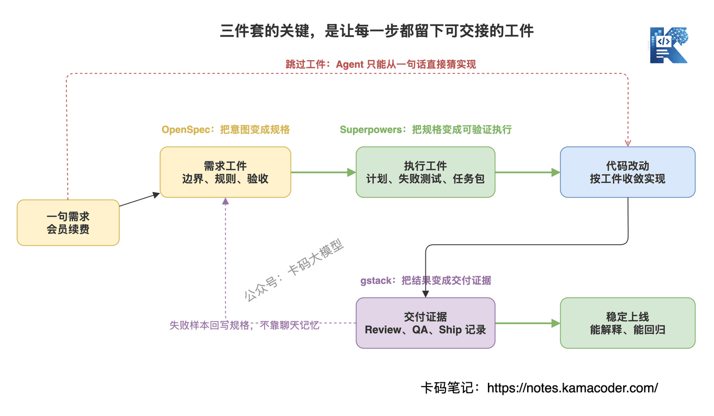

# Три інструменти AI-посиленої розробки: як OpenSpec, Superpowers і gstack повертають Vibe Coding до інженерної поставки

Раніше ми говорили про [Vibe Coding](./vibe_coding_interview.md): у добу програмування з AI перевага програміста не в тому, щоб писати краще за AI, а в тому, щоб AI писав правильніше, стабільніше й керованіше.

Якщо вас більше цікавлять найчастіші провали реальних проєктів — точки відновлення в Git, резервні копії бази, ізоляція коду й даних, різниця продакшн-середовища, — почніть зі статті [Vibe Coding: як не наламати дров](./vibe_coding_backup_engineering.md). Там про базову межу, а тут — про наступний рівень інженерії.

Далі був [Глибокий розбір Claude Code](./claude_code_deep_dive.md), де ми розклали цикл агента, виклик інструментів, керування контекстом і механізми безпеки.

А якщо зробити ще крок уперед, виникає питання:

**інструменти дедалі сильніші — то чому в багатьох код, написаний з AI, дедалі безладніший?**

Річ не в тому, що модель слабка.

А в тому, що ви ставитеся до AI як до «швидшої друкарки» й не даєте йому інженерних обмежень.

Продакт каже: «додай продовження підписки».

І багато хто одразу кидає це в Claude Code чи Codex: «реалізуй продовження підписки».

AI швидко береться писати.

З'являються ендпоїнти, сторінки, поля в базі.

А потім ви дивитесь:

- що робити, коли продовження не вдалося, не продумано;
- чи можна поєднувати купон із продовженням, не написано;
- ідемпотентність не забезпечено;
- компенсації для невдалого колбека немає;
- тести покривають лише щасливий шлях;
- і перед релізом ніхто до пуття не зробив рев'ю.

Це не проблема AI.

Це ви кинули розмиту вимогу агентові, який уміє писати код.

**Суть AI-посиленої розробки не в тому, щоб AI швидше починав писати, а в тому, щоб AI писав у межах правильної специфікації, правильного процесу й правильного замкненого циклу поставки.**

Сьогодні розберемо три інструменти AI-посиленої розробки:

- OpenSpec: перетворює розмиту вимогу на специфікацію, придатну до рев'ю;
- Superpowers: змушує агента працювати за інженерною дисципліною;
- gstack: доповнює процес рев'ю, QA, релізом і ретроспективою.

Ці три інструменти потрібні не для того, щоб «поставити ще більше плагінів».

Вони розв'язують одну задачу:

**як повернути Vibe Coding до інженерної поставки.**

## Зміст

1. [Чим AI-посилена розробка відрізняється від Vibe Coding](#1-чим-ai-посилена-розробка-відрізняється-від-vibe-coding)
2. [Чому самих Claude Code чи Codex недостатньо](#2-чому-самих-claude-code-чи-codex-недостатньо)
3. [OpenSpec: спершу перетворити вимогу на специфікацію](#3-openspec-спершу-перетворити-вимогу-на-специфікацію)
4. [Superpowers: змусити агента дотримуватися інженерної дисципліни](#4-superpowers-змусити-агента-дотримуватися-інженерної-дисципліни)
5. [gstack: замкнути цикл поставки](#5-gstack-замкнути-цикл-поставки)
6. [Як поєднати всі три](#6-як-поєднати-всі-три)
7. [Як відповідати на співбесіді](#7-як-відповідати-на-співбесіді)
8. [Коли це доречно, а коли ні](#8-коли-це-доречно-а-коли-ні)

## 1. Чим AI-посилена розробка відрізняється від Vibe Coding

Інтерв'юер може спитати: «Як ви ставитеся до AI-посиленої розробки? Чим вона відрізняється від Vibe Coding?»

Питання зараз доволі часте.

Багато хто відповідає надто розмито: «AI-посилена розробка — це підвищення ефективності за допомогою AI».

Це не помилково, але поверхово.

Справжня різниця не в тому, чи використовується AI, а в тому, **чи вбудовано AI в інженерний процес**.

Типовий сценарій Vibe Coding такий:

вимога одним реченням, AI одразу пише.

Написав, працює — приймаємо.

Помилка — вставляємо помилку в AI.

Виглядає швидко, але має фатальну ваду:

**вимога, дизайн, перевірка й поставка тримаються лише на перебігу чату.**

Щойно контекст видовжився, змінилося вікно або напрямок кілька разів мінявся, агент легко забуває початкові обмеження.

AI-посилена розробка інша.

Вона не тримає AI поза процесом, а вбудовує його в процес:

- спершу вимога записується як специфікація;
- далі специфікація розкладається на дизайн і задачі;
- розробка йде за тестами й планом;
- перед поставкою робиться рев'ю й QA;
- а невдалі випадки осідають правилами для наступного циклу.


Тож на співбесіді можна відповісти так:

**Vibe Coding ставиться до AI як до одноразового генератора коду, а AI-посилена розробка вбудовує AI в інженерний цикл. Перше цікавить, «чи вдасться написати», друге — «чи зрозуміла вимога, чи відповідає реалізація специфікації, чи покриті тестами межі, чи керований реліз».**

Цю фразу варто запам'ятати.

Питаючи це, інтерв'юер перевіряє не володіння інструментом.

Він питає: **чи зберігаєте ви інженерну розсудливість, пишучи код з AI.**

## 2. Чому самих Claude Code чи Codex недостатньо

Інтерв'юер може продовжити: «Claude Code і Codex уже дуже сильні — навіщо ще OpenSpec, Superpowers і gstack?»

Спершу визнаймо факт:

**Claude Code і Codex справді сильні.**

Вони читають код, правлять файли, ганяють тести, обробляють помилки, викликають інструменти й тягнуть складні задачі на багато кроків.

Але сильна модель розв'язує проблему спроможності, а не проблему процесу.

Навіть дуже сильний агент може:

- почати писати, не уточнивши вимогу;
- реалізувати лише щасливий шлях;
- написати тести так, ніби доводить власну правоту;
- зробити рев'ю коду поверхово;
- жодного разу не пройти реальний сценарій у браузері;
- після релізу не розібрати причини збою.

Ці проблеми не зникають самі від переходу на більшу модель.

Бо агент за замовчуванням прагне «якнайшвидше виконати прохання користувача».

Сказали «зроби функціональність» — він старанно її робить.

А зрілий інженер не кидається писати одразу.

Зрілий інженер спершу питає:

- чию проблему розв'язує ця вимога?
- які сценарії обов'язкові?
- яких меж не можна переступати?
- як відновлюватися після збою?
- на які модулі вплине зміна коду?
- як довести, що вона справді правильна?

Три інструменти AI-посиленої розробки якраз і виносять ці інженерні дії назовні.


Їх можна уявити як три шари.

**OpenSpec відповідає за «що робити».**

Він перетворює вимогу на proposal, design, tasks і spec delta, тож зміни вимог можна переглядати.

**Superpowers відповідає за «як робити».**

Він перетворює уточнення вимоги, підтвердження дизайну, TDD, виконання субагентами й рев'ю коду на дисципліну, якої агент має дотримуватися.

**gstack відповідає за «як постачати».**

Він зшиває продуктову ретроспективу, рев'ю інженерного плану, рев'ю коду, QA в браузері, передрелізну перевірку й підсумковий розбір в один процес поставки.

Одним реченням:

**модель відповідає за генерацію, а ці три інструменти — за обмеження генерації.**

## 3. OpenSpec: спершу перетворити вимогу на специфікацію

Перша проблема, яку розв'язує OpenSpec: **вимога надто розмита.**

Якщо ви хочете копнути глибше в саму ідею розробки за специфікацією — чому вона знову стала популярною в добу програмування з AI, чим відрізняється від PRD, TDD і BDD і як виглядає повний процес, — читайте [Spec-Driven Development](./spec_driven_development_interview.md).

AI найбільше боїться не складної вимоги, а нечіткої.

Ви кажете «зроби продовження підписки» — AI напише.

Але він не знає:

- чи однакові правила для місячної й річної підписки;
- продовження після закінчення рахується від сьогодні чи від початкової дати закінчення;
- як змінюється статус замовлення після невдалого продовження;
- що робити з повторним колбеком про оплату;
- чи має адмінка показувати історію продовжень.

Якщо це не записано наперед, AI може лише вгадувати.

Схоже на правду не означає правильно.

Саме в цьому цінність OpenSpec.

Це не просто довгий промпт, а система специфікацій, що живе в репозиторії.

В офіційній документації OpenSpec наголошено на кількох речах:

- це легкий фреймворк розробки за специфікацією;
- підтримує Claude Code, Cursor, Codex, GitHub Copilot та інші інструменти;
- кожна зміна породжує spec delta, тож зміну вимоги зручно переглядати;
- специфікації лежать у репозиторії поряд із кодом і є довгостроковим контекстом.

Це важливі моменти.

Бо одна з найбільших проблем програмування з AI — **непостійність контексту**.

Сьогодні в цьому вікні чату ви 20 хвилин пояснювали бізнес-правила.

Завтра в іншому вікні цих правил немає.

А якщо роботу підхопить інша людина, вона теж не знатиме, чому було зроблено саме так.

OpenSpec кладе специфікацію в репозиторій — тобто перетворює «намір вимоги» на довгостроковий актив поруч із кодом.

Типова структура приблизно така:

```text
openspec/
  specs/
    membership-renewal/
      spec.md
  changes/
    add-renewal-coupon/
      proposal.md
      design.md
      tasks.md
      specs/
        membership-renewal/
          spec.md
```

Зверніть увагу: головне тут не сама структура тек.

Головне те, що **агент більше не бачить лише вашу поточну фразу — він може прочитати історичні специфікації й дізнатися, як система мала працювати від початку.**

На співбесіді можна сказати так:

**Головна цінність OpenSpec не в тому, що він «пише план», а в тому, що він перетворює намір вимоги на специфікацію, придатну до версіювання, рев'ю й повторного використання. Він закриває найризикованішу верхню ланку розробки з AI: коли вимога не визначена, а агент уже пише код.**

Це звучить значно сильніше, ніж «OpenSpec — це інструмент для написання документації».

## 4. Superpowers: змусити агента дотримуватися інженерної дисципліни

OpenSpec розв'язав питання «що робити».

Але написана специфікація ще не гарантує, що агент розроблятиме за доброю практикою.

Найбільша проблема багатьох агентів — **надто квапляться писати код.**

Користувач щойно доказав вимогу, а він уже править файли.

Виглядає як ініціативність, а насправді це великий ризик.

Superpowers розв'язує другу проблему: **у процесі розробки немає дисципліни.**

В офіційному README сказано прямо: Superpowers — це повноцінна методологія розробки програмного забезпечення для агентів програмування, побудована на композиційних скілах і початкових інструкціях, які змушують агента цих методів дотримуватися.

Основні дії приблизно такі:

- спершу з'ясувати, що саме вам потрібно;
- звести розмову в специфікацію;
- блоками показати вам дизайн на підтвердження;
- згенерувати виконуваний план реалізації;
- наголошувати на red/green TDD, YAGNI, DRY;
- виконувати через розробку із субагентами;
- після кожної задачі робити перевірку й рев'ю.

Це не робить агента «розумнішим».

Це не дає агентові **самодіяти**.

Найтиповіша помилка тих, хто пише код з AI, — звалити все на одного агента й попросити зробити за раз.

У результаті:

- спочатку план непоганий, а далі реалізація збивається;
- тести написано, але вони лише підтверджують згенеровану ж логіку;
- код працює, а архітектура дедалі заплутаніша;
- посеред процесу щось провалилося, і агент сам собі знаходить виправдання й пише далі.

Підхід Superpowers протилежний:

**спершу зробити процес жорстким, а вже в межах процесу дати агентові свободу.**

Наприклад, TDD.

AI, звісно, вміє писати тести, але за замовчуванням часто дописує їх після коду.

Такі тести легко перетворюються на доведення власної правоти: доводять, що щойно написаний код правильний.

За red/green TDD спершу пишеться тест, який падає, потім мінімальна реалізація, потім рефакторинг.

Це змушує агента спершу визначити очікувану поведінку, а не нагромаджувати реалізацію.

На співбесіді можна сказати так:

**Superpowers розв'язує не проблему спроможності моделі, а проблему дисципліни агента. Він робить уточнення, підтвердження дизайну, TDD, поділ на задачі, виконання субагентами й рев'ю процесом за замовчуванням, щоб агент не кидався писати код одразу.**

Така відповідь показує, що ви розумієте головне:

програмування з AI змагається не лише моделями, а й **обмеженнями робочого процесу**.

## 5. gstack: замкнути цикл поставки

Після перших двох шарів код уже значно керованіший.

Але це ще не кінець.

Справжня інженерна поставка — це не «код написано».

Це:

- чи пройшов код рев'ю?
- чи прогнали сторінку в реальності?
- чи дописано регресійні тести?
- чи зроблено передрелізну перевірку?
- чи осіли набиті цього разу ґулі?

gstack розв'язує третю проблему: **ланцюжок поставки легко пропускають.**

На офіційній сторінці він описаний як delivery loop для програмування з AI, а не набір промптів.

Опис влучний.

Процес gstack приблизно такий:

- Think: через `/office-hours` наново продумати вимогу;
- Plan: через `/plan-ceo-review`, `/plan-eng-review`, `/plan-design-review` навантажити продукт, архітектуру, UX і тести;
- Build: розробка за узгодженим brief;
- Review: через `/review` шукати регресії, брак тестів і приховані ризики;
- Test: через `/qa` прогнати справжній QA в браузері;
- Ship: через `/ship` зробити фінальну передрелізну перевірку;
- Reflect: через `/retro` розібрати патерни й проблеми цього циклу.

Головне тут не назви команд.

Головне те, що кроки, які команди найчастіше пропускають, стають частиною роботи агента.

Особливо QA в браузері.

Багато коду від AI «проходить тести», а на відкритій сторінці одразу видно проблеми:

- кнопку перекриває інший елемент;
- стан форми не скидається;
- мобільна верстка розвалилася;
- під автентифікованим користувачем сценарій інакший;
- повідомлення про помилку взагалі не з'являється.

Самими юніт-тестами цього не виявити.

Додаючи в процес справжній QA в браузері, gstack, по суті, нагадує:

**AI пише код, а користувач користується продуктом.**

На співбесіді можна сказати так:

**Цінність gstack у замкненому циклі поставки. Він не заміняє інструменти написання коду, а зшиває продуктову ретроспективу, інженерне рев'ю, рев'ю коду, QA в браузері, реліз і підсумковий розбір, щоб після написання коду AI не проскакував повз перевірку й релізну дисципліну.**

Саме цю ланку доводиться добудовувати більшості проєктів на шляху від демо до продакшну.

## 6. Як поєднати всі три

Не змішуйте ці три інструменти в одну купу.

Якщо змішати, інтерв'юер вирішить, що ви просто перелічуєте назви.

Розповідайте за ланцюжком.



Повний ланцюжок можна уявити так.

**Крок 1: OpenSpec перетворює вимогу на специфікацію.**

Спершу з'ясовуємо, що робити, які межі й які критерії приймання.

На виході — proposal, design, tasks, spec delta.

**Крок 2: Superpowers виконує розробку за специфікацією.**

Спершу підтвердження дизайну, далі поділ на задачі, по змозі TDD, складні задачі віддаються субагентам частинами, а наприкінці самоперевірка й рев'ю.

**Крок 3: gstack замикає цикл до й після поставки.**

Навантажує план продуктовим та інженерним поглядом, через рев'ю шукає приховані ризики, через QA в браузері проганяє реальні сценарії, через Ship робить передрелізну перевірку, а через Retro осаджує досвід.

Отже, співвідношення таке:

| Інструмент | Яку проблему розв'язує | Ключові артефакти | Основна фаза |
|---|---|---|---|
| OpenSpec | Розмита вимога, непостійний контекст | spec, proposal, design, tasks | До розробки |
| Superpowers | Агент квапиться писати, процес нестабільний | Підтвердження дизайну, TDD, виконання задач, рев'ю | Під час розробки |
| gstack | Рев'ю, QA, реліз і розбір легко пропустити | Рев'ю плану, QA в браузері, чекліст релізу, ретроспектива | До й після поставки |

Тож не кажіть «OpenSpec, Superpowers і gstack — це все інструменти для розробки з AI».

Занадто загально.

Кажіть так:

**OpenSpec — шар специфікації, Superpowers — шар виконавчої дисципліни, gstack — шар замкненого циклу поставки.**

Ця фраза добре працює на співбесіді.

## 7. Як відповідати на співбесіді

Нижче кілька частих питань.

### 7.1. Чим AI-посилена розробка відрізняється від звичайної розробки з AI-помічником?

Можна відповісти так:

**Звичайна розробка з AI-помічником — це радше локальне прискорення: доповнити код, пояснити помилку, згенерувати тест. AI-посилена розробка вбудовує AI в повний інженерний процес: від специфікації вимоги, дизайну, реалізації, тестування й рев'ю до релізу й розбору — усе обмежене процесом. Різниця не в тому, чи використовується AI, а в тому, чи керується він інженерно.**

І додати:

**Без специфікації й перевірки що сильніший AI, то швидше він масштабує помилку.**

### 7.2. Чому OpenSpec надійніший за детальний промпт?

Можна відповісти так:

**Детальний промпт обслуговує лише поточне вікно чату, а OpenSpec кладе специфікацію вимоги в репозиторій, де її можна версіювати, переглядати й перевикористовувати між сесіями. Для агента це не тимчасовий контекст, а довгостроковий. Для команди це не лише матеріал для AI, а й спосіб робити рев'ю самих змін вимог.**

### 7.3. Чи розв'язує Superpowers проблему спроможності моделі?

Можна відповісти так:

**Ні. Superpowers розв'язує проблему робочих звичок агента. Сильна модель теж кидається писати, пропускає уточнення й пише неохайні тести. Superpowers через скіли й методологію змушує агента спершу уточнити, потім спроєктувати, потім спланувати й виконувати за TDD і поділом на задачі; суть у тому, щоб інженерна дисципліна стала поведінкою за замовчуванням.**

### 7.4. Чому gstack наголошує на рев'ю і QA?

Можна відповісти так:

**Бо найнебезпечніше в згенерованому AI коді те, що він «виглядає готовим». Код компілюється, тести проходять — але це не означає, що користувацький сценарій справді працює. gstack уводить рев'ю, QA в браузері, Ship і Retro в цикл поставки, щоб після написання коду AI не проскакував повз інженерні перевірки, які раніше робила команда.**

### 7.5. Як би ви впроваджували ці три інструменти в проєкті?

Можна відповісти так:

**Я не розгортав би все одразу, а розділив би за ризиком. Дрібні зміни з низьким ризиком можна робити прямо в Claude Code чи Codex із простим рев'ю. А для ключової бізнес-логіки, змін між модулями, платежів, прав і узгодженості даних — спершу OpenSpec для чіткої специфікації, далі Superpowers для виконання за задачами й TDD, а наприкінці gstack для рев'ю, QA в браузері й передрелізної перевірки.**

Ця відповідь важлива.

Бо вона показує, що ви не фанат інструментів.

Ви розумієте, коли процес треба додати, а коли не варто перевантажувати.

## 8. Коли це доречно, а коли ні

Ці три інструменти не є срібною кулею.

Будь-який процес коштує.

Якщо ви міняєте текст на кнопці чи правите очевидну проблему в CSS, писати купу специфікацій не треба.

Але ось де це доречно:

- ключові бізнес-сценарії: платежі, замовлення, підписки, права;
- зміна одразу зачіпає фронтенд, бекенд, базу й черги задач;
- багато межових умов і сценаріїв збою;
- новачок або агент не знає контексту проєкту;
- команді треба рев'ю змін вимог, а не лише коду;
- висока ціна помилки після релізу.


Можна користуватися таким критерієм:

**якщо помилка впливає лише на локальні стилі — процес може бути легким;**

**якщо помилка зачіпає гроші, права, узгодженість даних чи основний сценарій користувача — треба специфікація й замкнений цикл поставки.**

На завершення співбесіди можна сказати так:

**AI-посилена розробка не виступає проти швидкості Vibe Coding — вона додає цій швидкості межі. OpenSpec робить вимогу придатною до рев'ю, Superpowers дає розробці дисципліну, gstack замикає цикл поставки. Справді зріле програмування з AI полягає не в тому, щоб агент писав більше, а в тому, щоб він писав надійніше в правильних обмеженнях.**

Оце й є нова перевага програміста в добу AI.

Не змагатися з AI у швидкості набирання коду.

А вміти керувати AI як надійним інженерним напарником.
