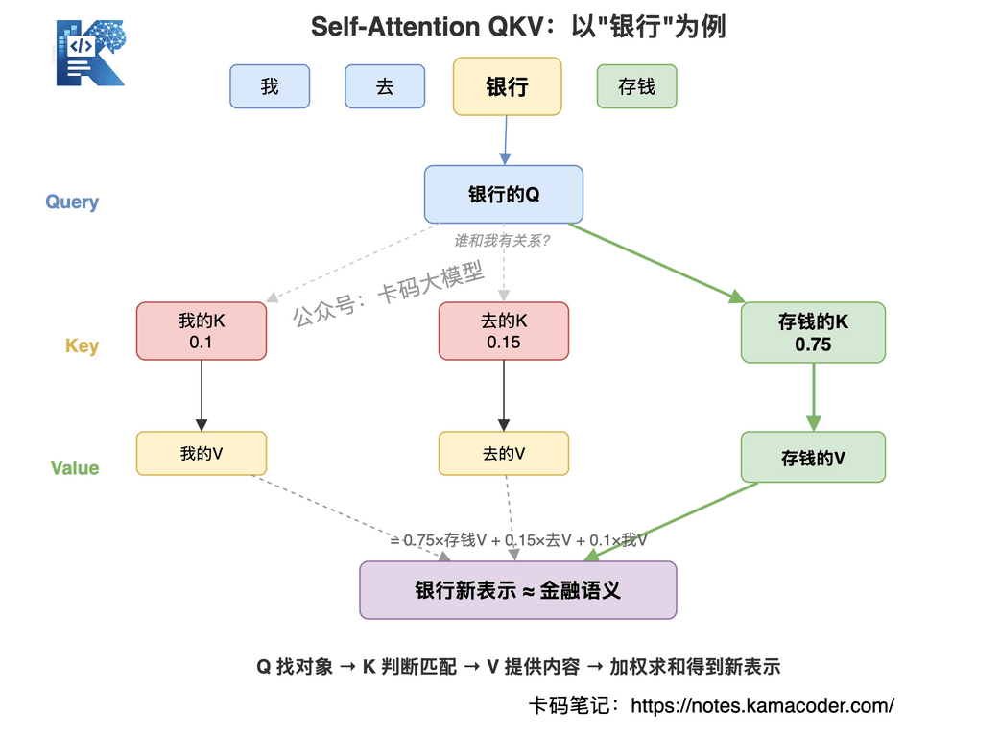

# Перший раунд співбесіди на розробку агентів у Tomato Novel: проєкт копають послідовно вглиб — як відповідати?

Раніше ми розбирали [чотири раунди співбесіди на розробку агентів у ByteDance](./20260506bytedance.md), де тем було багато: промпти, RAG, MCP, донавчання й архітектура агентів.

Цього разу — питання з першого раунду співбесіди на звичайне стажування з розробки застосунків з агентами в Tomato Novel.

Питань більш ніж десяток, складність чимала.

Інтерв'юер не просив переказувати поняття, а весь час копав проєкт: **чому саме такий дизайн? наскільки покращився результат? як ви це виміряли? скільки людей цим користується? що робити, коли сталася помилка?**

Відповіді на кшталт «гібридний пошук дає кращий результат» чи «кілька агентів дозволяють розподілити роботу» не витримують і двох уточнень.

Питання цієї співбесіди:

- 1. Чому гібридний пошук на ES і BM25? Наскільки оптимізували, як міряли, скільки людей користується?
- 2. Документи з вимогами й файли коду зазвичай великі — як забезпечити правильність пошуку? Як визначити, правильно чи ні?
- 3. Навіщо розділяти пам'ять на три шари?
- 4. Розкажіть про дизайн пам'яті: як забезпечуєте коректність довгострокової та зовнішньої пам'яті?
- 5. Plan-and-Execute на топологічному сортуванні DAG — розкажіть про ваш дизайн.
- 6. Як ви провели межі між Planner, Worker і Reviewer? Чи однакові в них інструменти?
- 7. Якщо субагент може викликати ще одного субагента, як не рознести бюджет токенів?
- 8. Яка базова модель? Як упорядковуються повідомлення system, user, assistant, tool у кількох агентів і як уникнути порушення порядку?
- 9. Скільки інструментів під'єднано? Вони локальні чи через MCP?
- 10. Вміст DOM вебсторінки дуже великий — як не переповнити контекст?
- 11. QKV і механізм багатоголової уваги в Transformer.
- 12. Задача з алгоритмів: найдовший підрядок без повторів.

Частину питань автор розповіді лишив без відповіді — я їх доповнив.

### 1. Чому гібридний пошук на ES і BM25? Наскільки оптимізували, як міряли, скільки людей користується?

Одразу уточню: формулювання «ES + BM25» у резюме не дуже коректне. Насправді ми в ES водночас робимо **відбір кандидатів за ключовими словами через BM25 і векторний відбір**, а результати зливаємо через RRF.

Бо шукаємо ми у вимогах і в коді. На точних словах — назвах функцій, кодах помилок — точніший BM25; а природна мова користувача й реалізація в коді часто виражені по-різному: користувач каже «прибрати недійсні книжки», а в коді це може зватися `removeInvalidItems` — тут краще спрацьовує векторний пошук. Ці два шляхи добре доповнюють один одного.

Ми розмітили 620 реальних запитів: 420 для підбору параметрів і 200 як незалежний тестовий набір. На тестовому наборі Recall@10 для BM25 становив 73,5 %, для векторного пошуку — 78,0 %, а гібридний піднявся до 86,5 %. Затримка P95 зросла зі 118 до 189 мілісекунд — для бізнесу прийнятно.

Тоді це було ще внутрішнє тестування: 74 активовані користувачі, стабільно близько 41 на тиждень. Частка прямого використання результатів пошуку зросла з 52,8 % до 64,6 %. Вибірка невелика, тому я визначав це як результат, дійсний для етапу внутрішнього тестування, і не подавав як масштабний продакшн-висновок.


### 2. Документи з вимогами й файли коду зазвичай великі — як забезпечити правильність пошуку? Як визначити, правильно чи ні?

Спочатку ми різали за фіксованою кількістю токенів, і сигнатура функції справді відривалася від її тіла. Потім документи з вимогами почали різати за заголовками й абзацами, а код — за AST до рівня класів і методів, і в кожному чанку зберігати метадані: шлях до файлу, символ, гілку, коміт тощо.

Пошук працює за принципом «влучили в малий блок — повертаємо великий». Спершу відбираємо малі чанки, після злиття RRF беремо Top 30, далі rerank до Top 6; а кладучи в контекст, за `parent_id` добудовуємо повну функцію чи розділ вимог, щоб не отримати кілька обірваних рядків коду.

Правильність оцінюємо на двох рівнях. На рівні пошуку — чи потрапив еталонний файл або фрагмент коду в Top-K, за метриками Recall@K і MRR; на рівні задачі — чи правильні файли зрештою змінив агент, чи пройшли тести, плюс ручне приймання.

Крім того, ми робимо жорстку фільтрацію за `repo, branch, commit_id, правами`, і кожен доказ має шлях і номер рядка. Тоді Reviewer може перевірити джерело й не правитиме код за підсумком без походження.

### 3. Навіщо розділяти пам'ять на три шари?

Ми розділили не заради складної схеми, а тому, що в трьох типів інформації різні життєвий цикл, надійність і спосіб читання.

Перший шар — робоча пам'ять: поточна мета, стан DAG і останні результати інструментів; після завершення задачі це стискається або чиститься. Другий шар — довгострокова пам'ять: уподобання користувача, домовленості в репозиторії, історичний досвід; читається за потреби. Третій шар — зовнішні знання, тобто актуальні факти з платформи вимог, репозиторію коду й документації API.

Якщо звалити все докупи, то, по-перше, марнуються токени, а по-друге, модель легко сприймає історичний висновок за поточний факт.

Коли три шари конфліктують, головним є поточний зовнішній факт. Наприклад, у довгостроковій пам'яті записано JDK 17, а в `pom.xml` поточної гілки вже JDK 21 — тоді істиною є поточний код, а старий запис позначаємо як застарілий.

### 4. Розкажіть про дизайн пам'яті: як забезпечуєте коректність довгострокової та зовнішньої пам'яті?

Я не наважуся сказати, що пам'ять буває стовідсотково правильною; ризик ми знижуємо на трьох етапах — запис, читання й простежуваність.

Під час запису ми зберігаємо не всю переписку, а витягуємо структурований елемент пам'яті з джерелом, часом, областю дії, рівнем упевненості й доказом. У довгострокову пам'ять потрапляють лише факти, підтверджені користувачем, або висновки, перевірені інструментом; одноразовий здогад моделі напряму не записується.

Під час читання спершу йде жорстка фільтрація за користувачем, репозиторієм і гілкою, а далі семантичний відбір і rerank. Вміст із терміном придатності перед використанням ще раз звіряється із зовнішньою системою; у разі конфлікту старого й нового зберігаємо версії, а старе позначаємо застарілим.

Кожне рішення фіксує, який запис пам'яті й який доказ було використано. Якщо трапився поганий випадок, можна визначити, у чому річ: пам'ять застаріла, відбір хибний чи модель помилилася в судженні. Довгострокова пам'ять може бути лише зачіпкою, а ключові факти однаково беруться з поточного коду й поточної версії вимог.

### 5. Plan-and-Execute на топологічному сортуванні DAG — розкажіть про ваш дизайн

Planner видає не кроки природною мовою, а структурований DAG. Кожен вузол містить мету задачі, залежності, вхід і вихід, доступні інструменти, бюджет токенів і таймаут.

Скажімо, одна зміна коду розкладається на: прочитати вимогу, знайти код, проаналізувати вплив, згенерувати патч, протестувати, зробити рев'ю. Незалежні пошукові задачі виконуються паралельно, а генерація патча мусить дочекатися і аналізу вимог, і аналізу коду.

Перед виконанням перевіряємо, чи немає дублікатів вузлів, чи існують залежності й чи немає в графі циклів. Планувальник використовує топологічне сортування Кана й кладе вузли з нульовим степенем входу в чергу готових; стан вузлів і артефакти зберігаються в контрольних точках, тож після збою не доводиться переганяти все заново.

Якщо під час виконання виявляється, що план хибний, помилка повертається в Planner, і перепланувати треба лише уражений підграф. Plan-and-Execute не дорівнює DAG: DAG — лише наш спосіб зробити план інженерним, паралельним і відновлюваним.


### 6. Як ви провели межі між Planner, Worker і Reviewer? Чи однакові в них інструменти?

Інструменти різні — я давав мінімальні права за роллю. Коротко: **Planner відповідає за план, Worker за результат, Reviewer за приймання.**

Planner бачить лише мету користувача, огляд репозиторію та опис інструментів і відповідає за побудову DAG; змінювати файли він не може. Worker виконує один вузол: у пошукового Worker лише інструменти читання, а право запису в робочу копію має тільки Worker, що працює з кодом.

Reviewer може читати вимоги, дивитися diff, ганяти тести й статичні перевірки, але в принципі не змінює код. Знайшовши проблему, він повертає структурований результат рев'ю Worker, щоб не виходило, що він сам виправив і сам погодив.

Ці права прописані не лише в промпті: Tool Gateway авторизує виклики за роллю й областю задачі. Навіть якщо Reviewer згенерує виклик запису у файл, рівень виконання його відхилить.

### 7. Якщо субагент може викликати ще одного субагента, як не рознести бюджет токенів?

Тут не можна покладатися на нагадування в промпті. Ми за замовчуванням забороняємо довільну рекурсію: створювати субагентів можуть лише визначені вузли, а максимальна глибина — 2. На всю задачу є глобальний бюджет токенів, і батьківський агент, породжуючи підзадачу, мусить виділити їй частку зі свого залишку.

У бюджеті резервуються частки для основного потоку, Worker і Reviewer, щоб Worker не витратив усе, а на приймання не лишилося ресурсу. Крім вхідних і вихідних токенів, обмежуються ще й розмір відповіді інструмента, кількість викликів і час виконання.

Батьківський агент передає субагентові лише мінімальний пакет задачі: мету, необхідні докази, інструменти й схему виводу — повну історію переписки він не копіює. Субагент теж повертає лише підсумок, ключові докази й ID артефактів, а не всю траєкторію виконання.

Результати інструментів за замовчуванням обрізаються посторінково; після витрати 70 % бюджету породжувати нових агентів заборонено, а біля межі виконання примусово згортається. Крім того, задача веде ланцюжок предків, щоб не виникло рекурсивного кола, де A викликає B, а B знову A.


### 8. Яка базова модель? Як упорядковуються повідомлення system, user, assistant, tool у кількох агентів і як уникнути порушення порядку?

Основна модель — Qwen2.5-72B-Instruct, розгорнута приватно, інтерфейс через vLLM. Planner і Reviewer працюють на 72B, а прості Worker на кшталт переписування запиту чи реферування маршрутизуються на 14B, щоб знизити вартість і затримку.

Кожен агент має власний тред; усі повідомлення не звалюються в один масив. Системний промпт містить глобальні правила безпеки й межі ролі, а конкретна задача йде як user message; assistant ініціює виклик із `tool_call_id`, а виконавець повертає відповідне tool message.

Події паралельних агентів несуть `run_id, task_id, agent_id, seq_no, parent_event_id`. Усередині одного агента порядок тримається за `seq_no`, а між агентами причинність визначається залежностями DAG і `parent_event_id`, а не тим, хто перший відповів.

Завершивши роботу, субагент повертає лише структурований результат, статус і посилання на докази — повну історію system, assistant і tool у головного агента він не заштовхує. Так ми уникаємо і порушення порядку повідомлень, і взаємного забруднення контекстів різних ролей.

### 9. Скільки інструментів під'єднано? Вони локальні чи через MCP?

Тоді моделі було відкрито 11 інструментів. Сім локальних: читання файлів, пошук за ключовими словами, запит символів, git diff, накладання патча й тестування в пісочниці; ще чотири під'єднані через MCP — документи з вимогами, рев'ю коду, issue й внутрішня база знань.

MCP — це лише протокол під'єднання, він не означає, що інструмент обов'язково віддалений. У нашому випадку серед MCP один сервер локальний через stdio, а три працюють у внутрішній мережі через Streamable HTTP.

Не всі інструменти доступні кожному агентові. Planner бачить лише короткі описи, Worker отримує три-п'ять інструментів залежно від задачі, Reviewer має лише інструменти читання й перевірки. Так ми і економимо токени на схемах інструментів, і зменшуємо ризик хибного вибору чи виклику поза правами.

### 10. Вміст DOM вебсторінки дуже великий — як не переповнити контекст?

Ми не кладемо сирий HTML у контекст. Після завантаження сторінки спершу видаляємо script, style, рекламу, приховані вузли й повторювану навігацію; на сторінках із текстом основний зміст витягуємо через Readability, а на інтерактивних лишаємо тільки елементи, з якими можна взаємодіяти.

Те, що лишилося, спрощується до структури `node_id, role, name, state` і ділиться на блоки за section, table, form. Агент спершу бачить огляд сторінки, а потрібний блок дочитує окремо.

За один виклик інструмент повертає щонайбільше 4 тис. токенів, за одну сторінку сумарно щонайбільше 12 тис., далі йде посторінкове розбиття. Під час послідовних дій передається лише поточний viewport і вузли, що змінилися, — уся сторінка повторно не надсилається.

Перед кожним вставлянням у контекст ми ще й оцінюємо кількість токенів: якщо бюджет перевищено, спершу робимо пошук або підсумок. На динамічних сторінках у пріоритеті дерево доступності чи дозволені структуровані інтерфейси — стан ми не вгадуємо з десятків тисяч рядків DOM.

### 11. QKV і механізм багатоголової уваги в Transformer

Представлення вхідних токенів — це `X`; помноживши його на три матриці, що навчаються, отримуємо Q, K, V. Q виражає, що саме шукає поточний токен; K потрібен, щоб обчислити з Q міру відповідності; V — це вміст, який після зіставлення справді агрегується.

Обчислення виглядає як `softmax(QK^T / sqrt(dk))V`. Ділення на `sqrt(dk)` потрібне, щоб зі зростанням розмірності скалярний добуток не ставав завеликим і softmax не робився надто гострим.

Багатоголова увага проєктує приховану розмірність у кілька підпросторів, і кожна голова рахує увагу незалежно, тож можна вивчити різні типи зв'язків. Наприкінці результати голів конкатенують і через `Wo` проєктують назад у розмірність моделі. Головним вузьким місцем щодо довжини послідовності лишається O(n²).



### 12. Задача з алгоритмів: найдовший підрядок без повторів

Мій підхід — ковзне вікно: правий вказівник іде по рядку, а хеш-таблиця зберігає позицію останньої появи кожного символу. Якщо символ повторюється всередині поточного вікна, ліву межу пересуваємо на позицію після попередньої появи.

Кожен символ відвідується правим вказівником щонайбільше один раз, а ліва межа рухається лише вправо, тож часова складність O(n), просторова — O(розмір алфавіту).

```python
def length_of_longest_substring(s: str) -> int:
    last = {}
    left = 0
    ans = 0

    for right, ch in enumerate(s):
        if ch in last:
            left = max(left, last[ch] + 1)

        last[ch] = right
        ans = max(ans, right - left + 1)

    return ans
```

Тут для `left` обов'язково треба брати max. Скажімо, у рядку `abba`, коли ми доходимо до останнього `a`, його попередня поява вже поза вікном, і ліва межа не має відкочуватися назад. Порожній рядок дає 0, рядок з однакових символів — 1.

### Що в цьому раунді справді чіпляло

Питання тут не екзотичні.

RAG, кілька агентів, пам'ять, MCP, Transformer, ковзне вікно — усе це звичні теми. Важким було те, що інтерв'юер за кожним терміном із проєкту копав на три рівні вглиб:

**навіщо робили → як реалізували → як довели, що це працює.**

У відповідях добре додають балів три речі.

Перше: помітивши неточний термін, виправити його самому. Наприклад, «ES + BM25» правильніше сказати як «векторний відбір у ES + відбір за ключовими словами через BM25».

Друге: не називати лише найкрасивіше число. Розкажіть заразом, звідки взявся тестовий набір, як визначено метрику, якою була ціна в затримці й скільки було користувачів.

Третє: менше казати «гарантовано правильно» чи «точно не переповниться». У справжніх системах таких гарантій майже не буває. По-інженерному звучить інакше: **на яких етапах я знижую ризик, за яким порогом вмикається понижений режим і чи можна простежити помилку.**

Якщо мультиагентна частина ще не дуже зрозуміла, читайте далі [комунікацію й оркестрацію кількох агентів](./multi_agent_communication_interview.md) і [Multi-Agent Harness](./multi_agent_harness_interview.md); оцінювання пошуку звіряйте з [Де RAG найважче впровадити](./rag_hardest_parts_interview.md); а QKV і багатоголову увагу підтягніть у [збірці питань про Transformer](./transformer_interview.md).

Співбесіда — це не декламація відповідей.

**Витримує уточнення лише той, хто розповідає про свій проєкт правдиво, детально й із замкненим циклом.**
