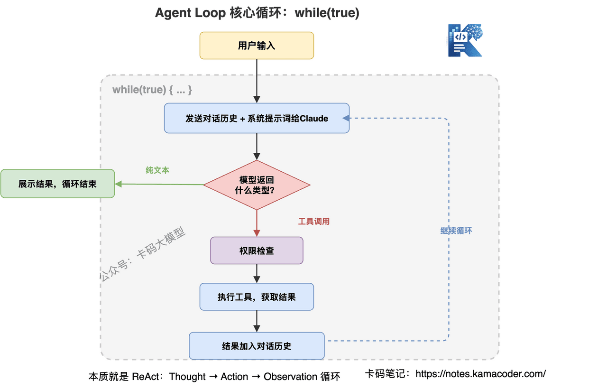
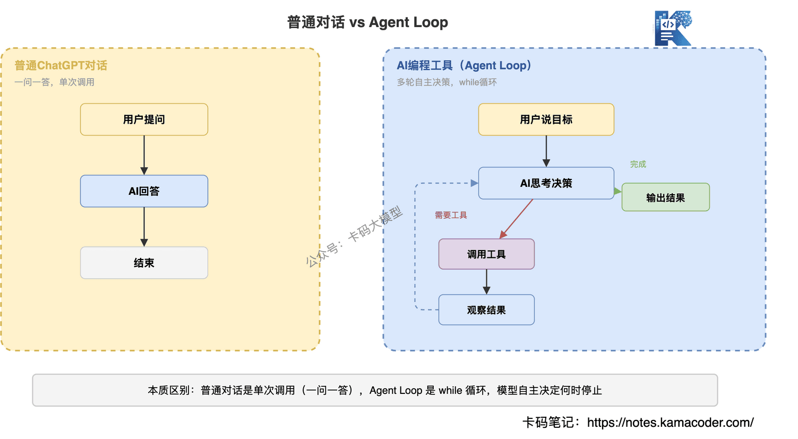
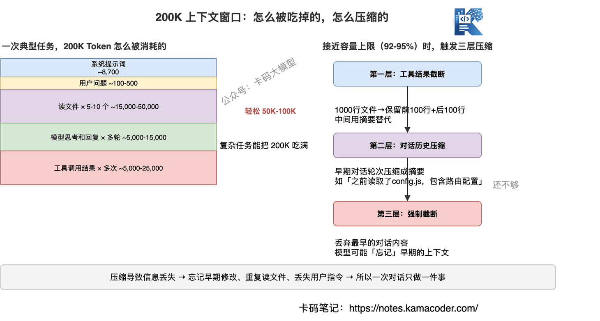
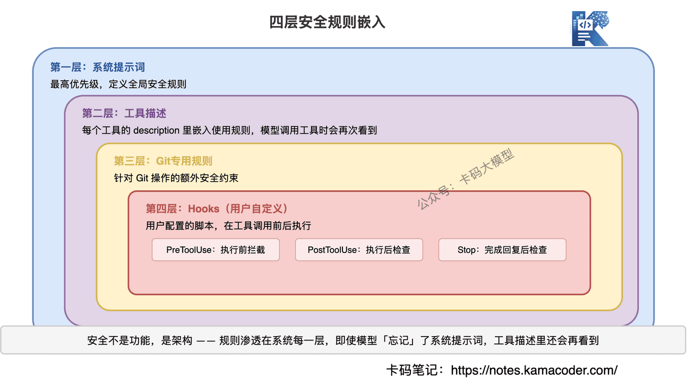
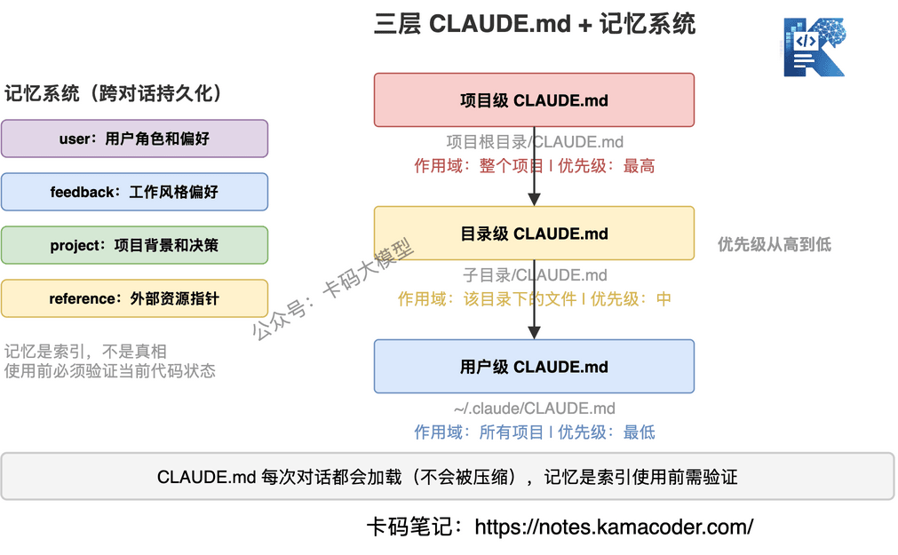

# Збірка питань про Claude Code: витік вихідного коду, цикл агента й системний промпт — глибокий розбір принципів роботи

> **Станом на вересень 2026.** Ціни моделей і деталі реалізації швидко змінюються — перед використанням звіряйтеся з офіційною документацією.

Сьогодні довгий і суто технічний текст.

Агенти для програмування вже увійшли в нашу щоденну роботу, але чи замислювалися ви: **як ці інструменти працюють усередині?**

Більшість уміє ними користуватися, але не знає принципів. Коли виходить добре, здається, що AI всемогутній; коли погано — що він дурний. **Корінь у тому, що ви не розумієте механізму його роботи.**

Тут ми розберемо повний принцип роботи Claude Code від самого низу. Чому саме Claude Code?

Бо 31 березня 2026 року сталася подія: **Anthropic випадково оприлюднила повний вихідний код Claude Code**. 512 000 рядків TypeScript, включно із системним промптом, визначеннями інструментів і правилами безпеки.

Це перший випадок, коли в галузі інструментів програмування з AI повністю витік код продуктового рівня. В основі розбору — матеріали репозиторію learn-claude-code (https://github.com/shareAI-lab/learn-claude-code) плюс власне розуміння.

**Прочитавши це, ви зрозумієте базову логіку всіх інструментів програмування з AI — бо їхні архітектури загалом подібні.**

## Зміст

1. [Як стався витік вихідного коду Claude Code і що саме витекло](#1-як-стався-витік-вихідного-коду-claude-code-і-що-саме-витекло)
2. [Яка базова архітектура інструментів програмування з AI і чим вона відрізняється від звичайного діалогу](#2-яка-базова-архітектура-інструментів-програмування-з-ai-і-чим-вона-відрізняється-від-звичайного-діалогу)
3. [Що написано в системному промпті на 8700 токенів](#3-що-написано-в-системному-промпті-на-8700-токенів)
4. [Як спроєктовано понад 18 вбудованих інструментів і чому спеціалізовані замість Bash](#4-як-спроєктовано-понад-18-вбудованих-інструментів-і-чому-спеціалізовані-замість-bash)
5. [Як працює механізм субагентів і коли вони запускаються](#5-як-працює-механізм-субагентів-і-коли-вони-запускаються)
6. [Як керується контекстне вікно на 200 тисяч і що робить механізм стиснення](#6-як-керується-контекстне-вікно-на-200-тисяч-і-що-робить-механізм-стиснення)
7. [Як захищають 23 шари перевірок безпеки і як оцінюються права](#7-як-захищають-23-шари-перевірок-безпеки-і-як-оцінюються-права)
8. [Як CLAUDE.md і система пам'яті дають AI «пізнати» проєкт](#8-як-claudemd-і-система-памяті-дають-ai-пізнати-проєкт)
9. [Як розподілено ролі у стратегії двох моделей і як контролюється вартість](#9-як-розподілено-ролі-у-стратегії-двох-моделей-і-як-контролюється-вартість)
10. [Чого корисного розробник може навчитися з Claude Code](#10-чого-корисного-розробник-може-навчитися-з-claude-code)
11. [Часті уточнення на співбесідах](#11-часті-уточнення-на-співбесідах)

---

## 1. Як стався витік вихідного коду Claude Code і що саме витекло

Інтерв'юер зазвичай питає: «Ви чули про витік вихідного коду Claude Code? Чого ви з нього навчилися?»

31 березня 2026 року хтось помітив, що npm-пакет Claude Code (v2.1.88) має аномальний розмір — **59,8 МБ**, удесятеро більший за звичайну версію.

Причина проста: інженери Anthropic під час публікації забули виключити файли source map. Що це таке? Це відображення скомпільованого коду у вихідний, за яким TypeScript-код відновлюється повністю.

У витік потрапили:

- **повний системний промпт** — близько 8700 токенів з усіма правилами поведінки;
- **повні визначення понад 18 вбудованих інструментів** — параметри, описи й правила використання кожного;
- **механізм перевірок безпеки** — повна логіка 23 послідовних перевірок;
- **архітектура субагентів** — дизайн трьох типів: Explore, Plan, General-purpose;
- **стратегії керування контекстом** — тришаровий механізм стиснення для вікна на 200 тисяч;
- **система прав** — порядок оцінювання deny > ask > allow.

Anthropic усунула проблему за кілька годин, але код уже був повністю збережений спільнотою.

**Цей витік уперше показав повну внутрішню структуру продуктового інструмента для програмування з AI.** Далі розбираємо її шар за шаром.

---

## 2. Яка базова архітектура інструментів програмування з AI і чим вона відрізняється від звичайного діалогу

Інтерв'юер спитає: «Яка базова архітектура в інструментів програмування з AI? Чим вона принципово відрізняється від звичайного діалогу?»

Багато хто вважає такі інструменти складними. Насправді ядро архітектури Claude Code — **це while-цикл**.

Саме так, настільки просто.

### Основний цикл: ввід користувача → міркування моделі → виклик інструмента → зворотний зв'язок

Робочий процес Claude Code можна описати одним реченням: **безперервно крутити «подумав — зробив — подивився», доки задачу не виконано.**



Псевдокодом:

```
while (true) {
  // 1. надсилаємо Claude історію діалогу разом із системним промптом
  response = claude.chat(messages)

  // 2. якщо модель повернула звичайний текст — задачу виконано, виходимо
  if (response.type === 'text') {
    display(response.text)
    break
  }

  // 3. якщо модель повернула виклик інструмента — виконуємо його
  if (response.type === 'tool_use') {
    // перевірка прав
    if (!checkPermission(response.tool)) {
      result = askUserPermission(response.tool)
    }
    // виконання інструмента
    result = executeTool(response.tool, response.params)
    // результат іде в історію діалогу
    messages.push({ role: 'tool', content: result })
  }
}
```

**Це і вся основна логіка Claude Code.** Уся складність — вибір інструментів, керування контекстом, перевірки безпеки — живе на окремих ланках цього циклу.

### Чому саме while-цикл, а не один виклик

Це і є принципова різниця між інструментом програмування з AI і звичайним чатом.



Звичайний діалог — це **питання й відповідь**: ви спитали, AI відповів, кінець.

Інструмент програмування з AI — це **багатораундові самостійні рішення**. Ви кажете «полагодь цей баг», і AI може знадобитися:

1. спершу прочитати файл і зрозуміти структуру коду;
2. знайти дотичні файли й першопричину;
3. змінити код і виправити баг;
4. прогнати тести й перевірити виправлення;
5. побачити, що тести ще падають, і виправляти далі;
6. зрештою підтвердити, що все виправлено, і віддати результат.

Кожен крок — одна ітерація циклу. **Модель сама вирішує, що робити далі, доки не вважатиме задачу виконаною.**

### Умова зупинки

Коли цикл спиняється? У двох випадках:

1. **модель повернула звичайний текст** — вона вважає задачу виконаною й більше не викликає інструментів;
2. **спрацювало обмеження безпеки** — наприклад, перевищено кількість викликів інструментів або користувач перервав роботу.

Витонченість тут у тому, що **умову зупинки визначає сама модель**. Це не жорстко зашите «після трьох викликів інструментів спиняємося», а рішення моделі за станом виконання задачі. Саме тому Claude Code іноді проходить кілька десятків кроків поспіль, щоб виконати складну задачу.

### Зв'язок із патерном ReAct

Якщо ви знайомі з розробкою агентів, то впізнаєте класичний патерн **ReAct (Reasoning + Acting)**:

- **Reasoning** — модель обмірковує наступний крок;
- **Acting** — викликає інструмент і виконує дію;
- **Observation** — дивиться на результат;
- і так по колу.

Claude Code не винайшов нічого нового: він просто довів ReAct до граничної інженерної досконалості. **Архітектура нескладна — бар'єром є інженерні деталі.**

---

## 3. Що написано в системному промпті на 8700 токенів

Інтерв'юер спитає: «Який завдовжки системний промпт у Claude Code? Що в ньому написано?»

Системний промпт є кодексом поведінки AI. У Claude Code він займає близько 8700 токенів і є найдетальнішим відомим системним промптом серед інструментів програмування з AI.

### Із чого складаються 8700 токенів


Системний промпт не є суцільним текстом: він склеєний із кількох модулів.

| Модуль | Токенів | Призначення |
|---|---|---|
| Системні правила | ~2900 | Основні норми поведінки, правила безпеки |
| Визначення інструментів | ~3000 | Параметри й опис використання понад 18 інструментів |
| CLAUDE.md | ~1200 | Власні інструкції рівня проєкту |
| Загальні правила | ~500 | Стиль коду, формат виводу |
| Правила Git | ~300 | Норми безпеки для операцій із Git |
| Визначення скілів | ~800 | Перелік доступних скілів |

### Ключове рішення: CLAUDE.md підставляється як повідомлення користувача

Тут дуже цікаве проєктне рішення: **вміст CLAUDE.md кладеться не в системний промпт, а підставляється як повідомлення користувача.**

Чому? Бо системний промпт має найвищий пріоритет, і якби CLAUDE.md лежав там, користувацькі інструкції були б нарівні з правилами безпеки Anthropic — і через них можна було б обійти обмеження.

Як повідомлення користувача CLAUDE.md має пріоритет нижчий за правила безпеки в системному промпті, але вищий за звичайні повідомлення. **Це баланс між безпекою й гнучкістю.**

### «Вкладеність правил» у промпті

У системного промпта Claude Code є особливість: **правила безпеки написані не лише в ньому, а й вбудовані в опис кожного інструмента.**

Наприклад, в описі інструмента Bash сказано:

- не читай файли через cat/head/tail — використовуй Read;
- не редагуй файли через sed/awk — використовуй Edit;
- не пиши у файли через echo — використовуй Write.

Тобто навіть якщо модель «забуде» правило із системного промпта, під час виклику інструмента вона побачить його знову. **Подвійна страховка.**

### Дизайн «тону» промпта

Якщо придивитися до системного промпта Claude Code, його тон дуже конкретний:

> «Don't add features, refactor, or introduce abstractions beyond what the task requires.»
> «Three similar lines is better than a premature abstraction.»
> «Default to writing no comments.»

Це не абстрактне «пиши добрий код», а цілком конкретна філософія програмування. **Anthropic записала власну інженерну культуру в промпт.** Саме тому код від Claude Code має досить однорідний стиль: це не вроджена властивість моделі, а обмеження промпта.

---

## 4. Як спроєктовано понад 18 вбудованих інструментів і чому спеціалізовані замість Bash

Інтерв'юер спитає: «Які вбудовані інструменти є в Claude Code? Навіщо проєктувати спеціалізовані, якщо є Bash?»

Хоч яка розумна модель, без інструментів вона може лише говорити. Понад 18 вбудованих інструментів Claude Code — це його руки й ноги, які дають реально працювати з вашим кодом.

### Панорама інструментів


За призначенням.

**Робота з файлами**

| Інструмент | Функція | Ключова особливість |
|---|---|---|
| Read | Читання файлу | Підтримує зображення, PDF, Jupyter Notebook |
| Write | Запис файлу | Повне перезаписування, пасує для нових файлів |
| Edit | Редагування файлу | Точна заміна, надсилається лише diff |
| Glob | Пошук файлів | Зіставлення шляхів за шаблоном |
| Grep | Пошук у вмісті | Пошук ключових слів усередині файлів |

**Виконання**

| Інструмент | Функція | Ключова особливість |
|---|---|---|
| Bash | Виконання команд оболонки | Підтримує таймаут і фоновий запуск |
| NotebookEdit | Редагування Jupyter | Робота з комірками ноутбука |

**Мережа**

| Інструмент | Функція | Ключова особливість |
|---|---|---|
| WebFetch | Завантаження сторінки | Автоматичне перетворення HTML у Markdown |
| WebSearch | Пошук у мережі | Отримання актуальної інформації |

**Агентські**

| Інструмент | Функція | Ключова особливість |
|---|---|---|
| Agent | Запуск субагента | Паралельна обробка складних задач |
| Skill | Виклик скіла | Виконання наперед визначеного процесу |

**Взаємодія**

| Інструмент | Функція | Ключова особливість |
|---|---|---|
| AskUserQuestion | Питання користувачеві | Одиночний або множинний вибір, вільний ввід |
| TodoWrite | Керування задачами | Створення й відстеження списку задач |

### Ключові принципи дизайну інструментів

**Принцип 1: спеціалізований інструмент має пріоритет над універсальною командою**

У системному промпті Claude Code прямо написано:

> «Prefer dedicated tools over Bash when one fits (Read, Edit, Write) — reserve Bash for shell-only operations.»

Чому не читати файл через `cat` і не правити через `sed`? Бо в спеціалізованих інструментів краща обробка помилок, контроль прав і досвід користувача. Користувач бачить «Claude редагує файл», а не купу команд оболонки.

**Принцип 2: Edit надсилає лише diff**

Дуже розумне рішення. Edit не переписує весь файл, а вказує `old_string` і `new_string` і замінює лише відповідну частину.

Переваги:

- економія токенів — увесь файл не треба класти в контекст;
- менше конфліктів — змінюється лише потрібне;
- зручність рев'ю — користувач одразу бачить, що саме змінено.

Недолік:

- `old_string` має збігатися однозначно — якщо у файлі є повтори, доводиться додавати більше контексту для локалізації.

**Принцип 3: опис інструмента і є правилом**

У полі description кожного інструмента вбудовано правила використання. Скажімо, опис Bash займає кілька сотень слів і містить:

- коли варто й коли не варто брати Bash;
- як працювати з довготривалими командами;
- норми безпеки для операцій із Git;
- найкращі практики паралельного запуску кількох команд.

**Щоразу, коли модель збирається викликати інструмент, вона знову бачить ці правила.** Це значно надійніше, ніж написати їх один раз у системному промпті.

### Bash: найпотужніший і найнебезпечніший

Bash — найпотужніший інструмент у Claude Code: теоретично він виконує будь-яку команду оболонки. Саме тому в нього найбільше обмежень:

1. **таймаут 2 хвилини за замовчуванням** — щоб уникнути нескінченних циклів;
2. **не підтримує інтерактивні команди** — не можна vim, не можна git rebase -i;
3. **довгі команди мають іти у фон** — dev-сервер і режим watch не мають блокувати;
4. **найсуворіша перевірка прав** — rm -rf і git push --force потребують підтвердження користувача.

Тут утілено головну ідею: **дати AI достатньо спроможностей, але обмежити межі поведінки правилами.**

---

## 5. Як працює механізм субагентів і коли вони запускаються

Інтерв'юер спитає: «Як працюють субагенти в Claude Code? У яких сценаріях вони запускаються?»

Коли задача надто складна й один агент не справляється, Claude Code запускає субагентів — своєрідні «двійники» для підзадач.

### Три типи субагентів


| Тип | Модель | Спроможності | Сценарій |
|---|---|---|---|
| Explore | Haiku (найдешевша) | Лише читання (пошук, читання файлів) | Швидке дослідження кодової бази |
| Plan | Успадковує модель батька | Лише читання | Проєктування рішення |
| General-purpose | Успадковує модель батька | Усі інструменти | Складні багатокрокові задачі |

### Explore: найдешевшою моделлю робити найбруднішу роботу

Explore — найуживаніший субагент, і його дизайн дуже витончений:

- **працює на Haiku** — украй дешево й дуже швидко;
- **має лише права читання** — не може змінювати файли, тільки шукати й читати;
- **усередині може спалити 100+ тис. токенів** — багато читає у власному контексті;
- **батьківському агентові повертає підсумок на 1500–2000 токенів**.

Що це означає? Explore може прочитати кілька десятків файлів і обшукати всю кодову базу, але поверне головному агентові лише стислий підсумок. **Контекстне вікно головного агента не роздувається купою коду.**

Це дуже важливе архітектурне рішення: **дешевий субагент збирає інформацію, дорогий головний агент ухвалює рішення.**

### Обмеження субагентів

1. **не більше одного рівня вкладення** — субагент не може запустити ще одного, щоб уникнути нескінченної рекурсії;
2. **окремий контекст** — субагент не бачить історії діалогу батька, тож у промпті йому треба дати достатньо інформації;
3. **результат невидимий користувачеві** — вивід субагента повертається лише батьківському агентові, проміжного процесу користувач не бачить.

### Паралельні субагенти

Claude Code може запускати кількох субагентів одночасно. Наприклад:

- один Explore шукає у фронтенд-коді, другий — у бекенді;
- один агент проганяє тести, другий перевіряє типи.

**Паралельні субагенти є ключовою спроможністю Claude Code для великих задач.** Те, що не подужає один, ділиться між кількома «двійниками».

### Вартість субагентів

Тут є цілком практичне питання: субагенти теж коштують грошей.

- Explore на Haiku дуже дешевий (близько $0,25 за мільйон вхідних токенів);
- General-purpose на Opus чи Sonnet коштує стільки ж, скільки головний агент.

Тож стратегія Claude Code така: **якщо задачу можна розв'язати через Explore, General-purpose не запускаємо.** Повноцінний субагент беруть лише тоді, коли справді треба змінювати файли чи виконувати складні операції.

За наявними оцінками, середня вартість використання Claude Code становить близько **$6 на розробника на день**, тобто $100–200 на місяць. Розумне використання субагентів є ключем до контролю вартості.

---

## 6. Як керується контекстне вікно на 200 тисяч і що робить механізм стиснення

Інтерв'юер спитає: «Чому вікна на 200 тисяч токенів усе одно не вистачає? Як Claude Code працює з переповненням контексту?»

Контекстне вікно Claude Code — 200 тисяч токенів. Звучить багато, але в реальних задачах воно витрачається швидше, ніж здається.

### Куди дівається контекст

Типова задача програмування споживає контекст приблизно так.

| Вміст | Витрата токенів |
|---|---|
| Системний промпт | ~8700 |
| Питання користувача | ~100–500 |
| Читання одного файлу (500 рядків) | ~3000–5000 |
| Вивід команди Bash | ~500–2000 |
| Міркування й відповідь моделі | ~1000–3000 |
| Результат викликів інструментів за раунд | ~1000–5000 |

Задача «полагодь цей баг» може вимагати прочитати 5–10 файлів, кілька разів пошукати й багато разів відредагувати — **і це легко з'їдає 50–100 тисяч токенів**. Складна задача здатна забити всі 200 тисяч.

### Тришаровий механізм стиснення



Коли контекст наближається до межі (92–95 %), Claude Code запускає стиснення. Воно має три шари.

**Шар 1: обрізання результатів інструментів**

Першими стискаються результати викликів інструментів. Скажімо, ви прочитали файл на 1000 рядків: після стиснення може лишитися перша й остання сотня рядків, а середина замінюється підсумком.

**Шар 2: стиснення історії діалогу**

Ранні раунди зводяться в підсумок. Наприклад, вміст файлу, який AI читав пів години тому, перетворюється на «раніше прочитано файл config.js, у ньому конфігурація маршрутизації».

**Шар 3: примусове обрізання**

Якщо перших двох шарів замало, найраніша частина діалогу обрізається примусово. Тоді модель може «забути» ранній контекст.

### Проблеми, які створює стиснення

Стиснення не безкоштовне: воно втрачає інформацію. Найтиповіші проблеми:

1. **забуті ранні зміни** — ви дали змінити файл A, потім змінили ще багато файлів, а згодом виявляється, що AI забув про зміни у файлі A;
2. **повторне читання файлів** — AI забув, що вже читав файл, читає знову й марнує токени;
3. **втрачені інструкції користувача** — сказане на початку «не чіпай цей файл» після стиснення може зникнути.

### Практичні поради

Розуміючи механізм, ви знаєте, як користуватися Claude Code ефективніше.

1. **одна розмова — одна справа**: не змішуйте в одній сесії виправлення бага, нову функціональність і рефакторинг, бо контекст вибухне;
2. **ключові інструкції тримайте в найсвіжіших повідомленнях**: не сподівайтеся, що AI пам'ятає сказане пів години тому;
3. **для складних задач використовуйте CLAUDE.md**: правила проєкту завантажуються в кожній розмові й не стискаються;
4. **користуйтеся субагентами**: хай Explore читає файли, і головний контекст не забиватиметься кодом.

---

## 7. Як захищають 23 шари перевірок безпеки і як оцінюються права

Інтерв'юер спитає: «Який найбільший ризик безпеки в інструментів програмування з AI? Як Claude Code не дає AI виконати небезпечну операцію?» Або: «Як спроєктовано модель прав у Claude Code? Який пріоритет у deny, ask і allow?»

Який найбільший ризик? **Він може виконати будь-яку команду оболонки.**

Уявіть: ви просите AI «прибрати тимчасові файли», а він виконує `rm -rf /`. Або просите «залити код», а він робить `git push --force` і перекриває коміти колеги.

Claude Code запобігає цьому механізмом із 23 шарів перевірок.

### Модель прав: deny > ask > allow


Оцінювання прав у Claude Code має суворий пріоритет:

1. **deny (відмова)** — найвищий пріоритет: збіг означає відмову без питань до користувача;
2. **ask (запит)** — середній пріоритет: збіг означає запит підтвердження в користувача;
3. **allow (дозвіл)** — найнижчий пріоритет: збіг означає негайне виконання.

Порядок важливий: **deny завжди має перевагу над allow.** Навіть якщо ви дозволили певну операцію в конфігурації, збіг із правилом deny означає відмову.

### Чотири режими прав

| Режим | Опис | Сценарій |
|---|---|---|
| default | Більшість операцій потребує підтвердження | Щоденна робота |
| acceptEdits | Редагування файлів дозволено автоматично, решта з підтвердженням | Коли ви довіряєте змінам коду від AI |
| plan | Дозволено лише операції читання | Коли треба, щоб AI аналізував, але не змінював |
| bypassPermissions | Дозволено все автоматично | Повна довіра (небезпечно) |

### Де саме вбудовано правила безпеки

Правила безпеки в Claude Code не зібрані в одному місці, а **розподілені по всіх шарах системи**.



**Шар 1: системний промпт**

```
"Be careful not to introduce security vulnerabilities such as
command injection, XSS, SQL injection..."
```

**Шар 2: описи інструментів**

```
В описі інструмента Bash:
"Never skip hooks (--no-verify) or bypass signing"
"Before running destructive operations, consider safer alternatives"
```

**Шар 3: окремі правила для Git**

```
"NEVER run force push to main/master"
"NEVER update the git config"
"Always create NEW commits rather than amending"
```

**Шар 4: механізм хуків**

Користувач може налаштувати хуки — власні скрипти до й після виклику інструмента. Наприклад:

- `PreToolUse`: перевірка перед виконанням, можна перехопити небезпечну операцію;
- `PostToolUse`: перевірка після виконання, можна відкотити хибну дію;
- `Stop`: виконується після завершення відповіді AI, можна зробити фінальну перевірку.

### «Сім разів відміряй»

У системному промпті є фраза, варта уваги:

> «measure twice, cut once» — «відміряй двічі, відріж один раз».

Це і є ключова філософія безпеки Claude Code: **краще перепитати зайвий раз, ніж виконати незворотну операцію.**

На практиці це означає:

- підтвердження перед видаленням файлів;
- підтвердження перед force push;
- підтвердження перед зміною конфігурації CI/CD;
- підтвердження перед надсиланням повідомлень у зовнішні сервіси.

**Усі дії, які важко скасувати, потребують явної згоди користувача.**

### Перевірка безпеки двома моделями

Тут ще одне витончене рішення: Claude Code використовує для перевірок безпеки **дві моделі**.

- **Haiku (мала модель)**: швидка оцінка прав — чи треба питати користувача?
- **Opus/Sonnet (велика модель)**: складне міркування про безпеку — чи є тут прихований ризик?

Чому не все на великій моделі? Бо перевірка прав є високочастотною операцією: вона робиться перед кожним викликом інструмента. Haiku робить первинний відсів дешево й швидко, а велику модель залучають лише для складних суджень. **Про це — наступний розділ.**

---

## 8. Як CLAUDE.md і система пам'яті дають AI «пізнати» проєкт

Інтерв'юер спитає: «Навіщо потрібен CLAUDE.md? Чому його не можна класти в системний промпт?» Або: «Як спроєктувати систему пам'яті? Що робити, коли пам'ять розходиться з фактичним станом коду?»

На початку кожної нової розмови Claude Code — чистий аркуш: він не знає ні структури проєкту, ні стандартів коду, ні ваших уподобань у стеку. **CLAUDE.md розв'язує саме це.**

### CLAUDE.md: «інструкція» рівня проєкту

CLAUDE.md — файл у корені проєкту, який автоматично завантажується в контекст на початку кожної розмови. У ньому можна писати:

- опис архітектури проєкту;
- часті команди (збірка, тести, розгортання);
- стандарти й вимоги до стилю коду;
- стек і залежності;
- відомі проблеми й застереження.

```markdown
# CLAUDE.md

## Огляд проєкту
Це платформа електронної комерції на Next.js 14 із App Router.

## Часті команди
- npm run dev: запустити сервер розробки
- npm run test: прогнати тести
- npm run build: зібрати продакшн-версію

## Стандарти коду
- TypeScript у режимі strict
- Компоненти пишемо функційно
- Стан через Zustand
- Запити через React Query
```

### Три рівні CLAUDE.md

Claude Code підтримує три рівні CLAUDE.md, за пріоритетом від вищого до нижчого.

| Рівень | Розташування | Область дії |
|---|---|---|
| Проєкт | корінь проєкту/CLAUDE.md | Увесь проєкт |
| Тека | підтека/CLAUDE.md | Файли в цій теці |
| Користувач | ~/.claude/CLAUDE.md | Усі проєкти |

**Рівень теки особливо корисний.** Скажімо, у фронтенд- і бекенд-теках різні стандарти коду — тож для кожної пишемо свій CLAUDE.md.

### Система пам'яті: персистентність між розмовами

CLAUDE.md розв'язує контекст рівня проєкту, але є інформація, що живе між проєктами й розмовами: ваші вподобання в коді, ваша роль, ваш попередній зворотний зв'язок.

Система пам'яті Claude Code зберігає це у файлах:

```
~/.claude/projects/<project>/memory/
├── MEMORY.md          # покажчик пам'яті
├── user_role.md       # інформація про роль користувача
├── feedback_style.md  # уподобання щодо стилю роботи зі зворотного зв'язку
└── project_context.md # контекст проєкту
```

Пам'ять буває чотирьох типів:

- **user**: роль, уподобання й фонові знання користувача;
- **feedback**: виправлення й підтвердження щодо поведінки AI;
- **project**: мета, прогрес і передумови рішень у проєкті;
- **reference**: вказівники на зовнішні ресурси (наприклад, «трекер багів — у проєкті INGEST у Linear»).

### Ключовий принцип пам'яті: «сумнівний покажчик, а не надійна істина»



Це найважливіше в дизайні системи пам'яті: **пам'ять є покажчиком, а не істиною.**

У системному промпті прямо сказано:

> «Memory records can become stale over time... Before answering the user or building assumptions based solely on information in memory records, verify that the memory is still correct and up-to-date by reading the current state of the files.»

Людською мовою: **AI не може просто так змінити 50-й рядок лише тому, що в пам'яті записано «у config.js на 50-му рядку конфігурація маршрутизації» — він мусить спершу прочитати файл і перевірити.** Бо коли запис робився, це був 50-й рядок, а зараз усе могло змінитися.

Дуже прагматичне рішення: пам'ять допомагає швидко локалізувати інформацію, але остаточне рішення спирається на фактичний стан коду.

### Межа безпеки для CLAUDE.md

Як уже сказано, CLAUDE.md підставляється як повідомлення користувача, а не як системний промпт. Це означає:

- CLAUDE.md **не може** перекрити правила безпеки Anthropic;
- CLAUDE.md **не може** змусити AI виконати заборонену операцію;
- CLAUDE.md **може** налаштувати стиль коду, правила проєкту й робочі процеси.

**Це ретельно спроєктована межа довіри: супровідник проєкту може налаштувати поведінку AI, але не може пробити базовий рівень безпеки.**

---

## 9. Як розподілено ролі у стратегії двох моделей і як контролюється вартість

Інтерв'юер спитає: «Навіщо Claude Code дві моделі? Чому не все на великій?» Або: «Наскільки ефективна стратегія двох моделей за вартістю? Що йде на малу модель, а що на велику?»

Claude Code працює не на одній моделі, а на двох у зв'язці. Це дуже розумна оптимізація вартості.

### Дві моделі, дві ролі


| Модель | Роль | За що відповідає | Вартість |
|---|---|---|---|
| Haiku | «Інтуїція» | Оцінка прав, витягання метаданих, швидка класифікація | ~$0,25 за млн вхідних токенів |
| Opus/Sonnet | «Мозок» | Розуміння коду, проєктування рішень, складне міркування | ~$15 за млн вхідних токенів |

Різниця в ціні — **60 разів**. Якби все йшло через Opus, вартість була б неприйнятною.

### Що бере на себе Haiku: швидкі рішення

Перед кожним викликом інструмента Claude Code має вирішити: чи треба питати користувача? Це часте, але просте рішення — розуміти логіку коду не потрібно, досить зіставити правила.

Наприклад:

- `Read("config.js")` → читання файлу, безпечно, дозволяємо;
- `Bash("rm -rf node_modules")` → видалення, потрібне підтвердження;
- `Edit("app.js", ...)` → редагування, рішення залежить від режиму прав.

Для таких суджень Haiku цілком досить: швидко й дешево.

### Що бере на себе Opus/Sonnet: повільне мислення

Велика модель справді потрібна там, де треба:

- зрозуміти намір користувача — що саме означає «оптимізуй цю функцію»?
- проаналізувати логіку коду — у чому першопричина бага?
- спроєктувати рішення — як рефакторити цей фрагмент?
- згенерувати код — правильний і в стилі проєкту.

Це потребує глибокого міркування, і тут потрібна лише велика модель.

### Реальний ефект для вартості

Завдяки двом моделям Claude Code віддає масу малоцінних суджень Haiku й бере Opus/Sonnet лише тоді, коли справді потрібне міркування.

Груба оцінка:

- у типовій задачі буває 20–30 перевірок прав (Haiku);
- і лише 5–10 справжніх міркувань про код (Opus/Sonnet);
- якби все йшло через Opus, перевірки прав з'їдали б 30–40 % загальної вартості;
- а з Haiku ця частка падає менш ніж до 1 %.

**Саме тому середня вартість Claude Code тримається на рівні близько $6 на день — стратегія двох моделей є ключем.**

---

## 10. Чого корисного розробник може навчитися з Claude Code

Інтерв'юер спитає: «Які висновки з архітектури Claude Code корисні для розробки AI-застосунків?» Або: «Якби ви проєктували інструмент програмування з AI з нуля, як би ви це зробили?»

Розібравши архітектуру, поговорімо про висновки для нас. Байдуже, чи користуєтеся ви такими інструментами, чи самі робите AI-застосунки, — ці ідеї варті уваги.

### Висновок 1: в архітектурі агента немає магії — це while-цикл

Багатьом агенти здаються загадковими. Але з коду Claude Code видно, що **ядро — це while-цикл плюс виклик інструментів**. Ані складної машини станів, ані вигадливих архітектурних патернів.

Якщо ви робите агентів, не перепроєктовуйте. Спершу запустіть найпростіший цикл, а потім поступово додавайте правила, інструменти й перевірки безпеки. **Проста архітектура з багатими правилами надійніша за складну архітектуру з бідними правилами.**

А те «поступове додавання правил» і є інженерне керування керуючою структурою циклу: контекст, стан, бюджет, інструменти, умова завершення. Сьогодні для цього є окрема назва — Loop Engineering; системний розбір — у статті [Від ReAct до Loop Engineering: що саме крутиться в циклі агента](./loop_engineering_interview.md).

### Висновок 2: інженерія промптів і є справжнім бар'єром продукту

Серед 512 000 рядків коду Claude Code досвід користувача визначає не логіка коду, а ті 8700 токенів системного промпта.

- коли питати користувача, а коли вирішувати самому;
- який стиль коду вважається добрим;
- які операції небезпечні;
- як балансувати самостійність і безпеку.

**Саме ці «м'які правила» є ключовою конкурентною перевагою AI-продукту.** Код скопіювати можна, а досвід налаштування промптів — ні.

### Висновок 3: безпека — це не функція, а архітектура

Механізми безпеки Claude Code не є окремим модулем: вони пронизують кожен шар — системний промпт, описи інструментів, модель прав, хуки, перевірку двома моделями.

**Якщо ви розробляєте AI-застосунок, безпеку треба закладати архітектурно, а не дописувати потім.** Агент без контролю прав схожий на стажера з правами root: спроможний, але щохвилини може наробити лиха.

### Висновок 4: керування контекстом визначає «стелю інтелекту» AI

Багато хто скаржиться, що AI «подурнішав» чи «забув сказане». Тепер ви знаєте причину: **контекстне вікно стиснуто, інформацію втрачено.**

Розуміючи це, можна:

- писати важливе в CLAUDE.md (воно не стискається);
- в одній розмові робити одну справу (менша витрата контексту);
- тримати ключові інструкції в найсвіжіших повідомленнях (їх стискають останніми).

**Не AI дурний — це ви не дали достатньо інформації в межах його поля зору.**

### Висновок 5: стратегія двох моделей є стандартом для AI-застосунків

Не всі задачі потребують найсильнішої моделі. Claude Code перевіряє права через Haiku, а міркує про код через Opus — і вартість падає в десятки разів.

Якщо ви робите AI-застосунок, подумайте, де можна взяти малу модель:

- класифікація наміру → мала модель;
- фільтрація вмісту → мала модель;
- перевірка формату → мала модель;
- ключове міркування → велика модель.

**Велика модель ухвалює рішення, мала виконує — це оптимум вартості й якості.**

---

## 11. Часті уточнення на співбесідах

### Про проєктування систем

**Q: Якби вам доручили спроєктувати інструмент програмування з AI, як би ви зробили механізми безпеки?**

Чотири обов'язкові тези:

1. **пошарове вбудовування** — правила безпеки не можна лишати лише в системному промпті: їх треба вбудувати в описи інструментів, окремі правила й користувацькі хуки, щоб навіть після «забуття» одного шару страхували інші;
2. **рівні прав** — суворий пріоритет deny > ask > allow, де deny завжди перекриває allow і не обходиться конфігурацією користувача;
3. **незворотні операції потребують підтвердження** — rm -rf, git push --force, DROP у базі ніколи не виконуються автоматично;
4. **простежуваність для аудиту** — усі виклики інструментів логуються повністю, щоб інцидент можна було розібрати.

**Q: Які складнощі в керуванні контекстним вікном і як їх розв'язувати?**

Головна суперечність: **що складніша задача, то більше потрібно інформації, а вікно лише 200 тисяч.**

Стратегії:

1. **спеціалізовані інструменти економлять токени** — Edit надсилає лише diff, Glob і Grep шукають за потреби, файли не завантажуються цілком;
2. **пошарове стиснення** — ранній діалог зводиться в підсумок, проміжні результати лишаються лише ключові, системний промпт ріжеться за модулями;
3. **ізоляція субагентами** — дослідження кодової бази віддається Explore, який усередині спалює 100+ тис. токенів, а батьківському агентові повертає 1500–2000;
4. **маршрутизація між моделями** — прості задачі на малій моделі, що зменшує витрату токенів на виклик.

### Про принципи

**Q: Чому CLAUDE.md не кладуть у системний промпт?**

Це баланс безпеки й пріоритетів. Системний промпт має найвищий пріоритет, і якби CLAUDE.md лежав там, користувацькі інструкції були б нарівні з правилами безпеки Anthropic і могли б їх перекрити. Як повідомлення користувача CLAUDE.md має нижчий пріоритет за правила безпеки, але вищий за звичайні повідомлення. **Користувач може налаштувати поведінку, але не пробити базову безпеку.**

**Q: Як пов'язані контексти субагента й батьківського агента?**

Вони цілком ізольовані. Субагент має власне контекстне вікно й не бачить історії діалогу батька. Батьківський агент дає лише опис задачі, а субагент повертає підсумок. Головна мета — **захистити контекст батьківського агента від роздування кодом**. Ціна — субагент не бачить повного контексту батька й може повторити вже зроблену роботу.

**Q: Чому Edit надсилає лише diff, а не весь файл?**

Три переваги: економія токенів (не треба класти в контекст увесь файл), менше конфліктів (змінюється лише потрібне), зручність рев'ю (одразу видно зміну). Ціна — `old_string` має збігатися однозначно, тож за наявності повторів доводиться додавати більше контексту. Це **компроміс між смугою й точністю**: в умовах вікна на 200 тисяч економія токенів має найвищий пріоритет.

**Q: Чому в перевірці прав порядок deny > ask > allow, а не навпаки?**

Бо принцип безпеки такий: **за замовчуванням заборонено, дозволено явно**. Якби allow мав пріоритет, одне правило дозволу могло б обійти перевірку. Пріоритет deny означає, що навіть якщо ви випадково дозволили небезпечну операцію, збіг із правилом deny її зупинить. Це та сама логіка, що й у фаєрвола: **краще зайвий раз заблокувати, ніж пропустити небезпечну дію.**

### Про інженерну практику

**Q: Чим Claude Code відрізняється від Cursor і Windsurf?**

Базова архітектура загалом однакова: цикл агента, виклик інструментів, керування контекстом. Різниця в іншому:

- **Cursor**: глибока інтеграція з IDE, автодоповнення коду є окремою функцією (поза циклом агента), а режим агента подібний до Claude Code;
- **Windsurf**: режим Cascade автоматично виконує багато кроків, наголос на «розумінні наміру»;
- **Claude Code**: чистий CLI, найсуворіший контроль прав, найповніший механізм субагентів.

На співбесіді не кажіть «вони приблизно однакові» — назвіть компроміси кожного.

**Q: Як добре написати CLAUDE.md?**

Три принципи:

1. **пишіть обмеження, а не побажання** — «не додавай коментарів» корисніше за «пиши лаконічний код»: заборонних правил модель дотримується значно краще, ніж рекомендаційних;
2. **пишіть конкретно, а не абстрактно** — «назви функцій у camelCase» корисніше за «дотримуйся стилю проєкту»: моделі потрібен чіткий критерій;
3. **пишіть причину, а не лише вказівку** — «версія плагіна для VuePress 1.x має бути 1.5.3, інакше буде помилка під час виконання» корисніше за «зверни увагу на версію плагіна»: знаючи причину, модель може узагальнити правило.

**Q: На які проблеми ви натрапляли, працюючи з інструментами програмування з AI?**

П'ять типових пасток:

1. **забруднення контексту** — після довгої розмови AI починає «забувати» ранні домовленості. Розв'язок: нова задача — нова розмова, ключові інструкції в найсвіжіших повідомленнях;
2. **галюцинація редагування** — AI редагує неіснуючий шлях до файлу. Розв'язок: спершу підтвердити шлях через Glob;
3. **надмірний рефакторинг** — AI перетворює просту задачу на складний дизайн. Розв'язок: у CLAUDE.md прямо написати «не вводь зайвих абстракцій»;
4. **обхід прав** — користувач за звичкою тисне «дозволити все». Розв'язок: спершу режим plan для аналізу, а після підтвердження рішення повернутися в default;
5. **вибух вартості** — складна задача з'їдає купу токенів. Розв'язок: поділ на підзадачі й початкове дослідження через Explore, щоб зменшити витрати головного агента.

---

## Часті питання (FAQ)

**Q: Яка базова архітектура Claude Code і чим вона відрізняється від звичайного діалогу?**

Claude Code — агентний режим на while-циклі: модель вирішує викликати інструмент, після виконання результат повертається в модель, і цикл триває, доки задачу не виконано. Звичайний діалог — це питання й відповідь, а Claude Code здатен багато раундів самостійно викликати інструменти, щоб виконати складну задачу з програмування.

**Q: Чому Claude Code використовує спеціалізовані інструменти, а не просто Bash?**

Спеціалізовані інструменти на кшталт Read, Edit, Glob, Grep мають чітку схему входу й виходу, тож моделі легше викликати їх правильно, а системі — контролювати права й робити перевірки безпеки. Коли все тримається на Bash, поведінку важко обмежити, помилки й перевищення прав стають імовірнішими.

**Q: Як Claude Code керує контекстним вікном на 200 тисяч токенів?**

Через Auto-Compact, що автоматично стискає історію діалогу, збереження ключового стану задачі та ізоляцію контексту субагентами — щоб довга задача не переповнила вікно.

**Q: Як працює механізм субагентів у Claude Code?**

Головний агент через інструмент Agent запускає субагентів Explore, Plan та інших; вони працюють самостійно й повертають результати на зведення. Це пасує підзадачам на кшталт початкового дослідження й широкого пошуку, які з'їдають багато контексту, і захищає головного агента від забруднення.

**Q: Як писати CLAUDE.md, щоб він працював?**

Три принципи: пишіть обмеження, а не побажання; пишіть конкретно, а не абстрактно; пишіть причину, а не лише вказівку. Заборонні правила дотримуються краще за рекомендаційні, а чіткий критерій і причина дозволяють моделі узагальнювати.

**Q: Чи корисно знати принципи Claude Code для роботи з іншими інструментами програмування з AI?**

Корисно. Архітектура Cursor, Windsurf, Copilot та інших загалом подібна: цикл агента плюс ланцюжок інструментів плюс керування контекстом плюс системний промпт. Зрозумівши Claude Code, ви розумієте цілий клас таких інструментів.

## Наостанок

Ця стаття, відштовхуючись від витоку коду, розібрала десять ключових модулів Claude Code: цикл агента, системний промпт, ланцюжок інструментів, субагентів, керування контекстом, механізми безпеки, CLAUDE.md, систему пам'яті, стратегію двох моделей і висновки для розробників.

**Claude Code — це не магія, це інженерія.** За кожною миттю, коли вам здається «який же AI розумний», стоять ретельно спроєктовані правила й обмеження.

Розуміючи ці принципи, ви не лише краще користуватиметеся Claude Code, а й краще розумітимете всі інструменти програмування з AI: у Cursor, Windsurf і Copilot базова логіка подібна.

Це був загальний розбір, а окремі модулі мають власні статті: чому для пошуку коду використовується Grep, а не RAG — у [Чому Claude Code не шукає код через RAG](./claude_code_grep_rag_interview.md); як стискається й керується вікно на 200 тисяч — у [контекстному вікні Claude Code](./claude_code_context_window_interview.md); порівняння архітектури з Hermes Agent і OpenClaw — у [порівнянні агентних фреймворків](./agent_framework_comparison.md). А погляд з боку «як програмісту добре користуватися AI» — у [збірці питань про Vibe Coding](./vibe_coding_interview.md).

Ще раз дякуємо репозиторію learn-claude-code (https://github.com/shareAI-lab/learn-claude-code) за впорядкування матеріалів, завдяки якому ми змогли побачити повну внутрішню структуру продуктового інструмента для програмування з AI.
