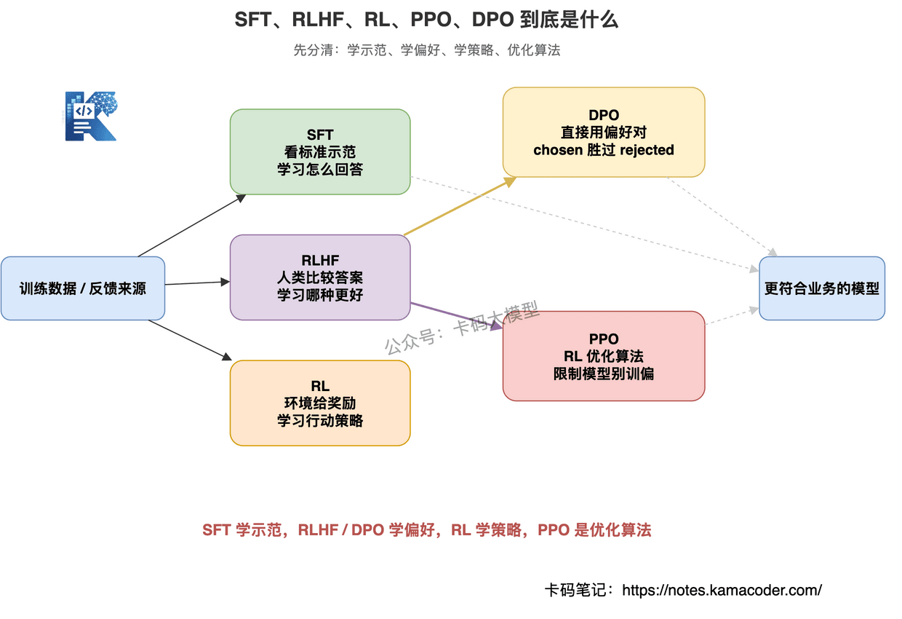
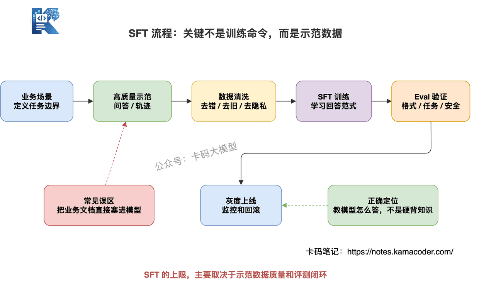
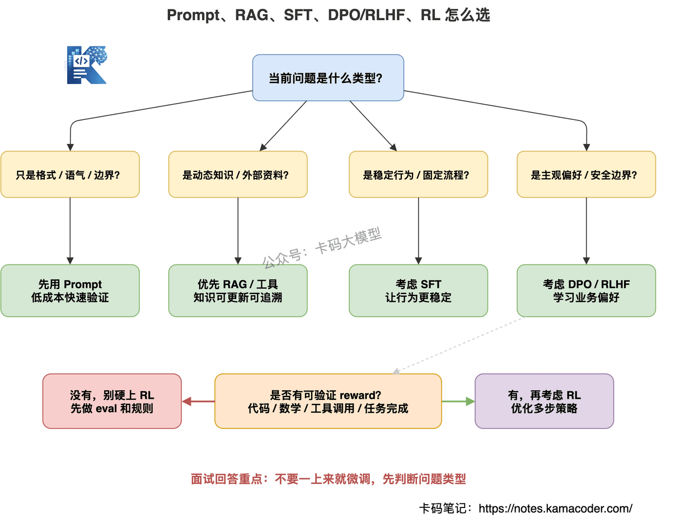

# Як відповідати про донавчання великих моделей: чи потрібні ще SFT, RLHF, DPO і PPO

Ось дуже типове питання зі співбесіди про великі моделі:

«Тепер, коли базові моделі дедалі сильніші, у чому, на вашу думку, переломна точка для RLHF чи SFT?»

Інтерв'юер уточнить далі:

«Що швидше ітеруються універсальні базові моделі, то швидше може стертися ефект від RL, зробленого спеціально під вузький сценарій. То чи є ще сенс триматися за таку кастомну оптимізацію?»

Питання цікаве.

На поверхні воно про SFT, RLHF і RL.

Але насправді перевіряють не знання означень.

Перевіряють інше: **як ви розумієте цінність донавчання і чи є у вас інженерна розсудливість тепер, коли базові моделі сильнішають.**

Багато хто, почувши «донавчання», починає переказувати:

- SFT — це навчання з учителем;
- RLHF — навчання з підкріпленням на людському зворотному зв'язку;
- PPO — алгоритм навчання з підкріпленням;
- DPO — метод оптимізації за вподобаннями.

Усе правильно.

Але самих переказів інтерв'юерові мало.

Бо в реальних проєктах головне питання не в тому, «як ці терміни називаються».

А в тому:

**у якому сценарії донавчання доречне? у якому ні? і що від його цінності лишається, коли базові моделі сильнішають?**

Розберімо це системно.

Без статей і формул — із погляду співбесіди й упровадження: що таке SFT, RLHF, RL, PPO і DPO і чи потрібні вони ще після посилення базових моделей.

## Зміст

1. Спершу висновок: донавчання не зникло, змінилася його цінність
2. Розберімо терміни: що таке SFT, RLHF, RL, PPO і DPO
3. Як обирати між донавчанням, промптом і RAG
4. Чому багато вузькопрофільних донавчань стираються сильнішими базовими моделями
5. Переломна точка SFT: від доповнення знань до контролю поведінки
6. Переломна точка RLHF і RL: від «порозумнішати» до контролю вподобань і рішень
7. Чому зараз так часто згадують DPO
8. Коли донавчання робити не варто
9. Як інженерно визначити, чи є від донавчання вигода
10. Про що інтерв'юер може спитати далі
11. Як відповідати на співбесіді

## 1. Спершу висновок: донавчання не зникло, змінилася його цінність


Одразу висновок.

**Сильніші базові моделі не змушують SFT, RLHF і RL зникнути — вони зміщують їх від «доповнення спроможностей» до «контролю поведінки, вподобань, вартості й ризиків».**

Це важлива теза.

Раніше багато команд робили SFT, бо базовій моделі бракувало спроможностей.

Модель не знала мови служби підтримки — донавчаємо.

Модель не вміла писати певний тип звітів — донавчаємо.

Модель не видавала бізнесового формату — теж донавчаємо.

Але тепер універсальні базові моделі дедалі сильніші, і багато задач непогано розв'язуються промптом.

**Ба більше: ви довго й старанно донавчаєте вузькопрофільну модель, а з виходом наступного покоління базової вона наздоганяє й навіть перевершує ваш результат.**

Це і є те «стирання», про яке каже інтерв'юер.

Але це не означає, що донавчання не має цінності.

Це лише означає: **низькоякісне вузькопрофільне донавчання без бар'єрів, зліплене з кількох тисяч пар питання-відповідь, коштує дедалі менше.**

По-справжньому цінними лишаються такі напрямки:

- стабільний вивід у фіксованих бізнес-процесах;
- манера мовлення, стиль і формулювання конкретної галузі;
- здешевлення й прискорення завдяки малій моделі у фіксованому сценарії;
- безпечні відмови, межі ризику, вимоги комплаєнсу;
- виклик інструментів агентом, вибір дій, багатокрокові рішення;
- задачі з чіткою винагородою: код, математика, пошук, операції.

Тож на співбесіді не кажіть: «базові моделі посильнішали, отже, SFT і RLHF більше не потрібні».

Але й не кажіть: «донавчання корисне завжди, його треба робити обов'язково».

Обидві відповіді надто категоричні.

Краще так:

**універсальні спроможності стираються сильнішими базовими моделями, а от бізнесова поведінка, вподобання, вартість і контроль ризиків самі собою не стираються. Цінність донавчання треба шукати саме там.**

## 2. Розберімо терміни: що таке SFT, RLHF, RL, PPO і DPO



Багато хто не розуміє цих термінів.

І це нормально.

Бо про них зазвичай пишуть у статтях і документації фреймворків навчання, де одразу йдуть loss, reward, policy й KL-штраф.

На співбесіді так говорити не треба.

Спершу треба вміти пояснити людською мовою.

### 2.1. SFT: навчання з учителем

SFT — Supervised Fine-Tuning, навчання з учителем.

Одним реченням:

**SFT — це показ моделі якісних зразків, щоб вона наслідувала такий спосіб відповіді.**

Скажімо, ви готуєте набір даних:

```text
Питання користувача: перевір, чи можна повернути кошти за це замовлення
Еталонна відповідь: спершу надайте, будь ласка, номер замовлення; я перевірю його статус, час оплати й правила повернення, а потім визначу, чи виконано умови для повернення.
```

Побачивши багато таких прикладів, модель засвоює:

- у питаннях про повернення не робити висновків одразу;
- спершу попросити номер замовлення;
- далі перевірити статус;
- і лише тоді оцінити за правилами.

Отже, суть SFT — «навчання за зразками».

Він добре розв'язує такі проблеми:

- нестабільний формат виводу;
- неузгоджені бізнесові формулювання;
- невивчений фіксований процес виконання задачі;
- потреба в єдиному форматі викликів інструментів;
- потреба малій моделі засвоїти манеру відповідей великої.

Але SFT не є універсальною базою знань.

Це треба проговорити чітко.

Багато хто силоміць запихає в дані для SFT бізнес-знання, документи з політиками й описи продуктів, сподіваючись, що модель це запам'ятає.

Так легко наразитися на проблеми.

Бо бізнес-знання змінюються.

Сьогодні правило повернення — 7 днів, завтра може стати 15.

Якщо ви вкарбували правило в модель, після його зміни її «пам'ять» застаріє.

Такі динамічні знання краще брати через RAG або запит до інструмента.

У статті [Де RAG найважче впровадити](./rag_hardest_parts_interview.md) ми бачили, що RAG краще пасує зовнішнім знанням і динамічним документам.

Тож розуміти це можна так:

**SFT краще вчить модель, «як відповідати», і погано пасує для запихання знань, що часто змінюються.**



### 2.2. RLHF: навчання з підкріпленням на людському зворотному зв'язку

RLHF — Reinforcement Learning from Human Feedback.

Одним реченням:

**RLHF не показує моделі еталонної відповіді, а вчить її розуміти, яка відповідь більше подобається людям.**

Скажімо, на одне питання модель згенерувала два варіанти.

Відповідь A:

```text
Кошти можна повернути.
```

Відповідь B:

```text
Спершу треба підтвердити статус замовлення, час оплати й тип товару. Якщо замовлення відповідає правилам повернення на платформі, повернення можна ініціювати; якщо бракує інформації, користувач має надати номер замовлення.
```

Розмітник вважає, що B краща.

Отже, модель засвоює: у таких питаннях не можна відповідати категорично — треба обережніше, повніше й ближче до бізнес-процесу.

Типовий процес RLHF такий:

1. спершу через SFT натренувати базово придатну модель;
2. згенерувати кілька варіантів відповіді на те саме питання;
3. люди позначають, яка відповідь краща;
4. на цих даних про вподобання тренується Reward Model;
5. далі модель оптимізується алгоритмом навчання з підкріпленням на кшталт PPO.

Головне тут не формули.

Головне ось що: **RLHF розв'язує задачу вподобань.**

Що таке задача вподобань?

Це коли кілька відповідей можуть бути правильними, але бізнесу більше подобається одна з них. Наприклад:

- ввічливіше чи прямолінійніше;
- обережніше чи ініціативніше;
- спершу пояснити причину чи спершу дати висновок;
- у ризикованому питанні відмовитися чи запропонувати безпечну альтернативу;
- у відповіді підтримки наголошувати на досвіді користувача чи на правилах платформи.

Єдиної правильної відповіді тут немає.

У цьому й цінність RLHF.

### 2.3. RL: навчання з підкріпленням

RL — Reinforcement Learning.

Це ширше поняття, ніж RLHF.

Одним реченням:

**RL — це коли модель діє в середовищі, середовище дає винагороду, а модель учиться підвищувати цю винагороду.**

Людський зворотний зв'язок тут не обов'язковий.

Якщо ви можете визначити винагороду, RL можливий.

Скажімо, генерація коду:

- код запускається — висока винагорода;
- юніт-тести проходять — висока винагорода;
- код падає з помилкою — низька.

Математичні міркування:

- фінальна відповідь правильна — висока винагорода;
- хід міркувань порушує правила — низька.

Виклик інструментів агентом:

- правильно обрано інструмент — висока винагорода;
- параметри коректні — висока;
- задачу виконано — висока;
- обрано не той інструмент або перевищено повноваження — низька.

Тож суть RL не в тому, «чи подобається це людям».

А в тому, **чи є чіткий зворотний зв'язок від середовища або перевірювана мета.**

Якщо винагороду спроєктовано чітко, RL дуже цінний.

Якщо винагорода розмита, RL легко навчить не того.

### 2.4. PPO: поширений алгоритм оптимізації в RL

PPO — Proximal Policy Optimization.

На співбесіді виводити формули не треба.

Досить пояснити його роль у RLHF.

Одним реченням:

**PPO — це алгоритм оптимізації в навчанні з підкріпленням, який підвищує винагороду, водночас не даючи моделі надто віддалитися від початкової.**

Навіщо обмежувати?

Бо велика модель крихка.

Якщо змусити її гнатися лише за винагородою, дуже ймовірний «злом винагороди».

Скажімо, Reward Model любить довгі відповіді — і модель починає шалено видавати довгі порожні тексти.

Reward Model любить ввічливий тон — і модель стає надмірно люб'язною в кожному реченні.

Є діра в Reward Model — модель навчиться в неї пролізати.

Ідея PPO така: оптимізувати можна, але не надто великими кроками.

І винагороду підняти, і мовні та універсальні спроможності початкової моделі по змозі зберегти.

Тож на співбесіді можна сказати так:

**PPO не є ні типом даних про вподобання, ні способом розмітки: це поширений алгоритм оптимізації на етапі навчання RLHF.**

### 2.5. DPO: пряма оптимізація за вподобаннями

DPO — Direct Preference Optimization.

Одним реченням:

**DPO тренує модель прямо на парах уподобань, схиляючи її до кращої відповіді, без окремої Reward Model і без складного процесу PPO.**

Той самий приклад.

На одне питання:

- відповідь A гірша;
- відповідь B краща.

DPO тренує модель прямо на цій парі, щоб надалі вона схилялася до відповідей типу B.

Порівняно з класичним RLHF інженерний процес простіший:

- не треба окремо тренувати Reward Model;
- не треба складного навчання PPO;
- навчання стабільніше;
- інженерна вартість нижча.

Але це теж не панацея.

DPO дуже залежить від якості даних про вподобання.

Якщо ваші дані безладні — сьогодні подобаються короткі відповіді, завтра довгі, критерії розмітки неузгоджені, — DPO теж навчиться хаосу.

Тож DPO можна розуміти так:

**DPO є легшим методом оптимізації за вподобаннями й пасує тоді, коли наявні дані про вподобання достатньо надійні.**


## 3. Як обирати між донавчанням, промптом і RAG

Інтерв'юери дуже люблять це питання.

«У цьому сценарії ви взяли б промпт, RAG чи донавчання?»

Воно добре перевіряє інженерну розсудливість.

Не можна одразу казати: «я б донавчав».

І тим паче: «усюди RAG».

Раджу визначатися за типом проблеми.



### 3.1. Якщо розв'язується промптом — не поспішайте тренувати

Якщо треба лише зробити вивід чіткішим, структурованішим чи відповіднішим формату, спершу спробуйте промпт. Наприклад:

- вивід у JSON;
- спершу висновок, потім пояснення;
- не знаєш — скажи, що не знаєш;
- посилайся на джерела.

Спершу обмежте це промптом.

Якщо промпт уже стабільно працює, SFT не потрібен.

Бо навчання коштує.

Треба підготувати дані, почистити їх, прогнати навчання, оцінити, викотити, мати змогу відкотити.

Це не «написати кілька прикладів і все».

### 3.2. Якщо знання часто змінюються — RAG або інструменти

Якщо суть проблеми у зовнішніх знаннях — документація продукту, правила компанії, цінові правила, умови договорів, — краще RAG або запит до інструмента.

Бо знання змінюються.

Сьогодні оновили документ — переіндексували в RAG, і зміна діє.

А якщо знання вкарбовано в модель, оновлювати клопітно.

Та ще й лишаються залишки старих знань.

Отже:

**знання — це RAG, а поведінка — уже привід подумати про SFT.**

### 3.3. Якщо бракує стабільності поведінки — розгляньте SFT

Якщо ви бачите, що модель правила ніби знає, а вивід нестабільний.

Сьогодні за форматом, завтра формат поїхав.

Сьогодні спершу перепитує, завтра одразу робить висновок.

Сьогодні видає виклик інструмента за нормою, завтра імпровізує.

Тоді варто подумати про SFT.

Бо вам потрібні не нові знання, а стабільна поведінка.

### 3.4. Якщо кілька відповідей придатні, але є чітке вподобання — DPO або RLHF

Скажімо, служба підтримки.

На ту саму скаргу модель може:

- спершу вибачитися;
- спершу пояснити правила;
- спершу запропонувати компенсацію;
- спершу спитати дані замовлення.

Жоден варіант не є помилковим.

Але у вашого бізнесу є вподобання.

Скажімо, платформа хоче спершу заспокоїти користувача, потім зібрати інформацію, а потім дати шлях розв'язання.

Одним лише SFT це до кінця не закриється.

Це радше задача вирівнювання за вподобаннями — тут доречні DPO чи RLHF.

### 3.5. Сильніший RL — лише за наявності перевірюваної винагороди

RL має сенс тоді, коли в задачі є чіткий зворотний зв'язок. Наприклад:

- чи проходить код юніт-тести;
- чи успішний виклик інструмента;
- чи містить знайдене відповідь;
- чи виконав агент задачу;
- чи правильна математична відповідь.

Для таких сценаріїв винагороду можна спроєктувати.

А якщо все зводиться до «мені здається, ця відповідь краща», винагорода розмита, і братися за RL небезпечно.

## 4. Чому багато вузькопрофільних донавчань стираються сильнішими базовими моделями

Повернімося до питання інтерв'юера:

«Базові моделі сильнішають — чи не зітреться швидко ефект вузькопрофільних SFT і RL?»


Відповідь: зітреться.

Але не все.

Стирається зазвичай донавчання без бар'єрів.


### 4.1. Донавчання, що лише доповнює загальні знання, стирається легко

Скажімо, ви на кількох тисячах звичайних питань-відповідей учите модель відповідати про Java, MySQL, Redis і операційні системи.

Це дуже легко перекривається новою базовою моделлю.

Бо загальні знання й так у межах її спроможностей.

Ви довго тренуєте, а наступне покоління з більшою кількістю параметрів, більшими даними й сильнішим післятренуванням просто вас наздоганяє.

У такого донавчання немає захисного рову.

### 4.2. Донавчання лише стилю без оцінювання теж легко стирається

Деякі команди кажуть, що зробили галузеве донавчання.

А на питання «наскільки покращилося?» відповіді немає.

І на питання «на яких випадках покращилося?» теж.

Зрештою лишається відчуття, що відповіді стали більше схожі на підтримку, лікаря чи юриста.

Це небезпечно.

Без набору для оцінювання, без продакшн-метрик і без атрибуції помилок довести цінність донавчання важко.

А після оновлення базової моделі ви навіть не знатимете, чи варто лишати власну.

### 4.3. SFT на низькоякісних даних може навіть погіршити модель

У SFT більше прикладів не означає краще.

Якщо в даних багато слабких, застарілих і суперечливих відповідей, модель засвоїть усе разом.

Багато вузькопрофільних донавчань провалюються не через модель.

А через брудні дані.

Узяти купу логів чату служби підтримки й тренувати на них — а там:

- невдалі формулювання;
- хибні процеси обробки;
- історичні правила;
- довільні висловлювання операторів;
- персональні дані користувачів.

Тренувати на таких даних без очищення — і нестабільний результат цілком очікуваний.

**Низькоякісні дані є не активом, а джерелом забруднення.**

### 4.4. RL без замкненого бізнес-циклу теж стає імітацією

RL звучить солідно.

Але якщо у вас немає середовища, винагороди, оцінювання й продакшн-зворотного зв'язку, RL лишається просто словом.

Скажімо, ви кажете, що робите RL для агента.

Інтерв'юер спитає:

- як визначено винагороду?
- як визначаються успіх і невдача?
- як оцінюються проміжні кроки?
- як карається хибний виклик інструмента?
- як не дати моделі пролізти в діру заради винагороди?
- як моніторити деградацію політики в продакшні?

Якщо відповідей немає, ви ще не продумали задачу до кінця.

## 5. Переломна точка SFT: від доповнення знань до контролю поведінки

То чи потрібен SFT?

Потрібен.

Але його цінність в іншому місці.

**Переломна точка SFT не в тому, щоб модель знала більше, а в тому, щоб у фіксованому сценарії вона стабільніше діяла так, як вам треба.**

### 5.1. Фіксований формат виводу

Багатьом бізнес-системам потрібен структурований вивід. Наприклад:

```json
{
  "category": "refund",
  "confidence": 0.86,
  "need_human": false,
  "reason": "замовлення ще в межах строку повернення"
}
```

Чи здатна сильна базова модель це видати?

Здатна.

Але продакшн потребує стабільності.

Поля не мають зникати.

Перелічення не мають плутатися.

Упевненість не має братися зі стелі.

Якщо промпт не дає достатньої стабільності, SFT може навчити модель фіксованого формату.

### 5.2. Фіксований бізнес-процес

Скажімо, процес повернення коштів у підтримці:

1. спершу визначити намір;
2. далі запитати номер замовлення;
3. викликати інструмент і перевірити замовлення;
4. оцінити за правилами повернення;
5. для ризикованої дії вимагати підтвердження.

Це не просте питання-відповідь.

Тут потрібна стабільна послідовність дій.

SFT може навчити модель усталеної парадигми виконання задачі.

Але для самих дій усе одно потрібні інструменти й системні перевірки.

У статті [Як агентна система стримує галюцинації моделі](./agent_hallucination_control_interview.md) ми бачили, що агент не може триматися лише на промпті: виклики інструментів і ризиковані дії мають перехоплюватися на інженерному рівні.

SFT може лише схилити модель до правильного процесу, але не заміняє прав, погодження й відкату.

### 5.3. Галузеві формулювання й голос бренду

У деяких бізнесах мало відповісти правильно.

Спосіб висловлювання має відповідати бренду.

Наприклад, у фінансах, медицині, держпослугах, освіті.

Ці сфери дуже чутливі до формулювань.

Одна й та сама думка: «вам не можна оформити» і «наразі умови для оформлення не виконано; ви можете додати такі документи й подати заявку знову» сприймаються користувачем геть по-різному.

SFT може навчити модель галузевих формулювань і голосу бренду.

Універсальна базова модель не вирівнюється під це автоматично.

### 5.4. Здешевлення через малу модель

Це цілком практична цінність.

Велика модель дає добрий результат, але дорога й повільна.

Якщо бізнес-сценарій дуже усталений — класифікація тікетів, витягання міток, прості відповіді підтримки, — можна великою моделлю згенерувати якісні зразки, а потім зробити SFT малої моделі.

Мала модель у продакшні візьме на себе більшу частину трафіку.

А складні випадки маршрутизуються до великої.

Тут цінність SFT не в тому, щоб перевершити найсильнішу базову модель.

А в тому, щоб **дешевше досягти достатнього результату у фіксованому сценарії.**

## 6. Переломна точка RLHF і RL: від «порозумнішати» до контролю вподобань і рішень

Цінність RLHF і RL теж не можна зводити до «зробити модель розумнішою».

Зі зростанням базових моделей загальна спроможність до міркувань і так підвищується.

А от вподобання й рішення не обов'язково самі собою відповідатимуть вашому бізнесу.

### 6.1. Цінність RLHF — вирівнювання за вподобаннями

У багатьох бізнесових питаннях немає єдиної правильної відповіді.

Скажімо, скарга користувача:

- спершу вибачитися чи спершу пояснити правила?
- чи пропонувати компенсацію самим?
- за яких умов передавати людині?
- як формулювати відмову?

Частину цього можна показати зразками через SFT.

Але по суті це задача вирівнювання за вподобаннями.

Модель має знати, яка відповідь більше подобається бізнесу.

Це і є простір для RLHF або DPO.

### 6.2. Цінність RL — оптимізація багатокрокових рішень

В агентних сценаріях у RL більший простір.

Бо агент не просто генерує одну фразу.

Він виконує послідовність дій:

```text
зрозуміти задачу → обрати інструмент → заповнити параметри → прочитати спостереження → визначити наступний крок → видати результат
```

На кожному кроці можлива помилка. Наприклад:

- обрано не той інструмент;
- хибні параметри;
- хибна стратегія пошуку;
- зарано зроблено висновок;
- виконано операцію запису, якої робити не мали.

Якщо ви можете визначити частку успішних задач, частку успішних викликів інструментів, частку коректних параметрів, частку підтверджень користувача й частку передавань людині, ці метрики можна перетворити на навчальний зворотний зв'язок.

Тоді RL потрібен не для того, щоб модель «краще розмовляла».

А для того, щоб агент краще ухвалював рішення в багатокрокових задачах.

### 6.3. Для задач із чіткою винагородою RL цінніший

Найгірше для RL — розмита винагорода.

Але в деяких задачах вона цілком чітка.

Скажімо, код:

- юніт-тести проходять — добре;
- компіляція падає — погано.

Математика:

- відповідь правильна — добре;
- відповідь хибна — погано.

Виклик інструментів:

- виклик успішний — добре;
- параметри недійсні — погано;
- перевищення повноважень — серйозний штраф.

Такі задачі пасують RL краще.

Бо вони не залежать цілком від суб'єктивних людських уподобань.

Є об'єктивний зворотний зв'язок.

### 6.4. У ризикованих сценаріях RLHF і RL потребують ще й правил

Тут варто застерегти.

RLHF і RL не є сейфом безпеки.

Особливо у фінансах, медицині, праві, поверненнях коштів, видаленні даних і надсиланні пошти.

Не можна казати: «ми зробили RLHF, тож модель має поводитися безпечно».

Ні.

Ризиковані дії обов'язково супроводжуються:

- контролем прав;
- повторним підтвердженням;
- процесом погодження;
- ідемпотентністю;
- механізмом відкату;
- журналом операцій.

Навчання моделі може лише підвищити схильність, але не замінює системних обмежень.

Сказавши це на співбесіді, ви покажете, що не просто переказуєте назви алгоритмів.

## 7. Чому зараз так часто згадують DPO

DPO згадують часто, бо інженерно він легший.

Класичний процес RLHF доволі важкий:

```text
SFT → збір даних про вподобання → навчання Reward Model → оптимізація PPO → оцінювання й підбір параметрів
```

На кожному кроці є пастки.

Чи не навчиться Reward Model не того?

Чи не буде PPO нестабільним?

Як контролювати KL?

Чи прийнятна вартість навчання?

Це все непросто.

Підхід DPO прямолінійніший:

```text
даємо моделі пари вподобань: chosen краща за rejected
і прямо тренуємо модель схилятися до chosen
```

Тож у багатьох сценаріях DPO розглядають першим.

Особливо коли у вас уже є доволі чіткі дані про вподобання:

- добра відповідь підтримки проти поганої;
- відповідь, що відповідає нормам, проти невідповідної;
- лаконічна відповідь проти багатослівної;
- правильна траєкторія викликів інструментів проти хибної.

DPO зазвичай упроваджується легше за повний RLHF.

Але й у нього є межі.

Якщо дані про вподобання неякісні, DPO не врятує.

А якщо задача потребує багатораундової взаємодії із середовищем, самих статичних пар уподобань замало.

Тож на співбесіді можна сказати так:

**DPO знизив інженерний поріг оптимізації за вподобаннями, але він усе одно залежить від якісних даних про вподобання й не заміняє справжнього зворотного зв'язку від середовища.**

## 8. Коли донавчання робити не варто

Цю частину обов'язково треба проговорити.

Бо інтерв'юер хоче почути не лише, що ви вмієте, а й коли ви знаєте, що робити цього не треба.

### 8.1. Якщо розв'язується промптом — не кидайтеся тренувати

Якщо йдеться лише про формат, тон чи невелику зміну структури, вистачить промпта.

Не беріться за SFT.

Навчання не безкоштовне.

Воно тягне за собою дані, вартість, версіювання, оцінювання й відкат.

### 8.2. Знання, що часто оновлюються, не запихайте в модель

Правила продукту, положення політик, ціни, залишки, структура компанії — усе це легко змінюється.

Краще RAG або запит до інструмента.

Не тренуйте цього в модель.

Інакше в ній лишатимуться застарілі знання.

### 8.3. Без набору для оцінювання не донавчайте наосліп

Без оцінювання ви не знатимете, де саме покращення.

Ви отримаєте лише фразу:

«Здається, стало трохи краще».

Це не інженерний висновок.

Перед навчанням треба мати щонайменше:

- тестовий набір ключових сценаріїв;
- набір випадків невдач;
- набір перевірок меж безпеки;
- перевірку стабільності формату;
- визначені продакшн-метрики.

Інакше донавчання лишається езотерикою.

### 8.4. За поганої якості даних не тренуйте одразу

Якість даних визначає стелю донавчання.

Якщо в даних багато помилок, застарілого, суперечливого й персональних даних, спершу наведіть лад у даних.

Не поспішайте тренувати.

**Із брудних даних виходить не вузькопрофільна модель, а набір вузькопрофільних проблем.**

### 8.5. За дуже швидких змін у бізнесі не вкладайтеся в донавчання

Якщо бізнес-процес змінюється щотижня, формулювання правлять щодня, а правила постійно коригують,

то щоразу перенавчати дуже дорого.

Такому сценарію краще пасують промпт, конфігурація, RAG і система правил.

А коли процес усталиться, можна подумати про навчання.

## 9. Як інженерно визначити, чи є від донавчання вигода

Якщо на співбесіді ви дійдете до замкненого циклу оцінювання, це значно сильніше за переказ означень.


Вигоду від донавчання не визначають на відчуття.

Треба дивитися на метрики.

### 9.1. Задачні метрики

Чи покращилася основна задача. Наприклад:

- точність класифікації;
- F1 для витягання інформації;
- частка успішних викликів інструментів;
- частка валідного JSON;
- частка виконаних задач;
- частка розв'язаних питань користувачів.

Це метрики самої задачі.

### 9.2. Метрики якості

Чи покращилася якість відповідей. Наприклад:

- частка галюцинацій;
- частка відповідей без доказів;
- частка помилок формату;
- точність відмов;
- частка коректної обробки випадків із низькою впевненістю;
- частка передавань людині.

Особливо в сценаріях RAG і агентів не можна дивитися лише на задоволеність користувача.

Треба перевіряти ще й надійність доказів, інструментів і виводу.

### 9.3. Метрики вартості

У донавчання є цілком практична мета — здешевлення. Наприклад:

- наскільки впала вартість одного виклику;
- наскільки зменшилася затримка;
- скільки трафіку взяла на себе мала модель;
- наскільки менше стало викликів великої моделі.

Якщо якість приблизно та сама, а вартість удвічі менша, це теж цінність.

### 9.4. Метрики ризику

У ризикованому бізнесі дивимося на:

- частку дій поза повноваженнями;
- частку хибних відмов;
- частку хибних пропусків;
- частку спрацювань погодження;
- кількість відкатів;
- частку скарг.

Донавчання не має гнатися лише за тим, щоб «відповідь звучала людяніше».

Треба дивитися, чи знизився ризик.

### 9.5. Регресійне тестування

Кожна зміна промпта, RAG, інструментів чи моделі має проганяти регресію.

Інакше легко отримати таке: тут стало краще, а там зламалося.

Із донавчанням так само.

Не можна дивитися лише на тренувальний набір і кілька прикладів.

Потрібен стабільний регресійний набір.

## 10. Про що інтерв'юер може спитати далі

Ця стаття не про одне питання.

Навколо донавчання інтерв'юер може питати ланцюжком.

Ці питання варто підготувати разом.

### 10.1. Як обирати між SFT і RAG?

Головне:

**знання — через RAG, поведінка — через SFT.**

Якщо це зовнішні чи динамічні знання й потрібні посилання на джерела — RAG.

Якщо це формат виводу, процес виконання, стиль мовлення чи парадигма викликів інструментів — SFT.

### 10.2. Як обирати між SFT та інженерією промптів?

Головне: спершу промпт, потім SFT.

Якщо промпт стабільно розв'язує задачу — не тренуємо.

Якщо промпт задовгий, крихкий і нестабільний, а сценарій частий і усталений — тоді SFT.

### 10.3. Чим SFT відрізняється від RLHF?

Головне:

SFT учиться за зразками.

RLHF учиться за вподобаннями.

SFT схожий на «вчитель дав еталонну відповідь».

RLHF — на «людина каже моделі, яка відповідь краща».

### 10.4. Чим DPO відрізняється від RLHF?

Головне:

Класичний RLHF зазвичай потребує навчити Reward Model і оптимізувати через PPO.

DPO оптимізує модель прямо на парах уподобань — процес простіший і стабільніший.

Але DPO залежить від якісних даних про вподобання й не пасує всім задачам зі зворотним зв'язком від середовища.

### 10.5. Що таке PPO?

Головне:

PPO — алгоритм оптимізації в навчанні з підкріпленням, а не спосіб розмітки.

У RLHF він оптимізує модель за винагородою, водночас не даючи їй надто віддалитися від початкової, щоб навчання не розвалилося.

### 10.6. Чому вузькопрофільне донавчання часто провалюється?

Головне, типові причини:

- погана якість даних;
- нечіткі межі задачі;
- динамічні знання силоміць запхано в модель;
- немає набору для оцінювання;
- дивляться лише на суб'єктивне враження;
- після оновлення базової моделі вигода зникає.

### 10.7. Яка цінність RL в агентних сценаріях?

Головне:

Агент ухвалює багатокрокові рішення, а не просто генерує текст.

RL може оптимізувати вибір інструментів, заповнення параметрів, стратегію пошуку й частку виконаних задач.

Але за умови чіткої винагороди й меж безпеки.

### 10.8. Як викочувати модель після донавчання?

Головне:

Не можна одразу замінювати все.

Потрібні поступове викочування, A/B-тестування, моніторинг метрик і план відкату.

Водночас треба моніторити частку галюцинацій, частку помилок формату, частку передавань людині, частку скарг, вартість і затримку.

## 11. Як відповідати на співбесіді

Якщо інтерв'юер спитає:

«Базові моделі сильнішають — чи потрібні ще SFT, RLHF і RL? У чому переломна точка?» —

можна відповісти так:

«**Я не сприймаю SFT, RLHF чи RL як спосіб просто доповнити знання моделі.** Зі зростанням універсальних базових моделей багато низькоякісних вузькопрофільних донавчань справді стирається, особливо тих, що доповнювали загальні знання кількома тисячами пар питання-відповідь без замкненого циклу оцінювання: їхня цінність дедалі менша.

**Але це не означає, що донавчання непотрібне.** Його цінність зміщується від доповнення спроможностей до контролю поведінки, вподобань, вартості й ризиків.

**Скажімо, SFT краще пасує для того, щоб у фіксованому бізнес-сценарії модель стабільно видавала заданий формат, дотримувалася заданого процесу й заданих формулювань**, а не для того, щоб запхати в неї динамічні бізнес-знання. Там, де знання часто оновлюються, я візьму RAG або запит до інструмента.

**RLHF або DPO краще пасують для задач вподобань** — коли кілька відповідей придатні, але бізнес надає перевагу одній. Наприклад, чи спершу заспокоїти користувача, чи спершу пояснити правила; наскільки суворо відмовляти в ризикованих питаннях. Це не прості знаннєві задачі.

**А ширший RL краще пасує задачам із чіткою винагородою** — юніт-тести коду, математичні відповіді, виклики інструментів агентом, частка виконаних багатокрокових задач. Його переломна точка не в тому, щоб модель краще розмовляла, а в оптимізації багатокрокових рішень і частки успішних задач.

Тож я спершу з'ясую, чи не розв'язується задача промптом, RAG, правилами чи інструментами.

Якщо це знаннєва задача — RAG; якщо проблема в стабільності поведінки — SFT; якщо це вирівнювання за вподобаннями — DPO чи RLHF; а якщо є перевірювана винагорода — тоді вже важчий RL.

І наостанок: **чи варте донавчання заходу, не визначають на відчуття — потрібні набір для оцінювання, продакшн-метрики, співвідношення вартості й вигоди та контроль ризиків.** Без якісних даних, без оцінювання й без моніторингу в продакшні я не братимуся донавчати».

Головне в цій відповіді не переказати кожен термін.

А дати інтерв'юерові почути:

**ви знаєте, що таке донавчання великих моделей, і знаєте, коли його робити треба, а коли ні.**

Саме це й перевіряють на співбесіді.
