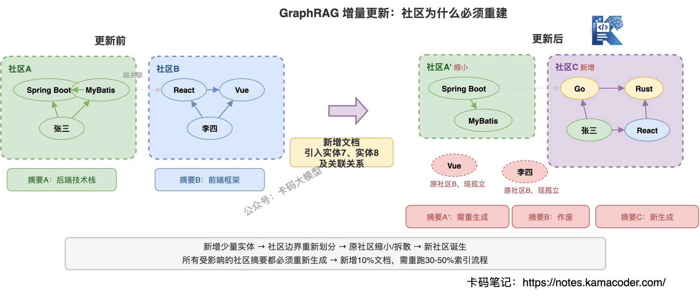
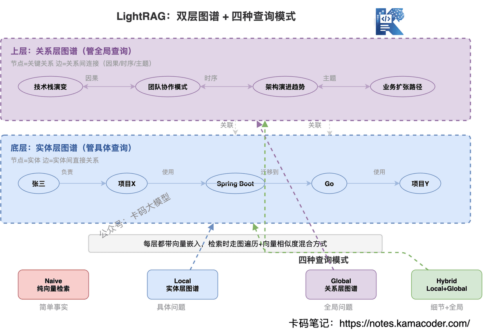
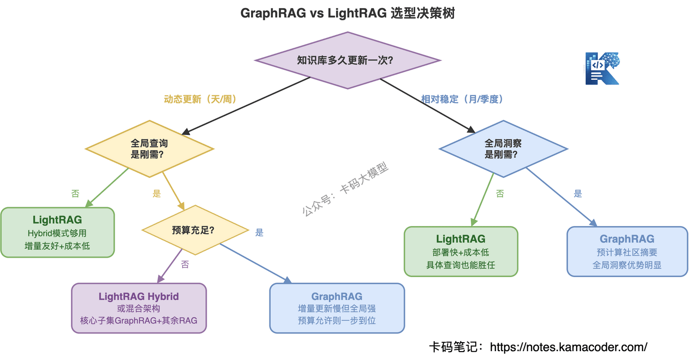

# Збірка питань про GraphRAG і LightRAG: від RAG до пошуку графом знань

Раніше була стаття [Про RAG докладно](./rag_interview.md), де ми розібрали векторний пошук, гібридний пошук, rerank і роботу з галюцинаціями.

Після неї часто пишуть: усі ті прийоми оптимізації класичного RAG справді працюють, але є клас питань, на які хоч як оптимізуй, а відповіді не буде.

Спитати «про конкретну технічну деталь, згадану в такому-то документі» — RAG упорається; а спитати «яка основна тема всієї бази знань» чи «як пов'язані ці кілька понять» — і RAG починає зліплювати уламки.

Це не питання підбору параметрів, а **структурна стеля класичного RAG**.

Згодом до цього дійшли й інтерв'юери: «а що робити, якщо RAG знайшов, а відповідь неправильна?», «ви знайомі з GraphRAG?», «чим LightRAG відрізняється від GraphRAG?» — і на кожне питання тиша.

Одразу розведімо терміни, які останнім часом легко переплутати: GraphRAG тут означає **пошук графом знань**, а не керуючий граф агента. Другий про те, «куди рухатися далі в задачі», — див. [Graph Engineering і графову оркестрацію агентів](./graph_engineering_interview.md); ця ж стаття про те, «як шукати зв'язки між сутностями в знаннях».

**У чому саме застрягає класичний RAG? Як GraphRAG це долає? Що таке LightRAG і як обирати між ними?** Розбираємо наступне покоління RAG від початку.

Прочитавши, ви зрозумієте: де стеля класичного RAG, як працює повний ланцюжок GraphRAG, на які пастки натрапляють під час упровадження, чим його доповнює LightRAG і що обирати в реальних сценаріях.

---

## Зміст

1. [RAG знайшов, а відповідь неправильна: три стелі класичного RAG](#1-rag-знайшов-а-відповідь-неправильна-три-стелі-класичного-rag)
2. [Еволюція RAG: від пошуку тексту до пошуку зв'язків](#2-еволюція-rag-від-пошуку-тексту-до-пошуку-звязків)
3. [Повний ланцюжок GraphRAG: від сирих документів до підсумків спільнот](#3-повний-ланцюжок-graphrag-від-сирих-документів-до-підсумків-спільнот)
4. [Три пастки впровадження GraphRAG](#4-три-пастки-впровадження-graphrag)
5. [LightRAG: легше, швидше, дружній до оновлень](#5-lightrag-легше-швидше-дружній-до-оновлень)
6. [Як усе-таки обирати між GraphRAG і LightRAG](#6-як-усе-таки-обирати-між-graphrag-і-lightrag)
7. [Часті уточнення на співбесідах](#7-часті-уточнення-на-співбесідах)

---

## 1. RAG знайшов, а відповідь неправильна: три стелі класичного RAG

Інтерв'юери зазвичай питають так: «Чи траплялося у вашій RAG-системі, що потрібне знайшлося, а відповідь однаково хибна? На яких типах питань виходить погано?» Або: «RAG знайшов правильну інформацію, але відповідь усе одно звучить як склеєна — як ви це поясните?»

### Один приклад, який пояснює, у що впирається RAG

Припустімо, у вас є внутрішня база знань компанії з проєктною документацією, технічними рішеннями й протоколами нарад. І хтось питає:

**«Які тенденції в технологічних стеках усіх наших проєктів?»**

Як відповість класичний RAG? Він перетворить питання на вектор і знайде у векторній базі найсхожіші текстові блоки. Знайде розрізнені фрагменти: «проєкт A використовує Spring Boot», «проєкт B перейшов на Go», «проєкт C пробує Rust»… і віддасть це все моделі, щоб та склеїла відповідь.

Вийде нагромадження фактів, а не «тенденція». Бо в системи просто немає ракурсу, з якого видно всю картину по всіх проєктах; модель отримує уламки — і, хоч яка розумна, може лише зліпити уламки.

Це не баг RAG, це **фундаментальне обмеження векторного пошуку**.

### Три стелі класичного RAG

**1. Фрагментарний пошук: знаходяться текстові блоки, а не знання**

Класичний RAG ріже документи на чанки, і кожен чанк окремо стає вектором. Під час пошуку ви отримуєте «текстові блоки, найсхожіші на питання». Але відповідь на багато питань не вміщається в один блок: її треба зібрати, пов'язавши інформацію з кількох.

Скажімо, «у якому проєкті співпрацювали Іван і Петро» — ця інформація може бути розкидана трьома документами: у першому сказано, що Іван веде проєкт X, у другому — що Петро брав участь у проєкті X, у третьому описано сам проєкт X. Класичний RAG у кращому разі витягне один із них, а зібрати всі три й пов'язати йому важко.

**2. Глобальні питання даються навмання: питаєш про ціле — отримуєш частини**

Питання на кшталт «які тут основні технічні теми» чи «як загалом еволюціонував технологічний напрямок» потребують **розуміння всієї бази знань**, а не кількох схожих текстових блоків.

У попередній статті ми бачили, що rerank і гібридний пошук підвищують точність — але вони оптимізують «знайти схожіші блоки», а не «зібрати з уламків цілу картину». Змінивши Top-5 на Top-20, ви отримаєте ті самі уламки, просто більше.

**3. Розрив зв'язків між документами: зв'язок A і B губиться повністю**

«Компанія A придбала компанію B» — у першому документі, «компанія B співпрацює з компанією C» — у другому. То чи є непрямий зв'язок між A і C? Класичний RAG не відповість: кожен чанк має власний embedding, і поняття «зв'язку» між чанками не існує.

### Підбором параметрів це не лікується

Гібридний пошук, rerank і переписування запиту зі статті [Про RAG докладно](./rag_interview.md) — усе це про «знайти кращий текстовий блок». Але деяким питанням потрібен не кращий блок, а **зв'язки між сутностями** й **структурне розуміння цілого**.

Саме це й розв'язує GraphRAG.


---

## 2. Еволюція RAG: від пошуку тексту до пошуку зв'язків

Інтерв'юер спитає: «У чому принципова різниця GraphRAG і класичного RAG? Як узагалі розвивалася ця лінія?»

### Три покоління RAG

Щоб зрозуміти, чому з'явився GraphRAG, треба побачити шлях.

**Naive RAG** — найпростіший: порізати документи → векторизувати → знайти → віддати моделі. Проблем багато: неточний пошук, серйозні галюцинації, немає rerank. Багатьох прийомів оптимізації зі статті [Про RAG докладно](./rag_interview.md) у Naive RAG просто немає.

**Advanced RAG** — ті самі оптимізації, докладно розібрані в [Про RAG докладно](./rag_interview.md): гібридний пошук закриває слабкість у точних збігах, rerank підвищує точність, переписування запиту працює з розмитими питаннями, схема parent-child поєднує точність і контекст. Ці прийоми довели «пошук текстових блоків» до межі можливого.

**GraphRAG** — інший шлях: не просто шукати блоки, а спершу побудувати граф знань, структуровано зберігши сутності й зв'язки, і шукати по графу. **Пошук тексту перетворився на пошук зв'язків.**

Логіка розвитку виразна: **проблема Naive RAG — «шукає неточно» → Advanced RAG доводить стратегію пошуку до максимуму → але деякі питання пошуком блоків не розв'язуються → GraphRAG змінює саму парадигму пошуку.**


### GraphRAG одним реченням

**Додати до RAG граф знань, щоб пошук перейшов від «текстових блоків» до «сутностей і зв'язків».**

Класичний RAG шукає «текст, схожий на питання», а GraphRAG — «сутності, зв'язки й спільноти, дотичні до питання». Перше є локальним зіставленням, друге — структурним розумінням.

---

## 3. Повний ланцюжок GraphRAG: від сирих документів до підсумків спільнот

Інтерв'юер спитає: «Як працює етап індексації в GraphRAG? Які є способи запиту?»

### Хто зробив GraphRAG

Microsoft Research, оприлюднено у квітні 2024 року; ключова команда — Даррен Едж та колеги. Стаття називається «From Local to Global: A Graph RAG Approach to Query-Focused Summarization». Код відкритий на GitHub, а наприкінці 2024 року рішення стало комерційно доступним в Azure.

Мотивація Microsoft була прямою: вони перепробували багато оптимізацій класичного RAG і побачили, що глобальні питання однаково не даються. Тож змінили підхід: замість оптимізувати стратегію пошуку — змінити спосіб організації знань.

### Етап індексації: перетворення документів на «граф знань зі спільнотами»

Індексація має шість кроків.

**Крок 1: нарізання документів.** Як і в класичному RAG, сирі документи ріжуться на текстові блоки (за замовчуванням близько 300 токенів із перекриттям).

**Крок 2: LLM витягує сутності й зв'язки.** Кожен блок віддається моделі, щоб вона розпізнала сутності (люди, організації, місця, події, поняття) і зв'язки (хто що зробив, хто з ким у якому стосунку). **Це найдорожчий етап усього процесу: кожен текстовий блок проходить через модель.**

```
Текстовий блок: ["Іван приєднався до проєкту X, відповідає за проєктування бекенд-архітектури"]
        ↓ витягання моделлю
Сутності: [Іван (людина), проєкт X (проєкт)]
Зв'язки:  [Іван → відповідає за проєктування бекенд-архітектури → проєкт X]
```

**Крок 3: дедуплікація й злиття сутностей.** Та сама сутність може траплятися в різних документах кілька разів; «Apple» і «Apple Inc.» — одна сутність, і їх треба звести в один вузол.

**Крок 4: побудова графа знань.** Усі сутності стають вузлами, зв'язки — ребрами. На цьому етапі ваш текстовий корпус перетворюється на структурований граф.

**Крок 5: виявлення спільнот алгоритмом Leiden.** Алгоритм Leiden (поліпшена версія Louvain) ділить граф на спільноти — щільно пов'язані групи сутностей. Leiden дає **ієрархічну структуру спільнот**: унизу малі спільноти (кілька тісно пов'язаних сутностей), вище — спільноти спільнот, на вершині — увесь граф.

**Крок 6: генерація підсумків спільнот.** Для кожної спільноти кожного рівня модель створює структурований звіт (community report) з описом ключових сутностей, основних зв'язків і головних тем.

На виході етап індексації дає чотири речі: таблицю сутностей, таблицю зв'язків, таблицю спільнот із підсумками й векторний індекс текстових блоків.

### Етап запиту: локальний проти глобального

GraphRAG пропонує два способи запиту для двох геть різних класів питань.

**Локальний пошук (Local Search)** — відповідає на конкретні питання.

Із питання витягуються ключові сутності → у графі знаходяться відповідні вузли → ребрами обходяться пов'язані сутності, зв'язки, текстові блоки й підсумки їхніх спільнот → цей контекст віддається моделі для відповіді.

Пасує питанням на кшталт «за що відповідає Іван у проєкті X?» — досить пройтися графом навколо сутностей «Іван» і «проєкт X».

**Глобальний пошук (Global Search)** — відповідає на питання про ціле.

Це головна зброя GraphRAG: на глобальні питання він відповідає через Map-Reduce.

1. **Етап Map**: підсумки всіх спільнот певного рівня ділять на групи, кожна група разом із питанням іде до моделі, і та дає «часткову відповідь».
2. **Етап Reduce**: усі часткові відповіді зводяться й віддаються моделі для підсумкової комплексної відповіді.

Рівень можна змінювати: нижчий рівень спільнот дає детальнішу відповідь, вищий — узагальненішу.

Пасує питанням на кшталт «які тенденції в технологічних стеках усіх проєктів?» — підсумок кожної спільноти вже містить попередньо обчислену локальну тему, а Map-Reduce зводить їх у глобальну відповідь.

### Пройдімо приклад із початку ще раз

Повернімося до питання: «Які тенденції в технологічних стеках усіх наших проєктів?»

**Класичний RAG**: знаходить кілька блоків, де згадано технологічний стек → модель зліплює уламки → відповідь є нагромадженням розрізнених фактів.

**GraphRAG**: на етапі індексації технічні сутності й зв'язки всіх проєктів уже потрапили в граф, а підсумки спільнот уже містять локальні технічні теми → глобальний запит через Map-Reduce зводить усі підсумки → відповідь є структурованим і багаторівневим описом тенденцій.

**У цьому й головна цінність GraphRAG: він не зліплює відповідь під час запиту, а заздалегідь обчислює глобальне розуміння на етапі індексації.**


---

## 4. Три пастки впровадження GraphRAG

Інтерв'юер спитає: «GraphRAG такий гарний — а з якими проблемами ви стикнулися під час упровадження?»

Красива концепція — це одне, а впровадження — інше. Справжня складність GraphRAG не в теорії, а в конкретних пастках.

### Пастка 1: будувати граф дорого — токени горять, індексація повільна

На етапі індексації кожен текстовий блок проходить через модель для витягання сутностей і зв'язків, а потім кожна спільнота ще раз проходить через модель для генерації підсумку. Це означає, що витрата токенів під час індексації щонайменше у 2–5 разів перевищує обсяг вихідних документів.

Конкретно: мільйон токенів вихідних документів може коштувати 2–5 мільйонів токенів індексації. І справа не лише в грошах — час теж великий: індексація мільйонного корпусу може тривати кілька годин.

Для порівняння, класичному RAG потрібен лише один прохід embedding і майже не потрібні токени моделі. Вартість індексації GraphRAG може бути **вдесятеро й більше вищою**.

### Пастка 2: складне інкрементне оновлення — чи треба перебудовувати граф після нових документів?

Це найболючіша проблема GraphRAG.

База знань не може бути незмінною: нові документи надходять щодня. Але структура спільнот у GraphRAG **глобальна**: додавши партію нових сутностей і зв'язків, ви можете змінити межі спільнот у всьому графі. Те, що A і B були в одній спільноті, після нових сутностей може розпастися; те, що C і D були в різних, після нового зв'язку може злитися.

Отже: **додавання 10 % документів може вимагати переганяння 30–50 % процесу індексації** (повторне виявлення спільнот і повторна генерація підсумків).



У жовтні 2024 року Microsoft представила режим пошуку DRIFT (Dynamic Reasoning and Inference with Flexible Traversal) — **третій спосіб запиту** на додачу до локального й глобального: спершу попередня глобальна оцінка за підсумками спільнот, а потім локальне заглиблення графом, щоб знайти баланс між вартістю й глибиною.

Але проблеми інкрементного оновлення це не розв'язує: DRIFT покращує стратегію запиту, а не індексації. Після нових документів структура спільнот змінюється, і перебудовувати її однаково доводиться.

### Пастка 3: складно визначити гранулярність спільнот — завелика губить деталі, замала вибухає кількістю

Leiden дає багаторівневу структуру спільнот, але який саме рівень брати для запиту — універсальної відповіді немає.

Надто високий рівень (завеликі спільноти) → кожна охоплює надто багато сутностей, підсумок надто загальний, деталі втрачено. Надто низький рівень (замалі спільноти) → кількість спільнот вибухає, і на етапі Map доводиться обробляти сотні чи тисячі підсумків: вартість у токенах злітає, затримка теж.

На практиці цей рівень доводиться підбирати ітеративно під ваш обсяг даних і типи запитів. Формули, яка одразу дасть відповідь, не існує.

### Суть трьох пасток

| Пастка | Суть |
|---|------|
| Дорога побудова графа | Структуроване витягання виконує модель, і це вдесятеро дорожче за embedding |
| Складне інкрементне оновлення | Спільноти є глобальною структурою, тож локальна зміна тягне глобальну перебудову |
| Складна гранулярність | Вибір рівня є компромісом між точністю й вартістю, срібної кулі немає |

У цих трьох пасток спільне коріння: **GraphRAG побудований на ідеї глобального попереднього обчислення** — спершу дорого обчислити структурне розуміння всієї бази знань, а під час запиту просто ним скористатися. На глобальних питаннях це справді сильно, але ціною є дорожнеча, важкість і негнучкість.

Саме з цієї суперечності й виріс LightRAG.

---

## 5. LightRAG: легше, швидше, дружній до оновлень

Інтерв'юер спитає: «Що таке LightRAG? Чим він відрізняється від GraphRAG? Навіщо він узагалі з'явився?»

### Чому з'явився LightRAG

Ключова суперечність GraphRAG: **його сильна сторона (глобальне попереднє обчислення) є водночас і слабкою (висока вартість, складні оновлення)**.

Багато команд читають статтю про GraphRAG, надихаються, рахують вартість — і відступають. Або будують граф, а потім виявляють, що база знань оновлюється щодня й інкрементне оновлення не тягне. До того ж не всім сценаріям потрібне аж таке глобальне розуміння: часто досить просто додати класичному RAG трохи «зв'язків».

LightRAG цілиться саме в цю суперечність: **чи можна отримати переваги пошуку з графом легшим способом і водночас зручно оновлювати?**

LightRAG розробили в Data Science Lab Гонконзького університету (HKUDS), випустили в жовтні 2024 року; стаття називається «LightRAG: A Lightweight Retrieval-Augmented Generation Framework».

### Основний принцип: дворівневий граф для пошуку

LightRAG не використовує виявлення спільнот, а будує **дворівневий граф**.

**Нижній рівень: граф сутностей**

- вузли = сутності (люди, організації, поняття тощо);
- ребра = прямі зв'язки між сутностями;
- у кожному вузлі зберігаються назва сутності, тип, опис і вихідний текстовий блок.

Цей рівень відповідає за конкретні запити: питання «що Іван робить у проєкті X» розв'язується пошуком вузла «Іван» і обходом ребер.

**Верхній рівень: граф зв'язків**

- вузли = ключові зв'язки й взаємодії (а не самі сутності);
- ребра = сполучення між зв'язками (причинність, послідовність у часі, тематична близькість).

Цей рівень відповідає за глобальні запити: питання «які тенденції в технологічному стеку» розв'язується тут, бо граф зв'язків уже вловив патерни між сутностями, і попередньо обчислювати підсумки спільнот не треба.

Обидва рівні мають векторні представлення, тож пошук іде змішано: обхід графа плюс векторна подібність.



### Чотири режими запиту

LightRAG пропонує чотири режими на вибір:

| Режим | Як шукає | Для яких питань |
|------|--------|-------------|
| Naive | Чистий векторний пошук (як у класичному RAG) | Прості фактичні запити |
| Local | Знаходить сутність у графі сутностей → обходить сусідів → відповідає | Конкретні питання («що робить Іван») |
| Global | Шукає тематичні патерни в графі зв'язків → відповідає | Глобальні питання («основні тенденції») |
| Hybrid | Поєднання Local і Global | Коли потрібні й деталі, і загальна картина |

### Інкрементне додавання: головна зброя LightRAG

Це найбільша відмінність від GraphRAG.

**Інкрементне оновлення в GraphRAG**: надійшов новий документ → можливо, треба заново виявляти спільноти → заново генерувати їхні підсумки → безліч викликів моделі → дорого й довго.

**Інкрементне додавання в LightRAG**: надійшов новий документ → модель витягує сутності й зв'язки → зіставлення з наявним графом і дедуплікація сутностей → нові сутності стають вузлами, наявні доповнюються описом → нові зв'язки стають ребрами → оновлюються лише зачеплені векторні представлення → **готово**.

Ключова різниця: у LightRAG **немає структури спільнот**, тож переганяти алгоритм кластеризації не треба. Граф просто отримує нові вузли й ребра — оновлення локальне. Складність інкрементного додавання є O(локальних змін), а не O(усього графа).

Як робиться дедуплікація сутностей? Трирівневим зіставленням: точний збіг назви → нечіткий збіг назви плюс векторна подібність описів → у сумнівних випадках допомагає модель. Збіглося — зливаємо, не збіглося — додаємо нове.

### Пройдімо приклад із початку ще раз

«Які тенденції в технологічних стеках усіх наших проєктів?»

**LightRAG**: шукає в графі зв'язків високорівневі вузли, дотичні до «технологічного стека» → ці вузли вже вловили патерни технічних зв'язків між проєктами → генерує відповідь.

Різниця з GraphRAG: той робить Map-Reduce за попередньо обчисленими підсумками спільнот, а LightRAG шукає в графі зв'язків у реальному часі. Глобальна відповідь GraphRAG зазвичай повніша (усе-таки попередньо обчислена), але інкрементне оновлення LightRAG коштує значно менше, а якості відповіді в більшості сценаріїв вистачає.

---

## 6. Як усе-таки обирати між GraphRAG і LightRAG

Інтерв'юер спитає: «У вашому проєкті GraphRAG чи LightRAG? Чому? У якому сценарії що брати?»

### Ключові відмінності

| Вимір | GraphRAG | LightRAG |
|------|----------|----------|
| Розробник | Microsoft Research | HKUDS, Гонконзький університет |
| Структура знань | Граф знань + ієрархія спільнот Leiden | Дворівневий граф (сутності + зв'язки) |
| Спосіб глобального розуміння | Попередньо обчислені підсумки спільнот → Map-Reduce | Пошук у графі зв'язків у реальному часі |
| Вартість індексації | Висока (у 2–5 разів більше за обсяг вихідних токенів) | Середня (приблизно на 40–60 % менша за GraphRAG) |
| Тривалість індексації | Довга (мільйон документів — близько 3,8 години) | Коротша (той самий обсяг — близько 2,1 години) |
| Інкрементне оновлення | Складне (потрібна перебудова спільнот) | Просте (додаємо вузли й ребра прямо в граф) |
| Якість глобальних запитів | Висока (попередні підсумки дають повноту) | Вище середньої (реальний час: достатньо, але гірше за попередній розрахунок) |
| Якість локальних запитів | Висока | Висока |
| Складність розгортання | Висока | Низька |

### Коли брати GraphRAG

- **база знань велика й відносно стабільна**: юридичні архіви, бібліотеки наукових статей, історичні документи — граф будується раз і працює довго;
- **глобальні інсайти є критичними**: «тенденції рішень у всіх справах», «патерни взаємодії ліків між статтями» — тут перевага попередньо обчислених підсумків очевидна;
- **бюджет достатній**: ви готові до вартості індексації, вдесятеро вищої за класичний RAG;
- **оновлення нечасті**: раз на тиждень чи місяць, тож біль інкрементного оновлення невеликий.

Типові сценарії: система аналізу справ у юридичній фірмі, платформа пошуку по літературі у фармкомпанії, аналітична система.

### Коли брати LightRAG

- **база знань оновлюється динамічно**: агрегатор новин, база знань підтримки, документація продукту — новий вміст щодня;
- **чутливість до вартості**: стартап або невеликий проєкт, який не потягне вартість індексації GraphRAG;
- **швидкий запуск**: хочете спершу подивитися результат, а не витрачати кілька годин на побудову графа;
- **змішані типи запитів**: є і конкретні, і глобальні питання, але граничної повноти глобальних не потрібно.

Типові сценарії: розумні питання-відповіді на платформі-агрегаторі новин, база знань служби підтримки, особиста бібліотека статей дослідника.

### Підсумок

**Потрібна глибина — GraphRAG, потрібна гнучкість — LightRAG.**

GraphRAG схожий на «спершу дорого збудувати автостраду»: великі початкові вкладення, зате потім швидко й стабільно. LightRAG — на «звичайну дорогу, яку будь-коли можна розширити»: дешевий старт і гнучкі оновлення, але граничної продуктивності автостради немає.

На співбесіді не кажіть просто «ми використали GraphRAG» — поясніть, **чому саме його**: який обсяг даних, яка частота оновлень, які типи запитів переважають, який бюджет. Логіка вибору важливіша за сам вибір.



---

## 7. Часті уточнення на співбесідах

Нижче зведено реальні уточнення за напрямами GraphRAG і LightRAG.

### Про розуміння понять

**Q: Чим GraphRAG відрізняється від питань-відповідей на графі знань (KGQA)?**

KGQA працює безпосередньо на вже наявному графі знань, який побудовано вручну або напівавтоматично. Граф GraphRAG **автоматично витягується з тексту**, і будувати його заздалегідь не треба. До того ж GraphRAG зберігає й вихідні текстові блоки, тож граф і текст шукаються спільно, а не сам лише граф. Саме це робить його стійкішим за чистий KGQA.

**Q: Чому в GraphRAG використано Leiden, а не Louvain?**

У Louvain є відома вада: він може давати «внутрішньо незв'язні» спільноти, де вузли з'єднані не всі. Leiden є поліпшеною версією й гарантує зв'язність усередині спільноти. Для графа знань із нерівномірною щільністю з'єднань ця гарантія важлива.

**Q: Чи можна сказати, що класичний RAG плюс граф знань — це вже GraphRAG?**

Не зовсім. Граф як допоміжний пошук справді покращує результат, але ключова новація GraphRAG не в наявності графа, а в **попередньому обчисленні підсумків спільнот**. Якщо ви просто побудували граф для пошуку сутностей, без ієрархії спільнот і попередньо обчислених підсумків, глобальні питання все одно даватимуться погано. GraphRAG = граф знань + ієрархія спільнот + попередні підсумки + запит через Map-Reduce, і всі чотири складники обов'язкові.

### Про технічні деталі

**Q: Що робити, якщо точність витягання сутностей у GraphRAG недостатня?**

Три напрями: перший — оптимізувати промпт витягання, дати моделі глосарій галузевих термінів і визначення типів сутностей; другий — постобробка: правилами чи повторним викликом моделі чистити сутності й зв'язки з низькою впевненістю; третій — додати NER-модель для попереднього відбору, а модель використати для точного витягання. На практиці точність чистого витягання моделлю становить 70–80 %, а з постобробкою — понад 85 %.

**Q: Чи не стане граф у LightRAG дедалі безладнішим через інкрементні вставки?**

Стане. З постійним додаванням нових сутностей і зв'язків граф може розріджуватися або накопичувати надлишковість. Механізм дедуплікації в LightRAG утримує більшість дублікатів, але після тривалої роботи граф усе одно потребує періодичного чищення: злиття надлишкових вузлів, обрізання ребер із малою вагою, видалення ізольованих сутностей. Це та сама логіка, що й регулярне обслуговування бази даних.

**Q: Чи багато токенів з'їдає запит Map-Reduce у GraphRAG?**

Багато. Глобальний запит проганяє через модель підсумки всіх дотичних спільнот, і за великої кількості спільнот витрата велика. Як оптимізувати: брати вищий рівень спільнот (їх менше, вони узагальненіші) або спершу відфільтрувати підсумки й пускати в етап Map лише дотичні до питання.

### Про проєктування під сценарій

**Q: Ви проєктуєте систему пошуку по юридичних документах — GraphRAG чи LightRAG?**

GraphRAG. Причини: бібліотека юридичних документів зазвичай велика, але оновлюється нечасто (законодавство змінюється повільно), глобальних питань багато («тенденції рішень у спорах за договорами за останні п'ять років»), а бюджет зазвичай є. У юридичних сценаріях високі вимоги до повноти відповіді, тож перевага попередньо обчислених підсумків спільнот очевидна.

**Q: Ви проєктуєте розумні питання-відповіді для агрегатора новин — що обираєте?**

LightRAG. Причини: новини оновлюються щохвилини, тож інкрементні вставки критичні; запити бувають і конкретні («останні події навколо такої-то справи»), і ближчі до глобальних («гарячі теми технологічної галузі цього тижня»), і чотири режими LightRAG покривають обидва; до того ж новинні платформи зазвичай чутливі до вартості, а індексація LightRAG коштує приблизно вдвічі дешевше.

**Q: Бюджет обмежений, але глобальні запити потрібні — що робити?**

Три підходи: перший — гібридний режим LightRAG, якого в більшості сценаріїв вистачає; другий — класичний RAG плюс простий допоміжний граф (без підсумків спільнот, граф лише для пошуку сутностей): вартість контрольована, а якість зростає; третій — GraphRAG, але лише на ключовій підмножині даних, а решта через класичний RAG — тобто змішана архітектура.

---

## Наостанок

Класичний RAG оптимізував «пошук кращого текстового блоку», але деяким питанням потрібні не кращі блоки, а зв'язки між сутностями й структурне розуміння цілого. Саме тому й з'явився GraphRAG.

GraphRAG пробив стелю класичного RAG за допомогою графа знань і попередньо обчислених підсумків спільнот, особливо на глобальних питаннях. Але ціна теж очевидна: дорога індексація, складне інкрементне оновлення, важкий підбір гранулярності спільнот.

LightRAG за допомогою дворівневого графа й інкрементних вставок знайшов баланс між «пошуком із графом» і «легкістю й гнучкістю». Він не претендує на попередньо обчислене глобальне розуміння, зате дружній до оновлень, дешевий і швидко розгортається.

**Потрібна глибина — GraphRAG, потрібна гнучкість — LightRAG.** Ключ до вибору — характер ваших даних (статичні чи динамічні), потреби в запитах (конкретні чи глобальні) і ресурсні обмеження (бюджет, час).

Якщо ви зараз робите RAG-проєкт, спершу з'ясуйте: як часто оновлюється ваша база знань? про що користувачі питають найчастіше — про конкретне чи про ціле? який у вас бюджет? Ці три відповіді й визначать ваш вибір.

---

## Джерела

1. Microsoft Research, «GraphRAG: Unlocking LLM discovery» — перше публічне представлення концепції: https://www.microsoft.com/en-us/research/blog/graphrag-unlocking-llm-discovery/
2. Edge D., Trinh H. та ін., «From Local to Global: A Graph RAG Approach to Query-Focused Summarization» — стаття про GraphRAG: https://arxiv.org/abs/2404.16130
3. Відкритий репозиторій Microsoft GraphRAG: https://github.com/microsoft/graphrag
4. Документація Microsoft щодо процесу індексації в GraphRAG: https://microsoft.github.io/graphrag/
5. «LightRAG: A Lightweight Retrieval-Augmented Generation Framework» — стаття про LightRAG: https://arxiv.org/abs/2410.05796
6. Відкритий репозиторій HKUDS LightRAG: https://github.com/HKUDS/LightRAG
7. Microsoft Tech Community, «Microsoft's GraphRAG now generally available» — комерційний запуск: https://techcommunity.microsoft.com/t5/ai-machine-learning-blog/microsoft-s-graphrag-now-generally-available-enterprise-knowledge/ba-p/4123353
