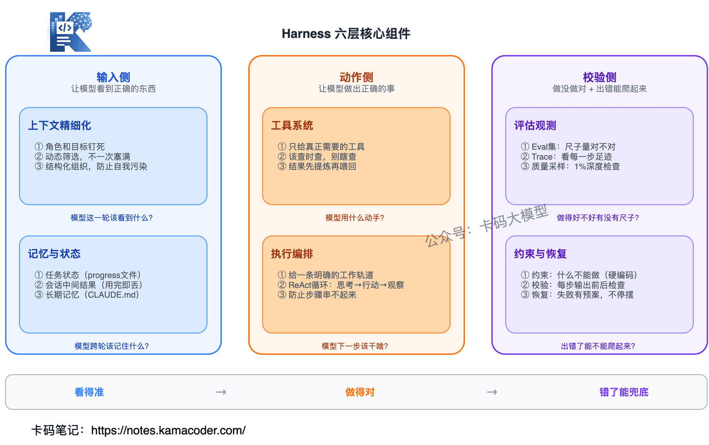
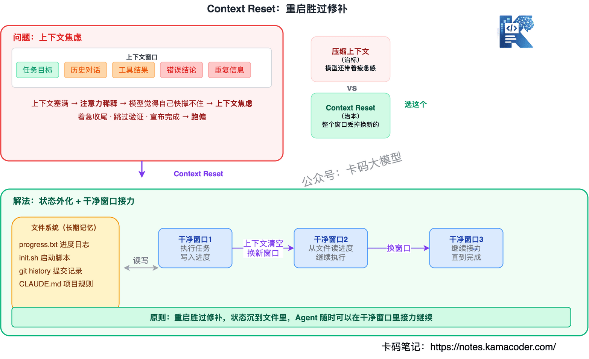

# Збірка питань про Harness Engineering: від промпта до контексту й harness

Найчастіше нове слово, про яке питають на співбесідах, — **Harness Engineering**.

AI зараз розвивається надто швидко. Багато хто щойно розібрався з Prompt Engineering, а вже настав Context Engineering; не встигли перетравити — і в тренди вийшов Harness Engineering.

Дехто просто на співбесіді чув питання «як ви розумієте інженерію harness» — і завмирав.

**Що таке harness? Як це пов'язано з Prompt Engineering і Context Engineering? Що таке Hermes Agent і OpenClaw?** Не розібравшись у цьому, ви розсипаєтеся на першому ж уточненні.

Розберімо Harness Engineering повністю: від походження терміна до впровадження.

---

## Зміст

1. [Що таке Harness Engineering і звідки воно взялося](#1-що-таке-harness-engineering-і-звідки-воно-взялося)
2. [Від промпта до контексту й harness: три зміщення центру ваги в інженерії AI](#2-від-промпта-до-контексту-й-harness-три-зміщення-центру-ваги-в-інженерії-ai)
3. [Harness зсередини: шість базових шарів](#3-harness-зсередини-шість-базових-шарів)
4. [П'ять реальних проблем, на які наступили великі компанії](#4-пять-реальних-проблем-на-які-наступили-великі-компанії)
5. [Hermes Agent проти OpenClaw: дві реалізації harness](#5-hermes-agent-проти-openclaw-дві-реалізації-harness)
6. [Як це співвідноситься з Prompt і Context Engineering](#6-як-це-співвідноситься-з-prompt-і-context-engineering)
7. [Часті уточнення на співбесідах](#7-часті-уточнення-на-співбесідах)

---

## 1. Що таке Harness Engineering і звідки воно взялося

Інтерв'юер зазвичай питає: «Ви чули про Harness Engineering?» або «Агент = модель + harness — як ви розумієте цю рівність?»

### Спершу розберімося: що таке harness?

Слово harness дослівно означає **збрую**, або **упряж**.

Уявіть верхову їзду: сам кінь має велику силу — може бігти, стрибати, везти вантаж. Але без вуздечки й збруї ця сила некерована: кінь може побігти до урвища, скинути вас або піти пастися й не повернутися.

Роль збруї в тому, щоб ця сила **працювала на вас**.

З AI-системами так само. LLM сильна, агент багато вміє, але без чогось, що їх «припинає», відстежує й обмежує, це некерований кінь: може збитися з курсу, галюцинувати, перевищити повноваження або непомітно зіпсуватися.

**Harness Engineering — це інженерна дисципліна, яка надягає на AI-систему вуздечку.**

### Хто першим вимовив це слово?

Багато хто підхоплює розмову про Harness Engineering, зовсім не знаючи, хто першим це запропонував. А зрозумівши походження, ви побачите, чому цього разу тренд справжній, а не чергова перефарбована концепція.

**5 лютого 2026 року** Мітчелл Гашимото (співзасновник HashiCorp, автор Vagrant і Terraform) опублікував допис «My AI Adoption Journey». Він розклав шлях освоєння AI на шість кроків, і п'ятий крок називався саме **«Engineer the Harness»**.

Його визначення надзвичайно лаконічне:

> Щоразу, коли ви помічаєте, що агент припустився помилки, витратьте трохи часу й інженерно зробіть так, щоб він більше ніколи не міг припуститися тієї самої помилки.

Вдумайтеся в цю ідею. Переважна більшість, побачивши помилку агента, вилає його, виправить руками й сподівається, що наступного разу пронесе. Але Гашимото робить інакше: щоразу він спиняється й питає себе, чи може він назавжди вбудувати виправлення в середовище так, щоб ця помилка стала структурно неможливою.

Це може бути правило в AGENTS.md, лінтер, автоматичний тест або git-хук. Головне те, що **виправлення має осісти в середовищі, а не лишитися в людській голові**.

Такий підхід дає **складний відсоток**. Щоразу, коли агент помиляється, середовище стає трохи сильнішим; сильніше середовище — менше помилок наступного разу; менше помилок — швидше поліпшення. З часом ваш harness міцнішає, і агент у вашому проєкті працює дедалі стабільніше.

Через тиждень після цього допису OpenAI випустила офіційну статтю «Harness engineering: leveraging Codex in an agent-first world». Ідеться про внутрішню команду, яка з порожнього репозиторію за п'ять місяців силами агентів написала мільйон рядків коду й змерджила 1500 PR, причому жодного рядка людина не написала руками.

Шлях терміна цілком зрозумілий: **його вимовив ветеран інфраструктурної сфери → за кілька днів OpenAI підтвердила статтею → за тиждень про це говорила вся сфера AI.** Таке походження означає, що термін не «спалахне й згасне», як багато інших: він виріс на реальному інженерному ґрунті.

### Ключова рівність

У спільноті ходить дуже лаконічна формула:

**агент = модель + harness**

Людською мовою: в агентній системі майже все, окрім самої моделі, що визначає стабільність поставки, належить до harness.

Можна вивести й навпаки: **harness = агент − модель**.

Ця формула чітко окреслює межі harness.


### Ключове для співбесіди

Не сприймайте Harness Engineering як конкретний інструмент чи продукт. Інтерв'юер питає про **методологію**: як ви проєктуєте ціле середовище виконання, щоб модель стабільно робила правильно. Визначення Гашимото й практику OpenAI варто вміти назвати — це походження концепції.

---

## 2. Від промпта до контексту й harness: три зміщення центру ваги в інженерії AI

Інтерв'юер спитає: «Чим Harness Engineering відрізняється від Prompt Engineering і Context Engineering?»

Щоб справді пояснити, яку проблему розв'язує harness, не можна починати одразу з нього. Бо він не виник із порожнечі — його витиснула сама еволюція інженерії AI за останні роки.

### Еволюція самих агентів

Перш ніж говорити про зміщення центру ваги, погляньмо, що змінилося в самих агентах: саме зміна їхньої форми й змусила змінюватися інженерні методи.


Спершу були **чат-боти**: ви питаєте — я відповідаю, один раунд, що модель сказала, те й є; жодної інженерії не треба.

Потім з'явилися **пошук та інструменти**: модель може читати документи й викликати API — і одразу виникли питання, як подавати їй знайдену інформацію й чи правильно вона зрозуміє результат інструмента. Самого промпта вже замало: треба керувати контекстом.

Далі — **самостійні агенти**: модель сама планує задачу, ділить її на кроки, виконує й перевіряє. Один запуск — десятки кроків, і збій на будь-якому псує все подальше. Тут уже замало й керування контекстом: потрібен цілий набір механізмів, щоб вона «працювала стабільно».

На передньому краї — **агенти, що самовдосконалюються**: вони не лише стабільні, а й учаться з помилок, породжують нові вміння й наступного разу їх перевикористовують. Це зв'язує harness із циклом навчання.

**Агент пройшов шлях «питання-відповідь» → «робить справу» → «робить довго» → «робить дедалі краще», і кожен крок оголював слабкі місця попереднього покоління інженерних методів, змушуючи народжуватися нові.**

### Етап 1: Prompt Engineering — щоб модель «зрозуміла»

Велика модель по суті є **імовірнісним генератором, украй чутливим до контексту**. Що подасте на вхід, у тому напрямку вона й генеруватиме. Дали роль — відповідатиме в логіці цієї ролі; дали кілька прикладів — доповнюватиме за цією парадигмою; наголосили на обмеженні — вважатиме його головним.

Тому та сама задача, сформульована інакше, дає вдесятеро інший результат. «Додай сортування» може дати обірваний шматок коду, а «ось повний код, додай сортування за віком за спаданням, збережи всю логіку, поверни повний код» дасть придатний результат.

Prompt Engineering розв'язує одну задачу: **модель не те щоб не вміє — це ви не сказали чітко.**

Для однораундових сценаріїв це працює добре. Але задачі швидко ускладнилися, і інженерія промптів перестала витримувати: попросіть модель «проаналізувати фінансовий звіт компанії» — вона вашого звіту не бачила, що їй аналізувати? Попросіть «написати функціональність за стандартами компанії» — вона ваших стандартів не бачила.

**Промпт добре виражає задачу, але не здатен добути знання, яких модель не має.** Він розв'язує проблему формулювання, а не проблему інформації.

### Етап 2: Context Engineering — щоб модель «знала»

Чому Context Engineering став популярним? Бо змінилася форма продуктів. Раніше були чат-боти: питання — відповідь. Потім прийшли агенти, і модель мала входити в реальне середовище й працювати: багато раундів, виклики інструментів, написання коду, запити до бази, передавання проміжних результатів між кроками.

Для повноцінної задачі моделі потрібні щонайменше: поточний документ із вимогами, історія рев'ю, стандарти компанії, конкретна мета поточної задачі й проміжні висновки попереднього аналізу. Усе це разом і є повним «контекстом».

Ключова думка Context Engineering одним реченням: **модель не обов'язково знає, тож система має в потрібний момент подати їй правильну інформацію.**

Але контекстне вікно обмежене. Гірше того: коли контекст забитий, виникає **деградація контексту** (context rot): модель не пам'ятає попереднього, суперечить сама собі, ігнорує визначені на початку правила. Як людина, завалена інформацією: дайте забагато — і вона перестане бачити головне.

Тож Context Engineering робить три речі: **відбір** (знайти найдотичніше), **стиснення** (звести в підсумок і заощадити місце) і **збирання** (розкласти по порядку, важливе ближче до кінця).

Agent Skills від Anthropic побудовані саме на цьому: спершу модель бачить лише «зміст», а докладний опис інструмента підвантажується динамічно, коли він справді потрібен. Суть оптимізації контексту не в тому, щоб «дати більше», а в тому, щоб **давати за потреби, пошарово й у потрібний момент**.

**Але й на цьому не кінець.**

### Етап 3: Harness Engineering — щоб модель «робила правильно»

Хоч як красиво написано промпт і хоч як ідеально впорядковано контекст, на окремому кроці модель працює дедалі краще — але щойно ланцюжок задачі довшає, проблеми повертаються:

- план чудовий, а під час виконання раптом збивається;
- інструмент викликано правильно, а результат зрозуміло хибно;
- у довгому ланцюжку задача непомітно відхиляється від початкового наміру, і система цього не помічає;
- працює, працює — і забуває, навіщо починала.

Промпт оптимізує «вираження наміру», контекст — «постачання інформації», але обидва лишаються **на вході**. А коли модель починає діяти безперервно, виникає нове питання: **хто за нею наглядає? хто її обмежує? хто поверне її на курс, коли вона зіб'ється?**

Саме це й розв'язує Harness Engineering. Попередні два покоління інженерії дбали про те, «як змусити модель краще думати», а harness дбає про те, **«як не дати їй збитися, змусити працювати стабільно й підніматися після помилок»**.

---

## 3. Harness зсередини: шість базових шарів

Інтерв'юер спитає: «Якби ви проєктували harness, що б ви туди поклали?»

Якщо подивитися на провідні команди, що роблять агентів, — OpenAI, Anthropic, LangChain, — форми продуктів і стеки різні, але внутрішня структура harness напрочуд схожа. Бо завдання «змусити агента стабільно працювати в реальному світі» природно зводить усіх до одного.

Зрілий harness приблизно розкладається на шість шарів, згрупованих у три частини за призначенням:



**Вхідна частина** (щоб модель бачила правильне): тонке керування контекстом + керування пам'яттю й станом.

**Частина дій** (щоб модель робила правильне): система інструментів + оркестрація виконання.

**Частина перевірки** (щоб модель знала, чи зробила правильно, і могла піднятися після помилки): оцінювання й спостережуваність + обмеження й відновлення.

Ці три частини відповідають трьом необхідним умовам роботи інженера в реальному середовищі: **бачити точно → робити правильно → мати страховку в разі помилки.**

| Шар | Яку задачу розв'язує |
|----|---------------|
| Тонке керування контекстом | Що модель має побачити цього раунду? |
| Система інструментів | Чим модель діє? |
| Оркестрація виконання | Що моделі робити далі? |
| Пам'ять і стан | Що модель має пам'ятати між раундами? |
| Оцінювання й спостережуваність | Чи є мірило того, добре вона працює чи ні? |
| Обмеження й відновлення | Чи зможе вона піднятися після помилки? |

Розгляньмо кожен шар.

### Шар 1: тонке керування контекстом

Цей шар керує «простором»: **як виглядає та купа контексту, яку ми надсилаємо моделі цього раунду, що в ній лежить і як вона впорядкована**. Його легко переплутати з четвертим шаром (пам'ять і стан), але різниця така: перший шар керує тим, «що видно цього раунду», а четвертий — тим, «як минулий раунд перетікає в наступний».

Три головні речі.

**1. Жорстко зафіксувати роль і мету.** Більшість відхилень агента починається з нечіткої ідентичності. Модель має знати, хто вона, яка поточна задача і що вважати успіхом.

**2. Динамічно відбирати, а не запихати все одразу.** Anthropic називає це just-in-time retrieval: агент підтягує інформацію за потреби просто під час роботи, а не отримує наперед усе, що може знадобитися. Що більше запхано, то розсіяніша увага.

**3. Структурувати.** Сталі правила — в одному місці, динамічні докази — в іншому, проміжні висновки — у третьому. Інакше модель «забруднює сама себе»: хибний проміжний висновок із початку впливає на подальші рішення.

### Шар 2: система інструментів

Велика модель без інструментів — просто передбачувач тексту. Щойно з'являються інструменти, агент оживає. Але більше інструментів не означає краще.

OpenAI наступила на ці граблі на початку роботи над Codex: спершу агентові дали купу інструментів, вирішивши, що «вибір завжди корисний», а в результаті агент раз у раз брав не той інструмент і не в той момент. Потім більшість прибрали — і результат навпаки покращився.

Цей шар відповідає на три питання: **які інструменти дати** (лише справді потрібні), **коли який використовувати** (шукати тоді, коли треба, і не шукати навмання) і **як повертати результат моделі** (30 результатів пошуку не віддають як є — спершу стискають).

MCP (Model Context Protocol) по суті й займається стандартизацією шару інструментів, щоб будь-який інструмент підключався до будь-якого агента однаково.

### Шар 3: оркестрація виконання

Суть агента, якщо спростити, — це **цикл**: подумав крок → зробив крок → подивився на результат → подумав далі. Класична назва — ReAct (Reasoning + Acting).

Але диявол ховається саме в цьому циклі. Типовий провал агента такий: кожен окремий крок він робити вміє, а зв'язати їх усі — ні. Він знає, як витягти дані, і знає, як написати підсумок, але не знає, що спершу треба витягти все, а потім аналізувати по черзі, — і віддає вам купу напівфабрикатів. Інженерне опрацювання самого циклу (керування контекстом, станом, бюджетом, інструментами й завершенням) і зветься Loop Engineering; цикл можна назвати серцем harness, і докладно він розібраний у статті [Від ReAct до Loop Engineering](./loop_engineering_interview.md).

Завдання цього шару — **дати моделі чітку робочу колію**, щоб вона знала, «на якому я кроці й що робити далі».

### Шар 4: пам'ять і стан

Агент без керування станом між викликами страждає на амнезію. Сьогодні відпрацював, а завтра геть не пам'ятає, що «цю задачу вчора вже виконано», — і виконує знову.

Anthropic дає ключову пораду: **стан агента має лежати не в контекстному вікні, а виноситися у файлову систему.** Хай агент веде журнал прогресу, стартовий скрипт і повну історію git як «носій довгострокової пам'яті». Коли наступного разу естафету підхопить геть нове контекстне вікно, достатньо прочитати ці файли, щоб одразу зрозуміти, «на якому ми кроці».

Пам'ять треба зберігати пошарово: **стан задачі** (пишеться у файл прогресу й архівується після завершення), **проміжні результати сесії** (використали в цьому раунді й відкинули) і **довгострокова пам'ять** (лежить у постійній конфігурації й підставляється щоразу). У цих трьох типів геть різний життєвий цикл, і змішувати їх не можна.

CLAUDE.md у Claude Code і .cursorrules у Cursor — типові реалізації саме довгострокової пам'яті.

### Шар 5: оцінювання й спостережуваність

Цей шар найчастіше пропускають — і потім не можуть ані рухатися вперед, ані відступити.

Забагато команд радісно випускають агента, а через два тижні виявляють, що реальна успішність становить 50 %: справа не в тому, що він не видає результату, — результат є щоразу, але в половині випадків хибний. І два тижні цього ніхто не помічав, бо просто не було механізму, який сказав би, «чи правильно він це зробив».

Дві речі.

**Набір для оцінювання** — напишіть добірку типових задач, для кожної зазначте, який результат правильний, і після кожної зміни агента проганяйте її, порівнюючи успішність. Без такого набору ваша оцінка лишатиметься на рівні езотерики «мені здається, стало краще».

**Трасування** — бачити реальні сліди кожного кроку агента: які рішення ухвалено, який інструмент викликано, що повернуто, скільки витрачено токенів. Системи трасування на кшталт LangSmith чи Langfuse роблять саме це. Коли трасування є, налагодження перетворюється з «вгадування» на «спостереження».

### Шар 6: обмеження й відновлення

У реальному середовищі збій — не виняток, а норма. Цей шар робить три речі.

**Обмеження** — визначає, чого агентові робити не можна. Це краще зашивати в код або правила лінтера, а не писати в промпт, покладаючись на свідомість агента.

**Перевірка** — автоматичний контроль до й після кожного кроку виводу. Чи правильний формат? Чи є назва каналу в білому списку? Перевірка — це не питання смаку, а жорстке правило.

**Відновлення** — план на випадок збою. Обмежили швидкість API — почекати й повторити; не вдалося надіслати — покласти в локальну чергу; закінчуються токени — негайно спинитися й зберегти прогрес. Кожен типовий збій має мати чіткий шлях відновлення.

### На який шар лягає «складний відсоток» Гашимото?

Пам'ятаєте його ідею: «щоразу, коли агент помиляється, осаджуйте виправлення в середовище»? То куди саме воно осідає?

- агент раз у раз губить якусь частину контексту → правимо шар 1;
- постійно бере не той інструмент → шар 2;
- плутається в кроках → шар 3;
- не пам'ятає прогресу наступного дня → шар 4;
- неможливо зрозуміти, добре чи погано він працює → будуємо шар 5;
- падає від першого ж збою → підсилюємо шар 6.

Ці шість шарів — не список, який треба «збудувати за раз», а **дороговказ**: він каже, куди має лягти виправлення наступного разу, коли агент помилиться. З часом кожен шар потроху наповнюється й міцніє — саме так harness і росте.

---

## 4. П'ять реальних проблем, на які наступили великі компанії

Інтерв'юер спитає: «На які граблі ви наступали, роблячи агентів? Як розв'язували?»

Ясність у поняттях — це одне, а впровадження — інше. Справжня складність harness не в кресленні, а в конкретних пастках.

### Проблема 1: чому агент із часом дедалі більше збивається?

Із цим стикаються майже всі команди, що роблять агентів для довгих ланцюжків. Спершу агент працює непогано, а потім починає «забувати»: початкову мету, попередні рішення, — повторює роботу й відхиляється від основної лінії.

У Cognition (творці Devin), перероблюючи Devin під Claude Sonnet 4.5, помітили цікаве явище й назвали його **контекстною тривожністю (context anxiety)**: модель ніби сама відчуває, що «довго не витримає», і не лише втрачає деталі, а й поспішає завершити — раптово спрощує рішення, пропускає перевірку й квапливо оголошує задачу виконаною. Найдивніше те, що власну оцінку «скільки контексту лишилося» модель дає дуже неточно: часто вважає, що місця майже немає, хоча лишилася добра половина.

Перша реакція багатьох — стиснути контекст, звівши історію в підсумок. Чи це правильно? Правильно, але недостатньо. Anthropic сформулювала болючіше спостереження: самого стиснення мало, відчуття «я вже втомилася» модель однаково несе далі.

Ключова дія, що справді розв'язує вузол, зветься **скиданням контексту (context reset)**: старе вікно викидається цілком, а естафету підхоплює чисте.



Увесь стан винесено у файлову систему, нове вікно читає прогрес із файлів і одразу знає, «на якому ми кроці». Це дуже схоже на роботу з витоком пам'яті: замість відчайдушно оптимізувати, простіше перезапустити процес і відновити стан із диска.

**Принцип: перезапуск кращий за латання, а стан має осідати у файли.**

### Проблема 2: чому агент, оцінюючи себе, завжди оптимістичний?

Багато хто просить модель після роботи самооцінити, «як усе вийшло». Звучить логічно, але агент завжди вважає, що впорався добре, — особливо на задачах без еталонної відповіді, де відхилення самооцінки величезне.

Згодом в Anthropic дійшли важливого висновку: **той, хто робить, і той, хто приймає, мають бути різними.** Вони запровадили трикутник ролей: Planner розкладає вимогу, Generator реалізує, Evaluator приймає через справжнє тестування. Evaluator не просто дивиться на код — він мусить справді працювати зі сторінкою, дивитися на взаємодію й перевіряти результат виконання. Лише за достатньої незалежності ролей утворюється дієвий цикл: планування → генерація → приймання → виправлення → повторне приймання.

**Принцип: виробництво й приймання мають бути розділені, а приймальник має мати доступ до реального світу.**

### Проблема 3: агент раз у раз падає — що робити інженерові?

Коли агент постійно зазнає невдачі, у більшості людей є лише дві інстинктивні реакції: підкрутити промпт або взяти сильнішу модель. Але в OpenAI, працюючи над Codex, виявили, що обидві ведуть не туди.

Вони зробили доволі неймовірну річ: у проєкті на мільйон рядків коду люди-інженери майже не писали коду — усе писали агенти. А що ж робили люди? **Три речі**:

* розкладали продуктові цілі на дрібні задачі в межах спроможностей агента;
* коли агент раз у раз падав, дивилися, «якої спроможності бракує середовищу», і додавали її;
* вибудовували зворотний зв'язок, щоб агент бачив результати власної роботи.

Раніше, коли агент писав код із багом, дописували в промпт «уважно перевір код, щоб не було багів» і сподівалися, що модель послухається. Команда Codex зробила інакше: під'єднала агентові лінтер, юніт-тести й середовище виконання, щоб він сам запускав написане, бачив баги й сам їх виправляв. Та сама проблема: у першому випадку благаємо модель постаратися, у другому — переробляємо середовище.

**Принцип: коли агент раз у раз падає, питайте не «чи може модель постаратися», а «чого бракує середовищу».**

### Проблема 4: файл правил дедалі довший, а агент дедалі плутаніший — чому?

Ці граблі OpenAI пройшла сама. На ранньому етапі Codex зробили величезний AGENTS.md, куди запхали всі правила, домовленості й найкращі практики. Думка була така: що повніші правила, то менше помилок. І що ж? Агент лише більше плутався: контекстне вікно є дефіцитним ресурсом, файл дедалі довшав, і увага моделі сильно розмивалася.

Як це виправили? Перетворили AGENTS.md з «енциклопедії» на «зміст»: у головному файлі лишився ключовий покажчик приблизно на 100 рядків, а деталі виїхали в підлеглі документи. Агент зазвичай дивиться лише зміст, а в потрібний розділ заглиблюється, коли той справді потрібен. Це і є **поступове розкриття (progressive disclosure)**: суть оптимізації контексту не в тому, щоб «давати якомога більше», а в тому, щоб «давати, коли треба, і ховати, коли не треба».

Якщо ви зараз пишете CLAUDE.md або правила для Cursor, дуже раджу перевірити, чи не перетворюються вони на енциклопедію. Якщо так — негайно розділіть.

**Принцип: із файлами правил краще недодати, ніж перебрати; для моделі менше означає більше.**

### Проблема 5: код від агента дедалі гірший — як віддавати технічний борг?

Ця проблема дуже приземлена. Коли агент пише більшість коду, він шалено копіює наявні в репозиторії патерни: і хороші, і погані. Щойно десь на ранньому етапі код написано криво, агент сприймає цю кривизну за «усталену практику» — і нагромаджує далі. В OpenAI дали цьому болючу назву: **AI slop** — «помиї з AI-коду».

Спершу в OpenAI боролися з цим уручну: щоп'ятниці інженери цілий день прибирали код. Не вийшло: агенти виробляють код швидше, ніж люди встигають прибирати, — у п'ятницю почистили, у понеділок знову повно.

Остаточне рішення виявилося дуже в дусі harness: **записати досвід інженерів як «золоті принципи» (Golden Principles) і осадити їх у репозиторій**, а потім пустити фонових агентів, які за розкладом сканують репозиторій, знаходять відхилення й автоматично відкривають PR із виправленнями. Більшість таких PR перевіряється за хвилину й автоматично зливається. Технічний борг перетворився з «раз на тиждень ручне прибирання» на «щодня безперервне автоматичне погашення».

В оригіналі OpenAI є дуже влучна фраза: **технічний борг схожий на позику під високий відсоток — його майже завжди варто гасити щодня потроху, а не накопичувати й повертати колись одним махом.**

**Принцип: технічний борг не накопичують до одноразового погашення, а щодня потроху гасять силами фонових агентів.**

### Підсумок

Перезапуск кращий за латання; виробництво й приймання нарізно; замість підганяти модель — змінюй середовище; правил краще менше; борг гаси щодня.

---

## 5. Hermes Agent проти OpenClaw: дві реалізації harness

Інтерв'юер спитає: «Ви знайомі з Hermes Agent і OpenClaw? Як вони пов'язані з Harness Engineering?»

### Спершу визначмося: harness — методологія, а Hermes і OpenClaw — реалізації

Harness Engineering — це методологія й архітектурна ідея, а Hermes Agent і OpenClaw — дві конкретні реалізації цієї ідеї.

```
          ┌─────────────────────┐
          │ Harness Engineering │  ← методологія (рівень абстракції)
          └──────────┬──────────┘
                     │
     ┌───────────────┼───────────────┐
     │               │               │
 Hermes Agent    Claude Code      OpenClaw
 (реалізація A)  (реалізація B)   (реалізація C)
```

Якщо на співбесіді почати саме з цієї структури, інтерв'юер одразу побачить, що ви розрізняєте «ідею» і «продукт».


### OpenClaw

OpenClaw — відкритий персональний AI-асистент, який можна запустити на власному пристрої. Його талісман — космічний лобстер на ім'я Molty.

Ключове позиціювання — **месенджери насамперед, локальність насамперед**: один процес-шлюз з'єднує понад 25 платформ обміну повідомленнями, тож асистент доступний усюди.

Особливості harness в OpenClaw:

| Спроможність | Реалізація |
|------|----------|
| Керування контекстом | Підставляння AGENTS.md / SOUL.md / TOOLS.md |
| Система інструментів | Протокол MCP + маркетплейс скілів ClawHub |
| Оркестрація виконання | Цикл одного агента |
| Пам'ять і стан | Локальна персистентність у файлах |
| Оцінювання й спостережуваність | Базові логи |
| Обмеження й відновлення | Бекенди-пісочниці (Docker/SSH) |

OpenClaw — зрілий персональний асистент: покриття всіх месенджерів, локальна приватність, багатий маркетплейс умінь. Але його harness по суті є **системою виконання інструментів**: ви даєте промпт і набір інструментів, він викликає їх і повертає результат.

### Hermes Agent

Hermes Agent — агент від Nous Research, що самовдосконалюється, зі слоганом «The agent that grows with you».

Hermes зробив дуже важливий крок: **від системи виконання інструментів до системи самовдосконалення**.

Найбільша його відмінність від OpenClaw — вбудований **цикл навчання (learning loop)**:


```
виконати задачу → підсумувати досвід → згенерувати скіл → зберегти в пам'ять → перевикористати наступного разу
```

Особливості harness у Hermes:

| Спроможність | Реалізація |
|------|----------|
| Керування контекстом | AGENTS.md + динамічне завантаження |
| Система інструментів | MCP + самопороджені вміння (~/.hermes/skills/) |
| Оркестрація виконання | Один агент + паралельне делегування субагентам |
| Пам'ять і стан | Персистентна пам'ять + моделювання користувача Honcho + пошук по сесіях через FTS5 |
| Оцінювання й спостережуваність | Самонагадування + підсумки моделлю для пригадування між сесіями |
| Обмеження й відновлення | Шість термінальних бекендів + заплановані задачі (cron) |

### Порівняння: хто в чому сильний

| Вимір | OpenClaw | Hermes Agent |
|------|----------|-------------|
| Позиціювання | Персональний AI-асистент | Агент, що самовдосконалюється |
| Мова | TypeScript | Python |
| Платформи обміну повідомленнями | Понад 25 (найширше покриття) | 6 (CLI, Telegram, Discord, Slack, WhatsApp, Signal) |
| Джерело вмінь | Маркетплейс ClawHub (внесок спільноти) | Самостійна генерація + стандарт agentskills.io |
| Система пам'яті | Базова персистентність | Глибока: моделювання користувача + пошук між сесіями + самонагадування |
| Здатність навчатися | Немає (щоразу «новачок») | Є (створює вміння з досвіду й стає сильнішим) |
| Дослідницькі можливості | Немає | Пакетна генерація траєкторій + середовище для RL-навчання |
| Зручність міграції | — | Вбудована команда `hermes claw migrate` для імпорту з OpenClaw |

**Різниця одним реченням:**

OpenClaw робить модель **здатною працювати**: підключення до всіх платформ, повний набір інструментів, але щоразу «новачок».

Hermes Agent робить модель **дедалі сильнішою**: він пам'ятає зроблене, породжує нові вміння й перевикористовує їх; це поєднання harness і циклу навчання.

### Як відповідати на співбесіді

Спершу чітко скажіть, що harness — це методологія, а Hermes і OpenClaw — реалізації. Далі порівняйте: OpenClaw є «системою виконання інструментів» із широким покриттям месенджерів; Hermes є «системою самовдосконалення», і його ключова відмінність — цикл навчання.

---

## 6. Як це співвідноситься з Prompt і Context Engineering

Інтерв'юер спитає: «Ці три "інженерії" заміняють одна одну? Чи треба вчити всі?»

### Не заміна, а вкладеність

Це зовсім не заміна, а **вкладеність**:

- промпт — інженерія «інструкції»;
- контекст — інженерія «вхідного середовища»;
- harness — інженерія «усієї системи виконання».

Межі розширюються шар за шаром. **Промпт є частиною контексту, а контекст — частиною harness.** Коли ви робите harness, усередині обов'язково є інженерія контексту, а в ній — інженерія промптів.

### Чотири рівні

Якщо додати ще й цикл навчання з Hermes Agent, вийде чотири рівні:

| Рівень | Що розв'язує | Одним реченням |
|------|---------|--------|
| Prompt Engineering | Як сказати | Щоб модель зрозуміла, чого ви хочете |
| Context Engineering | Яку інформацію дати | Щоб модель знала, чим користуватися |
| Harness Engineering | Що вона може робити | Щоб модель стабільно робила правильно |
| Цикл навчання | Чи стає вона сильнішою | Щоб модель працювала дедалі краще |

### Ключове для співбесіди

Не кажіть «я вмію все три» — покажіть рівень розуміння: спершу поясніть, що це вкладеність, а не заміна; далі наголосіть, що harness дивиться з ширшої системної перспективи й включає попередні два; а насамкінець назвіть справжній вододіл: **поки задача лишається однораундовим діалогом, вистачає промпта; коли потрібні зовнішні знання, ключовим стає контекст; а щойно ви заходите в реальний сценарій із довгим ланцюжком, виконуваними діями й низькою терпимістю до помилок, harness стає майже неминучим.**

---

## 7. Часті уточнення на співбесідах

### Про розуміння понять

**Q: Чим Harness Engineering відрізняється від MLOps?**

MLOps зосереджений на інженерному процесі навчання, розгортання й версіювання моделей; Harness Engineering — на проєктуванні середовища виконання вже після запуску: інструменти, обмеження, оцінювання, відновлення. MLOps — це «як довести модель до продакшну», harness — «як зробити, щоб вона там стабільно працювала». Вони доповнюють одне одного: MLOps ближче до навчання, harness — до виконання.

**Q: Як ви розумієте рівність «агент = модель + harness»?**

Окрім самої моделі, майже все, що визначає стабільність поставки агента, належить до harness: інструменти, файли контексту, система пам'яті, механізм оцінювання, правила обмежень, стратегії відновлення. Зміна моделі піднімає стелю, а побудова harness — здатність довести все до робочого стану. Тепер, коли темп оновлення моделей уповільнився, простір для поліпшень саме в harness може бути значно більшим, ніж здається.

**Q: Як пов'язані Context Engineering і RAG?**

RAG є конкретною технікою всередині Context Engineering: він розв'язує крок «відбору» — знайти найдотичніше серед великої кількості документів. Context Engineering охоплює ще й стиснення (зведення в підсумок) і збирання (упорядкування), а RAG закриває лише перший крок.

### Про технічні деталі

**Q: Що робити з деградацією контексту в довгій роботі агента?**

Три кроки: спершу стиснення контексту (звести історію в підсумок і вивільнити місце); якщо стиснення не досить (модель несе відчуття «втоми») — скидання контексту (усе вікно викидається, береться чисте, а стан відновлюється з файлової системи); і головне — стан обов'язково має бути винесений у файли, а не лежати в контекстному вікні.

**Q: Що робити, коли AGENTS.md дедалі довший, а результат гіршає?**

Перейти до поступового розкриття: у головному файлі лишити ключовий покажчик (OpenAI радить близько 100 рядків), детальні правила винести в підлеглі документи, а агент підвантажуватиме їх за потреби. Це та сама ідея, що й в Agent Skills від Anthropic: не запихати все одразу, а підставляти динамічно за потреби.

**Q: Як саме працює цикл навчання в Hermes Agent?**

Виконавши складну задачу, агент автоматично виділяє з досвіду патерн і генерує файл скіла (у `~/.hermes/skills/`), а наступного разу на схожій задачі шукає серед наявних скілів, перевикористовує їх і водночас поліпшує. Це перегукується з ідеєю складного відсотка Гашимото: кожна помилка осідає в середовищі, середовище міцнішає, а агент стає стабільнішим.

### Про продакшн

**Q: Як ви керуєте технічним боргом в агента?**

Технічний борг не можна накопичувати до одноразового погашення. Два підходи: перший — записати досвід інженерів як золоті принципи й осадити їх у репозиторій, щоб агент писав код за правилами; другий — пустити фонових агентів, які періодично скануватимуть репозиторій, шукатимуть відхилення й відкриватимуть PR із виправленнями, а люди швидко переглядатимуть і зливатимуть. Гасити щодня потроху значно дієвіше, ніж прибирати все в п'ятницю.

**Q: Як пояснити цінність Harness Engineering нетехнічній людині?**

«LLM — як автопілот на автостраді: їхати може швидко, але чи сядете ви в машину без гальм, подушок безпеки й приладової панелі? Harness Engineering і встановлює AI гальма й подушки. Без нього що потужніший AI, то небезпечніший».

---

## Наостанок

Центр ваги в інженерії AI за два роки змістився тричі: промпт розв'язує «як сказати», контекст — «яку інформацію дати», harness — «чи вдасться стабільно робити правильно». Це не заміна, а вкладеність: промпт є частиною контексту, а контекст — частиною harness.

Harness Engineering став популярним у 2026 році не тому, що вигадали ще одне слово, а тому, що AI по-справжньому вийшов у продакшн. Банки використовують LLM для перевірки кредитів, лікарні — для допоміжної діагностики, служби підтримки — агентів для обробки скарг. **Працює не дорівнює надійно**, а одна галюцинація — це реальні збитки.

Агент = модель + harness. Зміна моделі піднімає стелю, побудова harness — здатність довести все до робочого стану. Hermes Agent зробив ще крок далі за OpenClaw: він не лише дає моделі працювати, а й робить її дедалі сильнішою.

Якщо ви зараз робите агента, годі витрачати всі сили на підбір моделі й промптів. Погляньте на свій harness: чи є файли правил, чи є замкнений цикл перевірки, чи є оркестрація задач, чи є механізм оцінювання, чи є відновлення після збоїв, чи є цикл навчання. Кожен із цих пунктів піднімає вашого агента на щабель вище.

**Людей, які вміють зібрати агента, дедалі більше, а от тих, хто вміє втримати його стабільним у продакшні, бракує.**

Щоб копати далі: загальне бачення від технічної архітектури до організації й компетенцій — у [панорамі продакшн-агентів](./production_agent_architecture_harness_org_talent.md); базові принципи й протоколи агентів — у [збірці питань про агентів](./agent_interview.md); оркестрація harness у мультиагентних сценаріях — у [Multi-Agent Harness](./multi_agent_harness_interview.md); як зробити агентові «приладову панель» — у [спостережуваності Agent Harness](./agent_harness_observability_interview.md); порівняння реалізацій harness у провідних фреймворках — у [порівнянні агентних фреймворків](./agent_framework_comparison.md).

---

## Джерела

1. Mitchell Hashimoto, «My AI Adoption Journey» — походження концепції Harness Engineering, крок 5 «Engineer the Harness»: https://mitchellh.com/writing/my-ai-adoption-journey
2. OpenAI, «Harness engineering: leveraging Codex in an agent-first world» — офіційна стаття OpenAI, мільйон рядків коду за п'ять місяців: https://openai.com/index/harness-engineering/
3. Anthropic, «Effective harnesses for long-running agents» — інженерна практика Anthropic, рішення зі скиданням контексту: https://www.anthropic.com/engineering/effective-harnesses-for-long-running-agents
4. Anthropic, «Harness design for long-running application development» — контекстна тривожність, трикутник ролей, розділення виробництва й приймання: https://www.anthropic.com/engineering/harness-design-long-running-apps
5. Anthropic, «Effective context engineering for AI agents» — офіційний посібник із Context Engineering, поступове розкриття: https://www.anthropic.com/engineering/effective-context-engineering-for-ai-agents
6. Anthropic, «Building effective agents» — патерни робочих процесів агентів, принципи проєктування ACI: https://www.anthropic.com/engineering/building-effective-agents
7. LangChain, «Improving Deep Agents with harness engineering» — практика harness у LangChain, набори для оцінювання й відтворення трасувань: https://blog.langchain.com/improving-deep-agents-with-harness-engineering/
8. Cognition, «Rebuilding Devin for Claude Sonnet 4.5: Lessons and Challenges» — перше повідомлення про явище контекстної тривожності: https://cognition.ai/blog/devin-sonnet-4-5-lessons-and-challenges
9. Nous Research, Hermes Agent — відкритий проєкт агента, що самовдосконалюється (цикл навчання й генерація вмінь): https://github.com/NousResearch/hermes-agent
10. OpenClaw — відкритий проєкт персонального AI-асистента (месенджери всіх платформ і маркетплейс ClawHub): https://github.com/openclaw/openclaw
