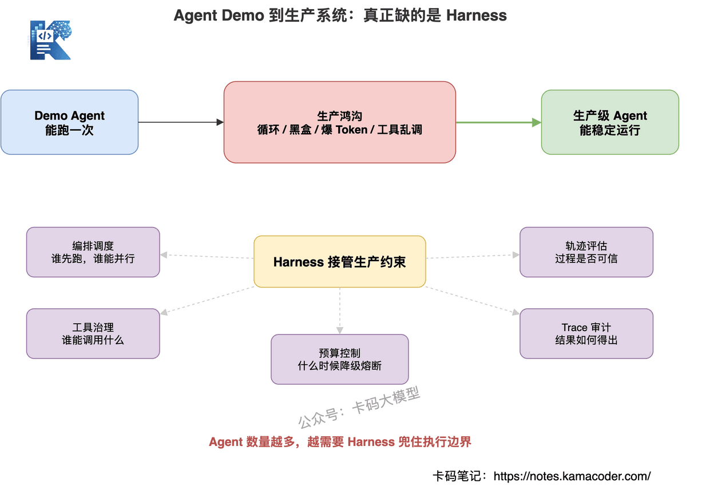
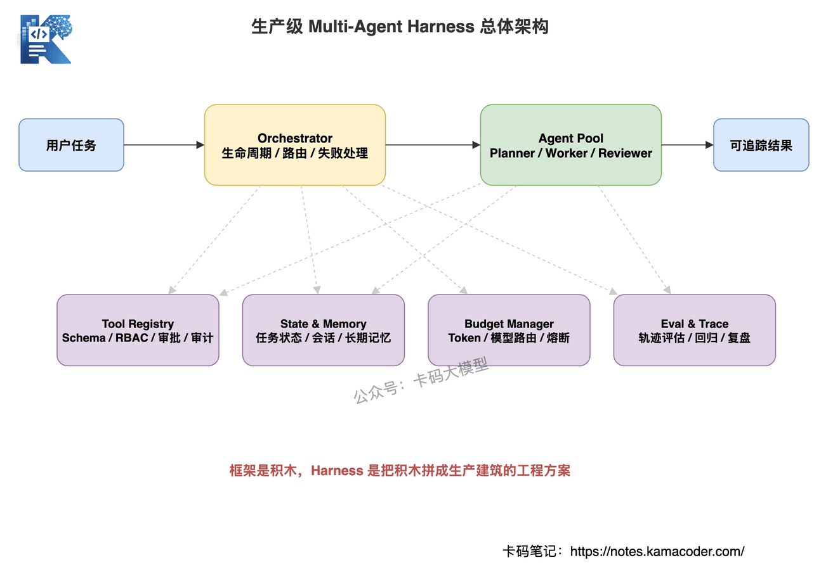
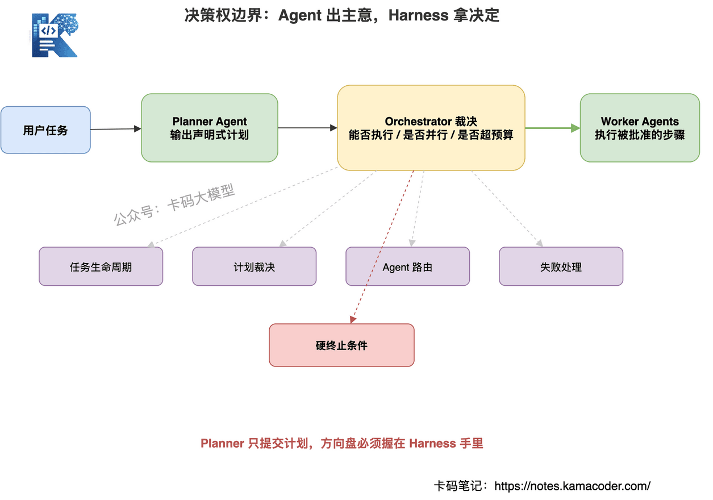
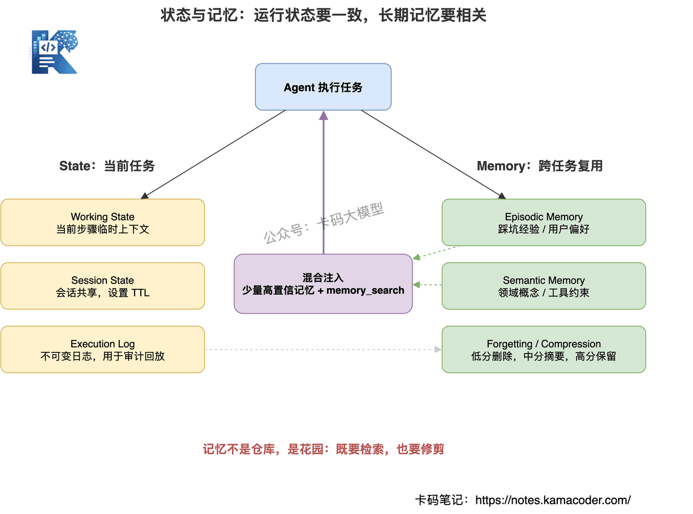
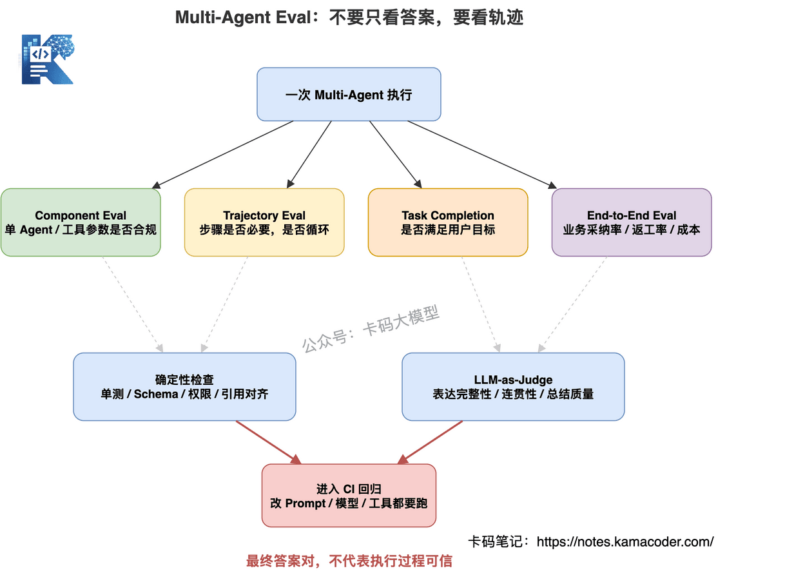
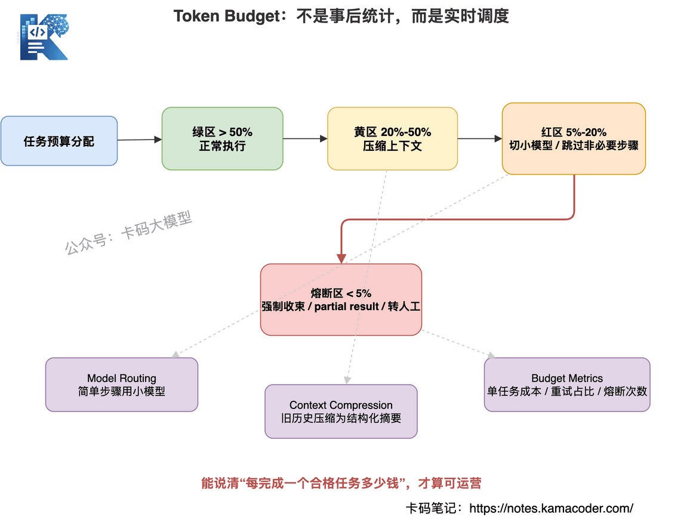

# Змагання майбутнього не в тому, «у кого більше агентів», а в тому, «у кого стабільніший harness»

Зараз у галузі всі говорять про мультиагентні системи — і напрямок справді перспективний.

Що таке Multi-Agent? Це те, про що ви чули: агент, який пише код, агент, який пише вимоги, агент від продукту, агент для тестування.

Усі вони разом у хмарі роблять один проєкт: команда агентів працює без сну й відпочинку й перекриває обсяг роботи цілого відділу.

За останній рік майже кожна команда, що робить застосунки на великих моделях, пробувала агентів.

Поле вводу, велика модель, кілька інструментів, системний промпт і гарний фронтенд.

На демонстрації виглядає потужно.

Керівник думає: то це ж цифровий працівник?

Бізнес думає: нарешті все працюватиме саме.

Розробка теж думає: розділили на Planner, Worker і Reviewer — тепер усе стабільно.

Історія звучить дуже спокусливо, але без глибшого занурення не видно, скільки тут пасток.

Тож поговорімо, чому мрія прекрасна, а реальність сувора.

Щойно ваша мультиагентна система справді виходить у продакшн, проблеми починаються одразу.

Чому агент раз у раз викликає той самий інструмент?

Чому проста задача може спалити кількасот тисяч токенів?

Чому після збою одного субагента падає весь ланцюжок?

Чому кінцевий результат ніби правильний, а процес пояснити неможливо?

Чому під'єднання одного нового інструмента вимагає правок у півтора десятка місць склеювального коду?

Чому на питання бізнесу «звідки взявся цей висновок» система лише мовчить?

Це і є прірва між демо й продакшном.

Багато хто вважає, що подолати її можна сильнішою моделлю чи витонченішим промптом.

Недостатньо.

Насправді впровадження мультиагентної системи визначає базис середовища виконання:

**Multi-Agent Harness.**

Тобто:

**агент відповідає за локальний інтелект, harness — за глобальний контроль.**

Великі компанії дедалі частіше шукають розробників, здатних керувати спільною роботою кількох агентів.

Здавалося б, що там складного?

Розберімо це з погляду співбесіди. **Стаття доволі складна й пасує тим, хто вже має досвід роботи з агентами**; початківцям варто ознайомитися оглядово.

## Зміст

1. Спершу висновок: у продакшні змагаються не кількістю агентів
2. Що таке harness
3. Що насправді перевіряє інтерв'юер
4. Шар 1: оркестрація — агент пропонує, harness вирішує
5. Шар 2: керування інструментами — Tool Registry як межа безпеки
6. Шар 3: стан і пам'ять — пам'ятати потрібне, забувати зайве
7. Шар 4: оцінювання — дивіться не лише на відповідь, а й на траєкторію
8. Шар 5: контроль вартості — бюджет токенів як лінія життя
9. Шар 6: під'єднання MCP — стандартизація не означає беззахисність
10. Шар 7: спостережуваність і маршрут упровадження
11. Як відповідати на співбесіді

## 1. Спершу висновок: у продакшні змагаються не кількістю агентів

Одразу висновок:

**змагання майбутнього не в тому, у кого більше агентів, а в тому, у кого стабільніший harness.**

Демо з мультиагентністю робиться легко.

Ролі виділяються швидко:

- Planner розкладає задачі;
- Researcher шукає матеріали;
- Coder пише код;
- Reviewer перевіряє;
- Writer підсумовує.

Звучить фахово.

Але продакшн — не рольова гра.

Продакшн цікавить інше:

- чи має задача життєвий цикл?
- хто після збою вирішує, повторювати чи припинити?
- чи є в викликів інструментів права й аудит?
- чи не забруднює пам'ять контекст?
- чи не палитимуться токени без кінця?
- чи можна розібрати траєкторію?
- чи є погодження для ризикованих дій?
- чи не лишиться система беззахисною після під'єднання інструментів MCP?

Ці питання не розв'язуються «додаванням ще кількох агентів».

Ба більше: що більше агентів, то складніші проблеми.

Бо кілька агентів дають більше проміжних станів, більше викликів інструментів, більше копіювання контексту, більше шляхів збою й більше неспостережуваної поведінки.

Тож якщо на співбесіді ви скажете лише:

«Я використав співпрацю Planner, Executor і Reviewer», —

цього замало.

Сильніша відповідь така:

**як саме я тримаю цих агентів через harness, щоб вони лишалися керованими, оцінюваними, простежуваними й здатними до пониження режиму.**



## 2. Що таке harness

Спершу про поняття.

Слово harness дослівно означає «збруя, упряж, обмежувальний пристрій».

Стосовно агентних систем це можна розуміти так:

**harness — це каркас виконання, що зводить докупи модель, агентів, інструменти, стан, пам'ять, оцінювання, бюджет і безпеку.**

Це не просто промпт.

Промпт розв'язує питання, як модель зрозуміє задачу.

Harness розв'язує питання, як модель надійно її виконає.

Це і не просто оркестратор.

Оркестратор здебільшого визначає порядок виконання.

А harness має розв'язувати ще й:

- розподіл ресурсів;
- керування станом;
- керування інструментами;
- бюджет вартості;
- межі безпеки;
- запис траєкторій;
- регресійне оцінювання;
- запобіжники на випадок збою.

Це також не дорівнює конкретному фреймворку агентів.

LangGraph, AutoGen, CrewAI можуть бути цеглинками, з яких ви будуєте harness.

Але harness є інженерним рішенням, що складає з цих цеглинок продакшн-систему.

Зручна аналогія:

промпт — це репліки;

агент — актор;

інструмент — реквізит;

модель — мозок;

**harness — режисер, диспетчерська, правила безпеки, система моніторингу й бюджетний центр.**

Без harness хоч скільки агентів лишаються імпровізацією.

З harness вони можуть стабільно виконувати продакшн-задачі.



## 3. Що насправді перевіряє інтерв'юер

Питаючи про мультиагентність, інтерв'юер не обов'язково хоче почути API фреймворку.

Він перевіряє, чи є у вас мислення продакшн-системи.

Скажімо, він питає:

«Як у вас співпрацюють агенти?»

Багато хто відповідає:

«У нас Planner розкладає задачу, далі кілька Worker, а наприкінці Reviewer зводить результат».

Відповідь не помилкова.

Але вона лишається на рівні демо.

Інтерв'юер уточнюватиме:

- хто перевіряє план, згенерований Planner?
- хто вирішує про повтор після збою Worker?
- чи може один агент викликати всі інструменти?
- як перехопити хибні параметри інструмента?
- чи є межа кількості викликів агента?
- як оцінюється проміжна траєкторія?
- що робити при перевищенні бюджету токенів?
- чи зможете ви відтворити процес, коли користувач питає «чому саме така відповідь»?

Усі ці питання ведуть до одного:

**у чиїх руках у мультиагентній системі право ухвалювати рішення — агента чи harness.**

Продакшн-принцип один:

**агент відповідає за локальний інтелект, harness — за глобальний контроль.**

Якщо планування, права, бюджет, повтори й завершення віддати на розсуд самої моделі,

система легко перетворюється на таке:

- агент хоче продовжувати — продовжує;
- агент хоче викликати будь-який інструмент — викликає;
- агент хоче повторити скільки завгодно разів — повторює;
- агент хоче пояснити як завгодно — пояснює.

Це не інтелект.

Це втрата контролю.

## 4. Шар 1: оркестрація — агент пропонує, harness вирішує

Найтиповіший режим відмови мультиагентності — не в тому, що агенти недостатньо розумні.

А в тому, що право рішення віддано не тому, кому слід.

У багатьох системах Planner сам вирішує:

- якого агента викликати;
- чи продовжувати;
- чи повторювати;
- коли завершувати;
- чи пропустити якийсь крок.

У короткій перспективі це гнучко.

У довгій — небезпечно.

Бо велика модель не є надійним планувальником.

У неї немає вродженого відчуття вартості, паралельності, прав і глобальної узгодженості.

Продакшн-підхід такий:

**Planner може запропонувати план, але вирішувати щодо плану має оркестратор.**

Конкретно harness має тримати щонайменше п'ять типів рішень.

### 4.1. Життєвий цикл задачі

У кожної задачі має бути чіткий стан. Наприклад:

```text
created → planned → running → reviewing → completed
                         ↓
                 failed / cancelled / timeout
```

А не розмите «агент іще працює».

Лише маючи машину станів, можна робити таймаути, повтори, відкати й аудит.

### 4.2. Рішення щодо плану виконання

План може походити зі статичного DAG або від Planner.

Але після генерації його має прийняти оркестратор.

Чи можна виконати крок, чи можна робити це паралельно, чи немає перевищення прав, чи не вийде перевитрати бюджету — вирішує harness.

Тут є важлива деталь:

**Planner має видавати декларативний план, а не імперативний виклик.**

Декларативний план виглядає так:

```json
{
  "step": 1,
  "intent": "research",
  "agent": "researcher",
  "input": "знайти дотичні матеріали"
}
```

Імперативний виклик — так:

```js
await researcher.run("знайти дотичні матеріали")
```

Різниця велика.

Декларативний план лишає harness простір для втручання: він може переставити кроки, розпаралелити, відхилити, понизити режим, додати погодження.

Імперативний виклик означає віддати кермо агентові.

**Не давайте агентові кермувати — хай він буде навігатором.**

### 4.3. Маршрутизація між агентами

Не кожен агент може виконувати кожну задачу.

Researcher не має писати в базу.

Coder не має займатися фінансовими погодженнями.

Reviewer не має напряму виконувати видалення.

Маршрутизація має враховувати:

- тип задачі;
- спроможності агента;
- права на інструменти;
- історичну оцінку якості;
- поточний бюджет.

Промптом це стабільно не розв'язати.

Це логіка планувальника в harness.

### 4.4. Обробка збоїв

Що робити після збою агента?

Повторити, понизити режим, пропустити, передати людині чи припинити?

Це не може вирішувати сам агент, який помилився.

Обробкою збоїв має централізовано керувати harness. Наприклад:

- хибні параметри — повернути на перезаповнення;
- таймаут інструмента — узяти запасний;
- бракує бюджету — понизити модель;
- збій ризикованої дії — припинити й записати в аудит;
- кілька збоїв поспіль — передати людині.

### 4.5. Жорсткі умови завершення

Найгірше для агента — відсутність меж.

У продакшн-системі мають бути жорсткі запобіжники:

- `max_steps`
- `max_tokens`
- `max_duration`
- `max_tool_calls`
- `max_retries`

Це не можна писати в промпт як побажання.

Це має бути примусовим обмеженням на рівні коду.



## 5. Шар 2: керування інструментами — Tool Registry як межа безпеки

Спроможності агента переважно походять від інструментів.

Без інструментів агент лише розмовляє.

З інструментами він може запитувати базу, читати файли, виконувати код, викликати ендпоїнти, створювати тікети.

Але що потужніші інструменти, то більший ризик.

Агент, який уміє читати файли, може прочитати те, чого не мав би.

Агент, який уміє писати в базу, може помилково видалити продакшн-дані.

Агент, який уміє виконувати код, може спричинити інцидент.

Агент із доступом у зовнішню мережу може надіслати чутливі дані назовні.

Тож у продакшн-harness інструменти не можуть бути звичайними функціями.

**Інструмент є точкою авторизації доступу до продакшн-ресурсів.**

Усі виклики інструментів мають проходити через Tool Registry.

Гідний Tool Registry реєструє щонайменше:

- назву інструмента;
- опис;
- вхідну JSON Schema;
- перелік агентів, яким дозволено викликати;
- таймаут і обмеження частоти;
- рівень ризику;
- чи потрібне підтвердження людиною;
- структуру виводу;
- політику журналювання для аудиту.

Тут важлива зміна мислення:

**дати агентові інструмент — це не дати йому функцію, а дати ключ від дверей.**

Які двері цей ключ відчиняє, хто ним користується, коли й чи лишається слід — це треба проєктувати з першого дня.

Багато команд питають: «а можна на етапі MVP обійтися без Tool Registry?»

Не раджу.

Бо керування інструментами не є декоративним шаром.

Це структурний шар.

Якщо на початку кожен агент напряму викликає інструменти, система швидко перетвориться на розсип привілейованого коду.

А коли ви захочете все це зібрати назад, ціна буде висока.

Правильно так:

**навіть якщо інструментів лише три, з першого дня примусово ведіть їх через Tool Registry.**

Спершу правила, потім масштаб.


## 6. Шар 3: стан і пам'ять — пам'ятати потрібне, забувати зайве

У мультиагентних системах слово «пам'ять» часто романтизують.

Пишуть: «агент має накопичувати досвід, як людина».

Але в продакшні пам'ять — передусім не романтика.

Це інженерія.

Найтиповіші пастки системи пам'яті такі:

- пам'ятає надто мало: щоразу як уперше;
- пам'ятає надто багато: контекст роздувається, вартість вибухає;
- немає шарів: тимчасовий стан змішано з довгостроковими знаннями;
- немає забування: застаріла інформація роками псує рішення.

Спершу треба розрізнити:

**state — це дані, потрібні для виконання поточної задачі; memory — досвід і знання, які перевикористовуються між задачами.**

### 6.1. State: стан виконання поточної задачі

У state короткий життєвий цикл, і головне тут — узгодженість. Його можна поділити на три рівні.

**Робочий стан**: тимчасовий контекст поточного кроку, відкидається після завершення задачі.

**Стан сесії**: інформація, спільна для кількох агентів у межах сесії; можна тримати в Redis із TTL.

**Журнал виконання**: незмінний журнал; він не обов'язково бере участь у міркуванні, але потрібен для аудиту, відтворення й оцінювання.

### 6.2. Memory: досвід для перевикористання між задачами

У пам'яті довгий життєвий цикл, і головне тут — релевантність. Зазвичай розрізняють два типи.

**Епізодична пам'ять**: події — набиті ґулі, уподобання користувача, досвід розв'язання певного типу проблем.

**Семантична пам'ять**: поняття предметної області, бізнес-правила, обмеження інструментів.

### 6.3. Коли вставляти: не запихайте всю пам'ять у контекст

Пам'яті не має бути якомога більше.

Автоматичне вставляння перед задачею просте й стабільне, але дороге в токенах.

Пошук за потреби дешевший, але агент може забути його викликати.

У продакшні краще гібрид:

**наперед вставити невелику кількість надійної пам'яті, а далі дати агентові інструмент `memory_search` для пошуку за потреби.**

### 6.4. Механізм забування: пам'ять треба підрізати

Система пам'яті, яка лише росте, рано чи пізно деградує.

Пошук дедалі повільніший.

Релевантність дедалі гірша.

А застаріла інформація ще й псує нові рішення.

Тож у пам'яті має бути оцінка збереження, що враховує:

- частоту звернень;
- час створення;
- важливість;
- нещодавнє використання;
- чи досі підтверджується її чинність.

Записи з низькою оцінкою видаляємо.

Із середньою — стискаємо в підсумок.

З високою — зберігаємо в оригіналі.

**Пам'ять є не складом, а садом, який треба регулярно підрізати.**



## 7. Шар 4: оцінювання — дивіться не лише на відповідь, а й на траєкторію

Оцінювання мультиагентних систем найчастіше недооцінюють.

Оцінити одного агента відносно просто: подали питання, подивилися, чи правильна відповідь.

З мультиагентністю інакше.

Там є план, проміжні кроки, виклики інструментів, співпраця агентів, повтори, перевірка й фінальне зведення.

Якщо дивитися лише на кінцеву відповідь, можна проґавити багато небезпечних сигналів. Наприклад:

- фінальний звіт правильний, але дорогою використано неавторизоване джерело даних;
- код працює, але агент десяток разів викликав безглузді інструменти;
- відповідь повна, але ключовий факт походить із хибного пошуку;
- задача вдалася лише тому, що повтор випадково влучив у правильну відповідь.

Тож оцінювання мультиагентності не може обмежуватися фінальною відповіддю.

**Треба дивитися на траєкторію.**

Продакшн-оцінювання має щонайменше чотири рівні.

### 7.1. Оцінювання компонентів

Оцінюємо окремого агента чи виклик інструмента:

- чи правильно обрано інструмент;
- чи відповідають параметри вимогам;
- чи відповідає вивід ролі агента;
- чи не викликано заборонений інструмент.

### 7.2. Оцінювання траєкторії

Оцінюємо проміжний шлях виконання. Це найважливіше в мультиагентності:

- чи потрібні були ці кроки;
- чи розумний порядок;
- чи немає повторних викликів;
- чи не виник цикл;
- чи не зроблено висновок зарано.

### 7.3. Оцінювання виконання задачі

Оцінюємо повноту виконання:

- чи досягнуто мети користувача;
- чи охоплено необхідну інформацію;
- чи немає фактичних помилок;
- чи потрібне ручне доопрацювання.

### 7.4. Наскрізне оцінювання

Оцінюємо бізнес-ефект загалом:

- чи прийняв результат користувач;
- частка ручних переробок;
- тривалість обробки;
- вартість однієї задачі;
- частка скарг.

Тут варто сказати окремо:

**LLM-as-Judge не є панацеєю.**

Він пасує для оцінювання повноти викладу, якості підсумку й зв'язності міркувань.

А фактичну правильність, працездатність коду, результати SQL і відповідність правам краще перевіряти детермінованими засобами.

Зріле оцінювання завжди є змішаним:

- юніт-тести перевіряють код;
- перевірка схеми контролює структурований вивід;
- набір правил перевіряє обмеження безпеки;
- звіряння з пошуком підтверджує джерела доказів;
- LLM-as-Judge оцінює відкриті формулювання;
- вибіркова перевірка людиною калібрує упередження судді.

І ще важливіше:

**оцінювання має бути в CI.**

Кожна зміна промпта, моделі, набору інструментів чи параметрів має проганяти регресію.

Для агентної системи промпт є кодом, схема інструмента — інтерфейсом, траєкторія виконання — логами, а оцінювання — системою тестів.

Без оцінювання будь-яка оптимізація є підкручуванням навмання.



## 8. Шар 5: контроль вартості — бюджет токенів як лінія життя

Багато команд, уперше запустивши агента, вражені не спроможностями моделі.

А рахунком.

Чому мультиагентність палить гроші?

Бо в кожного агента є системний промпт.

Кожному потрібен контекст.

Результати інструментів повертаються в модель.

Planner генерує план, Worker виконує кроки, Reviewer перевіряє вивід.

Після збоїв ідуть повтори.

А багатораундова співпраця постійно копіює й роздуває історію.

Без контролю вартості агентна система з «розумного помічника» перетворюється на «бюджетну чорну діру».

У продакшн-harness обов'язково має бути бюджет токенів.

І це не підрахунок постфактум.

Це планування в реальному часі.

Основна логіка така:

**виділити бюджет за складністю задачі, стежити за витратою під час виконання й запускати стратегії пониження різних рівнів.**

### 8.1. Маршрутизація між моделями

Не кожен крок потребує найсильнішої моделі.

Класифікація, реферування, зміна формату — мала модель.

Складне міркування й фінальне зведення — сильна.

Перевірка ризикованого — сильна плюс перевірка правилами.

Малоцінні повтори — заборонити дорогу модель.

Мета не в тому, щоб сліпо економити, а в тому, щоб знайти керований баланс між якістю й вартістю.

### 8.2. Стиснення контексту

Багато токенів марнується через розростання історії.

Дієвий підхід такий:

лишити кілька останніх раундів у оригіналі;

давнішу історію стиснути в структурований підсумок;

у підсумку лишити лише ключові факти, рішення, невирішені питання й посилання на результати інструментів.

Але без фанатизму.

У фактологічних задачах оригінальні цитати треба зберігати.

У комплаєнсних ключові докази стискати не можна.

### 8.3. Рівні бюджету й пониження

Бюджет можна поділити на чотири зони:

- зелена: звичайне виконання;
- жовта: стискаємо контекст;
- червона: переходимо на малу модель, пропускаємо неважливі кроки;
- зона запобіжника: примусово згортаємо, повертаємо частковий результат або передаємо людині.

У цьому й цінність harness.

Він не чекає, доки агент сам помітить, що грошей немає.

Він контролює під час виконання.

У продакшні варто моніторити щонайменше:

- сумарну кількість токенів на задачу;
- частку токенів кожного агента;
- частку токенів результатів інструментів;
- частку токенів на повтори;
- кількість спрацювань запобіжника;
- вартість однієї бізнес-одиниці результату.

Коли ви можете відповісти, «скільки коштує одна успішно виконана задача», агентна система нарешті переходить у стан, придатний до експлуатації.



## 9. Шар 6: під'єднання MCP — стандартизація не означає беззахисність

MCP, тобто Model Context Protocol, — напрямок, вартий уваги в екосистемі інструментів для агентів.

Він розв'язує стандартизацію під'єднання інструментів.

Раніше під кожен інструмент доводилося писати різні адаптери для різних моделей і фреймворків.

MCP це стандартизував.

Інструмент реалізується один раз, і його може викликати будь-який застосунок із підтримкою MCP.

Можна сказати так:

**MCP для інструментів AI — те саме, що USB-C для зарядних роз'ємів.**

Для Multi-Agent Harness це дуже важливо:

- швидке розширення спроможностей;
- перевикористання MCP-серверів з екосистеми;
- розв'язання зв'язку між інструментами й моделями;
- нижча вартість інтеграції.

Але зверніть увагу:

**стандартизація не означає безпеку.**

Що легше під'єднати інструмент, то потрібніший у harness шлюз безпеки.

Сформулюймо чітко:

**MCP дає спроможності, harness дає керування.**

Не відкривайте MCP-сервери агентові напряму.

Вони мають проходити через Tool Registry.

Найкращі практики під'єднання MCP такі.

### 9.1. MCP-сервер не з'єднується з агентом напряму

Агент не має бачити всі інструменти, які виставляє MCP-сервер.

Спершу їх фільтрує harness.

### 9.2. Білий список інструментів

Навіть якщо MCP-сервер виставляє 50 інструментів, відкривайте лише ті кілька, що потрібні бізнесу.

І авторизуйте їх за агентами.

### 9.3. Окремі квоти

У кожного MCP-сервера мають бути власні таймаут, обмеження частоти, межа паралельності й бюджет.

Один проблемний сервер не має валити всю систему.

### 9.4. Ризиковані дії через людину

Запис у файли, видалення, виконання коду, запис у базу, зовнішні платежі — усе це агент не може виконувати автоматично.

Потрібне підтвердження або погодження людиною.

### 9.5. Наскрізне трасування

Кожен виклик MCP має фіксувати:

- хто викликав;
- який інструмент;
- з якими параметрами;
- що повернулося;
- чи було погодження;
- чи спрацювало пониження режиму.

Без трасування продакшн-агента не буває.


## 10. Шар 7: спостережуваність і маршрут упровадження

Коли в класичному бекенді щось ламається, ми дивимося логи, метрики й трасування.

Агентним системам це потрібно ще більше.

Бо помилка агента часто не є винятком.

Це відхилення процесу.

Він міг викликати не той інструмент.

Міг прочитати не ту пам'ять.

Міг хибно зрозуміти мету користувача.

Міг через стиснення втратити ключове обмеження.

Міг через брак бюджету згорнутися завчасно.

Міг через маршрутизацію потрапити на замалу модель.

Без трасування ви просто не знатимете, у чому річ.

Спостережуваний harness має фіксувати щонайменше:

- початковий ввід користувача;
- план, згенерований Planner;
- вхід і вихід кожного кроку агента;
- параметри й результати викликів інструментів;
- знайдені записи пам'яті й документи;
- вибір моделі під час маршрутизації;
- витрату токенів;
- причини збоїв і повторів;
- записи про пониження режиму й запобіжники;
- фінальний вивід і результат оцінювання.

Лише так можна розібрати інцидент.

Інакше вам лишається слухати пояснення моделі.

Це не спостережуваність.

**Це молитва.**

### Маршрут упровадження: не намагайтеся зробити все одразу

Multi-Agent Harness не будується за день.

Раджу три етапи.

### Етап 1: MVP

Мета — провести один наскрізний бізнес-цикл.

Мінімальний набір:

- простий оркестратор;
- Tool Registry;
- базове керування станом;
- базове трасування;
- невеликий набір для оцінювання.

Не починайте з десяти агентів, динамічного Planner і складної довгострокової пам'яті.

Спершу стабілізуйте один ланцюжок.

### Етап 2: зміцнення

Мета — перетворити демо на керовану систему.

На цьому етапі додаємо:

- контроль прав;
- бюджет токенів;
- повтори й пониження режиму;
- стиснення контексту;
- оцінювання траєкторій;
- журнали аудиту;
- регресійні тести.

Головне — відповісти на питання:

чому помилка?

де дорого?

де повільно?

де небезпечно?

### Етап 3: масштабування

Мета — витримати більше сценаріїв і паралельності.

Тут уже робимо:

- розподілені черги;
- ізоляцію тенантів;
- динамічну маршрутизацію між моделями;
- рейтинг якості агентів;
- A/B-тестування;
- керування довгостроковою пам'яттю;
- єдину платформу під'єднання MCP;
- панель вартості.

Проблема багатьох команд у тому, що вони одразу хочуть на третій етап.

У результаті базовий harness не збудовано, а система перетворюється на клубок склеювального коду.

**Спершу стабільність, потім масштаб.**

## 11. Як відповідати на співбесіді

Якщо інтерв'юер спитає:

«Як ви бачите майбутнє мультиагентності? Чи справді що більше агентів, то краще?» —

можна відповісти так:

«Я не вважаю, що змагання майбутнього буде про кількість агентів. На етапі демо ролі на кшталт Planner, Worker і Reviewer справді швидко дають ефект, але в продакшні справді складними є стабільність, вартість, права, оцінювання й спостережуваність.

Моє розуміння таке: агент відповідає за локальний інтелект, а harness — за глобальний контроль. Агент може пропонувати план, виконувати локальні задачі й викликати інструменти, а от життєвий цикл задачі, рішення щодо плану, маршрутизація між агентами, повтори після збоїв, контроль бюджету й жорсткі умови завершення мають лишатися за harness.

Продакшн-рівень Multi-Agent Harness має щонайменше кілька шарів. Перший — оркестрація: Planner видає декларативний план, а оркестратор ухвалює рішення.

Другий — керування інструментами: усі інструменти проходять через Tool Registry з перевіркою схеми, контролем прав, класифікацією ризику, підтвердженням людиною й аудитом.

Третій — стан і пам'ять: треба розрізняти короткостроковий state й довгострокову memory, а також мати правила, коли шукати й що забувати.

Четвертий — оцінювання: не лише фінальна відповідь, а й проміжна траєкторія, виклики інструментів, повнота виконання й наскрізні бізнес-метрики.

П'ятий — бюджет токенів: контроль вартості через маршрутизацію між моделями, стиснення контексту й запобіжники бюджету. Шостий — під'єднання MCP: він дає стандартизацію інструментів, але не може з'єднуватися з агентом напряму — лише через шлюз безпеки harness.

Тож упровадження мультиагентності я розумію як системну інженерію, а не набір промптів.

Справжнім бар'єром у майбутньому буде не кількість агентів, а здатність harness тримати їх у межах, забезпечуючи простежуваність, оцінюваність, можливість пониження режиму й аудит».

Головне в цій відповіді не те, скільки фреймворків ви знаєте.

А те, щоб інтерв'юер почув:

**ви розумієте, чому агенти так ефектні в демо й чому вони так легко ламаються в продакшні.**

І, що важливіше, ви знаєте, як їх утримати.

Це і є цінність harness.

Ця стаття про глобальне керування мультиагентністю, а суміжні напрямки варто читати поруч: походження harness і його шість компонентів — у [збірці питань про Harness Engineering](./harness_interview.md); як саме агенти спілкуються й оркеструються — у [комунікації й оркестрації кількох агентів](./multi_agent_communication_interview.md); як упровадити оцінювання траєкторій і спостережуваність — у [спостережуваності Agent Harness](./agent_harness_observability_interview.md); як проєктувати маршрутизацію між моделями заради вартості — в [оптимізації гібридної маршрутизації агентів](./agent_hybrid_routing_interview.md).
