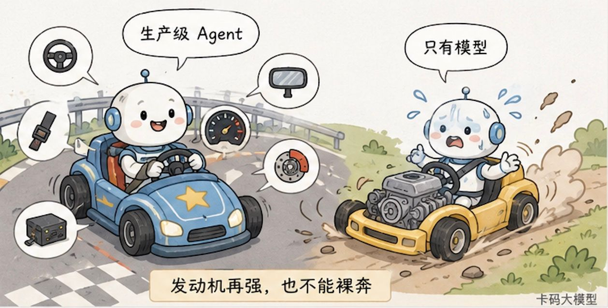
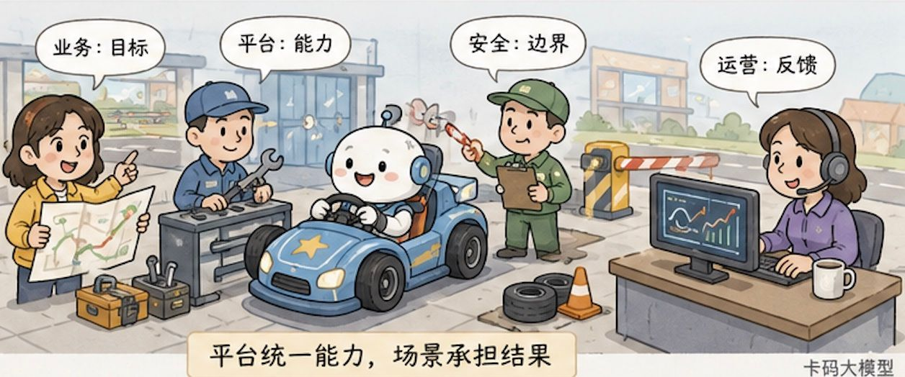
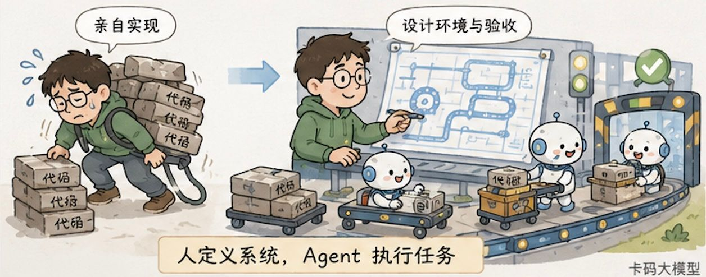

# Панорама продакшн-агентів: архітектура системи, інженерія harness, співпраця в організації та потрібні компетенції

Дедалі більше людей помічає, що співбесіди про агентів уже не обмежуються ReAct, Function Calling і MCP.

Інтерв'юери почали питати інакше:

**«Якби вам доручили продакшн-систему з агентами, як би ви її спроєктували?»**

Щойно звучить це питання, той, хто вивчив лише цикл агента, застрягає.

Бо в демо агент простий: під'єднали модель, повісили кілька інструментів, модель вирішує наступний крок — один прогін, і виглядає розумно.

У продакшні все геть інакше.

Інструменти відвалюються за таймаутом, дані конфліктують, користувач каже половину й половину приховує, модель обирає хибний шлях, довга задача обривається, ризикована операція виходить за межі прав, а оновлення версії може зламати те, що працювало.

І найгірше: агент не просто відповідає однією фразою — він діє безперервно. Помилка на одному кроці може зіпсувати наступні десять.

Раніше ми окремо розбирали [базові принципи агентів](./agent_interview.md), [керування циклом агента](./loop_engineering_interview.md), [що таке Harness Engineering](./harness_interview.md), [як будувати Multi-Agent Harness](./multi_agent_harness_interview.md) і [спостережуваність агентів](./agent_harness_observability_interview.md).

Ті статті — про деталі.

Ця збирає деталі докупи й відповідає на більше питання:

**що саме має змінитися в технічній архітектурі, harness, організації та людях, щоб агент пройшов шлях від «можна показати» до «можна довірити реальним користувачам»?**

Висновок наперед:

**продакшн-агент = спроможність моделі × архітектура системи × інженерія harness × механізми роботи організації.**

Це множення, а не додавання. Щойно будь-який множник наближається до нуля, до нуля наближається й результат.

## 1. Продакшн-рівень — це не «одного разу спрацювало»

Класичне програмне забезпечення теж помиляється, але шлях виконання в ньому здебільшого прописала людина наперед.

За того самого входу й того самого стану воно зазвичай піде тією самою гілкою.

З агентом не так.

Він динамічно визначає наступний крок за контекстом, обирає різні інструменти, генерує різні параметри й може змінити план за проміжним результатом.

Це дає агентові гнучкість, але й перетворює продакшн-питання з «чи є баг у цьому ендпоїнті» на «чи можна довіряти всій траєкторії дій».

Скажімо, агент повернення коштів наприкінці відповідає:

«Повернення коштів для вас оброблено».

Ця фраза не означає, що задачу справді виконано.

Треба ще піти в платіжну систему й перевірити, чи існує документ повернення, чи правильна сума, чи синхронізовано статус замовлення, чи не виконалося все двічі й чи повний запис в аудиті.

**Результат агента не може оголошувати сам агент — його має підтвердити зовнішнє середовище.**

Тож продакшн-рівень означає щонайменше п'ять порогів.

| Поріг | На що насправді треба відповісти |
|---|---|
| Результат задачі | Чи справді досягнуто бізнес-мети, а не просто згенеровано текст, схожий на успіх? |
| Стабільність | Чи прийнятний результат за розмитого вводу, збою інструментів і довгого ланцюжка? |
| Безпека | Які дані він бачить, які інструменти може викликати, які дії потребують схвалення людини? |
| Придатність до експлуатації | Чи витримаємо ми довго затримку, токени, вартість, паралельність і частку передавань людині? |
| Здатність поліпшуватися | Чи можна локалізувати й відтворити збій, а потім увести його в наступний цикл оцінювання та виправлення? |

З цих п'яти порогів модель прямо визначає лише частину.

Уся решта роботи відбувається поза моделлю.

Саме тому багато команд змінюють модель на сильнішу, оцінки в демо зростають, а продакшн-проблеми нікуди не діваються.

**Спроможність моделі визначає стелю, а системна інженерія — чи зможете ви стабільно її досягати.**

## 2. Погляд згори: продакшн-агент не є одним сервісом моделі

Якщо інтерв'юер попросить намалювати архітектуру продакшн-агента, найгірша відповідь — намалювати велику модель, ліворуч користувача, праворуч інструменти.

Це мінімальний цикл агента, а не продакшн-архітектура.

Справжній запит проходить щонайменше кілька шарів.

### Шар 1: вхід бізнесу й класифікація ризику

Користувач ініціює задачу з вебу, застосунку, системи підтримки чи внутрішнього тікета.

Система спершу робить автентифікацію, ізоляцію тенанта, перевірку безпеки вводу й класифікацію ризику.

«Подивись моє замовлення» і «скасуй моє замовлення з поверненням коштів» не можуть іти через ті самі права.

Запит — операція лише для читання, а повернення коштів змінює реальний стан бізнесу. Якщо сума більша, може знадобитися й погодження людиною.

**Продакшн-система не дає моделі спершу поімпровізувати, а потім дивиться, чи не небезпечно вийшло. Межі ризику мають існувати до виконання.**

### Шар 2: Agent Harness

Harness приймає мету користувача й організовує, як агент працюватиме цього разу.

Він збирає контекст, обирає модель, відкриває інструменти, веде стан, обробляє повтори, контролює бюджет, задає умови зупинки й у ключових точках просить підтвердження людини.

Модель може запропонувати план, але чи виконувати його, вирішує harness.

Модель може попросити викликати інструмент, але не може обійти систему прав і торкнутися продакшн-бази.

Модель може сказати, що задачу виконано, але harness ще викличе валідатор і перевірить справжній результат.

### Шар 3: модель, контекст, стан і пам'ять

Модель відповідає за розуміння, міркування й рішення.

Контекст повідомляє моделі поточну мету, наявні докази, доступні інструменти й обмеження поведінки.

Стан фіксує, на якому кроці зараз задача.

Пам'ять зберігає те, що справді варто перевикористовувати між задачами.

Ці чотири речі не можна змішувати.

Історія чату не є станом задачі, документи RAG не є довгостроковою пам'яттю, а контекстне вікно моделі тим паче не є надійною базою даних.

Якщо довга задача тримається лише на дедалі довшій історії діалогу, то після стиснення контексту, перезапуску процесу чи зміни моделі вона може втратити пам'ять.

### Шар 4: інструменти, бізнес-системи й середовище виконання

Реальну бізнес-цінність агент створює діями.

Дії можуть відбуватися в системі замовлень, базі даних, браузері, репозиторії коду, хмарній платформі чи в ізольованій пісочниці.

Шар інструментів відповідає не лише за формат Function Calling, а й за:

- виявлення інструментів і керування версіями;
- перевірку параметрів і структуру відповіді;
- передавання ідентичності й мінімальні права;
- таймаути, повтори, ідемпотентність і компенсації;
- знеособлення чутливих даних;
- погодження ризикованих дій;
- журнали викликів і докази для аудиту.

Інструменти — це не набір описів API для моделі.

**Інструменти є межею спроможностей агента, а водночас і межею радіуса ураження в разі інциденту.**

### Шар 5: перевірка, спостережуваність і передавання людині

Після виконання результат має перевірити незалежний валідатор.

Під час роботи треба записувати повне трасування: версію моделі, версію промпта, джерела контексту, параметри інструментів, їхні відповіді, зміни стану, токени, затримку, повтори й кінцевий результат.

Коли агент кілька разів поспіль зазнає невдачі, вичерпує бюджет, не має достатньої впевненості або запускає ризиковану дію, система має спинитися й передати роботу людині.

Human in the Loop — це не кнопка «покликати оператора» на сторінці.

Тут треба чітко визначити щонайменше три речі:

1. у яких випадках людину кличуть обов'язково;
2. які докази людина бачить, підхоплюючи роботу;
3. звідки агент продовжує після того, як людина закінчила.

## 3. Інженерія harness: перетворити «сподіваємося, модель зробить» на «система гарантує»

Слово harness легко звести до порожнього.

Дехто зве harness системний промпт, дехто — LangChain чи Agents SDK, а дехто — усю платформу агентів.

Щоб на співбесіді не заплутатися, межу можна провести так:

**Agent Harness — це каркас виконання, який оточує модель, рухає цикл агента, з'єднує стан з інструментами, обмежує виконання й збирає результати.**

Фреймворк — це бібліотека, якою ви, можливо, скористаєтеся, розробляючи harness.

Платформа — інфраструктура, що дозволяє однаково розгортати, керувати й експлуатувати кілька harness.

Вони пов'язані, але це не те саме.

Anthropic у статті про оцінювання агентів наголошує: оцінюють насправді комбінацію моделі й harness. OpenAI у практиці Codex теж помітила, що коли в агента щось не виходить, проблема зазвичай не в тому, що модель не вміє, а в тому, що середовище для агента невидиме, обмеження невиконувані, а результат неперевірюваний.

Тож суть Harness Engineering не в тому, щоб «дописати ще один шар клею», а в тому, щоб зробити шість перетворень.

### 3.1. Перетворити розмиту мету на задачу з прийманням

«Оптимізуй нам досвід підтримки клієнтів» — це не задача.

Агент не знає ні що змінювати, ні коли вважати справу завершеною.

Мету треба перетворити на чіткий вхід, обсяг, обмеження, продукт і критерії приймання.

Наприклад: проаналізувати тікети з однією зіркою за останні сім днів, виділити три найчастіші типи проблем, для кожного навести щонайменше п'ять реальних тікетів як докази, запропонувати покращення — але не змінювати продакшн-скрипти підтримки безпосередньо.

Що самостійніший агент, то менше в специфікації задачі має бути розмитості.

### 3.2. Перетворити неявні знання на контекст, який можна знайти

Бізнес-правила живуть у головах працівників, архітектурні рішення — у чатах, історичні інциденти — у якомусь документі, про який ніхто не знає.

Для агента цих знань не існує.

Продакшн-команда має покласти стабільні правила у версійовані документи, схеми, базу знань і описи інструментів — і підвантажувати їх динамічно за задачею.

А не запихати всі матеріали в контекст одразу.

**Мета інженерії контексту — не дати більше, а дати правильні докази в правильний момент.**

### 3.3. Перетворити усні нагадування на здійсненні обмеження

«Не перевищуй повноважень», «не забудь прогнати тести», «не роби повернення двічі» не можна писати лише в промпт і сподіватися на слухняність моделі.

Те, що можна зашити жорстко, треба зашити:

- права — в IAM;
- діапазони параметрів — у схему;
- повторне виконання — у ключ ідемпотентності;
- архітектурні межі — у лінтер;
- поріг релізу — у CI;
- ризиковані дії — у процес погодження;
- ліміт бюджету — у harness.

Промпт каже моделі, як треба робити, а система гарантує, що інакше вона не зможе.

### 3.4. Перетворити кінцеву відповідь на перевірюваний результат

Перевірка не може зводитися до того, щоб той самий агент сам себе спитав: «а я все правильно зробив?»

Що можна перевірити детермінованою програмою — перевіряємо програмою.

Для задач із кодом — тести, для задач із даними — запит до бази, для файлових — порівняння артефактів, для процесних — перевірка машини станів, а для текстових додаємо правила, оцінювання моделлю й вибіркову перевірку людиною.

Що ближче до реального стану бізнесу, то менше можна покладатися на відповідь природною мовою.

### 3.5. Перетворити випадковий збій на відтворюваний зразок

Без трасування продакшн-збій лишається здогадом.

Ви маєте знати, яку модель було використано, який контекст зібрано, який інструмент викликано, з якими параметрами, що він повернув і в якому стані все було перед збоєм.

А потім відтворити цю траєкторію в ізольованому середовищі.

Якщо збій не відтворюється, неможливо ані зрозуміти, чи допомогло виправлення, ані запобігти регресії.

### 3.6. Перетворити одноразове виправлення на довгострокову спроможність

Виправити продакшн-проблему не означає вручну підправити результат і забути.

Далі треба питати:

- чи не бракує перевірки якогось параметра інструмента?
- чи не використано в контексті застарілі знання?
- чи не варто додати вузол погодження?
- чи не надто м'які умови зупинки?
- чи не бракує в наборі для оцінювання саме такого граничного випадку?

Виправлення зрештою має потрапити в правила, інструменти, тести, набір для оцінювання або політику виконання.

**Коли кожен збій робить harness трохи міцнішим, це і є інженерний складний відсоток.**

## 4. У продакшн-архітектурі детермінованість і самостійність мають співіснувати

Багато хто, почувши про агентів, одразу прагне «повної автоматики».

Це одна з найнебезпечніших хиб у продакшн-упровадженні.

Цінність агента в динамічних рішеннях, але продакшн-система не може віддати динамічним рішенням усе.

Найстабільніша структура зазвичай така:

**детермінований workflow зовні плюс агент з обмеженою самостійністю всередині.**

Workflow керує життєвим циклом, правами, бюджетом, погодженнями, відкатами й фінальною поставкою.

Агент обирає шлях лише в тому локальному просторі, де справді потрібне судження.

Скажімо, агент опрацювання страхових вимог може читати неструктуровані матеріали, визначати, яких доказів бракує, і вирішувати, до якої системи звернутися далі.

Але він не може сам змінити ліміт виплати, не може обійти погодження й не може потай позначити задачу успішною за браку доказів.

### 4.1. Спершу один агент, кілька — потім

Інша поширена хиба продакшн-архітектури — одразу намалювати півтора десятка агентів.

Агент планування, пошуку, написання, рев'ю, пам'яті, а зверху ще й головний.

Виглядає солідно, а насправді кожен виділений агент додає ініціалізацію контексту, мережевий виклик, точку синхронізації стану й ще один спосіб зламатися.

Ділити на кількох агентів вигідно лише в таких випадках:

- підзадачі потребують помітно різних інструментів і прав;
- підзадачі справді можуть виконуватися паралельно й це перекриває накладні витрати;
- потрібна ізоляція контексту, щоб задачі не забруднювали одна одну;
- потрібен незалежний погляд для змагального рев'ю;
- контекст і зона відповідальності одного агента вже некеровані.

В інших випадках спершу беремо одного агента з чіткими інструментами, а ключовий шлях фіксуємо workflow.

### 4.2. Стан треба виносити назовні, щоб задачу можна було відновити

Довга задача не може ставити все на одне контекстне вікно.

Продакшн-система має розрізняти щонайменше:

- **Session**: що відбувалося в цій сесії;
- **Task State**: на якому кроці зараз задача;
- **Memory**: стабільний досвід для перевикористання між задачами;
- **Artifact**: уже створені плани, файли, звіти й код;
- **Trace**: що система фактично виконала.

В архітектурі Managed Agents Anthropic розділяє персистентну сесію, harness, який веде цикл, і пісочницю, де відбуваються обчислення. Ідея важлива: **контекст моделі можна стискати й замінювати, а от факти про задачу мають надійно зберігатися назовні.**

### 4.3. Права мають іти за дією, а не за назвою агента

«Це агент підтримки, тож дамо йому права в системі підтримки» — надто грубо.

Той самий агент підтримки може і дивитися замовлення, і змінювати адресу, і повертати кошти, і видавати купони.

Права треба визначати динамічно: за інструментом, параметрами, обсягом ресурсу, рівнем ризику й поточною ідентичністю користувача.

Для ризикованих операцій — короткочасні облікові дані, мінімальні права й чітке погодження.

Тоді навіть якщо модель піддалася ін'єкції в промпт або її планування зсунулося, вона не перетне системної межі.

## 5. Оцінювання й спостережуваність: дивіться не лише на відповідь, а й на траєкторію та результат

У звичайного чат-бота можна вибірково дивитися, чи добрі відповіді.

Для агента цього замало.

Агент може дати правильну відповідь, пройшовши небезпечним шляхом; а може сказати, що не впорався, хоча вже спричинив побічні ефекти.

Тож продакшн-оцінювання має чотири рівні.

| Рівень оцінювання | На що дивимося | Приклади |
|---|---|---|
| Компоненти | Чи нормально працюють окрема модель, інструмент, пошуковик | Частка правильного вибору інструмента, точність параметрів, повнота пошуку |
| Траєкторія | Чи розумні, безпечні й ефективні проміжні кроки | Повторні виклики, марні кроки, спроби перевищити права, шляхи відновлення |
| Результат | Чи справді виконано задачу в зовнішньому середовищі | Стан бази, створені файли, результати тестів, бізнес-статус |
| Система | Чи варта вона тривалої роботи загалом | Успішність, частка правильних відмов, затримка, вартість, частка передавань людині |

Тут є особливо важлива метрика: **частка правильних відмов.**

Спитати, коли бракує інформації; відмовитися виконувати, коли бракує прав; спинитися й покликати людину, коли впав інструмент, — усе це надійніше, ніж вигадати успішний результат.

Продакшн-система не вимагає, щоб агент завжди досягав успіху.

Вона вимагає, щоб успіх був справжнім, а невдача — правильною.

І трасування в продакшні потрібне не для гарної панелі на екрані.

Трасування має підтримувати три речі:

1. швидко визначити, на якому шарі виникла проблема;
2. відтворити невдалу задачу у фіксованому середовищі;
3. додати невдалий зразок у регресійне оцінювання.

Лише коли ці три кроки працюють, спостережуваність справді входить у цикл поліпшення harness.

## 6. Як змінюється організація: не можна створити один AI-відділ на всіх агентів

Дійшовши до архітектури, природно впираємося в організаційне питання.

Багато компаній спершу створюють групу AI-інновацій.

Бізнес-підрозділи кидають їй вимоги, а група під'єднує моделі, пише промпти й робить демо.

Спочатку швидко, а через пів року неодмінно затор.

Причини цілком конкретні:

- AI-група не знає неявних правил кожного бізнесу;
- бізнес-команди не знають, як саме ламаються агенти;
- платформа, безпека й експлуатація долучаються запізно;
- після інциденту незрозуміло, хто відповідає за дію;
- кожен проєкт наново будує інструменти, права, оцінювання й логування.

Продакшн-агентам більше пасує **співпраця трьох рівнів**.

### 6.1. Команда сценарію: відповідає за бізнес-результат

Складається з продакта, предметних експертів і прикладних інженерів.

Вона визначає обсяг задачі, бізнес-правила, семантику інструментів, критерії приймання й процедуру передавання людині.

Чи створив агент зрештою цінність, найкраще знає саме команда сценарію.

### 6.2. Команда платформи агентів: відповідає за спільні спроможності

Платформа дає шлюз моделей, середовище виконання harness, сесії, пісочниці, реєстр інструментів, ідентичність і права, трасування, фреймворк оцінювання й можливості релізу.

Вона не вирішує за бізнес, «чи обґрунтоване це повернення коштів», але має гарантувати, що інструмент повернення має контроль прав, ідемпотентність і аудит.

### 6.3. Безпека, комплаєнс і експлуатація: відповідають за межі й безперервну роботу

Безпека визначає межі даних, політики ідентичності й правила для ризикованих дій.

Комплаєнс підтверджує, які рішення обов'язково ухвалює людина.

Експлуатація й оцінювання ведуть класифікацію збоїв, продакшн-метрики й регресійні зразки.

Передавання між цими трьома рівнями не має зводитися до висновків наради: це мають бути версійовані активи — специфікації задач, схеми інструментів, політики прав, набори для оцінювання, трасування й записи інцидентів.

**Платформа уніфікує спроможності, сценарій відповідає за результат, безпека тримає межу.**

Це значно надійніше за «усі агенти належать AI-команді».

## 7. Як змінюються компетенції: дефіцитний не той, «хто найкраще пише промпти»

Багато хто, бачачи, як агенти сильнішають, побоюється, що розробницькі позиції зникнуть.

Позиції не зникають, але центр ваги роботи справді зміщується.

Раніше інженер здебільшого перекладав бізнес-логіку в код.

У добу агентів дедалі більше коду може згенерувати модель, а цінність людини зосереджується на чотирьох речах:

- чітко визначити розмиту мету;
- побудувати агентові середовище, у якому він може працювати;
- перетворити ризики на межі, яких машина не перетне;
- за доказами оцінити, чи справді все зроблено добре.

Це не означає, що інженери не потрібні.

Навпаки: від реалізації однієї функції інженер переходить до проєктування цілої продакшн-системи.

### 7.1. Прикладний інженер з агентів

Він стоїть між бізнесом і моделлю.

Йому потрібні декомпозиція задач, промпти, контекст, RAG, дизайн інструментів, керування станом, оцінювання й бізнес-метрики.

На співбесіді сказати «я зібрав агента на LangChain» геть недостатньо.

Інтерв'юер радше хоче почути: чому цьому сценарію потрібен агент, які кроки лишилися детермінованими, як відновлюватися після збою інструмента, як приймати результат і як визначено продакшн-метрики.

### 7.2. Платформний інженер з агентів

Він відповідає за шлюз моделей, середовище виконання агентів, сесії, пісочниці, планування, права, спостережуваність та інфраструктуру оцінювання.

Ця позиція схожа на перетин бекенду, інфраструктури, розподілених систем і безпеки.

Найважче тут не викликати модель, а зробити так, щоб довга задача відновлювалася, тенанти були ізольовані, інструменти керовані, різні моделі маршрутизувалися, а трасування відтворювалося.

### 7.3. Продакт з агентів і предметний експерт

Агентів не роблять самі лише технічні команди.

Предметний експерт має перетворити те, що «майстер знає на відчуття», на правила, приклади, межі й критерії приймання.

Продакт теж не може обмежитися фразою «зробімо розумного помічника»: він визначає межі самостійності, досвід у разі невдачі, передавання людині й відповідальність бізнесу.

### 7.4. Спроможності, потрібні всім

Байдуже, ближчі ви до застосунків, платформи чи продукту, — без кількох умінь надалі не обійтися:

1. **специфікація**: перетворити вимогу на задачу, яку агент може виконати, а система прийняти;
2. **контекст**: розуміти, яку інформацію давати моделі й коли;
3. **інструменти**: запакувати бізнес-дії в чіткі, безпечні й відновлювані інструменти;
4. **оцінювання**: за зразками, траєкторіями й бізнес-результатами визначати, чи допомогла зміна;
5. **системність**: розуміти стан, права, паралельність, вартість і відновлення після збоїв;
6. **предметність**: знати, де насправді винятки, ризики й цінність у бізнесі.

**По-справжньому дефіцитний не той, хто пише магічний промпт, а той, хто перетворює досвід організації на активи, які агент може прочитати, виконати й перевірити.**

## 8. У якому порядку компанії впроваджувати це з нуля

Якщо інтерв'юер спитає: «А як би ви впроваджували це з нуля?» —

не відповідайте «спершу оберемо модель, потім фреймворк, а наприкінці під'єднаємо MCP».

Правильний порядок починається з бізнес-ризику й перевірюваності.

### Етап 1: довести, що задача варта заходу

Насамперед беріть задачі, які:

- потребують обробки великих обсягів неструктурованої інформації;
- мають багато винятків, які важко покрити класичними правилами;
- дають результат, що чітко перевіряється;
- мають контрольовану ціну помилки;
- мають зрозумілий ручний процес як базову лінію.

Якщо фіксовані правила вже стабільно все розв'язують, не тягніть агента заради хайпу.

### Етап 2: зробити контрольований MVP

Спершу один агент або workflow з локальним агентом.

Інструменти переважно лише для читання, усі операції запису — з підтвердженням людини.

Побудуйте мінімальне трасування: щонайменше вхід, модель, виклики інструментів, результат, затримка й вартість.

Водночас зберіть партію реальних задач і складіть мінімальний набір для оцінювання.

Мета MVP — не повна автоматика, а зрозумілий розподіл збоїв.

### Етап 3: добудувати harness

Поступово переводьте часті збої в інженерні розв'язки:

- бракує контексту — покращуємо пошук і збирання;
- хибні параметри інструментів — додаємо схему й приклади;
- повторні виконання — додаємо ідемпотентність і машину станів;
- довга задача обривається — робимо персистентний стан і відновлення;
- легко перевищити права — звужуємо права інструментів і додаємо погодження;
- неможливо оцінити результат — додаємо валідатор і набір для оцінювання.

На цьому етапі приріст надійності зазвичай помітніший, ніж від сліпої зміни моделі.

### Етап 4: підвищувати самостійність щаблями

Самостійність — не перемикач, а драбина.

Її можна відкривати поступово за ризиком:

1. лише поради, без виконання;
2. автоматичні запити, операції запису підтверджує людина;
3. малоризикові операції запису автоматично, ризиковані з погодженням;
4. обмежена самостійність у межах бюджету, прав і обсягу задачі;
5. тривала робота, але з моніторингом, запобіжником і передаванням людині.

Кожен щабель має підтверджуватися даними оцінювання, а не словами керівника «а можна ще автоматичніше?».

### Етап 5: платформа — коли з'явилося кілька сценаріїв

Коли кілька команд починають знову й знову будувати під'єднання моделей, сесії, права інструментів, трасування й оцінювання, настає час абстрагувати платформу агентів.

Мета платформи — не універсальний агент, а спільна продакшн-основа для різних сценаріїв.

Відмінності бізнесу лишаються на рівні сценарію, спільні спроможності осідають на платформі.

## 9. Як відповідати на співбесіді на питання «як спроєктувати продакшн-агента»

Не починайте з переліку компонентів.

Раджу відповідати за п'ятьма кроками: мета, архітектура, harness, керування, організація.

Можна сказати прямо так:

**Продакшн-агент, як я його розумію, — це не модель із кількома інструментами, а бізнес-система, яку можна контролювати, спостерігати, відновлювати й оцінювати. Спершу я з'ясую, чи справді сценарію потрібен агент: те, що розв'язується фіксованим процесом, лишається workflow, а агентові віддаються лише невизначені рішення. В архітектурі детермінований зовнішній шар керує ідентичністю, правами, станом, бюджетом, погодженнями й поставкою, harness відповідає за збирання контексту, виклик моделі, маршрутизацію інструментів, відновлення після збоїв і умови зупинки, а модель ухвалює рішення лише в межах наданих повноважень. На рівні інструментів — мінімальні права, структуровані параметри, ідемпотентність і аудит, а ризиковані дії обов'язково проходять через людину. В оцінюванні дивимося і на кінцевий бізнес-результат, і на траєкторію виконання, вартість, затримку, відновлення після помилок і частку правильних відмов; продакшн-збої через трасування потрапляють у регресійне оцінювання й осідають у правилах, інструментах, тестах чи політиках прав. Організаційно команда сценарію відповідає за бізнес-результат, платформа дає спільне середовище виконання й механізми керування, а безпека й експлуатація — межі й безперервний зворотний зв'язок. Лише так агент перетворюється з разового демо на продакшн-спроможність, яку можна експлуатувати.**

Якщо інтерв'юер питатиме далі, розгортати можна в такі боки.

### Уточнення 1: коли модель стане сильнішою, harness іще буде потрібен?

Ще більше.

Сильніша модель краще міркує, планує й користується інструментами, але вона не дізнається сама про правила доступу у вашій компанії, бізнесові винятки, критерії приймання й історію інцидентів.

До того ж що більше модель здатна діяти, то більший вплив хибної дії — і то потрібніші ідентичність, права, перевірка й аудит.

### Уточнення 2: як довести, що агент досяг продакшн-рівня?

Самої офлайнової точності відповідей замало.

На реальних задачах треба виміряти частку виконаних задач, частку правильних відмов, якість викликів інструментів, відновлення після помилок, порушення безпеки, вартість і затримку; а ще випускати поступово, щаблями відкривати права й постійно порівнювати продакшн-результати з ручною базовою лінією.

### Уточнення 3: чому не взяти одразу мультиагентну схему?

Кілька агентів додають вартості комунікації, контексту, стану й оцінювання.

Ділити варто лише тоді, коли є чітка фахова спеціалізація, потреба в ізоляції контексту, виграш від паралельності або потреба в незалежному рев'ю. Якщо один агент із детермінованим workflow розв'язує задачу, лишайтеся простими.

### Уточнення 4: якщо агент спричинив інцидент, хто винен?

Перекладати відповідальність на модель не можна.

Відповідальний за сценарій визначає бізнес-межі, платформа забезпечує механізми виконання, безпека визначає політики для ризикованих дій, власник інструмента відповідає за інтерфейс і права, а відповідальний за реліз вирішує, чи відкривати самостійність.

Кожна реальна дія має мати придатні до аудиту ідентичність, версію політики й запис погодження.

## Наостанок

Продакшн-агента найлегше помилково сприйняти як технічне оновлення: узяти сильнішу модель, під'єднати MCP і зібрати мультиагентний фреймворк.

А впровадивши, ви побачите, що це радше спільне оновлення системної та організаційної інженерії.

Модель відповідає за думку.

Harness — за те, щоб вона діяла в межах.

Платформа — за те, щоб цю спроможність можна було перевикористати.

Організація — за визначення мети, відповідальність за результат і опрацювання невдач.

**Модель визначає, чи може агент це зробити; harness — чи робитиме він це стабільно; організація — чи можна цю спроможність відтворити.**

## Джерела

1. OpenAI: A practical guide to building agents — https://openai.com/business/guides-and-resources/a-practical-guide-to-building-ai-agents/
2. OpenAI: Harness engineering, leveraging Codex in an agent-first world — https://openai.com/index/harness-engineering/
3. OpenAI: Unlocking the Codex harness — https://openai.com/index/unlocking-the-codex-harness/
4. Anthropic: Building effective agents — https://www.anthropic.com/engineering/building-effective-agents
5. Anthropic: Demystifying evals for AI agents — https://www.anthropic.com/engineering/demystifying-evals-for-ai-agents
6. Anthropic: Scaling Managed Agents — https://www.anthropic.com/engineering/managed-agents
7. Google Cloud: Agentic AI enterprise systems architecture — https://docs.cloud.google.com/architecture/agenticai-orchestrate-access-disparate-systems
