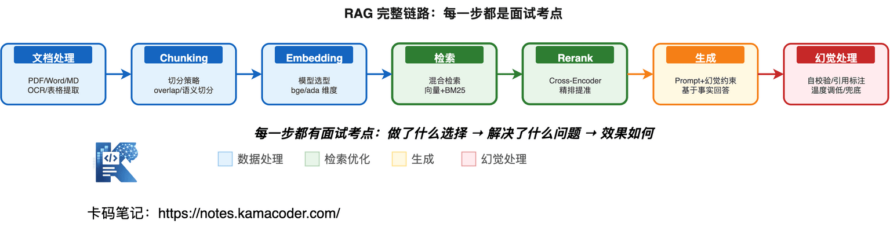
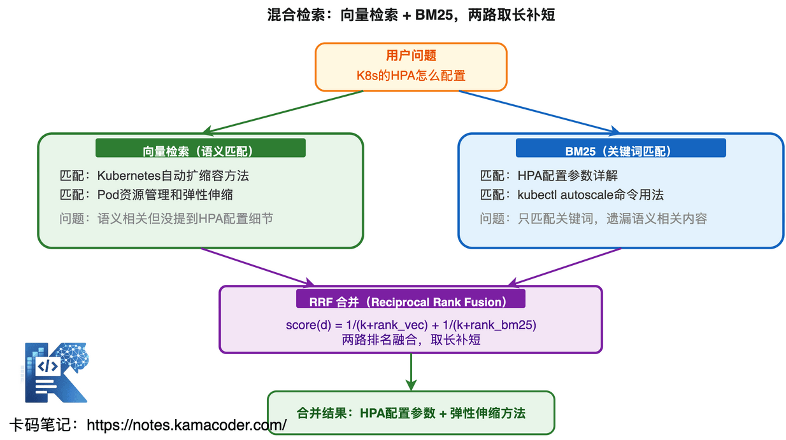

# Збірка питань про RAG: векторний пошук, гібридний пошук, rerank, робота з галюцинаціями

Найчастіше згадувана зміна на співбесідах цього року: **RAG став обов'язковою темою**.

Хоч на яку позицію ви йдете — розробка застосунків із великими моделями, LLM-інженерія чи AI-бекенд — інтерв'юер спитає: «Ви робили RAG? Як проєктували стратегію пошуку?»

Але розуміння RAG у багатьох спиняється на «я прогнав пайплайн через LangChain». Щойно інтерв'юер копає глибше, це стає очевидним.

**Чим векторний пошук відрізняється від пошуку за ключовими словами? Чому гібридний кращий за чистий векторний? Яку задачу розв'язує rerank? Як різати чанки, щоб не втратити інформацію? Що робити з галюцинаціями?** Не розібравшись у цьому, ви розсипаєтеся на другому уточненні.

Розберімо співбесіду з RAG від основ до просунутих тем.

## Зміст

1. [Що таке RAG і навіщо він потрібен](#1-що-таке-rag-і-навіщо-він-потрібен)
2. [Який повний ланцюжок RAG](#2-який-повний-ланцюжок-rag)
3. [Як влаштований векторний пошук](#3-як-влаштований-векторний-пошук)
4. [Яку векторну базу обрати: Milvus, FAISS чи Qdrant](#4-яку-векторну-базу-обрати-milvus-faiss-чи-qdrant)
5. [Які проблеми має чистий векторний пошук і навіщо гібридний](#5-які-проблеми-має-чистий-векторний-пошук-і-навіщо-гібридний)
6. [Що таке rerank і навіщо переранжувати після пошуку](#6-що-таке-rerank-і-навіщо-переранжувати-після-пошуку)
7. [Як різати чанки і чим погані завеликі й замалі](#7-як-різати-чанки-і-чим-погані-завеликі-й-замалі)
8. [Як обирати модель embedding і що брати для української](#8-як-обирати-модель-embedding-і-що-брати-для-української)
9. [Як боротися з галюцинаціями в RAG](#9-як-боротися-з-галюцинаціями-в-rag)
10. [Як оптимізувати поганий пошук у RAG](#10-як-оптимізувати-поганий-пошук-у-rag)
11. [Що таке Agentic RAG і чим він відрізняється від звичайного](#11-що-таке-agentic-rag-і-чим-він-відрізняється-від-звичайного)
12. [Часті уточнення на співбесідах](#12-часті-уточнення-на-співбесідах)

## 1. Що таке RAG і навіщо він потрібен

Інтерв'юер зазвичай питає: «Чому б не дати моделі відповісти напряму — навіщо обов'язково RAG?» або «Як ви розв'язуєте проблему обмеженої дати знань моделі?»

### Три вади знань великої моделі

**1. Обмежена дата знань** — у тренувальних даних є дата відсікання, і про вчорашні події модель не знає. Спитайте про можливості фреймворку, випущеного в березні 2026-го, — вона або вигадає, або скаже, що не знає.

**2. Приватні дані недосяжні** — внутрішні документи компанії, дані клієнтів, бізнес-правила модель ніколи не бачила, тож пряме питання дає вигадку.

**3. Схильність до галюцинацій** — коли модель не певна, але хоче відповісти, вона вигадує правдоподібну, але геть хибну інформацію. Без зовнішньої перевірки знань це особливо гостро.

### Основна ідея RAG

Суть RAG (Retrieval-Augmented Generation, генерація з доповненням пошуком) в одному реченні: **перш ніж модель складе відповідь, знайти дотичну інформацію у зовнішній базі знань і покласти знайдене в промпт, щоб модель відповідала на основі фактів.**

Без RAG: питання користувача → модель → відповідь (можлива галюцинація).

З RAG: питання користувача → пошук дотичних знань → [питання + знайдене] → модель → відповідь (на основі фактів).

**Ключова теза для співбесіди**: RAG не заміняє модель, а додає їй зовнішніх знань. Модель відповідає за розуміння й генерацію, RAG — за фактичну опору.

## 2. Який повний ланцюжок RAG

Інтерв'юер спитає: «Ви кажете, що робили RAG-проєкт: розкажіть повний шлях від питання користувача до фінальної відповіді».

Це найбазовіше, але багато хто не може пояснити чітко.

### Сім кроків ланцюжка RAG



**Запит → обробка документів → нарізання на чанки → embedding → пошук → rerank → генерація**

Що робиться на кожному кроці:

| Крок | Що робиться | Ключові рішення |
|------|--------|----------|
| Обробка документів | Парсинг PDF/Word/Markdown, витягання тексту | Як обробляти таблиці в PDF? Чи потрібен OCR? |
| Нарізання на чанки | Поділ довгих документів на невеликі блоки | Якого розміру? Скільки перекриття? Різати за змістом чи фіксованою довжиною? |
| Embedding | Перетворення текстових блоків на вектори | Яка модель? Яка розмірність? Яка мова? |
| Пошук | Відбір найдотичніших блоків за питанням | Чистий векторний чи гібридний? Яке Top-K? |
| Rerank | Переранжування знайденого | Яка модель rerank? Скільки брати після нього? |
| Генерація | Знайдене плюс питання віддаються моделі | Як написано промпт? Як обмежено галюцинації? |

**Як відповідати**: не переказуйте сім кроків — поясніть **ключові рішення** на кожному. Інтерв'юер хоче почути не «я взяв Milvus», а «чому Milvus, а не FAISS, які вимоги до затримки пошуку й чому Top-K дорівнює 5, а не 10».

---

## 3. Як влаштований векторний пошук

Інтерв'юер спитає: «Чим векторний пошук відрізняється від пошуку за ключовими словами?» і «Як працює embedding — чому вектори семантично схожих текстів близькі?»

### Суть векторного пошуку

Текст перетворюється на точку у високовимірному просторі, і семантично схожі тексти опиняються поруч. Пошук — це знаходження кількох векторів документів, найближчих до вектора питання.

Приклад:

```
"як оптимізувати запити до бази даних" → [0.12, -0.34, 0.56, ...]  ← ці вектори близькі
"методи тюнінгу продуктивності БД"     → [0.11, -0.32, 0.55, ...]
"сьогодні гарна погода"                → [-0.45, 0.78, -0.23, ...]  ← далеко від попередніх
```

### Обчислення подібності

Найуживаніша — **косинусна подібність**, тобто косинус кута між векторами:

```
cos(A, B) = (A · B) / (|A| × |B|)
```

Область значень [-1, 1], і що більше, то схожіше. 1 — напрямки збігаються, 0 — не пов'язані, −1 — протилежні.

**Чому не евклідова відстань?** Бо довжина вектора залежить від довжини тексту: у довгого тексту норма вектора більша, але семантично він не обов'язково дотичніший. Косинусна подібність дивиться лише на напрямок, тож для семантичного пошуку пасує краще.

### Наближений пошук найближчих сусідів (ANN)

Коли документів багато (від мільйона), рахувати подібність з кожним надто повільно. Ідея ANN така: **не шукати абсолютно найближчих, а знайти достатньо близьких, вигравши у швидкості.**

Основні алгоритми ANN:

| Алгоритм | Принцип | Особливості |
|------|------|------|
| HNSW | Багаторівневий граф-скіплист: згори грубий пошук, знизу точний | Швидкі запити, велике споживання пам'яті; за замовчуванням у Milvus |
| IVF | Спершу кластеризація, далі пошук лише в найближчих кластерах | Керована точність, пасує дуже великим обсягам |
| PQ (добуткове квантування) | Стиснення розмірності векторів, менше пам'яті | Економія пам'яті ціною точності |

**Бонус на співбесіді**: якщо ви назвете ключові параметри HNSW — `ef_construction` (ширина пошуку під час побудови графа: більше — якісніший граф, але повільніша побудова) і `M` (кількість сусідів у вузла: більше — щільніший граф і більше пам'яті), — інтерв'юер зрозуміє, що ви це справді налаштовували.

## 4. Яку векторну базу обрати: Milvus, FAISS чи Qdrant

Інтерв'юер спитає: «Яку векторну базу ви використали в проєкті? Чому саме її?»

### Порівняння трьох

| | FAISS | Milvus | Qdrant |
|---|-------|--------|--------|
| Тип | Бібліотека | База даних | База даних |
| Спосіб розгортання | Вбудовується в процес застосунку | Окремий сервіс, підтримує розподіленість | Окремий сервіс, легкий |
| Персистентність | Треба реалізовувати самому | Нативна | Нативна |
| Придатний масштаб | До мільйона | До мільярдів | До десятків мільйонів |
| Вартість експлуатації | Низька (без окремого сервісу) | Середня (потрібен кластер) | Низька (стартує з одного вузла) |
| Продакшн | Пасує для прототипів | Пасує для великого продакшну | Пасує для малого й середнього продакшну |

**Як відповідати**: спершу поясніть свій вибір, потім покажіть, що знаєте плюси й мінуси інших. Наприклад: «Ми взяли Milvus, бо в продакшні потрібні кілька реплік і персистентність, FAISS не підтримує розподіленості, а екосистема Qdrant на той час була ще незріла. Для демо я взяв би FAISS — це швидше».

---

## 5. Які проблеми має чистий векторний пошук і навіщо гібридний

Інтерв'юер спитає: «У вас чистий векторний пошук чи гібридний? Чому?» Це часта тема співбесід із RAG.

### Три фатальні проблеми чистого векторного пошуку

**1. Не працює точний збіг** — користувач шукає «RFC 7231», а векторний пошук може повернути «специфікація протоколу HTTP», де самого RFC 7231 не згадано. Бо він спирається на семантичну подібність, а не на точний збіг.

**2. Погано знаходить фахові терміни** — на питання «як налаштувати HPA в K8s» векторний пошук може знайти «автоматичне масштабування в Kubernetes», а документ із конкретними налаштуваннями HPA взагалі не підніметься. Векторні представлення фахового терміна й розмовного опису можуть бути далеко одне від одного.

**3. Губить власні назви** — назви продуктів, імена, абревіатури векторний пошук легко втрачає.

### Гібридний пошук = векторний + за ключовими словами

Гібридний пошук виконує дві гілки водночас:

- **векторний пошук**: ловить семантично дотичні документи («оптимізація бази даних» і «тюнінг SQL» зіставляться);
- **пошук за ключовими словами (BM25)**: ловить точні збіги («RFC 7231» знайдеться точно).

Результати обох гілок зливаються й доповнюють одне одного.



### Стратегія злиття: RRF (Reciprocal Rank Fusion)

Найуживаніший спосіб, і формула проста:

```
RRF_score(d) = Σ 1 / (k + rank_i(d))
```

`k` зазвичай дорівнює 60, а `rank_i(d)` — позиція документа d у i-й гілці пошуку. Що вища позиція, то більший внесок.

```python
def rrf_merge(vector_results, bm25_results, k=60):
    scores = {}
    for rank, doc in enumerate(vector_results):
        scores[doc.id] = scores.get(doc.id, 0) + 1 / (k + rank + 1)
    for rank, doc in enumerate(bm25_results):
        scores[doc.id] = scores.get(doc.id, 0) + 1 / (k + rank + 1)
    return sorted(scores.items(), key=lambda x: x[1], reverse=True)
```

**Ключова теза для співбесіди**: уміння пояснити три проблеми чистого векторного пошуку, те, як їх закриває гібридний, і що зливають через RRF. Саме цю глибину інтерв'юер і хоче почути.

---

## 6. Що таке rerank і навіщо переранжувати після пошуку

Інтерв'юер спитає: «Ви вже використали гібридний пошук — навіщо ще й rerank? Хіба результати недостатньо добрі?»

### Різниця між пошуком і rerank

**Пошук** — це грубий відсів: швидко дістати Top-20 із мільйона документів; швидко, але точність обмежена. Оцінка йде за векторною подібністю чи BM25, і вона **наближена**, тож не обов'язково відображає справжню релевантність.

**Rerank** — це точне впорядкування: для тих Top-20 релевантність перераховується точнішою моделлю (зазвичай cross-encoder), яка оцінює кожен документ окремо й виводить справді найдотичніші вперед.

### Чому оцінка під час пошуку недостатньо точна?

Векторний пошук працює на bi-encoder: питання й документ кодуються у вектори окремо, а потім рахується подібність. **Під час кодування питання й документ нічого не знають одне про одного**, тож можна оцінити лише «приблизну дотичність».

Rerank працює на cross-encoder: питання й документ подаються в модель разом, і вона бачить обидва, тож оцінює релевантність точніше. **Ціна — швидкість**: cross-encoder не можна порахувати заздалегідь, кожну пару «питання, документ» треба прогнати через модель, тож точно впорядкувати можна лише невелику кількість кандидатів.


### Що дає rerank

У реальних проєктах приріст помітний:

| Метрика | Після пошуку (без rerank) | Після rerank |
|------|---------------------|-----------|
| Повнота Top-5 | 71 % | 89 % |
| Точність Top-3 | 65 % | 84 % |

### Поширені моделі rerank

| Модель | Особливості |
|------|------|
| BGE-Reranker (bge-reranker-v2-m3) | Багатомовна, відкрита, безкоштовна |
| Cohere Rerank | Виклик через API, добрий результат, переважно англійська |
| mxbai-rerank / jina-reranker | Легкі багатомовні варіанти |

**Як відповідати**: «Пошук — це швидкий грубий відсів, rerank — точне впорядкування. Пошук на bi-encoder швидкий, але грубий; rerank на cross-encoder повільний, але точний. Спершу пошуком дістаємо Top-20 із мільйонів, потім rerank лишає Top-5 — це стандартний процес у продакшні».

---

## 7. Як різати чанки і чим погані завеликі й замалі

Інтерв'юер спитає: «Як ви спроєктували стратегію чанкінгу? Який розмір чанка й чому?»

За цим питанням інтерв'юер і визначає, чи ви «прогнали демо», чи справді робили RAG.

### Чим погані завеликі чанки

**Розмивання інформації** — у чанк напхано забагато, і дотична частина тоне серед нерелевантного, оцінка подібності падає, а позиція знижується.

### Чим погані замалі чанки

**Втрата контексту** — цілісний виклад розрізано на уламки, і знайдений фрагмент вирваний із контексту: модель не розуміє повного змісту, і якість генерації падає.

### Три основні стратегії чанкінгу

**1. Фіксована довжина** — найпростіше: щоразу по 512 токенів. Плюс — простота, мінус — ігнорує смислові межі й може розрізати речення навпіл.

**2. Рекурсивний поділ** — ріже за пріоритетом «абзац → речення → символ», намагаючись розрізати на природній межі. **Це найуживаніший підхід у продакшні.**

```python
from langchain.text_splitter import RecursiveCharacterTextSplitter

splitter = RecursiveCharacterTextSplitter(
    chunk_size=500,
    chunk_overlap=200,  # перекриття сусідніх чанків у 200 символів
    separators=["\n\n", "\n", ".", "!", "?", ";", ",", " ", ""]
)
```

**3. Семантичний поділ** — через embedding рахується семантична подібність сусідніх речень, і розріз робиться на смисловому розриві. Теоретично найкраще, але обчислень багато, тож у продакшні застосовують рідко.

### Навіщо перекриття

Сусідні чанки частково перекриваються, щоб ключова інформація не обірвалася точно на межі розрізу. Перекриття зазвичай становить 10–20 % від розміру чанка.

### Як обробляти різні типи документів

| Тип документа | Стратегія |
|----------|----------|
| Markdown | Різати за рівнями заголовків, зберігаючи ієрархію |
| PDF | Спершу розібрати таблиці й зображення, потім різати за абзацами |
| Код | Різати за функціями й класами, зберігаючи цілісні блоки |
| FAQ | Кожна пара «питання — відповідь» є окремим чанком, не розривати |

**Ключова теза для співбесіди**: уміння пояснити компроміс розміру чанка (великий → розмивання інформації, малий → втрата контексту) і роль перекриття. Найкраще навести власний досвід налаштування, наприклад: «зменшили chunk_size з 1000 до 500 — повнота зросла на 15 %».

---

## 8. Як обирати модель embedding і що брати для української

Інтерв'юер спитає: «Яку модель embedding ви використали? Чому саме її? Порівнювали з іншими?»

### Виміри вибору

Модель embedding обирають за трьома вимірами: **підтримка мови, розмірність вектора, якість пошуку (позиції в MTEB)**.

### Основні моделі для багатомовних і українських сценаріїв

| Модель | Розмірність | Особливості |
|------|------|------|
| bge-m3 | 1024 | Багатомовна, підтримує щільний, розріджений і багатовекторний пошук; відкрита, розгортається локально |
| multilingual-e5-large | 1024 | Багатомовна, добре зарекомендувала себе на слов'янських мовах, відкрита |
| text-embedding-3-large (OpenAI) | 3072 | Хороша якість, але платний API |
| text-embedding-3-small (OpenAI) | 1536 | Дешева, якості зазвичай достатньо |

> **Зауваження перекладача.** В оригіналі цей розділ радив моделі, заточені під китайську (як-от `bge-large-zh`). Для української такої однозначної рекомендації немає: україномовних позицій у MTEB мало, а результати сильно залежать від домену. Тому наведено багатомовні моделі, а **обов'язковим кроком є власний вимір на своїх даних**: зберіть 200–500 реальних запитів із розміченими правильними документами й порівняйте Recall@K і MRR для кількох моделей. Без такого виміру будь-яка рекомендація для української буде здогадом.

### Чи що більша розмірність, то краще?

Ні. Більша розмірність означає більшу виразність, але й дорожче зберігання та пошук. 1024 виміри зараз є найкращим співвідношенням ціни та якості; 3072 дають обмежений приріст якості пошуку, а зберігання зростає втричі.

**Як відповідати**: «Ми взяли багатомовну модель із локальним розгортанням, щоб не залежати від API, і перевірили її на власному наборі з розміченими запитами. Якщо потрібна англійська або затримка не критична, зручніше взяти embedding від OpenAI».

---

## 9. Як боротися з галюцинаціями в RAG

Інтерв'юер спитає: «RAG знайшов правильну інформацію, а модель однаково вигадала те, чого немає. Що робити?»

Галюцинації — найбільший інженерний виклик у RAG-проєктах, і про них питають завжди (по суті це каскадна проблема повноти пошуку й вірності генерації; глибший розбір — у статті [Де RAG найважче впровадити](./rag_hardest_parts_interview.md)).

### Два типи галюцинацій

**1. Внутрішні** — у знайденому є правильна інформація, але згенероване суперечить їй. Наприклад, у документі «точність 91 %», а модель каже «точність 95 %».

**2. Зовнішні** — модель згенерувала те, чого в знайденому взагалі немає. У пошуку було лише A, а модель дописала B.

### Шість стратегій проти галюцинацій

**1. Обмеження в промпті** — прямо вимагати «відповідай лише за знайденими матеріалами, не вигадуй того, чого в них немає».

**2. Самоперевірка виводу** — після генерації ще раз викликати модель і перевірити: чи кожне твердження має опору в знайденому? Те, що не має, позначається як неперевірене.

```python
VERIFICATION_PROMPT = """
Перевір, чи кожне твердження у відповіді має опору в довідкових матеріалах.
Для кожного твердження постав позначку: ✅ є опора / ❌ немає опори / ⚠️ часткова опора

Відповідь: {answer}
Довідкові матеріали: {context}
"""
```

**3. Посилання на джерела** — вимагати, щоб модель позначала джерело кожного твердження (номер чанка), і тоді це легко перевірити вручну.

**4. Знижена температура** — temperature 0,1–0,3 зменшує випадковість і схильність вигадувати.

**5. Звіряння відповіді зі знайденим** — після генерації порівняти відповідь із результатами пошуку за подібністю: якщо великий фрагмент відповіді не дотичний до жодного знайденого документа, це майже напевно галюцинація.

**6. Запобіжна відповідь** — коли подібність усіх знайдених документів нижча за поріг, прямо відповідати «дотичної інформації не знайдено», а не змушувати модель вигадувати.

**Ключова теза для співбесіди**: не кажіть просто «ми додали обмеження в промпт» — назвіть, скільки стратегій поєднали і який був результат. Наприклад: «обмеження в промпті плюс самоперевірка виводу плюс знижена температура — частка галюцинацій упала з 30 % до 12 %».

---

## 10. Як оптимізувати поганий пошук у RAG

Інтерв'юер спитає: «Яка точність пошуку у вашому RAG-проєкті? Що ви робили, коли результат був поганий?»

Це ключове питання про інженерний досвід. Єдиної відповіді немає, але логіку оптимізації треба викласти чітко.

### Логіка: шукати проблему на кожній ланці

**Етап обробки документів** — чи достатня точність витягання таблиць із PDF? Чи розпізнано текст на зображеннях? Що зроблено окремо для різних форматів?

**Етап чанкінгу** — чи адекватний chunk_size? Чи підбирали параметри під різні типи документів? Яке перекриття?

**Етап пошуку** — чистий векторний чи гібридний? Яке Top-K? Чи є rerank?

**Етап генерації** — як написано промпт? Як оброблено галюцинації?

### Чотири просунуті стратегії

**1. Переписування запиту** — питання користувача буває нечітким або надто коротким, тож спершу модель переписує його у форму, зручнішу для пошуку.

```
Початкове питання: як оптимізувати?
Після переписування: у RAG-системі низька точність векторного пошуку — які є методи оптимізації?
```

**2. Багатоканальний відбір** — те саме питання шукається кількома способами: за оригіналом, за переписаним, за виділеними ключовими словами, за розбитими підпитаннями, а результати зливаються.

**3. Схема parent-child** — шукаємо малими чанками (точне влучання), а повертаємо великі (збереження контексту). Технічно: малі чанки індексуються векторно, кожен пов'язаний із батьківським, і після влучання повертається повний вміст батьківського.

**4. Розширення контекстного вікна** — знайшовши чанк, додаємо сусідні до й після, щоб контекст був цілісним.

**Бонус на співбесіді**: назвіть стратегії, які ви справді застосовували, і кількісний ефект. Наприклад: «після додавання rerank повнота Top-5 зросла з 71 % до 89 %», «на фахових термінах гібридний пошук дав +25 % точності проти чистого векторного».

---

## 11. Що таке Agentic RAG і чим він відрізняється від звичайного

Інтерв'юер спитає: «Ви знайомі з Agentic RAG? Чим він відрізняється від звичайного RAG?»

### Обмеження звичайного RAG

Звичайний RAG має фіксований процес: питання → один пошук → генерація відповіді. Якщо перший пошук дав поганий результат, він себе не виправить і згенерує відповідь однаково. Наче людина, яка не вміє рефлексувати: помилилася — і тримається помилки до кінця.

### Agentic RAG: хай RAG сам вирішує, як шукати

Agentic RAG приносить у RAG здатність [агента](./agent_interview.md) планувати: модель сама визначає, які джерела даних потрібні, чи достатньо знайденого, а якщо ні — шукає під іншим кутом.

| | Звичайний RAG | Agentic RAG |
|---|---------|-------------|
| Кількість пошуків | Фіксовано один | Динамічно, вирішує модель |
| Стратегія пошуку | Фіксований пайплайн | Модель обирає сама |
| Якщо результат незадовільний | Одразу генерує | Змінює стратегію й шукає знову |
| Складні питання | Легко відповідає не про те | Може розбити на підпитання й шукати покроково |
| Витрата токенів | Низька | Висока (кілька проходів міркування) |


### Як працює Agentic RAG

```
питання користувача → агент планує: що саме треба знайти?
                    → перший пошук → результату замало?
                    → агент вирішує: змінити запит і шукати знову
                    → другий пошук → тепер достатньо?
                    → агент вирішує: достатньо, генерую відповідь
```

**Ключова теза для співбесіди**: Agentic RAG пасує складним сценаріям питань-відповідей (право, медицина, фінанси), а для простих вистачає звичайного RAG — не ускладнюйте без потреби. Уміння це розрізняти показує інженерну розсудливість.

Є ще клас питань, де важко і звичайному, і Agentic RAG: складні зв'язки між сутностями, багатокрокові висновки, узагальнення глобальних відношень. Тут треба перейти від векторного пошуку до графа знань — див. [збірку питань про GraphRAG і LightRAG](./graphrag_interview.md).

---

## 12. Часті уточнення на співбесідах

Нижче зведено реальні уточнення за напрямом RAG.

### Про стратегію пошуку

**Q: Як ви підбирали ваги в гібридному пошуку? Скільки припадає на векторний, а скільки на BM25?**

Два поширені підходи: перший — підбирати ваги вручну (вектор 0,7 + BM25 0,3), знаходячи найкраще співвідношення на валідаційному наборі; другий — зливати через RRF, без ваг, спираючись на позиції. У продакшні краще RRF, бо оптимальні ваги дуже різняться для різних запитів, і фіксовані не обов'язково хороші.

**Q: Яке ставити Top-K і чим погані завелике й замале?**

Замале (K=3): можна проґавити дотичні документи, повноти бракує. Завелике (K=20): забагато зайвого відволікає модель, зростають ризик галюцинацій і витрата токенів. Зазвичай K = 5–10 є добрим балансом, а з rerank можна спершу взяти K=20, а потім лишити Top-5.

**Q: Що робити, якщо питання користувача дуже розмите й пошук працює погано?**

Переписування запиту: модель перетворює розмите питання на конкретніший запит. Багатоканальний відбір: шукаємо одночасно за оригіналом, переписаним варіантом і ключовими словами, а потім зливаємо. Уточнювальне питання: якщо надто розмито, агент може спершу перепитати користувача.

### Про інженерне впровадження

**Q: Як оптимізувати наскрізну затримку RAG-системи?**

Оптимізація всього ланцюжка: розгортання inference на vLLM (менша затримка моделі), перевикористання KV-кешу (схожі питання не рахуються заново), потокова віддача (користувач не чекає повної генерації), стиснення промпта (менше токенів — менша затримка), налаштування індексу HNSW (затримка векторного пошуку нижче 50 мс).

**Q: Документи оновилися — як оновлювати векторний індекс?**

Три стратегії: повна перебудова (просто, але повільно; пасує для щоденного оновлення), інкрементне оновлення (перераховуємо embedding лише для змінених документів; пасує для оновлень у реальному часі), подвійний запис (нові документи пишуться і в старий, і в новий індекс, а перемикання відбувається без простою).

**Q: Як контролювати вартість токенів у RAG?**

Стиснення промпта: обрізати надлишковий вміст у знайденому. Керування контекстним вікном: лишати лише історію, дотичну до поточного питання. Маршрутизація між моделями: прості питання — малій моделі, складні — великій. Кешування: перевикористовувати результати пошуку для однакових і схожих питань.

### Про проєктування під сценарій

**Q: Спроєктуйте RAG-систему бази знань на 100 тисяч користувачів — як ви це зробите?**

Розгортаємо за п'ятьма рівнями: **рівень даних** (парсинг документів → чанкінг → embedding → подвійний запис у векторну базу й ES), **рівень пошуку** (гібридний пошук плюс rerank: Top-20 на пошуку, Top-5 після точного впорядкування), **рівень генерації** (розгортання на vLLM, шаблон промпта, обмеження проти галюцинацій), **інженерний рівень** (кеш гарячих запитів у Redis, асинхронне оновлення документів, моніторинг точності пошуку й частки галюцинацій), **рівень безпеки** (ізоляція прав на документи, захист від ін'єкцій у промпт, фільтрація чутливих даних).

---

## Часті питання (FAQ)

**Q: Що таке RAG і навіщо він потрібен?**

RAG (генерація з доповненням пошуком) перед тим, як велика модель складе відповідь, шукає дотичну інформацію у зовнішній базі знань і додає її в промпт, щоб модель відповідала на основі фактів. Це розв'язує три проблеми: обмежену дату знань моделі, недоступність приватних даних і схильність до галюцинацій.

**Q: Які проблеми має чистий векторний пошук і навіщо гібридний?**

Чистий векторний пошук спирається на семантичну подібність і погано знаходить точні збіги, фахові терміни та власні назви. Гібридний пошук паралельно виконує векторний і за ключовими словами (BM25), зливаючи результати через RRF, і саме він є мейнстримом у продакшні.

**Q: Що таке rerank і навіщо переранжувати після пошуку?**

Пошук на bi-encoder швидкий, але грубий: він оцінює лише приблизну дотичність. Rerank на cross-encoder подає питання й документ разом і точно оцінює релевантність, виводячи справді потрібне вперед. Стандартний процес: знайти Top-20, потім rerank і взяти Top-5.

**Q: Як боротися з галюцинаціями в RAG?**

Типова комбінація: обмеження в промпті відповідати лише за знайденим, самоперевірка виводу, посилання на джерела, знижена температура, звіряння відповіді з результатами пошуку, а за подібності нижче порога — відповідь «дотичної інформації не знайдено». Кілька стратегій разом працюють краще за одну.

**Q: Що обирати — RAG чи донавчання?**

RAG пасує, коли знання часто оновлюються й потрібна простежуваність джерел; донавчання — коли треба закріпити предметну спроможність або змінити стиль. Більшість застосунків починають із RAG, а донавчання розглядають за реальної потреби; їх можна й поєднувати.

## Наостанок

RAG уже є обов'язковою темою на співбесідах за напрямом великих моделей. Інтерв'юер не спитає просто «ви робили RAG?» — він питатиме «як спроєктовано стратегію пошуку», «чому гібридний кращий за чистий векторний», «яку задачу розв'язує rerank», «що робили з галюцинаціями». Завченими означеннями це не пройдеш.

Ця стаття зв'язує ключові теми співбесіди з RAG:

- **база**: що таке RAG, навіщо він, сім кроків повного ланцюжка;
- **пошук**: принципи векторного пошуку, гібридна стратегія, rerank, чанкінг, вибір embedding;
- **оптимізація**: шість стратегій проти галюцинацій, чотири прийоми покращення пошуку, Agentic RAG;
- **інженерія**: затримка, вартість, оновлення індексу, проєктування системи.

Ці теми не ізольовані — на співбесіді їх треба зв'язувати. На питання «як у вас зроблено RAG» не можна відповісти «взяли Milvus і LangChain»: розгорніть п'ять вимірів — стратегію пошуку, налаштування чанкінгу, гібридний пошук плюс rerank, роботу з галюцинаціями й оптимізацію затримки.

А ще інтерв'юери люблять питати про RAG і донавчання разом: «що брати для оновлення знань і коли донавчання виправдане». Розбір цього компромісу — у статті [SFT, RLHF, DPO: детальний розбір](./finetuning_sft_rlhf_interview.md).
