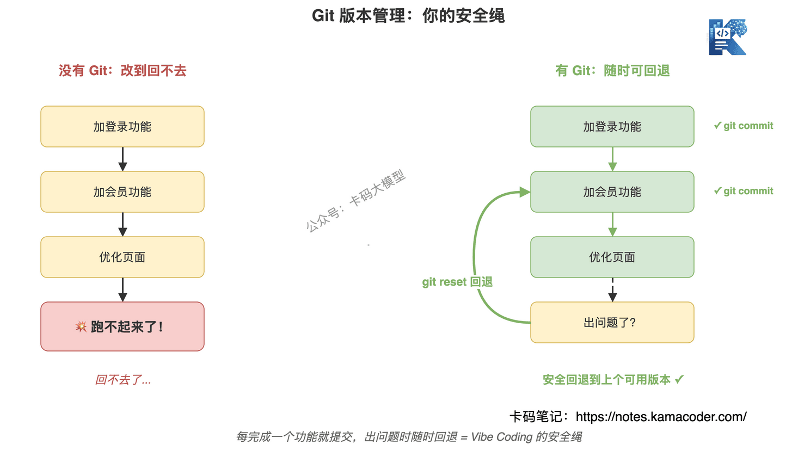
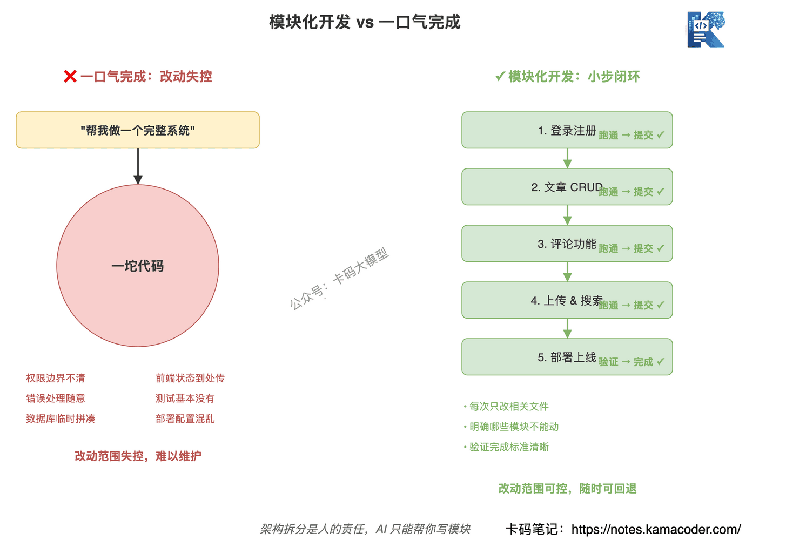

# Vibe Coding: як не наламати дров — коміти в Git, резервні копії бази, поділ на модулі й відкат у продакшні

Раніше ми розбирали [Vibe Coding](./vibe_coding_interview.md) і [три інструменти AI-посиленої розробки](./ai_enhanced_development_openspec_superpowers_gstack.md).

Ця стаття не про поняття, а про досвід, здобутий у реальній роботі з Vibe Coding.

Багато хто, зачувши про Vibe Coding, думає: «та що тут складного, просто даєш AI працювати».

Хто так думає, у того проєкт рано чи пізно перетвориться на кашу.

Час від часу в мережі ширяться історії про те, як хтось без програмістського досвіду написав застосунок «із відмінною якістю коду», ще й випустив його.

(Насправді за такими історіями майже завжди стоїть допомога фахівців.)

Людина в темі одразу бачить піар: без програмістського фундаменту Vibe Coding витягне хіба що маленьке демо, а трохи складніша функціональність та ще й реліз — це початок катастрофи.

Vibe Coding — це не «кинути вимогу AI й чекати результату». **Справжня складність Vibe Coding у тому, щоб знати, коли давати AI працювати, як саме давати й як відкотитися, якщо він зробив не те.**

AI пише код швидко, але швидко не означає інженерно якісно. Працює локально — не означає працює в продакшні. Код можна відновити — це не означає, що можна відновити дані.

Сьогодні — про місця, де найлегше наламати дров.

**Зміст:**

- 1. Не знаєте Git — не давайте AI масштабно правити код
- 2. Не тримайте базу даних разом із кодом
- 3. Про резервні копії думають не перед релізом
- 4. Не давайте AI зробити весь проєкт одним махом
- 5. Працює локально — не означає працює в продакшні
- 6. Операції з базою даних завжди вважайте ризикованими
- 7. Ставлячи задачу AI, пишіть, чого робити не можна
- 8. Спершу документація, потім розробка
- 9. Як розповісти про цей досвід на співбесіді
- 10. Наостанок

## 1. Не знаєте Git — не давайте AI масштабно правити код

Почнімо з найважливішого: **без комітів у Git не давайте AI масштабно правити проєкт.**

Багато хто працює з AI так:

«Додай логін».

«Тепер додай підписку».

«Тепер оптимізуй сторінку».

«А тепер упорядкуй структуру тек».

AI править далі й далі, файлів дедалі більше. Зрештою проєкт не запускається, ви хочете повернутися до «стану, коли все ще працювало» — і виявляєте, що повернутися нікуди.

Бо ви просто не комітили.

Тут AI вас не врятує: він може лише далі здогадуватися на основі вже поламаного коду.

Git — це не спосіб здаватися дорослим. Git — це страхувальна мотузка у вашій співпраці з AI.

Мінімум, який треба робити:

1. завершили маленьку функціональність — зробіть коміт;
2. перед кожною великою правкою від AI подивіться `git status`;
3. не накидайте нових вимог поверх купи незакомічених змін;
4. після правок від AI подивіться `git diff` — що саме він зачепив;
5. переконалися, що все гаразд, — комітьте.

**Без Git Vibe Coding — це не розробка, а гра в рулетку.**

AI зробив половину, напрямок виявився хибним — ви мусите мати змогу відкотитися. Не можете відкотитися — усі подальші рятувальні роботи ви тягтимете на собі.



## 2. Не тримайте базу даних разом із кодом

Друга пастка небезпечніша за код: резервні копії бази даних.

Багато невеликих проєктів заради зручності кладуть SQLite, завантажені файли, експорти й логи прямо в теку проєкту. Виглядає зручно, але щойно ви попросите AI впорядкувати теки, перезібрати проєкт чи розгорнути з перезаписом — стається інцидент.

Скажімо, ви просите AI:

«Прибери непотрібні файли».

«Переініціалізуй проєкт».

«Розгорни код на сервері».

AI може не знати, де код, а де справжні дані. Він сприйме `data/`, `db/`, `uploads/` як звичайні теки — і даних не стане.

Код можна дістати з Git. А дані дуже часто зникають назавжди.

Тож правила треба задати на самому початку проєкту:

1. у теці коду лежить лише код, шаблони конфігурації та скрипти міграцій;
2. база даних, завантажені файли й логи — в окремій теці даних;
3. `.gitignore` явно виключає справжні файли даних;
4. у репозиторії лише `.env.example`, справжній `.env` не комітимо;
5. тестові й продакшн-дані розділені.

**База даних не є частиною коду — база даних є продакшн-активом.**

Не можна дозволяти AI чіпати її так само легко, як компонент.


## 3. Про резервні копії думають не перед релізом

Багато хто розуміє резервні копії так: «перед релізом зробимо бекап».

Пізно.

Про резервні копії треба думати ще на етапі проєктування, бо вони впливають на структуру тек, спосіб розгортання, дизайн прав і процедуру відновлення.

Якщо ви з самого початку звалили код, базу й завантажені файли докупи, дописати резервне копіювання пізніше буде дуже незручно.

Проєктуючи, поставте три питання:

1. що не можна втратити?
2. звідки це відновлювати після втрати?
3. скільки триватиме відновлення?

Наприклад, таблиця користувачів, таблиця замовлень, записи про платежі, завантажені файли, конфігурація, бізнес-логи — для кожного потрібен план відновлення.

Відповідні інженерні дії теж готуються заздалегідь:

1. регулярні резервні копії бази;
2. ручна резервна копія перед ризикованою операцією;
3. у скриптів міграції має бути план відкату;
4. завантажені файли зберігаються окремо;
5. продакшн-конфігурація не перезаписується разом із кодом.

**Резервні копії роблять не тому, що ви боїтеся написати помилковий код, а тому, що визнаєте: у продакшні помилки неминучі.**

Досвідчений інженер відрізняється від новачка не тим, що не помиляється, а тим, що вміє повернутися після помилки.

## 4. Не давайте AI зробити весь проєкт одним махом

Новачки у Vibe Coding найбільше люблять фразу: «зроби мені повну систему».

З логіном, статтями, коментарями, адмінкою, завантаженням, пошуком і розгортанням.

AI видасть вам цілий проєкт: теки є, сторінки є, ендпоїнти є. Але в деталях зазвичай самі проблеми:

- межі прав доступу незрозумілі;
- обробка помилок в API довільна;
- схема бази зліплена нашвидкуруч;
- стан на фронтенді передається абияк;
- права в адмінці існують лише формально;
- тестів практично немає;
- конфігурація розгортання перемішана з локальною.

Ось звідки береться «каша».

Це не тому, що AI не вміє писати. Це тому, що ви змусили його ухвалювати надто багато рішень в одному велетенському контексті.

Правильно — малими замкненими кроками:

1. спершу реєстрація й вхід, працює — коміт;
2. потім CRUD для статей, працює — коміт;
3. потім коментарі, працює — коміт;
4. потім завантаження й пошук;
5. і наприкінці розгортання.

На кожному кроці кажіть AI:

1. які саме файли цього разу можна змінювати;
2. яких модулів не чіпати;
3. як перевірити завершення;
4. як відкотитися в разі невдачі.

**AI може написати вам модуль, але не може за вас зробити архітектурну декомпозицію.**

Декомпозиція — відповідальність людини.



## 5. Працює локально — не означає працює в продакшні

Наступна пастка — різниця між локальним і продакшн-середовищем.

Такі інциденти трапляються особливо часто. Локально шлях `./data/app.db`, а в продакшні — `/var/www/app/data/app.db`. Локально конфігурація читається з `.env`, а в продакшні може приходити зі змінних середовища. Локально процес запускаєте ви, а в продакшні — користувач `www-data` чи `app`.

Якщо AI бачить лише локальний проєкт, він за замовчуванням генеруватиме рішення за локальною логікою.

Наслідок: локально все гаразд, а після релізу все падає.

Тож, коли доходить до релізу, спершу опишіть AI відмінності середовищ:

| Складник | Локально | Продакшн |
|---|---|---|
| Тека коду | Корінь проєкту | `/var/www/xxx` |
| Тека даних | `./data` | Окремий змонтований розділ |
| Джерело конфігурації | `.env` | Змінні середовища або центр конфігурації |
| База даних | Локальний інстанс | Продакшн-база |
| Завантажені файли | Локальна тека | Окреме сховище |
| Користувач процесу | Поточний користувач | Окремий службовий користувач |
| Спосіб відкату | Відкат у Git | Відкат версії релізу + відновлення даних |

**Багато продакшн-інцидентів спричинені не помилкою в логіці коду, а хибним припущенням про середовище.**

Якщо середовище не описане, AI може лише вгадувати.


## 6. Операції з базою даних завжди вважайте ризикованими

Щойно AI збирається чіпати базу даних — спиніться.

Створення таблиць, видалення таблиць, зміна полів, імпорт і експорт, чищення даних, скрипти ініціалізації — усе це ризиковане.

Перед дією обов'язково поставте три питання:

1. чи є резервна копія?
2. чи можна відкотитися?
3. це тестова база чи продакшн?

Немає копії — не робимо. Не можна відкотитися — дуже обережно. Не розумієте, яке середовище, — виконувати категорично не можна.

Особливо не кажіть AI просто так: «скинь мені базу даних».

Ця фраза надто небезпечна.

Яку базу скинути? Які таблиці зберегти? Чи є копія? Це продакшн?

Якщо це не прописано, AI виконає буквально.

**Не давайте AI виконувати операції з базою напряму: хай спершу згенерує скрипт і опис ризиків, а людина підтвердить.**

## 7. Ставлячи задачу AI, пишіть, чого робити не можна

Багато хто пише лише мету:

«Полагодь проблему з логіном».

«Оптимізуй структуру проєкту».

«Розгорни в продакшн».

Цього мало. Треба писати ще й межі:

1. змінювати дозволено лише файли, пов'язані з логіном;
2. не змінювати структуру бази даних;
3. не видаляти завантажені файли;
4. не змінювати продакшн-конфігурацію;
5. не виконувати команди міграції — лише згенерувати скрипт мені на перевірку;
6. спершу дай план, і лише після мого підтвердження змінюй код.

За замовчуванням AI прагне виконати задачу. Якщо ви сказали просто «полагодь», він може заради цього розширити обсяг змін.

А в інженерній співпраці найгірше — саме неконтрольований обсяг змін.

**Даючи AI роботу, називайте не лише мету, а й межі.**

## 8. Спершу документація, потім розробка

Багато хто, розробляючи з AI, документації не пише взагалі.

Прийшла вимога — одразу просять AI правити код. Запрацювало — вважай, готово.

Попрацювавши так місяць, ви отримаєте чорну скриньку: ви й самі не знаєте, як реалізовано цю функціональність, а зі зміною AI-інструмента стане ще гірше.

**Правильний процес такий: спершу хай AI згенерує технічну документацію, ви її переглядаєте, і лише потім він пише код.**

Скажімо, ви додаєте платежі. Спершу хай AI напише технічний документ:

- процес оплати: користувач створює замовлення → ініціюється оплата → підтвердження колбеком → оновлення статусу замовлення;
- схема таблиць: таблиця замовлень, таблиця платіжних записів, опис полів;
- дизайн API: створити замовлення, ініціювати оплату, колбек оплати, запит стану замовлення;
- обробка помилок: таймаут, повторна оплата, звіряння суми;
- заходи безпеки: перевірка підпису, ідемпотентність, шифрування чутливих даних.

Коли документ готовий, прочитайте його. Чи логічний процес? Чи немає пасток у схемі таблиць? Чи достатні заходи безпеки?

Переконалися — хай AI реалізує за документом.

Після завершення функціональності хай AI оновить документ:

- фактична структура таблиць (могла трохи відрізнятися від задуму);
- фактичні шляхи й параметри API;
- відомі проблеми й що варто поліпшити;
- що врахувати під час розгортання.

**По суті, документація тут потрібна не стільки розробникам, скільки наступному AI, який візьметься за цей проєкт.**

Сьогодні ви розробляєте в Claude Code, завтра можете перейти на Cursor, післязавтра на Codex. Без документації щоразу доведеться заново розбиратися в проєкті. З документацією вартість переходу різко падає.

Ще важливіше те, що документація зберігає вам контроль над проєктом.

Не можна знати тільки, що «цю функціональність зробив AI»: треба знати, як вона зроблена, чому саме так і де в ній пастки.

Як це втілити:

1. створіть у корені теку `docs/` і розкладіть документи за модулями: `docs/auth.md`, `docs/payment.md`, `docs/upload.md`;
2. у `CLAUDE.md` пропишіть правила відповідності:
   ```
   ## Відповідність документів

   - Перед роботою над логіном спершу прочитай docs/auth.md
   - Перед роботою над платежами спершу прочитай docs/payment.md
   - Перед роботою над завантаженням спершу прочитай docs/upload.md
   ```
3. перед кожною новою функціональністю хай AI спершу доповнить відповідний документ, а ви його підтвердите;
4. після завершення хай AI синхронізує документ із фактичною реалізацією (вона може відрізнятися від задуму).

Що це дає:

- AI має чіткий план ще до написання коду й не пише навмання;
- ви перевіряєте спершу проєктні рішення, а потім код — контроль стає пошаровим;
- переходячи на інший AI-інструмент, новий інструмент просто читає документацію й одразу підхоплює роботу;
- у командній роботі документація є основою спільного розуміння;
- на співбесіді ви чітко пояснюєте задум кожного модуля.

**Vibe Coding — це не «хай AI шалено пише код», а «хай AI допоможе пройти інженерний процес до кінця».**

Проєкт без документації — розсадник технічного боргу.

## 9. Як розповісти про цей досвід на співбесіді

Якщо інтерв'юер спитає: «Як ви використовуєте Vibe Coding? На які граблі наступали?» —

не обмежуйтеся «я підвищив ефективність за допомогою AI».

Занадто поверхово.

Можна сказати так:

«Коли я тільки починав із Vibe Coding, виявилося, що головна проблема не в тому, що AI не може написати, а в тому, що бракує точок відновлення. AI за раз змінює забагато файлів, і без дрібних комітів у Git відкотитися потім дуже важко. Тому тепер я ділю задачі за модулями, кожна функціональність — окремий замкнений цикл: спершу AI дає план, потім я обмежую обсяг змін, а після правок дивлюся diff, перевіряю й комічу».

І додати:

«Друга пастка — межа між даними й кодом. У невеликому проєкті легко покласти SQLite, завантажені файли й конфігурацію в теку проєкту, і під час розгортання з перезаписом можна зачепити справжні дані. Тому я ізолюю теку коду від теки даних, у репозиторії тримаю лише шаблони конфігурації, а справжню базу й завантажені файли зберігаю окремо. Коли йдеться про операції з базою, спершу роблю копію й даю AI лише згенерувати скрипт, а не виконувати дії в продакшні».

Наостанок про реліз:

«Локальне рішення не дорівнює продакшн-рішенню. Шляхи, користувач процесу, джерело конфігурації, інстанс бази можуть відрізнятися, тож перед розгортанням я спершу перелічую відмінності середовищ, а вже потім прошу AI згенерувати рішення з їх урахуванням».

І про документацію:

«Ще один висновок — документація першою. Тепер перед новою функціональністю я прошу AI згенерувати технічний документ: процес, структуру таблиць, опис API, обробку помилок. Спершу перевіряю документ, а вже потім даю писати код. Після завершення прошу оновити документ фактичною реалізацією. Тоді, змінюючи AI-інструмент, новий просто читає документацію й підхоплює роботу, а не розбирає проєкт наново».

Така відповідь значно сильніша за «я вмію Cursor».

Бо вона показує інженерну розсудливість.

## 10. Наостанок

Vibe Coding можна й треба використовувати. Але не наосліп.

**Git — точка відновлення коду, резервна копія — точка відновлення даних, поділ на модулі — межа складності, звіряння середовищ — лінія безпеки релізу.**

Збудуєте це — і AI стане інструментом ефективності.

Не збудуєте — AI просто швидше перетворить проєкт на кашу.

Спершу застебніть страхувальну мотузку, а вже потім прискорюйтеся.
