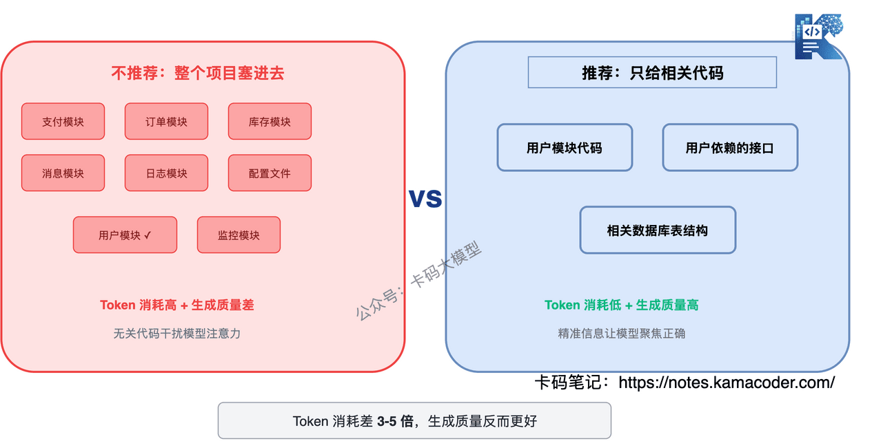

# Збірка питань про Vibe Coding: у чому ж ваша перевага в добу програмування з AI

Улюблене «питання на все життя» від інтерв'юерів: **у добу, коли Vibe Coding усюди, а базові моделі дедалі сильніші, у чому ваша перевага?**

Багато хто не знає, що відповісти.

Точніше, **старі підходи до відповіді вже не працюють**.

Чому?

Бо раніше казали: «AI не здолає складну бізнес-логіку», «AI не напише безпечного коду», «AI не впорається з паралельністю». Але, чесно кажучи, **у 2026 році AI пише все це цілком добре**.

Claude Code напише виклик мікросервісу з повноцінною обробкою винятків, Codex упорається зі складною машиною станів, Cursor змінить півтора десятка файлів за раз і не заплутається.

**Казати «AI цього не може» — означає, що інтерв'юер вважатиме вас відірваним від реальності.**

То в чому ж ваша перевага? Ця стаття відповідає на це питання наново й зосереджується на тому, що справді цікавить інтерв'юера: **як контролювати вартість токенів, як керувати кодом від AI і як оцінювати результат**.

---

## Зміст

1. Що таке Vibe Coding
2. AI дедалі сильніший — у чому ж ваша перевага
   - Перевага 1: уміння визначати задачу
   - Перевага 2: уміння будувати контекст
   - Перевага 3: уміння перевіряти результат
   - Перевага 4: уміння ухвалювати технічні рішення
   - Перевага 5: уміння контролювати вартість
   - Підсумок п'яти переваг
3. Як контролювати вартість токенів в інструментах програмування з AI
   - Стратегія 1: маршрутизація між моделями — яка робота якій моделі
   - Стратегія 2: керування контекстом — не запихайте всю кодову базу
   - Стратегія 3: оптимізація промптів — сказати одразу, а не переписувати
   - Стратегія 4: кешування й перевикористання
   - Стратегія 5: оцінка — які задачі виходять дорожчими з AI
   - Підсумок щодо вартості
4. Часті питання на співбесіді
   - Ситуативні
   - Про інженерне впровадження

---

## 1. Що таке Vibe Coding

Коли в лютому 2025 року Андрей Карпати запропонував цей термін, визначення було чітке: **не перевіряти, не розуміти й одразу приймати згенерований AI код**.

| Вимір | Vibe Coding | Розробка з AI-помічником |
|------|-------------|-------------|
| Генерація коду | AI | AI |
| Рев'ю коду | Не дивимося, одразу Accept | Порядкове рев'ю |
| Робота з помилками | Копіюємо AI | Аналізуємо першопричину й вирішуємо |
| Відповідальність за код | Немає | Повна |

Питаючи, чи практикуєте ви Vibe Coding, інтерв'юер насправді питає одне: **чи відповідаєте ви за код, який прийняли?**

На цьому визначенні довго спинятися не варто — головне у двох наступних питаннях.

---

## 2. AI дедалі сильніший — у чому ж ваша перевага

Спершу визнаймо факт: **AI зараз справді добре пише**.

Складна бізнес-логіка? Дайте достатньо контексту — і він напише код розрахунків за правилами вашої компанії.

Безпечний код? Скажіть, на що зважати, — і він додасть валідацію вводу й перевірку прав.

Виклики між модулями? Згодуйте документацію API — і він згенерує правильний ланцюжок викликів.

Оптимізація продуктивності? Попросіть звернути на це увагу — і він знайде проблему N+1 і витоки пам'яті.

Тож якщо ваша відповідь і далі «AI не може XX», інтерв'юер закриє її одним реченням: «а ви дали йому достатньо контексту?»

**То в чому ж перевага? Не в тому, «чого AI не може», а в тому, що «хай що робить AI, ви маєте спершу зробити правильно щось своє».**

### Перевага 1: уміння визначати задачу

AI розв'язує задачу, яку ви визначили, але **саме визначення задачі і є найскладнішою частиною**.

Продакт каже «додай повернення коштів» — це не вимога, це фраза. Справжнє визначення вимоги відповідає на питання:

- як обробляти часткове повернення?
- які правила взаємовиключення повернення й купонів?
- як забезпечити ідемпотентність кількох повернень?
- що робити, коли повернення протермінувалося?

Відповідей на це AI не знає, і продакт їх теж не проговорив. **Саме ви перетворюєте фразу на виконувану специфікацію — і лише тоді AI напише правильний код.**

І навпаки: якщо ви самі не додумали, код від AI теж буде розмитим — ви дали фразу, він дав щось «схоже на правду»: працює, але бізнес-логіка не витримує перевірки.

**Як сказати на співбесіді**: «AI дуже сильний, але йому потрібне точне визначення задачі. Моя перевага в тому, що я вмію розкласти розмиту вимогу на чітку технічну специфікацію: граничні умови, обробка винятків, бізнес-правила. AI не спитає про це сам, а без цього код неодмінно вийде неправильним».

### Перевага 2: уміння будувати контекст

**Якість виводу AI напряму залежить від якості контексту, який ви дали.**

Одна й та сама вимога, дві людини з AI:

- A просто каже «напиши ендпоїнт повернення коштів» → AI пише з уяви, і це майже напевно не відповідає вашому бізнесу;
- B дає повні бізнес-правила, структуру таблиць бази й документацію суміжних API → код від AI майже одразу придатний до використання.

У чому різниця? Не у спроможностях AI, а в **якості контексту, яким його нагодували**.

Уміння будувати контекст складається з:

- **знати, що давати**: яка інформація для AI обов'язкова, а яка є шумом;
- **знати, чого не давати**: запхати 100 тисяч рядків нерелевантного коду означає і змарнувати токени, і збити модель;
- **знати, як організувати**: спершу контекст, потім вимога — і навпаки: якість генерації буде геть різною.

Саме тому один і той самий інструмент у досвідченого й у новачка дає різницю вдесятеро. Інструмент той самий — вхід різний.

Про те, як науково будувати контекст, є стаття [Глибокий розбір Claude Code](./claude_code_deep_dive.md) — там окремо розглянуто стратегії керування контекстним вікном на 200 тис. токенів.

**Як сказати на співбесіді**: «Навіть із тим самим Claude Code якість результату в різних людей помітно різна. Різниця в побудові контексту: мій промпт містить повні бізнес-правила, релевантні фрагменти коду й граничні умови, а не одну фразу. Стелю AI визначає якість вашого вводу».

### Перевага 3: уміння перевіряти результат

**Код запустився ≠ код правильний.**

Згенерований AI код часто «виглядає правильно, працює, а семантика хибна». Наприклад:

- ендпоїнт повернення відповідає успіхом, але кошти йдуть не на той рахунок;
- перевірка прав пройдена, але використано не ту роль;
- дані оброблено, але втрачено два знаки після коми.

Такі баги тести не обов'язково зловлять, бо **тести написані за вашими очікуваннями, а ваші очікування можуть розходитися з вимогою бізнесу**.

Перевірка — це не «запустимо й подивимося, чи є помилка», а:

- **перевірка бізнес-семантики**: чи відповідає поведінка коду бізнес-наміру;
- **перевірка меж**: чи очікувана поведінка в екстремальних випадках;
- **регресійна перевірка**: чи не зачепила ця зміна інших функцій.

Особливу увагу звертайте на «правдоподібний, але хибний» код від AI: логіка складна, працює, а семантика не відповідає вимозі. Саме такий код найлегше проходить рев'ю, бо виглядає цілком розумно.

**Як сказати на співбесіді**: «У коді від AI я передусім перевіряю бізнес-семантику — не те, чи він запускається, а чи відповідає поведінка бізнес-наміру. Скажімо, в ендпоїнті повернення коштів я перевіряю суму, отримувача й ідемпотентність: тести цього не покривають, тут потрібне людське розуміння».

### Перевага 4: уміння ухвалювати технічні рішення

AI перелічить плюси й мінуси варіантів A та B, але **обирати доводиться вам**.

Технічні рішення охоплюють:

- **вибір технології**: Redis чи Memcached? gRPC чи REST? AI проаналізує, але ваш бізнес-контекст знаєте лише ви;
- **архітектурні рішення**: мікросервіси чи спершу моноліт? синхронно чи асинхронно? швидко зараз чи стабільно надовго?
- **рішення про вартість**: три дні на рефакторинг чи три місяці? дорога модель чи дешева?

Поради AI загальні, а ваше рішення конкретне. **Між загальною порадою й конкретною ситуацією завжди потрібна людина.**

Приклад: AI скаже «за високої паралельності використовуйте кеш», але не скаже, що **у вашій команді кеш уже двічі спричиняв продакшн-інциденти, тож цього разу треба додати ще шар пониження**. Це судження можете зробити лише ви.

**Як сказати на співбесіді**: «AI допомагає аналізувати варіанти, але остаточний вибір роблю я. Бо рішення враховує не лише технічні чинники, а й стан команди, стадію бізнесу й засвоєні уроки — цього AI не знає, і не йому це вирішувати».

### Перевага 5: уміння контролювати вартість

Ця перевага на співбесідах важить дедалі більше, бо **програмування з AI не безкоштовне**.

Одна взаємодія з Claude Code може з'їсти від 50 до 200 тисяч токенів. За час проєкту рахунок за токени може перевищити зарплату інженера.

Уміння контролювати вартість — це:

- **знати, коли брати велику модель, а коли малу**;
- **знати, як організувати контекст, щоб заощадити токени**;
- **знати, як писати промпт, щоб зменшити кількість ітерацій**;
- **знати, які задачі з AI виходять дорожчими, ніж зроблені власноруч**.

Це настільки важливо, що наступний розділ присвячено саме цьому.

### Підсумок п'яти переваг

Одним реченням: **якість виводу AI залежить від якості вашого вводу — визначити задачу, побудувати контекст, перевірити результат, ухвалити рішення, контролювати вартість; цих п'яти речей AI за вас не зробить.**

Не «AI не може», а «хай що робить AI, ви маєте спершу зробити правильно щось своє».

Ці два формулювання схожі, але логіка в них протилежна:

- підтекст «AI не може» такий: коли AI навчиться, ваша перевага зникне;
- підтекст «AI потребує вас» такий: доки агента рухає людина, ваша перевага лишається.

**Перше — оборонне мислення, і простір лише звужується. Друге — рушійне, і що більше ви користуєтеся, то сильнішим стаєте.**

---

## 3. Як контролювати вартість токенів в інструментах програмування з AI

Це питання інтерв'юери ставлять дедалі частіше, бо для команди це **найпрактичніша проблема програмування з AI**.

Не контролюєте вартість — місячний рахунок за токени може перевищити зарплату інженера. Контролюєте надто жорстко — падає якість. **Головне — знайти баланс між вартістю і якістю.**

### Стратегія 1: маршрутизація між моделями — яка робота якій моделі

Не для всякого коду потрібна найсильніша модель. Маршрутизуйте за складністю задачі:

| Тип задачі | Рекомендований клас моделі | Чому |
|----------|-------------|------|
| Автодоповнення, прості правки | Мала модель | Швидко, дешево, достатньо |
| Реалізація функції, виправлення бага | Середня модель | Баланс вартості та якості |
| Проєктування архітектури, складний рефакторинг, рев'ю коду | Велика модель | Потрібне глибоке міркування |
| Пояснення коду, генерація документації | Мала модель | Глибоке міркування не потрібне |

**Наскільки велика різниця у вартості?** Ціна виводу великої моделі приблизно у 20 разів вища за малу. Якщо 70 % задач можна віддати малій моделі, загальна вартість падає більш ніж на 60 %.

Звісно, маршрутизація не означає обирати вручну. Claude Code уже робить це всередині: просте доповнення йде на легку модель, складне міркування — на основну. Про його дводільну стратегію моделей ідеться в [Глибокому розборі Claude Code](./claude_code_deep_dive.md).

Але інтерв'юер хоче почути не «інструмент робить це сам», а **що ви розумієте, навіщо так робиться**.

**Як сказати на співбесіді**: «Ми зробили стратегію маршрутизації: просте доповнення йде на малу модель, складні задачі — на велику. 70 % щоденних задач із кодом насправді не потребують найсильнішої моделі, і так загальна вартість токенів падає більш ніж на 60 %».

### Стратегія 2: керування контекстом — не запихайте всю кодову базу

**Контекстне вікно — головний споживач токенів.**

Багато хто, працюючи з Claude Code, за звичкою відкриває всю теку проєкту, щоб інструмент сам шукав файли. У результаті щоразу модель вичитує купу нерелевантного коду, і витрата токенів зростає в рази.

Правильно так:

- **давати лише релевантний код**: правите модуль користувачів — не підкидайте код платежів;
- **замінювати повний текст підсумком**: не треба віддавати AI всі 500 рядків конфігурації, досить ключової частини;
- **завантажувати на вимогу**: спершу хай AI подивиться визначення інтерфейсу, а деталі реалізації давайте, коли знадобляться;
- **регулярно чистити контекст**: у довгій розмові накопичується купа історичних токенів; час починати нову сесію — починайте.

**Реальний ефект**: лише релевантний код проти всього проєкту — різниця у витраті токенів у 3–5 разів.

І ще один момент, який часто ігнорують: **що більше нерелевантного коду читає AI, то гірша якість генерації**. Бо зайва інформація відтягує увагу моделі туди, куди не треба. Тож керування контекстом — це не лише економія, а й підвищення якості.

**Як сказати на співбесіді**: «Я активно керую контекстом і даю AI лише релевантні фрагменти коду, а не весь проєкт. Правлю модуль користувачів — даю код цього модуля й визначення інтерфейсів, від яких він залежить. Витрата токенів падає в 3–5 разів, а якість генерації навіть зростає, бо менше зайвої інформації й модель складніше збити».

### Стратегія 3: оптимізація промптів — сказати одразу, а не переписувати

**Найбільше токенів марнується на переписуванні.**

Розмитий промпт → AI генерує не те → переписуємо промпт → знову генеруємо → знову не те → знову переписуємо…

Сформулювати одразу означає зекономити три-чотири раунди взаємодії.

Як писати добрий промпт:

- **чітко про мету**: не «напиши ендпоїнт», а «напиши REST-ендпоїнт, що приймає запит на повернення коштів із номером замовлення й сумою і виконує перевірку ідемпотентності»;
- **чітко про обмеження**: вимоги до продуктивності, безпеки, стандартів коду;
- **чітко про контекст**: відповідні таблиці бази, суміжні інтерфейси;
- **дати приклад**: один конкретний приклад входу й виходу корисніший за сто слів опису.

**Порівняння вартості**: один точний промпт — приблизно 500 токенів, чотири раунди розмитих — близько 12 000, тобто різниця у 24 рази. І це ще не рахуючи змарнованого часу.

Раніше була стаття про [Harness Engineering](./harness_interview.md), і головна теза там така: центр ваги програмування з AI зміщується з інженерії промптів до інженерії контексту — важливо не як ви кажете, а яку інформацію даєте. Варто читати разом.

### Стратегія 4: кешування й перевикористання

Для схожих задач не змушуйте AI генерувати з нуля.

- **кеш промптів**: однаковий префікс промпта кешується на рівні API, і повторні обчислення токенів зникають. API Anthropic нативно підтримує Prompt Caching, і для однакових префіксів частка влучань може сягати 90 %;
- **шаблони коду**: для типових CRUD-ендпоїнтів і валідації форм тримайте набір шаблонів, щоб AI заповнював лише відмінності;
- **перевикористання сесій**: для однотипних задач можна перевикористовувати контекст попередньої сесії Claude Code, а не починати щоразу з нуля.

**Як сказати на співбесіді**: «Ми тримаємо набір шаблонів коду, і AI заповнює лише відмінності під конкретну вимогу, а не генерує з нуля. Разом із Prompt Caching витрата токенів на однотипних задачах падає більш ніж на 50 %».

### Стратегія 5: оцінка — які задачі виходять дорожчими з AI

**Не всяку задачу варто віддавати AI.**

Щось ви напишете самі за 10 хвилин, а з AI витратите 20 хвилин на переписування промпта й рев'ю коду, ще й заплатите за токени. У такому разі оптимально написати самому.

Що варто віддавати AI:

- повторюваний код із фіксованим патерном (CRUD, шаблонний код);
- код, який ви знаєте як написати, але вручну це довго;
- ситуації, коли треба швидко перебрати кілька варіантів;
- стартовий код на незнайомій мові чи фреймворку.

Чого віддавати AI не варто:

- дрібні зміни, де досить поправити один рядок конфігурації;
- ділянки коду, які ви знаєте дуже добре: написати швидше, ніж пояснити;
- рішення, що потребують глибокого розуміння бізнес-контексту;
- випадки, коли вже є точний шаблон і скопіювати швидше, ніж згенерувати.

Приклад із буднів: у продакшні вилетів NullPointerException, ви подивилися логи й локалізували `OrderService.java`, рядок 127, — `user.getAddress()` без перевірки на null. Ви додаєте `if (user.getAddress() != null)` за 10 секунд.

А якщо віддати це AI?

Багато хто робить так: навіть не дивиться, де саме помилка, а одразу вставляє текст помилки AI й просить полагодити.

AI читає текст помилки, потім читає файл, аналізує контекст, генерує виправлення, а ще й має власні механізми перевірки.

За цим ланцюжком витратиться щонайменше 10 тисяч токенів. А якщо файл великий — кілька десятків тисяч.

Потім вам однаково доведеться перевірити, чи він виправив у правильному місці й чи не зачепив чогось іще.

Разом три хвилини й, можливо, десятки тисяч токенів. **Десятисекундна ручна робота перетворилася на трихвилинну взаємодію з AI** — ще й дорожчу.

Це типовий випадок «з AI виходить дорожче»: **ви вже знаєте, у чому проблема і як її виправити, тож виправити самому є оптимальним рішенням.**

### Підсумок щодо вартості

| Стратегія | Суть | Очікуваний ефект |
|------|----------|----------|
| Маршрутизація між моделями | Прості задачі — малій моделі | Вартість −60 % і більше |
| Керування контекстом | Лише релевантний код | Витрата менша в 3–5 разів |
| Оптимізація промптів | Сформулювати одразу | Кількість ітерацій менша в 3–4 рази |
| Кешування й перевикористання | Не починати з нуля | Витрата −50 % і більше |
| Оцінка задач | Не брати AI там, де не треба | Залежить від сценарію |

---

## 4. Часті питання на співбесіді

### Ситуативні

**Q: AI дедалі сильніший — у чому ваша перевага?**

Слабка відповідь: «AI не здолає складну бізнес-логіку й безпечний код».

Добра відповідь: «AI справді дедалі сильніший, і багато з того, що раніше вважали йому непідвладним, він робить непогано. Але якість його виводу напряму залежить від якості вводу людини: визначити задачу, побудувати контекст, перевірити результат, ухвалити рішення, контролювати вартість — цих п'яти речей AI за мене не зробить. **Моя перевага не в тому, щоб писати краще за AI, а в тому, щоб AI писав краще.**»

**Q: У вашому проєкті що пишете ви, а що AI?**

Критерій не «зможе AI чи ні», а **«яка ціна бага в цьому коді» і «що дешевше сукупно — AI чи вручну»**.

Висока ціна помилки й дорожчий AI — пишемо самі або з AI, але зі строгим рев'ю. Низька ціна помилки й дешевший AI — прискорюємося з AI.

**Q: Як ви робите рев'ю коду, згенерованого AI?**

Дивлюся три речі: **бізнес-семантику** (чи відповідає поведінка бізнес-наміру), **ризики безпеки** (валідація вводу, контроль прав, чутливі дані) і **інженерність** (продуктивність, підтримуваність, дотримання стандартів).

Особливо пильную «правдоподібний, але хибний» код від AI: логіка складна, працює, а семантика не відповідає вимозі. Саме такий найлегше проскакує рев'ю.

**Q: Код від AI спричинив продакшн-баг — що робите?**

Три кроки: **спершу спинити кровотечу, потім знайти причину, потім полагодити процес**.

Спинити: відкат або пониження — головне повернути продакшн до робочого стану, і не важливо, чи писав цей код AI.

Знайти причину: за моніторингом визначити обсяг впливу, за логами простежити ланцюжок викликів, локалізувати проблемний код. Якщо код згенерував AI, треба ще й зрозуміти, **чому рев'ю цього не спинило** — не подивилися на безпеку, не покрили граничні умови чи хибно зрозуміли бізнес-семантику.

Полагодити процес: дописати тести, посилити акценти рев'ю, а то й переглянути, у яких сценаріях узагалі дозволена генерація AI. **Один баг не страшний — страшно, коли такий самий баг повторюється.**

**Q: Код від AI зламався в продакшні, ви попросили AI полагодити — і він теж не може. Що далі?**

Питання підступне, але так буває. AI не може полагодити власний код — можливо, тому, що не бачить продакшн-середовища, а можливо, тому, що першопричина в узаємодії кількох модулів і глобальна картина не вміщується в його контекстне вікно.

Головне тут у тому, що **чекати порятунку від AI не можна — ви мусите вміти підхопити роботу**:

- **спинити кровотечу**: хай там як, відкотіться на попередню стабільну версію — користувачі чекати не будуть;
- **розібратися самому**: логи, моніторинг, трасування, локалізація першопричини. Ось тут і згодиться розуміння, накопичене під час рев'ю коду від AI: якщо ви тоді розібралися в логіці, розслідування піде швидко; а якщо на рев'ю ви «глянули — ніби норм», то розбиратися доведеться, як у чужому коді;
- **виправити й викотити**: змінюєте код самі й проходите звичайний процес тестування й релізу;
- **зробити розбір**: чому AI не впорався? Бракувало контексту чи задача поза його спроможностями? Висновок із цього розбору визначить, чи віддавати йому подібні проблеми наступного разу.

**Зрештою, коли AI не може полагодити, полагодити маєте ви. Це базова межа.**

### Про інженерне впровадження

**Q: Як контролювати вартість токенів в інструментах програмування з AI?**

П'ять стратегій: маршрутизація між моделями (70 % задач — малій моделі), керування контекстом (лише релевантний код), оптимізація промптів (сформулювати одразу), кешування й перевикористання (шаблони плюс Prompt Caching), оцінка задач (не брати AI там, де не треба). Суть — знайти баланс між вартістю і якістю: ні «що дешевше, то краще», ні «що дорожче, то краще».

**Q: Як ваша команда керує кодом, згенерованим AI?**

Чотири речі: **власність коду** (хто прийняв, той і відповідає), **процес рев'ю** (код від AI проходить те саме рев'ю, що й людський), **метрики моніторингу** (відстежуємо частку багів і вразливостей у коді від AI), **постійна оптимізація** (за даними коригуємо стратегію використання AI).

**Q: Як під час роботи з AI не злити код компанії?**

У багатьох компаніях ще немає власного приватного агента, тож розробка стикається з питанням безпеки коду.

Інструменти програмування з AI відправляють код: він іде на сервери моделі для обчислень, і хоча постачальники запевняють, що не використовують його для навчання, **відділ комплаєнсу не обов'язково з цим погодиться**.

Що робити на практиці:

- **чутливий код не відправляти**: ключові алгоритми, керування ключами, торгові стратегії не відкривати в AI-інструменті й тим паче не давати AI їх генерувати чи перевіряти;
- **брати корпоративну, а не персональну версію**: у корпоративній є угоди про ізоляцію даних, код не використовується для навчання, а комплаєнс-ризик значно нижчий;
- **налаштувати `.gitignore` і `.claudeignore`**: виключити чутливі теки й файли із зони доступу AI, щоб інструмент не прочитав зайвого;
- **єдині правила в команді**: які проєкти можна вести з AI, а які ні, записати в стандарти розробки, щоб новачок знав межі з першого дня.

**Як сказати на співбесіді**: «Ми розділили проєкти на чутливі й нечутливі: у чутливих AI-інструменти не використовуємо, у решті — корпоративну версію. Ще налаштували `.claudeignore`, щоб виключити чутливі файли й AI не прочитав того, чого не має».

---

## Наостанок

Повернімося до питання з початку: **у добу, коли Vibe Coding усюди, а базові моделі дедалі сильніші, у чому ваша перевага?**

Відповідь така: **хай що робить AI, ви маєте спершу зробити правильно своє — визначити задачу, побудувати контекст, перевірити результат, ухвалити рішення, контролювати вартість.**

Не «AI не може», а «AI потребує вас».

«AI не може» — це оборона, і простір лише звужується.

«AI потребує вас» — це рушій, і що більше ви користуєтеся, то сильнішими стаєте.

**Ваша перевага не в тому, щоб писати краще за AI, а в тому, щоб AI писав краще.**

А як довести це «щоб AI писав краще» до інженерної дисципліни — точки відновлення в Git, резервні копії бази, поділ на модулі, відкат у продакшні — читайте в статті [Vibe Coding: як не наламати дров](./vibe_coding_backup_engineering.md); чому варто переходити від розмитих промптів до специфікацій, планів, задач і перевірки — у [Spec-Driven Development](./spec_driven_development_interview.md); про OpenSpec, замкнений цикл рев'ю й поставку з QA — у [трьох інструментах AI-посиленої розробки](./ai_enhanced_development_openspec_superpowers_gstack.md); а щоб розібратися в принципах роботи самих інструментів — у [збірці питань про Claude Code](./claude_code_deep_dive.md).
