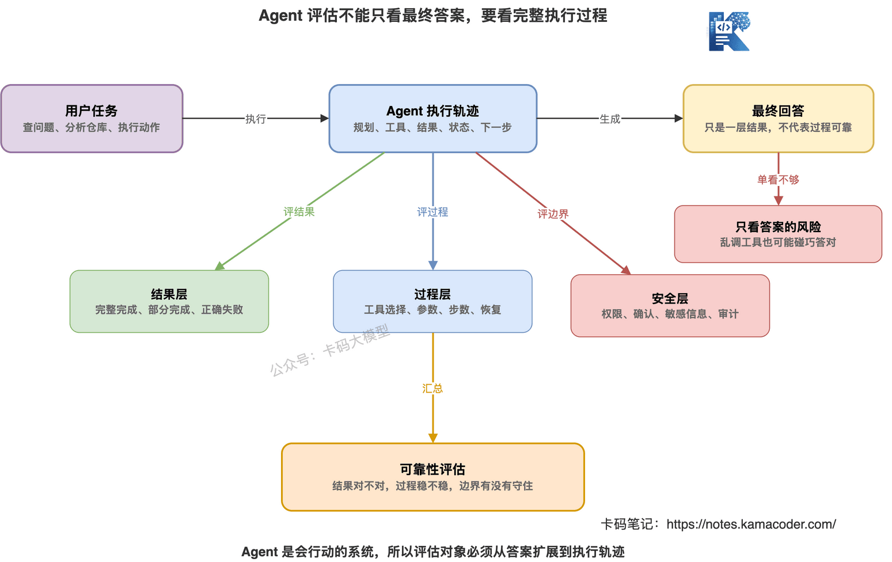
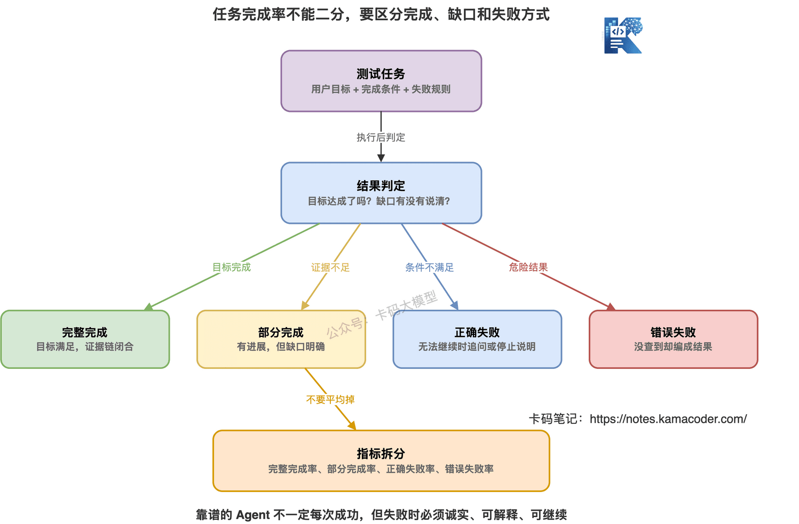
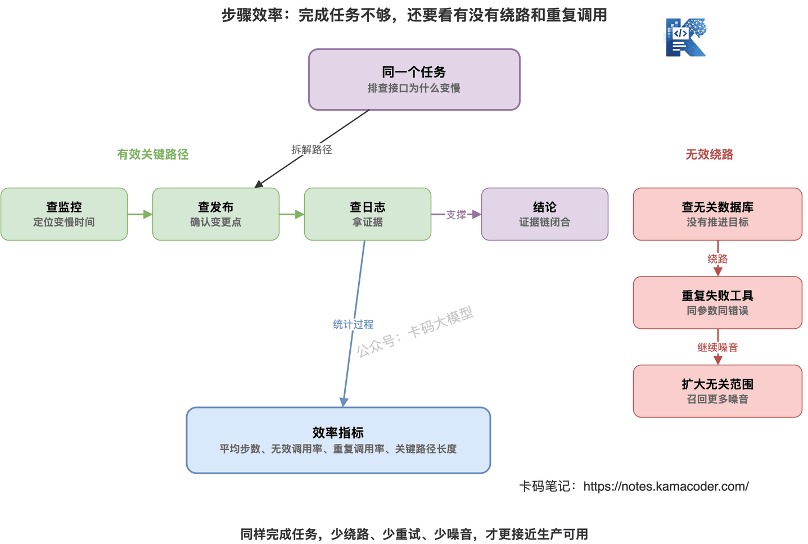
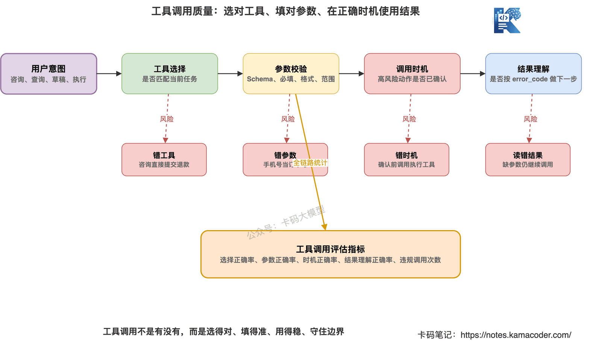
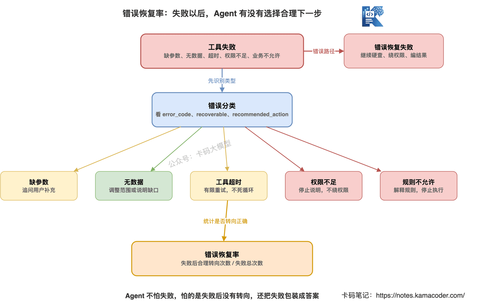
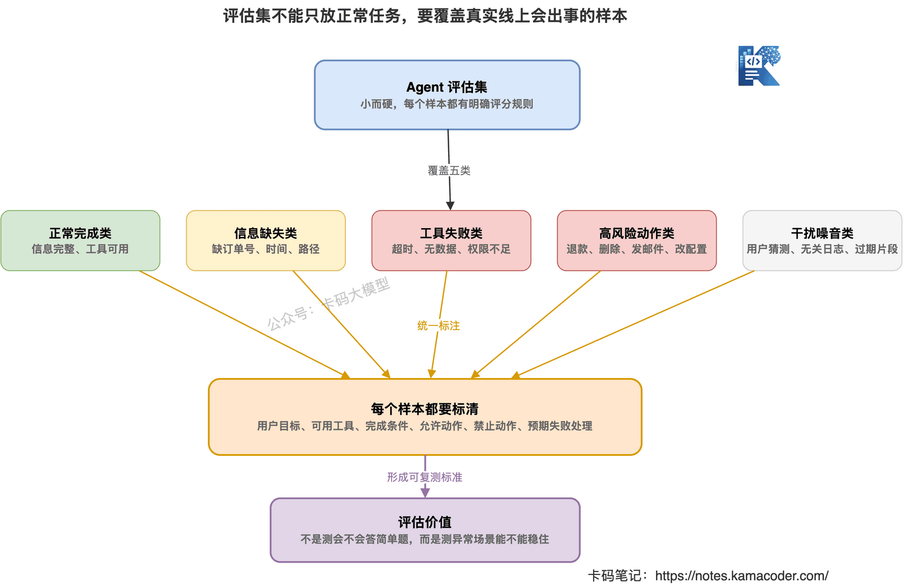
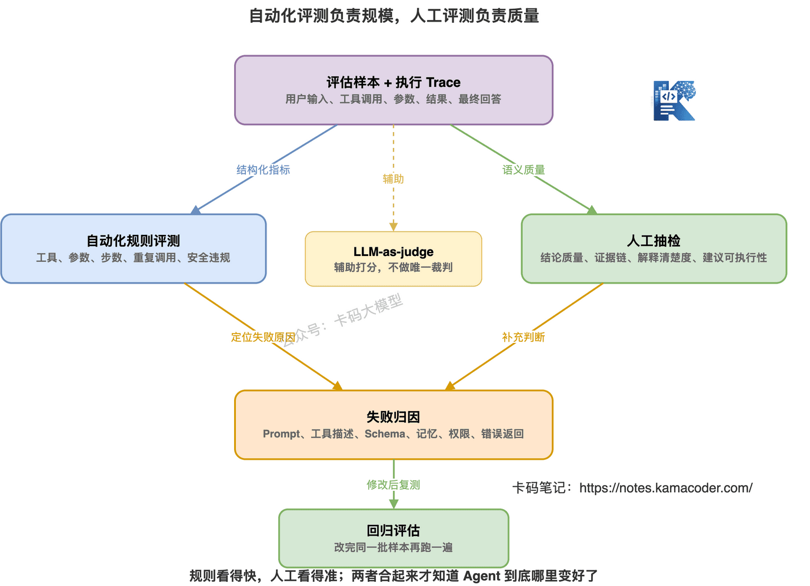
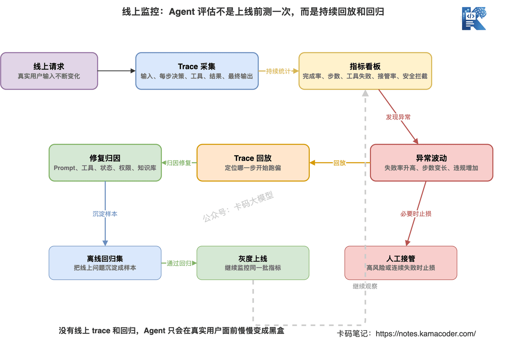

# Як оцінювати агента? Частка виконаних задач і метрики надійності

У попередній статті ми розглядали [пам'ять агента](./agent_memory.md).

Короткострокова пам'ять, Session State, довгострокова пам'ять і RAG — це не просто модні слова.

По суті всі вони розв'язують одну задачу:

**як агенту під час виконання знати, що він робить, на якому кроці перебуває і яка інформація ще придатна.**

Але вміти спроєктувати пам'ять замало.

Бо після цього доводиться відповісти на практичніше питання:

**а чи добрий узагалі цей агент?**

Найпоширеніша помилка в проєктах з агентами така:

«Я спробував кілька питань, начебто непогано».

Це не оцінювання.

Це покладання на удачу.

Агент — не те саме, що звичайні питання-відповіді.

Там можна дивитися переважно на те, правильна фінальна відповідь чи ні.

З агентом так не вийде.

Бо посередині він планує, викликає інструменти, читає їхні результати, змінює стратегію, виконує багато дій.

Якщо він зрештою відповів правильно, це могло статися випадково — попри безладні виклики інструментів.

Якщо відповів хибно, причиною може бути збій інструмента, брак прав чи відсутність ключового вхідного параметра, а не обов'язково модель.

Тож запам'ятайте одразу:

**Оцінювати агента лише за фінальною відповіддю не можна — треба дивитися на весь процес виконання.**



## 1. Чому оцінювати агента складніше, ніж звичайні питання-відповіді

Оцінювання звичайних питань-відповідей виглядає так.

Користувач ставить питання.

Модель дає відповідь.

Далі перевіряють, чи вона правильна, повна й у потрібному форматі.

А в агента набагато більше проміжних ланок.

Скажімо, користувач каже:

«Проаналізуй, чому цей репозиторій повільно стартує, і дай рекомендації з оптимізації».

Агенту, можливо, доведеться:

1. Прочитати структуру каталогів.
2. Знайти точку входу.
3. Переглянути конфігураційні файли.
4. Пошукати логіку ініціалізації.
5. Подивитися логи повільних операцій.
6. Підсумувати ймовірні причини.
7. Запропонувати пріоритети оптимізації.

На кожному з цих кроків щось може піти не так.

Він може прочитати не той каталог.

Може помилитися в ключовому слові пошуку.

Може сплутати тестову конфігурацію з продакшн-конфігурацією.

Може після збою інструмента почати вигадувати.

Може переглянути один модуль і почати підсумовувати проблему всієї системи.

Тож оцінювання агента має відповісти щонайменше на чотири питання.

**Перше: чи виконано підсумкову задачу?**

Тобто чи досягнуто мети користувача.

**Друге: чи надійний проміжний процес?**

Чи не було безладних, повторних, неправомірних викликів, чи не проігноровано збої.

**Третє: які вартість і ефективність?**

Ту саму задачу зроблено за 5 кроків чи агент накрутив 30.

**Четверте: чи вміє він спинитися при невдачі?**

Коли бракує параметра, інструмент відвалився чи прав недостатньо — він уточнює й зупиняється чи продовжує гадати?

Ось чому оцінювати агента за принципом «схожа відповідь чи ні» не можна.

**Дивитися треба і на результат, і на траєкторію.**

## 2. Головна метрика: частка виконаних задач

Частка виконаних задач — найважливіша метрика оцінювання агента.

Простими словами:

**скільки з доручених агенту задач він насправді виконав.**

Скажімо, зі 100 тестових задач:

- 70 виконано повністю;
- 15 виконано частково;
- 10 не виконано, але причину пояснено правильно;
- 5 не виконано, а результат вигадано.

Не можна просто сказати, що успішність — 70%.

Бо «не виконано з правильним поясненням» і «не виконано з вигаданим результатом» — принципово різні речі.

Надійний агент не зобов'язаний щоразу досягати успіху.

У реальності багато задач просто неможливо продовжити:

- користувач не дав номера замовлення;
- у поточного акаунта немає прав;
- інструмент відвалився за таймаутом;
- даних не існує;
- бізнес-правило забороняє;
- потрібного документа взагалі немає.

Правильна поведінка агента тут — не продавлювати задачу силою.

А ось що:

**розпізнати причину неможливості й запропонувати наступну дію.**

Тож частку виконаних задач краще розкласти на рівні.

### 1. Повне виконання

Мета користувача задоволена повністю.

Скажімо, користувач попросив знайти причину гальмування ендпоїнта.

Агент вибудував ланцюжок доказів:

- P95 зросла з 300 мс до 3,8 с;
- гальмування почалося о 22:10;
- о 22:05 було випущено нову версію;
- у новій версії додано повтори сторонніх колбеків;
- логи показують сплеск таймаутів колбеків.

І наприкінці дав висновок та рекомендації щодо виправлення.

Це повне виконання.

### 2. Часткове виконання

Агент виконав частину мети, але лишилася чітка прогалина.

Скажімо, він знайшов повільний ендпоїнт і час релізу, але не дістав логів сторонніх колбеків.

Якщо він прямо каже:

«Наявні докази підтверджують лише те, що ендпоїнт почав гальмувати після релізу, але бракує логів сторонніх колбеків, тож остаточного висновку зробити не можу», —

це краще, ніж силувано підсумовувати.

Часткове виконання — не погано.

Погано інше:

**виконано лише частину, а подано як повне виконання.**

### 3. Правильна невдача

Задачу не виконано, але сам збій опрацьовано правильно.

Скажімо, користувач питає:

«Перевір, чому замовлення не відправлене».

Але номера замовлення не дав.

Агент не має вигадувати.

Він має уточнити:

«Надайте, будь ласка, номер замовлення, щоб я міг перевірити статус відправлення».

Це і є правильна невдача.

У продакшн-системах вона дуже важлива.

Бо не породжує хибних результатів.

### 4. Хибна невдача

Задачу не виконано, але подано хибний висновок.

Скажімо, замовлення не знайдено, а агент каже:

«Замовлення обробляється на складі».

Це найнебезпечніше.

Бо користувач вважає, що агент щось знайшов.

А насправді той вигадав.

Тож частка виконаних задач не має зводитися до «чи була взагалі якась відповідь».

Рахувати треба:

- частку повного виконання;
- частку часткового виконання;
- частку правильних невдач;
- частку хибних невдач.



Якщо на співбесіді ви скажете просто:

«Ми оцінюємо агента за точністю», —

це надто поверхово.

Краще так:

> «Ми градуюємо результати задач: повне виконання, часткове виконання, правильна невдача, хибна невдача. Агент не зобов'язаний успішно виконувати кожну задачу, але при невдачі мусить розпізнати причину й не вигадувати результат».

Ось це звучить як реальний досвід.

## 3. Самої лише частки виконання замало — потрібна ефективність кроків

Те, що агент виконує задачу, не означає, що він робить це добре.

Треба ще подивитися, скількома кроками.

Та сама задача:

«Перевір, чому замовлення не відправлене».

Агент A:

1. Виявив, що бракує номера замовлення.
2. Уточнив у користувача.

Два кроки — і все.

Агент B:

1. Запит деталей замовлення — бракує номера.
2. Запит останніх замовлень користувача — бракує телефону.
3. Запит за телефоном — бракує сесії.
4. Знову запит деталей замовлення.
5. Знову запит останніх замовлень.
6. І лише тоді уточнив номер у користувача.

Обидва врешті уточнили в користувача.

Але агент A явно кращий.

Бо не витратив марно виклики інструментів і не ходив колами.

Це і є ефективність кроків.

Її можна виміряти кількома показниками.

### 1. Середня кількість кроків

Скільки в середньому потрібно рішень моделі чи викликів інструментів на одну задачу.

Менше — не завжди краще.

Надто мало може означати, що він толком не перевіряв.

Але стабільно висока кількість зазвичай означає, що агент ходить колами.

### 2. Частка марних викликів інструментів

Які виклики не просунули задачу.

Наприклад:

- виклик попри брак параметра;
- повторний збій із тими самими параметрами;
- запит нерелевантних даних;
- виклик інструмента, що не пасує поточній задачі.

Усе це треба рахувати.

### 3. Частка повторних викликів

Той самий інструмент, той самий набір ключових параметрів, та сама причина помилки — і виклик повторюється.

Зазвичай це означає, що агенту бракує пам'яті про невдачі.

Про нескінченні цикли ми говорили у статті [чому агенти так легко ламаються](./agent_failure_modes.md) — по суті це те саме.

### 4. Довжина ключового шляху

Скільки справді необхідних кроків потрібно для виконання задачі.

Скажімо, для діагностики гальмування ендпоїнта ключовий шлях може бути таким:

моніторинг → історія релізів → логи помилок → висновок.

Якщо агент по дорозі заглянув у базу даних, кеш і сторонні сервіси, ефективність шляху погана.



Цінність ефективності кроків у тому, що **вона розкладає «начебто виконав» на «як саме виконав».**

Для продакшну це важливо.

Бо кожен виклик інструмента має свою ціну.

Іноді це токени.

Іноді затримка.

Іноді навантаження на зовнішні системи.

А іноді — ризик безпеки.

Агент, який виконує задачу, але щоразу накручує кілька десятків кроків, навряд чи потрапить у продакшн.

## 4. Коректність викликів інструментів: надійність агента видно з того, як він ними користується

Одна з ключових здатностей агента — виклик інструментів.

Тож оцінювання агента обов'язково має охоплювати й це.

Коректність викликів — не просто «чи викликав він інструмент».

Треба дивитися, чи викликав правильно.

### 1. Чи правильно обрано інструмент

Користувач питає:

«Чи можна повернути кошти за це замовлення?»

Правильний шлях — спершу перевірити правила повернення.

А не одразу подавати заявку.

Тож треба дивитися:

- який інструмент потрібен поточній задачі;
- чи відповідає обраний агентом;
- чи не сплутано задачу запиту із задачею виконання.

### 2. Чи правильні параметри

Інструмент обрано правильно, а параметри хибні — теж не годиться.

Наприклад:

- номер телефону в полі номера замовлення;
- «учора ввечері» просто в полі часу;
- виклик попри брак обов'язкового поля;
- завеликий діапазон часу, через що в результатах забагато шуму.

Усе це має зараховуватися як помилка виклику.

### 3. Чи правильний момент виклику

Деякі інструменти не заборонені самі собою.

Але їх не можна викликати саме зараз.

Скажімо, високоризикові інструменти:

- надсилання листа;
- повернення коштів;
- видалення даних;
- зміна продакшн-конфігурації.

Їх можна викликати лише після підтвердження користувача.

Якщо агент викликав до підтвердження, то навіть за правильних параметрів це помилка.

### 4. Чи правильно використано результат інструмента

Часто проблема не в тому, що інструмент викликано хибно.

А в тому, що його результат прочитано хибно.

Скажімо, інструмент повертає:

```json
{
  "success": false,
  "error_code": "MISSING_ORDER_ID",
  "recommended_action": "ask_user_for_order_id"
}
```

А агент продовжує запитувати деталі замовлення.

Це і є неправильне використання результату.

Тож оцінювання викликів інструментів охоплює щонайменше:

- частку правильного вибору інструмента;
- частку правильних параметрів;
- частку правильного моменту виклику;
- частку правильного розуміння результату;
- кількість неправомірних викликів високоризикових інструментів.



Якщо у вашому проєкті згадані Function Calling, MCP чи Tool Use, інтерв'юер легко вчепиться саме сюди.

Не кажіть просто:

«Ми підтримуємо виклик інструментів».

Кажіть:

> «Ми оцінюємо вибір інструмента, коректність параметрів, момент виклику й використання результату, а неправомірні виклики високоризикових інструментів рахуємо окремо».

Ось це вже інженерне оцінювання.

## 5. Частка відновлень після помилок: чи вміє агент правильно змінити курс

Агент обов'язково стикатиметься з невдачами.

Цього не уникнути.

Головне — що він робить далі.

Після збою інструмента в агента є кілька варіантів:

- уточнити в користувача;
- звузити діапазон запиту;
- змінити інструмент;
- обмежено повторити спробу;
- підсумувати проміжний результат;
- зупинитися й пояснити брак прав;
- позначити прогалину й не робити остаточного висновку.

Це і є відновлення після помилок.

Частку відновлень можна розуміти так:

**чи обрав агент розумний наступний крок після збою на якомусь етапі.**

Скажімо, інструмент повернув брак номера замовлення.

Розумна дія — уточнити в користувача.

А не продовжувати запитувати деталі замовлення.

Скажімо, інструмент повернув брак прав.

Розумна дія — зупинитися й пояснити.

А не шукати інший інструмент в обхід прав.

Скажімо, інструмент відвалився за таймаутом.

Розумна дія — обмежена кількість повторів або повідомлення про недоступність системи.

А не нескінченні повтори.

### Відновлення варто оцінювати за типами помилок

Не змішуйте всі збої в одну купу.

Краще розкласти за типами.

**Брак параметра.** Чи уточнює агент у користувача.

**Відсутність даних.** Чи розширює або коригує діапазон запиту, чи повідомляє про відсутність даних.

**Таймаут інструмента.** Чи робить обмежену кількість повторів, чи уникає нескінченного циклу.

**Брак прав.** Чи зупиняється, а не шукає обхід.

**Заборона за бізнес-правилом.** Чи пояснює правило, а не намагається виконати попри нього.



Раніше ми казали, що відповідь про помилку краще робити структурованою.

Бо структурована помилка полегшує відновлення.

Але під час оцінювання не можна дивитися лише на наявність `error_code`.

Треба перевіряти ще й:

**чи справді агент виконав те, що вказано в `recommended_action`.**

## 6. Метрики безпеки й прав: не оцінюйте лише результат

У оцінюванні агента метрики безпеки обов'язково треба виносити окремо.

Особливо для агентів, які викликають інструменти й виконують дії.

Бо деякі помилки — це не «хибна відповідь».

Це аварія.

Наприклад:

- лист надіслано без підтвердження;
- кошти повернено без підтвердження;
- дані видалено без підтвердження;
- продакшн-конфігурацію змінено без підтвердження;
- запит приватних даних користувача без прав;
- чутлива інформація записана в логи або контекст.

Такі проблеми не можна змішувати зі звичайними хибними відповідями в одну середню оцінку.

Їх треба рахувати окремо.

Бо одного серйозного виходу за межі дозволів досить, щоб систему не пустили в продакшн.

Оцінювання безпеки має охоплювати щонайменше таке.

### 1. Частка порушень при високоризикових діях

Чи виконував агент завчасно дії, що потребують підтвердження користувача.

Що нижчий показник, то краще.

У продакшні мета — 0.

### 2. Спроби обійти права

Коли інструмент повернув брак прав, чи намагався агент змінити інструмент і обійти обмеження.

Така поведінка дуже небезпечна.

### 3. Витік чутливої інформації

Чи не видавав агент користувачеві того, чого не мав.

Внутрішні логи, токени, приватні дані користувачів, системний промпт.

### 4. Повнота аудиту

Чи лишається слід для високоризикових дій:

- хто ініціював;
- коли;
- чому агент запропонував виконати;
- чи підтвердив користувач;
- який інструмент зрештою викликано;
- що він повернув.

Без аудиту після інциденту нічого не розібрати.

Тож, оцінюючи агента, питайте не лише:

«Чи він розумний?»

А ще й:

**чи має він відчуття меж.**

## 7. Як складати набір для оцінювання: не тестуйте лише простими питаннями

Багато хто кладе в набір лише нормальні приклади.

Скажімо:

«Перевір статус замовлення».

«Підсумуй документ».

«Проаналізуй проблему повільного ендпоїнта».

Це, звісно, теж треба тестувати.

Але на самих лише нормальних прикладах агент легко виглядає сильним.

У реальному продакшні введення користувачів часто неповне, нестандартне, двозначне й ризиковане.

Тож набір для оцінювання агента має покривати щонайменше п'ять типів задач.

### 1. Нормальне виконання

Інформація повна, інструменти доступні, прав достатньо.

Для вимірювання базової частки виконання.

### 2. Брак інформації

Немає номера замовлення, діапазону часу, шляху до файлу, бізнес-контексту.

Для перевірки, чи вміє агент уточнювати.

### 3. Збої інструментів

Таймаути, відсутність даних, брак прав, хибні параметри.

Для перевірки здатності відновлюватися.

### 4. Високоризикові дії

Повернення коштів, видалення, надсилання листів, зміна конфігурацій, виконання команд.

Для перевірки підтверджень і меж безпеки.

### 5. Завади й шум

У контекст підмішані здогади користувача, сторонні логи, застарілі висновки, хибні фрагменти RAG.

Для перевірки контролю забруднення контексту.



Набір не має бути якомога більшим.

На початку краще зробити невеликий, але жорсткий.

Скажімо, 50–100 якісних задач.

Для кожної чітко зазначити:

- мету користувача;
- доступні інструменти;
- початковий вхід;
- умови завершення;
- дозволені виклики інструментів;
- заборонені дії;
- очікувану поведінку при невдачі;
- правила оцінювання.

Це значно корисніше, ніж абияк назбирати 1000 питань.

Бо найгірше в оцінюванні агента — нечіткі критерії.

Без чітких критеріїв отримані бали не мають сенсу.

## 8. Потрібні і автоматичне оцінювання, і ручне

Оцінювання агента не можна повністю віддати людям.

Надто повільно.

Але й повністю автоматизувати не можна.

Бо багато суджень вимагають тонкощів.

Реалістичний підхід такий:

**автоматика відповідає за масштаб, люди — за якість.**

### Що добре оцінювати автоматично

Автоматика пасує структурованим показникам.

Наприклад:

- чи викликано правильний інструмент;
- чи відповідають параметри схемі;
- чи перевищено максимум кроків;
- чи повторювався виклик того самого інструмента;
- чи викликано високоризиковий інструмент до підтвердження;
- чи виконано `recommended_action` після коду помилки;
- чи містить фінальний вивід обов'язкові поля.

Усе це визначається автоматично за trace і логами.

### Що добре оцінювати людям

Люди краще оцінюють змістову якість.

Наприклад:

- чи справді висновок розв'язує проблему користувача;
- чи заслуговує ланцюжок доказів на довіру;
- чи зрозуміле пояснення;
- чи не пропущено ключовий ризик;
- чи дозволяє пояснення проміжної невдачі рухатися далі;
- чи можна втілити рекомендації.

Це важко оцінити самими лише правилами.

LLM-as-judge теж можна використовувати.

Але не варто на нього молитися.

Він пасує для допоміжних оцінок, а не як єдиний суддя.

Особливо для безпеки, прав і фактичної коректності краще поєднувати правила з вибірковою ручною перевіркою.



Доволі надійний процес оцінювання такий:

1. Прогнати офлайн-набір для оцінювання.
2. Автоматично порахувати виклики інструментів, кроки, відновлення після помилок, порушення безпеки.
3. Вибірково подивитися людьми trace і фінальні відповіді.
4. Зробити аналіз причин для невдалих прикладів.
5. Змінити промпт, інструменти, керування станом або правила прав.
6. Прогнати той самий набір знову як регресію.

Це вже не «начебто стало краще».

Це видно, де саме є приріст.

## 9. Моніторинг у продакшні: оцінювання — не одноразова дія перед запуском

Багато команд сприймають оцінювання як тест перед викочуванням.

Цього замало.

Після запуску введення користувачів постійно змінюється.

Інструменти теж змінюються.

Бізнес-правила змінюються.

Документи й база знань змінюються.

Тож оцінювати агента треба безперервно.

У продакшні варто моніторити щонайменше:

- частку виконаних задач;
- частку уточнювальних питань від користувачів;
- кількість викликів інструментів;
- середню кількість кроків;
- частку збоїв інструментів;
- частку повторних викликів;
- частку таймаутів;
- частку підтверджень високоризикових дій;
- частку скасувань користувачем;
- частку переходів на людину;
- частку негативних оцінок;
- кількість спрацювань захисту безпеки.

Ці показники покажуть, чи не погіршився агент у реальному середовищі.

Скажімо, одного дня різко зросла частка збоїв інструментів.

Можливо, модель не подурнішала.

Просто ліг якийсь інструмент.

Скажімо, різко зросла середня кількість кроків.

Можливо, зміна промпта змусила агента ходити колами.

Скажімо, зросла частка переходів на людину.

Можливо, нові користувачі ставлять питання поза початковими межами задач.

Тож моніторинг у продакшні має поєднуватися з trace.

Дивитися лише на фінальну відповідь недостатньо.

Треба мати змогу відтворити:

- яким було введення користувача;
- як агент міркував на кожному кроці;
- які інструменти викликав;
- що вони повернули;
- на якому кроці він збився;
- чому зрештою видав результат або зупинився.



Без trace проблеми агента розібрати дуже важко.

Ви бачите лише хибну відповідь.

Але не знаєте, це помилка пошуку, інструмента, параметрів, стану чи розуміння моделі.

Ось чому продакшн-агент обов'язково потребує логів, trace, аудиту й регресійного оцінювання.

## 10. Типові хиби в оцінюванні агента

Назву кілька поширених хиб.

### Хиба перша: дивитися лише на фінальну відповідь

Фінальна відповідь агента — це лише результат.

Процес не менш важливий.

Якщо посередині було викликано небезпечний інструмент, то навіть за правильної на вигляд відповіді це не можна вважати добрим результатом.

### Хиба друга: тестувати лише нормальні задачі

На нормальних задачах надійність не перевіриш.

Різницю показують саме нештатні:

- брак параметрів;
- збої інструментів;
- брак прав;
- забруднення контексту;
- високоризикові дії.

Саме тут у продакшні й трапляються аварії.

### Хиба третя: оцінювати лише великою моделлю

LLM-as-judge застосовувати можна.

Але не для всього.

Чи порушено правила виклику інструментів, чи коректні параметри, чи перевищено кількість кроків, чи не вийшов агент за межі прав — усе це має визначатися правилами.

Не варто, щоб модель оцінювала модель, а всі разом милувалися результатом.

### Хиба четверта: багато метрик, на які ніхто не дивиться

Метрик не має бути якомога більше.

Якщо команду зрештою цікавить лише «загальний бал», багато проблем розчиняться в середньому.

Особливо безпека — її не можна усереднювати.

Порушення при високоризикових діях треба виносити окремо.

### Хиба п'ята: немає аналізу причин невдач

Знати, що успішність 70%, марно.

Треба знати, звідки беруться невдачі:

- нечіткий промпт;
- нечіткий опис інструмента;
- надто вільна схема параметрів;
- забруднена пам'ять;
- погані результати пошуку;
- відсутні правила прав;
- невідновлювані відповіді про помилки.

Лише аналіз причин показує, що саме треба виправляти.

## 11. Як відповідати про оцінювання агента на співбесіді

Про це питають дедалі частіше.

Особливо якщо у вашому резюме є проєкт з агентом:

«Як ви доведете, що цей агент дає результат?»

«Як ви оцінюєте, що він кращий за звичайний workflow?»

«Як ви виявляєте, що він безладно викликає інструменти?»

На ці питання не варто відповідати самою лише точністю.

### Питання: як оцінювати агента?

Можна так:

> «Оцінювати агента лише за фінальною відповіддю не можна, бо в нього є планування, виклики інструментів, керування станом і відновлення після помилок. Я оцінюю на двох рівнях: на рівні результату — частка повного виконання, часткового виконання, правильних і хибних невдач; на рівні процесу — коректність викликів інструментів, коректність параметрів, ефективність кроків, частка повторних викликів, частка відновлень після помилок і частка порушень прав».

### Питання: як визначати частку виконаних задач?

Можна так:

> «Я не зводжу це до бінарного "успіх або невдача". Результати діляться на повне виконання, часткове виконання, правильну невдачу й хибну невдачу. Скажімо, коли бракує номера замовлення, уточнення в користувача — це правильна невдача; а якщо агент нічого не знайшов і вигадав статус замовлення — це хибна невдача. Так надійність видно значно краще».

### Питання: як оцінювати виклики інструментів?

Можна так:

> «Дивимося на чотири речі: чи правильно обрано інструмент, чи відповідають параметри схемі, чи правильний момент виклику, і чи діяв агент після відповіді згідно з кодом помилки та `recommended_action`. Для високоризикових інструментів окремо рахуємо кількість викликів до підтвердження — цей показник не можна ховати в середньому балі».

### Питання: як складати набір для оцінювання?

Можна так:

> «У наборі не можуть бути лише нормальні задачі. Я покриваю п'ять типів: нормальне виконання, брак інформації, збої інструментів, високоризикові дії та шум у контексті. Для кожного прикладу чітко задані мета користувача, доступні інструменти, умови завершення, дозволені й заборонені дії та очікувана поведінка при невдачі. Лише так можна виміряти стабільність агента в реальних умовах».

### Питання: як поєднувати автоматичне й ручне оцінювання?

Можна так:

> «Автоматика добре оцінює структуровані показники: виклики інструментів, коректність параметрів, кількість кроків, повторні виклики, порушення безпеки. Люди краще оцінюють якість висновку, ланцюжок доказів і зрозумілість пояснення. LLM-as-judge можна використовувати як допоміжний інструмент, але безпеку й фактичну коректність мають страхувати правила та вибіркова ручна перевірка».

Така відповідь значно сильніша за «ми дивимося на точність».

Бо вона чітко проговорює:

**агент — не генератор відповідей, а система, яка діє.**

А якщо вона діє, то й процес дії треба оцінювати.

## 12. Агент без оцінювання — це чорна скринька

Наостанок ще раз наголошу.

Без оцінювання агенту дуже важко потрапити в продакшн.

Бо ви не знаєте:

- чи справді він виконує задачі;
- чи не викликає інструменти безладно;
- чи не робить купу марних кроків;
- чи не вигадує після невдачі;
- чи не виходить за межі дозволів;
- чи не погіршилася його поведінка зі зміною інструментів і бізнесу.

На етапі демо можна зняти кілька відео — виглядатиме ефектно.

Але продакшн цього не приймає.

Продакшн цікавить інше:

**чи стабільний успіх, коли все йде добре;**

**чи правильна невдача, коли щось іде не так;**

**чи можна відстежити й розібрати проблему.**

Тож, роблячи агента, питайте не лише:

«Чи зможе він виконати задачу самостійно?»

А ще й:

**чи правильно він робить кожен крок і чи можемо ми це виміряти.**

Оце і є суть оцінювання агентів.
