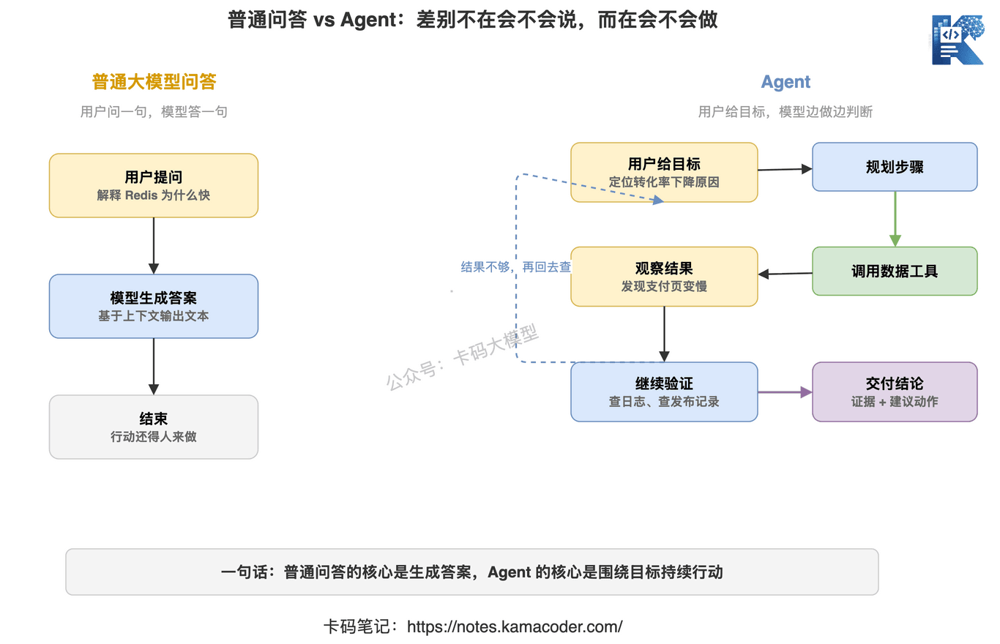
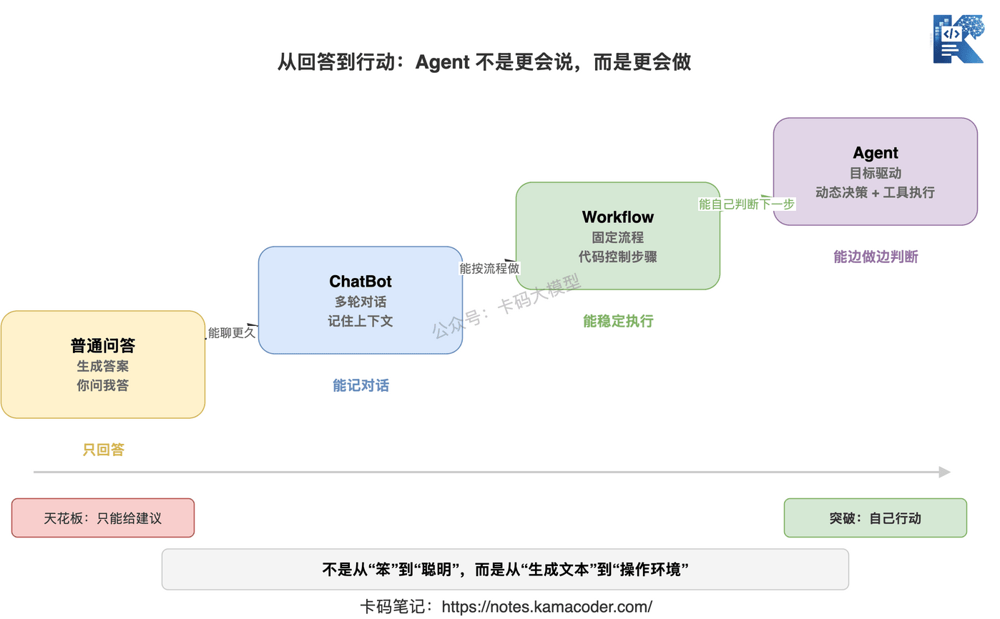
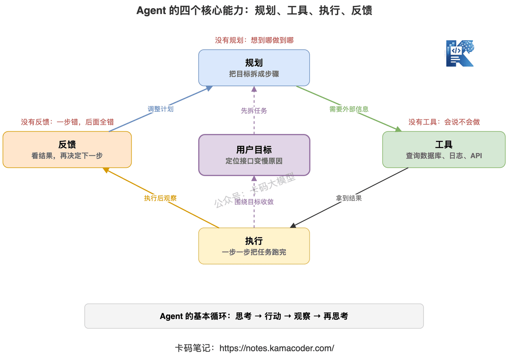
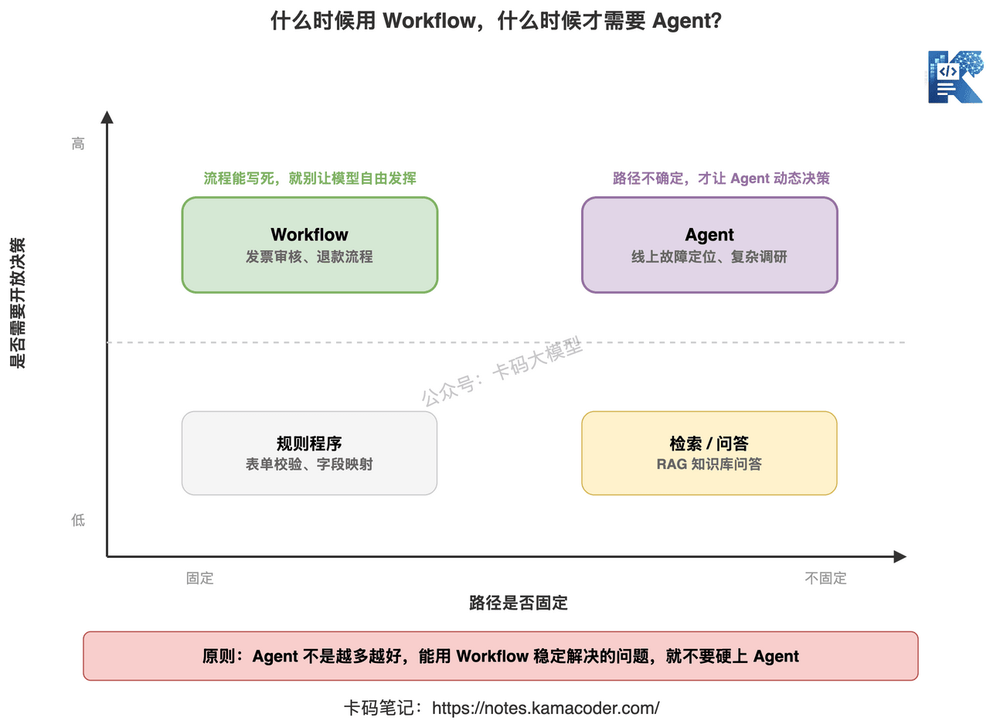
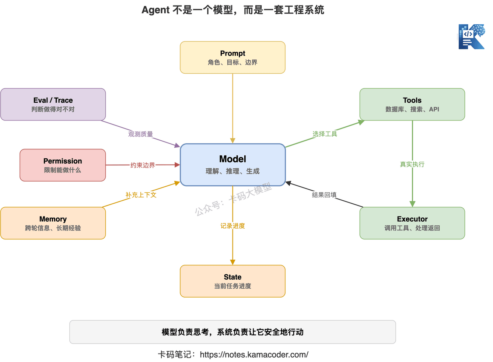

# Що таке агент насправді? Чим він відрізняється від звичайних питань-відповідей?

Якось людина йшла на співбесіду на позицію розробника застосунків на LLM, і в її проєктах був записаний «розумний агент підтримки клієнтів».

Інтерв'юер спитав: «Чим ваш агент відрізняється від звичайного бота підтримки?»

Відповідь: «Ми взяли сильнішу модель, вона розуміє питання користувача й підтримує багатораундовий діалог».

Інтерв'юер продовжив: «А чи вирішує він сам, що робити далі? Чи викликає інструменти? Чи коригує дії за результатами інструментів? Якщо користувач питає — він відповідає, то чому це агент?»

Тут розмова зупинилася.

Такі питання зараз дуже поширені. Багато хто пише в резюме «агент», а розповідає про чат-бота; багато продуктів рекламують себе як агентів, хоча по суті це промпт, обгорнутий інтерфейсом.

Тож почнімо з найбазовішого: **що таке агент насправді і чим він відрізняється від звичайних питань-відповідей?**

## 1. Звичайні питання-відповіді — це «ви питаєте, я відповідаю»

Не поспішаймо з визначенням агента, почнімо зі звичного.

Що таке звичайні питання-відповіді з LLM?

Користувач вводить репліку, модель за контекстом генерує відповідь.

Скажімо, ви питаєте:

> Поясни, чому Redis швидкий.

Модель відповідає:

> Redis швидкий передусім тому, що працює в пам'яті, однопотоковість уникає конкуренції за блокування, використовується мультиплексування введення-виведення, структури даних ефективні…

Це типові питання-відповіді з великою моделлю.

Вона може бути дуже розумною, пояснювати докладно, писати код, правити резюме, підсумовувати статті.

Але має одну ключову властивість: **вона переважно генерує текст.**

Попросите пояснити Redis — пояснить.

Попросите написати SQL — напише.

Попросите проаналізувати логи — проаналізує лише ті, які ви їй самі вставили.

Схема взаємодії тут проста:

**користувач дає питання → модель генерує відповідь → користувач питає далі.**

У всьому цьому процесі модель здебільшого нічого не робить руками.

Вона не знає, які зараз дані у вашій базі, не піде сама дивитися моніторинг, не відкриє адмінку, не запустить скрипт і не змінить підхід, коли перший крок не спрацював.

Тож звичайні питання-відповіді — це радше дуже обізнаний консультант.

Порадити він може, а діяти доведеться вам.

## 2. Суть агента не в тому, що він «відповідає розумніше»

Перша реакція багатьох: агент — це розумніша велика модель?

Ні.

**Суть агента не в тому, що він краще говорить, а в тому, що він краще діє.**

Це важливе речення.

Головний продукт звичайних питань-відповідей — «відповідь».

Головний продукт агента — «процес і результат виконання задачі».

Приклад.

Ви кажете звичайній моделі:

> Проаналізуй, чому на цьому сайті останнім часом падає конверсія.

У режимі питань-відповідей вона дасть вам план аналізу:

- подивитися, чи змінилися джерела трафіку;
- подивитися, чи не сповільнилося завантаження сторінок;
- подивитися, чи не впала клікабельність кнопок;
- подивитися, чи не було нещодавно редизайну;
- подивитися, чи немає негативних сигналів у відгуках.

Поради, можливо, слушні, але дані вам доведеться дивитися самому.

Справжній агент має вміти більше:

1. Спершу розкласти задачу: падіння конверсії може бути пов'язане з трафіком, сторінкою, ціною, продуктивністю чи шляхом користувача.
2. Викликати інструменти даних: подивитися за останні 30 днів перегляди, унікальних користувачів, клікабельність, показник відмов, конверсію в оплату.
3. Викликати інструменти логів: подивитися затримку ендпоїнтів, частку помилок, час завантаження сторінок.
4. Порівняти з історичними даними: знайти момент аномалії.
5. Сформувати попередній висновок: скажімо, «час завантаження сторінки оплати на мобільних зріс з 1,2 до 4,8 секунди».
6. Продовжити перевірку: подивитися, чи пов'язано це з якимось релізом.
7. Наприкінці видати висновок і рекомендації: де саме проблема, які докази, що робити далі.

Як бачите, це вже не «відповідь на питання».

Це рух до мети, де агент сам вирішує, що робити далі, і постійно коригує дії за результатами.

Ось це вже схоже на агента.

## 3. Агент мусить мати щонайменше чотири здатності

Не варто починати розмову про агентів із нагромадження гучних термінів.

Запам'ятайте спершу чотири здатності: **планування, інструменти, виконання, зворотний зв'язок.**

Без них багато так званих агентів насправді лише носять цю назву.

### 1. Планування: розуміти, як розкласти задачу

Користувач зазвичай дає агенту не просте питання, а мету.

Наприклад:

> Розбери технічний борг у цьому репозиторії й розстав пріоритети.

На це не відповісти однією реплікою.

Агент має спершу розкласти задачу:

- подивитися структуру каталогів;
- потім ключові модулі;
- потім останні коміти;
- потім знайти дублювання, складні функції, місця без тестів;
- потім оцінити, що впливає найсильніше;
- і нарешті скласти звіт.

Це і є планування.

Без нього агент перетворюється на того, хто робить перше, що спало на думку.

Багато агентів ламаються саме через нестабільний план: спочатку сказав, що перевірить тести, а по дорозі забув; спочатку збирався проаналізувати весь репозиторій, а зрештою переглянув два файли й почав підсумовувати.

### 2. Інструменти: зв'язок із зовнішнім світом

Без інструментів агент здебільшого лишається тим, хто «вміє говорити, але не діяти».

Інструментами можуть бути:

- пошук;
- запити до бази даних;
- читання й запис файлів;
- виконання коду;
- браузер;
- бізнесові API;
- інтерфейси для надсилання листів, повідомлень, створення заявок.

Сенс інструментів у тому, щоб перетворити модель із «генератора тексту» на «виконавця, здатного впливати на середовище».

Скажімо, користувач питає:

> Дізнайся, яка була найчастіша причина невдалих замовлень учора.

Звичайні питання-відповіді дадуть лише: «Можна подивитися в бік невдалих оплат, браку товару на складі, блокувань антифродом».

Агент має звернутися до бази замовлень, переглянути розподіл кодів помилок, потім звернутися до системи логів, подивитися проблемні ендпоїнти — і дати справжній висновок.

Ось чому Function Calling / Tool Use такі важливі.

Це не додаткова опція агента, а вхід до його здатності діяти.

### 3. Виконання: довести задачу до кінця крок за кроком

Уміти планувати — не те саме, що вміти виконувати.

Багато моделей чудово складають плани:

> Крок перший — зібрати дані; крок другий — проаналізувати проблему; крок третій — видати звіт.

Звучить цілісно, але на реальному виконанні все розсипається.

Бо виконання — це не написати план, а справді зробити кожен крок.

Що робити, коли запит до бази впав?

Що робити, коли інструмент повернув порожній результат?

Що робити, коли якийсь ендпоїнт відвалився за таймаутом?

Що робити, коли даних виявилося замало — брати інший інструмент і шукати далі?

Усе це і є процес виконання.

Справжній агент має вміти обробляти розгалуження під час виконання, а не просто йти згори вниз за фіксованим списком.

### 4. Зворотний зв'язок: подивитися на результат і вирішити наступний крок

Одна з найбільших відмінностей агента від звичайної програми в тому, що він коригує дії за проміжними результатами.

Скажімо, він спершу перевіряє причини невдалих замовлень і бачить, що найчастіша — «таймаут оплати».

Тоді наступним кроком не варто перевіряти склад; треба дивитися затримку платіжного ендпоїнта, колбеки стороннього платіжного сервісу й логи помилок шлюзу.

Це і є зворотний зв'язок.

Базовий цикл тут такий:

**подумати → діяти → подивитися на результат → подумати знову → діяти знову.**

Багато хто чув про ReAct — це саме цей підхід.

Reasoning — це міркування, Acting — дія, а Observation посередині повертає результат роботи інструмента.

## 4. Простий критерій: чи вирішує він сам, що робити далі

Як зрозуміти, чи є система агентом?

Наведу дуже практичний критерій:

**подивіться, чи вирішує вона сама під час виконання задачі, що робити далі.**

Якщо це фіксований процес:

1. користувач вводить питання;
2. система шукає в базі знань;
3. модель підсумовує відповідь;
4. результат повертається користувачеві, —

то це радше RAG із питаннями-відповідями, а не обов'язково агент.

А якщо так:

1. користувач дає мету;
2. модель вирішує, що спершу треба пошукати в базі знань;
3. після пошуку бачить, що інформації замало, і вирішує звернутися до бази даних;
4. результат із бази виглядає аномально, і вона вирішує викликати інструмент логів;
5. за логами продовжує локалізувати проблему;
6. наприкінці формує висновок, —

то це вже більше схоже на агента.

Бо він не виконує механічно фіксований процес, а ухвалює динамічні рішення за станом задачі.

Зверніть увагу: використання великої моделі само собою не робить систему агентом.

І використання Function Calling теж не обов'язково робить її агентом.

Якщо шлях виклику інструментів повністю фіксований і простору для рішень немає, то це, найімовірніше, просто workflow з інструментами.

Суть агента в чотирьох речах: **керованість метою + динамічні рішення + дія назовні + ітерації за зворотним зв'язком.**

Ці чотири слова можна прямо називати на співбесіді.

## 5. Чим агент відрізняється від workflow?

Агента й workflow дуже легко переплутати.

Workflow — це робочий процес.

Він пасує задачам із чітким процесом, стабільними кроками й зрозумілими правилами.

Скажімо, перевірка рахунків-фактур:

1. OCR розпізнає документ;
2. витягуються сума, податковий номер, дата;
3. поля валідуються;
4. викликається фінансова система для проведення;
5. повертається результат перевірки.

Процес тут дуже сталий, і workflow підходить чудово.

Вам не потрібно, щоб модель щоразу вільно міркувала: «Так, а чи проводити мені це, чи ні?»

Це було б надто небезпечно.

Для чого ж пасує агент?

Для задач відкритих, з нефіксованим шляхом і потребою ухвалювати рішення по дорозі.

Наприклад:

> Знайди причину, чому в продакшні почав гальмувати ендпоїнт.

Ця задача не має фіксованого шляху.

Причиною може бути повільна база, може — пробій кешу, може — реліз якогось сервісу, може — таймаут стороннього API.

Наперед прописати кожен крок неможливо.

Ось тут цінність агента й проявляється: за виявленими симптомами він вирішує, куди дивитися далі.

Тож не варто робити з агента культ.

**Якщо задачу стабільно розв'язує workflow, не тягніть туди агента.**

Свобода агента вища, але це не означає, що він надійніший.

Що більше свободи, то більше потрібно обмежень, оцінювання, контролю прав і відновлення після збоїв.

## 6. Агент — це не модель, а система

Це дуже легко проґавити.

Багато хто каже: «Я взяв GPT-5, отже я зробив агента».

Ні.

Модель — лише частина агента.

Повна агентна система зазвичай містить щонайменше:

- **модель** — розуміє, міркує, генерує;
- **промпт** — визначає роль, мету, межі;
- **інструменти** — зв'язок із зовнішніми системами;
- **виконавець** — власне викликає інструменти й обробляє результати;
- **керування станом** — фіксує поточний прогрес задачі;
- **система пам'яті** — зберігає інформацію між раундами;
- **механізм оцінювання** — визначає, чи зроблено правильно;
- **контроль прав** — обмежує, що можна робити, а чого ні;
- **відновлення після збоїв** — чи можна повторити, відкотити, зупинити.

Тож агент — це не «сильніша модель».

Це радше інженерна система, побудована навколо моделі.

Модель відповідає за думання, а система — за те, щоб діяти безпечно.

Саме тому на одній і тій самій моделі різні команди роблять агентів дуже різної якості.

Різниця зазвичай не в самій моделі, а в дизайні інструментів, керуванні контекстом, оркестрації виконання, оцінюванні й спостережуваності.

## 7. Як відповідати на співбесіді на питання «що таке агент»

Якщо інтерв'юер питає:

> Як ви розумієте агента?

Не варто відповідати просто:

> Агент — це інтелектуальна сутність, яка самостійно виконує задачі.

Це надто розпливчасто.

Можна відповісти так:

> Як я розумію, агент — це не просто питання-відповіді з великою моделлю, а система, що безперервно діє задля мети. Вона планує задачу за метою користувача, обирає відповідні інструменти для взаємодії із зовнішнім середовищем, під час виконання спостерігає за їхніми результатами й вирішує наступну дію. Звичайний чат-бот переважно генерує відповіді, а агент наголошує на дії, зворотному зв'язку й ітерації. Суть не в тому, що модель розумніша, а в тому, що система має планування, виклик інструментів, оркестрацію виконання й зворотний зв'язок за станом.

Така відповідь доволі надійна.

Якщо інтерв'юер питає далі:

> А чим агент відрізняється від workflow?

Можна додати:

> Workflow краще пасує задачам із фіксованими кроками й чіткими правилами, агент — задачам із невизначеним шляхом і потребою в динамічних рішеннях. Інженерно не кожен сценарій потребує агента: якщо процес можна прописати жорстко, workflow зазвичай стабільніший і керованіший.

Це дуже додає балів.

Бо показує, що ви не тягнете агента скрізь через моду, а розумієте компроміс.

## 8. Підсумок

Агент — це не «велика модель, яка вміє спілкуватися» і не «велика модель, до якої прикрутили кілька інструментів».

Його справжня риса — здатність безперервно діяти задля мети.

Звичайні питання-відповіді розв'язують: **як відповісти.**

Workflow розв'язує: **як виконати за фіксованими кроками.**

Агент розв'язує: **як міркувати по ходу, коли мета незмінна, а шлях невизначений.**

Щоб зрозуміти агента, достатньо чотирьох слів:

**планування, інструменти, виконання, зворотний зв'язок.**

Хто вміє розкрити ці чотири слова, той перетворює агента з модного терміна на інженерну систему, яку справді можна впровадити.
