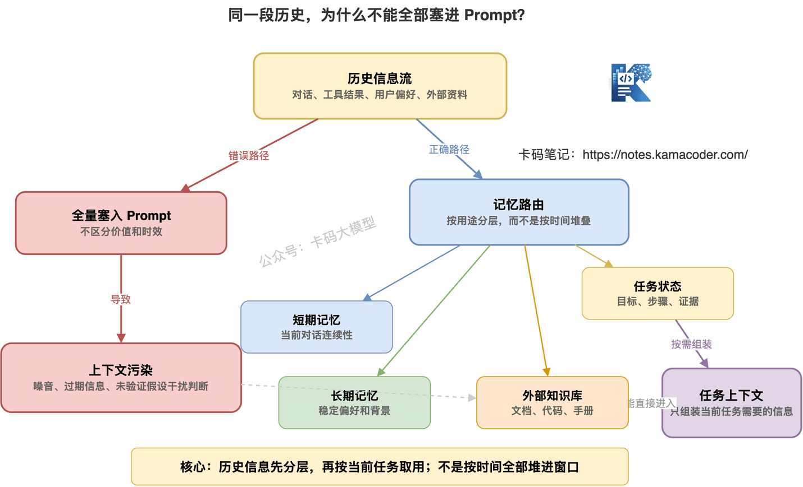
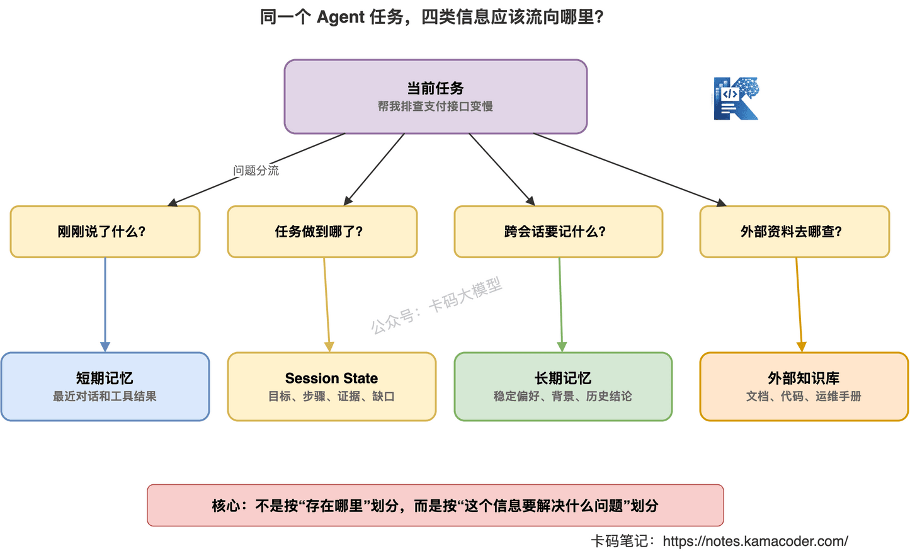
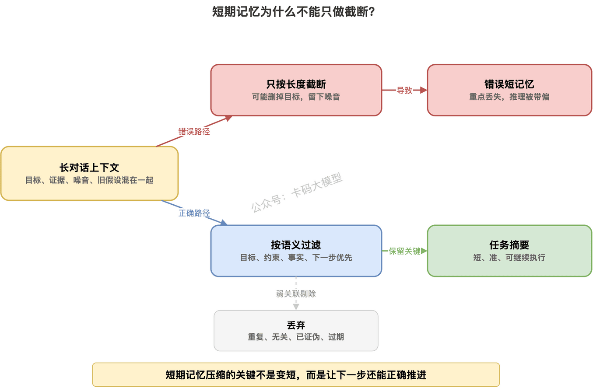
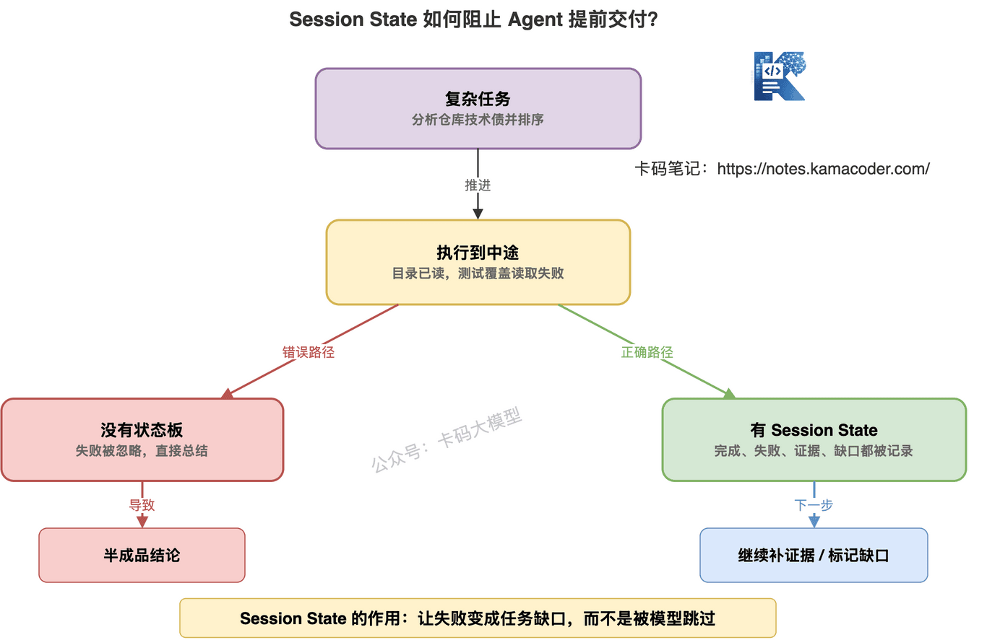
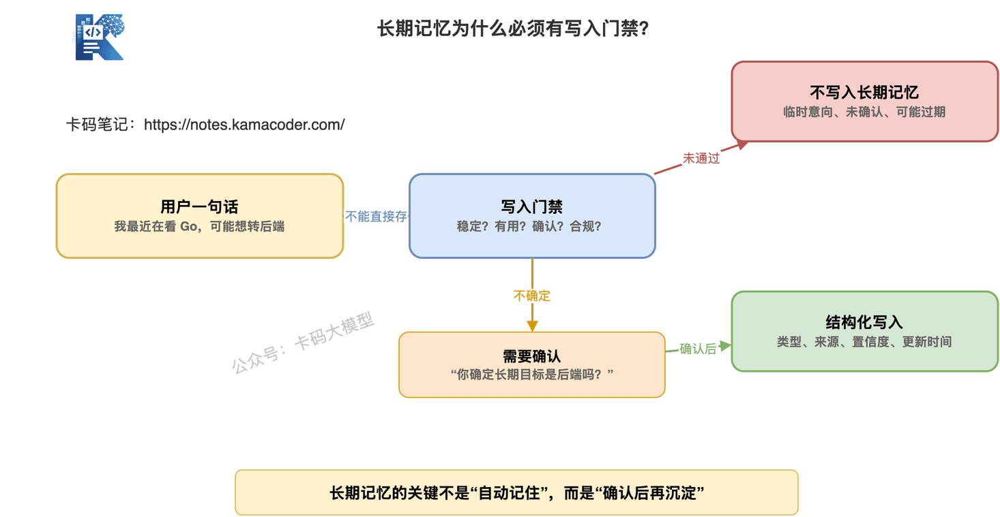
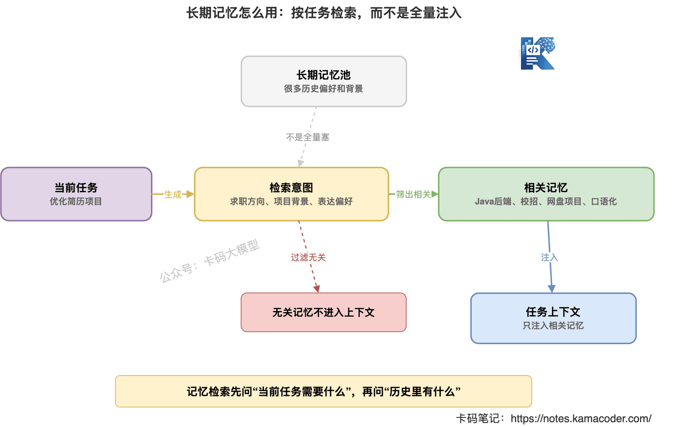
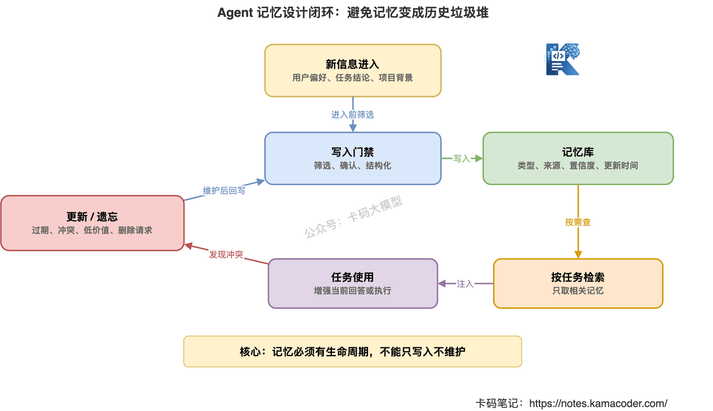

# Пам'ять агента: як пов'язані короткострокова, довгострокова пам'ять і RAG?

У попередній статті ми розглядали, [чому агенти так легко ламаються](./agent_failure_modes.md).

Суть в одному реченні: **якщо агент діє самостійно, у нього обов'язково мають бути інженерні запобіжники.**

Нескінченні цикли, хибні виклики, забруднення контексту, вихід за межі дозволів — усе це по суті пов'язане з керуванням станом.

Якщо агент не знає, що він уже зробив, на якому кроці перебуває, яка інформація достовірна, а яка лише припущення, він дуже легко збивається.

Тож продовжимо цю лінію:

**як саме проєктувати пам'ять агента.**

Почувши про пам'ять агента, багато хто одразу питає:

«Це коли всю історію листування зберігають і наступного разу знову подають моделі?»

Ні.

Це надто грубе розуміння.

Якщо справді так зробити, система швидко впреться в три проблеми:

- контекст не вміщає всього;
- шуму стає дедалі більше;
- стара й нова інформація суперечать одна одній.

Тож запам'ятайте одразу:

**Пам'ять агента — це не запихання всієї історії в промпт, а збереження, пошук, оновлення й забування цінної інформації у відповідний спосіб.**

У цій статті розберемо, як пов'язані короткострокова пам'ять, довгострокова пам'ять, RAG і Session State.



## 1. Спершу з'ясуймо, навіщо агенту пам'ять

Звичайній системі питань-відповідей складна пам'ять не обов'язкова.

Користувач спитав.

Модель відповіла.

Кінець.

З агентом інакше.

Агент зазвичай виконує багатокрокові задачі.

Скажімо, користувач каже:

«Проаналізуй технічний борг цього проєкту й дай рекомендації щодо виправлення за пріоритетами».

Агенту, можливо, доведеться:

1. Подивитися структуру каталогів.
2. Потім ключові модулі.
3. Потім знайти складні функції.
4. Потім подивитися покриття тестами.
5. Потім підсумувати пріоритети.

Протягом цього процесу він мусить пам'ятати:

- яка була початкова мета користувача;
- які каталоги вже переглянуто;
- у яких файлах є проблеми;
- які докази підтримують поточне судження;
- які кроки провалилися;
- які висновки поки що є лише тимчасовими припущеннями.

Без пам'яті агент забуватиме по ходу.

Щойно знайдений доказ загубиться далі.

Інструмент, який уже провалився, викликатиметься знову.

Вимога, яку користувач підкреслив, буде проігнорована.

Це одна з причин, чому багато агентів виглядають «нестабільними».

**Річ не в тому, що агент не вміє міркувати, а в тому, що йому бракує керованої пам'яті задачі.**

## 2. Пам'ять агента ділиться щонайменше на чотири типи

Говорячи про пам'ять агента, не варто одразу згадувати векторні бази.

Спершу розділімо її за призначенням.

Практичний поділ такий: **короткострокова пам'ять, Session State, довгострокова пам'ять і зовнішня база знань.**

Вони розв'язують різні проблеми.

### 1. Короткострокова пам'ять: що щойно сталося в поточній розмові

Короткострокова пам'ять — це зазвичай контекст поточної розмови.

Скажімо, останні кілька раундів, останні виклики інструментів, щойно отримані результати.

Її особливості:

- короткий час життя;
- сильний зв'язок із поточною задачею;
- зазвичай лежить у контекстному вікні;
- легко впирається в обмеження довжини вікна.

Наприклад, користувач раніше сказав:

«Мій проєкт — Java-бекенд, переважно на Spring Boot».

А потім питає:

«То як мені описати цей проєкт у резюме?»

Модель має пам'ятати попередню репліку.

Це і є короткострокова пам'ять.

### 2. Session State: на якому кроці зараз задача

Session State — це не історія листування.

Це структурований стан.

Наприклад:

```json
{
  "goal": "проаналізувати технічний борг репозиторію",
  "completed_steps": ["прочитано структуру каталогів", "визначено ключові модулі"],
  "failed_steps": [
    {
      "step": "читання звіту про покриття тестами",
      "reason": "файл не існує"
    }
  ],
  "evidence": ["core/payment/PayService.java — надто довгий метод"],
  "missing_info": ["бракує даних про покриття тестами"]
}
```

Як бачите, тут не нагромаджено початковий текст розмови.

Тут записано стан задачі.

Для агента це особливо важливо.

Бо у багатокрокових задачах найгірше — «зробити половину й почати підсумовувати».

Session State нагадує йому:

які кроки виконано;

які докази отримано;

якої інформації бракує;

чи можна вже видавати результат.

### 3. Довгострокова пам'ять: стабільна інформація, що переживає сесії

Довгострокова пам'ять існує між сесіями.

Скажімо, сталі вподобання користувача:

- користувач переважно пише на Java;
- користувач готується до пошуку роботи;
- користувач хоче, щоб у резюме підкреслювалися складні місця проєктів;
- користувач не любить надто канцелярський стиль.

Або сталий стан якогось робочого агента:

- цей клієнт має високий пріоритет;
- типова точка входу для діагностики цього проєкту;
- стандарти коду цієї команди.

Особливості довгострокової пам'яті:

- використовується не щоразу;
- записується лише після відбору;
- потребує оновлення й забування;
- не можна записувати тимчасову інформацію як сталий факт.

Чого довгострокова пам'ять боїться найбільше?

**Того, що туди складатимуть усі розмови.**

Тоді це вже не пам'ять.

Це смітник.

### 4. Зовнішня база знань: матеріали, до яких агент може звернутися

Зовнішню базу знань часто реалізують через RAG.

Наприклад:

- документація компанії;
- документація API;
- посібники до продуктів;
- репозиторії коду;
- банк питань до співбесід;
- операційні інструкції.

Це не «пам'ять про користувача».

Це зовнішнє джерело знань.

Агент за потреби знаходить релевантні матеріали й кладе їх у контекст.

Тож RAG — це радше:

**зовнішня бібліотека агента.**

А довгострокова пам'ять — радше:

**сталий запис агента про користувача, задачі й попередній досвід.**



## 3. Короткострокова пам'ять не має бути якомога довшою

Багато хто вважає:

«Що більше контекстне вікно, то сильніша короткострокова пам'ять».

Це правда лише наполовину.

Велике вікно справді вміщає більше історії.

Але вмістити більше не означає отримати кращий результат.

Бо в контексті багато шуму:

- тимчасові здогади користувача;
- нерелевантні логи, повернені інструментами;
- напрями, уже спростовані;
- застарілі проміжні висновки;
- повторюваний вміст розмови.

Якщо звалити все це разом, модель лише заплутається.

У попередній статті ми говорили про забруднення контексту.

Що довша короткострокова пам'ять, то легше його отримати.

Тож короткострокова пам'ять має робити дві речі.

**Перше: зберігати інформацію, релевантну поточній задачі.**

Мету, обмеження, останні результати інструментів, ключові докази.

**Друге: викидати те, що вже не потрібне.**

Повтори, нерелевантні логи, спростовані гіпотези.

Короткострокова пам'ять — це не повний текст розмови.

Вона має бути радше «конспектом поточної задачі».



Приклад.

Користувач просить агента з'ясувати, чому гальмує ендпоїнт.

Початкова розмова може бути довгою:

- користувач припускає, що проблема в базі;
- агент перевірив базу;
- з базою все гаразд;
- агент перевірив історію релізів;
- знайшов реліз о 22:05;
- агент перевірив логи;
- виявив таймаути колбеків стороннього сервісу.

А в короткостроковій пам'яті варто зберегти ось це:

> «Мета: знайти причину гальмування ендпоїнта. Напрям із базою даних відкинуто. О 22:05 був реліз. Після 22:10 зросли таймаути сторонніх колбеків. Наступний крок — перевірити, чи не змінив реліз логіку повторів колбеків».

Це значно корисніше, ніж запхати туди весь текст розмови.

## 4. Session State пасує багатокроковим задачам краще за історію розмови

Коли агент виконує багатокрокову задачу, найважливіше не «пам'ятати, що було сказано».

А «пам'ятати, як просувається задача».

У цьому й цінність Session State.

Скажімо, агент для діагностики збоїв може підтримувати такий стан:

```json
{
  "goal": "знайти причину гальмування платіжного ендпоїнта",
  "current_hypothesis": "таймаути сторонніх платіжних колбеків можуть спричиняти гальмування",
  "confirmed_facts": [
    "після 22:10 P95 для /api/pay зросла з 300 мс до 3,8 с",
    "о 22:05 викотили payment-service v2.3.1"
  ],
  "rejected_hypotheses": [
    "гальмування спричинене повільними запитами до бази"
  ],
  "next_actions": [
    "перевірити, чи змінює v2.3.1 логіку повторів колбеків",
    "запитати розподіл кодів помилок сторонніх колбеків"
  ]
}
```

Це значно корисніше за довгу розмову.

Бо інформацію розкладено на:

- мету;
- гіпотезу;
- факти;
- відкинуті напрями;
- наступні дії.

Агент може звірятися з цим на кожному кроці.

А не сподіватися, що модель сама знайде головне в довгому контексті.



Багато агентів у продакшн-системах справді мусять керувати станом.

Інакше, щойно задача перевищує три-п'ять кроків, усе розсипається.

Особливо в таких сценаріях:

- діагностика збоїв;
- аналіз кодової бази;
- підсумовування довгих документів;
- звіти з аналізу даних;
- багатораундова обробка звернень;
- підготовка до співбесід і правки резюме.

Самого лише conversation buffer тут замало.

Потрібен структурований стан.

## 5. У довгострокову пам'ять не можна писати напряму — потрібен фільтр

Довгострокова пам'ять звучить спокусливо.

Пам'ятати все, що казав користувач.

Наступного разу зустріти його як старого знайомого.

Але інженерно найстрашніше ось що:

**записати тимчасову інформацію як сталий факт.**

Скажімо, користувач сьогодні каже:

«Я зараз дивлюся в бік Go».

Це довгострокова пам'ять?

Не обов'язково.

Можливо, він просто сьогодні спитав із цікавості.

Або користувач каже:

«Я, мабуть, шукатиму бекенд».

Це довгострокова пам'ять?

Теж не обов'язково.

Це нестійкий намір.

Якщо агент одразу запише «мета користувача — бекенд-розробка», він може вводити в оману надалі.

Тож перед записом у довгострокову пам'ять потрібен фільтр.

Щонайменше чотири питання.

**Перше: чи ця інформація стала в часі?**

«Користувач переважно пише на Java» пасує довгостроковій пам'яті краще, ніж «користувач сьогодні спитав про Go».

**Друге: чи буде вона корисною згодом?**

«Користувач любить розмовні пояснення» — корисно.

«Користувач поставив питання сьогодні о дев'ятій вечора» — зазвичай ні.

**Третє: чи була вона підтверджена?**

Пряма заява користувача «я шукаю саме Java-бекенд» надійніша за здогад моделі «користувач, можливо, шукає Java».

**Четверте: чи не стосується вона приватних або чутливих даних?**

Чутливе не можна записувати абияк.

Потрібні права доступу, мета використання й механізм видалення.



Запис у довгострокову пам'ять має бути схожим на запис у базу даних.

А не на автоматичне дописування історії розмови.

Мають бути правила запису, правила оновлення, правила видалення.

Інакше вона з часом лише замулюватиметься.

## 6. Як шукати в довгостроковій пам'яті: не запихати її всю назад у контекст

Коли довгострокову пам'ять збережено, постає питання, як її використовувати.

І тут роблять ще одну помилку:

«Якщо є довгострокова пам'ять, то подаваймо щоразу в промпт усю пам'ять про користувача».

Так не можна.

Це та сама проблема, що й запихання всієї історії розмови.

Довгострокову пам'ять теж треба шукати за потреби.

Скажімо, користувач питає:

«Допоможи покращити опис цього проєкту в резюме».

Корисною довгостроковою пам'яттю тут буде:

- мета користувача — Java-бекенд;
- користувач готується до пошуку роботи;
- користувач хоче, щоб опис проєкту звучав як відповідь на співбесіді;
- у користувача вже є досвід із Redis.

А от це вже зайве:

- користувач колись питав про MCP;
- користувач колись питав про розумні вказівники в C++;
- користувачеві подобається якийсь конкретний продукт.

Тож процес використання довгострокової пам'яті має бути таким:

1. За поточною задачею сформувати намір пошуку.
2. Знайти релевантні записи в довгостроковій пам'яті.
3. Відфільтрувати застарілі записи й записи з низькою впевненістю.
4. Покласти в контекст лише ключові.
5. Після формування відповіді за потреби оновити пам'ять.



Це дуже схоже на RAG.

Але об'єкт інший.

Довгострокова пам'ять шукає вподобання користувача, історію задач, сталий стан.

RAG шукає зовнішні знання, документи, матеріали.

Ось у чому різниця.

## 7. RAG — це не довгострокова пам'ять агента

Це важливо.

Багато хто змішує RAG і довгострокову пам'ять.

«Я склав історію розмов у векторну базу й шукаю там — хіба це не довгострокова пам'ять?»

Не зовсім.

Векторна база — це лише спосіб зберігання й пошуку.

Це не дорівнює проєктуванню пам'яті.

Якщо ви закинете у векторну базу всі розмови дослівно, при пошуку звідти дістануться уривки.

Це буде «пошук по історії», а не обов'язково «довгострокова пам'ять».

Довгострокова пам'ять має бути дистильованою інформацією.

Скажімо, початкова розмова була така:

«Я зараз готуюся на Java-бекенд, проєкт — хмарне сховище файлів, і хочу, щоб резюме не звучало як сухий перелік дій».

Довгострокову пам'ять варто записати так:

```json
{
  "type": "user_profile",
  "content": "користувач готується за напрямом Java-бекенд",
  "confidence": 0.95,
  "source": "пряма заява користувача",
  "updated_at": "2026-05-26"
}
```

А не закидати туди весь абзац розмови.

RAG краще пасує зовнішній базі знань:

- документація компанії;
- опис продуктів;
- довідники API;
- репозиторії коду;
- операційні інструкції;
- банк питань до співбесід.

Довгострокова пам'ять краще пасує для запису:

- вподобань користувача;
- цілей користувача;
- висновків із попередніх задач;
- підтвердженого контексту проєкту;
- стану, який агенту треба зберігати між сесіями.


Тож на співбесіді не кажіть:

«Ми реалізували довгострокову пам'ять через векторну базу».

Це надто поверхово.

Треба додати:

> «Векторна база — лише шар пошуку. Довгострокова пам'ять ще потребує правил запису, типів пам'яті, оцінок впевненості, часу оновлення, обробки суперечностей і механізму видалення».

Ось це вже схоже на інженерну відповідь.

## 8. Пам'ять має вміти й забувати

Пам'яті не має бути якомога більше.

Агент має вміти забувати.

Інакше в довгостроковій пам'яті виникнуть три проблеми.

### 1. Застарівання

Торік користувач готувався на Java-бекенд.

Цього року перейшов у застосунки на LLM.

Якщо агент і далі радить у контексті Java-бекенду, це помилка.

### 2. Суперечності

Раніше користувач казав, що хоче в ML.

Потім прямо сказав, що ні, і йде в прикладну розробку.

Стара й нова пам'ять суперечать одна одній.

Тут не можна подавати моделі обидві.

Треба оновити стару або знизити її вагу.

### 3. Шум

У довгостроковій пам'яті накопичилося забагато малоцінного.

І при пошуку звідти витягується купа нерелевантного.

Тож система пам'яті потребує механізму забування.

Щонайменше:

- строк придатності;
- оцінка впевненості;
- час оновлення;
- злиття суперечностей;
- видалення на вимогу користувача;
- очищення малоцінних записів.


Пам'ять — це не склад.

Не місце, куди все лише додається.

Це радше система стану, яку постійно обслуговують.

## 9. Як спроєктувати пам'ять агента надійніше

Якщо ви справді проєктуєте пам'ять агента в проєкті, скористайтеся такою рамкою.

### 1. Спершу визначте типи пам'яті

Не робіть одну-єдину таблицю `memory`.

Розділіть щонайменше:

- вподобання користувача;
- цілі користувача;
- контекст проєкту;
- стан задачі;
- висновки з попередніх задач;
- посилання на зовнішні знання.

Для різних типів правила запису різні.

Вподобання можна зберігати довго.

Стан задачі, можливо, видаляється після завершення сесії.

Посилання на зовнішні знання мають лишатися в документах RAG.

### 2. Далі визначте правила запису

Яку інформацію можна писати?

Яку не можна?

Яка потребує підтвердження користувача?

Яка є лише тимчасовим станом?

Цей крок дуже важливий.

Без правил запису довгострокова пам'ять швидко забрудниться.

### 3. Під час пошуку фільтруйте за задачею

Не подавайте все гуртом.

Обирайте релевантну пам'ять за поточною задачею.

Для задачі з покращення резюме шукайте напрям пошуку роботи, контекст проєктів, вподобання щодо стилю.

Для задачі з діагностики збою — контекст сервісу, попередні інциденти, типові точки входу в діагностику.

### 4. Після використання оновлюйте пам'ять

Змінилася мета користувача — оновіть.

Спростовано старий висновок — знизьте його вагу.

Малоцінна пам'ять довго не використовується — приберіть.

Користувач попросив видалити — видаліть.

Ось це і є повний цикл.



## 10. Як відповідати про пам'ять агента на співбесіді

Про пам'ять агента питають дедалі частіше.

Особливо якщо у вашому резюме є «довгострокова пам'ять», «персоналізований агент» чи «керування контекстом» — інтерв'юер обов'язково вчепиться.

**Питання: чим короткострокова пам'ять агента відрізняється від довгострокової?**

Можна так:

> «Короткострокова пам'ять обслуговує поточну сесію й поточну задачу: останні раунди розмови, результати викликів інструментів, конспект поточної задачі. Вона зазвичай обмежена контекстним вікном. Довгострокова пам'ять зберігає сталу інформацію між сесіями: вподобання користувача, довгострокові цілі, контекст проєктів, висновки з попередніх задач. У довгострокову пам'ять не можна складати всі розмови — потрібні відбір, структурування, оновлення й забування».

**Питання: чим Session State відрізняється від історії розмови?**

Можна так:

> «Історія розмови — це сирий діалог із великою кількістю шуму. Session State — структурований стан задачі, де записані мета, виконані кроки, невдалі кроки, докази, гіпотези й наступні дії. Для багатокрокових задач Session State надійніший за звичайний conversation buffer, бо запобігає обриву задачі, повторним викликам і завчасній видачі результату».

**Питання: як пов'язані RAG і довгострокова пам'ять?**

Можна так:

> «RAG зазвичай шукає зовнішні знання — документи, код, базу знань. Довгострокова пам'ять зберігає вподобання користувача, історію задач і сталий стан. Обидва можуть використовувати векторний пошук, але семантика різна. Векторна база — це лише спосіб зберігання й пошуку, а не сама довгострокова пам'ять. Довгострокова пам'ять ще потребує правил запису, оцінок впевненості, часу оновлення, обробки суперечностей і механізму видалення».

**Питання: як не дати довгостроковій пам'яті забруднитися?**

Можна так:

> «Не можна автоматично писати всі розмови в довгострокову пам'ять. Перед записом треба оцінити, чи інформація стала, чи буде корисною, чи підтверджена користувачем, чи відповідає вимогам до даних. Кожен запис має мати тип, джерело, оцінку впевненості й час оновлення. Коли нова інформація суперечить старій, стару треба оновити або знизити її вагу, а застарілі й малоцінні записи — прибирати».

Такої відповіді загалом достатньо.

## 11. Не плутайте «пам'ятати все» з інтелектом

Щодо пам'яті агента є поширена хиба.

Здається, що чим більше він пам'ятає, то розумніший.

Ні.

По-справжньому хороша пам'ять агента — це не пам'ятати все.

А ось що:

**потрібне — запам'ятати;**

**те, що треба знайти, — знайти;**

**те, що треба забути, — забути;**

**те, що треба підтвердити, — підтвердити.**

Короткострокова пам'ять забезпечує зв'язність поточної розмови.

Session State відстежує просування поточної задачі.

Довгострокова пам'ять зберігає сталу інформацію між сесіями.

RAG шукає зовнішні знання.

У кожного з цих чотирьох своя роль.

Змішаєте їх — вийде каша.

Тож годі казати:

«Довгострокова пам'ять — це коли всі розмови складають у векторну базу».

Це надто поверхово.

Надійна система пам'яті агента має вміти записувати, шукати, використовувати, оновлювати й забувати.

Якщо ви можете пояснити цей механізм, ваш проєкт з агентом справді виглядає як результат інженерного проєктування.
