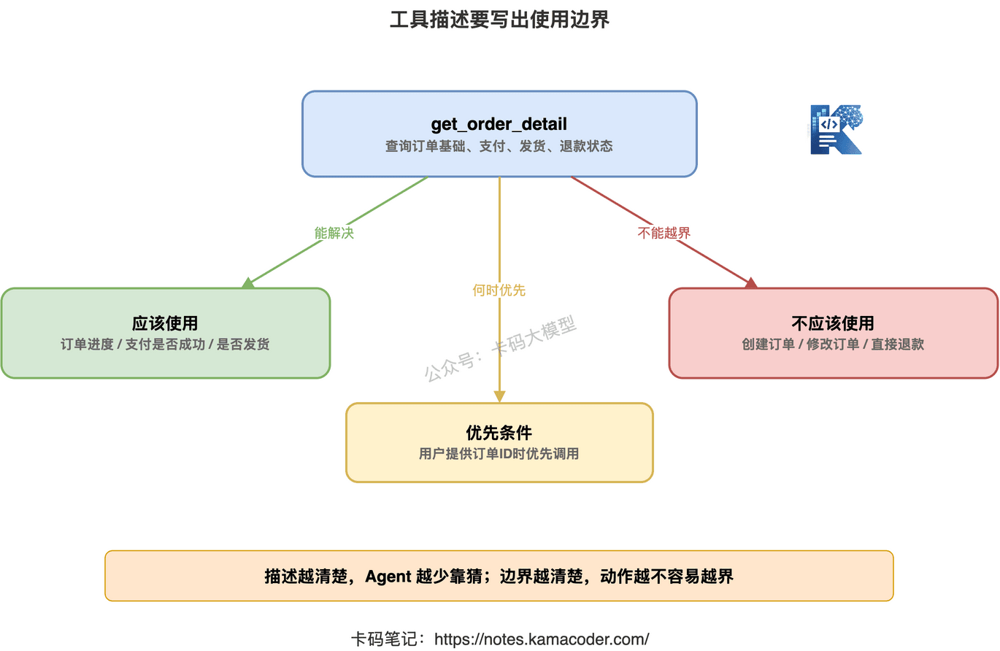
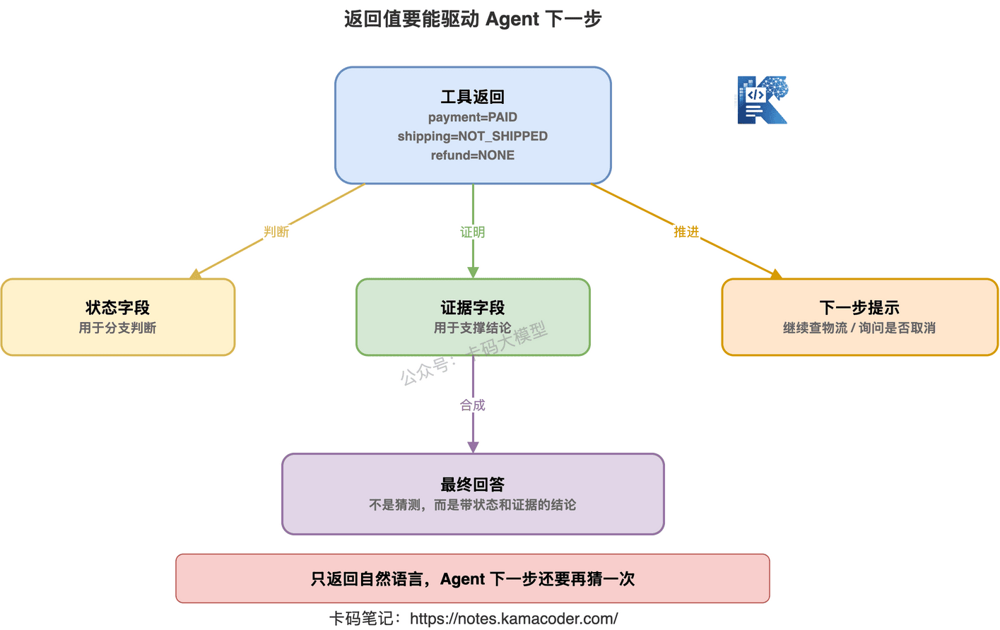
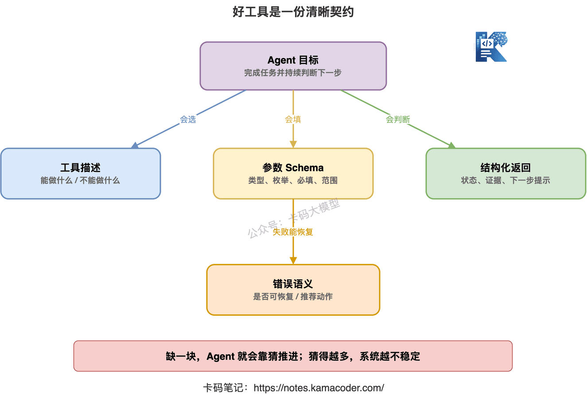
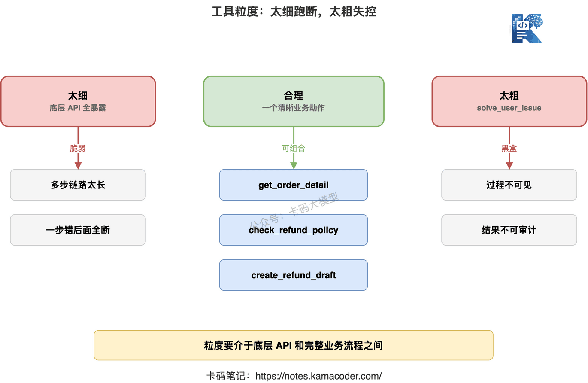
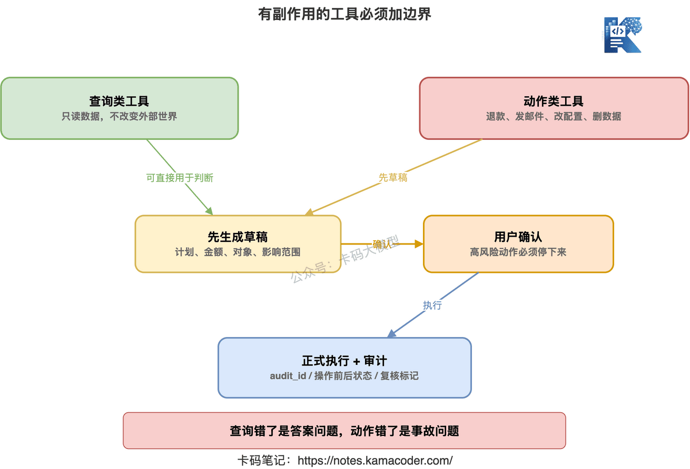

# Дизайн інструментів визначає стелю агента

У попередніх статтях ми розібрали базову логіку агентів.

[Що таке агент насправді](./agent_intro.md) — суть: **агент не краще спілкується, а вміє безперервно діяти задля мети.**

[ReAct, Reflection, планування з виконанням](./react_reflection_planning.md) — суть: **агент має міркувати по ходу дії, а після завершення ще й перевіряти.**

[Агент проти workflow](./agent_vs_workflow.md) — суть: **якщо процес можна прописати жорстко, не тягніть агента; динамічні рішення потрібні лише там, де шлях невизначений.**

Але щойно ви беретеся робити агента насправді, одразу трапляється наступна пастка:

«Я вже підключив агенту інструменти — чому він досі часто обирає не той, абияк заповнює параметри, видає незрозумілі результати й дедалі більше збивається?»

Не поспішайте звинувачувати модель.

У багатьох агентів проблема не в моделі, а в надто поганому дизайні інструментів.

**Дизайн інструментів прямо визначає стелю можливостей агента.**

Дасте йому розмитий інструмент — він лише вгадуватиме.

Дасте купу інструментів безладної гранулярності — він обиратиме навмання.

Дасте інструмент, що повертає суцільний природний текст, — він не зможе стабільно вирішити, що робити далі.

Дасте інструмент запису без меж прав — рано чи пізно він влаштує аварію в продакшні.

Ця стаття саме про те, **як проєктувати інструменти для агента.**


## 1. Інструменти — це не перелік API, а межі дій агента

Багато хто підходить до виклику інструментів так:

«На бекенді вже є купа ендпоїнтів — зареєструю їх усі для великої моделі, та й по всьому».

Не по всьому.

Саме звідси й починається втрата контролю в багатьох проєктах з агентами.

API бекенду створені для програмістів.

Інструменти агента створені для ухвалення рішень моделлю.

Це різні речі.

Програміст, викликаючи API, тримає в голові бізнесовий сенс, момент виклику, джерело параметрів, обробку винятків.

Модель цього не знає.

Вона бачить лише назву інструмента, його опис, схему параметрів і попередній контекст.

Якщо ви кинете їй купу внутрішніх ендпоїнтів як є, наприклад:

- `queryData`
- `getInfo`
- `submit`
- `updateStatus`
- `doAction`

вона зможе лише гадати.

Вона не знає, чи `queryData` шукає замовлення, користувачів, логи чи фінансові дані.

Вона не знає, чи `submit` надсилає чернетку, чи одразу відправляє на погодження.

Вона не знає, чи має `updateStatus` реальний вплив на бізнес.

Тож перший принцип дизайну інструментів такий:

**Інструмент — це не викладення API моделі, а загортання керованої дії в можливість, яку модель здатна зрозуміти, обрати й після якої може відновитися.**

Речення довге, але ключове.

Хороший інструмент має відповідати щонайменше на чотири питання:

1. Що цей інструмент уміє?
2. Коли його треба застосовувати?
3. Коли його застосовувати не треба?
4. Чи зможе агент після виклику зробити висновок за результатом?

Якщо на ці чотири питання не відповісти чітко, агент почне імпровізувати.

Імпровізація звучить інтелектуально.

У продакшні це називається нестабільністю.

## 2. Опис інструмента: не пишіть просто «запит інформації про замовлення»

Почнімо з того, що найчастіше ігнорують, — з опису інструмента.

Багато описів написані вкрай недбало:

```json
{
  "name": "get_order",
  "description": "Запит інформації про замовлення"
}
```

Цей опис надто поверховий.

Прочитавши його, модель знає лише, що інструмент щось шукає про замовлення.

Але не знає:

- шукається базова інформація чи ще й статус оплати, доставки, повернення;
- чи можна ним скористатися, коли користувач дав лише номер телефону;
- що повернеться, якщо замовлення не існує;
- для діагностики яких проблем він пасує;
- чи може він замінити інструмент повернення коштів.

Для людини «запит інформації про замовлення», можливо, і достатньо.

Для агента — ні.

Бо агент за описом визначає, «чи варто застосувати цей інструмент наступним кроком».

Кращий опис має бути таким:

```json
{
  "name": "get_order_detail",
  "description": "За ID замовлення повертає базовий статус, статус оплати, статус відправлення та статус повернення коштів. Підходить для питань користувача про перебіг замовлення, чи пройшла оплата, чи відправлено товар, чи повернуто кошти. Не використовується для створення замовлення, зміни замовлення або ініціювання повернення коштів."
}
```

Різниця очевидна.

Хороший опис інструмента не лише каже, «що він уміє», а й чітко окреслює **межі застосування**.

Особливо важливі три типи інформації.

**Перше: яку проблему інструмент розв'язує.**

Скажімо, «запит статусу замовлення», «запит затримки ендпоїнта», «пошук документів у базі знань», «створення чернетки заявки».

Не пишіть порожнє на кшталт «обробка запитів користувача».

**Друге: чого інструмент не робить.**

Наприклад, інструмент запиту не змінює дані.

Інструмент чернетки не надсилає повідомлення одразу.

Інструмент перевірки складу не показує остаточну доступну для покупки кількість.

Це «чого не робить» дуже важливе.

Бо найгірше для агента — переплутати схожі інструменти.

**Третє: коли його застосовувати передусім.**

Наприклад:

«Застосовувати передусім, коли користувач надав ID замовлення».

«Для локалізації проблем із продуктивністю ендпоїнта спершу цим інструментом визначити період аномалії».

«Якщо пошук у базі знань нічого не дав, не викликати повторно, а перейти до уточнювального питання користувачеві».

Такі формулювання прямо впливають на вибір інструмента моделлю.

Опис інструмента — це не коментар.

**Опис інструмента — це інструкція з експлуатації для агента.**



## 3. Дизайн параметрів: не звалюйте брудну роботу на модель

Опис інструмента визначає, чи обере модель правильний інструмент.

Дизайн параметрів визначає, чи скористається вона ним правильно.

У багатьох інструментів агента параметри спроєктовані грубо:

```json
{
  "name": "search_logs",
  "parameters": {
    "query": "string"
  }
}
```

Виглядає гнучко.

Насправді небезпечно.

Бо ви звалили на модель усю брудну роботу.

Модель має сама вирішити:

- який сервіс перевіряти;
- за який період;
- який рівень логування;
- за якими ключовими словами;
- скільки записів повернути;
- чи фільтрувати за traceId.

І тут легко виникають проблеми.

Вона може написати час як «учора ввечері».

Може помилитися в назві сервісу.

Може задати надто широкий діапазон, і інструмент відвалиться за таймаутом.

Може задати надто вузький — і нічого не знайти.

Кращий підхід — розкласти параметри чітко:

```json
{
  "name": "search_service_logs",
  "description": "Повертає логи вказаного сервісу за фіксований проміжок часу. Використовується для діагностики помилок ендпоїнтів, таймаутів і аномальних ланцюжків викликів.",
  "parameters": {
    "type": "object",
    "properties": {
      "service_name": {
        "type": "string",
        "description": "Назва сервісу, наприклад payment-service"
      },
      "start_time": {
        "type": "string",
        "description": "Початок періоду, формат YYYY-MM-DD HH:mm:ss"
      },
      "end_time": {
        "type": "string",
        "description": "Кінець періоду, формат YYYY-MM-DD HH:mm:ss"
      },
      "level": {
        "type": "string",
        "enum": ["ERROR", "WARN", "INFO"],
        "description": "Рівень логування; для діагностики збоїв передусім ERROR або WARN"
      },
      "keyword": {
        "type": "string",
        "description": "Необов'язкове ключове слово: шлях ендпоїнта, код помилки або traceId"
      }
    },
    "required": ["service_name", "start_time", "end_time", "level"]
  }
}
```

Тепер агент не вигадає довільний великий рядок.

Він мусить заповнити параметри за структурою.

Ось у чому цінність схеми параметрів.

Вона не для того, щоб інтерфейс виглядав солідніше.

**Вона потрібна, щоб утримати свободу моделі в розумних межах.**


Є кілька дуже практичних принципів дизайну параметрів.

### 1. Якщо можна перелічити — перелічуйте

Рівень логування, статус замовлення, спосіб сортування, тип операції.

Якщо можна застосувати enum — не давайте моделі вільно писати рядок.

Вільний рядок виглядає гнучко, але легко породжує:

- `err`
- `error`
- `ERROR_LOG`
- `fatal`
- «помилка»

І бекенду доводиться городити сумісність.

Перелічення прибирає багато зайвої нестабільності.

### 2. Час, кількість і діапазони мають бути явними

Агент дуже любить розмиті формулювання:

- нещодавно;
- учора ввечері;
- кілька днів тому;
- подивися трохи більше.

Людина це зрозуміє, а для інструмента це нестабільно.

У параметрах краще вимагати явного формату:

- `start_time`
- `end_time`
- `limit`
- `page_size`
- `sort_by`

І додати граничні значення за замовчуванням.

Скажімо, запит логів повертає максимум 100 записів.

Інструмент пошуку повертає максимум 5 фрагментів документів.

Діапазон запиту до моніторингу не перевищує 7 днів.

Ці обмеження — не перестрахування.

Вони не дають агенту одним викликом покласти систему.

### 3. Один параметр не має нести кілька значень

Наприклад:

```json
{
  "user_input": "подивися замовлення Іваненка за вчора"
}
```

Цей параметр надто заплутаний.

У ньому змішані користувач, час, об'єкт і намір.

Інструменту доведеться ще раз це розбирати.

А якщо інструмент для розбору теж потребує великої моделі, ви нашаровуєте невизначеність удвічі.

Краще розділити:

- `user_name`
- `date`
- `query_type`

Що чіткіші параметри, то стабільніший агент.

### 4. Коли бракує ключового параметра — не давайте моделі його вигадувати

Це особливо важливо.

Користувач питає:

«Чому моє замовлення досі не відправлене?»

Але номера замовлення не дав.

Тут агент не має вигадувати номер і не має одразу викликати інструмент.

Хороший опис інструмента й системні обмеження мають підказати йому:

**якщо бракує обов'язкового параметра, спершу уточни в користувача.**

Наприклад:

«Щоб перевірити статус відправлення, потрібен ID замовлення. Підкажіть, будь ласка, його номер».

Багато агентів ламаються саме на тому, що викликають інструмент попри брак ключової інформації.

Це не розв'язання проблеми.

Це виробництво галюцинацій.

## 4. Формат відповіді: не повертайте самий лише природний текст

Багато хто зосереджується на вхідних параметрах і нехтує форматом відповіді.

Це теж легко призводить до проблем.

Скажімо, інструмент запиту замовлення повертає:

```json
{
  "result": "Замовлення успішно оплачено, зараз обробляється на складі, орієнтовна відправка завтра."
}
```

Людині все зрозуміло.

А як агенту вирішувати наступний крок?

Чи перевіряти далі доставку?

Чи повідомляти користувачеві, де оформити повернення?

Звідки йому знати, це «оплачено» чи «в дорозі»?

Якщо відповідь — суцільний природний текст, модель має розбирати його заново.

Це додає нестабільності.

Кращий формат відповіді має бути структурованим:

```json
{
  "success": true,
  "order_id": "202605190001",
  "order_status": "PROCESSING",
  "payment_status": "PAID",
  "shipping_status": "NOT_SHIPPED",
  "refund_status": "NONE",
  "estimated_shipping_time": "2026-05-20",
  "evidence": [
    "платіж PAY_8891 підтверджено",
    "статус у складській системі — очікує відвантаження"
  ]
}
```

Тепер агент може стабільно зробити висновок:

- оплату пройдено;
- ще не відправлено;
- повернення немає;
- можна повідомити користувачеві орієнтовну дату відправлення;
- якщо користувач спитає про повернення — викликати інструмент правил повернення.

Ось така відповідь придатна для споживання агентом.

У форматі відповіді інструмента має бути щонайменше три типи інформації.



**Перше: поля стану.**

Наприклад:

- `success`
- `status`
- `error_code`
- `order_status`
- `risk_level`

Поля стану дозволяють агенту розгалужувати логіку.

**Друге: поля доказів.**

Наприклад:

- джерело даних;
- знайдені документи;
- період запиту;
- показники моніторингу;
- ID фрагмента логу.

Поля доказів роблять так, що підсумкова відповідь агента не є здогадом.

Він може сказати, «на підставі чого» дійшов висновку.

**Третє: підказка наступного кроку.**

Наприклад:

```json
{
  "suggested_next_actions": [
    "якщо користувач питає про номер накладної — викликати get_shipping_detail",
    "якщо користувач просить скасувати замовлення — спершу викликати check_cancel_policy"
  ]
}
```

Це поле не обов'язкове, але в складних агентах дуже корисне.

Воно не вирішує за агента, а дає йому надійну підказку щодо дії.

Особливо в бізнес-системах, де різним станам відповідають різні подальші дії.

Записати ці підказки у відповідь інструмента значно надійніше, ніж дати моделі вигадувати їх з нуля.



## 5. Гранулярність інструментів: надто дрібні рвуться, надто великі виходять з-під контролю

Гранулярність — питання, над яким у проєктуванні агентів вагаються найбільше.

Робити інструменти дрібнішими чи більшими?

Відповідь: жодна крайність не годиться.

### 1. Надто дрібні інструменти змушують агента ухвалювати купу примітивних рішень

Скажімо, ви дали агенту такий набір:

- `get_user_id_by_phone`
- `get_order_ids_by_user_id`
- `get_order_base_info`
- `get_payment_info`
- `get_shipping_info`
- `get_refund_info`

Кожен окремо виглядає нормально.

Але якщо користувач просто питає:

«Чому те, що я купив, досі не відправили?»

агенту доведеться зробити п'ять-шість викликів поспіль.

Якщо на будь-якому кроці параметр буде хибним, результат порожнім або стан не запишеться — далі все обірветься.

Надто дрібні інструменти перетворюють агента на крихкий оркестратор процесу.

Модель мусить робити забагато механічних кроків.

А це не її сильна сторона.

### 2. Надто великі інструменти не дають агенту бачити процес

Інша крайність:

- `handle_order_problem`
- `solve_user_issue`
- `process_after_sales`

Такі інструменти надто великі.

Після виклику агент не знає, що саме всередині відбулося.

Повернулося «оброблено успішно» — а в чому саме успіх, незрозуміло.

Сталася помилка — і незрозуміло, чи замовлення не існує, чи оплата не пройшла, чи бракує товару, чи проблема з доставкою.

З надто великими інструментами агенту на вигляд легше.

Але система стає чорною скринькою.

Непояснюваною й незручною для налагодження.

### 3. Розумна гранулярність: одна чітка бізнес-дія

Розумна гранулярність така:

**один інструмент виконує одну чітку бізнес-дію й повертає структурований результат, за яким можна зробити висновок.**

Наприклад:

- `get_order_detail` — повний статус замовлення;
- `check_refund_policy` — чи задовольняє замовлення правила повернення;
- `create_refund_draft` — створити чернетку заявки на повернення;
- `confirm_refund_submit` — подати повернення після підтвердження користувачем;
- `search_service_logs` — логи вказаного сервісу;
- `query_api_latency` — метрики затримки ендпоїнта;
- `get_deploy_records` — релізи за вказаний період.

Це ані низькорівневі інтерфейси до бази, ані суперінструменти «розв'яжи все».

Кожен спроєктований навколо однієї чіткої бізнес-дії.

Саме так агент може стабільно їх комбінувати.

На співбесіді можна сказати:

**гранулярність інструмента має бути між низькорівневим API й повним бізнес-процесом. Надто дрібна підвищує ймовірність зриву на довгому ланцюжку викликів, надто велика знижує керованість і пояснюваність.**

Це дуже зручне формулювання.



## 6. Інструментам із побічними ефектами потрібні окремі межі

Інструменти агента загалом діляться на два класи:

**інструменти запиту** та **інструменти дії**.

Інструменти запиту лише читають дані.

Перевірити замовлення, логи, моніторинг, базу знань.

Інструменти дії змінюють зовнішній світ.

Надіслати лист, подати повернення коштів, змінити конфігурацію, перезапустити сервіс, видалити файл, створити заявку.

Ці два класи в жодному разі не можна проєктувати разом.

Бо ризики цілком різні.

Помилка в запиті — щонайбільше неточна відповідь.

Помилка в дії — можлива реальна бізнесова аварія.

Тож інструментам із побічними ефектами потрібні щонайменше три шари захисту.

### 1. Розділяйте читання й запис

Не проєктуйте таких інструментів:

```json
{
  "name": "handle_refund",
  "description": "Обробка питання повернення коштів"
}
```

Це надто розмито.

«Обробка повернення» — це перевірити правила чи одразу подати повернення?

Краще розділити:

- `get_order_detail`
- `check_refund_policy`
- `create_refund_draft`
- `submit_refund_after_user_confirm`

Читання — це читання.

Запис — це запис.

Чернетка — це чернетка.

Офіційне подання — це офіційне подання.

Що чіткіші межі, то менша ймовірність аварії.

### 2. Високоризикові дії потребують підтвердження

Усе, що впливає на гроші, права, дані, сповіщення чи продакшн-середовище, агент не має вирішувати самостійно.

Наприклад:

- повернення коштів;
- списання коштів;
- видалення даних;
- зміна прав;
- надсилання офіційного листа;
- перезапуск продакшн-сервісу;
- зміна продакшн-конфігурації.

Перед такими операціями агент має спершу створити чернетку або план виконання.

Потім користувач підтверджує.

І лише після підтвердження викликається справжній інструмент виконання.

Це не «неінтелектуально».

Це інженерна безпека.

Зріла агентна система мусить знати, коли зупинитися й попросити підтвердження людини.

### 3. Відповідь інструмента має містити дані для аудиту

У відповіді інструментів дії бажано мати:

- хто виконав;
- над чим виконано;
- коли;
- стан до операції;
- стан після операції;
- ID аудиту;
- чи потрібна перевірка людиною.

Наприклад:

```json
{
  "success": true,
  "action": "CREATE_REFUND_DRAFT",
  "draft_id": "RF_DRAFT_10086",
  "order_id": "202605190001",
  "amount": 199.00,
  "requires_user_confirm": true,
  "audit_id": "AUDIT_7788"
}
```

Тоді агент у подальшій відповіді не скаже:

«Я вже повернув вам кошти».

А скаже:

«Я створив чернетку заявки на повернення; вона буде подана офіційно лише після вашого підтвердження».

Ось яку стабільність дають межі інструментів.



## 7. Повідомлення про помилку має давати агенту змогу відновитися

Багато інструментів при збої повертають одне речення:

```json
{
  "success": false,
  "message": "Системна помилка"
}
```

Агенту це не допомагає.

Він не знає, що робити далі: повторити спробу, змінити параметри, змінити інструмент чи сказати користувачеві зачекати.

Хороша відповідь про помилку має допомагати агенту відновитися.

Наприклад:

```json
{
  "success": false,
  "error_code": "MISSING_REQUIRED_PARAMETER",
  "message": "Бракує ID замовлення",
  "recoverable": true,
  "recommended_action": "ask_user_for_order_id"
}
```

Або:

```json
{
  "success": false,
  "error_code": "TIME_RANGE_TOO_LARGE",
  "message": "Період запиту логів не може перевищувати 24 години",
  "recoverable": true,
  "recommended_action": "narrow_time_range"
}
```

Так значно зрозуміліше.

Агент за типом помилки вирішує наступний крок:

- бракує параметра — уточнити в користувача;
- період завеликий — звузити діапазон;
- недостатньо прав — пояснити, що виконати неможливо;
- таймаут інструмента — обмежена кількість повторних спроб;
- бізнес-правило забороняє — не пробувати знову.

Повідомлення про помилку не має бути лише для людини.

**Повідомлення про помилку має бути і для агента.**

Якщо після збою інструмента агент не може відновитися, він дуже легко вигадає відповідь.

Багато галюцинацій починаються не з генерації моделі.

А з надто поганої відповіді інструмента.


## 8. Не давайте агенту всі інструменти одразу

Ще одна поширена хиба:

«Що більше інструментів, то сильніший агент».

Не обов'язково.

Що більше інструментів, то ширший простір вибору.

А що ширший простір вибору, то вища ймовірність помилитися.

Якщо ви дасте агенту інструменти для замовлень, доставки, повернень, фінансів, логів, моніторингу, коду, пошти, заявок і бази даних одразу, він на кожному кроці обиратиме з кількох десятків.

Для моделі це не підсилення.

Це завада.

Кращий підхід — динамічно звужувати набір інструментів під задачу.

Скажімо, агент підтримки, працюючи з питанням про замовлення, отримує лише:

- запит замовлення;
- запит доставки;
- запит правил повернення;
- створення чернетки повернення;
- інструмент уточнення в користувача.

Для діагностики збою — лише:

- запит моніторингу;
- запит логів;
- запит історії релізів;
- запит трасування;
- інструмент формування звіту.

Для роботи з кодом — лише:

- читання файлів;
- пошук по коду;
- запуск тестів;
- редагування патчем;
- зведення результатів.

Набір інструментів не має бути якомога більшим.

**Набір інструментів має відповідати поточній задачі.**

Це пов'язано з попередньою статтею про агента й workflow.

Workflow може спершу визначити тип задачі, а потім видати агенту відповідний ящик з інструментами.

Зовнішній процес відповідає за межі, внутрішній агент — за відкрите дослідження.

Так значно стабільніше.


## 9. Які симптоми видають поганий дизайн інструментів

Щоб зрозуміти, чи є проблема з інструментами, езотерика не потрібна.

Достатньо подивитися на поведінку агента.

Якщо часто трапляється наведене нижче — з високою ймовірністю справа в дизайні інструментів.

### 1. Часто обирає не той інструмент

Користувач питає про правила повернення, а агент перевіряє доставку.

Зазвичай це означає, що описи інструментів надто схожі, а межі нечіткі.

Розв'язання: чітко прописати для кожного інструмента доречні й недоречні сценарії.

### 2. Часто хибно заповнює параметри

Помилковий формат часу, хибне значення переліку, не той тип ID.

Зазвичай це означає, що схема параметрів надто вільна.

Розв'язання: посилити типи, переліки, обов'язкові поля й описи форматів.

### 3. Після виклику не знає, що робити далі

Інструмент повернув великий шматок природного тексту, і агент далі гадає.

Зазвичай це означає, що у відповіді немає полів стану й доказів.

Розв'язання: повертати структурований результат.

### 4. Постійно викликає той самий інструмент

Скажімо, у базі знань нічого не знайшлося, а він шукає ще п'ять разів поспіль.

Зазвичай це означає брак семантики невдачі й умов зупинки.

Розв'язання: позначати у відповіді причину відсутності результату й підказувати, що далі варто уточнити в користувача або змінити стратегію.

### 5. Виконує дії, яких не мав

Користувач лише консультувався щодо повернення, а агент одразу подав заявку.

Зазвичай це означає нечіткі межі читання й запису та відсутність підтвердження.

Розв'язання: розділити інструменти запиту, чернетки та офіційного виконання.

Зовні це виглядає як нестабільність агента.

А в основі часто лежить погано спроєктований контракт інструментів.

## 10. Як говорити про дизайн інструментів на співбесіді

На співбесідах про агентів це дуже часте питання.

Інтерв'юер може спитати:

**«Як спроєктовані інструменти вашого агента?»**

Не варто відповідати просто:

«Ми через Function Calling підключили кілька бізнесових API».

Надто поверхово.

Можна так:

> «Ми не віддавали моделі API бекенду напряму, а загорнули бізнес-дії в інструменти. Для кожного прописані сценарії застосування, сценарії, де він не застосовується, схема параметрів, структура відповіді й коди помилок. Інструменти запиту й інструменти виконання з побічними ефектами розділені, а високоризикові операції дозволені лише через створення чернетки з подальшим підтвердженням користувача».

Ця відповідь значно сильніша за «ми підключили API».

Інтерв'юер питає далі:

**«Як ви керуєте гранулярністю інструментів?»**

Можна так:

> «Гранулярність зазвичай десь між низькорівневим API й повним бізнес-процесом. Надто дрібна робить ланцюжок викликів занадто довгим, і помилка на будь-якому кроці все обриває; надто велика перетворює нутрощі інструмента на чорну скриньку, де агент не бачить ні стану, ні доказів. Ми зазвичай загортаємо в інструмент одну чітку бізнес-дію — отримати повний статус замовлення, перевірити правила повернення, створити чернетку повернення, — а не викладаємо купу інтерфейсів до бази».

Інтерв'юер питає ще:

**«Що робити, коли виклик інструмента провалився?»**

Можна так:

> «Інструмент не має повертати просто "системну помилку". Треба повертати структурований код помилки, ознаку відновлюваності й рекомендовану наступну дію. Бракує параметра — агент уточнює в користувача; завеликий період — звужує діапазон; недостатньо прав — зупиняється й пояснює причину. Тоді агент може відновитися після помилки, а не продовжувати вгадувати».

Якщо питають про межі безпеки:

> «Інструменти запиту й інструменти запису обов'язково розділені. Для операцій із побічними ефектами — повернення коштів, надсилання листів, зміни конфігурацій, видалення даних — спершу створюється чернетка або план виконання, а потім потрібне підтвердження користувача. У відповіді інструмента має бути інформація для аудиту, щоб можна було відстежити й відтворити дії».

Такий набір відповідей загалом показує, що ви справді проєктували агентну інженерію.

А не просто знаєте слова ReAct і Function Calling.

## 11. Чекліст дизайну інструментів

Наостанок — перелік для самоперевірки.

Проєктуючи інструменти агента, пройдіться по пунктах:

- Чи видно з назви інструмента бізнес-дію з першого погляду?
- Чи прописані в описі доречні сценарії?
- Чи прописані в описі недоречні сценарії?
- Чи достатньо чіткі обов'язкові параметри?
- Чи використано enum там, де значення можна перелічити?
- Чи задані формат і верхні межі для часу, кількості та діапазонів?
- Що робить агент, коли бракує ключового параметра: уточнює чи вигадує?
- Чи є у відповіді структуровані поля стану?
- Чи є у відповіді поля доказів?
- Чи підказує повідомлення про помилку, як відновитися?
- Чи розділені інструменти запиту й запису?
- Чи є підтвердження для високоризикових дій?
- Чи має виклик інструмента ID аудиту?
- Чи справді поточній задачі потрібно стільки інструментів?

Перелік нескладний.

Але він зупиняє дуже багато аварій.

## 12. Стеля агента захована в деталях інструментів

Беручись за агентів, багато хто спершу говорить про моделі, фреймворки й режими міркування.

Це, звісно, важливо.

Але в інженерній реальності те, чи зможе агент стабільно виконувати задачі, значною мірою залежить від дизайну інструментів.

Нечіткий опис — агент обере не те.

Надто вільні параметри — заповнить хибно.

Відповідь суцільним текстом — гадатиме на наступному кроці.

Безладна гранулярність — або обірветься, або перетвориться на чорну скриньку.

Нечіткі межі прав — рано чи пізно виконає небезпечну дію.

Тож не зводьте виклик інструментів до «підключити моделі кілька API».

**Інструменти — це і інтерфейс агента до зовнішнього світу, і межі, які стримують його поведінку.**

По-справжньому надійний агент — це не безмежна свобода моделі.

Це свобода там, де вона доречна, і межі, прописані в інструментах.

Добре спроєктовані інструменти дають агенту стелю.

Погано спроєктовані потягнуть на дно навіть найкращу модель.
