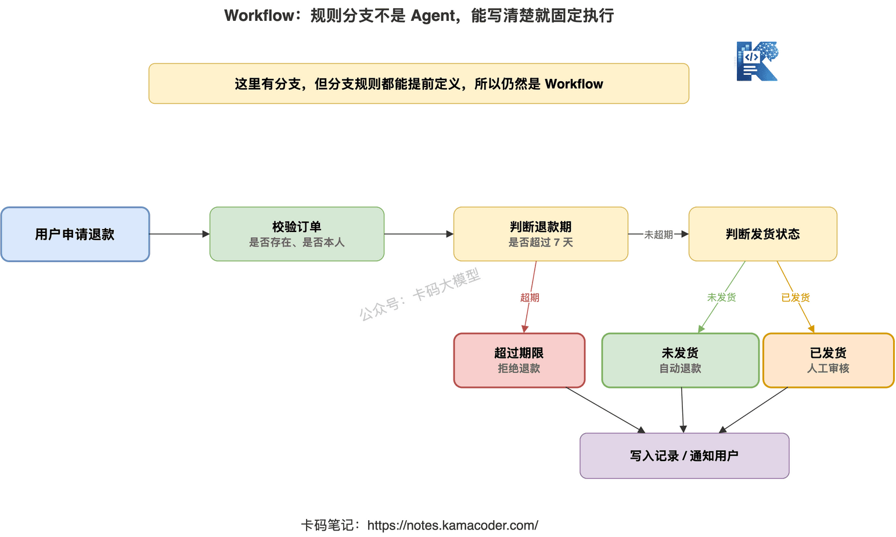
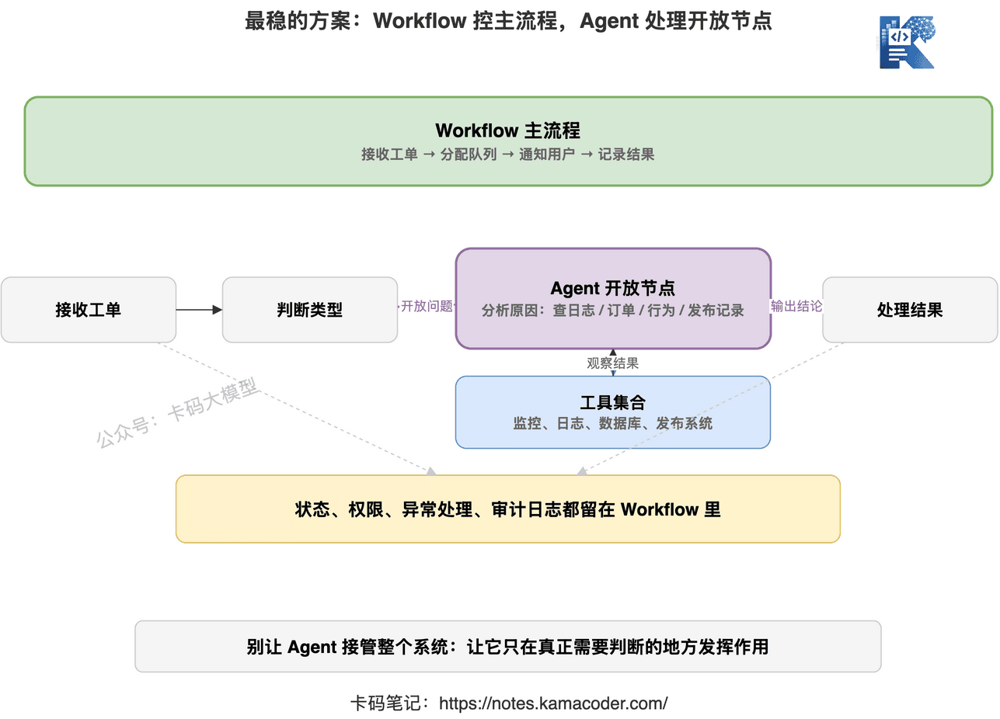

# Агент проти workflow: коли агент не потрібен зовсім?

У попередніх статтях ми розібрали основи агентів.

Перша — [що таке агент насправді](./agent_intro.md), і головне там: **агент не краще спілкується, а вміє безперервно діяти задля мети.**

Друга — [ReAct, Reflection, планування з виконанням](./react_reflection_planning.md), і головне там: **агент має міркувати по ходу дії, а після завершення ще й перевіряти.**

Але саме тут виникає нова хиба:

«Якщо агент такий потужний, то, мабуть, треба всі процеси переписати на агентів?»

Ні.

І раджу запам'ятати таке:

**Не кожна задача потребує агента. У багатьох сценаріях натягування агента лише вносить у систему нестабільність.**

Ця стаття присвячена питанню, яке часто виринає і на співбесідах, і в проєктах:

**як обирати між агентом і workflow і коли агент не потрібен зовсім?**

## 1. Одразу висновок: якщо процес можна прописати жорстко — беріть workflow

Багато хто, почувши «workflow», вважає його менш просунутим за агента.

Це хибне розуміння.

Workflow — не примітивне рішення.

У багатьох продакшн-системах саме workflow є надійнішим варіантом.

Що таке workflow?

Простими словами, це **оркестрація процесу з фіксованими кроками, чіткими правилами та стабільними входами й виходами.**

Скажімо, перевірка рахунків-фактур:

1. OCR розпізнає зображення документа.
2. Витягуються сума, податковий номер, дата.
3. Перевіряється коректність полів.
4. Викликається фінансова система для проведення.
5. Повертається результат перевірки.

Процес тут цілком зрозумілий.

Що робити спершу, що потім, як обробляти винятки — усе можна прописати наперед.

У такому сценарії вам зовсім не потрібно, щоб модель щоразу вільно міркувала:

«Так, а чи проводити мені це, чи ні?»

Це небезпечно.

Бо фінансовому процесу потрібна не «гнучкість», а **стабільність, можливість аудиту, відтворюваність і керованість.**

Тож перше правило просте:

**якщо процес можна стабільно прописати жорстко, беріть workflow і не тягніть туди агента.**

## 2. Workflow розв'язує «стабільно виконати фіксовані кроки»

Головна цінність workflow в тому, що він перетворює бізнес-процес на керований ланцюжок.

Його цікавлять питання:

- що робиться на кожному кроці;
- від якого входу залежить кожен крок;
- як повторювати крок після невдачі;
- які вузли потребують погодження людиною;
- які результати треба записувати й відстежувати.

Наприклад, процес повернення коштів у підтримці.

Після заявки користувача система може йти так:

1. Перевірити, чи існує замовлення.
2. Визначити, чи не минув строк повернення.
3. Визначити, чи товар уже відправлено.
4. Якщо не відправлено — повернути кошти автоматично.
5. Якщо відправлено — передати на розгляд людині.
6. Записати факт повернення, повідомити користувача.

У цьому процесі є розгалуження, але це все одно workflow.

Бо правила розгалуження визначені.

Понад 7 днів — повернення неможливе.

Відправлено — потрібен розгляд людиною.

Не відправлено — можна повернути автоматично.

Усі ці правила можна записати в коді.

Якщо віддати таку задачу агенту, ризик тільки зросте.

Бо агент може хибно витлумачити правило й помилитися на граничних умовах.

А перевага workflow в тому, що **щойно правила прописані чітко, вони виконуються стабільно щоразу.**

## 3. Агент розв'язує «динамічні рішення, коли шлях невизначений»

То коли ж агент має цінність?

Коли мета задачі чітка, а шлях виконання — ні.

Наприклад:

«Знайди причину, чому в продакшні почав гальмувати ендпоїнт».

Цю задачу неможливо прописати наперед.

Може, повільна база даних.

Може, пробій кешу.

Може, щойно випущений код приніс повільний запит.

Може, таймаут стороннього API.

Може, різко зріс трафік.

Ви не знаєте, куди дивитися першим кроком.

І навіть перевіривши моніторинг першим кроком, не знаєте, куди йти другим: у логи, у базу, в історію релізів чи в трасування.

Ось тут цінність агента й проявляється.

Він може коригувати наступний крок за проміжними результатами:

1. Спершу подивитися криву затримки ендпоїнта.
2. Виявити, що гальмувати почало о 22:10.
3. Далі перевірити, чи не було релізу близько 22:10.
4. Виявити, що платіжний сервіс викотили о 22:05.
5. Далі подивитися логи платіжного сервісу.
6. Виявити масові таймаути платіжних колбеків.
7. Далі перевірити стан стороннього API.
8. Наприкінці сформувати висновок із доказами.

Це не фіксований процес.

Це безперервне «подивився на результат → вирішив, що далі».

Саме тут агент і доречніший.

Тож друге правило:

**агента варто розглядати лише тоді, коли шлях невизначений, потрібні рішення по ходу й дослідження кількома інструментами.**

## 4. Не плутайте «є розгалуження» з «потрібен агент»

Ось пастка, у яку найлегше втрапити.

Часто кажуть: «У мого процесу теж є розгалуження — значить, потрібен агент?»

Не обов'язково.

**Наявність розгалужень не дорівнює потребі в агенті.**

Ключове — чи можна визначити ці розгалуження наперед.

Скажімо, процес повернення коштів:

- не відправлено → автоматичне повернення;
- відправлено → розгляд людиною;
- строк минув → відмова.

Це розгалуження за правилами.

Такі розгалуження пасують workflow.

Або перевірка ризиків:

- сума менша за 1000 — пропускаємо автоматично;
- сума більша за 1000 — додаткова перевірка;
- влучання в чорний список — розгляд людиною.

Це теж workflow.

Бо умови зрозумілі, а межі правил чіткі.

Агент справді потрібен там, де ви не можете наперед перелічити всі шляхи.

Наприклад:

«Проаналізуй, чому впала конверсія цієї кампанії».

Ця задача може потребувати перевірки джерел трафіку, швидкості завантаження сторінок, шляху користувача, клікабельності кнопок, успішності оплат, цін конкурентів, звернень у підтримку.

І щойно знайшлася аномалія, наступний крок має йти слідом за нею.

Ось це і є відкрите ухвалення рішень.

Тож критерій не «чи є розгалуження», а:

**чи можна прописати розгалуження наперед.**

Можна — це workflow.

Не можна — тоді розглядаємо агента.

## 5. Надмірна агентизація — початок краху багатьох проєктів

Агенти зараз надто популярні.

Багато проєктів заради «розумного вигляду» загортають в агента навіть прості процеси.

Це і є надмірна агентизація.

Найпоширеніших проблем чотири.

### 1. Вища вартість

Один прогін workflow — це, можливо, кілька викликів API.

Один прогін агента — це кілька раундів викликів моделі, кілька викликів інструментів, багаторазові спостереження й підсумовування.

Якщо ту саму задачу workflow виконує за пів секунди, а агент за 20 секунд, ще й з'ївши купу токенів, — це не інтелект.

Це ускладнення простої проблеми.

### 2. Більша затримка

Користувач просто хоче дізнатися статус замовлення.

Workflow зробить запит до бази — і все.

Якщо ж агент спершу розумітиме намір, потім планувати, потім викликати інструменти, потім підсумовувати, досвід користувача лише погіршиться.

Якщо можна віддати результат одразу — не робіть коло.

### 3. Гірша стабільність

Шлях workflow фіксований.

Шлях агента визначає модель динамічно.

Динамічні рішення означають гнучкість — і водночас нестабільність.

Він може обрати не той інструмент, повторити виклик, підсумувати завчасно, піти не туди.

У бізнесі з високим ризиком така нестабільність — не дрібниця.

### 4. Складніше налагодження

Коли ламається workflow, можна подивитися логи вузлів.

Який вузол упав, який був вхід, який вихід — видно одразу.

Коли ламається агент, часто доводиться читати весь trace.

Чому він обрав цей інструмент?

Чому проігнорував той результат?

Чому пішов далі, хоча крок явно провалився?

Вартість налагодження помітно вища.

Тож ідеться не про те, що «агент просунутіший», а про те, що **в агента більше свободи, а отже, вам доведеться більше вкласти в його обмеження.**

## 6. Простий критерій: чи можна намалювати це фіксованою блок-схемою

Як швидко визначити в проєкті, що брати — workflow чи агента?

Ось практичний спосіб:

**спитайте себе, чи можна намалювати це фіксованою блок-схемою.**

Якщо можна і вона покриває більшість випадків — беріть workflow.

Наприклад:

- перевірка рахунків-фактур;
- повернення коштів за замовленням;
- перевірка документів за формальними критеріями;
- модерація публікацій;
- рух статусів заявки;
- задачі синхронізації даних.

Усе це пасує workflow.

Якщо намалювати не вдається або після спроби виявляється, що розгалуження вибухають, то, найімовірніше, це задача для агента.

Наприклад:

- локалізація збою в продакшні;
- складне дослідження конкурентів;
- аналіз проблем у великій кодовій базі;
- пошук причин у відгуках користувачів;
- бізнес-аналіз за кількома джерелами даних;
- вільне впорядкування матеріалів.

Шлях у цих задачах не фіксований.

Визначити кожен крок наперед дуже важко.

Ось тут агент і має сенс.

## 7. Найнадійніше рішення зазвичай — workflow плюс агент

У реальних проєктах вибір не обов'язково «або-або».

Часто найнадійнішою є гібридна архітектура:

**зовні workflow керує основним процесом, а окремі відкриті вузли всередині віддано агенту.**

Скажімо, система обробки заявок.

Основний процес може бути workflow:

1. Прийняти заявку.
2. Визначити тип заявки.
3. Розподілити в чергу обробки.
4. Після завершення повідомити користувача.
5. Записати результат обробки.

Цей основний процес мусить бути стабільним.

Але у вузлі «проаналізувати причину заявки» можна задіяти агента.

Бо в різних заявок різні шляхи до причини.

Десь треба дивитися логи.

Десь — замовлення.

Десь — поведінку користувача.

Десь — історію останніх релізів.

Ця частина добре лягає на динамічні рішення агента.

Тож розумніша архітектура така:

**workflow відповідає за межі й процес, агент — за розв'язання відкритих задач.**

Так ви отримуєте і стабільність, і гнучкість.

Не віддавайте агенту всю систему.

Хай він працює саме там, де справді потрібні рішення.

## 8. Як відповідати на співбесіді про агента й workflow

**Питання: чим агент відрізняється від workflow?**

Не обмежуйтеся фразою «агент розумніший, workflow фіксованіший» — це надто загально.

Можна відповісти так:

> «Workflow пасує задачам із чіткими кроками, стабільними правилами й можливістю оркеструвати все наперед; його суть — стабільне виконання. Агент пасує задачам, де мета зрозуміла, а шлях ні, де треба спостерігати проміжні результати й ухвалювати динамічні рішення; його суть — дослідження й коригування. Інженерно не кожен сценарій потребує агента: якщо процес можна прописати жорстко, workflow стабільніший, дешевший і легший для аудиту».

**Питання: чому у вашому проєкті не чистий агент?**

Можна так:

> «Бо в чистого агента надто багато свободи, а разом із нею зростають вартість, затримка й невизначеність. Ми зазвичай тримаємо основний процес у workflow, щоб права, рух станів і обробка винятків лишалися керованими; і лише у вузлах із невизначеним шляхом — локалізація збоїв, аналіз причин, складні запити до даних — даємо агенту викликати інструменти й вирішувати динамічно».

**Питання: як визначити, чи варто в цьому сценарії брати агента?**

Можна так:

> «Я спершу дивлюся, чи можна намалювати процес наперед. Якщо кроки фіксовані, а правила розгалуження чіткі — беру workflow. Якщо шлях неможливо перелічити наперед і наступний крок доводиться постійно коригувати за проміжними результатами — тоді розглядаю агента. Водночас зважаю на ризик, вартість, затримку й вимоги до пояснюваності: тягнути агента заради технологічної моди не варто».

Така відповідь доволі надійна.

Вона показує, що ви не женетеся за трендом, а розумієте інженерні компроміси.

## 9. Не жертвуйте визначеністю заради «інтелектуальності»

Справжня цінність агента — у розв'язанні відкритих задач.

Але в продакшн-системі багато ланок відкритості не потребують.

Їм потрібна визначеність.

Керованість.

Однаковий результат щоразу.

Можливість з'ясувати відповідального, коли щось пішло не так.

У таких місцях workflow доречніший за агента.

Тож, розробляючи застосунки на великих моделях, не варто збуджуватися від самого слова «агент».

Спершу спитайте себе чотири речі:

- Чи можна прописати цей процес жорстко?
- Чи можна визначити правила розгалуження наперед?
- Наскільки великий вплив помилки?
- Користувачеві потрібніша гнучкість чи стабільність?

Якщо відповіді схиляються до стабільності — не тягніть агента.

**Агент розв'язує проблему невизначеного шляху.**

**Workflow розв'язує проблему стабільного виконання процесу.**

Помилитеся з вибором — система стане дорожчою, повільнішою й менш керованою.

Уміння чітко пояснити цю межу і є справжнім розумінням агентів.
