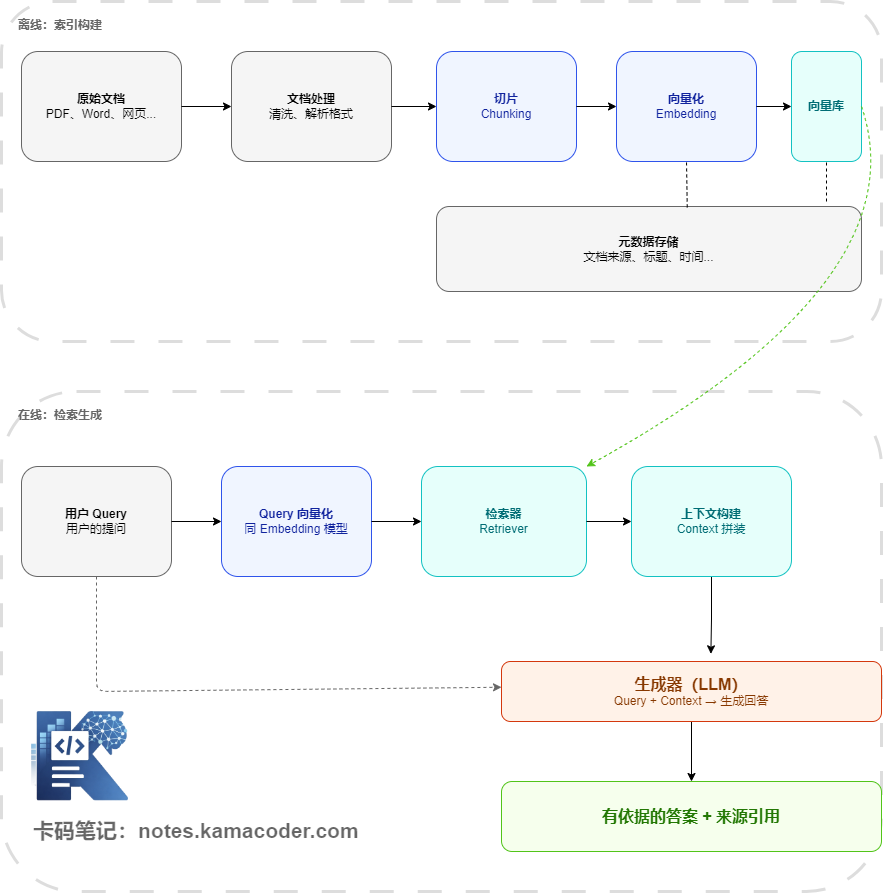
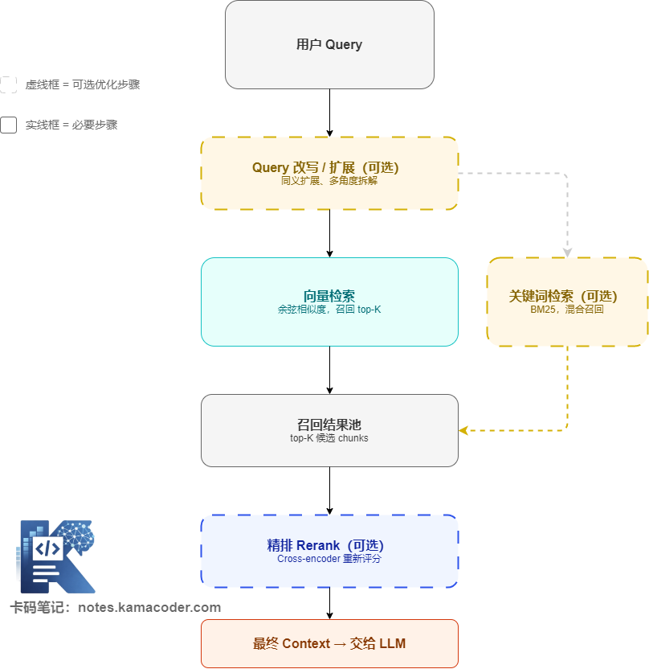

# Повний ланцюжок RAG: що насправді відбувається на офлайн- та онлайн-стадіях

Якось до мене звернулися розібрати співбесіду на позицію розробника RAG. Інтерв'юер не став ходити околяса й одразу спитав про основний ланцюжок.

> **Інтерв'юер:** Ви кажете, що робили RAG. Який же повний процес?
>
> **Кандидат:** Ну, векторизуємо документи, користувач ставить питання, шукаємо, потім модель генерує відповідь…
>
> **Інтерв'юер:** Що ви робили на офлайн-стадії? Через які кроки проходить онлайн-стадія від запиту до відповіді?
>
> **Кандидат** *(розгубившись)***:** Ну, завантажуємо документи, ріжемо на чанки, кладемо в базу… а потім шукаємо.
>
> **Інтерв'юер:** А де у вашому ланцюжку очищення, метадані, гібридний пошук, повторне ранжування, побудова контексту?

Тут кандидатові стало зовсім незатишно.

То який же повний ланцюжок RAG? Сьогодні розберемо це до кінця.

## 1. Огляд повного ланцюжка RAG

Спершу вибудуємо весь ланцюжок однією схемою, а далі розберемо його по ділянках. Увесь ланцюжок складається з двох частин: офлайн-сторона відповідає за те, щоб «покласти знання всередину», а онлайн-сторона — за те, щоб «знайти потрібні знання й скласти з них відповідь».

------

## 2. Офлайн-стадія

**1. Початкові документи**

Джерела знань для RAG-системи можуть бути найрізноманітнішими: PDF-звіти, документи Word, вебсторінки, файли Markdown, записи з бази даних, листи. Різні формати потребують різних способів розбору, і цей крок зазвичай називають **завантаженням документів (Document Loading)**.

Варто зауважити: якість цього кроку прямо визначає стелю всієї системи. Якщо початковий документ — це скан або PDF із хаотичною версткою, витягнутий текст буде повний шуму, і всі подальші ланки постраждають. Принцип «сміття на вході — сміття на виході» в RAG проявляється дуже виразно.

**2. Обробка документів (очищення й попередня підготовка)**

Розібраний текст зазвичай не можна використовувати одразу — потрібен раунд очищення: прибрати колонтитули, беззмістовні символи форматування, дублікати; розпізнати й зберегти структуру заголовків; відфільтрувати покручені таблиці, заглушки зображень тощо.

Крок виглядає дріб'язковим, але в реальних проєктах попередня обробка документів часто виявляється найбільшою за обсягом роботою й тією, яку найчастіше недооцінюють.

**3. Чанкінг (Chunking)**

Очищений документ не можна цілком запхати у векторну базу — його треба порізати на менші фрагменти (чанки). Це ланка з найбільшою кількістю проєктних рішень у RAG-системі, і вона прямо впливає на точність подальшого пошуку.

Навіщо різати? Причина пряма: у документі на 20 сторінок питання користувача може стосуватися лише одного абзацу. Якщо зберігати й шукати весь документ як одну одиницю, то або гранулярність пошуку буде надто грубою (влучили в документ, але потрібний фрагмент потонув серед решти), або контекст надто довгим (не влізе в модель або увага розмиється).

Якого розміру різати? Універсальної відповіді немає — це залежить від типу документів, контекстного вікна моделі й гранулярності бізнес-питань. Про стратегії чанкінгу є окрема стаття: [стратегії чанкінгу в RAG](./how_to_chunking.md). Тут достатньо розуміти, що це ключова ланка.

**4. Векторизація (Embedding)**

Кожен нарізаний чанк треба перетворити моделлю embedding на вектор (масив чисел із плаваючою комою високої вимірності). Цей вектор і представляє «зміст» фрагмента тексту.

Ключовий момент векторизації: питання користувача й чанки документів обов'язково мають оброблятися **однією й тією самою моделлю embedding**. Лише тоді їхні вектори перебувають в одному змістовому просторі, і обчислення схожості має сенс.

Водночас треба зберігати відповідні **метадані**: з якого документа цей чанк, на якій сторінці оригіналу, коли створено документ тощо. Метадані дуже важливі для фільтрації результатів пошуку: запити на кшталт «дивитися лише документи за останні три місяці» реалізуються саме через них.

**5. Запис у векторну базу даних**

Вектори й метадані зберігаються у векторній базі (Milvus, Weaviate, Chroma, Pinecone) та у звичайній базі чи документному сховищі. Ключова можливість векторної бази — **пошук наближених найближчих сусідів (ANN)**: серед мільйонів векторів вона за мілісекунди знаходить top-K найсхожіших на запит.

------

## 3. Онлайн-стадія

Наступна схема окремо показує ланки онлайн-пошуку та типові точки розгалуження для оптимізації:

**1. Обробка запиту**

Початкове питання користувача не завжди придатне для пошуку в первісному вигляді. Є кілька типових способів попередньої обробки.

**Переписування запиту.** Розмовне питання перетворюється на форму, придатнішу для пошуку, або складне питання розкладається на кілька підпитань із окремим пошуком для кожного. Наприклад, «які в нас процедура компенсації витрат і ліміт» можна розкласти на дві незалежні пошукові задачі.

**Розширення запиту.** До питання додаються синоніми, щоб підвищити повноту пошуку й не пропустити релевантні документи через різницю у формулюваннях.

Ці кроки необов'язкові: у базовій реалізації їх можна пропустити.

**2. Пошук (Retrieval)**

Після векторизації запиту обчислюється схожість із усіма векторами чанків у базі (зазвичай косинусна), і повертаються top-K найсхожіших чанків. Значення K зазвичай від 3 до 10.

Повніша реалізація робить **гібридний пошук (Hybrid Search)**: паралельно запускається векторний пошук (змістова схожість) і пошук за ключовими словами (точний збіг, наприклад BM25), а результати обох гілок об'єднуються. Так поєднуються переваги «розуміння змісту» й «точного збігу за ключовими словами».

**3. Rerank (повторне ранжування)**

Серед попередньо відібраних top-K результатів не всі однаково релевантні. Rerank — це додатковий етап точного ранжування після відбору: спеціальна модель типу cross-encoder оцінює пари (запит, чанк), результати переупорядковуються за новими оцінками, і лишаються лише кілька найрелевантніших.

Rerank — один із найпоширеніших і найдієвіших способів оптимізації RAG, ціною якого є затримка ще одного проходу інференсу.

**4. Побудова контексту (Context)**

Відібрані чанки разом із метаданими (документ-джерело, номер сторінки) складаються за певним форматом у контекст, і разом із початковим питанням користувача формують підсумковий промпт для генеративної моделі.

Структура промпта зазвичай така:

> Ти асистент корпоративної бази знань. Дай відповідь на питання, спираючись на наведені матеріали. Якщо в матеріалах немає потрібної інформації, прямо про це скажи.
>
> Довідкові матеріали:
>
> [Джерело: посібник до продукту, с. 3]
>
> …(вміст чанка)…
>
> Питання користувача: яка в нас політика повернення коштів?

**5. Генерація (Generation)**

Генеративна модель отримує повний промпт і формує відповідь на основі наданого контексту. Ключове тут — чітка спрямовувальна інструкція в промпті: модель має відповідати передусім за матеріалами, а не спиратися на знання у власних параметрах, і має позначати джерела у відповіді.

------

## 4. Головні висновки про цей ланцюжок

Зрозумівши повний ланцюжок, можна сформулювати кілька ключових речей.

**Кожна ланка впливає на підсумкову якість, але по-різному.** Чанкінг визначає, «чи вдасться взагалі знайти потрібний вміст»; модель embedding — «наскільки точно зрозуміло зміст»; rerank — «чи справді найрелевантніші результати опинилися вгорі»; дизайн промпта — «чи зможе модель правильно скористатися контекстом». Оптимізація RAG по суті полягає в пошуку слабкої ланки поточної системи, а не в безрозбірному підкручуванні параметрів.

**Офлайн та онлайн мають лишатися узгодженими.** Модель embedding і спосіб очищення тексту мають бути однаковими під час побудови індексу офлайн і під час пошуку онлайн. Якщо індекс побудовано моделлю A, а шукати моделлю B, векторні простори різні, і обчислення схожості втрачає будь-який сенс.

**Мета пошуку — точність, а не повнота.** Три якісні чанки зазвичай кращі за двадцять змішаних. Що довший контекст, то сильніше розсіюється увага моделі й то гірше співвідношення сигналу до шуму.

------

## 5. Типові хиби

**Хиба 1: «RAG = векторний пошук»**

Векторний пошук — лише один крок на онлайн-стороні. Повна RAG-система охоплює ще й розбір документів, стратегію чанкінгу, вибір моделі embedding, керування метаданими, rerank, дизайн промпта — цілу низку інженерних задач. Брак будь-якої ланки тягне вниз загальний результат.

**Хиба 2: «Аби модель була сильною, а чанки можна різати як завгодно»**

Чанкінг — найбазовіша інфраструктура RAG. Хоч би якою сильною була модель, якщо знайдені чанки або надто короткі (зміст неповний), або надто довгі (потрібна інформація розмита), якість генерації суттєво просяде. Можливості моделі не компенсують вад якості пошуку.

**Хиба 3: «Rerank треба додавати обов'язково»**

Rerank має свою ціну: додатковий виклик моделі означає вищу затримку й вартість. Для сценаріїв із жорсткими вимогами до реального часу або з невеликим обсягом документів точна модель embedding плюс розумний top-K часто вже достатні. Спершу оцініть, чи він справді потрібен, і лише потім вирішуйте.

------

## 6. Як це можуть спитати на співбесіді

**Питання: опишіть повний ланцюжок RAG.**

Орієнтовна відповідь у дві частини.

Офлайн-сторона: завантаження документів → очищення й попередня обробка → чанкінг → векторизація через embedding → запис у векторну базу (разом із метаданими).

Онлайн-сторона: запит користувача → (за потреби переписування запиту) → векторизація запиту → векторний пошук top-K → (за потреби гібридний пошук і rerank) → складання контексту й промпта → генерація LLM → відповідь із посиланнями на джерела.

**Питання: які ланки RAG найбільше впливають на результат?**

Орієнтовна відповідь: на офлайн-стороні найважливіші стратегія чанкінгу (визначає гранулярність пошуку) і вибір моделі embedding (визначає якість розуміння змісту). На онлайн-стороні найважливіший дизайн промпта (спрямовує модель правильно користуватися контекстом). При цьому передумовою є якість самих документів: навіть найкраща система не впорається з покрученим і безструктурним входом.

**Питання: чи має модель embedding бути однаковою офлайн і онлайн? Чому?**

Орієнтовна відповідь: обов'язково має. Модель embedding відображає текст у простір високої вимірності, і в різних моделей ці простори різні. Якщо індекс побудовано офлайн моделлю A, а вектор запиту онлайн генерує модель B, вони перебувають у різних просторах, косинусна схожість втрачає сенс, і результати пошуку будуть повним хаосом.

------

## 7. Підсумок

RAG — це не алгоритм, а інженерний конвеєр. Офлайн-сторона розв'язує питання «як знання туди потрапляють», онлайн-сторона — «як їх знайти й застосувати». Коли цей ланцюжок укладений у голові, будь-яке подальше обговорення конкретної оптимізації — як різати чанки, яку модель embedding обрати, як застосовувати rerank — має чітке місце прикладання.

У наступній статті заглибимося саме в чанкінг: наскільки різним буде результат пошуку, якщо той самий документ порізати по-різному?
