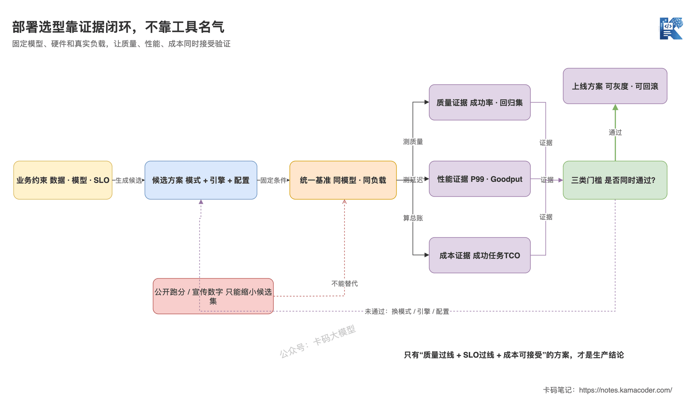

# Хмарний API, керований inference чи власне розгортання: як обрати спосіб розгортання LLM

> **Станом на вересень 2026.** Перелік і статуси рушіїв inference у цій статті швидко змінюються — перед використанням звіряйтеся з офіційною документацією.

Попередня стаття — [Як інтерв'юери питають про донавчання і що відповідати прикладнику](./finetuning_interview.md) — окреслила одну межу: прикладний розробник не обов'язково тренує моделі власноруч, але мусить уміти оцінити, коли донавчання варте заходу.

Коли модель обрано, а промпт і RAG уже налагоджено, настає наступне питання межі:

**Де саме ця модель має працювати?**

Інтерв'юер питає: «Чому ви обрали власне розгортання, а не просто виклик хмарного API?»

Багато хто відповідає: «Своє розгортання безпечніше для даних, до того ж vLLM дає високу продуктивність, тож у довгій перспективі це точно дешевше».

Проблеми цієї відповіді цілком конкретні:

- безпека даних залежить від меж даних, договору, мережі й політики логів, а не забезпечується автоматично самим фактом власного розгортання;
- vLLM — лише один із кандидатів на роль рушія inference, він не визначає за вас модель розгортання;
- власне розгортання економить рахунок за токени, але додає вартість простою GPU, масштабування, оновлень, моніторингу й відновлення після збоїв;
- без даних про якість і навантажувальне тестування на тій самій моделі й тому самому навантаженні «дешевше» — лише здогад.

Насправді відповідати треба не на питання «який інструмент найкращий», а на такі: **які обмеження визначають модель розгортання, хто відповідає за кожен шар і якими доказами ви доведете, що вибір слушний.**

## Коротка відповідь

- **Хмарний API** пасує, коли бізнес-гіпотеза ще перевіряється, трафік стрибає, а команда не хоче обслуговувати GPU; ціна цього — менший контроль над моделлю та низькорівневою оптимізацією;
- **керований inference** дозволяє розгорнути вказану модель або власні ваги, але віддає планування GPU й масштабування сервісу платформі — контроль і вартість експлуатації посередині;
- **власне розгортання** пасує, коли ваги моделі мусять бути під контролем, межі даних жорсткі, трафік достатньо стабільний, а команда має компетенції в inference та експлуатації GPU;
- vLLM, SGLang, TensorRT-LLM — це вибір рушія inference всередині власного чи керованого розгортання, а Ollama і llama.cpp радше про локальний, периферійний і легкий запуск; змішувати їх із вибором моделі розгортання не можна;
- остаточний вибір треба підтвердити навантажувальним тестуванням на тій самій моделі, тому самому залізі й реальному трафіку, порівнюючи якість, Goodput у межах SLO і сукупну вартість одного успішного завдання.

Одним реченням: **спершу за бізнес-обмеженнями оберіть, «хто відповідає за розгортання», і лише потім за моделлю, залізом і навантаженням обирайте рушій inference.**

## Докладна відповідь

### Що насправді визначає спосіб розгортання?

Спосіб розгортання визначає не «на яку URL слати запит до моделі», а **хто бере на себе відповідальність за кожен шар стека обслуговування моделі**.

Кожен продакшн-запит проходить щонайменше через автентифікацію на вході, обмеження швидкості й маршрутизацію, чергу запитів, рушій inference, ваги моделі та обчислювальне залізо. А ще навколо — моніторинг, оновлення, масштабування й відновлення після збоїв.

Обираючи хмарний API, ви перекладаєте на постачальника більшу частину відповідальності за обслуговування моделі й залізо; обираючи керований inference — платформа тримає інфраструктуру, а ви починаєте відповідати за модель і частину конфігурації сервісу; обираючи власне розгортання — практично весь ланцюжок лягає на вашу команду.


Схема показує, що насправді змінюють хмарний API, керований inference і власне розгортання. Усі три працюють з тим самим ланцюжком запиту; різниця не в наявності API, а в тому, на якому шарі проходить межа відповідальності. Рушії inference на кшталт vLLM чи SGLang розташовані виключно всередині стека обслуговування.

Звідси й пояснення поширеної хиби: **«OpenAI-сумісний інтерфейс» не дорівнює «це хмарний API».**

Розгорнуті власноруч vLLM, SGLang і llama.cpp так само можуть віддавати OpenAI-сумісний інтерфейс. Схожість інтерфейсу означає лише простішу міграцію на рівні застосунку, а не ідентичність поведінки моделі, викликів інструментів, структурованого виводу й розподілу експлуатаційної відповідальності.

### Кому пасує хмарний API, кому керований inference, а кому власне розгортання?

Ці три моделі — не сходинки від нижчої до вищої, а три способи розподілити відповідальність.

| Модель розгортання | Кому пасує більше | Головна ціна |
|---|---|---|
| Хмарний API | Бізнес ще на перевірці, трафік стрибає, потрібен швидкий доступ до передових закритих моделей, команда не обслуговує GPU | Обмежений контроль над моделлю та версіями, залежність від квот, цін, регіонів і умов відповідності постачальника |
| Керований inference | Треба запускати вказану відкриту модель або приватні ваги, але не хочеться тримати повний GPU-кластер | Усе ще залежність від матриці підтримки платформи й доступності ресурсів, а в питомій вартості зазвичай сидить націнка за керованість |
| Власне розгортання | Ваги й дані мусять лишатися у власному контурі, потрібна глибока оптимізація inference, трафік стабільний і достатньо великий | Доводиться брати на себе планування потужностей, утилізацію GPU, сумісність під час оновлень, моніторинг з алертами й відновлення після збоїв |

Є ще один сценарій, який часто плутають із цими трьома: **локальне або периферійне розгортання.**

Наприклад, офлайн-налагодження на машині розробника, обладнання в торговій точці, персональний комп'ютер, застосунки на пристрої. Тут ключові обмеження зазвичай інші: простота встановлення, сумісність із залізом, споживання пам'яті й робота без мережі. Для цього добре пасують Ollama чи llama.cpp — але вони розв'язують не задачу пропускної здатності й планування на великому GPU-кластері.

Правило оцінки просте:

**Поки немає жорстких обмежень, обирайте ту модель, що дасть найшвидше перевірити бізнес-гіпотезу; і лише коли дані, контроль над моделлю, продуктивність чи масштаб справді стають обмеженням, берімо на себе важчу відповідальність за розгортання.**

### Чи справді «дані не можуть виходити за контур» означає обов'язкове власне розгортання?

Не обов'язково — спершу з'ясуйте, що саме означає «виходити за контур».

Одні бізнеси вимагають, щоб дані не потрапляли в публічний інтернет, але дозволяють їх у виділений VPC чи окремий інстанс у хмарі; інші — щоб ваги моделі, дані запитів і логи цілком лишалися у власному дата-центрі; ще інші дозволяють передавати назовні лише знеособлені чутливі поля.

Цим трьом вимогам відповідають зовсім різні рішення.

У проєкті насамперед з'ясуйте:

- куди саме можуть потрапляти вихідний промпт, документи RAG, вивід моделі й логи — окремо для кожного;
- чи зберігає постачальник дані, чи використовує їх для навчання, чи обробляє їх у інших регіонах;
- хто відповідає за мережеву ізоляцію, ключі, аудит і політику видалення;
- чи дозволяють ліцензія використовуваних ваг і версія квантування саме такий спосіб розгортання.

**Відповідність вимогам — це вхідні дані для архітектури, а не властивість, що додається до способу розгортання в подарунок.**

### То як усе-таки обирати між vLLM, SGLang, TensorRT-LLM і Ollama?

Спершу виправмо рівень: усі вони вміють «запустити модель», але цільова аудиторія, спектр підтримуваного заліза й акценти оптимізації в них різні.

Станом на липень 2026 для початкового списку кандидатів можна скористатися такою таблицею позиціювання:

| Інструмент | Коли варто одразу внести до списку кандидатів | Що обов'язково перевірити під час вибору |
|---|---|---|
| vLLM | Універсальне GPU-обслуговування, OpenAI-сумісний інтерфейс, пріоритет екосистеми моделей та інтеграцій розгортання | Підтримку потрібної моделі й формату квантування, бекенд для заліза, сумісність паралелізму й розширених можливостей |
| SGLang | Низька затримка з високою пропускною здатністю, перевикористання довгих префіксів, зв'язки inference + RL, оптимізація під конкретні нові моделі | Зрілість оптимізації саме для вашої моделі, апаратну платформу, складність кластерного розгортання |
| TensorRT-LLM | Залізо NVIDIA, потреба глибоко використати низьку точність і багатоGPU-оптимізацію | Покоління GPU, матрицю підтримки моделей, сумісність комбінацій можливостей і вартість переходу між версіями |
| Ollama | Локальна розробка, демонстрації, приватний запуск на одній машині, простота встановлення й керування моделями | Стелю паралельних запитів, черги, відеопам'ять, формати моделей і можливості продакшн-керування |
| llama.cpp | CPU, Apple Silicon, змішаний режим CPU+GPU, периферійні пристрої та екосистема GGUF | Реальну швидкість на цільовому залізі, якість квантування, потреби в довжині контексту й паралельності |

Тут навмисно не написано, «хто найшвидший».

Продуктивність inference — не стала властивість інструмента, а результат спільної дії ось цих змінних:

```text
результат = архітектура моделі × точність/квантування × залізо × спосіб паралелізму × довжина входу й виходу × паралельність і SLO
```

Змініть модель, GPU чи розподіл довжин промптів — і рейтинг може перевернутися.

Ще два стани справ, на які варто зважити окремо:

- Hugging Face позначила TGI як такий, що перебуває в режимі підтримки, і радить надалі розглядати насамперед vLLM, SGLang, llama.cpp або MLX;
- TensorRT-LLM у 2026 році прибрав старий виконавчий бекенд TensorRT, тож поточна офіційна документація описує PyTorch як єдиний виконавчий бекенд, а процедури збирання й конвертації зі старих туторіалів застосувати напряму вже не вийде.

Тому перелік інструментів — це лише знімок із датою. Стабільне тут інше: **спершу дивіться офіційну матрицю підтримки для вашої моделі й вашого заліза, а далі робіть власний бенчмарк.**

### Як покроково обирати модель розгортання в проєкті?

Не починайте з питання «vLLM чи SGLang» — спершу пройдіть жорсткі фільтри.

Перший фільтр: дані, ліцензія моделі й контроль над вагами. Якщо певні дані чи ваги не можуть потрапити в чужий контур — хмарний API відпадає одразу; якщо ж потрібна саме закрита передова модель — так само одразу може відпасти власне розгортання.

Другий фільтр: чи перевірено бізнес-гіпотезу. Поки вимоги, планка якості й обсяг викликів не стабілізувалися, купити API зазвичай розумніше, ніж купити GPU. Інакше легко витратити місяць на розгортання кластера й аж тоді виявити, що модель узагалі не розв'язує бізнес-задачу.

Третій фільтр: трафік і SLO. Постійне передбачуване високе навантаження краще розмиває фіксовану вартість GPU; рідкісний і сплесковий трафік, навпаки, залишає GPU надовго простоювати. До того ж діалог у реальному часі, офлайнова пакетна обробка й довгі задачі агента по-різному зважують TTFT, TPOT і загальний час виконання.

Четвертий фільтр: спроможність команди. Власне розгортання не закінчується на запущеному Docker: хтось має розбиратися з драйверами, браком відеопам'яті, оновленнями моделей, масштабуванням, моніторингом і нічними інцидентами.


Схема показує, у якому порядку робити вибір розгортання. Дані й ліцензія моделі — жорсткі фільтри на початку; перевірка бізнес-гіпотези й трафік визначають, чи варто брати на себе фіксовані ресурси; і лише наприкінці настає інженерний вибір між керованим і власним розгортанням. Локальний офлайн — окрема гілка, яку запускають межі самого пристрою.

Порядок тут важливий. Що раніша умова, то вона жорсткіша: пізніша оптимізація продуктивності не може скасувати раніші вимоги відповідності й доступності моделі.

### Чи справді власне розгортання дешевше в довгій перспективі?

Не обов'язково — порівнювати треба сукупну вартість володіння, тобто TCO.

Вартість хмарного API добре помітна: зазвичай видно оплату за вхід, вихід та інші позиції тарифікації. Вартість власного розгортання розпорошена:

```text
TCO власного розгортання
= ресурси GPU й мережі
+ простій і резервні потужності
+ сховище й розповсюдження моделей
+ люди на розробку платформи та експлуатацію
+ вартість оновлень, збоїв і простоїв
```

І так само не можна порівнювати лише «вартість одного токена». Розумніша бізнесова одиниця виміру така:

```text
вартість одного успішного завдання = загальна вартість за період / кількість завдань, що вклалися в планку якості та SLO
```

Це та сама логіка, що й у попередній статті [Токени, вартість і затримка: три жорсткі обмеження застосунків на LLM](./token_cost_latency.md): дешевий варіант із високою часткою відмов і численними таймаутами зрештою може виявитися недешевим.

### Чому остаточний вибір обов'язково має пройти замкнений цикл навантажувального тестування?

Бо документація й публічні бенчмарки допомагають лише звузити список кандидатів — підписати рішення про запуск у продакшн замість вас вони не можуть.

Щонайменше зафіксуйте такі умови:

- та сама версія моделі, той самий токенізатор і той самий чат-шаблон;
- та сама точність або схема квантування;
- залізо того самого класу, та сама кількість GPU й той самий спосіб паралелізму;
- довжини входу й виходу, паралельність і сплески трафіку, близькі до продакшну;
- той самий набір для перевірки якості, ті самі таймаути й SLO.

А далі порівнюйте одночасно три види доказів:

- **якість**: частка успішних завдань, частка валідного структурованого виводу, коректність викликів інструментів і регресійний набір;
- **продуктивність**: TTFT, TPOT/ITL, наскрізні P95/P99, частка помилок і Goodput у межах SLO;
- **вартість**: утилізація GPU, загальна вартість за період і вартість одного успішного завдання.



Схема показує, чому вибір — не одноразове рішення. Бізнес-обмеження породжують варіанти-кандидати, єдине навантажувальне тестування дає докази щодо якості, продуктивності й вартості; якщо поріг не пройдено — коригуємо модель розгортання, рушій або конфігурацію, і лише коли всі три групи метрик проходять одночасно, варіант стає рішенням для продакшну.

Стаття [Як навантажувати сервіс LLM: TTFT, TPOT, пропускна здатність і Goodput](./stress_testing.md) розкриває повну методику перевірки потужностей. Впроваджуючи це в проєкті, не переписуйте чужі фіксовані пороги: SLO для P95/P99 треба ставити за реальним досвідом користувача вашого бізнесу й обов'язково враховувати час у черзі, частку помилок і Goodput.

## Поглиблення

**Q1. Якщо викликати хмарний API, то в розгортанні можна взагалі не розбиратися?**

Не керувати GPU — не означає не робити інженерію. На рівні застосунку однаково доводиться працювати з квотами, обмеженням швидкості, таймаутами, скасуванням, повторами, збоями постачальника, змінами версій моделі й моніторингом вартості. Ви лише передали постачальникові відповідальність за інфраструктуру inference.

**Q2. Яка найбільша різниця між керованим inference і хмарним API?**

Хмарний API — це зазвичай виклик сервісу моделі, який надає постачальник; керований inference зазвичай дозволяє вказати відкриту модель або приватні ваги, а платформа керує частиною обчислювальної та сервісної інфраструктури. Перше постачає «здатності моделі», друге — радше «кероване середовище запуску».

**Q3. То vLLM чи SGLang?**

Спершу перевірте, чи підтримуються потрібна модель, формат квантування, залізо й обов'язкові функції, а потім порівняйте їх на реальному навантаженні. Одразу після виходу нової моделі якийсь рушій може мати спеціальну оптимізацію під неї, а через кілька версій різниця знову зміниться. Постійної відповіді, відірваної від версії та навантаження, не існує.

**Q4. Якщо інтерфейси всюди сумісні з OpenAI, то перехід на інший рушій — це просто зміна Base URL?**

Можна сказати лише, що вартість інтеграції буде нижчою. Чат-шаблон, токенізатор, виклики інструментів, структурований вивід, параметри семплінгу, коди помилок і семантика паралельності все одно можуть відрізнятися. Після переходу обов'язково прожене функціональну регресію й оцінювання якості.

**Q5. Наскільки глибоко в це має вникати прикладний розробник?**

Не потрібно, щоб кожен писав ядра CUDA, але треба вміти чітко пояснити межі відповідальності, потужності й SLO, розуміти, чому модель не влазить, чому не вдається підняти паралельність і на який шар дивитися під час збою. Інакше ви зможете пояснювати геть усе одним «модель занадто повільна».

**Q6. Як на співбесіді відповісти «чому власне розгортання»?**

Спершу назвіть жорсткі обмеження — дані, ваги чи контроль над моделлю; далі поясніть, чи достатньо трафіку й чи такі SLO, щоб виправдати фіксовані ресурси; потім скажіть, яку саме експлуатаційну відповідальність узяла команда; і наприкінці наведіть результати навантажувального тестування в однакових умовах і розрахунок TCO. Не обмежуйтеся відповіддю «безпечно, дешево, швидко».

Стан інструментів, згаданих у статті, звірявся в липні 2026 року за [офіційною документацією vLLM](https://docs.vllm.ai/en/latest/), [офіційною документацією SGLang](https://docs.sglang.io/), [нотатками про міграцію TensorRT-LLM](https://nvidia.github.io/TensorRT-LLM/latest/legacy/tensorrt-backend-removal.html), [FAQ Ollama](https://docs.ollama.com/faq), [офіційним репозиторієм llama.cpp](https://github.com/ggml-org/llama.cpp) та [офіційним репозиторієм TGI](https://github.com/huggingface/text-generation-inference).

Перестаньте починати з питання «а який фреймворк усі використовують у продакшні».

По-справжньому вміє обирати розгортання той, хто може порахувати відповідальність, межі, SLO і сукупну вартість.
