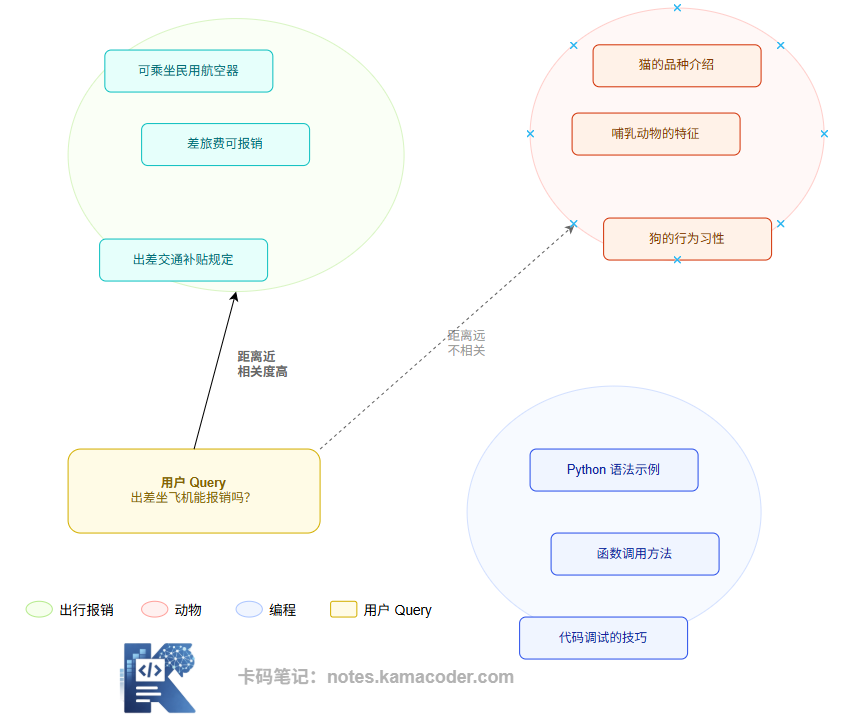

# Що таке embedding: стиснення змісту, вибір моделі й відмінність від rerank

Нещодавно мені переказали такий діалог зі співбесіди:

> **Інтерв'юер:** Користувач питає «чи можна компенсувати переліт у відрядженні». У вашій базі знань відповідь є — чому вона не знаходиться?
>
> **Кандидат:** Мабуть, не збіглися ключові слова. Додам ще синонімів.
>
> **Інтерв'юер:** У документі написано «повітряне судно», а не «літак». Подумайте ще.
>
> **Кандидат** *(після паузи)***:** Може, словник пошукових термінів недостатньо повний?
>
> **Інтерв'юер** *(хитає головою)***:** Скільки синонімів не додавайте, це не допоможе. Що саме зіставляє ваш пошук — текст чи зміст?
>
> **Кандидат:** Ну я ж шукаю за ключовими словами…
>
> **Інтерв'юер:** То як ви зіставите «літак» користувача з «повітряним судном» у документі?

Далі кандидатові не знайшлося що сказати.

Класичний пошук зіставляє символи, а embedding дає машині зрозуміти зміст людської мови.

Сьогодні розберемо векторний пошук через embedding від початку до кінця.

------

## 1. Що таке embedding?

Embedding — це технологія відображення тексту (а також зображень, аудіо тощо) у векторний простір високої вимірності. Речення, оброблене моделлю embedding, перетворюється на масив із кількох сотень чи тисяч чисел із плаваючою комою, наприклад `[0.23, -0.87, 0.14, ..., 0.56]` (типові розмірності — 384, 768 або 1536).

Головне не в самих числах, а в **розташуванні** вектора в просторі: змістово схожі тексти лежать близько один до одного, а незв'язані — далеко.

Це і є основна обіцянка embedding: **виразити змістову схожість через відстань у просторі.**

Схема нижче робить це наочним на двовимірному прикладі. Справжні вектори мають сотні й тисячі вимірів, але після проєкції на площину закономірність змістової кластеризації лишається добре видною:

Кожна точка на схемі — це положення фрагмента тексту у векторному просторі після embedding. Реальна розмірність значно більша за дві (зазвичай сотні й тисячі), але закономірність кластеризації та сама: документи про відрядження й компенсації тримаються поруч, а теми про тварин і програмування утворюють власні скупчення.

Після векторизації запиту користувача система обчислює його відстань до всіх векторів документів і знаходить найближчі. Це і є суть векторного пошуку.

------

## 2. Embedding не генерує текст — він стискає зміст

Тут є поняття, які часто плутають, тож проговоримо їх окремо.

Мета генеративної великої моделі (GPT, Claude) — **видати текст**: ви даєте вхід, вона генерує продовження.

Мета моделі embedding зовсім інша: на виході в неї не текст, а **векторне представлення**. Завдання — стиснути «зміст» фрагмента тексту в масив чисел фіксованої розмірності, зберігши змістову інформацію й відкинувши подробиці формату та формулювань.

Той самий зміст, висловлений найрізноманітнішими способами, після хорошої моделі embedding має давати дуже близькі вектори. Саме тому змістовий пошук здатен знаходити релевантний вміст попри різницю у формулюваннях.

------

## 3. Як обирати модель embedding?

В інженерній практиці при виборі моделі embedding треба зважити кілька вимірів.

**Розмірність вектора**

Що вища розмірність, то тонше теоретично можна виразити зміст, але відповідно зростають витрати на зберігання й падає швидкість пошуку. Поширені розмірності: 384 (легка), 768 (збалансована), 1536 (висока точність). Для більшості завдань середнього масштабу 768 — розумна відправна точка.

**Обмеження на максимальну кількість токенів**

У кожної моделі embedding є верхня межа довжини входу, і все, що її перевищує, обрізається. Це обмеження прямо визначає максимальний розмір чанка. Скажімо, якщо модель підтримує максимум 512 токенів, ваш чанк не може бути більшим. Перед вибором моделі цей параметр обов'язково треба звірити.

**Підтримка вашої мови**

Це найважливіший критерій вибору для не-англомовних сценаріїв. Універсальні англомовні моделі embedding помітно гірше працюють з іншими мовами, ніж моделі, спеціально під них оптимізовані.

> **Що це означає для української.** Оригінал цієї статті розглядає китайську, але логіка та сама й для нас: не варто без перевірки брати модель, натреновану переважно на англійській. Для української дивіться в бік багатомовних моделей (наприклад, `bge-m3` або багатомовні варіанти E5) і обов'язково **звіряйтеся з актуальним багатомовним розділом MTEB та власним тестовим набором**. Конкретні позиції в рейтингах змінюються, тому вимірюйте на своїх документах, а не покладайтеся на чиїсь висновки.

**Чи підтримується асиметричний пошук**

У RAG є типовий асиметричний сценарій: запит — це коротке питання («яка політика повернення коштів»), а фрагмент документа — довший пояснювальний текст. Деякі моделі спеціально оптимізовані під такі асиметричні пари «запит — документ» і дають помітно кращий результат. Наприклад, серія BGE підтримує додавання до запиту спеціального префікса `"Represent this sentence for searching relevant passages:"`, що покращує пошук.

------

## 4. Чим embedding відрізняється від rerank?

Це дуже часте питання на співбесідах і водночас поняття, у якому плутається багато початківців.

У ланцюжку RAG вони грають різні ролі. Якщо коротко: embedding відповідає за **грубий відбір**, а rerank — за **точне ранжування**.

Схема нижче показує їхнє місце в ланцюжку й порівнює механізми роботи. Ключова відмінність — у способі моделювання:

Embedding використовує **двовежеву модель (bi-encoder)**: запит і кожен фрагмент документа незалежно кодуються моделлю у вектори, а релевантність вимірюється відстанню між векторами (косинусною схожістю). Найбільша перевага цього підходу в тому, що вектори документів можна **обчислити наперед офлайн** і покласти у векторну базу. Під час пошуку достатньо обчислити вектор запиту й виконати пошук наближених найближчих сусідів — це надзвичайно швидко й дозволяє за мілісекунди відібрати потрібне з мільйонів документів.

Rerank використовує **перехресний кодувальник (cross-encoder)**: запит і кожен документ-кандидат **склеюються разом** і подаються в модель як одне ціле, а модель одразу видає оцінку релевантності. Так модель бачить повну взаємодію між запитом і документом, розуміє зміст глибше й дає вищу точність — але ціною того, що обчислити наперед нічого не можна: щоразу потрібен інференс для кожної пари. Тому rerank годиться лише для точного ранжування невеликої кількості кандидатів (у межах top-20).

У реальній RAG-системі вони працюють конвеєром: embedding швидко відбирає з усього масиву top-K (скажімо, 20–50), а rerank уже з цих кандидатів обирає найрелевантніші top-N (зазвичай 3–5), які й потрапляють у контекст LLM.

------

## 5. Чим не-англомовні сценарії відрізняються від універсальних

> Розділ нижче написаний в оригіналі для китайської мови. Перші два пункти стосуються будь-якої мови з нелатинською писемністю, зокрема української; третій наводить китайські орієнтири як приклад методики, а не як готову рекомендацію для нас.

Просто взяти англомовну модель і застосувати її до іншої мови не вийде. Головні відмінності такі.

**Межі токенізації.** У китайській немає природного поділу пробілами, тож вираження змісту на рівні символів суттєво відрізняється від англійської, і універсальні моделі вловлюють зміст помітно гірше за спеціально навчені. Для української проблема інша за природою, але наслідок схожий: кирилиця розбивається на токени дрібніше, ніж латиниця, і модель, натренована переважно на англійських даних, працює з нею гірше.

**Фахова термінологія.** У бізнес-сценаріях багато галузевих термінів (юридичні формулювання, медична й фінансова термінологія), і універсальні моделі часто не здатні точно передати змістові зв'язки між ними.

**База для оцінювання.** Обираючи модель embedding для конкретної мови, важливим орієнтиром є відповідний розділ Retrieval у MTEB (Massive Text Embedding Benchmark). Станом на час написання оригіналу серед відкритих китайських моделей добре показували себе серія BGE (`BAAI/bge-large-zh-v1.5`, `bge-m3`) і серія E5.

Рекомендація щодо вибору: якщо ваш продукт переважно не англомовний, спершу розгляньте моделі, оптимізовані під вашу мову або багатомовні, а не універсальні англомовні. Якщо потрібно одночасно обробляти документи кількома мовами, `bge-m3` — непоганий варіант: він спеціально оптимізований під багатомовний пошук.

------

## 6. Типові хиби

**Хиба 1: «Що більша модель embedding, то краще»**

Не обов'язково. Більша модель зазвичай точніша, але повільніша в інференсі й з'їдає більше пам'яті. Для сценаріїв пошуку в реальному часі легка модель, спеціально оптимізована під задачу пошуку, може дати кращий результат за меншу вартість, ніж універсальна велика.

**Хиба 2: «Embedding від OpenAI цілком достатньо»**

`text-embedding-3-small/large` від OpenAI чудово працюють в англомовних сценаріях, але для інших мов варто провести власне порівняльне оцінювання. Часто спеціалізована або багатомовна модель дає кращий результат, а заразом зменшує залежність від стороннього API й здешевлює рішення.

**Хиба 3: «Не має значення, що embedding і rerank — різні моделі»**

Жорсткого обмеження на вибір моделі embedding немає, але модель rerank краще брати близьку до неї за розподілом навчальних даних. Інакше їхні оцінки можуть мати різні «одиниці виміру», і точне ранжування працюватиме нестабільно.

**Хиба 4: «Змінили модель embedding — індекс перебудовувати не треба»**

Абсолютно неправильно. Різні моделі embedding породжують вектори в різних змістових просторах, і вектори в старому індексі просто непорівнянні з векторами запитів від нової моделі. Змінили модель — обов'язково прогоніть embedding для всіх документів заново й перебудуйте весь векторний індекс.

------

## 7. Як це можуть спитати на співбесіді

**Питання: як обирати модель embedding?**

Орієнтовна відповідь за чотирма вимірами. Перше — мовний сценарій: для не-англомовного продукту насамперед беремо модель, оптимізовану під цю мову або багатомовну, а не універсальну англомовну. Друге — довжина входу: максимальна кількість токенів моделі прямо визначає верхню межу розміру чанка. Третє — розмірність вектора: компроміс між ресурсами зберігання й точністю, 768 зазвичай є розумною відправною точкою. Четверте — тип задачі: для асиметричного пошуку (короткий запит шукає довгий документ) і симетричного (зіставлення схожих питань) оптимальні моделі різні, тож треба дивитися на конкретний сценарій.

**Питання: чим embedding відрізняється від rerank?**

Орієнтовна відповідь: embedding (двовежева модель, bi-encoder) кодує запит і документ **окремо й незалежно** у вектори, а відбір робить за схожістю векторів. Перевага — вектори документів можна порахувати наперед офлайн, пошук надзвичайно швидкий і працює на мільйонах документів; це грубий відбір. Rerank (cross-encoder) подає **склеєні разом** запит і кожен документ-кандидат і одразу видає оцінку релевантності; модель бачить глибоку взаємодію між ними, точність вища, але обчислити наперед нічого не можна й потрібен інференс для кожної пари, тож це годиться лише для точного ранжування невеликої кількості кандидатів. Вони працюють конвеєром: embedding грубо відбирає пул кандидатів, rerank точно фільтрує те, що зрештою піде в контекст LLM.

------

## 8. Підсумок

Embedding — це основна інфраструктура, завдяки якій машина «розуміє зміст» у RAG-системі. Це не просте кодування тексту числами, а стиснення змісту в простір, де можна рахувати: близькі за значенням тексти опиняються поруч. Зрозумівши принцип роботи embedding, логіку вибору моделі й зв'язок із rerank, ви оволодіваєте найважливішим інженерним розумінням змістового рівня RAG.
