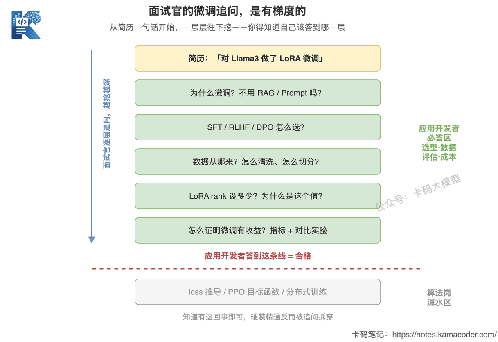
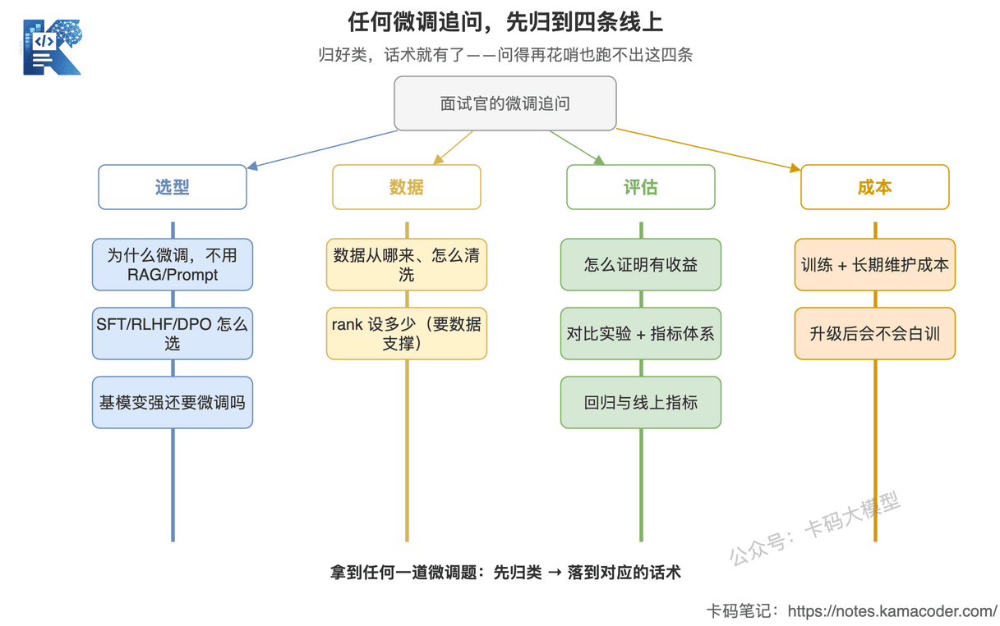
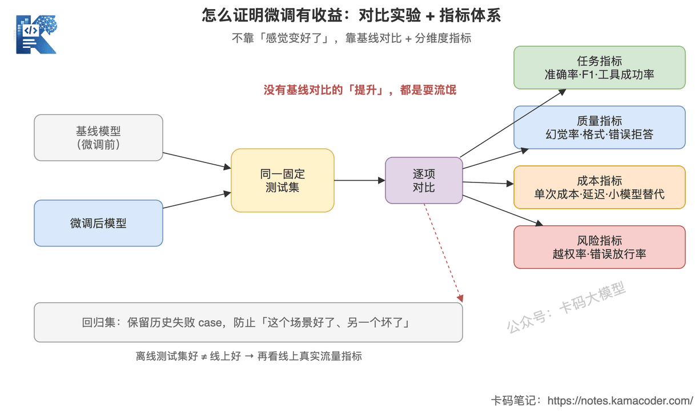

# Як інтерв'юери питають про донавчання і що відповідати прикладнику

У цьому розділі про донавчання попередні три статті вже проговорили все головне.

[SFT, RLHF, DPO: панорама методів донавчання](./finetuning_sft_rlhf_dpo.md) — які бувають типи донавчання і яку задачу кожен розв'язує.

[LoRA/QLoRA: донавчання низького рангу](./lora_qlora.md) — якщо справді треба тренувати руками, що насправді означають rank, alpha і квантування.

[Коли донавчати, а коли RAG](./finetuning_vs_rag.md) — як обирати: бракує знань — RAG, бракує поведінки — аж тоді думаємо про донавчання.

Теорію викладено. Лишилося останнє питання:

**Як усе це застосувати безпосередньо на співбесіді?**

Ця стаття саме про це. Нових понять не буде — буде одна річ: **у чому справжня складність прикладного розробника перед питанням про донавчання і як її здолати.**

## 1. Справжня складність прикладника

Багато хто, коли розмова заходить про співбесіду щодо донавчання, відчуває себе затиснутим.

Відповіси поверхово — боїшся, що інтерв'юер вирішить, ніби ти цього не робив: «а, то ти просто API смикав».

Відповіси глибоко — ризикуєш ступити на територію алгоритмічної позиції: інтерв'юер учепиться за твої ж слова й копне далі: «то виведіть цільову функцію PPO», «а чому в LoRA одну матрицю низького рангу ініціалізують гаусіаном, а другу нулями?» — і ти зависаєш.

**Оце і є ключова складність прикладника: ти не знаєш, до якого рівня маєш відповідати.**

Одразу дам висновок:

**Коли інтерв'юер питає про донавчання на прикладній позиції, він перевіряє не вміння тренувати модель, а наявність інженерної розсудливості.**

Що таке інженерна розсудливість? Ось ці кілька речей:

- чи варто взагалі донавчати під цю вимогу і чому;
- звідки беруться дані для донавчання і чи можна їм довіряти;
- як довести, що донавчання справді дало вигоду, а не «суб'єктивно стало краще»;
- чи виправдана вартість і чи не пропаде тренування після оновлення базової моделі.

Жодне з цих питань не вимагає писати код тренування. Але кожне відділяє того, хто «вміє запускати скрипти», від того, хто «справді розуміє інженерію».

Якщо це усвідомити, решта стратегії відповідей складається сама собою.

## 2. Уточнення інтерв'юера мають градацію

Питання про донавчання майже завжди йдуть за одним сценарієм: інтерв'юер бере один рядок із вашого резюме й копає шар за шаром.

Треба чітко розуміти, до якого шару відповідь обов'язкова, а нижче — вже чужа зона відповідальності.

Схема показує, як уточнення про донавчання поглиблюються шар за шаром і яку межу прикладному розробнику треба втримати.

Починається все з рядка в резюме, а далі питання дедалі глибші: спершу чому донавчання й як обирали метод, потім про дані та метрики — **усе це в обов'язковій зоні прикладника**, і якщо ви тут не відповідаєте, значить, справді не робили.

А за червоною лінією — виведення функції втрат, цільова функція PPO, розгортання розподіленого тренування — **це вже глибина алгоритмічної позиції**. Прикладнику досить відповісти «я знаю, що таке існує, і приблизно навіщо», удавати експерта не треба. Розплата за вдавання — публічне викриття першим же уточненням.

**Тож ключ не в тому, щоб відповісти якнайглибше, а в тому, щоб відповісти рівно до потрібної межі й дати інтерв'юерові зрозуміти, що ви знаєте, де ця межа.** Людина, яка сама скаже «деталі реалізації тренування веде алгоритмічна команда, я відповідав за вибір підходу, дані та оцінювання», виглядає професійніше.

Далі розберемо часті питання з обов'язкової зони — усе, що вище червоної лінії.

## 3. Загальний принцип відповіді: чотири лінії

Усі питання вище червоної лінії тримаються на чотирьох лініях: **вибір підходу, дані, оцінювання, вартість.**

Схема показує, як звести найрізноманітніші уточнення про донавчання до чотирьох ліній.

Дивіться: «чому донавчання» і «як обирали між SFT/RLHF/DPO» — це **вибір підходу**, «звідки дані» — **дані**, «як довели вигоду» — **оцінювання**, «чи потрібне донавчання, коли базова модель сильнішає» — **вартість**. Формулювання змінюються тисячею способів, але точка влучання завжди одна з цих чотирьох. **Отримавши будь-яке питання про донавчання, спершу подумки віднесіть його до категорії — і формулювання одразу матиме опору.**

Запам'ятайте чотири лінії, і будь-яке питання знайде опору:

- **вибір підходу**: чому донавчання, чому не RAG/промпт, який саме метод донавчання;
- **дані**: звідки тренувальні дані, як очищено, як розбито;
- **оцінювання**: як доведено вигоду — офлайн-метрики, онлайн-метрики, порівняльні експерименти, регресія;
- **вартість**: вартість тренування, вартість підтримки, чи не пропаде все після оновлення базової моделі.

Хай яким вибагливим буде питання інтерв'юера — спершу подумки класифікуйте: це про вибір, про дані, про оцінювання чи про вартість. Класифікували — формулювання знайдеться.

## 4. Часті питання по черзі

Шість питань нижче покривають переважну більшість співбесід прикладника щодо донавчання. До кожного даю пару «пастка / еталонне формулювання».

### Q1. Чому в цьому проєкті ви донавчали? Не можна було RAG чи промпт? (вибір підходу)

Найчастіше питання і водночас найжорсткіший фільтр.

**Пастка**: «Модель не знала нашої бізнес-інформації, тому донавчанням ми її туди вклали».

— Одне речення — і все ясно. Сприймати донавчання як базу знань — найтиповіша дилетантська помилка. Почувши це, інтерв'юер уже подумки ставить позначку.

**Еталонне формулювання**:

«Для мене головне — спершу локалізувати проблему: результат поганий тому, що модель "не знає", чи тому, що вона "не вміє зробити добре"?

Якщо бракує знань — треба відповідати за внутрішніми документами, свіжими даними, ще й з можливістю простежити джерело — я беру RAG, а не донавчання. Бо такі знання об'ємні, змінюються, потребують простежуваності; вбивати їх у ваги надто дорого, будь-яка правка — це перетренування, та ще й ризик катастрофічного забування.

У нашому випадку бракувало саме поведінки: фіксований формат виводу / певний стиль формулювань / фаховий тип судження. Тут я спершу дивлюся, чи не вистачить промпта й few-shot, бо це найдешевше. Якщо промпт не тягне, а в руках є якісні зразки-демонстрації — аж тоді донавчання. Мій пріоритет за вартістю: промпт < RAG < донавчання».

Повний каркас цього питання — чотири виміри оцінки й гібридну архітектуру — я докладно розібрав у статті [Коли донавчати, а коли RAG](./finetuning_vs_rag.md), тут не розгортаю. **Досить запам'ятати одне речення: бракує знань — RAG, бракує поведінки — донавчання, а якщо вистачає промпта — моделі не чіпаємо.**

### Q2. Чим відрізняються SFT, RLHF і DPO? Кожен для яких сценаріїв? (вибір підходу)

Питання на дармові бали, але найлегше перетворюється на зубріжку.

**Пастка**: продекламувати три англійські розшифровки й визначення — і замовкнути. Інтерв'юерів це дратує найбільше.

**Еталонне формулювання** (по реченню на кожен, зі згадкою сценарію):

«SFT — це навчання з учителем: моделі показують якісні зразки "якому входу який вихід відповідає". Пасує задачам із фіксованим форматом, фіксованими формулюваннями, парадигмою виклику інструментів — усьому, де можна написати еталонну відповідь.

RLHF і DPO — обидва про вирівнювання за вподобаннями, тобто про випадки, де єдиної правильної відповіді немає, але бізнесу явно більше подобається один із варіантів. RLHF спершу тренує Reward Model, а потім оптимізує через PPO — це важко; DPO тренується прямо на парах уподобань chosen/rejected, без Reward Model і PPO, інженерно значно легше. Тож маючи якісні дані про вподобання, я візьму DPO, а не одразу повний RLHF».

Походження й співвідношення цих трьох — у статті [SFT, RLHF, DPO: панорама методів](./finetuning_sft_rlhf_dpo.md). **Секрет відповіді: про кожен метод кажіть лише "яку задачу розв'язує + для якого сценарію", не декламуйте визначень і тим паче не лізьте виводити формулу PPO — це вже нижче червоної лінії.**

### Q3. Ви тренували через LoRA? Який ставили rank і чому саме такий? (вибір підходу + дані)

Це питання інтерв'юери використовують спеціально, щоб намацати тих, хто «просто запускав скрипт».

**Пастка**: «rank був 8» — і тиша. На «чому 8?» відповіді немає. Це пряме зізнання, що конфіг скопійований.

**Еталонне формулювання**:

«Зазвичай стартую з 8 або 16. Rank задає ранг матриць низького рангу, тобто по суті визначає, скільки "місткості на зміни" ми даємо донавчанню: чим більший rank, тим більше модель може вивчити, але тим більше параметрів і відеопам'яті й тим легше передонавчитися.

Що простіша задача й менше даних — тим спокійніше вистачає малого rank (8); для складної задачі й великого обсягу даних піднімаю до 16 чи 32. Яке саме значення краще, я не визначаю навмання: фіксую решту умов, ганяю кілька порівняльних прогонів і обираю за метриками на валідаційній вибірці. Alpha зазвичай ставлю приблизно вдвічі більшим за rank — він регулює силу оновлення саме LoRA-частини».

Зверніть увагу на міру: **пояснено, що таке rank, у чому компроміс і як його визначали, але без виведення математики низькорангової декомпозиції.** Це і є безпечна глибина для прикладної позиції. Деталі теорії — у [статті про LoRA/QLoRA](./lora_qlora.md); перегляньте її перед співбесідою, і цей ланцюжок уточнень вас не заскочить.

### Q4. Як ви довели, що донавчання справді дало вигоду? (оцінювання)

**Це питання прикладнику варто розкрити найглибше — воно ж найкраще й відрізняє кандидатів.** Бо перевіряє саме інженерну спроможність, а не алгоритмічну.

**Пастка**: «Після донавчання відчувалося, що стало значно краще, вивід явно охайніший». Щойно прозвучало «відчувалося», інтерв'юер знає: системи оцінювання у вас немає.

**Еталонне формулювання**:

«Я не суджу за відчуттями — тільки за метриками й порівняльними експериментами.

Спершу порівняльний експеримент: фіксований тестовий набір, той самий набір кейсів проганяється базовою моделлю до донавчання й моделлю після, метрики порівнюються. Будь-яке "покращення" без базового порівняння — це просто балачки.

Метрики дивлюся кількома групами:

- **задачні**: частка валідного JSON, точність класифікації, F1 на видобуванні інформації, частка успішних викликів інструментів — це про те, чи виконано саму задачу;
- **якісні**: частка галюцинацій, частка помилок формату, частка хибних відмов — це про якість відповідей;
- **вартісні**: якщо мета донавчання — замінити велику модель меншою заради економії, дивимося, наскільки впала вартість одного виклику й затримка;
- **ризикові**: у високоризиковому бізнесі ще й частка перевищення повноважень і частка хибних пропусків.

Далі регресійне тестування: тримаю фіксований регресійний набір, обов'язково зі збереженими історичними провальними кейсами — щоб не вийшло "тут стало краще, а там зламалося". І нарешті дивлюся онлайн-метрики, бо добрий результат на офлайн-наборі ще не означає доброго результату на реальному трафіку».

Схема показує, як довести вигоду донавчання інженерними засобами, а не «відчуттями».

Суть — у **порівнянні**: базова й донавчена модель ганяють той самий фіксований тестовий набір, і результати зіставляються пункт за пунктом. Будь-яке «покращення» без базового порівняння — балачки. Порівняння — це не один загальний бал, а розгалуження на **чотири виміри: задачі, якість, вартість, ризики**. Пунктирна лінія знизу повертає до регресійного набору: зберігаємо історичні провальні кейси, щоб не полагодити одне коштом іншого, а після офлайн-успіху ще перевіряємо реальний трафік.

Ця система метрик повністю розгорнута у [восьмому розділі статті про SFT, RLHF, DPO](./finetuning_sft_rlhf_dpo.md). **Що конкретніше й «справжніше» ви відповісте на це питання, то більше балів — за співвідношенням користі до зусиль воно чи не найвигідніше серед усіх питань про донавчання на прикладній позиції.**

### Q5. Звідки взялися дані для донавчання? Як забезпечували якість? (дані)

Багато хто вміє розповісти про методи й метрики, але на даних сиплеться — бо той, хто справді цього не робив, до цієї купи й не торкався.

**Пастка**: «Ми взяли історію чатів служби підтримки і на ній натренували». Тренувати просто на сирих логах — найбільша пастка новачка.

**Еталонне формулювання**:

«Донавчанню потрібні "зразки", а не "матеріали" — парні дані "якому входу який ідеальний вихід відповідає", а не купа документів.

Сирі дані я не використовую напряму. В історії чатів підтримки повно пасток: застарілі правила, хибні процеси, невдалі формулювання, персональні дані, ще й кілька суперечливих відповідей на те саме питання. Якщо це не почистити, модель вивчить усе разом.

Мій процес: спершу очищення й дедуплікація, прибирання застарілих правил і персональних даних, приведення зразків до єдиного формату; далі ручна вибіркова перевірка якості розмітки; наостанок розділення на тренувальний і тестовий набори, причому тестовий у жодному разі не має перетинатися з тренувальним. **Для мене якість даних значно важливіша за їх кількість: брудні дані — це не актив, це джерело забруднення.**»

Якщо ви можете дійти до рівня очищення, дедуплікації, розбиття й повернення провальних прикладів у цикл — інтерв'юер одразу бачить, що ви справді це робили руками.

### Q6. Базові моделі дедалі сильніші — чи є ще сенс у вузькопрофільному донавчанні? (вартість + вибір підходу)

Це модне останнім часом «відкрите» питання, що перевіряє саме розсудливість: правильної відповіді немає.

**Пастка**: категоричність в один бік. Або «базові моделі вже достатньо сильні, донавчання не потрібне», або «звісно потрібне, донавчання корисне завжди». Обидві крайнощі показують, що ви над цим не думали.

**Еталонне формулювання**:

«Як на мене, треба розділяти: **низькоякісне донавчання нові моделі затирають, а якісний контроль поведінки, вподобань і вартості — ні.**

Легко затирається те донавчання, що надолужувало загальні здібності: кілька тисяч звичайних QA «для знань», без набору для оцінювання, лише за суб'єктивним відчуттям, із динамічними бізнес-правилами, вбитими у ваги. Оновилася базова модель — і вигода зникла, бо надолужували ви саме те, що в базових моделях розвивається найшвидше.

Не затирається інше: фіксовані бізнес-процеси, брендовий стиль комунікації, межі безпечної відмови, здешевлення за рахунок малої моделі, специфічні формати виклику інструментів. Усе це не стає автоматично відповідним моєму бізнесу від того, що базова модель «порозумнішала».

Тож моє судження таке: цінність донавчання зміщується від «надолужити здібності» до «контролювати поведінку, вподобання, вартість і ризики».»

Повний розбір цього питання є в окремій статті серед матеріалів до співбесід — [Донавчання: детальний розбір питань про SFT і RLHF](../../interview/llm/finetuning_sft_rlhf_interview.md), де тема «як відповідати, коли базові моделі сильнішають» розгорнута з погляду переломної точки.

## 5. А якщо я насправді ніколи не донавчав?

Багато хто застрягає саме тут: у проєктах донавчання не було зовсім, а на співбесіді про нього питають. Що робити?

**Найгірша реакція — вигадувати**: вигаданий проєкт, вигаданий rank, вигадані метрики. Будь-яке уточнення це проколює, а щойно виявлять вигадку — довіри до вас не лишиться на всю співбесіду.

Правильних тактик дві.

**Перша — чесність, але подана з класом.**

Не кажіть просто «я не донавчав» і на цьому все. Скажіть: «У цьому проєкті ми розглядали донавчання, але зрештою вирішили, що RAG + промпт підходять краще, тому донавчання не робили». І далі викладіть логіку вибору з Q1.

**Бачите: "розглянули й свідомо не стали" — це вже прояв інженерної розсудливості, і він значно кращий за вигаданий проєкт із донавчанням.** Саме цю розсудливість інтерв'юер і шукає.

**Друга — підставити релевантний справжній досвід.**

Донавчання ви, може, й не робили, але з великою ймовірністю робили RAG, налаштовували промпти, будували оцінювання. Ці вміння спільні: керування даними, система метрик, порівняльні експерименти — усе це є і в RAG-проєкті. Розкажіть про них ґрунтовно — і це так само доведе вашу інженерну спроможність.

Запам'ятайте: **інтерв'юерові не обов'язково, щоб ви донавчали; йому треба, щоб ви довели наявність того самого набору суджень та інженерної культури, якого донавчання потребує.** А напрацювати його можна й на інших проєктах.

## 6. Як писати про донавчання в резюме

Наостанок про резюме — бо всі уточнення на співбесіді починаються з того одного-двох рядків.

Найфатальніше формулювання — оце:

> Провів донавчання моделі Llama3-8B методом LoRA

Це майже те саме, що вручити інтерв'юерові ножа: інформації нуль, тож йому лишається тільки копати вглиб, а ви з великою ймовірністю не втримаєте.

За логікою чотирьох складників опис проєкту з донавчанням має прояснювати щонайменше чотири речі:

- **що саме донавчали**: яка задача, яка модель, чому донавчання, а не RAG;
- **як побудовано дані**: скільки прикладів, звідки, як очищено й розмічено;
- **як визначено гіперпараметри**: які rank/alpha, на підставі яких експериментів;
- **який результат**: порівняно з базовою лінією, яка метрика й наскільки зросла.

Різниця між однорядковим «зробив донавчання» і описом із чотирьох складників колосальна: у першому випадку вас закопають уточненнями, у другому — ви вже написали відповіді просто в резюме.

## 7. Наостанок

Співбесіда про донавчання для прикладного розробника — це зрештою не змагання в майстерності тренування.

Це змагання в ясності мислення:

**чи варто тут донавчати, чи надійні дані, як довести вигоду, чи виправдана вартість.**

Якщо ви чітко відповідаєте на ці чотири питання, інтерв'юер знатиме, що ви справді розумієте прикладну роботу з великими моделями, навіть якщо не написали жодного рядка тренувального коду.

І навпаки: хоч як добре ви вивчили напам'ять rank, alpha і PPO — якщо на «як ви довели вигоду донавчання» настає пауза, ви все ще просто запускаєте скрипти.

**Тримайте чотири лінії — вибір підходу, дані, оцінювання, вартість; вище червоної лінії відповідайте ґрунтовно, нижче не вдавайте експерта. Це найнадійніша позиція прикладного розробника перед питаннями про донавчання.**
