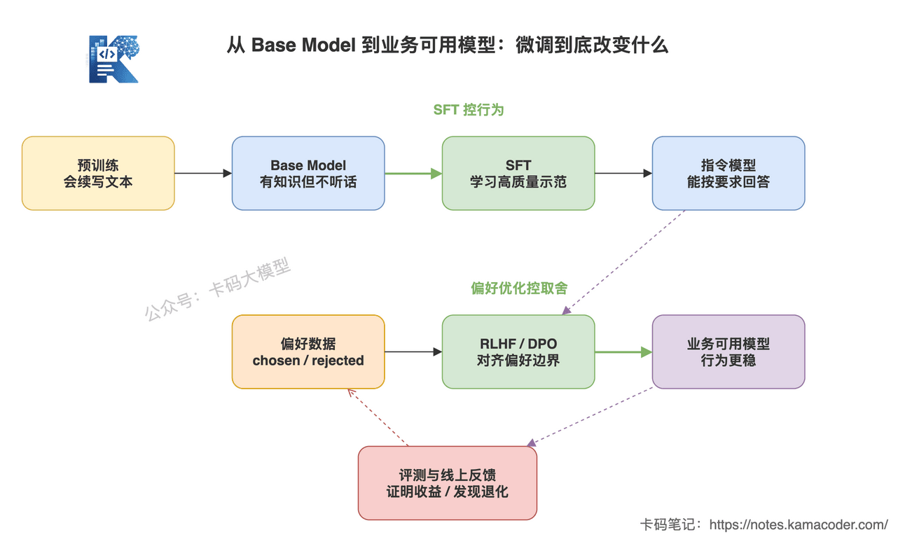
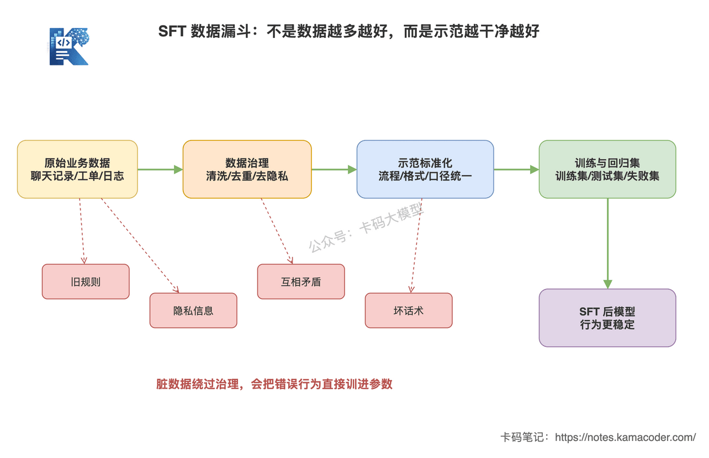
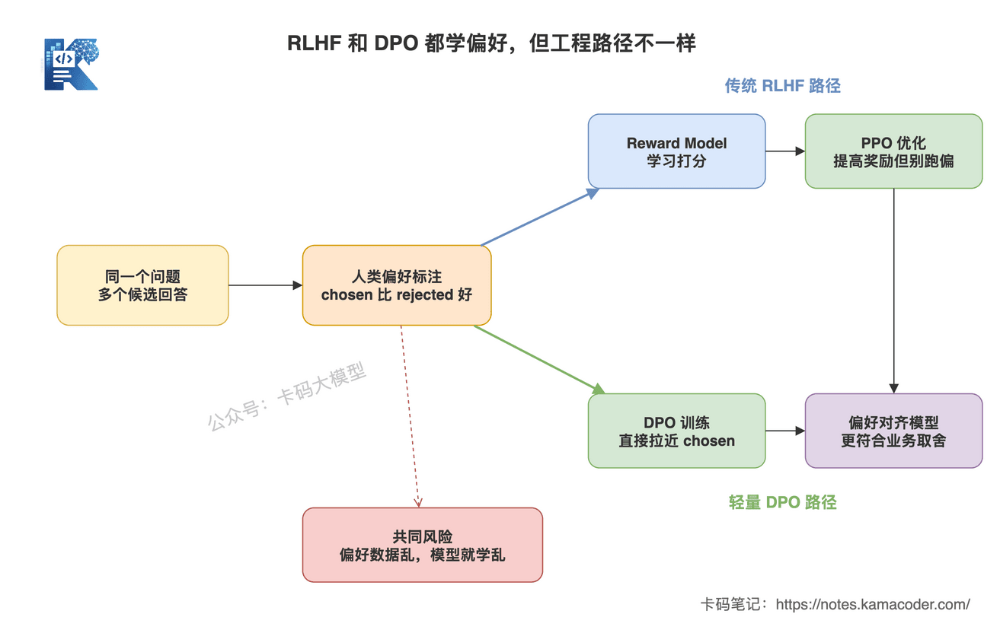
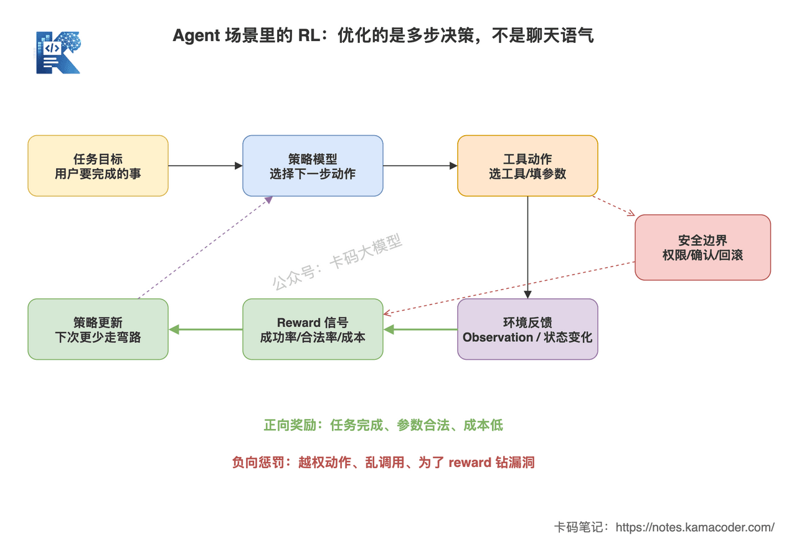
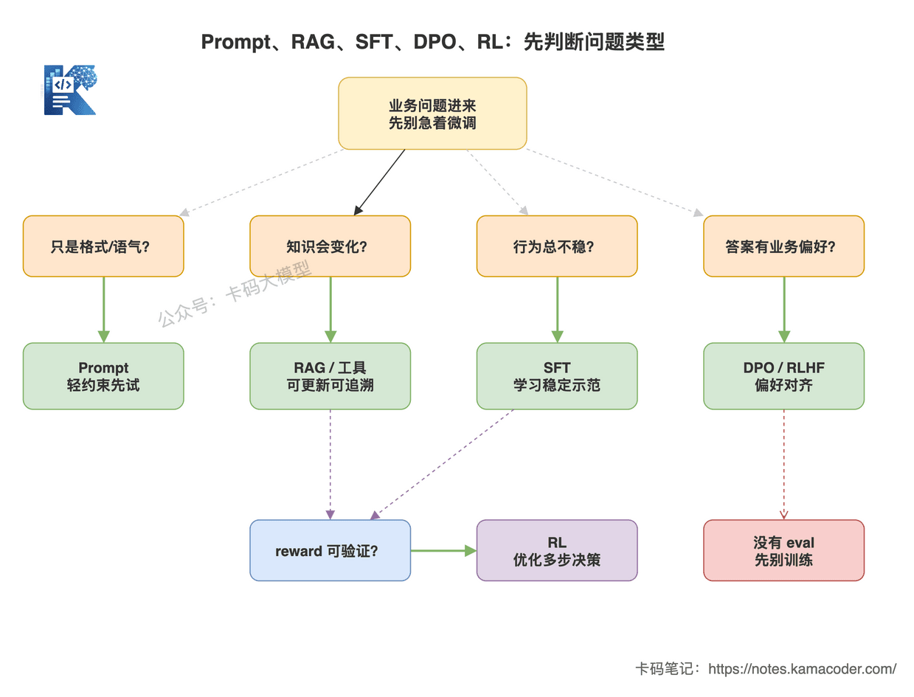
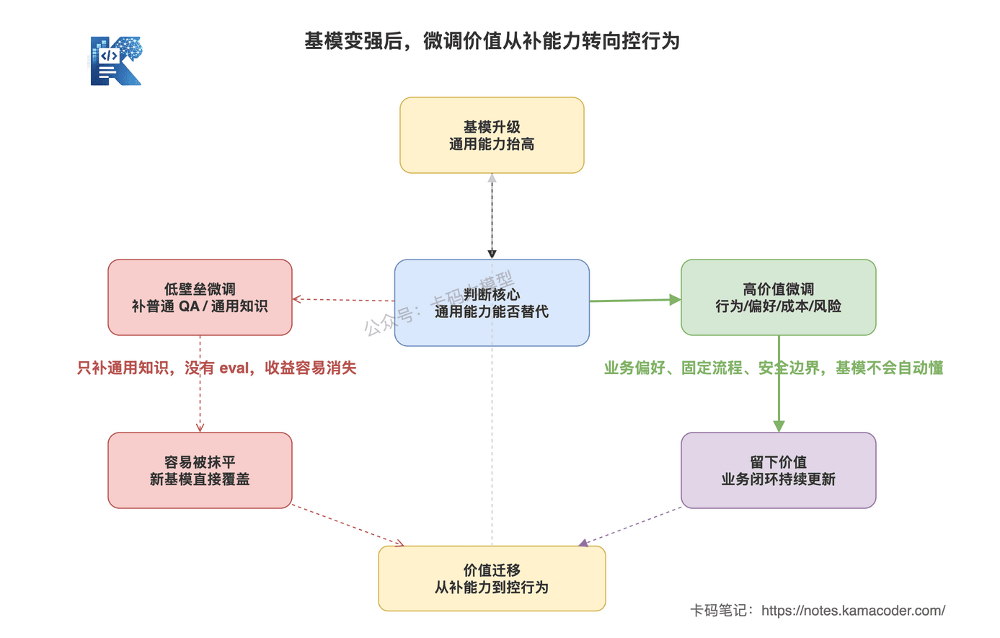
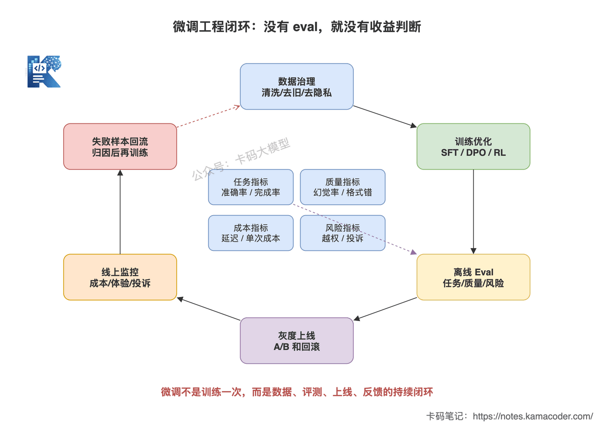

# SFT, RLHF, DPO: загальна картина методів донавчання

У попередній статті ми розглядали, [як оцінювати агента](./agent_evaluation.md).

Оцінювання дуже важливе, бо застосунок на LLM не вважається готовим лише тому, що «на вигляд відповідає».

У розділі про донавчання це ще актуальніше.

Багато хто, почувши слово «донавчання», вирішує, що це справа ML-позицій і прикладного розробника не стосується.

А дехто навпаки — пише в резюме «донавчав модель», але на уточнення інтерв'юера:

«Навіщо вам було донавчання? Які проблеми розв'язують SFT, RLHF і DPO? Чому не RAG?» —

застрягає.

І це прикро.

Прикладному розробнику не обов'язково власноруч навчати модель на десятки мільярдів параметрів, але він мусить знати:

**що саме донавчання змінює в моделі, які задачі йому пасують, а які взагалі не варто так розв'язувати.**

Формул тут не виводитимемо.

І назвами зі статей не сипатимемо.

Просто розберемо три групи методів — SFT, RLHF і DPO.

Після цього ви маєте вміти відповісти на чотири питання:

1. Чого SFT навчає модель?
2. Чому і RLHF, і DPO називають вирівнюванням за вподобаннями?
3. Яке місце в RLHF посідають PPO й Reward Model?
4. Як у реальному проєкті обирати між промптом, RAG, SFT, DPO і RL?

## 1. Спершу загальна картина: донавчання — це не «запхати в модель знання»

Перша реакція багатьох на донавчання така:

«Модель не знає бізнесу нашої компанії — донавчимо її, хай запам'ятає».

Це надто грубе розуміння.

**Частіше цінність донавчання не в тому, щоб додати знання, а в тому, щоб керувати поведінкою.**

Знання змінюються.

Правила продукту, ціни, наявність товару, структура компанії, положення політики — усе це може оновитися.

Якщо вшити таке в модель, то після зміни правил старе знання лишиться в параметрах, і вичистити його дуже важко.

Коли ми говорили про те, [навіщо потрібен RAG](./why_rag.md), уже йшлося: RAG краще пасує зовнішнім, приватним і динамічним знанням.

Донавчання краще пасує іншому класу проблем:

- модель знає правило, але формат виводу постійно скаче;
- модель уміє відповісти, але формулювання не відповідають прийнятим у бізнесі;
- модель виконує задачу, але порядок кроків часто плутається;
- кілька відповідей однаково правильні, але бізнес явно надає перевагу одній;
- малій моделі бракує можливостей, і хочеться, щоб вона засвоїла манеру відповідей великої на фіксованій задачі.

Як бачите, жодна з них не про «знає чи не знає».

Вони про «як робити, як відповідати, що обирати».

Тож запам'ятайте:

**RAG розв'язує потрапляння зовнішніх знань у контекст, а донавчання — засвоєння параметрами моделі патернів поведінки.**



Ця схема відповідає на питання: який рівень можливостей змінює кожен із методів — SFT, RLHF, DPO — на шляху від Base Model до придатного помічника.

Це не просто перелік назв: тут показано послідовність. Попереднє навчання дає модель, що вміє дописувати текст; SFT вчить її відповідати за інструкцією; RLHF і DPO наближають її до людських або бізнесових уподобань; а наприкінці вигоду обов'язково треба довести оцінюванням і зворотним зв'язком із продакшну.

## 2. SFT: показуємо моделі якісні зразки

SFT — це Supervised Fine-Tuning, кероване донавчання.

Одним реченням:

**SFT показує моделі якісні зразки того, «якому входу який вихід має відповідати», щоб вона наслідувала цю манеру.**

Скажімо, сценарій повернення коштів у підтримці.

Користувач питає:

«Чи можна повернути кошти за це замовлення?»

Погана відповідь:

«Можна».

Кращий зразок:

«Надайте, будь ласка, номер замовлення. Я перевірю його статус, час оплати й тип товару, а потім за правилами платформи визначу, чи виконуються умови повернення».

Дані для SFT — це велика кількість таких пар «питання + еталонна відповідь».

Побачивши їх достатньо, модель засвоює:

- у питаннях про повернення не робити висновок одразу;
- спершу отримати номер замовлення;
- потім перевірити статус;
- і лише тоді судити за правилами.

Ось у чому суть SFT: **навчання за зразком.**

### Чому пасує SFT

SFT пасує відносно стабільним задачам із чіткими зразками, для яких можна масово зібрати дані.

Наприклад:

- фіксований вивід у JSON;
- класифікація заявок;
- витягування інформації;
- сталі формулювання підтримки;
- формат виклику інструментів;
- стиль розбору документів;
- навчання малої моделі манері відповідей великої.

Спільне в цих задачах те, що ви можете описати, «як виглядає хороша відповідь».

Якщо ви вмієте стабільно писати хороші зразки, SFT матиме де розвернутися.

### Чому SFT не пасує

SFT не пасує для вшивання динамічних знань у модель.

Наприклад:

- ціни на товари;
- стан складу;
- свіжі нормативні зміни;
- внутрішні регламенти компанії;
- умови договорів;
- описи функцій продукту.

Ця інформація змінюється часто.

Навчили сьогодні — завтра вона вже застаріла.

Для таких сценаріїв доречніші RAG, запити до бази даних, виклик інструментів.

**SFT учить модель «як відповідати», а RAG дає їй «матеріали для відповіді».**

Цю межу треба розуміти чітко.

### Ризики SFT

Головна пастка SFT — якість даних.

Багато команд беруть логи чату підтримки й навчають просто на них.

На вигляд даних багато, а насправді там суцільні проблеми:

- старі правила;
- хибні процеси;
- невдалі формулювання;
- приватні дані;
- випадкові репліки операторів;
- кілька суперечливих відповідей на те саме питання.

Якщо це не почистити, модель засвоїть усе разом.

**Брудні дані — не актив, а джерело забруднення.**

Тож у проєкті з SFT найважливіше не «скільки записів я навчив».

А ось що:

- звідки взялися дані;
- як їх очищено;
- як зроблено дедуплікацію;
- як розмічено якість;
- як розділено навчальну й тестову вибірки;
- як повертаються в роботу невдалі приклади.

Коли на співбесіді ви доходите до цього, стає видно реальний досвід.



Ця схема відповідає на питання: чому ключове в SFT не «що більше даних, то краще», а те, що сирі бізнес-дані мусять пройти очищення, прибирання застарілого, вилучення приватного й уніфікацію формату зразків, і лише потім потрапити в навчання й оцінювання.

Червона пунктирна лінія показує, що брудні дані в обхід цієї обробки прямо забруднюють поведінку моделі; зелена суцільна — робочий шлях підготовки даних для SFT.

## 3. RLHF: модель вчиться, «яка відповідь людям подобається більше»

RLHF — це Reinforcement Learning from Human Feedback, навчання з підкріпленням на основі відгуків людей.

Одним реченням:

**RLHF не дає моделі еталонної відповіді, а повідомляє їй, який із кількох варіантів людям подобається більше.**

Скажімо, на ту саму скаргу модель дала дві відповіді.

A:

«Не відповідає правилам, повернення неможливе».

B:

«Розумію, що ситуація термінова. Для повернення треба спершу підтвердити статус замовлення й тип товару; якщо умови автоматичного повернення не виконуються, я перевірю, чи потрібне переведення на оператора».

Не обов'язково одна з них абсолютно хибна, а друга абсолютно правильна.

Але бізнесу, найімовірніше, значно більше подобається B.

Бо вона спокійніша, ввічливіша й показує подальший шлях.

Це і є питання вподобань.

### Типовий процес RLHF

Класичний RLHF виглядає приблизно так:

1. спершу навчити SFT-модель, що відповідає за інструкцією;
2. згенерувати кілька варіантів відповіді на те саме питання;
3. люди розмічають, який варіант кращий;
4. на цих даних навчається Reward Model;
5. далі модель оптимізується алгоритмом навчання з підкріпленням на кшталт PPO;
6. набором для оцінювання й продакшн-метриками перевіряється, чи не «навчилася» модель не туди.

Тут легко сплутати два поняття: Reward Model і PPO.

**Reward Model — це оцінювач.**

Вона засвоює людські вподобання й виставляє оцінки виводу моделі.

**PPO — це алгоритм оптимізації.**

Він оновлює модель за оцінками Reward Model і водночас не дає їй надто відхилитися від початкової.

Навіщо обмежувати?

Бо модель легко знаходить лазівки в системі винагороди.

Якщо Reward Model любить довгі відповіді, модель почне писати воду.

Якщо Reward Model любить ввічливий тон, модель стане настільки люб'язною, що це виглядатиме абсурдно.

Тому в PPO зазвичай контролюють, щоб модель не відхилялася надто різко.

На співбесіді формули виводити не треба — достатньо чітко пояснити цей зв'язок:

**RLHF навчає модель винагороди на людських уподобаннях, а потім алгоритмом навчання з підкріпленням схиляє модель до відповідей із високою винагородою.**

### Чому пасує RLHF

RLHF пасує задачам, де «єдиної правильної відповіді немає, але є виразна перевага».

Наприклад:

- відповідати ввічливіше чи прямолінійніше;
- межі відмови мають бути консервативнішими чи вільнішими;
- підтримка спершу заспокоює чи спершу пояснює правило;
- чи має медична консультація активно радити звернутися до лікаря;
- коли агент зазнав невдачі — пробувати далі чи зупинитися й уточнити.

Це не прості питання на знання.

Це радше ціннісні судження, вибір стилю, ставлення до ризику.

Тож ключове слово для RLHF — **вирівнювання за вподобаннями.**

### Вартість RLHF

RLHF важкий.

Важкий у трьох речах.

По-перше, розмітка людських уподобань дорога.

По-друге, сама Reward Model теж може навчитися не того.

По-третє, навчання PPO й підбір параметрів складні й часто нестабільні.

Тож у реальних проєктах, якщо у вас немає достатнього обсягу даних, спроможної команди й зрозумілої вигоди для бізнесу, не варто одразу кричати «робимо RLHF».

Реалістичніший шлях для прикладних команд такий.

Спершу промпт і RAG.

Потім SFT.

Коли з'явилися стабільні дані про вподобання — розглянути DPO.

І лише коли задача достатньо велика, зворотний зв'язок достатньо сильний, а вигода зрозуміла, — думати про повний RLHF чи ширший RL.

## 4. DPO: легке вирівнювання за вподобаннями без Reward Model

DPO — це Direct Preference Optimization, пряма оптимізація за вподобаннями.

Одним реченням:

**DPO навчає модель прямо на парах «краща відповідь проти гіршої», схиляючи її до кращої, без окремої Reward Model і складного процесу PPO.**

Дані про вподобання йому все одно потрібні.

Для того самого питання:

- `chosen` — відповідь, що більше відповідає вподобанням бізнесу;
- `rejected` — відповідь, що не відповідає.

DPO працює саме з такими даними.

Мета навчання — щоб модель далі схилялася до `chosen`, а не до `rejected`.



Ця схема відповідає на питання: і RLHF, і DPO роблять вирівнювання за вподобаннями, але інженерні шляхи в них різні.

RLHF спершу перетворює людські вподобання на Reward Model, а потім оптимізує модель через PPO; DPO оновлює модель безпосередньо з пар вподобань. Обидва спираються на дані про вподобання, а різниця в тому, чи є посередині окрема модель винагороди й етап навчання з підкріпленням.

### Чому DPO став популярним

Бо інженерно він легший.

Класичний RLHF вимагає навчити Reward Model і прогнати PPO.

DPO прибирає багато проміжної складності.

Для прикладної команди це дуже практично:

- коротший процес навчання;
- менший тиск підбору параметрів;
- зазвичай краща стабільність;
- легше стартувати на вже наявних даних про вподобання.

Тож якщо у вас уже є надійний набір пар вподобань — вдалі й невдалі відповіді підтримки, відповідні й невідповідні вимогам варіанти, правильні й хибні траєкторії викликів інструментів, — DPO буде простішою точкою входу.

### Межі DPO

DPO не є універсальною заміною RLHF.

Його передумова — достатньо висока якість даних про вподобання.

Якщо критерії розмітки плутані, DPO навчиться плутанині.

Сьогодні розмітник любить лаконічність, завтра — докладність.

Сьогодні вважає, що треба відмовити, завтра — що треба дати пораду.

З такими даними модель хитатиметься з боку в бік.

Є ще сценарій, де DPO може не вистачити.

Наприклад, багатокрокове виконання в агента.

Модель не просто видає одну відповідь, а послідовно діє в середовищі:

```text
зрозуміти задачу → обрати інструмент → заповнити параметри → прочитати результат → вирішити наступний крок → завершити задачу
```

Якщо ви хочете оптимізувати частку виконаних задач, успішність викликів інструментів і здатність відновлюватися після помилок, самих лише статичних пар вподобань може забракнути.

Тут потрібні реальний зворотний зв'язок середовища й оцінювання на рівні траєкторій.

## 5. RL: братися варто лише тоді, коли винагорода чітка

Багато хто змішує RLHF і RL.

Насправді RLHF — це один із варіантів RL.

RL ширший.

Одним реченням:

**RL — це коли модель виконує дії в середовищі, середовище дає винагороду, і модель вчиться підвищувати довгострокову винагороду.**

Людські вподобання тут не обов'язкові.

Достатньо, щоб винагороду можна було визначити.

Скажімо, задачі з кодом:

- компіляція пройшла — висока винагорода;
- юніт-тести пройшли — висока винагорода;
- код падає з помилкою — низька.

Або математичні задачі:

- фінальна відповідь правильна — висока винагорода;
- хід міркування порушує обмеження — низька.

Або виклик інструментів агентом:

- інструмент обрано правильно — висока винагорода;
- параметри коректні — висока;
- задачу виконано — висока;
- дія поза межами прав — сувора штрафна санкція.

Такі задачі пасують RL краще.

Бо винагорода відносно об'єктивна.

А якщо винагорода розмита й зводиться до «мені здається, ця відповідь краща», братися за RL небезпечно.

Модель почне шукати лазівки в правилах заради високого бала.

Це і є те, що називають reward hacking.

Тож суть RL не в тому, що він «просунутіший».

А в тому:

**чи є у вас чіткий, стабільний і перевірюваний сигнал винагороди.**

Без нього RL лише збільшить проблему.



Ця схема відповідає на питання: чому в агентах RL — це не «навчити модель краще спілкуватися», а перетворення зворотного зв'язку середовища (вибір інструмента, коректність параметрів, частка виконаних задач, ризик виходу за межі прав) на винагороду, якою потім оптимізуються багатокрокові рішення.

Зелені стрілки позначають перевірювану позитивну винагороду, а червоні пунктирні — шляхи, які треба штрафувати або блокувати: вихід за межі прав, безладні виклики, reward hacking.

## 6. Як обирати між промптом, RAG, SFT, DPO і RL

Це найчастіше питання і на співбесідах, і в реальних проєктах.

Не починайте одразу з донавчання.

Але й не зводьте все до RAG.

Раджу судити за природою проблеми.



Ця схема відповідає на питання: коли надходить задача для застосунку на LLM, спершу треба визначити, це проблема формату, знань, поведінки, вподобань чи перевірюваного рішення.

Різним проблемам відповідають різні інструменти: промпт для легких обмежень, RAG та інструменти для динамічних знань, SFT для стабілізації поведінки, DPO та RLHF для вирівнювання за вподобаннями, а RL — лише коли є чітка винагорода.

### 1. Це питання формулювання й формату — спершу промпт

Наприклад:

- спершу висновок, потім пояснення;
- вивід у JSON;
- якщо не знаєш — так і скажи;
- відповідь не довша за 200 слів;
- відповідати лише за наданими матеріалами.

Тут передусім промпт.

Якщо промпт стабільно розв'язує задачу, навчати не треба.

Навчання тягне за собою дані, вартість, версії, оцінювання й відкати.

### 2. Це питання динамічних знань — передусім RAG або інструменти

Наприклад:

- дізнатися ціну товару;
- дізнатися статус замовлення;
- знайти внутрішній регламент;
- знайти пункт документа;
- знайти відповідь у базі знань.

Тут передусім RAG або інструменти.

Бо знання мають оновлюватися, бути простежуваними й замінними.

Донавчання — не база знань.

### 3. Це питання стабільності поведінки — тоді розглядайте SFT

Наприклад:

- формат виводу постійно скаче;
- порядок кроків задачі часто плутається;
- параметри викликів інструментів нестандартні;
- формулювання у фіксованому сценарії неоднакові.

Тут SFT має цінність.

Бо ви хочете, щоб сталий патерн поведінки засвоївся параметрами моделі.

### 4. Це питання вподобань — розглядайте DPO або RLHF

Наприклад:

- обидві відповіді придатні, але бізнес явно надає перевагу одній;
- межа відмови має бути консервативнішою;
- підтримка спершу заспокоює, потім розв'язує;
- у сценаріях безпеки формулювання має відповідати вимогам комплаєнсу.

Це вже не проста задача зразка.

Це задача вподобань.

Якщо є стабільні пари вподобань, спершу розгляньте DPO.

А якщо масштаб бізнесу великий і система збору вподобань зріла — тоді повний RLHF.

### 5. Є перевірювана винагорода — тоді RL

Наприклад:

- чи проходять юніт-тести;
- чи влучив пошук;
- чи успішний виклик інструмента;
- чи виконано задачу агентом;
- чи заблоковано ризиковану дію.

Лише за наявності такого чіткого зворотного зв'язку є ґрунт для RL.

Інакше не варто братися за нього заради солідного вигляду.

## 7. Базові моделі дедалі сильніші — чи потрібне ще донавчання?

Це питання зараз дуже люблять на співбесідах.

«Універсальні базові моделі дедалі сильніші — чи не зітре це цінність вузькоспеціалізованих SFT, RLHF і DPO?»

Відповідь така:

**неякісне донавчання зітреться, а якісний контроль поведінки — ні.**

Яке донавчання легко стирається?

- кілька тисяч звичайних питань-відповідей заради загальних знань;
- без набору для оцінювання, лише на суб'єктивних відчуттях;
- вшивання динамічних бізнес-правил у модель;
- низька якість даних, суперечливі відповіді;
- варто оновитися базовій моделі — і виграш зникає.

Таке донавчання справді дешевшає з кожним роком.

Бо ви доповнюєте загальні можливості, а саме вони найшвидше поліпшуються з кожною ітерацією базової моделі.

Але є цінність, яку зростання базових моделей не зітре автоматично:

- сталі бізнес-процеси;
- єдині формулювання бренду;
- межі безпечних відмов;
- здешевлення за рахунок малих моделей;
- формат викликів інструментів;
- вподобання щодо багатокрокових рішень агента;
- повернення в роботу невдалих продакшн-прикладів.

Це не те, чому нова «розумніша» базова модель відповідатиме сама собою.

Тож точніше формулювання таке:

**цінність донавчання зміщується від доповнення можливостей до контролю поведінки, вподобань, вартості й ризиків.**

Це судження звучить інженерніше, ніж просте «донавчання корисне» чи «донавчання непотрібне».



Ця схема відповідає на питання: яка цінність донавчання стирається зі зростанням базових моделей, а яка лишається.

Червоний шлях — донавчання з низьким бар'єром заради «доповнення загальних знань», яке перекривається новою базовою моделлю; зелений — стабільніша цінність контролю бізнес-поведінки, вподобань, вартості й ризиків.

## 8. Як інженерно довести, що донавчання дало вигоду

Найгірше, що можна сказати про донавчання:

«Здається, стало краще».

Це не інженерний висновок.

До й після донавчання треба дивитися щонайменше чотири групи показників.



Ця схема відповідає на питання: донавчання не закінчується одним прогоном навчання — це цикл із керування даними, навчання, офлайн-оцінювання, поетапного викочування, продакшн-моніторингу й повернення невдалих прикладів.

Без оцінювання й зворотного зв'язку неможливо визначити, чи дали SFT, DPO або RL реальну вигоду.

### 1. Показники задачі

Чи покращилася сама задача:

- точність класифікації;
- F1 витягування інформації;
- частка валідного JSON;
- успішність викликів інструментів;
- частка виконаних задач;
- частка розв'язаних питань користувачів.

Це базові показники.

### 2. Показники якості

Чи покращилася якість відповідей:

- частка галюцинацій;
- частка помилок формату;
- частка відповідей без доказів;
- частка хибних відмов;
- частка переходів на людину;
- коректність опрацювання високоризикових питань.

Особливо в RAG- і агентних проєктах не можна дивитися лише на задоволеність користувачів.

Треба дивитися й на ланцюжок доказів, і на траєкторію виконання.

### 3. Показники вартості

Дуже часта мета донавчання — здешевлення:

- наскільки впала вартість одного виклику;
- наскільки зменшилася затримка;
- яку частку трафіку взяла на себе мала модель;
- наскільки зменшилася кількість викликів великої моделі.

Якщо результат приблизно той самий, а вартість упала вдвічі, це теж дуже реальна вигода.

### 4. Показники ризику

У високоризиковому бізнесі треба дивитися, чи знизився ризик:

- частка дій поза межами прав;
- частка хибних пропусків;
- частка хибних відмов;
- частка скарг;
- кількість відкатів;
- частота спрацювання погоджень.

Донавчання не має зводитися до «відповідає більш по-людськи».

Воно має робити систему стабільнішою.

### 5. Регресійне тестування

Щоразу, коли ви змінюєте промпт, RAG, інструменти, модель або робите донавчання, треба ганяти регресію.

Інакше легко отримати таке:

цей сценарій покращився, а інший зламався;

на навчальній вибірці результат зріс, а на реальних продакшн-питаннях просів;

формат став стабільнішим, але межі відмов зруйновані.

Тож потрібен сталий регресійний набір.

І особливо важливо зберігати історичні невдалі випадки.

**Невдалі приклади — не сміття, а найцінніші дані для наступного раунду оптимізації.**

## 9. Як розповідати про це на співбесіді

Якщо інтерв'юер питає:

«Як ви дивитеся на SFT, RLHF і DPO? Кому що пасує?»

Можна відповісти так:

> «Я спершу розкладаю донавчання за типами проблем.
>
> SFT — це кероване донавчання, яке пасує навчанню моделі на якісних зразках. Воно доречне для фіксованого формату виводу, сталого процесу задачі, патернів виклику інструментів, галузевих формулювань і дистиляції в малу модель, але не для вшивання бізнес-знань, що часто змінюються. Для динамічних знань я передусім беру RAG або запити через інструменти.
>
> RLHF розв'язує задачу вирівнювання за вподобаннями. Він дає моделі не єдину правильну відповідь, а розуміння, який із варіантів більше відповідає людським чи бізнесовим уподобанням. Класичний процес зазвичай включає навчання Reward Model і подальшу оптимізацію алгоритмом на кшталт PPO.
>
> DPO теж є оптимізацією за вподобаннями, але інженерно легшою. Він навчається прямо на парах chosen/rejected, прибираючи окрему Reward Model і складність PPO. Тож якщо в команди вже є якісні дані про вподобання, я радше почну з DPO, ніж одразу робитиму повний RLHF.
>
> Ширший RL варто застосовувати лише тоді, коли винагорода чітка: юніт-тести, правильність математичної відповіді, успішність викликів інструментів агентом, частка виконаних задач. Якщо винагорода розмита, RL легко навчить модель не того.
>
> Тож я не сприймаю донавчання як "доповнення знань моделі". Зі зростанням базових моделей неякісне вузьке донавчання справді стирається, але контроль поведінки, вподобань, вартості й ризиків лишається цінним. А чи варте воно заходу зрештою визначають набір для оцінювання, продакшн-метрики, співвідношення вартості й вигоди та показники ризику, а не суб'єктивні відчуття».

Така відповідь показує три речі.

Перше — ви знаєте поняття.

Друге — ви знаєте межі.

Третє — ви розумієте, що у впровадженні треба говорити метриками.

Це значно корисніше, ніж переказувати визначення SFT, RLHF і DPO.

## 10. Наостанок

Запам'ятайте:

**донавчання не є варіантом за замовчуванням у застосунках на LLM.**

Багато проблем розв'язують промпт, RAG, інструменти, правила й workflow.

Але й безкорисним воно не є.

Коли треба вкласти в модель сталу поведінку, бізнесові вподобання, межі ризику й структуру вартості, донавчання має цінність.

Головне не в тому, чи вмієте ви вимовляти SFT, RLHF і DPO.

Головне в тому, чи можете ви чітко пояснити:

**навіщо навчати, чого саме навчати, як оцінювати й що робити, якщо не вийде.**

Оце і є інженерне розуміння донавчання.
