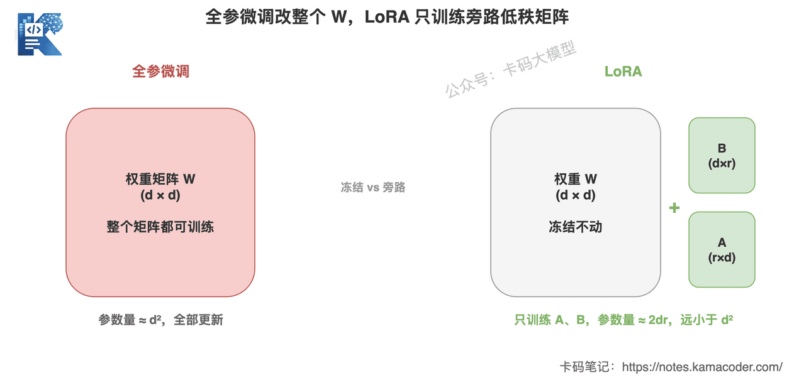
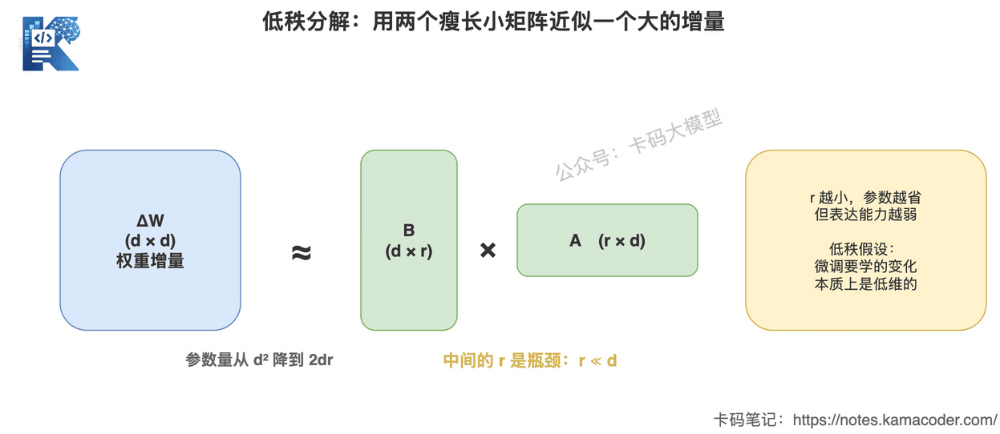
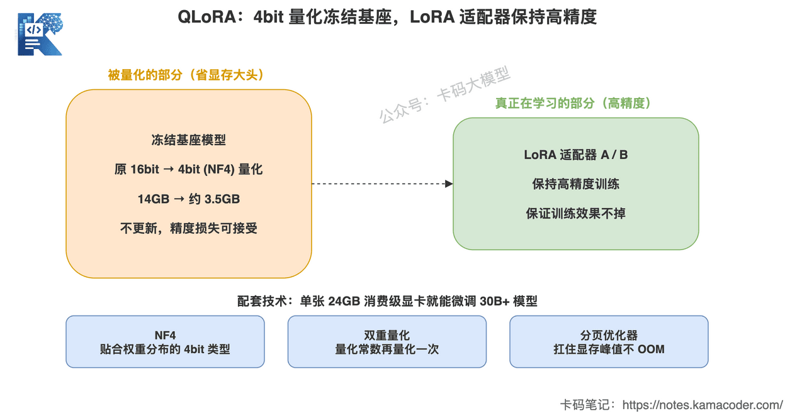
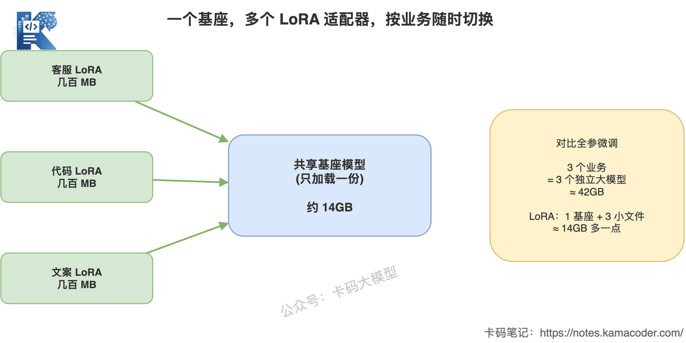

# LoRA і QLoRA: чому низькорангове донавчання таке популярне

У попередній статті ми розглядали [загальну картину методів донавчання: SFT, RLHF, DPO](./finetuning_sft_rlhf_dpo.md).

Там ішлося про те, **що** робить донавчання.

Тут — про те, **як** його насправді проводять.

Бо байдуже, робите ви SFT чи DPO: коли доходить до практики, майже неможливо обійти одне слово:

**LoRA.**

Погляньте на будь-який відкритий проєкт з донавчання чи будь-який туторіал з навчання вузькоспеціалізованої моделі — з високою ймовірністю там LoRA або QLoRA.

Чому?

Бо це дешево.

Наскільки дешево?

**Модель, яку раніше треба було навчати на восьми A100, з QLoRA запускається на одній споживчій відеокарті.**

Ось причина популярності.

Але дешево не означає, що ви це зрозуміли.

Інтерв'юери люблять копати саме тут:

«Ви навчали на LoRA? Який виставили rank? Чому саме такий?»

«Навіщо потрібен `lora_alpha`?»

«На які шари ви вішали LoRA?»

«Чим QLoRA відрізняється від LoRA? Що саме там квантизується?»

Ці кілька питань за секунду відділяють того, хто «вміє запускати скрипт», від того, хто розуміє принцип.

Формул тут не виводитимемо. Просто розберемо LoRA й QLoRA так, щоб ви могли самі відповісти на всі ці питання.

## 1. Спершу з'ясуймо, чим саме дороге повне донавчання

Щоб зрозуміти, на чому економить LoRA, треба знати, чому дороге повне донавчання.

Багато хто вважає, що справа в «моделі багато параметрів».

Це правда лише наполовину.

Відеопам'ять з'їдають не лише ваги моделі.

Візьмімо модель на 7B, найпоширеніший оптимізатор Adam, точність FP16 і порахуймо:

- **ваги моделі:** 7 млрд параметрів, приблизно 14 ГБ;
- **градієнти:** для кожного параметра потрібен свій градієнт — ще приблизно 14 ГБ;
- **стан оптимізатора:** Adam зберігає для кожного параметра момент і дисперсію, тобто дві копії — близько 28 ГБ (а якщо їх тримати у FP32, що доволі типово, то вдвічі більше).

Лише ці три складові дають приблизно **56 ГБ**, а з FP32-станом оптимізатора — уже за 80 ГБ.

І це ще без активацій прямого проходу.


Ця схема відповідає на питання: основну відеопам'ять при повному донавчанні з'їдають не ваги моделі, а градієнти й стан оптимізатора.

Помітьте: **ваги займають одну копію, градієнти — ще одну, а стан Adam — дві.** Під час навчання «супутні витрати» на кожен навчаний параметр більші за самі ваги.

Отже, суперечність очевидна:

**доки ви оновлюєте всі параметри, від градієнтів і стану оптимізатора нікуди не дітися, і відеопам'ять не зменшиться.**

А чи можна **оновлювати лише невелику частину параметрів**, щоб градієнти й стан оптимізатора стосувалися лише її?

Саме з цього й починається LoRA.

## 2. Основна ідея LoRA: заморозити оригінальні ваги й вчити тільки «приріст»

LoRA — це Low-Rank Adaptation, низькорангова адаптація.

Ідея дуже проста й складається з двох речень.

**Перше: усі оригінальні ваги моделі заморожуються, жодна не змінюється.**

**Друге: поруч додаються дві маленькі матриці, і вчаться лише вони — вони й виражають ту частину, на яку ваги мають змінитися.**

Запишемо це математично, але лише одним виразом.

Ваги шару — це W, і донавчання по суті прагне отримати нові ваги:

```text
W_new = W + ΔW
```

Повне донавчання змінює саму W, тож ΔW має той самий розмір, що й W.

LoRA не чіпає W, а каже: **цей приріст ΔW я наближу добутком двох маленьких матриць.**

```text
ΔW = B × A
```

де:

- A має форму r × d;
- B має форму d × r;
- а те `r` посередині — це і є знаменитий **rank (ранг)**, причому r значно менше за d.

Під час навчання W заморожена, оновлюються лише A і B.

Під час інференсу `W + B×A` об'єднують, і за ефектом це еквівалентно донавченим вагам.



Ця схема відповідає на питання: що саме змінюють повне донавчання й LoRA.

Ліворуч повне донавчання: уся матриця W навчається (червоне). Праворуч LoRA: оригінальна W заморожена (сіре), а вчаться лише дві вузькі маленькі матриці A і B збоку (зелене).

Наскільки велика різниця в кількості параметрів?

Припустімо, d = 4096. При повному донавчанні цей шар оновлює 4096 × 4096 ≈ 16,8 млн параметрів.

LoRA з r = 8 оновлює лише 4096×8 + 8×4096 = 65 536 параметрів.

**У 256 разів менше.**

А менша в 256 разів кількість навчаних параметрів означає, що градієнти й стан оптимізатора теж меншають у стільки ж разів.

Відеопам'ять падає сама собою.

## 3. Чому «низького рангу» вистачає

Тут у багатьох виникає природний сумнів:

«Ви наближаєте велику матрицю такою маленькою — хіба інформація не губиться? Хіба це працюватиме?»

Питання слушне.

Відповідь захована в одному спостереженні:

**коли велика модель адаптується до подальшої задачі, напрямів, у яких ваги справді мають змінитися, не так уже й багато.**

Інакше кажучи, приріст ваг ΔW, що його дає донавчання, хоч і має великий розмір, за своєю суттю є низькоранговою матрицею: вимірність справді корисної інформації в ньому низька.

Наведімо порівняння.

Попередньо навчена модель уже володіє 99% загальних можливостей.

Донавчаючи, ви не вчите її наново, а лише трохи коригуєте наявні вміння.

Для такого коригування не потрібна велика матриця повного рангу.

Низькорангова цілком здатна виразити цей «напрям коригування».



Ця схема відповідає на питання: чому добуток двох вузьких маленьких матриць здатен замінити оновлення великої.

Матриця d×d розкладається на d×r і r×d. Те `r` посередині працює як пляшкове горлечко, через яке інформація мусить протиснутися. Це горлечко змушує модель вчити лише найважливіші напрями змін, а не безсистемно правити все підряд.

Тож низький ранг — це не «зробити абияк».

Це припущення: **те, що має вивчити донавчання, і так є низьковимірним.**

Практика показує, що для переважної більшості подальших задач це припущення виконується.

## 4. Rank і alpha: два параметри, які найбільше люблять на співбесідах

Коли принцип зрозумілий, з параметрами стає просто.

Два найважливіші гіперпараметри LoRA — це `r` (rank) і `lora_alpha`.

### Як розуміти й задавати rank

Rank — це ширина того самого пляшкового горлечка.

**Що більший rank, то багатші зміни може виразити бічна матриця, але то більше й навчаних параметрів.**

- Замалий rank (1, 2): виразної здатності може забракнути, складна задача не засвоїться.
- Завеликий rank (скажімо, 256): параметрів більшає, перевага в економії відеопам'яті зменшується, ще й можливе перенавчання на малому наборі даних.

То яке значення ставити?

Практичний діапазон такий:

**для більшості сценаріїв вистачає rank 8, 16 або 32.**

- Проста задача, мало даних: починайте з 8.
- Складна задача, багато даних, сильна відмінність від розподілу попереднього навчання: можна піднімати до 16, 32, 64.
- Якщо доводиться йти вище 128, це зазвичай означає, що задача взагалі погано пасує LoRA і варто розглянути повне донавчання.

Питаючи «який rank», інтерв'юер хоче почути не число.

Він хоче почути, **чи розумієте ви компроміс за цим числом**:

> «Rank керує виразною здатністю низькорангової матриці. Я починаю з 8 або 16 і піднімаю за складністю задачі та результатами на валідаційній вибірці. Якщо ефект з'являється лише на дуже великих значеннях, це означає, що низькорангове припущення тут не дуже виконується, і я перегляну варіант повного донавчання».

Ось така відповідь доречна.

### Навіщо потрібен alpha

`lora_alpha` — це масштабувальний коефіцієнт.

Вивід бічної гілки LoRA множиться на `alpha / r` і лише потім додається до основної гілки:

```text
W_new = W + (alpha / r) × B × A
```

Розуміти це можна як **регулятор гучності** цієї бічної гілки.

Він визначає, з якою силою вивчене LoRA накладається на оригінальну модель.

На практиці є поширене правило:

**alpha зазвичай ставлять приблизно вдвічі більшим за rank.** Скажімо, rank = 8 і alpha = 16, rank = 16 і alpha = 32.

Навіщо ділити на r?

Щоб при збільшенні rank загальна амплітуда виводу бічної гілки не змінювалася різко. Так підбір параметрів стабільніший, і не доведеться переналаштовувати швидкість навчання щоразу, коли ви змінили rank.

Якщо на співбесіді ви пояснили, що «alpha/r — це масштабування, потрібне для стабільності навчання при зміні rank», ви вже на голову вище за тих, хто просто лишає значення за замовчуванням.

### І ще одне, що часто ігнорують: на які шари вішати

LoRA не вішають бездумно на всі шари.

За це відповідає параметр `target_modules`, який визначає, до яких ваг чіпляються бічні матриці.

- У ранній статті про LoRA її переважно вішали на `q_proj` і `v_proj` в attention.
- Зараз частіше додають ширше: `q/k/v/o` плюс кілька проєкційних шарів FFN.
- Що більше шарів, то більше навчаних параметрів: результат може бути кращим, але й витрати більші.

Це теж точка компромісу.

Якщо на співбесіді ви самі згадаєте, що «вішали LoRA на проєкційні шари attention і FFN», буде видно, що ви справді налаштовували це, а не взяли конфігурацію за замовчуванням.

## 5. QLoRA: притиснути вартість ще нижче

LoRA вже зрізала кількість навчаних параметрів до мізеру.

Але лишилася ще одна гора:

**заморожена оригінальна модель усе одно має повністю завантажитися у відеопам'ять.**

У моделі на 7B самі лише ваги — це 14 ГБ, у моделі на 70B — 140 ГБ.

Хоч вона й заморожена й не бере участі в оновленні градієнтів, її все одно треба тримати у відеопам'яті для прямого проходу.

Саме це й розв'язує QLoRA.

QLoRA = Quantization + LoRA, квантизація плюс низькорангова адаптація.

Основна дія тут одна:

**заморожену базову модель завантажують після 4-бітної квантизації, а бічні матриці LoRA й далі навчаються з вищою точністю.**



Ця схема відповідає на питання: що саме квантизує QLoRA.

Зверніть увагу: до 4 біт стискається **заморожена база** (вона й так не оновлюється, тож невелика втрата точності прийнятна). А **адаптер LoRA, який справді вчиться, лишається у високій точності**, щоб якість навчання не просіла.

Ефект від цього стиснення миттєвий:

- ваги з 16 біт до 4 біт — відеопам'ять падає приблизно вчетверо;
- модель на 7B, що займала 14 ГБ, після квантизації займає близько 3,5 ГБ;
- а сама LoRA додає зовсім мало навчаних параметрів.

**Підсумок: на одній споживчій відеокарті на 24 ГБ можна донавчати моделі на 30B і навіть більші.**

Ось чому з появою QLoRA поріг входу у вузькоспеціалізоване донавчання просто впав.

Звичайні люди й невеликі команди отримали змогу навчати моделі на власному залізі.

### Кілька ключових технічних моментів QLoRA

Якщо на співбесіді копатимуть глибше, ці слова дуже додадуть балів:

- **NF4 (4-bit NormalFloat)** — тип даних для 4-бітної квантизації, спеціально спроєктований під ваги з нормальним розподілом; він краще відповідає реальному розподілу ваг великих моделей, ніж звичайний int4, тож втрати точності менші;
- **подвійна квантизація (Double Quantization)** — квантизують навіть константи, що виникають під час самої квантизації, заощаджуючи ще трохи пам'яті;
- **Paged Optimizer** — використовує механізм сторінкової організації пам'яті, щоб пережити випадкові піки споживання під час навчання й не впасти з OOM.

Запам'ятовувати деталі реалізації не обов'язково.

Але розуміння, що «QLoRA не просто грубо ріже точність, а використовує розумнішу квантизацію на кшталт NF4, щоб зберегти якість», для відповіді цілком достатньо.

### Ціна QLoRA

Безкоштовних обідів не буває.

QLoRA економить відеопам'ять, але має свою ціну:

- **навчання зазвичай повільніше за LoRA**, бо під час прямого проходу 4-бітні ваги доводиться постійно деквантизувати до обчислювальної точності;
- **теоретично трохи просідає точність**: хоч NF4 і зроблено добре, 4 біти містять менше інформації, ніж 16.

Тож логіка вибору зрозуміла:

**вистачає відеопам'яті — беріть LoRA; не вистачає й карта замала — беріть QLoRA й міняйте час на простір.**

## 6. Ще одна недооцінена перевага LoRA: гнучкість розгортання

Багато хто бачить лише економію відеопам'яті під час навчання.

Насправді в розгортанні LoRA має ще один козир.

Адже результат навчання LoRA — це лише дві маленькі матриці, зазвичай від кількох десятків до кількох сотень мегабайтів.

Базова модель узагалі не змінилася.

Що це означає?

**Одна базова модель може одночасно мати кілька різних адаптерів LoRA, які перемикаються під потреби бізнесу.**



Ця схема відповідає на питання: чому LoRA особливо вигідна, коли напрямів бізнесу кілька.

Посередині спільна базова модель, а збоку висять кілька невеликих адаптерів: для підтримки, для коду, для текстів. Прийшов запит — підключаємо потрібну можливість, а база завантажена в одному екземплярі.

Порівняймо з повним донавчанням:

- при повному донавчанні для кожного напряму треба зберігати цілу окрему велику модель;
- з LoRA достатньо однієї бази плюс кілька файлів на кількасот мегабайтів.

Для трьох напрямів повне донавчання означає три моделі на 7B (приблизно 42 ГБ), а LoRA — одну базу й три невеликі файли (трохи більше за 14 ГБ).

Цей підхід «одна база, багато адаптерів» украй практичний у реальному продакшні.

І це хороший матеріал, щоб показати на співбесіді розуміння інженерного впровадження.

## 7. LoRA не всесильна: коли її не вистачає

Після стількох переваг треба окреслити й межі, інакше вийде реклама.

У LoRA є своя область застосування.

**У таких випадках LoRA може не вистачити й варто розглянути повне донавчання:**

- **задача дуже далека від розподілу попереднього навчання** — скажімо, перетворити універсальну модель на модель для геть нової мови чи цілком нової галузевої мови: низькорангове припущення може не виконуватися;
- **треба вкласти в модель великий обсяг цілком нових знань** — тут, щоправда, спершу варто подумати про RAG, але якщо вже конче треба вшити це в параметри, низькорангової місткості може забракнути;
- **потрібен максимальний результат за достатніх ресурсів** — коли даних і обчислень вдосталь, стеля повного донавчання зазвичай усе ж трохи вища.

Утім, для переважної більшості прикладних розробників:

**90% потреб у донавчанні чудово закриваються LoRA або QLoRA.**

Сценарії, де потрібне повне донавчання, — радше виняток.

Тож не сприймайте LoRA як «спрощений, урізаний варіант».

У більшості реальних задач це саме **найвигідніше за співвідношенням ціни та якості рішення**.

## 8. Як розповідати про це на співбесіді

Якщо інтерв'юер питає:

«Яким методом ви донавчали? LoRA? Розкажіть, чому саме нею й як задавали параметри».

Можна відповісти так:

> «Ми використовували LoRA, а коли з ресурсами було сутужно — QLoRA.
>
> Головна причина — економія відеопам'яті. Повне донавчання оновлює всі параметри, і витрати на градієнти й стан оптимізатора перевищують самі ваги моделі. LoRA заморожує оригінальні ваги й навчає лише дві низькорангові матриці збоку, тож кількість навчаних параметрів падає в сотні разів, а разом із нею й витрати на градієнти та оптимізатор.
>
> Її передумова в тому, що приріст ваг, який має вивчити донавчання, за своєю суттю низькоранговий: модель уже володіє загальними можливостями, і для адаптації достатньо скоригувати кілька напрямів, тож низькорангова матриця це виражає.
>
> Щодо параметрів: rank я зазвичай беру від 8 або 16 і піднімаю за складністю задачі та результатами валідації; якщо ефект з'являється лише на дуже великих значеннях, LoRA цій задачі не дуже пасує, і я повертаюся до варіанта повного донавчання. Alpha зазвичай удвічі більший за rank — це масштабувальний коефіцієнт, а ділення на r потрібне, щоб навчання лишалося стабільним при зміні rank. Саму LoRA я вішаю на q/k/v/o в attention і на проєкційні шари FFN.
>
> Якщо відеопам'яті зовсім бракує, беремо QLoRA: заморожену базу квантизуємо в 4 біти через NF4, а адаптер лишаємо у високій точності; ціна — трохи повільніше навчання й невелика втрата точності.
>
> Крім того, LoRA дає перевагу в розгортанні: одна база може мати кілька адаптерів, які перемикаються під бізнес, і не треба зберігати окрему велику модель для кожного напряму».

Така відповідь показує чотири речі.

Перше — ви розумієте, **на чому** економія (градієнти й стан оптимізатора).

Друге — ви розумієте, **чому** економія можлива (низькорангове припущення).

Третє — ви розумієте компроміси за параметрами (rank, alpha, target_modules).

Четверте — ви розумієте інженерне впровадження (QLoRA, кілька адаптерів).

Це значно сильніше за фразу «ми донавчили модель за допомогою LoRA».

## 9. Наостанок

Тримайте головну лінію:

**LoRA ніколи не розв'язувала проблему якості — вона розв'язує проблему вартості.**

Вона не робить модель розумнішою.

Вона, спираючись на припущення про низькорангову природу донавчання, зрізає вартість навчання й розгортання до частки від початкової.

Саме через дешевизну донавчання великих моделей із «привілею великих компаній» перетворилося на щось доступне кожному.

Але дешевизна не має бути виправданням незнання принципів.

Людей, які вміють запустити скрипт LoRA, багато.

Людей, які можуть пояснити, що таке rank, чому вистачає низького рангу, що саме квантизує QLoRA і коли LoRA не вистачає, — значно менше.

**На співбесіді вас вирізняє не те, чи користувалися ви LoRA, а те, чи розумієте ви, чому вона так спроєктована.**
