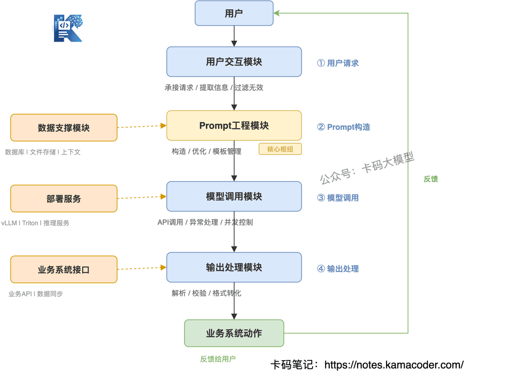

# Як вбудувати LLM у реальний застосунок? Повний ланцюжок від вікна чату до бізнес-системи

Багато хто досі уявляє застосунки на великих моделях як щось на кшталт ChatGPT — співрозмовника для розмов. Але в реальному робочому середовищі те, що відбувається на бекенді, значно цікавіше за один виклик API: це цілісний спроєктований ланцюжок. Недостатньо просто повернути відповідь — треба гарантувати, що відповідь придатна до використання, стабільна й відповідає потребам бізнесу. Сьогодні розберемо, як велика модель переходить із вікна чату у складну бізнес-систему.

## 1. Приклад реального бізнес-сценарію

Перш ніж говорити про ланцюжок, візьмімо для наочності **систему підтримки клієнтів** у корпоративному продукті. У бізнес-сценарії кожна розмова відповідає конкретній потребі, і кожен виклик має слугувати бізнес-меті.

**Система підтримки клієнтів.** Користувач у застосунку питає «чому моє замовлення досі не відправлене». Система приймає питання, звертається до великої моделі, поєднує це з даними про замовлення (отриманими з бази даних) і генерує стандартизовану відповідь на кшталт «ваше замовлення XXXX затрималося на перевалочному пункті, орієнтовна доставка сьогодні до 18:00», а не загальне «зачекайте, будь ласка».

Суть цього сценарію в тому, що **велика модель тут не головна дійова особа, а інструмент**: вона приймає потребу користувача, обробляє неструктуровану інформацію (текст, голос), видає результат, придатний для використання бізнес-системою, і зрештою розв'язує конкретну бізнес-задачу.

## 2. Основний ланцюжок

За зрілим AI-застосунком зазвичай стоїть точно налагоджений конвеєр. Його можна розкласти на чотири ключові кроки: **запит користувача → побудова промпта → виклик моделі → обробка виводу**. Розберімо кожен на прикладі сценарію підтримки: що він робить і які проблеми там виникають.

**1. Запит користувача**

Початковий запит користувача зазвичай хаотичний і розмитий. У підтримці людина може написати «а де моя посилка?», «чому замовлення досі не відправили?», «підганяйте доставку, чекаю на лінії!». Це все розмовна мова, і якщо передати її моделі напряму, вивід легко попливе (модель не зрозуміє, про яке саме замовлення чи посилку йдеться).

Тому головна мета цього етапу — **попередня обробка** початкового запиту: витягнути ключову інформацію (номер замовлення, ID користувача, тип потреби), відфільтрувати зайве (вигуки, сторонні формулювання) і перетворити розмиту репліку на чітко сформульовану бізнес-потребу.

**2. Побудова промпта**

Це найважливіший крок. Сама по собі модель не знає, кого конкретно має на увазі користувач, і не знає, у якій базі даних лежить замовлення.

Невдалий промпт виглядає так: «користувач питає, чому замовлення не відправлене, дай йому відповідь».

А вдалий — приблизно так:

> ID користувача: 12345, номер замовлення: XXXX, користувач питає про причину невідправлення замовлення.
>
> Спираючись на дані замовлення (статус доставки: на перевалочному пункті, орієнтовний час доставки: сьогодні до 18:00), сформуй лаконічну ввічливу відповідь. Не додавай нічого стороннього, не вигадуй інформацію, формат: «Ваше замовлення XXXX: причина + орієнтовний час»…

Суть цього кроку — дати моделі однозначну інструкцію й контекст (бізнес-дані, інформацію про користувача), обмежити її вивід і не допустити галюцинацій.

**3. Виклик моделі**

Коли промпт готовий, настає всіма улюблений етап виклику API. І це не просто «надіслати запит, отримати відповідь», а низка інженерних питань: стабільність, кількість одночасних запитів, затримка, обробка помилок.

Наприклад, у пікові періоди розпродажів у системі підтримки можуть одночасно писати сотні користувачів. Якщо звертатися до API моделі напряму, легко отримати таймаути й вихід за ліміт конкурентних запитів. А якщо виклик впаде, користувач залишиться чекати нескінченно — жахливий досвід.

Суть цього етапу в тому, щоб передати побудований промпт моделі надійним способом виклику (синхронним, асинхронним чи потоковим — про це буде окрема стаття), отримати вивід і водночас обробити помилки (таймаути API, невдалі виклики), зберігши стабільність ланцюжка.

**4. Обробка виводу**

Початковий вивід моделі — це зазвичай текст природною мовою, а бізнес-системі здебільшого потрібні структуровані дані. Тож вивід моделі треба перетворити на форму, яку система використає напряму.

У нашому прикладі модель повертає «ваше замовлення XXXX затрималося на перевалочному пункті, орієнтовна доставка сьогодні до 18:00». На етапі обробки виводу треба витягти три ключові поля — номер замовлення, причину затримки й орієнтовний час, — структурувати їх у JSON, синхронізувати з логістичною системою й водночас показати користувачеві.

Мета останнього кроку — розібрати вивід моделі, витягти ключову інформацію й перетворити її на формат, зрозумілий бізнес-системі (наприклад, JSON), замикаючи цикл «вивід моделі → дія в бізнесі».

## 3. Загальна картина: як працює застосунок

Ці чотири кроки не існують ізольовано — вони спираються на кілька ключових модулів, які підтримують один одного й утворюють загальну картину застосунку на великій моделі.

1. **Модуль взаємодії з користувачем.** Приймає запити, є входом у ланцюжок; спирається на дані користувача з бізнес-системи (наприклад, ID), щоб перевірити легітимність запиту.
2. **Модуль роботи з промптами.** Відповідає за побудову, оптимізацію й керування шаблонами промптів, є центральним вузлом ланцюжка; спирається на бізнес-правила й контекстні дані, щоб забезпечити точність і відповідність вимогам.
3. **Модуль виклику моделі.** Відповідає за виклик API, обробку помилок і контроль конкурентності, є транспортним каналом ланцюжка; спирається на сервіси розгортання (vLLM, Triton), щоб забезпечити стабільність і низьку затримку.
4. **Модуль обробки виводу.** Відповідає за розбір виводу, перевірку точності й перетворення формату, є виходом ланцюжка; спирається на інтерфейси бізнес-системи, щоб вивід можна було використати.
5. **Модуль забезпечення даними.** Відповідає за надання контекстних даних, є основою всього ланцюжка; спирається на бази даних і файлові сховища, щоб дані були актуальними й точними.

Ключова послідовність залежностей: модуль взаємодії → модуль промптів (залежить від модуля даних) → модуль виклику моделі (залежить від сервісів розгортання) → модуль обробки виводу (залежить від інтерфейсів бізнес-системи) → дія в бізнес-системі (зворотний зв'язок користувачеві).

## 4. Чому AI-застосунок — це не «один виклик API»?

Це найчастіше питання початківців і водночас часта тема на співбесідах. Уявлення, ніби для AI-застосунку достатньо викликати API, ігнорує головні вимоги впровадження: **стабільність, придатність до використання, керованість.**

Чи погодитесь ви, щоб система підтримки іноді повертала статус замовлення, а іноді ні? Чи погодитесь, щоб у пік розпродажу, коли всі купують, ваша система лягла? Чи погодитесь, щоб корпоративна модель видавала лише шматок тексту, який ніяк не пов'язаний із бізнес-системою?

Саме наскрізний ланцюжок «попередня обробка запиту → обмеження промптом → виклик моделі → перевірка виводу» значною мірою й закриває ці проблеми.

## 5. Підсумок

Шлях від вікна чату до бізнес-системи — це по суті **інженерна** революція в розробці на великих моделях. Для початківців і тих, хто переходить у цю сферу, важливо не лише зрозуміти цей ланцюжок, а й виробити системне мислення: суть розробки застосунків на LLM — розв'язувати бізнес-задачі технологією, а не нагромаджувати виклики API.
