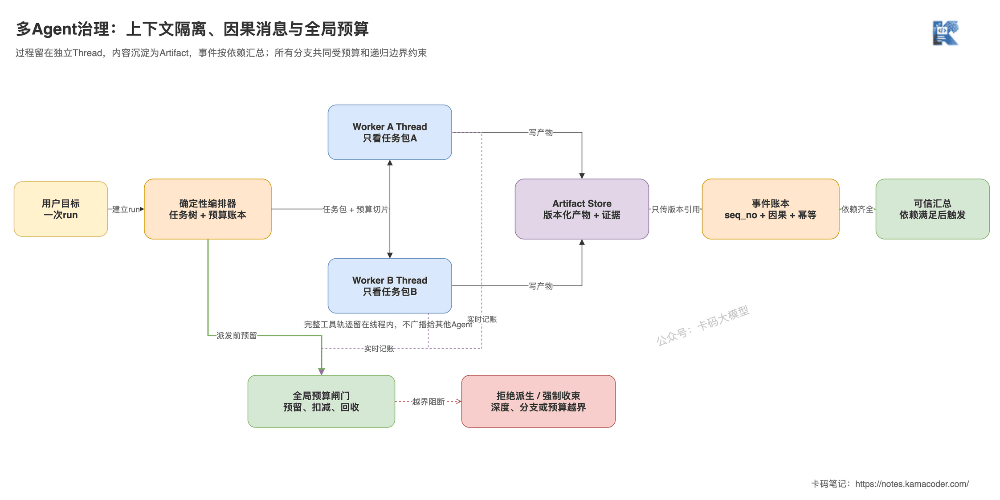
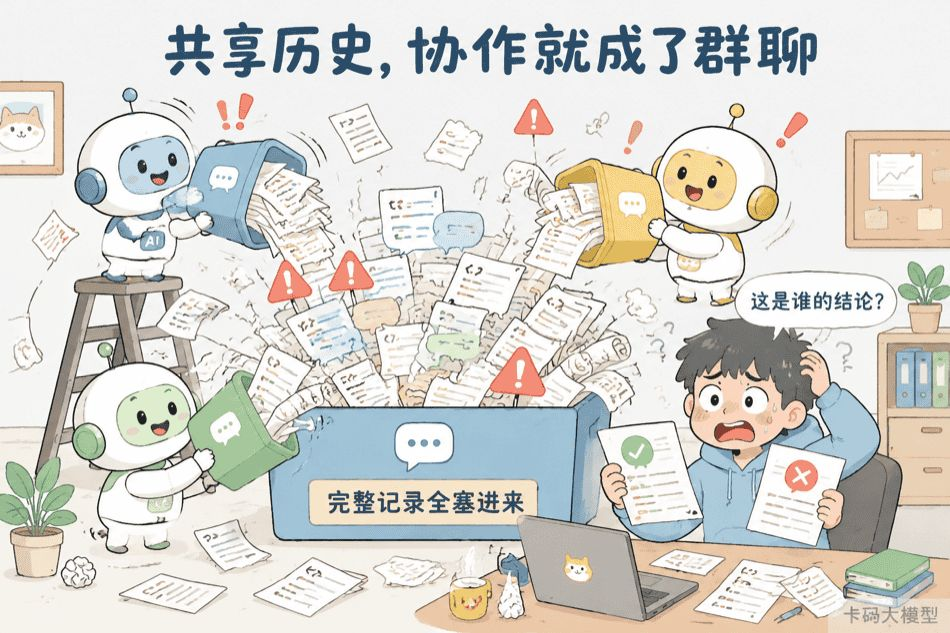
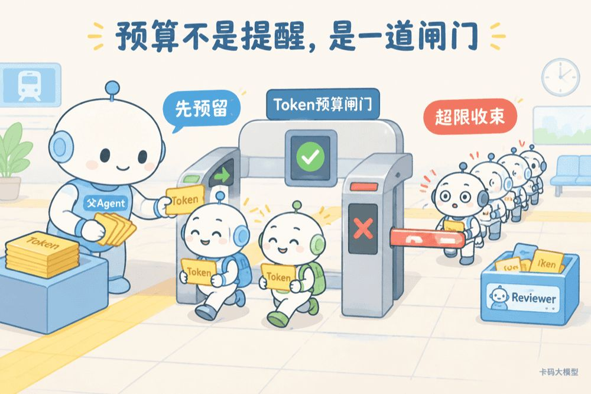

# Керування контекстом, повідомленнями й токенами в мультиагентних системах

У попередній статті [«Як розподілити ролі Planner, Worker і Reviewer»](./multi_agent_roles.md) ішлося про межі ролей: Planner визначає задачу, Worker віддає артефакт і докази, Reviewer приймає роботу, а оркестратор забезпечує жорсткі обмеження.

Але щойно ролі розділено, система лише починає ускладнюватися.

Якщо три агенти копіюють ту саму історію розмови, склеюють паралельні результати за часом їх повернення й дозволяють підагентам безмежно породжувати нових, то **ролі ніби розділені, а контекст, стан і бюджет лишаються суцільною кашею.**

Ця стаття розв'язує одне питання: як зробити, щоб кожен агент бачив лише те, що має бачити, щоб повідомлення були простежуваними й дедуплікованими, а токени зупинялися системою до того, як вийдуть з-під контролю.

## Як про це питає інтерв'юер

«Як ви передаєте контекст між агентами? Як гарантуєте правильний порядок паралельних повідомлень? Якщо підагент може створювати власних підагентів, як не дати токенам вибухнути?»

Типова відповідь:

«Головний агент надсилає історію підагенту, а той повертає результат; якщо контекст завеликий — робимо підсумок, якщо токени перевищено — зупиняємося».

Проблеми тут дуже конкретні.

**Перше: повне копіювання історії забруднює ролі.** Worker побачить обговорення, не пов'язані з його задачею, здогади інших Worker і застарілі результати інструментів. Це не лише марнує токени, а й може перетворити неперевірене на «факт».

**Друге: склеювання повідомлень за часом повернення руйнує причинність.** Хто з паралельних задач завершився раніше — це лише про швидкість, а не про те, кого треба споживати першим. Повтори до того ж можуть доставити той самий результат двічі.

**Третє: зупинятися вже після перевищення ліміту — запізно.** Коли кілька підагентів працюють одночасно, без резервування й атомарного списання кожен вважає, що бюджет ще є, і сумарні витрати легко пробивають стелю разом.

Інтерв'юер хоче почути ось що: **як контекст ізолюється й збирається за потреби, як події позначають причинність та ідемпотентність, як бюджет розподіляється, повертається, деградує й вимикається запобіжником.**

## Коротка відповідь

- **Кожен агент працює в окремому Thread.** Підагент не успадковує всю розмову, а отримує структурований пакет задачі, потрібні обмеження, посилання на артефакти залежностей і інструменти цієї задачі.
- **Великі результати кладуться в Artifact Store.** Повідомлення несуть лише стан, короткий опис, посилання на докази й версію — логи, вебсторінки й повний код не копіюються між потоками.
- **Порядок повідомлень визначається причинністю.** Усередині одного агента порядок тримає `seq_no`, а між агентами — `task_id`, залежності DAG і `parent_event_id`. Не варто силувано вибудовувати всі події в одну послідовність за настінним годинником.
- **Бюджет веде оркестратор.** Перед відправленням підзадачі резервується квота, а під час виконання обмежуються вхід, вихід, результати інструментів, повтори, кроки й час. Не можна покладатися на те, що агент економитиме токени за проханням у промпті.
- **Рекурсивне породження за замовчуванням вимкнене.** Якщо його вмикають, обмежують максимальну глибину, кількість нащадків і цикли через предків, а квота підагента виділяється із залишку бюджету батьківського.
- **Різні задачі йдуть на різні моделі.** Підсумовування, класифікацію й перетворення форматів можна віддати малій моделі, а складне планування, фінальне зведення й високоризикову перевірку — сильній. Але маршрутизацію треба підтверджувати оцінюванням.

**Керування мультиагентністю — це не розрізати один великий контекст на кілька частин, а перетворити розмову на ізольовані робочі простори, співпрацю — на події з причинністю, а токени — на ресурс, який можна резервувати й повертати.**



Ця схема відповідає на питання: як підзадача від відправлення оркестратором до фінального зведення ізолює свій процес окремим Thread, передає результати через артефакти й посилання на події, а всі паралельні гілки при цьому підпорядковані глобальному бюджету й межам рекурсії.

## Чому кілька агентів не можуть мати спільну історію повідомлень

Припустімо, головний агент готує звіт про збій у продакшні й паралельно відправляє трьох Worker:

- Worker A дивиться моніторинг;
- Worker B дивиться логи;
- Worker C дивиться історію релізів.

Якщо всі троє ділять один масив `messages`, то кілька тисяч рядків метрик від A, стектрейси від B і відомості про версії від C безперервно змішуються.

Проблема не лише в тому, що «вікно швидко заповнюється».

Фраза A «можливо, справа в пулі з'єднань» потрапляє в контекст B, і B далі охочіше шукатиме докази саме під цю гіпотезу; а один таймаут інструмента в C інші ролі можуть зрозуміти як «релізів не було».

**Спільна історія перетворює паралельне дослідження на взаємне навіювання: агенти ніби незалежні, а їхні помилки сильно корельовані.**



Надійніше, коли кожен агент веде окремий Thread:

```text
кореневий thread
├── worker-a thread: пакет задачі A + виклики інструментів A + локальний стан A
├── worker-b thread: пакет задачі B + виклики інструментів B + локальний стан B
└── worker-c thread: пакет задачі C + виклики інструментів C + локальний стан C
```

Окремі Thread не означають повного розриву зв'язку.

Оркестратор знає, що вони належать до одного `run_id`, знає батьківський вузол і залежності кожної підзадачі. Просто він не транслює автоматично весь процес одного агента всім іншим.

Якщо B справді потрібен висновок A щодо моніторингу, оркестратор передасть посилання на **прийнятий** артефакт, а не всю розмову A від першого до останнього раунду.

Це узгоджується з принципом зі статті [«Вступ до context engineering»](./context_engineering.md): **давати поточному міркуванню мінімум достатньої інформації з високим сигналом.** Мультиагентність лише розширює цей принцип з «як скомпонувати одне вікно» до «як ізолювати кілька вікон».

## Що саме має отримувати підагент

Підагент отримує не історію чату батьківського агента, а пакет задачі, який можна перевірити.

```json
{
  "run_id": "incident-20260908",
  "task_id": "inspect-payment-logs",
  "parent_task_id": "find-root-cause",
  "goal": "перевірити логи помилок платіжного сервісу з 22:00 до 23:00",
  "acceptance_criteria": ["вказати час піку помилок", "висновок із посиланням на докази з логів"],
  "context_refs": ["artifact://release-record/v2"],
  "allowed_tools": ["search_logs", "read_trace"],
  "output_schema": "worker_result_v1",
  "budget": {"max_input_tokens": 12000, "max_output_tokens": 2000, "max_steps": 8},
  "deadline_ms": 45000
}
```

Складаючи контекст підагента, можна зафіксувати шість шарів:

1. глобальні правила безпеки, які не можна перевизначити;
2. обов'язки й заборони поточної ролі;
3. поточний пакет задачі;
4. короткі описи й посилання на артефакти прийнятих залежностей;
5. схеми інструментів, дозволених для цієї задачі;
6. залишок кроків, часу й бюджету токенів.

Тон батьківського агента, побічні репліки, повний хід його міркувань і ще не прийняті здогади інших гілок не мають успадковуватися за замовчуванням.

Якщо задачі бракує інформації, підагент має повернути `BLOCKED` із переліком відсутніх полів, а оркестратор доповнить її або поверне Planner. **Не варто заради того, щоб підагент «краще розумів контекст», спершу запхати йому всю історію.**

## Чому в повідомленнях передаються лише посилання, а не повні продукти

Один запит до логів може повернути 50 тисяч рядків, одна перевірка коду — сотні кілобайтів diff.

Якщо це скопіювати від Worker до Reviewer, а потім від Reviewer до головного агента, той самий матеріал потрапить у кілька контекстів. Що більше агентів, то серйозніше дублювання токенів.

Тож «повідомлення» і «продукти» треба розділити:

- **повідомлення координують:** стан задачі, короткий опис, причина невдачі, посилання на докази;
- **артефакти несуть вміст:** звіти, патчі, знімки логів, результати тестів, структуровані дані;
- **журнал подій відповідає за аудит:** хто, коли й на основі якої версії зробив висновок.

Повідомлення Worker про завершення може бути дуже маленьким:

```json
{
  "event_type": "TASK_COMPLETED",
  "task_id": "inspect-payment-logs",
  "status": "completed",
  "summary": "з 22:14 різко зросли таймаути сторонніх колбеків",
  "artifact_refs": ["artifact://payment-log-analysis/v3"],
  "evidence_refs": ["trace://log-query/8841"],
  "unresolved": ["бракує логів шлюзу за 22:14–22:16"]
}
```

Коли Reviewer потрібні деталі, він за посиланням прочитає потрібний фрагмент або доказ.

Тут є принципова межа: **короткий опис допомагає зорієнтуватися, але не заміняє початковий доказ.** Артефакт мусить мати версію, хеш вмісту або незмінний знімок — не можна допускати, щоб Reviewer приймав `v3`, а вміст під ним нишком став `v4`.

## Як гарантувати правильний порядок паралельних повідомлень

Мультиагентній системі зазвичай не потрібен «глобальний абсолютний порядок».

Те, що Worker A завершив о 10:00:03, а Worker B о 10:00:02, не означає, що результат B має першим потрапити у зведення. Насправді важливо інше: чи залежить B від A, чи спричинена одна подія іншою, і який порядок подій усередині однієї задачі.

Мінімальний конверт події може містити:

```json
{
  "event_id": "evt-9382",
  "run_id": "incident-20260908",
  "task_id": "inspect-payment-logs",
  "agent_id": "worker-log-02",
  "seq_no": 7,
  "parent_event_id": "evt-9310",
  "idempotency_key": "inspect-payment-logs:completed:v3",
  "event_type": "TASK_COMPLETED",
  "artifact_refs": ["artifact://payment-log-analysis/v3"]
}
```

Кожне поле відповідає за своє.

| Поле | Яку проблему розв'язує |
|---|---|
| `run_id` | зв'язує події одного запуску користувацької задачі |
| `task_id`, `agent_id` | визначають, до якої підзадачі та виконавця належить подія |
| `seq_no` | гарантує порядок усередині потоку одного агента |
| `parent_event_id` | фіксує причинність «що що спричинило» |
| `idempotency_key` | запобігає подвійному запису й подвійному зведенню при повторах |
| `artifact_refs` | вказує на конкретну версію продукту без копіювання вмісту |

Отримавши подію, оркестратор не вклеює її одразу в головний промпт, а робить три кроки:

1. дедуплікує за `event_id` або `idempotency_key`;
2. перевіряє неперервність `seq_no`; якщо номера бракує — відкладає й чекає або дотягує його;
3. перевіряє залежності DAG і `parent_event_id`, і лише після їх виконання просуває стан.

Якщо `seq_no=8` того самого агента прийшов раніше за `seq_no=7`, його можна відкласти у вхідну чергу. А якщо двоє не пов'язаних Worker завершилися одночасно, обидва позначаються успішними, і вузол зведення запускається, коли всі його передумови виконані.

**Не замінюйте причинність часовими мітками.** У розподіленому середовищі є розбіжність годинників, мережеві затримки й повтори: хто прийшов першим — не означає, що він стався першим, і тим паче не означає, що його треба першим спожити.

## Чому бюджет токенів треба резервувати до відправлення задачі

У багатьох системах є `max_tokens`, і вони все одно виходять за бюджет — бо цей параметр обмежує лише один вивід моделі.

Мультиагентна система насправді витрачає ціле дерево задач:



```text
загальні витрати = вхід і вихід кореневого агента
                 + вхід і вихід усіх підагентів
                 + токени результатів інструментів, що потрапили в контекст
                 + повтори й доопрацювання
                 + фінальне зведення та приймання
```

Якщо загальний бюджет 100K, а кореневий агент одночасно відправляє 4 Worker «щонайбільше по 30K», теоретична стеля вже 120K — і це ще без квоти для Reviewer і фінальної відповіді.

Тож бюджетом треба керувати як квотою ресурсів у конкурентних системах.

Відправляючи підзадачу, оркестратор спершу **атомарно резервує** частину доступної квоти батьківської задачі. Якщо резервування вдалося — запуск; якщо ні — зменшити задачу, поставити в чергу, змінити модель або відмовити в породженні. Після завершення невитрачена квота повертається батьківській задачі.

```text
доступний бюджет = глобальна стеля − витрачено − зарезервовано
                   − резерв кореневого процесу − резерв на приймання
```

Ідеться не про точне передбачення витрат моделі, а про те, щоб кілька паралельних гілок не рахували той самий залишок кожна собі.

Бюджет також не можна зводити до вихідних токенів. Обмежувати треба щонайменше:

- разові й сукупні вхідні токени;
- разові й сукупні вихідні токени;
- розмір результатів інструментів і кількість сторінок вибірки;
- кількість викликів моделі, викликів інструментів і повторів;
- кількість підагентів, глибину рекурсії й загальну тривалість задачі.

Про базові зв'язки між входом, виходом, вартістю й затримкою можна спершу почитати в статті [«Токени, вартість і затримка»](./token_cost_latency.md).

## Що робити, коли бюджет добігає кінця

Керування бюджетом — це не «закінчився й помилка», а поетапне звуження заздалегідь.

Нижче наведено приклад порогів; це не галузевий стандарт, і реальні значення треба добирати за ризиком задачі й результатами оцінювання.

| Рівень витрат | Дія системи |
|---|---|
| 0–60% | звичайне виконання з обмеженнями на окремі вузли |
| 60–80% | заборонити малоцінні розширення, стискати старі результати інструментів, надавати перевагу перевикористанню артефактів |
| 80–95% | припинити створення нових некритичних підагентів, дрібні задачі перевести на дешевшу модель |
| понад 95% | примусове звуження: зберегти квоту на приймання й фінальну відповідь, повернути частковий результат або ескалювати людині |

Стиснення теж має межу.

Хід розмови й повторювані логи стискати можна, а номери замовлень, шляхи до файлів, коди помилок, критерії приймання й посилання на початкові докази «узагальнювати» не можна. У високоризиковій задачі краще зробити на одну гілку менше, ніж витратити бюджет перевірки на подальше дослідження.

**Бюджет має насамперед захищати фінальне зведення й приймання.** Якщо всі Worker відпрацювали, а в Reviewer не лишилося токенів, задача все одно не виконана.

## Що робити, коли підагент може створювати власних підагентів

Відповідь за замовчуванням: не дозволяти.

Якщо Worker бачить, що задачу треба розкладати далі, він має повернути її Planner для перебудови DAG. І лише коли ієрархічна задача справді потребує локального самостійного розкладання, відкривають обмежену здатність породжувати.

А відкривши, додають щонайменше чотири жорсткі обмеження:

- `max_depth` — максимальна глибина рекурсії;
- `max_children` — скільки нащадків може створити один вузол;
- `ancestor_task_ids` — ланцюжок предків, щоб A не породжував B, а B знову A;
- `child_budget <= parent_available_budget` — нащадок витрачає лише виділену батьком квоту.

Треба також обмежувати «породження синонімів».

Деякі агенти не створюють однакових `task_id`, зате послідовно породжують «продовжити пошук», «додатковий пошук», «глибший пошук». Оркестратор може будувати відбиток задачі з нормалізованої мети, діапазону входів і набору інструментів, і відхиляти схожі задачі після перевищення порогу — щоб агент не палив гроші, просто змінюючи назву.

Це те саме, що контроль циклів зі статті [«Чому агенти так легко ламаються»](./agent_failure_modes.md): **вільне породження має мати чотири умови зупинки — за глибиною, шириною, схожістю задач і бюджетом.**

## Як маршрутизація моделей поєднується з бюджетом

Не кожній ролі потрібна найсильніша модель, але й просте правило «Planner — велика модель, Worker — мала» не працює.

Маршрутизація враховує щонайменше три виміри:

- **складність задачі:** витягування, класифікація й перетворення форматів зазвичай пасують малим моделям; відкрите планування й зведення суперечностей потребують сильнішого міркування;
- **рівень ризику:** якщо йдеться про записи в продакшн, права чи відповідність вимогам, окрім можливостей моделі, потрібні ще перевірка за правилами або ворота з людиною;
- **перевірюваність:** якщо вивід можна перевірити схемою, тестами чи правилами бази даних, дешеву модель можна застосовувати сміливіше.

Практичний підхід — спершу дати офлайн-оцінюванню відповісти на питання: «Наскільки просяде якість, якщо цей тип задач виконуватиме мала модель, і скільки ми заощадимо токенів і затримки?»

Якщо вивід малої моделі став коротшим, але кількість доопрацювань подвоїлася, сумарна вартість може виявитися вищою. **Маршрутизація моделей дивиться на вартість однієї якісно виконаної задачі, а не на ціну одного виклику.**

## Як відновлюватися після збою, не перезапускаючи все дерево

Керування контекстом, повідомленнями й бюджетом зрештою зводиться до здатності відновлюватися.

Якщо Worker вийшов за таймаут, оркестратор має зберегти вже записані ним артефакти й останній підтверджений номер події, а потім вирішити: повторити з Checkpoint, змінити модель, зменшити задачу чи віддати з деградацією.

Якщо повідомлення продубльоване, робиться лише ідемпотентне підтвердження, без повторного запуску Reviewer.

Якщо версії артефактів розійшлися, перевиконується лише зачеплений вузол зведення, а вже прийняті непов'язані гілки не скасовуються.

Якщо спрацював запобіжник глобального бюджету, нові породження заморожуються, некритичні вузли скасовуються, а залишок квоти лишається на підсумок стану й часткову видачу результату.

Це спирається на скінченний автомат і Checkpoint зі статті [«Як довести Plan-and-Execute до DAG-виконавця»](./plan_execute_dag.md). Без персистентного стану «повторна спроба» зазвичай означає лише повторний прогін усього дорогого процесу.

## Як перевірити, що керування справді працює

Дивитися лише на правильність фінальної відповіді недостатньо. Моніторити варто щонайменше шість груп показників:

- **контекст:** вхідні токени кожної ролі, частка дубльованих токенів, влучність часткового читання артефактів;
- **повідомлення:** кількість відкладених через порядок, частка дубльованих подій, частка конфліктів ідемпотентності, час очікування залежностей;
- **бюджет:** обсяг резервувань, фактичні витрати, повернення квоти, частки ролей, кількість спрацювань запобіжника;
- **рекурсія:** максимальна глибина дерева задач, кількість гілок, кількість відхилених схожих задач;
- **якість:** частка виконаних задач, частка приймання з першого разу, частка збережених ключових обмежень;
- **ефективність:** P95 затримки, вартість однієї якісно виконаної задачі, частка переходів на людину.

І обов'язково беріть одного агента за базову лінію.

Якщо мультиагентність потроїла загальну кількість токенів, а частка виконання зросла трохи — проблема в гранулярності розділення або в передаванні контексту. Якщо токенів стало менше, але ключові обмеження загубилися — стиснення надмірне. Якщо вартість керована, а очікування через порядок велике — залежності в DAG спроєктовані надто важко.

Мета керування не в тому, щоб усі показники були якнайнижчими, а в тому, щоб **співвідношення якості, вартості й затримки було пояснюваним і передбачуваним.**

## Як розповідати про це на співбесіді

Можна відповісти так:

> **Ми не даємо агентам спільної історії повідомлень — у кожного окремий Thread. Оркестратор надсилає лише поточний пакет задачі, посилання на артефакти прийнятих залежностей, дозволені інструменти й бюджет, не копіюючи всю розмову батьківського агента. Великі результати пишуться у версійований Artifact Store, а повідомлення повертають лише стан, короткий опис і посилання на докази.**
>
> **Кожна подія несе run_id, task_id, agent_id, seq_no, parent_event_id і ключ ідемпотентності. Усередині потоку порядок тримає seq_no, між агентами причинність визначається залежностями DAG і батьківською подією, а повторна доставка не просуває стан удруге.**
>
> **Бюджет веде оркестратор. Перед відправленням квота атомарно резервується із залишку батьківської задачі, невитрачене повертається. Коли бюджет наближається до стелі, спершу припиняються некритичні породження, стискаються старі результати, дрібні задачі переходять на дешевшу модель, а квота на приймання й фінальне зведення зберігається. Рекурсія за замовчуванням вимкнена, а при вмиканні обмежуються глибина, кількість гілок, цикли через предків і бюджет підзадач.**

Від «передаємо контекст, а як перевищить — обрізаємо» ця відповідь відрізняється саме тим, що потрібне продакшн-системі: ізоляція, причинність, ідемпотентність і керування ресурсами.

## Розширення теми

### Чи обов'язкова черга повідомлень для кількох агентів?

Не обов'язкова. Якщо задач небагато й усе виконується в одному процесі, вистачить таблиці станів у базі й планувальника в пам'яті. Черга розв'язує асинхронну доставку, згладжування піків і розв'язання споживачів. Але хоч би яка була інфраструктура, ID подій, ключі ідемпотентності, поля причинності й скінченний автомат прибирати не можна.

### Чи гарантує `seq_no` порядок між агентами?

Ні. `seq_no` має сенс лише в межах одного агента або одного потоку задачі. Між агентами дивляться на залежності DAG і `parent_event_id`; для подій, що не залежать одна від одної, взагалі не треба вирішувати, хто перший.

### Чи розв'язує Prompt Cache проблему вартості токенів у мультиагентній системі?

Він може зменшити повторні обчислення або вартість стабільного префікса, але не заміняє керування контекстом. Закешований нерелевантний вміст усе одно займає вікно й розмиває сигнал, а великі результати інструментів і чужа історія не стають кориснішими через те, що їх закешували.

### Чим артефакт відрізняється від довгострокової пам'яті?

Артефакт — це продукт поточної задачі, який можна версіонувати й приймати. Довгострокова пам'ять — це збережені між задачами вподобання користувача, сталі факти чи досвід. Артефакт не стає довгостроковою пам'яттю автоматично: рішення про збереження проходить через поріг запису, застарівання й обробку суперечностей зі статті [«Пам'ять агента»](./agent_memory.md).

### Чому не можна дати агенту самому вирішувати, скільки лишилося бюджету?

Модель бачить лише ті дані, які їй повідомила система, і не може атомарно вести облік разом з іншими паралельними гілками. Вона може порадити стиснути чи зупинитися, але реальний залишок, резервування, списання й запобіжник мусить виконувати оркестратор.

## Наостанок

Найнебезпечніше в мультиагентній системі — не те, що якийсь Worker помилився, а те, що хибна історія копіюється, дубльовані повідомлення виконуються, а паралельні гілки разом пробивають бюджет.

**Thread ізолює процес, артефакт несе факти, подія виражає причинність, бюджет визначає межі. Заберіть щось одне — і співпраця знову виродиться в некерований груповий чат.**
