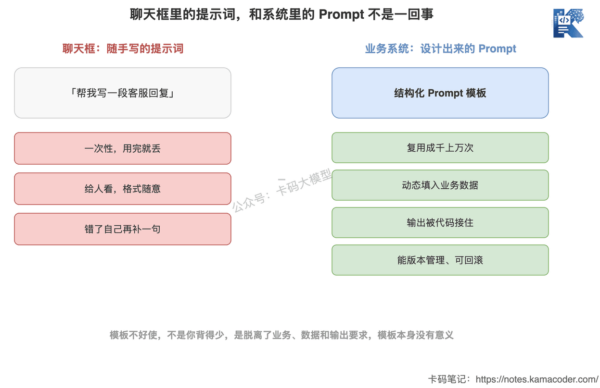

# Prompt Engineering — це не «писати підказки»: структурований промпт, ролі System/User/Assistant і змінні в шаблонах

У попередній статті [«Як вбудувати LLM у реальний застосунок»](./model_integration.md) ми розклали повний ланцюжок AI-запиту на чотири кроки: запит користувача → побудова промпта → виклик моделі → обробка виводу. Тоді я сказав, що «побудова промпта — найважливіший крок», але обмежився коротким абзацом.

Тепер винесемо цей крок окремо й розглянемо його під збільшувальним склом.

Спершу про поширене явище. Багато хто, вивчаючи промпти, просто збирає різноманітні «збірники промптів» і «універсальні шаблони», накопичує їх сотнями, а коли доходить до власного продукту — виявляється, що вони не працюють. Та сама фраза «ти професійний асистент із чогось там» в чужому прикладі дає приголомшливий результат, а у вас усе розвалюється.

Проблема не в тому, що ви завчили замало шаблонів, а в тому, що ви сприймаєте промпт як **текст, який треба видушити з натхнення**.

У реальній системі промпт не «пишуть» — його **проєктують**. У нього є стала структура, розподіл ролей, слоти для змінних, обмеження виводу. Це інженерний артефакт, принципово не відмінний від написання функції чи опису інтерфейсу.

Ось у чому різниця між «писати підказки» і Prompt Engineering.

## 1. Промпт у вікні чату й промпт у системі — це різні речі

Коли ви пишете довільну фразу в чаті ChatGPT, це підказка. Її властивості: одноразова, призначена для людини, а якщо щось не так — ви просто дописуєте ще одну репліку.

Промпт у бізнес-системі — зовсім інша істота. Він мусить відповідати кільком жорстким умовам.

**Він перевикористовується тисячі разів.** Система підтримки обробляє сто тисяч звернень на день, і кожне проходить через той самий промпт. Це не може бути разовим спалахом натхнення — це має бути стабільний шаблон.

**Він динамічно заповнюється даними.** У кожного користувача свій номер замовлення, своє питання, своя історія, тож у промпті мусять бути «слоти», куди під час виконання підставляються реальні дані.

**Його вивід має підхопити код.** Модель повертає не абзац для читання людиною, а структуровані дані для запису в базу й передавання далі.

**Він має версіонуватися.** Якщо нова редакція промпта погіршила результат, ви маєте вміти відкотитися, порівняти версії й побачити, що саме змінилося.

Як бачите, ці вимоги й довільна фраза в чаті — це два різні світи.



Усвідомивши це, ви зрозумієте, чому «збірники промптів» не працюють: ці шаблони налаштовані під чужий бізнес, чужі дані й чужі вимоги до виводу. Поза тим контекстом сам по собі шаблон не має сенсу.

**Суть роботи з промптами не в тому, щоб запам'ятовувати шаблони, а в тому, щоб зрозуміти структуру промпта й наповнити її під власний бізнес.**

Далі розбираємо цю структуру.

## 2. Спершу три ролі: System, User, Assistant

Багато хто пише промпт, запихаючи весь текст в одне поле вводу. Але якщо подивитися на API будь-якої поширеної моделі, вона приймає не «шматок тексту», а **масив повідомлень**, де кожне має свою `role`:

```python
messages = [
    {"role": "system",    "content": "Ти асистент підтримки маркетплейсу..."},
    {"role": "user",      "content": "Чому моє замовлення XXXX досі не відправлене?"},
    {"role": "assistant", "content": "Добрий день, перевіряю для вас..."},
    {"role": "user",      "content": "А коли приблизно доставлять?"},
]
```

Ці три ролі мають чіткий розподіл, і якщо їх переплутати, якість промпта падає.

**System (системне повідомлення): задає роль і правила.** Тут лежать глобальні налаштування — хто така модель, яких правил дотримується, у якому стилі говорить, чого не має робити в жодному разі. Це діє на всю розмову й має найвищу вагу. Наприклад: «ти асистент підтримки, відповідаєш лише на питання щодо замовлень, не вигадуєш інформацію про доставку, відповідь не довша за два речення». Такі наскрізні обмеження найкраще класти саме в System.

**User (повідомлення користувача): містить конкретний запит і дані цього раунду.** Що саме запитав користувач і які бізнес-дані треба обробити — усе сюди. Зверніть увагу: бізнес-дані, які ви підставляєте (наприклад, статус замовлення з бази), зазвичай теж вбудовуються в повідомлення User як контекст цього запиту.

**Assistant (повідомлення асистента): те, що модель уже сказала.** У багатораундовій розмові попередні відповіді моделі повертаються в історію з роллю assistant, щоб вона «пам'ятала» сказане раніше. Крім того, роблячи few-shot приклади, ми вручну формуємо повідомлення assistant, показуючи моделі зразок правильної відповіді (про це — в наступній статті).


**Типова помилка — запихати правила, яким місце в System, у повідомлення User.** Наприклад, перед кожним питанням користувача дописувати довгий блок «ти асистент підтримки, будь ввічливим, тобі не можна…». По-перше, це марнує токени; по-друге, правила змішуються з питанням користувача, і моделі важче розрізнити, де інструкція, а де те, на що треба відповідати. **Правила — у System, запит — у User: це перша дисципліна структурованого промпта.**

## 3. Промпт — це «шаблон зі слотами», а не разовий текст

Коли з ролями розібралися, наступне ключове усвідомлення: промпт у продакшні — це **шаблон плюс змінні**, а не намертво зашитий текст.

Повернімося до прикладу з підтримкою. Ви не станете писати окремий промпт для кожного користувача — ви пишете шаблон із заповнювачами:

```python
SYSTEM_TEMPLATE = """Ти асистент підтримки {platform}.
Правила:
1. Відповідай лише на питання щодо замовлень, доставки та післяпродажного обслуговування;
2. Відповідай виключно на основі наданих даних замовлення, не вигадуй;
3. Відповідь не довша за два речення, тон ввічливий."""

USER_TEMPLATE = """ID користувача: {user_id}
Номер замовлення: {order_id}
Дані замовлення: {order_info}

Питання користувача: {question}"""
```

Під час виконання підставляємо реальні дані:

```python
system = SYSTEM_TEMPLATE.format(platform="нашого маркетплейсу")
user = USER_TEMPLATE.format(
    user_id="12345",
    order_id="SO20260713",
    order_info="статус доставки: на перевалочному пункті, орієнтовна доставка: сьогодні до 18:00",
    question="Чому моє замовлення досі не відправлене?"
)
```

Цей крок і називається **підстановкою змінних** — найбазовіша й водночас найважливіша дія в роботі з промптами. Вона остаточно розділяє дві речі:

- **незмінну частину** (роль, правила, інструкції до задачі, формат виводу) — вона осідає в шаблоні, пишеться один раз і використовується безліч разів;
- **змінну частину** (дані користувача, питання цього раунду) — вона підставляється динамічно під час виконання.


Чому це так важливо? Бо саме це перетворює промпт із «тексту» на **інженерний актив**.

Шаблонами можна централізовано керувати й централізовано їх оптимізувати. Хочете змінити стиль спілкування підтримки — правите шаблон в одному місці, і це діє скрізь, без жодних змін у бізнес-коді.

Стають чіткими й межі підстановки даних. Одразу видно, що є фіксованою інструкцією від системи, а що — динамічними даними ззовні. **І це ще й лінія безпеки:** якщо вставляти введення користувача просто в частину з інструкціями без ізоляції, користувач може захопити ваш промпт фразою на кшталт «ігноруй усі попередні інструкції» — це і є ін'єкція в промпт. Класти змінні акуратно в призначені для них слоти — перший крок захисту від ін'єкцій.

У реальних проєктах мало хто складає рядки голим `str.format`. Зазвичай беруть `PromptTemplate` з LangChain або шаблонізатор на кшталт Jinja2. Але інструмент вторинний — **суть саме в підході «шаблон окремо, дані окремо»**.

## 4. Обмеження формату виводу: щоб код міг підхопити відповідь моделі

Остання частина дизайну промпта — обмеження виводу.

Наступний крок у ланцюжку — обробка виводу, де код бере відповідь моделі й щось із нею робить: пише в базу, викликає інтерфейси, ухвалює рішення. А модель за замовчуванням імпровізує: без обмежень сьогодні вона поверне вам абзац тексту, завтра — список у Markdown, і код просто не зможе стабільно це розібрати.

Тому в промпті треба чітко вказати моделі, **який вигляд має мати вивід**.

Найпростіший варіант — прописати формат прямо в промпті:

```
Виведи лише JSON, без жодного зайвого тексту, у такому форматі:
{"order_id": "номер замовлення", "reason": "причина затримки", "eta": "орієнтовний час доставки"}
```

Це початковий рівень структурованого виводу. Але ви, мабуть, уже здогадалися: сама лише «просьба» в промпті не гарантує, що модель її виконає — вона генерує ймовірнісно, і формат будь-коли може попливти.

Тому, крім обмеження на рівні промпта, інженерно є жорсткіші засоби: валідація за JSON Schema, вбудовані інтерфейси структурованого виводу (`response_format`), десеріалізація з перевіркою через Pydantic. Усе це належить до питання «як гарантувати коректність виводу», і про це є окрема стаття — [«Структурований вивід LLM»](./structured_output.md).

Тут достатньо запам'ятати одне: **проєктуючи промпт, одразу закладайте «формат виводу» як його постійну складову, а не кидайтеся рятувати ситуацію, коли вивід уже почав розсипатися.**

## 5. Збираємо докупи: каркас структурованого промпта

Ми розібрали ролі, шаблони й обмеження — тепер зберемо їх у каркас, який можна застосовувати одразу. Інженерний промпт зазвичай складається з таких п'яти блоків.

**1. Роль (Role):** хто ти. «Ти асистент підтримки маркетплейсу».

**2. Інструкція до задачі (Instruction):** що треба зробити. «На основі даних замовлення відповідай на питання користувача про доставку».

**3. Контекст і дані (Context):** матеріал для роботи, зі слотами для змінних. «Дані замовлення: {order_info}; питання користувача: {question}».

**4. Обмеження (Constraints):** межі, які не можна переходити. «Відповідай лише на основі даних замовлення, не вигадуй; відповідь не довша за два речення».

**5. Формат виводу (Output Format):** як має виглядати результат. «Виведи JSON: {order_id, reason, eta}».

Ці п'ять блоків — не догма: для простих сценаріїв їх можна об'єднати, для складних — додати ще (наприклад, блок few-shot прикладів). Але вони дають вам чекліст: **написали промпт — пройдіться по цих п'яти пунктах, і одразу побачите, чого бракує й що сформульовано розмито.**

Ось у чому різниця між «спроєктувати» й «написати навмання»: навмання пишуть на відчуттях, а проєктують за структурою.

## 6. Як це можуть спитати на співбесіді

**Питання: чим System Prompt відрізняється від User Prompt?**

Орієнтовна відповідь: у System лежать глобальні налаштування — роль, правила, стиль, обмеження; вони діють на всю розмову й мають найвищу вагу. У User — конкретний запит цього раунду й динамічно підставлені бізнес-дані. Суть різниці в тому, що «наскрізні інструкції» і «дані окремого запиту» треба розділяти: якщо їх змішати, ви й токени марнуєте, і моделі складніше відрізнити інструкцію від вмісту.

**Питання: як керують промптами в продакшні?**

Орієнтовна відповідь: промпт не зашивають у код, а роблять як «шаблон плюс змінні». Стала частина (роль, інструкції, обмеження, формат виводу) осідає в шаблоні, яким централізовано керують і який оптимізують; змінна частина (дані користувача, питання раунду) підставляється під час виконання. Це дає перевикористання, єдине місце для доопрацювань, версіонування, а ще ізолює динамічне введення користувача від фіксованих інструкцій і знижує ризик ін'єкції в промпт.

**Питання: як гарантувати, що модель видасть потрібний вам формат?**

Орієнтовна відповідь: пошарово. На рівні промпта чітко описуємо цільовий формат; на рівні API застосовуємо жорстке обмеження через `response_format` та інші вбудовані механізми структурованого виводу; на рівні бізнес-логіки валідуємо отриманий результат через JSON Schema або Pydantic і повторюємо запит, якщо перевірка не пройшла. Покладатися лише на «просьбу» в промпті ненадійно, бо модель генерує ймовірнісно.

## 7. Підсумок

Повернімося до питання зі вступу: чому ви зібрали сотні шаблонів промптів і все одно не можете ними скористатися?

Бо сила промпта не в самому шаблоні, а в тому, чи розумієте ви його структуру: як розподілити ролі, як підставляти дані, як обмежити вивід. Зрозумівши цю структуру, ви самі напишете хороший промпт під будь-яку задачу й більше не шукатимете шаблони по світу.

Оце і є та вага, яку несе слово «Engineering» у Prompt Engineering.
