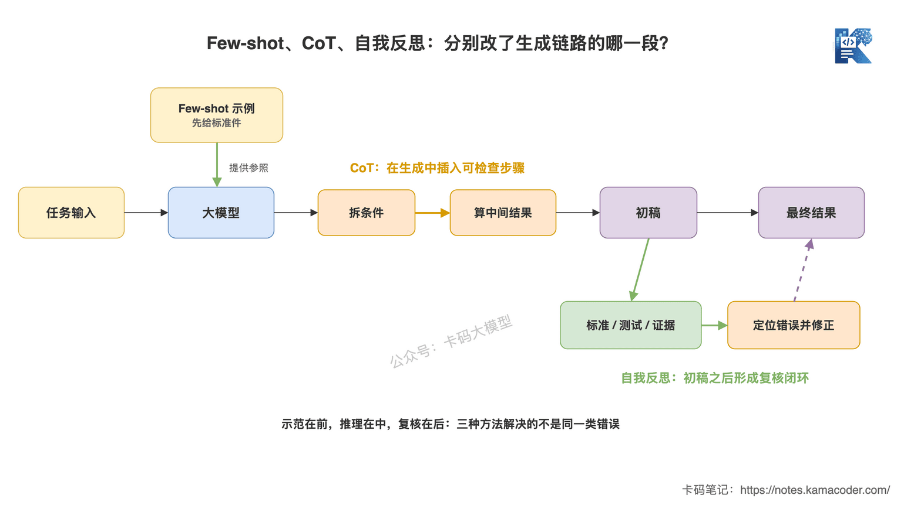
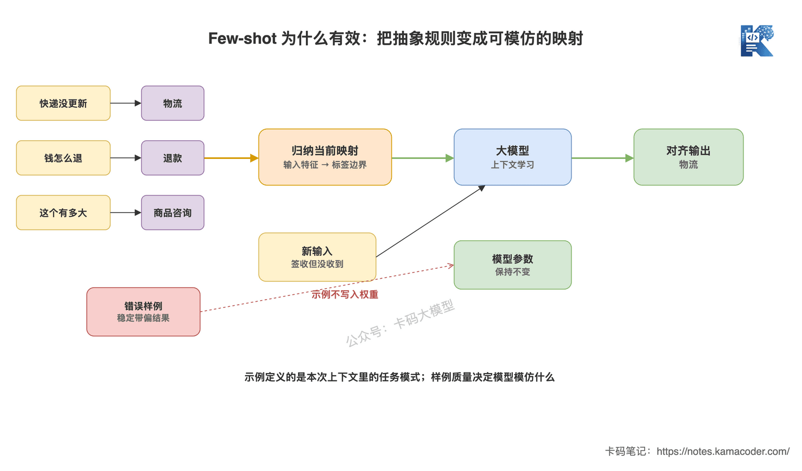

# Чим відрізняються Few-shot, CoT і самоперевірка?

У попередній статті [«Prompt Engineering — це не "писати підказки"»](./prompt_engineering.md) ми розібрали структурований промпт: правила — у System, запит — у User, динамічні дані підставляються змінними, формат виводу обмежується заздалегідь.

Але правильна структура ще не означає, що модель обов'язково виконає задачу так, як вам потрібно.

Інтерв'юер питає далі: «Які проблеми розв'язують Few-shot, CoT і самоперевірка? Як обирати в продакшні?»

Багато хто одразу відповідає трьома фразами: Few-shot — це дати приклади, CoT — думати крок за кроком, самоперевірка — перевірити відповідь.

Усе правильно, але **надто поверхово**.

Інтерв'юер насправді хоче почути інше: яку саме ділянку ланцюжка генерації змінює кожен із трьох методів, чому це працює і коли від нього стає тільки гірше.

## Коротка відповідь

- **Few-shot:** кладемо в контекст кілька прикладів «вхід → вихід», щоб модель наслідувала межі задачі, мітки, формат і тон. Розв'язує проблему «правила написані, але модель не знає, як має виглядати готовий результат».
- **CoT (Chain-of-Thought):** змушуємо спершу розкласти складну задачу на кроки й лише потім дійти висновку. Розв'язує проблему вгадування відповіді навмання там, де потрібні багатокрокові міркування, обчислення чи поєднання умов.
- **Самоперевірка:** спершу генеруємо чернетку, потім за критеріями оцінювання, результатами тестів чи знайденими доказами шукаємо помилки й виправляємо. Розв'язує проблему «згенерували один раз і ніхто не перевірив».

Одним реченням: **Few-shot показує зразок, CoT розкладає задачу, самоперевірка контролює результат.**

## Розгорнута відповідь

### Три методи — не синоніми, вони працюють у різних точках



Ця схема відповідає на питання: у якій саме точці однієї генерації спрацьовує кожен із трьох методів. Few-shot дає орієнтир до того, як модель відповідає; CoT змінює сам процес опрацювання задачі; самоперевірка відбувається вже після чернетки. **Точки застосування різні, тож не можна вважати їх трьома взаємозамінними «прийомами з промптами».**

### Few-shot: не навчання нових знань, а показ «еталонної деталі»

Few-shot prompting — це коли ви кладете в промпт кілька прикладів.

Скажімо, модель має класифікувати заявки, і ви написали лише правило:

```text
Класифікуй питання користувача як: доставка, повернення коштів, консультація щодо товару.
```

Модель знає ці три мітки, але не обов'язково розуміє, куди віднести «у трекінгу написано "вручено", а я нічого не отримав» — до доставки чи до повернення коштів.

З двома прикладами стає значно ясніше:

```text
Вхід: посилка три дні без оновлень
Вихід: доставка

Вхід: одяг не підійшов, як повернути гроші
Вихід: повернення коштів

Вхід: у трекінгу написано «вручено», а я нічого не отримав
Вихід:
```

Модель не перенавчилася через ці два приклади й не оновила параметри. Вона просто за наявними в контексті відповідностями продовжила генерувати результат, що найкраще пасує до шаблону. Це зазвичай називають **навчанням у контексті (In-context Learning)**.



Ця схема відповідає на питання: чому Few-shot вирівнює модель краще, ніж нагромадження абстрактних правил. Приклади прямо показують, «який вхід якій мітці відповідає», і модель виводить шаблон відповідності з поточного контексту; новий запит проходить тією самою відповідністю, а ваги моделі не змінюються.

**Few-shot найкраще підходить для трьох типів задач:**

- межі міток важко описати одним правилом — класифікація намірів, модерація контенту;
- специфічний формат виводу — фіксований JSON, стиль SQL, структура розбору резюме;
- абстрактні вимоги до стилю: показати готовий зразок дієвіше, ніж нагромадити десяток прикметників.

Але «що більше прикладів, то краще» тут не працює.

Якщо приклад підібрано неправильно, модель стабільно наслідуватиме помилку. Якщо всі приклади одного типу, може виникнути зсув у бік однієї мітки. Якщо приклади надто далекі від поточного питання — вони з'їдають токени без користі. У реальних проєктах треба добирати приклади **правильні, з чіткими межами, схожі на поточний запит і водночас такі, що покривають різні випадки**.

### CoT: спершу розкласти складну задачу, потім порахувати, потім відповісти

CoT — це Chain-of-Thought, ланцюжок міркувань.

Він підходить не для всіх задач, а для тих, де **відповідь залежить від кількох проміжних кроків**.

Скажімо, інтерв'юер дає вам правило післяпродажного обслуговування: повернення без пояснення причин можливе протягом 7 днів, якщо упаковку не розкрито й товар не виготовлений на замовлення. Зараз товар куплено 5 днів тому, упаковку розкрито, і він не на замовлення.

Якщо попросити модель одразу відповісти «можна повернути чи ні», вона легко вчепиться за «у межах 5 днів» і дасть хибний висновок.

Надійніший промпт — це не додати фразу «подумай уважно», а чітко прописати шлях перевірки:

```text
Послідовно перевір три умови: строк, стан упаковки, тип товару.
Спершу випиши, чи виконується кожна умова, і лише потім дай остаточний висновок з обґрунтуванням.
```

По-справжньому цінним тут є не те, що модель написала довгий «внутрішній монолог», а те, що **задачу розкладено на проміжні стани, які можна перевірити**.

Поширені два варіанти CoT:

- **Zero-shot CoT:** прикладів міркування не даємо, лише просимо розібрати покроково. Дешево, добре для швидкої перевірки гіпотези.
- **Few-shot CoT:** у прикладах наводимо не лише підсумкову відповідь, а й правильний шлях розкладання. Підходить, коли кроки міркування сталі, а бізнес-правила складні.

**Не тягніть CoT у прості задачі.** Класифікація тональності, витягування ключових слів, витягування фіксованих полів робляться за один крок. Змушувати модель писати довге міркування — це лише зайві токени, затримка й нові можливості збитися.

Ще одна поширена хиба: гладкий на вигляд хід міркування не означає, що відповідь правильна, і не означає, що цей текст справді відтворює, як модель дійшла результату. У продакшні краще вимагати **перевірювані обґрунтування, результати обчислень, перелік спрацьованих правил або план виконання**, а не вірити красивому «процесу роздумів».

### Самоперевірка: сказати «перевір ще раз» — це ще не все

Базовий ланцюжок самоперевірки такий:

**згенерувати чернетку → знайти проблеми за критеріями → виправити → перевірити ще раз.**

Наприклад, коли модель згенерувала SQL, не варто просто просити «перевір, чи все правильно». Дайте чіткий перелік пунктів перевірки:

```text
Перевір цей SQL:
1. Чи всі поля походять зі заданої структури таблиць;
2. Чи не спричинять умови JOIN дублювання даних;
3. Чи відповідає умова WHERE потрібному часовому діапазону;
4. Після виправлення виведи лише підсумковий SQL і перелік змін.
```

А якщо ви можете підключити парсер SQL, базу даних тільки для читання або тестові приклади — буде ще надійніше. Бо тоді модель оцінює себе не на відчуттях, а звіряє результат із реальними обмеженнями.


Ця схема відповідає на питання: чому самоперевірці обов'язково потрібен якір із доказів. Коли є критерії оцінювання, тести чи результати пошуку, зворотний зв'язок вказує на конкретну помилку й веде в наступний раунд. А якщо є лише фраза «подумай ще раз», модель, найімовірніше, просто перефразує сказане, а то й зіпсує первісно правильну відповідь.

Тому Reflection в інженерній практиці має мати щонайменше три речі:

- **чіткі критерії:** чому має відповідати правильна відповідь; не давайте моделі імпровізувати;
- **зовнішній сигнал:** тести, компілятор, обмеження бази даних, знайдені докази, відгук людини — підключайте все, що можете;
- **умову зупинки:** зупинятися при проходженні перевірки або не більш ніж 1–2 раунди виправлень, щоб не отримати нескінченний цикл і неконтрольовані токени.

Це перегукується з підходом Reflection в агентах, але масштаб інший. Тут ідеться про цикл «генерація — критика — виправлення» в межах одного виклику чи короткого ланцюжка. Агент додатково має справу з виконанням інструментів, станом задачі й пам'яттю кількох раундів — повний патерн описано в статті [«ReAct, Reflection, планування з виконанням»](./react_reflection_planning.md).

### Як комбінувати в продакшні?

Три методи можна поєднувати, але не варто вмикати все підряд.

Доволі надійна послідовність така:

1. Спершу структурованим промптом чітко описати задачу, дані, обмеження й формат виводу.
2. Якщо модель досі не розуміє меж або формату — додати невелику кількість якісних Few-shot прикладів.
3. Якщо задача справді потребує кількох кроків оцінювання — вимагати перевірювані проміжні результати.
4. Якщо ціна помилки висока — додати етап самоперевірки на основі правил, тестів чи доказів.
5. Порівнювати точність, проходження за форматом, токени й затримку на фіксованому наборі для оцінювання, а не покладатися на відчуття «стало розумніше».

**Нашаровувати прийоми з промптами — не ознака вищого класу.** Кожен новий шар має пояснювати, який тип помилок він закриває, і за нього доводиться платити контекстом, затримкою та вартістю підтримки.

## Розширення теми

**Q1: чим Few-shot відрізняється від fine-tuning?**

Few-shot кладе приклади в контекст поточного запиту, не змінюючи параметрів моделі: помінявши приклади, ви миттєво перемикаєте задачу, але щоразу витрачаєте токени на їх повторення. Fine-tuning оновлює параметри моделі навчальними даними; початкові витрати й вартість підтримки вищі, і він доречний для великих, стабільних, повторюваних шаблонів поведінки. **Якщо задачу закривають кілька прикладів — не поспішайте з донавчанням.**

**Q2: чи справді що більше Few-shot прикладів, то краще?**

Ні. Зі зростанням кількості вони займають контекст, підвищують вартість, а ще можуть протягнути всередину суперечливі правила й неякісні відповіді. Візьміть 2–5 якісних прикладів за базову лінію, а потім додавайте граничні випадки за реальними невдачами, а не заливайте одразу кілька десятків.

**Q3: чи обов'язково показувати користувачеві повний хід міркування CoT?**

Ні. Бізнесу потрібен висновок, який можна перевірити, а не якомога довший текст міркувань. Хай модель виведе коротке обґрунтування, спрацьовані правила, обчислення або план виконання, а підсумкову відповідь покладе в окреме структуроване поле. Так і перевіряти легше, і токенів витрачається менше.

**Q4: чому самоперевірка іноді робить лише гірше?**

Бо якщо та сама модель першого разу не знала, де помилка, то й другого разу без нової інформації вона це не обов'язково зрозуміє. Її попросили «знайти проблему» — вона може просто вигадати проблему й «виправити» її. Дайте їй результати тестів, критерії оцінювання чи знайдені докази — і самоперевірка отримає надійну опору.

**Q5: як на співбесіді розповідати про оптимізацію промптів?**

Не кажіть «я перебрав багато версій промпта, результат непоганий». Поясніть чітко: яка була початкова помилка, чому обрали Few-shot, CoT чи Reflection, як побудували набір для оцінювання, як змінилися точність, проходження за форматом, середня кількість токенів і P95 затримки до й після. **Оптимізація промптів без порівняльних даних — це просто відчуття.**

Ні Few-shot, ні CoT, ні самоперевірка не є чимось містичним.

Справжню різницю створює те, чи розумієте ви, на якій саме ланці модель помиляється, і чи додаєте ви контроль лише на цій ланці.
