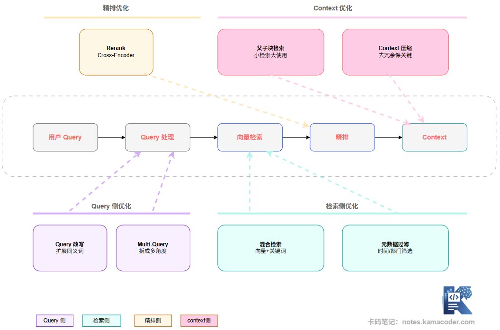

# Оптимізація RAG: переписування запиту, гібридний пошук, rerank, parent-child retrieval і стиснення контексту

## 1. Лікувати треба за діагнозом

Спершу важлива теза: універсальних ліків для RAG не існує. «Додамо rerank — і все запрацює», «візьмемо кращу модель — і вистачить» — такі фрази звучать розумно, але часто це пошук цвяха під уже наявний молоток.

Правильний підхід інший: спершу діагностувати, на якій ланці проблема (методика — у [попередній статті](./rag_problems.md)), і лише потім обирати відповідний засіб.

Засоби оптимізації умовно діляться на три групи.

**Оптимізація на боці запиту.** Обробити запит користувача до того, як він потрапить у пошук, щоб він краще приводив до правильної відповіді.

**Оптимізація на боці пошуку.** Покращити якість відбору, щоб релевантний вміст знаходився точніше.

**Оптимізація контексту й генерації.** Покращити якість контексту, що зрештою потрапляє в LLM, щоб модель краще скористалася знайденим.

Подивившись на загальну картину, розберемо механізм кожного способу окремо.

------

## 2. Оптимізація на боці запиту

### Переписування запиту (Query Rewrite)

Початкове питання користувача зазвичай розмовне, сформульоване як завгодно й змістово розмите — воно не обов'язково придатне для векторного пошуку в первісному вигляді. Ідея переписування така: перед пошуком прогнати питання через LLM — розширити синонімами, виправити формулювання, доповнити неявні умови, — щоб переписаний запит був ближчий до того, як слова вживаються в документах бази знань.

Приклад: користувач питає «чи можна розірвати цей договір». Після переписування це може стати «умови розірвання договору, політика повернення коштів, підстави для скасування договору». Пошук за кількома такими ракурсами дає помітно кращу повноту.

### Multi-Query (запит із кількох ракурсів)

Коли питання можна зрозуміти з кількох боків, генерують кілька різних версій запиту, шукають за кожною окремо, а потім об'єднують результати з видаленням дублікатів.

Скажімо, користувач питає «який у нашого продукту SLA (угода про рівень сервісу)». Це можна розгорнути в:

- «зміст угоди про рівень обслуговування»
- «час реакції на збій»
- «зобов'язання щодо доступності»
- «умови компенсації»

Кожна гілка шукає незалежно, результати об'єднуються — і повнота пошуку суттєво зростає.

------

## 3. Оптимізація на боці пошуку

### Гібридний пошук (Hybrid Search)

Чистий векторний пошук добре розуміє зміст, але для власних назв і точних збігів (імена, моделі продуктів, номери нормативних актів) він поступається пошуку за ключовими словами. Гібридний пошук поєднує обидва: паралельно виконує векторний пошук і пошук за BM25, а потім зводить результати алгоритмом злиття (найпоширеніший — RRF, Reciprocal Rank Fusion).

Ідея RRF дуже інтуїтивна: якщо документ високо в обох гілках результатів, його підсумкова оцінка висока; якщо він високо лише в одній — оцінка зменшується.

### Фільтрація за метаданими (Metadata Filtering)

Паралельно з пошуком за векторною схожістю накладаємо структуровані умови за метаданими: «шукати лише документи після 2024 року», «шукати лише серед договорів», «шукати лише внутрішні регламенти відділу розробки».

Фільтрація за метаданими не змінює алгоритм пошуку, але суттєво звужує область пошуку, а отже одночасно підвищує точність і зменшує обчислювальні витрати.

------

## 4. Оптимізація точного ранжування: Rerank

Це найчастіше згадуваний спосіб оптимізації RAG, але місце в нього цілком конкретне: після того, як векторний пошук відібрав top-K кандидатів, модель-cross-encoder детально оцінює кожну пару (запит, чанк), результати переупорядковуються, і в LLM передаються лише справді високорелевантні top-N.

Головна цінність rerank у тому, що схожість у векторному пошуку обчислюється за незалежно закодованими векторами й не здатна повністю вловити глибокий змістовий зв'язок між запитом і документом. Cross-encoder бачить їхню повну взаємодію, тож оцінює точніше.

Схема нижче показує, як працює весь ланцюжок оптимізації, коли гібридний пошук і rerank використовуються разом:

Гібридний пошук плюс rerank — наразі найзріліша інженерна комбінація оптимізації пошуку. Обидві гілки відбирають певну кількість кандидатів, після злиття через RRF утворюється пул кандидатів, далі cross-encoder виконує точне ранжування, і в контекст потрапляють лише 3–5 якісних чанків.

> **Коли rerank варто додавати:** якщо Recall@K уже достатньо хороший (релевантний вміст справді потрапляє у відбір), але точність відповідей усе одно низька. Зазвичай це саме брак rerank: релевантне відібрано, але найважливіше з нього не виокремлено.
>
> **Коли з rerank поспішати не варто:** якщо сам Recall@K низький і релевантний вміст узагалі не потрапляє у відбір. Додавати rerank тут безглуздо — спершу треба розв'язати проблему повноти пошуку.

------

## 5. Оптимізація на боці контексту

### Parent-child retrieval (пошук за дочірніми, передавання батьківських)

Цей підхід розв'язує класичну суперечність чанкінгу: малі чанки добрі для точного збігу (вектор сфокусованіший), але контексту для моделі в них замало; великі чанки дають повний контекст, але точність пошуку в них гірша.

Ідея parent-child така: будуємо дворівневий індекс. Пошук виконується по **малих чанках (дочірніх)**, щоб знайти релевантний вміст; а в LLM передається **великий чанк (батьківський)**, який містить цей дочірній. Так поєднуються точність пошуку й повнота контексту.

Наприклад: статтю на 2000 слів розбито на 5 дочірніх фрагментів по 400 слів для індексування, але після збігу з одним із них моделі передається вся стаття (або її повніша частина).

### Стиснення контексту (Context Compression)

Коли у відібраних чанках багато вмісту, не пов'язаного з поточним питанням, можна спершу зробити стиснення через LLM: модель читає чанк, витягує речення з високою релевантністю до запиту, відкидає стороннє, а зі стиснених фрагментів складається підсумковий контекст.

Такий підхід помітно зменшує шум у контексті, але додає затримку й вартість ще одного виклику LLM. Він доречний там, де вимоги до точності дуже високі, а до затримки — поблажливіші.

------

## 6. Як початківцю обирати напрям оптимізації?

Маючи стільки засобів, початківці найчастіше роблять одну помилку — намагаються додати все одразу: і переписування запиту, і гібридний пошук, і rerank, і parent-child. У результаті затримка системи злітає, продуктивність падає, і незрозуміло, яка ж саме ланка допомогла.

Розумніша послідовність така.

1. **Спершу побудуйте базову лінію й налаштуйте оцінювання.** До будь-якої оптимізації зафіксуйте вимірювану базу через Recall@K і метрики якості відповідей (оцінювання через LLM або людьми). Без базової лінії неможливо зрозуміти, чи спрацювала оптимізація.

2. **Спершу розв'яжіть питання «чи можна знайти», і лише потім «чи знайдено правильне».** Якщо Recall@5 низький, оптимізуйте спершу відбір (змініть модель embedding, перегляньте стратегію чанкінгу, додайте гібридний пошук), а не додавайте rerank.

3. **Змінюйте по одній змінній за раз.** Контроль змінних — базова вимога до оцінювання ефекту. Якщо одночасно змінити розмір чанка, модель embedding і наявність rerank, ви ніколи не дізнаєтеся, що саме спрацювало.

4. **Визначайте пріоритет за співвідношенням витрат і віддачі.** Гібридний пошук (додати індекс BM25) дешевий і широко застосовний, тож зазвичай це найвигідніший перший крок. Переписування запиту й rerank додають затримку й вартість, тож тут треба зважати на ваші вимоги до SLA.

------

## 7. Як це можуть спитати на співбесіді

**Питання: які оптимізації ви зробили у своїй RAG-системі?**

Орієнтовна відповідь: відповідайте за структурою (бік запиту / бік пошуку / точне ранжування / бік контексту), пояснюючи, яку конкретну проблему закривала кожна оптимізація, як змінився результат до й після, і на які компроміси ви пішли (чому саме це, а не інше). Наприклад: «Ми побачили, що Recall@5 близько 60%, спершу додали гібридний пошук — Recall@5 піднявся до 78%; потім додали rerank, і точність відповідей зросла приблизно на 15%». Хороша відповідь — це та, де є і дані, і логіка.

**Питання: як реалізувати гібридний пошук і як зливати дві гілки результатів?**

Орієнтовна відповідь: векторний пошук робиться моделлю embedding і векторною базою; пошук за ключовими словами — алгоритмом BM25 (Elasticsearch або вбудований повнотекстовий пошук векторної бази). Злиття — через RRF (Reciprocal Rank Fusion): для кожного документа беремо обернені значення його позицій в обох гілках, додаємо їх і за отриманою оцінкою переупорядковуємо. RRF нечутливий до гіперпараметрів, простий у реалізації й стабільний за результатом, тож інженерно це вибір за замовчуванням.

------

## 8. Підсумок

Оптимізація RAG — це процес поступового поєднання засобів за потребою, а не одноразове додавання всього підряд. Розуміти, яку саме проблему розв'язує кожен засіб, побудувати вимірювану систему оцінювання й братися передусім за вузьке місце, що найбільше впливає на результат, — ось правильний підхід до оптимізації RAG.
