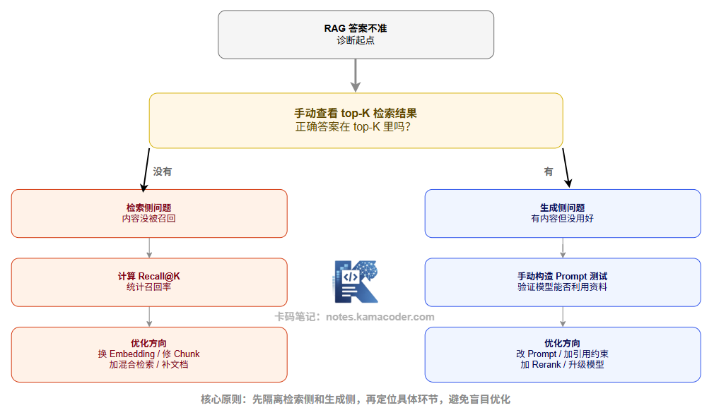

# Чому RAG відповідає неточно: п'ять проблем на боці пошуку й чотири на боці генерації

Якось на форумі людина просила допомоги: її RAG-система стабільно працювала погано, вона перепробувала й зміну моделі, і додавання rerank — без результату.

Хтось із коментаторів влучно підсумував: «Ви навіть не локалізували, де саме проблема, тож оптимізуєте наосліп».

Багато хто, зіткнувшись із неточними відповідями RAG, першим ділом кидається міняти модель і вмикати rerank, але ніколи не розбирається в першопричині.

Насправді в RAG лише два ключові ланцюжки: офлайн-побудова індексу й онлайн-пошук із генерацією. Якщо відповідь погана, то або зламався пошук (не знайшло або знайшло не те), або зламалася генерація (знайшло, але скористалося погано).

Поки ви не визначили, що саме — пошук чи генерація, — будь-яка оптимізація лікує симптом, а не причину.

## 1. Огляд типових проблем

Схема нижче групує типові проблеми RAG за ланками, до яких вони належать.

Далі розберемо кожну проблему окремо: як її розпізнати і що робити в першу чергу.

------

## 2. Бік пошуку: п'ять типових проблем

### 1. Погана якість документів

Це найфундаментальніша проблема — і водночас та, яку найлегше проґавити.

Якщо вхідний документ — це покручений результат OCR зі скану, розбір PDF із хаотичною версткою або HTML, повний шаблонного шуму, то навіть найкраща модель embedding не витягне з цього шуму осмисленого змісту. Якість векторизації визначає якість того, що знайдеться.

**Типові симптоми:** серед результатів пошуку багато беззмістовних фрагментів на кшталт «с. 3», «усі права захищено», «………………».

**Що робити:** посилити попередню обробку документів перед чанкінгом — прибирати колонтитули, фільтрувати шаблонний шум, а для документів низької якості робити окреме очищення й навіть ручну звірку.

### 2. Невдала гранулярність чанків

Про це докладно йшлося у [статті про стратегії чанкінгу](./how_to_chunking.md), тож тут лише коротко.

Замалі чанки дають фрагменти по одному-два речення: зміст неповний, вектор embedding не здатен точно передати тему фрагмента, і в результаті пошук влучає в потрібну тему, але вміст неповний.

Завеликі чанки містять кілька тем одразу, векторне представлення стає сумішшю кількох тем, змістовий збіг із запитом розмивається, і точність пошуку падає.

### 3. Хибний вибір моделі embedding

Про це теж є окрема стаття: [що таке embedding і як обирати модель](./embedding.md).

Здатність моделі embedding розуміти зміст визначає «змістову точність обчислення схожості». Якщо взяти модель, яка погано підтримує вашу мову або недостатньо покриває конкретну фахову галузь, то змістово схожі тексти можуть опинитися далеко один від одного у векторному просторі, і пошук їх просто не знайде.

**Типові симптоми:** ставите те саме питання іншими словами — і результати пошуку кардинально інші; синонімічні речення отримують дуже низькі оцінки.

**Що робити:** оцінити кілька моделей-кандидатів (як орієнтир можна взяти відповідний розділ рейтингу MTEB), прогнати порівняльний експеримент за повнотою пошуку на власних даних і обрати ту, що найкраще пасує до вашої предметної області.

### 4. Недостатня повнота пошуку

Навіть якщо з самою моделлю embedding усе гаразд, релевантні документи можуть не знаходитися через проблеми з даними в індексі. Типові причини: документи оновили, а індекс вчасно не перебудували; частину документів помилково відфільтрували під час завантаження; значення top-K задане надто малим, і релевантний вміст опинився за його межами.

**Типові симптоми:** ви точно знаєте, що в базі знань відповідь є, але RAG-система її не дає; вручну знайти можна, автоматичний пошук — ні.

**Що робити:** перевірити повноту покриття індексу; помірно збільшити top-K (скажімо, з 5 до 10–20) у поєднанні з фільтрацією через rerank; додати гібридний пошук (вектори плюс ключові слова) як доповнення.

### 5. Відсутність rerank

Попередньо відібрані top-K фрагментів не обов'язково впорядковані за справжньою релевантністю: векторна схожість і «справжня релевантність вмісту до питання» — два різні виміри. Деякі фрагменти близькі за вектором (обговорюють суміжну тему), але не обов'язково точно відповідають на конкретне питання користувача.

**Типові симптоми:** підсумкова відповідь виглядає «релевантною, але неточною» — напрям правильний, а деталі хибні; у контексті відповідь явно є, але сформульована моделлю відповідь недостатньо точна.

**Що робити:** додати після відбору rerank на cross-encoder, щоб модель детально оцінила пари (запит, чанк), і передавати в LLM лише справді високорелевантні результати.

------

## 3. Бік генерації: чотири типові проблеми

### 1. Проблеми зі складанням промпта

Це те, що в інженерній практиці дуже легко проґавити. RAG-система вклеює знайдені чанки в промпт, але сам спосіб склеювання може бути невдалим: між чанками немає роздільників, бракує інформації про джерело, інструкції змішані з вмістом, формулювання інструкцій розмите. Усе це заважає моделі правильно зрозуміти вхід.

**Типові симптоми:** у відповіді модель плутає вміст різних документів; або дуже погано дотримується інструкцій на кшталт «якщо в матеріалах немає відповіді, скажи, що не знаєш».

**Що робити:** чітко розділити «системні інструкції» й «довідкові матеріали», додати роздільники між вмістом різних джерел і прямо прописати в інструкції, як діяти, коли матеріалів бракує.

### 2. Шум у контексті (Context Noise)

Не кожен відібраний чанк високорелевантний до питання користувача. Низькорелевантні чанки, потрапляючи в контекст, розсіюють увагу моделі, вона «губиться» серед великої кількості сторонньої інформації, і підсумкова відповідь зазнає впливу цих завад. Особливо гостро це проявляється в системах без rerank і пов'язане із завеликим top-K.

**Типові симптоми:** у відповіді з'являються дивні нерелевантні подробиці; або модель видає «усереднену відповідь», зліплену з кількох не пов'язаних між собою джерел.

**Що робити:** фільтрувати низькорелевантні чанки через rerank; зменшити кількість чанків, що потрапляють у контекст (краще менше, ніж абищо); прямо вимагати в промпті відповідати лише за наданими матеріалами.

### 3. Брак обмежень на цитування (модель імпровізує)

Якщо в промпті немає чіткої вимоги «відповідати лише на основі наданих матеріалів», модель природно змішає знання зі своїх параметрів зі знайденим вмістом. Це вносить галюцинації: відповідь виглядає повнішою, ніж вона є насправді, а її точність сумнівна.

**Що робити:** додати в системний промпт чітке обмеження на цитування, наприклад: «Відповідай строго за наведеними матеріалами; якщо чогось у них немає, прямо скажи, що відповісти не можеш», — і вимагати від моделі позначати джерела у відповіді.

### 4. Недостатні можливості моделі

Навіть за високої якості пошуку вузьким місцем може стати сама здатність моделі міркувати — особливо коли відповідь потребує зведення кількох чанків або коли питання саме собою вимагає складних логічних побудов. Найпомітніше це на малих моделях.

**Що робити:** для задач, насичених міркуванням, перейти на сильнішу модель; доопрацювати промпт, прямо вимагаючи покрокового виведення; або через розкладання запиту розбити складне питання на кілька простих пошукових задач.

------

## 4. Як системно діагностувати проблеми RAG?

Знати перелік проблем корисно, але важливіше мати **методику діагностики**, а не гадати на відчуттях.

**Крок 1: визначити, це проблема пошуку чи генерації.**

Найпростіший спосіб — подивитися результати пошуку вручну. Надішліть питання користувача просто у векторну базу й перевірте, чи є серед повернених top-K чанків правильна відповідь.

- Якщо серед top-K чанків правильна відповідь є, а згенерована відповідь хибна → проблема на боці генерації.
- Якщо серед top-K чанків правильної відповіді немає взагалі → проблема на боці пошуку.

**Крок 2: локалізувати проблему на боці пошуку.**

*Оцінка повноти пошуку.* Візьміть набір питань, для яких відповідь точно відома, і порахуйте, чи потрапляє правильний чанк у top-K результатів (Recall@K). Якщо Recall@K низький, з'ясуйте далі, це проблема embedding (поганий змістовий збіг) чи проблема покриття документів (потрібного вмісту взагалі немає в базі).

*Оцінка якості результатів пошуку.* Подивіться на розподіл оцінок схожості в top-K. Якщо оцінки загалом дуже низькі, змістовий простір embedding не збігається; якщо оцінки високі, а вміст нерелевантний — модель embedding має викривлене розуміння саме цієї предметної області.

**Крок 3: локалізувати проблему на боці генерації.**

Візьміть правильний чанк, вручну складіть промпт і подайте його моделі — чи зможе вона відповісти правильно. Якщо зможе, то проблема в пошуку (знайдене модель використовує добре); якщо ні — проблема в дизайні промпта або в можливостях моделі.

------

## 5. Як це можуть спитати на співбесіді

**Питання: ваша RAG-система відповідає неточно — як ви це діагностуватимете?**

Орієнтовна відповідь: спершу розділяємо бік пошуку й бік генерації. Дивимося top-K результатів пошуку вручну: якщо відповідь там є, проблема на боці генерації (промпт, шум у контексті, обмеження на цитування, можливості моделі); якщо її там немає — проблема на боці пошуку (низька повнота, вибір embedding, якість чанків, покриття документів). Далі кількісно оцінюємо метриками на кшталт Recall@K (частка випадків, коли правильний чанк потрапив у top-K результатів) і вже адресно вносимо зміни.

**Питання: як оцінити повноту пошуку в RAG-системі?**

Орієнтовна відповідь: побудувати набір для оцінювання — узяти групу питань із відомими відповідями та відповідними їм правильними чанками — і порахувати Recall@K. K зазвичай беруть 5 або 10. Загалом, якщо Recall@5 нижчий за 70%, на боці пошуку є явна проблема, і оптимізувати треба насамперед її.

------

## 6. Підсумок

Неточні відповіді RAG — це симптом, за яким може стояти безліч різних причин. Потрібні чітка класифікація (бік пошуку проти боку генерації) і шлях діагностики (починаючи з ручного перегляду top-K результатів). Коли ця рамка є, подальшу розмову про оптимізацію можна вести адресно, а не в порожнечу.
