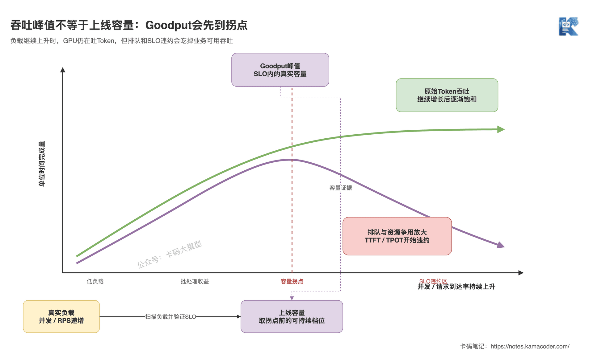

# Як навантажувати сервіс LLM: найвища пропускна здатність не означає готовності до продакшну

Попередня стаття — [Квантування — це не лише «4 біти чи 8»](./model_quantization.md) — показала: менший файл моделі не означає швидшого inference. Схему квантування однаково доводиться повертати до реального навантаження й порівнювати за якістю, затримкою, пропускною здатністю й вартістю.

Саме цей крок і є навантажувальним тестуванням.

Інтерв'юер питає: «Скільки одночасних запитів витримує ваш сервіс LLM?»

Багато хто відповідає: «Ганяли 100 паралельних — помилок не було, TPS 3000, отже, тримає 100».

Під таким висновком не можна підписатися.

- Якої довжини були вхід і вихід на тих 100 паралельних?
- Запити залили одним махом чи подавали з продакшн-швидкістю?
- 3000 TPS — це вхід, вихід чи їхня сума?
- Чи вклалися P99 TTFT, TPOT, таймаути й частка помилок у SLO?
- Чи не лишилася після тесту черга з накопичених запитів?

**Навантажувальне тестування — це не спроба завантажити GPU по вінця, а пошук максимальної потужності, за якої система на реальному навантаженні ще стабільно виконує SLO.**

## Коротка відповідь

- Спершу зафіксуйте модель, залізо, рушій і конфігурацію сервісу, а далі побудуйте навантаження з продакшн-розподілів довжини входу, довжини виходу, перевикористання префіксів та інтервалів надходження;
- замкнене тестування фіксує кількість паралельних клієнтів і добре показує зв'язок «паралельність — затримка — пропускна здатність»; відкрите надсилає запити з незалежною інтенсивністю й краще виявляє чергу й перевантаження;
- затримку розкладайте щонайменше на TTFT, TPOT чи ITL, наскрізну затримку й час у черзі, і дивіться водночас на P50, P95 і P99 — самим середнім звітувати не можна;
- пропускну здатність розділяйте на запити за секунду, вхідні токени за секунду й вихідні токени за секунду, а ще фіксуйте таймаути, скасування, частку помилок і зайнятість KV-кешу;
- Goodput рахує лише запити, що успішно завершилися в межах SLO. Продакшн-потужність беруть у точці перегину, де Goodput і частка виконання SLO ще стабільні, а не на піку сирого TPS.

Одним реченням: **спершу зробіть навантаження схожим на продакшн, а потім знаходьте межу потужності за хвостовою затримкою й Goodput.**

## Докладна відповідь

### Що зафіксувати перед тестуванням?

Публічні бенчмарки допомагають відсіяти кандидатів, але не перетворюються напряму на висновок про вашу потужність.

Зафіксуйте щонайменше такі змінні:

| Змінна | Чому її обов'язково фіксувати |
|---|---|
| Модель, токенізатор, чат-шаблон | Той самий текст може дати іншу кількість токенів, а шаблон змінює фактичний вхід |
| Точність, квантування, спосіб паралелізму | Прямо впливають на споживання пам'яті вагами, ядра й міжкартову комунікацію |
| Модель GPU, кількість, драйвер і версія рушія | Після зміни заліза чи версії результати не можна порівнювати напряму |
| Максимальний контекст, конфігурація KV-кешу, параметри планувальника | Визначають місткість під довгі запити, батч і поведінку черги |
| Потоковий режим, параметри семплінгу, умови зупинки | Впливають на вимірювання TTFT, довжину виводу й фактичний обсяг обчислень |
| Шлюз, мережа й розташування клієнта | Визначають, що ви міряєте: чистий рушій чи повний продакшн-ланцюжок |

Раджу тестувати у два шари.

Перший шар — **бенчмарк рушія**: прибираємо бізнесовий шлюз і коливання публічної мережі, щоб намацати стелю GPU, KV-кешу й планувальника.

Другий шар — **наскрізне тестування**: лишаємо автентифікацію, маршрутизацію, потоковий протокол, мережу й таймаути, щоб відповісти, скільки насправді чекатиме користувач.

Дані обох шарів треба зберегти. Якщо міряти лише рушій — легко проґавити проблеми шлюзу й мережі; якщо лише наскрізно — важко локалізувати, на якому шарі витрачається час.

### Чому не можна просто генерувати випадкові токени фіксованої довжини?

Запити до великої моделі — це не «пакети приблизно однакового розміру».

Обсяг роботи на один запит визначають щонайменше вхідні й вихідні токени разом. Довгий вхід роздуває prefill і TTFT, довгий вихід надовго займає decode і KV-кеш. Якщо всі запити описати як `вхід 512, вихід 128`, ви отримаєте потужність рівно для цієї специфікації.

Надійніше витягти спільний розподіл із знеособлених продакшн-логів:

- P50, P95, P99 вхідних і вихідних токенів, а не саме лише середнє;
- частки бізнес-типів: короткі питання-відповіді, довгі документи, генерація коду тощо;
- довжину історії, яку додають багатораундові діалоги;
- спільний системний промпт, префікси RAG і частку влучань у Prefix Cache;
- сплески трафіку, гарячі точки окремих тенантів, скасування й таймаути.

Зверніть увагу на слова «спільний розподіл».

Якщо в продакшні довгий вхід поєднується з коротким виходом, а короткий вхід — із довгим, то роздільне випадкове семплювання входу й виходу створить комбінації, яких насправді не існує. Найнадійніше — відтворювати знеособлені запити або будувати окремі кошики трафіку за бізнес-типами.

Фіксована довжина виводу з ігноруванням EOS годиться для відтворюваних порівнянь рушіїв; але для тесту продакшн-потужності треба додати ще один прогін із відтворенням трафіку, що дотримується реальних умов зупинки.

### Чим відкрите тестування відрізняється від замкненого?

**Замкнене тестування** фіксує N паралельних клієнтів. Наступний запит клієнт надсилає лише після завершення попереднього.

Воно добре відповідає на питання: «Як змінюються пропускна здатність і досвід одного запиту, коли паралельність росте 1, 2, 4, 8…?»

Але має сліпу зону: що повільніший сервіс, то пізніше клієнт надішле наступний запит, тож фактична інтенсивність надходження сама собою падає. Система вже сповільнилася, а тестувальник за неї натиснув на гальма — і ризик черги може лишитися прихованим.

**Відкрите тестування** надсилає запити з незалежною інтенсивністю, не чекаючи завершення попередніх. Фіксований RPS, пуасонівське надходження чи відтворення продакшн-трафіку — усе це той самий підхід.

Воно краще відповідає на питання: «Якщо в продакшні щосекунди справді надходить стільки запитів, чи не зростатиме черга без упину?»

Коли інтенсивність надходження вища за інтенсивність обслуговування, незавершені запити накопичуються. Тому у відкритому тестуванні обов'язково задайте максимум запитів «у польоті», таймаути й умови зупинки, а звітувати треба одразу все:

```text
цільова інтенсивність → фактична інтенсивність надсилання → інтенсивність завершення → Goodput
```

Тестувати треба обидві моделі: спершу замкненою просканувати діапазон паралельності, потім відкритою перевірити цільовий пік і сплески. І не вважайте «100 паралельних» тим самим, що «100 RPS».

### Що саме міряють TTFT, TPOT та ITL?

Потоковий запит можна грубо розкласти так:

```text
клієнт надсилає запит
→ мережа / шлюз
→ черга на боці сервера
→ prefill обробляє вхід
→ повертається перший токен
→ decode генерує токен за токеном
→ повертається останній токен
```

**TTFT (Time to First Token)** — час від надсилання запиту до отримання першого корисного токена. У наскрізному вимірі він містить не лише prefill, а й мережу, шлюз і чергу.

Тому, коли TTFT раптово погіршився, не робіть одразу висновок «промпт задовгий». Спершу подивіться на час у черзі на сервері. Якщо довжина входу не змінилася і час виконання на GPU теж помітно не зріс, а черга невпинно росте, то справжня проблема в тому, що система наблизилася до насичення.

**TPOT (Time Per Output Token)** зазвичай рахують як середнє за формулою:

```text
TPOT = (наскрізна затримка - TTFT) / (кількість вихідних токенів - 1)
```

Він описує середній темп генерації після першого токена. **ITL (Inter-Token Latency)** більше наголошує на проміжку між сусідніми токенами, і по ньому можна додатково рахувати P95, P99 та максимальну паузу.

Різні інструменти можуть по-різному визначати TPOT, ITL і те, чи входить перший токен у середнє. Перш ніж порівнювати два звіти, узгодьте формули, а не лише назви метрик.

**Наскрізна затримка** — це час від надсилання запиту до отримання останнього токена. Для реферування, структурованого виводу й непотокових задач вона часто важливіша за «швидкий перший символ».

SLO теж не переписуйте з чужих фіксованих чисел. Терпимість до очікування в діалозі, автодоповненні коду, офлайновому реферуванні й задачах агента геть різна. Спершу виведіть пороги з продуктового досвіду й бюджету таймаутів нижчих ланок, а тоді тестуйте.

### Чому середня затримка обманює найлегше?

Припустімо, зі 100 запитів 95 повернулися менш ніж за секунду, а ще 5 через довгий промпт простояли в черзі 20 секунд. Середнє ще може виглядати пристойно — але ті п'ятеро користувачів уже однозначно відчули збій.

Тому звітуйте щонайменше P50, P95 і P99 одночасно:

- P50 — типовий досвід;
- P95 — пік і змішане навантаження;
- P99 — довгі запити, черга, джитер і поодинокі погані шляхи;
- максимум корисний для розслідування, але окремо як показник стабільної потужності не годиться.

Квантилі обов'язково подавайте з кількістю зразків і тривалістю тесту. Якщо надіслано лише 100 запитів, P99 визначається фактично одним-двома найповільнішими; а якщо тест закороткий, ви могли зміряти саме холодний старт або один випадковий батч.

Кожен рівень навантаження має пройти прогрів, усталений режим і охолодження. Статистику збирайте у вікні усталеного режиму й водночас переконайтеся, що наприкінці тесту черга розсмокталася — накопичення не можна переносити на наступний рівень.

### Чому високий TPS не означає готовності до продакшну?

Спершу з'ясуймо, що таке TPS.

У звітах про великі моделі трапляються три різні пропускні здатності в токенах:

- вхідні токени/с — відображають обсяг prefill;
- вихідні токени/с — відображають сумарну швидкість генерації для всіх запитів;
- загальні токени/с — сума входу й виходу.

Порівнювати їх упереміш не можна. Два рішення можуть обидва показувати 3000 токенів/с, але одне буде сильним у ковтанні довгих промптів, а друге — у тривалому decode.

З ростом паралельності неперервне пакетування зазвичай спершу піднімає утилізацію GPU й загальну пропускну здатність. Але якщо тиснути далі, пропускна здатність поступово насичується, а час у черзі, TTFT і TPOT швидко псуються.

Це і є компроміс між затримкою й пропускною здатністю.



Схема показує, чому з ростом паралельності максимум сирої пропускної здатності не є продакшн-потужністю. До точки перегину виграш від пакетування піднімає водночас і пропускну здатність, і Goodput; після неї черга й конкуренція за ресурси змушують дедалі більше запитів порушувати SLO — і навіть якщо GPU далі видає токени, доступна для бізнесу потужність уже впала.

### Як рахувати Goodput?

Спершу визначте SLO для кожного класу запитів, наприклад:

```text
діалоговий запит: TTFT, TPOT, наскрізна затримка, частка помилок
структурована задача: наскрізна затримка, проходження схеми, частка помилок
```

Далі рахуйте за єдиною методикою:

```text
Goodput = кількість успішних запитів, що задовольнили всі SLO у вікні тесту / тривалість тесту
частка виконання SLO = кількість успішних запитів, що задовольнили всі SLO / кількість фактично надісланих запитів
```

Припустімо, на певному рівні навантаження завершується 20 запитів/с, але лише 70 % із них водночас укладаються в цілі за TTFT і TPOT — тоді Goodput цього рівня щонайбільше 14 запитів/с. Якщо тиснути далі й підняти загальну пропускну здатність до 22 запитів/с, але частка виконання впаде до 40 %, Goodput, навпаки, лишиться на 8,8 запита/с.

Ці числа лише ілюструють метод розрахунку, це не універсальні пороги.

І варто закрити ще одну діру в метриці: Goodput не має заохочувати систему самовільно викидати запити, які «вже не встигають». Таймаути, помилки, скасування й незавершені запити треба звітувати окремо, а якість для бізнесу має бути передумовою запуску — а не так, щоб Goodput малювався красивим коштом викинутих запитів.

### Як провести повний цикл навантажувального тестування?

Можна виконати шість кроків.

**Крок 1: визначте сценарії й SLO.** Розділіть діалог, реферування, код, RAG чи агента; для кожного класу запитів зафіксуйте розподіл довжин, частку, планку якості й цілі за затримкою.

**Крок 2: побудуйте базову лінію одного запиту.** За паралельності 1 запишіть TTFT, TPOT, наскрізну затримку, відеопам'ять і утилізацію GPU — щоб одразу виключити варіант, коли сама модель чи конфігурація вже не дотягують.

**Крок 3: просканіруйте навантаження замкненою моделлю.** Тестуйте на рівнях паралельності, що зростають поступово; кожен рівень має пройти прогрів і достатньо довге вікно усталеного режиму, а зібрати треба пропускну здатність, квантилі затримки, чергу, KV-кеш і помилки.

**Крок 4: знайдіть точку перегину потужності.** Знайдіть місце, де приріст пропускної здатності починає зменшуватися, P95/P99 і черга помітно йдуть угору, а Goodput перестає зростати. Зменште крок і перевиміряйте околиці перегину.

**Крок 5: перевірте відкритою моделлю.** Прожене цільовий середній RPS, піковий RPS, пуасонівське надходження й відтворення коротких сплесків, спостерігаючи, чи розсмоктується накопичення за прийнятний час.

**Крок 6: проведіть тест на витривалість і на відмови.** Запустіть надовго, охопивши зміну холодного й гарячого кешу, скасування запитів, відмову однієї репліки й відновлення. Відсутність OOM на короткому прогоні не означає, що за кілька годин не буде витоку пам'яті, фрагментації чи деградації довгого хвоста.

Змінюйте за раз лише одну головну змінну. Якщо одночасно змінити рушій, квантування, паралелізм, параметри батчу й модель трафіку, то навіть зі зрослим TPS ви не поясните, звідки взявся виграш.

### Що має бути у звіті наприкінці?

Не обмежуйтеся скриншотом із TPS. Висновок про готовність до продакшну має відповідати щонайменше на таке:

- об'єкт тестування: модель, точність, залізо, версія рушія й ключові налаштування;
- методика навантаження: типи запитів, розподіл входу й виходу, влучання в кеш, відкрита чи замкнена модель;
- методика SLO: які метрики, які квантилі, як рахуються таймаути й помилки;
- висновок про потужність: стійкий RPS чи паралельність на одну репліку, Goodput і частка виконання;
- межі ризику: що станеться на довгих запитах, сплесках, гарячій точці одного тенанта й під час відмови;
- підстава для масштабування: прогнозований пік, ціль із запасу й залишкова потужність після відмови однієї репліки.

Вартість теж треба звести до успішних запитів:

```text
вартість GPU на один запит, що вклався в SLO
≈ кількість GPU × вартість за годину / (Goodput × 3600)
```

До справжнього TCO додаються ще CPU, мережа, сховище, шлюз і експлуатація. Це узгоджується з висновком статті [Хмарний API, керований inference чи власне розгортання](./deployment_options.md): **порівнювати треба не «скільки токенів за секунду виплюнуто», а скільки коштує одне придатне завдання.**

## Поглиблення

**Q1. Чим відрізняються кількість паралельних запитів, розмір батчу й RPS?**

Паралельність — це кількість запитів «у польоті»; розмір батчу — скільки запитів чи токенів рушій фактично рахує разом в одному раунді; RPS — скільки запитів надходить або завершується за одиницю часу. Висока паралельність не означає такого самого великого батчу в кожному раунді, а RPS ще й змінюється разом із тривалістю одного запиту.

**Q2. Якщо TTFT високий, то винен обов'язково повільний prefill?**

Не обов'язково. TTFT може містити ще й мережу, шлюз і чергу. Якщо довжина входу й час виконання prefill не змінилися, а TTFT швидко росте з навантаженням, перевіряйте передусім чергу й завади з боку планувальника.

**Q3. Навіщо розділяти пропускну здатність входу й виходу?**

Prefill і decode мають різний обчислювальний профіль. Щойно змінюється співвідношення входу й виходу в бізнес-трафіку, два рішення з однаковим показником загальних токенів/с можуть дати геть різну затримку для користувача й різну кількість витримуваних запитів.

**Q4. Вмикати Prefix Cache під час тестування чи ні?**

Спершу прожене базову лінію з вимкненим або холодним кешем, а потім перевиміряйте з реальними для продакшну спільними префіксами й часткою влучань. Стовідсоткове влучання завищить потужність, а повністю вимкнений кеш приховає справжній виграш. Механіку Prefix Cache можна переглянути в статті [Чому KV-кеш з'їдає всю відеопам'ять](./kv_cache_paged_attention.md).

**Q5. Чи що вища утилізація CPU й GPU, то краще?**

Утилізація — діагностичний сигнал, а не мета для продакшну. GPU, що довго працює майже на повну, але P99 і Goodput усе одно в межах порогів, — це прийнятно; а висока утилізація з великою чергою свідчить лише про те, що ресурс зайнятий, а не про те, що сервіс добрий.

**Q6. Як на співбесіді відповісти «скільки паралельних запитів витримує?»**

Спершу назвіть умови навантаження, потім SLO й потужність: «На такій-то моделі, такому залізі й такому розподілі входу/виходу замкненим скануванням знайдено точку перегину, далі перевірено цільовим RPS і сплесками; зрештою одна репліка стабільно тримає стільки-то в межах порогів за P99, часткою помилок і Goodput». Цифра паралельності без умов не має сенсу.

Визначення метрик і методику тестування з цієї статті звірено в серпні 2026 року за [документацією NVIDIA NIM про метрики бенчмаркінгу](https://docs.nvidia.com/nim/benchmarking/llm/latest/metrics.html), [параметрами навантаження й найкращими практиками NVIDIA](https://docs.nvidia.com/nim/benchmarking/llm/latest/parameters.html), [документацією SGLang про тестування онлайн-обслуговування](https://github.com/sgl-project/sglang/blob/main/docs/developer_guide/bench_serving.md), [статтею про DistServe](https://www.usenix.org/conference/osdi24/presentation/zhong-yinmin) і [статтею з переосмисленням метрики Goodput](https://arxiv.org/abs/2410.14257).

Перестаньте вважати «прогнали 100 паралельних без помилок» висновком про потужність.

**По-справжньому робив навантажувальне тестування LLM той, хто може чітко сказати, яке було навантаження, які SLO і де точка перегину.**
