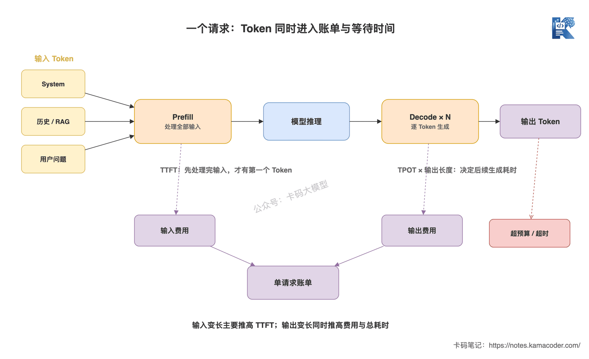
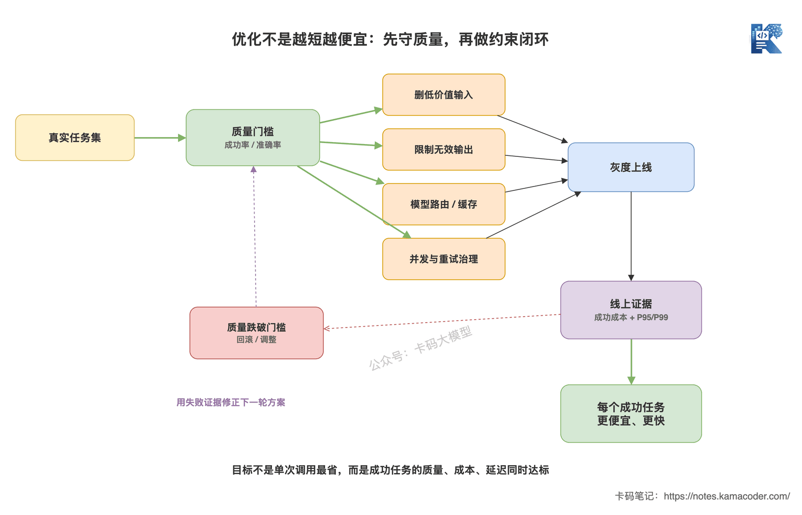

# Токени, вартість і затримка: три жорсткі обмеження застосунку на LLM

У попередній статті [«Синхронний, асинхронний і потоковий вивід»](./streaming_output.md) ішлося про те, як доставляти результат. Потоковий вивід дозволяє користувачеві побачити вміст раніше, але він не зменшив моделі жодного обчисленого токена й не скасував загального часу генерації.

Інтерв'юер питає далі: «Як ви у своєму застосунку контролюєте токени, вартість і затримку?»

Типова відповідь: «Пишемо промпт коротшим, беремо дешевшу модель, додаємо потоковий вивід».

Напрямок правильний, але це досі три розрізнені прийоми. Інтерв'юер хоче почути інше: **де саме породжуються токени, як вартість множиться обсягом бізнесу і на якому етапі застрягає затримка.**

Насправді ці три питання — один ланцюг.

## Коротка відповідь

- **Токен** — базова одиниця, якою модель оперує з текстом. Вхідні токени охоплюють системний промпт, історію повідомлень, документи з RAG, описи інструментів і питання користувача; вихідні — те, що модель згенерувала. Кількість токенів треба рахувати токенізатором відповідної моделі, а не перераховувати з кількості символів.
- **Вартість** зазвичай рахується окремо за вхід і вихід, причому ціна вихідного токена часто інша. Чи тарифікуються окремо кешовані токени, службові токени міркування, embedding і виклики інструментів — залежить від правил конкретного вендора.
- **Затримку** треба розкладати: черга й мережа, Prefill (обробка входу), Decode (потокова генерація). TTFT показує, за скільки з'явиться перший токен, TPOT — як швидко генеруються наступні.
- **Порядок оптимізації** — не гонитва за дешевизною й швидкістю, а спершу утримання планки якості, потім зменшення малоцінних токенів, а далі маршрутизація моделей, кешування, контроль конкурентності й ліміт виводу задля вартості одного запиту та P95/P99 затримки.

Одним реченням: **токен — одиниця вимірювання ресурсу, вартість — це він, помножений на ціну й кількість викликів, а затримка — час, який він з'їдає в ланцюжку інференсу.**

## Розгорнута відповідь

### Токен — це не кількість символів, орієнтир — токенізатор

Модель бачить не «скільки там символів», а послідовність Token ID.

Та сама фраза українською, англійською, кодом чи у вигляді JSON може розбитися по-різному; той самий текст на іншій родині моделей матиме інший токенізатор. Довгі URL, UUID, екранований JSON і рідковживані символи часто з'їдають значно більше токенів, ніж здається на око.

Тож «один токен — це приблизно стільки-то символів» годиться лише для початкової грубої оцінки, а не для продакшн-бюджету. Робочий код має фіксувати щонайменше чотири величини:

- **вхідні токени:** системний промпт, few-shot, історія повідомлень, фрагменти з RAG, схеми інструментів, результати інструментів і питання цього раунду;
- **вихідні токени:** підсумкова відповідь або структурований результат;
- **кешовані токени:** вхід, що потрапив у Prompt Cache через збіг префікса; чи діє знижка — визначає конкретний API;
- **службові токени міркування:** деякі моделі використовують їх усередині; чи видимі вони, чи тарифікуються й чи займають вікно — треба дивитися в документації API.

У статті [«Наскільки велике контекстне вікно? Вступ до context engineering»](./context_engineering.md) ішлося, що вхід і вихід ще й ділять між собою контекстне вікно. Додамо ще шар: **ці токени не лише займають вікно, а й потрапляють у рахунок і в затримку.**



Ця схема відповідає на питання: як токени всередині одного запиту одночасно впливають на вартість і затримку. Що довший вхід, то важчий зазвичай Prefill і то вищий TTFT; що довший вихід, то більше кроків Decode, і вартість разом із загальним часом зростають одночасно. Потоковий вивід лише раніше віддає вже згенеровані токени, але не скасовує подальшого процесу Decode.

### Скільки насправді коштує один запит?

Найбазовіша формула оцінки така:

```text
вартість одного запиту
= вхідні токени / одиниця тарифікації × ціна входу
+ вихідні токени / одиниця тарифікації × ціна виходу
+ інші витрати
```

Одиницею тарифікації зазвичай є мільйон токенів, але не зашивайте її в бізнес-логіку. Ціни, знижки на кеш і склад позицій змінюються — усе це має жити в конфігурації або в платформі обліку витрат.

Якщо хочете побачити повний розрахунок рахунку з конкретними цінами моделей, звіртеся зі статтею [«Як тарифікується API великих моделей»](../intro/llm_pricing.md). Тут ми не повторюємо порівняння цін, а дивимося, як ці витрати множаться в реальному бізнесі обсягом викликів, повторними спробами й багатокроковими ланцюжками.

Наведімо приклад без прив'язки до конкретного вендора. Одне питання-відповідь використало 3000 вхідних токенів і 800 вихідних, а запитів 100 тисяч на день. Тоді базовий добовий обсяг такий:

```text
вхід:  3000 × 100000 = 300 млн токенів/добу
вихід:  800 × 100000 =  80 млн токенів/добу
```

А після запуску в продакшн треба врахувати ще й множники:

- **повторні спроби:** один таймаут із повтором може змусити вас заплатити за той самий довгий промпт двічі;
- **багатокрокові агенти:** за одним запитом користувача може стояти кілька викликів моделі;
- **RAG і embedding:** векторизація перед пошуком і rerank теж можуть коштувати окремо;
- **модерація й оцінювання:** після відповіді основної моделі викликається ще одна для перевірки — і вона теж тарифікується;
- **марний вивід:** користувач скасував на середині, але вже згенеровані токени зазвичай усе одно спожили ресурси.

Тому вартість не можна зводити до «скільки коштує мільйон токенів у моделі» — рахувати треба так:

```text
добова вартість = запитів на добу × середня кількість викликів на запит × середня вартість виклику
```


Ця схема відповідає на питання: чому недорогий на вигляд API у продакшні раптом дає роздутий рахунок. Обсяг бізнес-запитів множить загальну кількість викликів, а повторні спроби, багатокрокові виклики агента й запити з низьким влучанням у кеш перетворюють один бізнес-запит на кілька платних викликів моделі.

### Затримку не можна зводити до одного «загального часу»

Наскрізну затримку запиту до великої моделі варто спершу розкласти на чотири частини:

```text
наскрізний час = мережа й обробка в застосунку + черга + Prefill + Decode
```

**Prefill** обробляє всі вхідні токени й будує KV Cache. Що довший вхід, то більший зазвичай обсяг обчислень; ця частина головно впливає на TTFT — час від надсилання запиту до першого отриманого токена.

**Decode** генерує вихідні токени один за одним. Кожен крок продовжує міркування на основі попереднього результату. Тут головні чинники — довжина виводу й швидкість генерації одного токена.

Для інтуїції можна взяти спрощену формулу:

```text
час етапу генерації ≈ кількість вихідних токенів × TPOT
наскрізний час ≈ TTFT + час етапу генерації
```

Це не точна формула для навантажувальних тестів, але її достатньо, щоб пояснити два поширені явища:

- **дуже довгий промпт, коротка відповідь:** користувач довго чекає на перший символ, TTFT високий;
- **короткий промпт, дуже довга відповідь:** перший символ з'являється швидко, але генерація триває й триває, і загальний час високий.

Тому [потоковий вивід](./streaming_output.md) оптимізує головним чином **відчуття очікування**. Якщо TTFT сам по собі високий, streaming не врятує від порожнечі перед першим символом; якщо повільний TPOT, користувач бачитиме, як текст «видавлюється» ривками.

### Чому токени, вартість і затримка — це три жорсткі обмеження?

Бо їх не можна оптимізувати поодинці.

Зріжете документи RAG з п'яти фрагментів до одного — і вхідні токени, вартість та TTFT, ймовірно, впадуть, але разом із ними може зникнути ключовий доказ, і точність відповідей просяде.

Перейдете на меншу й дешевшу модель — ціна й затримка можуть впасти, але частота невдач на складних задачах зросте. А невдача тягне повторну спробу або ручне втручання, і підсумкова вартість виходить вищою.

Зробите агресивнішу пакетну обробку заради пропускної здатності — завантаження GPU зросте, але окремий запит довше чекатиме в черзі, і P99 затримка погіршиться.

Даєте моделі більший `max_tokens` — це не означає, що вона щоразу стільки й згенерує, але межі виводу стають вільнішими. А без умов зупинки модель охочіше видає багатослів'я, і час Decode разом із вартістю зростають.

**Справжня мета оптимізації — знизити вартість і затримку кожної успішно виконаної задачі за умови дотримання планки якості.** Саме «успішної задачі», а не «одного виклику».



Ця схема відповідає на питання: як обирати дії з оптимізації. Спершу планка якості відсіює варіанти «дешево, але з хибними відповідями», далі окремо перевіряються вхід, вихід, модель і конкурентність, а після оптимізації результат звіряється з продакшн-метриками — щоб не перетворити проблему вартості на проблему якості, а проблему пропускної здатності на проблему P99 затримки.

### Як оптимізувати в продакшні?

Починайте з токенів, але не рубайте текст навпростець.

- **Зріжте малоцінний вхід:** приберіть дубльовану історію, нерелевантні фрагменти RAG, застарілі результати інструментів і схеми інструментів, не потрібні для поточної задачі.
- **Обмежте межі виводу:** чітко задайте формат і довжину відповіді, встановіть розумний максимум вихідних токенів і умови зупинки.
- **Перевикористовуйте стабільний префікс:** якщо системний промпт, спільні знання й описи інструментів стабільні, розгляньте Prompt Cache.
- **Маршрутизуйте моделі за задачею:** класифікація й витягування — на малу модель, складне міркування — на сильну.
- **Зменште марні виклики:** перевірки, обчислення й рішення за правилами, які може зробити код, не варто віддавати моделі.
- **Керуйте повторними спробами:** повторюйте лише відновлювані помилки, використовуйте експоненційну затримку й ідемпотентність, щоб не отримати шторм таймаутів.
- **Контролюйте конкурентність і черги:** задайте таймаути, обмеження частоти, запобіжники й деградацію; дивіться на P95/P99, а не лише на середнє.

З Prompt Cache зверніть увагу на межі: він зазвичай зменшує обчислення чи вартість повторюваного входу, але кешовані токени найчастіше все одно займають контекстне вікно, і високе влучання дає лише стабільний префікс. Детальний механізм кешування розібрано в статті [«Чому Claude Code швидкий: розбираємо Prompt Cache»](../claude/claude_prompt_cache.md).

### Які метрики моніторити, щоб побачити проблему?

Щонайменше чотири групи — якість, обсяг, вартість, затримка — з можливістю розрізу за моделлю, продуктом, орендарем і типом запиту:

- **якість:** частка успішних задач, проходження структурної валідації, успішність після повторної спроби, частка ручного втручання;
- **обсяг:** вхідні токени, вихідні токени, кешовані токени, кількість викликів моделі на один бізнес-запит;
- **вартість:** вартість запиту, вартість однієї успішної задачі, добова вартість, темп аномального зростання;
- **затримка:** TTFT, TPOT, наскрізні P50/P95/P99, час очікування в черзі, частка таймаутів.

Дивитися лише на середні токени й середній час небезпечно. Більшість запитів може бути короткою, а невелика кількість наддовгих промптів уже з'їдає половину бюджету; середня затримка виглядає нормально, а користувачі на P99 уже чекають до таймауту.

## Розширення теми

**Q1: як на співбесіді відповідати на «як ви контролюєте вартість LLM»?**

Спершу поясніть методику обліку: рахуємо окремо вхід, вихід, кеш і багатокрокові виклики, а ключова метрика — «вартість однієї успішної задачі». Далі назвіть засоби: скорочення контексту, ліміт виводу, маршрутизація моделей, Prompt Cache, зменшення марних викликів і керування повторними спробами. Наприкінці — перевірку: одночасно спостерігаємо частку успішних задач, розподіл токенів, добову вартість і P95/P99 затримки. Не можна обмежитися фразою «ми перейшли на дешевшу модель».

**Q2: чому вихідні токени часто варті контролю більше, ніж вхідні?**

Вихідні токени не лише можуть мати іншу ціну — вони ще й генеруються по одному через Decode, а отже прямо подовжують загальний час. Багатьом сценаріям потрібна лише мітка класу, поле JSON чи короткий висновок, а модель отримує свободу писати кількасот слів. Це найпряміше марнотратство.

**Q3: чи знижує потоковий вивід затримку?**

Він головно знижує відчуття очікування, віддаючи результат у процесі генерації, і зазвичай не зменшує загального обсягу обчислень моделі. Щоб знизити реальний TTFT, треба зменшувати чергу й навантаження на Prefill; щоб знизити загальний час — контролювати довжину виводу й підвищувати швидкість Decode.

**Q4: чи що коротший контекст, то краще?**

Ні. Видалення шуму — це оптимізація, а видалення доказів — погіршення якості. Треба порівнювати частку успішних задач, коректність цитувань, вартість і затримку до й після скорочення, шукаючи мінімальний достатній контекст, який ще тримає планку якості.

**Q5: чому ціна моделі впала, а місячний рахунок зріс?**

Можливо, зросли обсяг запитів, середній контекст, кількість багатокрокових викликів або частка повторних спроб. А можливо, дешевша модель частіше помиляється. Щоб знайти справжній множник, розкладіть рахунок на «обсяг запитів × викликів на запит × токенів на виклик × ціна».

Годі обмежуватися порадою «пишіть промпт коротше».

Той, хто вміє пояснити, на що пішов кожен токен і де застрягла кожна секунда затримки, і є людиною, яка справді робила застосунки на великих моделях.
