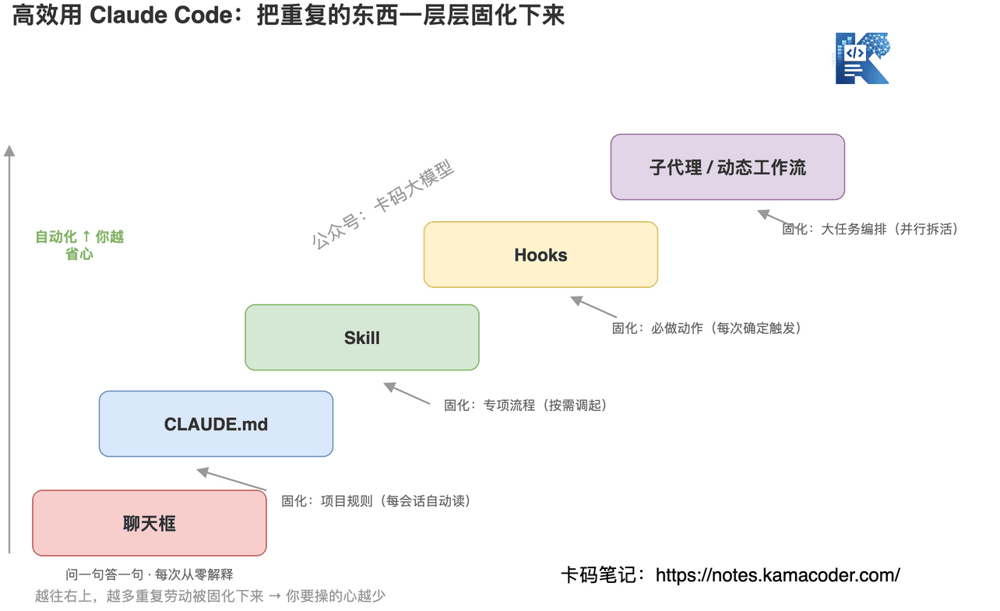

# Ефективне використання Claude Code: не тримайте його за чат — 5 речей, що перетворять його на команду, яка працює сама

Сьогодні про інструмент, яким користуються багато, а правильно — мало хто: **Claude Code**.

Як я спостерігаю, переважна більшість, установивши Claude Code, тримає його за «чат, що вміє писати код»: відкрив термінал, спитав, отримав відповідь, скопіював, закрив.

Так теж можна, але цінність інструмента при цьому не розкривається.

Справжня цінність Claude Code не в тому, що «він уміє писати код», а в тому, що ви можете перетворити його з **тимчасового працівника, якому щоразу доводиться все пояснювати з нуля**, на **команду, що знає ваш проєкт, працює самостійно й уміє вести кілька потоків паралельно**. Різницю створює те, що нижче.

Раніше ми окремо розбирали, [як усе-таки писати CLAUDE.md](./claude_md.md), [«пишіть не промпти, а цикли»](./claude_code_loop.md) і [чому Claude Code швидкий](./claude_prompt_cache.md) — там глибокі занурення в окремі теми. Ця стаття зшиває їх в один маршрут «від просто працює до працює ефективно».

Якщо ви ще плутаєтеся, за що відповідають CLAUDE.md, Skills, субагенти, MCP, Hooks і плагіни, спершу прочитайте [Повний посібник із розширень Claude Code](./claude_code_toolkit_guide.md): там є структура тек, конфігурація й приклади поєднань.



Схема показує, **як покроково вивести Claude Code із «чату» в ефективну роботу**. Червоний «чат» в основі — це поверхове використання, на якому більшість і зупиняється: питання-відповідь і щоразу пояснення з нуля. Кожна сходинка вгору закріплює якийсь клас повторюваної праці: правила проєкту — у CLAUDE.md, спеціалізовані процеси — у скіли, обов'язкові дії — у хуки, великі задачі — у паралельну оркестрацію. Що більше закріплено, то менше вам доводиться тримати в голові. Далі пройдімо цими сходами знизу вгору.

## Річ перша: не змушуйте його щоразу «знайомитися з проєктом наново»

У новій сесії Claude Code **нічого не пам'ятає**. Він не знає ні вашого стеку, ні ваших домовленостей про код, ні того, на які граблі в цьому проєкті не можна ставати.

Переказуючи це щоразу вголос, ви виконуєте повторювану роботу. **Правильно — записати це в `CLAUDE.md`**: markdown-файл у корені проєкту, який Claude Code читає на початку кожної сесії. Стандарти коду, архітектурні рішення, часті команди, набиті ґулі — усе туди.

Сам лише цей крок зрізає більшу частину проблем на кшталт «те, що він написав, не відповідає звичаям мого проєкту».

Ще зручніше те, що дорогою Claude сам накопичує **автоматичну пам'ять**: команди збірки, знахідки з налагодження він запам'ятовує між сесіями, і вам писати це не треба. Як зробити CLAUDE.md корисним і водночас не роздутим, докладно розписано [в окремій статті](./claude_md.md).

**Одним реченням: CLAUDE.md — це «інструкція до проєкту», яку ви пишете раз, а виграє від неї кожна сесія.**

## Річ друга: пакуйте у скіли те, що доводиться пояснювати щоразу

CLAUDE.md розв'язує задачу «завжди активних правил проєкту», але є справи, потрібні лише **в конкретних ситуаціях**: як писати release notes перед випуском, чекліст рев'ю PR у вашій команді, фіксовані кроки розгортання на staging.

Якщо запхати це в CLAUDE.md, він роздметься й даремно з'їдатиме контекст. **Таке треба пакувати у скіли.**

Скіл — це **спеціалізована здатність, що завантажується на вимогу**: у звичайний час вона не займає контексту, а підтягується, коли Claude бачить, що вона знадобиться в поточній задачі; запускається в один дотик на кшталт `/review-pr` чи `/deploy-staging`. І скіл — це не markdown-файл, а **тека**, куди можуть входити скрипти, шаблони й довідкові матеріали.

Усередині Anthropic уже використовують **кілька сотень скілів**, і їхній практичний досвід я розписав у [окремій статті про Claude Skills](./claude_skills.md) — варто прочитати, якщо збираєтеся братися за скіли серйозно.

**Одним реченням: процес, який ви повторили більш ніж тричі, час пакувати у скіл і ділитися ним із командою.**

## Річ третя: віддайте хукам те, що доводиться робити руками щоразу

Є речі, де питання не в тому, «чи вирішить Claude це зробити», а в тому, що це **треба робити завжди**: автоматично форматувати файл після кожної зміни, обов'язково прогнати lint перед комітом.

Стежити за цим власною увагою чи нагадувати Claude — ненадійно. **Це робота для хуків.**

Хуки дозволяють автоматично виконувати shell-команди **до або після** дій Claude Code. Налаштували «форматувати після редагування файлу» й «lint перед комітом» — і ці дії перестають залежати від людської уваги, ставши детермінованою частиною процесу.

**Різницю між скілами й хуками запам'ятайте так: скіл — здатність, яку викликають за потреби, а хук — дія, що гарантовано спрацьовує щоразу.**

## Річ четверта: великі задачі не тягніть наодинці — субагенти й динамічні робочі процеси

Глибоке дослідження, аудит безпеки, масштабний рефакторинг: якщо **один** Claude тягне все від початку до кінця, контекст швидко забивається, а разом із тим з'являються дрейф цілі, лінощі й самовихваляння.

Розв'язок Claude Code — **запустити паралельно цілу команду Claude**:

- **субагенти (sub-agents)**: головний агент ділить задачу на частини, роздає їх кільком субагентам, які працюють одночасно, а потім сам зводить результати. Кожен субагент має власний контекст, і вони не забруднюють одне одного.
- **динамічні робочі процеси (Dynamic Workflows)**: крок далі — Claude під **вашу поточну задачу** пише оркестрацію на місці (віяло зі зведенням, змагальна перевірка, турнір та інші патерни) і роздає роботу команді Claude.

Інженерну логіку «навіщо ділити й як ділити» я розібрав у статтях [Managed Agents](./managed_agents.md) і [Динамічні робочі процеси](./dynamic_workflows.md).

**Одним реченням: контекст — дефіцитний ресурс, тож велику роботу ділять і розпаралелюють, а не звалюють на одного Claude.**

## Річ п'ята: вийдіть за межі чату — конвеєри CLI та заплановані задачі

Багато хто використовує Claude Code лише в інтерактивному чаті, хоча він дотримується філософії Unix і **його можна ставити в конвеєр, у скрипти й у CI**.

З `claude -p` (режим print) він стає ланкою командного рядка:

```bash
# стежити за логом і писати в Slack, якщо трапиться аномалія
tail -200 app.log | claude -p "якщо помітиш будь-яку аномалію — напиши мені в Slack"

# перевірити змінені файли на проблеми з безпекою
git diff main --name-only | claude -p "перевір ці змінені файли на проблеми з безпекою"
```

Наступний рівень — **заплановані задачі**, щоб рутина відбувалася сама: ранкове рев'ю PR, нічний аналіз падінь CI, щотижневий аудит залежностей.

- для тимчасового опитування просто в терміналі є [`/loop`](./claude_code_loop.md) (за цим стоїть та сама ідея «пишіть цикли, а не промпти»);
- якщо треба, щоб **працювало навіть із вимкненим комп'ютером**, є **Routines**: вони працюють на інфраструктурі Anthropic, і їх можна викликати з API чи запускати подіями GitHub.

**Одним реченням: можна поставити питання одним рядком, а можна вбудувати його в конвеєр і заплановану задачу без нагляду — і саме друге є стелею ефективності.**

## Наостанок: продовжити роботу в іншому місці

Claude Code не прив'язаний до одного інтерфейсу. Термінал, VS Code / JetBrains, десктопний застосунок, веб — за ними **той самий рушій**, а ваш CLAUDE.md, налаштування й MCP-сервери працюють скрізь однаково.

Відійшли від робочого місця — **перехопіть активну сесію** з телефона чи браузера; запустили довгу задачу у вебі чи на iOS — потім командою `claude --teleport` перетягніть її назад у термінал. **Робота йде за вами, а не за пристроєм.**

Зрештою, ефективне використання Claude Code зводиться до однієї лінії: **шар за шаром закріплювати те, що доводиться повторювати** — правила проєкту в CLAUDE.md, спеціалізовані процеси у скіли, обов'язкові дії в хуки, великі задачі в паралельну оркестрацію. Що більше закріплено, то менше вам доводиться тримати в голові.

## Посилання

- Офіційна документація Claude Code (огляд): https://code.claude.com/docs/en/overview
- Офіційна документація Claude Code (типові робочі процеси): https://code.claude.com/docs/en/common-workflows
