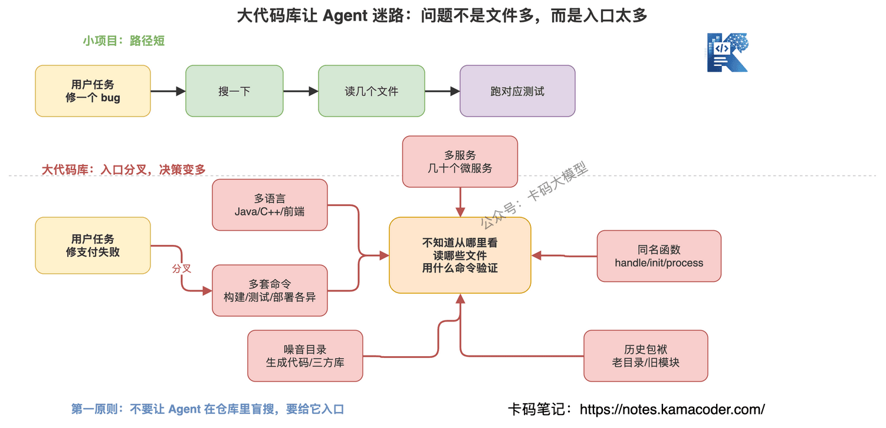
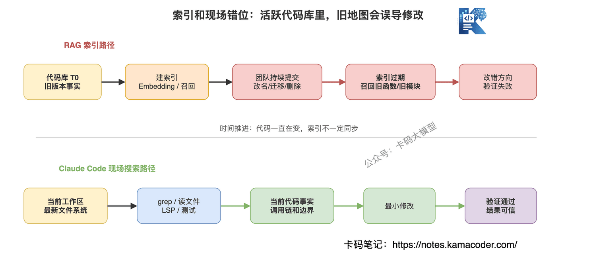
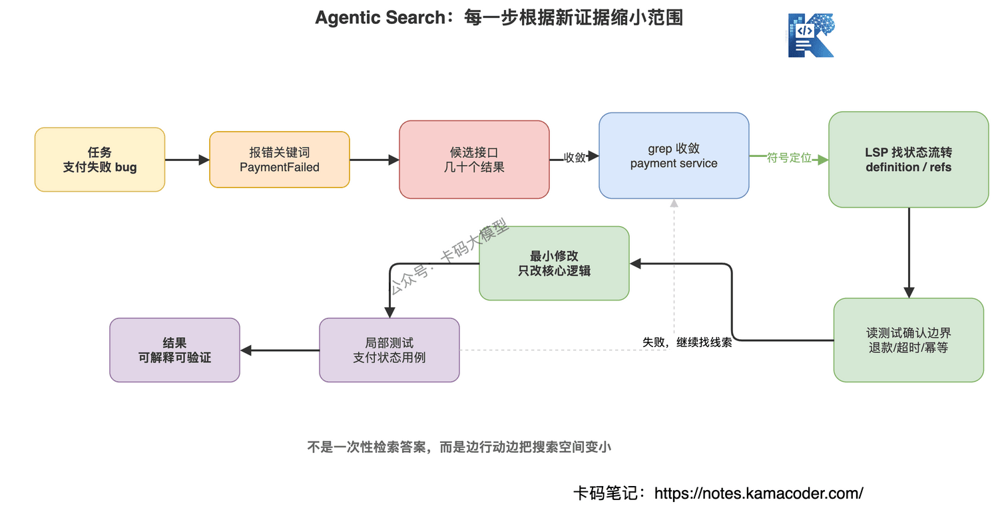
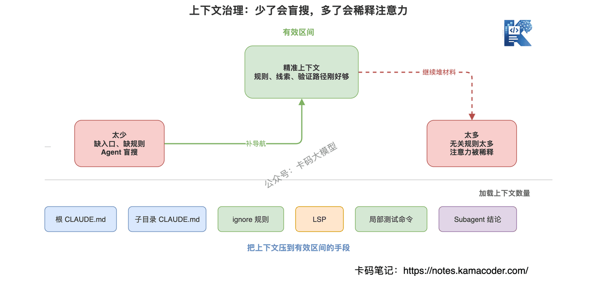
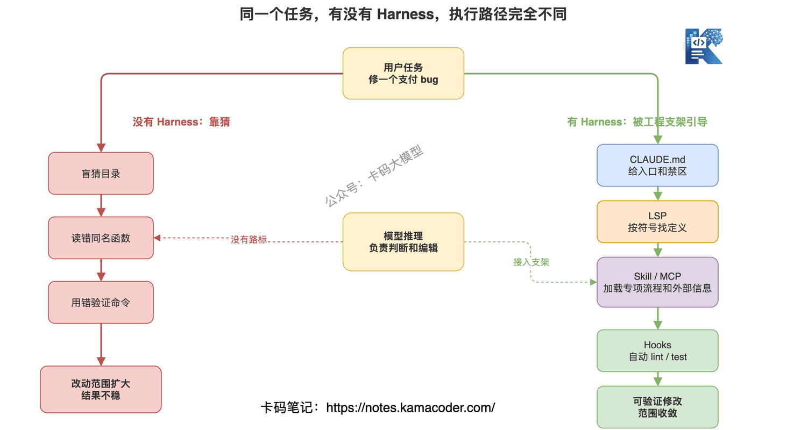
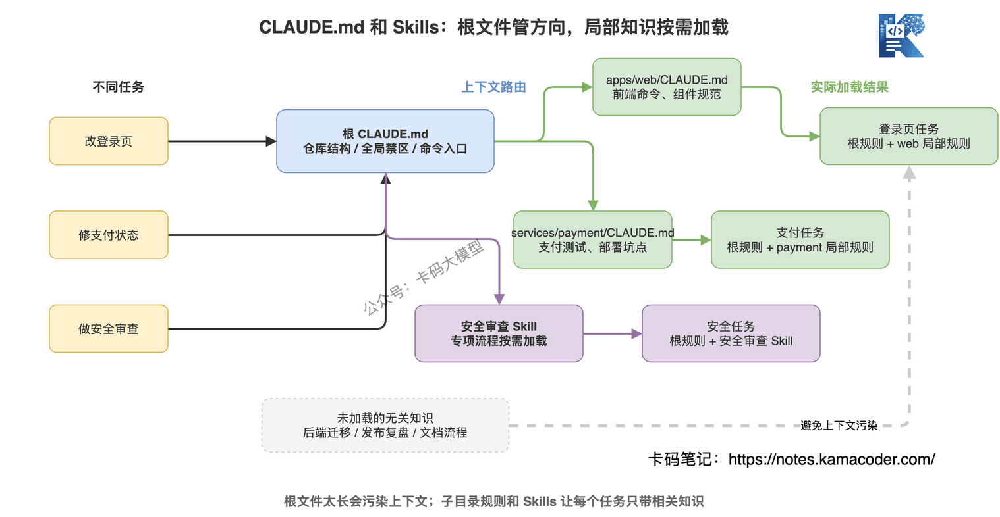
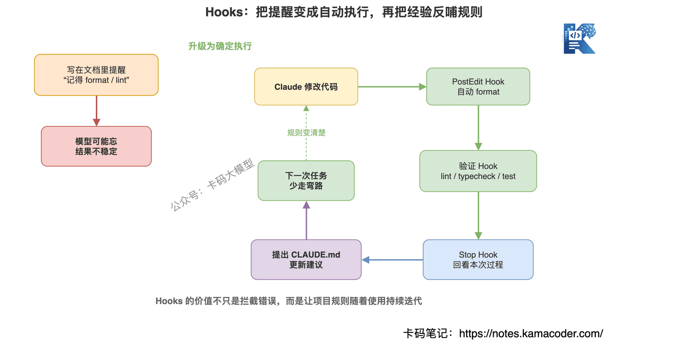
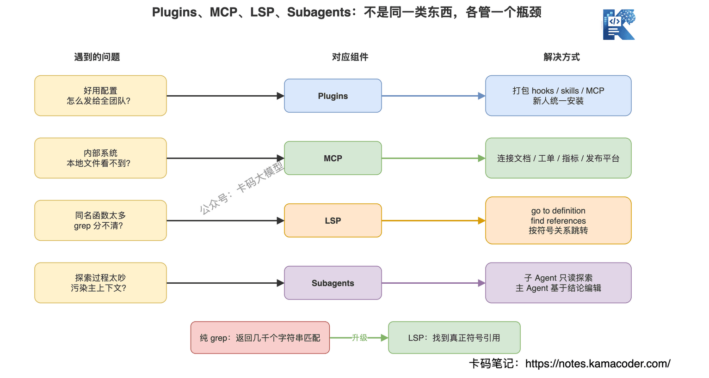
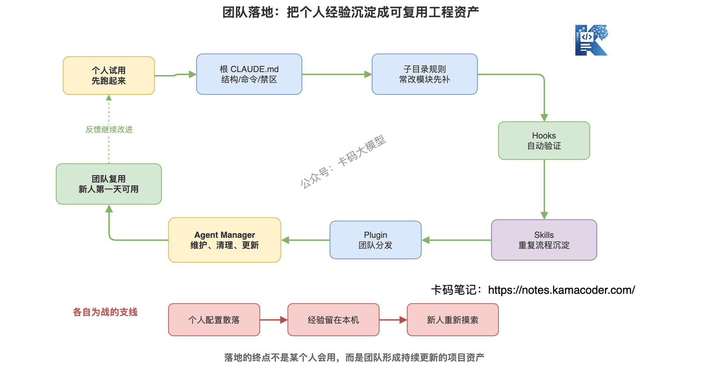

# Як Claude Code розуміє велику кодову базу: агентський пошук, CLAUDE.md, Hooks, Skills, MCP і LSP

Продовжуємо про Claude Code.

Нещодавно ми писали статтю [Як усе-таки писати CLAUDE.md](./claude_md.md) — про те, як осадити для Claude Code команди, стандарти, заборонені зони й процедури перевірки в одному проєкті.

А що коли проєкт великий?

Не маленький репозиторій і не кілька компонентів.

А монорепозиторій на кілька мільйонів рядків, система, успадкована з-перед десятиліття, кілька десятків мікросервісів, де Java, C++, PHP, фронтенд, бекенд і мобільні застосунки перемішані.

Тут у багатьох перша реакція така:

**у такій великій кодовій базі Claude Code, мабуть, спершу має побудувати індекс? Векторизувати весь репозиторій? Без RAG він її не зрозуміє?**

14 травня 2026 року Anthropic опублікувала допис: How Claude Code works in large codebases: Best practices and where to start — https://claude.com/blog/how-claude-code-works-in-large-codebases-best-practices-and-where-to-start

Текст дуже цікавий.

Він не вихваляє параметри моделі й не каже, що «Claude розумніший за всіх».

Він про інше:

**чи працюватиме Claude Code стабільно у великій кодовій базі, залежить не лише від моделі, а й від того, чи проклали ви агентові шлях.**

Модель — двигун.

Але у великій кодовій базі самого двигуна замало.

Потрібні ще мапа, дороговкази, правила руху, інтерфейси інструментів, автоматичні перевірки й механізм підтримки з боку команди.

Цей набір Anthropic називає harness.

Сьогодні на основі того допису розберемо, як Claude Code працює у великій кодовій базі.

## Зміст

1. [Чому велика кодова база не є просто збільшеним малим проєктом](#1-чому-велика-кодова-база-не-є-просто-збільшеним-малим-проєктом)
2. [Claude Code не тримає весь репозиторій в індексі](#2-claude-code-не-тримає-весь-репозиторій-в-індексі)
3. [Агентський пошук шукає і читає як інженер](#3-агентський-пошук-шукає-і-читає-як-інженер)
4. [Головне у великій кодовій базі не бачити більше а влучати точніше](#4-головне-у-великій-кодовій-базі-не-бачити-більше-а-влучати-точніше)
5. [Harness інженерні риштування поза моделлю](#5-harness-інженерні-риштування-поза-моделлю)
6. [CLAUDE.md перший шар навігації у великій кодовій базі](#6-claudemd-перший-шар-навігації-у-великій-кодовій-базі)
7. [Hooks перетворюють нагадування моделі на автоматичне виконання](#7-hooks-перетворюють-нагадування-моделі-на-автоматичне-виконання)
8. [Skills не запихайте всі експертні знання в контекст](#8-skills-не-запихайте-всі-експертні-знання-в-контекст)
9. [Plugins MCP LSP і субагенти за що відповідає кожен](#9-plugins-mcp-lsp-і-субагенти-за-що-відповідає-кожен)
10. [У якому порядку налаштовувати Claude Code для великої кодової бази](#10-у-якому-порядку-налаштовувати-claude-code-для-великої-кодової-бази)
11. [Впровадження в команді навіщо потрібен відповідальний за агентів](#11-впровадження-в-команді-навіщо-потрібен-відповідальний-за-агентів)
12. [З чого почати звичайному розробнику](#12-з-чого-почати-звичайному-розробнику)

## 1. Чому велика кодова база не є просто збільшеним малим проєктом

У маленькому проєкті Claude Code використовувати просто.

Ви просите полагодити баг, він шукає файл, читає кілька компонентів, вносить зміни й проганяє тести.

Шлях короткий, файлів мало, команд теж.

У великій кодовій базі не так.

Там можуть бути такі проблеми:

- у кожної підтеки своя команда збірки;
- фронтенд, бекенд, скрипти й інструменти розгортання в одному репозиторії;
- однойменні функції трапляються десятки разів у різних мовах;
- у старому коді немає єдиної структури тек;
- мікросервіси розкидані по кількох репозиторіях;
- журнал збірки на кілька тисяч рядків;
- повний набір тестів просто не прожене;
- деякі теки містять згенерований код, який читати взагалі не варто.

Це не просто «файлів побільшало».

Це щільність інформації, історичний спадок, командні домовленості й складність ланцюжка інструментів, що навалилися разом.

Тому у великій кодовій базі головна проблема Claude Code не в тому, що він не вміє писати код.

А в тому, що на початку він не знає:

**звідки дивитися, які файли читати, якою командою перевіряти й чого чіпати не можна.**

Якщо все це агент має вгадати сам, він змарнує купу контексту.

А гірше — може вгадати напрямок неправильно.

Тож перший принцип великої кодової бази такий:

**не давайте агентові шукати наосліп по репозиторію.**

Дайте йому точку входу.

## 2. Claude Code не тримає весь репозиторій в індексі

Багато інструментів для програмування з AI люблять говорити про індексацію коду, embedding і RAG.

Логіка природна.

Репозиторій завеликий, у контекст моделі не влазить — отже, поріжмо код на шматки, векторизуймо, побудуймо індекс, а на питання користувача діставаймо релевантні фрагменти.

У багатьох сценаріях цей підхід корисний.

Але допис Anthropic наголошує на ключовій проблемі:

**у великій активній кодовій базі індекс дуже легко застаріває.**

Тисячі інженерів щодня комітять код.

Сьогодні функцію перейменували, завтра модуль переїхав, післязавтра старий сервіс видалили.

Якщо конвеєр індексації не встигає, модель отримує мапу вчорашнього світу.

Вона може дістати функцію, перейменовану два тижні тому, або послатися на модуль, видалений минулого спринту.

Прикро й те, що сам результат пошуку не скаже вам: «я застарів».

Підхід Claude Code інший.

Він поводиться радше як справжній інженер:

- дивиться теки в локальній файловій системі;
- шукає ключові слова через grep;
- читає поточні, найсвіжіші файли;
- іде далі за зв'язками посилань;
- коригує напрямок за тестами й помилками.

Він не вивантажує спершу весь репозиторій у якийсь центральний індекс.

Він працює в живій кодовій базі на машині розробника.

Це й називається agentic search — агентський пошук.

Не «спершу знайдімо відповідь і віддаймо моделі».

А так, щоб агент сам за поточною задачею крок за кроком вирішував, що шукати, що читати й що перевіряти далі.

## 3. Агентський пошук шукає і читає як інженер

Звучить солідно, але по суті це:

**не разовий пошук відповіді, а звуження кола дорогою до дії.**

Скажімо, ви просите Claude Code полагодити збій платежу.

Він не має з порога читати всю платіжну систему.

Розумніший шлях такий:

1. подивитися ключові слова помилки;
2. знайти відповідний інтерфейс через grep;
3. прочитати ключові файли в ланцюжку викликів;
4. знайти логіку переходів стану платежу;
5. подивитися, як це вкрито тестами;
6. змінити мінімальний обсяг коду;
7. прогнати відповідні тести.

Дуже схоже на те, як інженер шукає баг.

Інженер теж не відкриває весь репозиторій і не читає його від першого рядка до останнього.

Він шукає за зачіпками.

Тож перевага Claude Code не в тому, що він «одним махом бачить увесь репозиторій».

Його перевага в тому, що він

**уміє безперервно досліджувати інструментами й перетворювати результат дослідження на наступну дію.**

Але є передумова.

Агентському пошуку потрібна відправна точка.

Якщо ви просто скажете: «оптимізуй цю кодову базу на мільярд рядків», —

не допоможе ніхто.

Claude Code загубиться ще до того, як вичерпає контекстне вікно.

Тому у великій кодовій базі йому треба дати кілька типів навігаційної інформації:

- мапу тек;
- кореневий CLAUDE.md;
- CLAUDE.md у підтеках;
- локальні команди тестування;
- правила ігнорування;
- символьну навігацію через LSP.

Це не прикраси.

Це інфраструктура, завдяки якій агент у великій кодовій базі тримає напрямок.

## 4. Головне у великій кодовій базі не бачити більше а влучати точніше

Почувши про велику кодову базу, багато хто вирішує, що контекстне вікно має бути якнайбільшим.

Велике вікно, звісно, корисне.

Але справжня проблема великої кодової бази не в тому, що «весь код не влазить».

Бо хай яким великим буде вікно, запихати туди весь код однаково не слід.

Справжня проблема така:

**чи зможе Claude Code, прочитавши дуже мало файлів, знайти саме ті кілька, що справді стосуються справи.**

Це як пошук продакшн-бага.

Вам не треба переглядати всі логи.

Вам треба знати, який сервіс, який ендпоїнт, яка конфігурація й яка версія найімовірніше причетні.

Тож у великій кодовій базі потрібне керування контекстом:

- потрібні правила підвантажувати заздалегідь;
- нерелевантні теки не читати;
- згенерований код і артефакти збірки виключати;
- команди тестування звужувати до підтеки;
- однойменні функції розрізняти через LSP;
- широке дослідження віддавати субагентові.

У статті Anthropic є дуже важлива теза:

**забагато контексту знижує продуктивність, замало контексту змушує Claude шукати наосліп.**

Це речення варто занести в командні правила.

Велика кодова база — не про те, щоб Claude Code бачив більше.

А про те, щоб кожен його крок був точнішим.

## 5. Harness інженерні риштування поза моделлю

Оцінюючи Claude Code, багато хто насамперед дивиться на модель.

Sonnet чи Opus?

Яке місце в бенчмарках?

Це, звісно, важливо.

Але допис Anthropic каже прямо:

**результат Claude Code визначається не лише моделлю, а й harness навколо неї.**

Що таке harness?

Простіше кажучи, це інженерні риштування навколо Claude Code:

- `CLAUDE.md`;
- Hooks;
- Skills;
- Plugins;
- сервери MCP;
- LSP;
- субагенти.

Модель відповідає за міркування.

Harness ставить модель у реальне інженерне середовище.

Без harness Claude Code схожий на дуже розумного новачка, якому ніхто не розповів правил проєкту, не дав доступу до інструментів і змусив самому вгадувати команди збірки.

З harness Claude Code стає агентом, під'єднаним до інженерної системи команди.

Далі розберемо кожен складник.

## 6. CLAUDE.md перший шар навігації у великій кодовій базі

`CLAUDE.md` завжди варто робити першим.

Причина проста:

це найстабільніша точка входу в контекст щоразу, коли Claude Code заходить у проєкт.

У великій кодовій базі кореневий `CLAUDE.md` не має перетворюватися на енциклопедію.

Він має бути лаконічним і пошаровим.

Тобто:

**у кореневому файлі — загальна картина й ключові пастки, у файлах підтек — локальні правила.**

Кореневому файлу пасує:

- загальна структура репозиторію;
- за що відповідає кожна тека верхнього рівня;
- глобальні заборонені зони;
- менеджер пакетів;
- глобальні вимоги безпеки;
- входи до важливої документації.

Файлам підтек пасує:

- як запускати цей модуль;
- як його тестувати;
- які тут локальні домовленості;
- які тут типові пастки.

Не запихайте всі деталі в кореневий файл.

Якщо він задовгий, кожна задача тягтиме за собою купу нерелевантних правил.

Скажімо, ви правите лише сторінку логіну на фронтенді, а щоразу підвантажуються правила міграцій бази, інструкції зі збірки мобільного застосунку й історичні проблеми платформи розгортання.

Це і є забруднення контексту.

Тож великій кодовій базі пошаровий `CLAUDE.md` потрібен ще більше.

Це прямо продовжує попередню статтю.

Там ішлося про те, як писати `CLAUDE.md`.

Тут варто наголосити ще раз:

**у великій кодовій базі CLAUDE.md — не просто документ із правилами, а навігаційна система агента.**

## 7. Hooks перетворюють нагадування моделі на автоматичне виконання

Багато команд на початку роботи з Claude Code люблять писати в `CLAUDE.md`:

- після змін у коді не забудь відформатувати;
- перед комітом не забудь прогнати lint;
- не забудь оновити документацію;
- після завершення сесії підсумуй, на які граблі сьогодні наступили.

Чи це корисно?

Корисно, але замало.

Бо написане в документі лишається нагадуванням моделі.

А цінність хуків у тому, що вони

**перетворюють нагадування моделі на гарантоване виконання.**

Візьмімо форматування.

Можна, звісно, написати: «після змін у коді запусти форматувальник».

Але надійніше — щоб хук у потрібний момент запускав форматування автоматично.

Або lint.

Можна покластися на те, що Claude згадає.

Але хук, що сам запускає lint, стабільніший за пам'ять моделі.

У статті Anthropic є ще цікавіше застосування:

хуки не лише перехоплюють помилки, а й дозволяють конфігурації вдосконалюватися самій.

Наприклад, хук на завершенні сесії оглядається на процес:

- чи не пішов Claude сьогодні кружним шляхом?
- чи не через нечіткі правила якоїсь теки це сталося?
- чи не варто записати якусь команду тестування в CLAUDE.md підтеки?

Якщо так, він пропонує оновити `CLAUDE.md`.

Тоді правила проєкту перестають бути написаними раз і назавжди.

Вони ітеративно поліпшуються в міру користування командою.

Саме такої здатності й потребує впровадження програмування з AI у великій команді.

## 8. Skills не запихайте всі експертні знання в контекст

У великій кодовій базі експертних знань багато.

Наприклад:

- як проводити рев'ю безпеки;
- як розгортати платіжний модуль;
- який процес оновлення документації;
- як шукати дані на певній внутрішній платформі;
- як локалізувати проблему за певним типом логів.

Якщо все це записати в `CLAUDE.md`, він вибухне.

До того ж багатьом задачам ці знання й не потрібні.

Ось тут і потрібні скіли.

Ключове в скілах — завантаження на вимогу.

Скіл із рев'ю безпеки підвантажується лише тоді, коли задача цього потребує.

Скіл із обробки документації — лише коли задача стосується документів.

Скіл із розгортання платежів — лише коли задача заходить у платіжну теку.

Це і є progressive disclosure, поступове розкриття, про яке говорить Anthropic.

Або розмовною мовою:

**не кличте одразу всіх експертів у переговорку; кличте того, хто зараз потрібен.**

Інженерно це формулюється так:

**стабільні загальні правила — у CLAUDE.md, спеціалізовані процеси — у скіли.**

Ця межа важлива.

Багато команд перетворюють `CLAUDE.md` на гігантський посібник експерта, і зрештою Claude на кожному старті читає купу непотрібних знань.

Це не підсилення.

Це гальмування.

## 9. Plugins MCP LSP і субагенти за що відповідає кожен

У статті Anthropic згадано ще кілька складників.

Ці слова багатьох спершу плутають.

Пояснімо кожен одним реченням.

**Plugins: роздати вдалу конфігурацію всій команді.**

У команді хтось один налаштував хуки, скіли, MCP.

Якщо це живе лише на його комп'ютері — це особистий досвід.

Якщо запакувати це в плагін, новачок у перший же день отримає ті самі можливості.

Тож плагіни розв'язують задачу поширення.

**MCP: під'єднати Claude Code до внутрішніх інструментів.**

Наприклад, до внутрішньої документації, трекера тікетів, платформи метрик, платформи релізів, структурованого пошуку.

З локальної файлової системи Claude Code цього не бачить.

Сервери MCP перетворюють ці внутрішні можливості на інструменти, які Claude може викликати.

Тож MCP розв'язує задачу під'єднання зовнішніх інструментів.

**LSP: шукати код за символами.**

У великій кодовій базі самого grep часто замало.

Якихось `handle()`, `init()`, `process()` у репозиторії можуть бути тисячі.

Grep повертає купу збігів рядків, і Claude далі читає файли, щоб зрозуміти, який із них справді потрібен.

З LSP інакше.

Він уміє, як IDE, робити go to definition і find references.

Тобто шукати за зв'язками символів, а не за збігом рядків.

Для великих проєктів на C, C++, Java, C# LSP надзвичайно цінний.

**Субагенти: розділити дослідження й редагування.**

У великій кодовій базі дослідження породжує багато шуму.

Читання тек, пошук посилань, перегляд історії, порівняння модулів — усе це з'їдає контекст.

Надійніше дати субагентові спершу зробити дослідження лише для читання, а потім передати висновки головному агентові.

Головний агент уже на основі висновків редагує код.

Так головний контекст не забруднюється процесом дослідження.

Це та сама логіка, що й у розмові про керування контекстом:

**шум дослідження ізолюємо, ключові висновки повертаємо.**

## 10. У якому порядку налаштовувати Claude Code для великої кодової бази

Ось порядок для впровадження.

Не кажу, що всім командам треба робити точнісінько так.

Але більшості цей порядок підійде.

**Крок 1: напишіть кореневий CLAUDE.md.**

Не прагніть досконалості.

Спершу запишіть:

- структуру репозиторію;
- часті команди;
- глобальні заборонені зони;
- входи до ключової документації;
- найпоширеніші пастки.

**Крок 2: додайте CLAUDE.md у підтеки.**

Починайте з тієї теки, яку Claude Code змінює найчастіше.

Наприклад, `apps/web/CLAUDE.md`, `services/payment/CLAUDE.md`.

Головне — команди й правила саме цієї теки.

**Крок 3: налаштуйте ігнорування й права.**

Згенерований код, артефакти збірки, сторонні бібліотеки, велетенські файли знімків — усе це варто виключити.

Не давайте Claude Code марнувати час на сміттєвий контекст.

**Крок 4: під'єднайте хуки.**

Почніть із найдетермінованіших:

- format;
- lint;
- typecheck;
- юніт-тести;
- підсумок наприкінці сесії.

**Крок 5: оформте повторювані експертні процеси у скіли.**

Рев'ю безпеки, оновлення документації, перевірка перед релізом, розбір інцидентів — усе це добре лягає у скіли.

**Крок 6: аж тоді думайте про Plugins, MCP, LSP і субагентів.**

Якщо фундамент не закладено, а ви одразу берете MCP і купу складних плагінів, конфігурація тільки заплутається.

Спершу нехай Claude Code навчиться влучно знаходити й стабільно змінювати в локальному репозиторії.

А вже потім під'єднуйте більше зовнішніх можливостей.

## 11. Впровадження в команді навіщо потрібен відповідальний за агентів

Технічна конфігурація — лише перший крок.

У великій команді найважче в Claude Code — організаційне впровадження.

Якщо кожен інженер налаштовує все сам:

- сам пише CLAUDE.md;
- сам пише хуки;
- сам налаштовує MCP;
- сам збирає прийоми роботи, —

то дуже швидко кожен гратиме у свою гру.

Добрий досвід лишається на особистому комп'ютері.

Набиті ґулі ніхто не осаджує.

А новачок мусить намацувати все наново.

У статті Anthropic згадано роль agent manager.

Можна розуміти її так:

**людина, яка підтримує інженерну систему програмування з AI.**

Це не обов'язково окрема посада.

У маленькій команді досить одного відповідального.

Але він має:

- уніфікувати пошарові домовленості щодо CLAUDE.md;
- вести хуки й політики дозволів;
- підтримувати набір командних скілів;
- добирати й поширювати плагіни;
- керувати межами під'єднання MCP;
- просувати процеси код-рев'ю й безпеки;
- періодично чистити застарілі правила.

У великій компанії ця роль може жити в командах DevEx, продуктивності розробки чи інфраструктури.

Бо по суті вона є частиною інструментів для розробників.

А не особистим хобі окремого розробника.

Anthropic тут каже дуже реалістичну річ:

**використання знизу вгору дає ентузіазм, але без централізованої підтримки знання лишаються у вузькому колі.**

Це впізнавана ситуація: у багатьох компаніях кілька інженерів спершу користуються інструментом нишком.

Той, у кого виходить найкраще, працює дуже ефективно.

Але команда з того користі не має.

Бо метод не стандартизували й не осадили в активи проєкту.

## 12. З чого почати звичайному розробнику

Якщо ви не керівник команди, а звичайний розробник, вам теж є що зробити.

Не кидайтеся одразу будувати MCP, писати плагіни й розгортати цілу платформу.

Почніть із мінімальних дій.

**Перше: напишіть для поточного проєкту кореневий CLAUDE.md.**

Нехай навіть на 20 рядків.

Опишіть структуру проєкту, часті команди й заборони.

**Друге: осадіть туди те, що ви раз у раз нагадуєте Claude Code.**

Будь-яке правило, сказане тричі поспіль, варто записати у файл.

**Третє: додайте CLAUDE.md у теки, які часто правите.**

Часто працюєте з `docs/` — запишіть там правила документації.

Часто правите `services/payment/` — запишіть правила платіжного модуля.

**Четверте: виключіть очевидно нерелевантні файли.**

Згенерований код, артефакти збірки, сторонні залежності — нехай агент туди не лізе.

**П'яте: оформте повторювані процеси у скіл або скрипт.**

Скажімо, перед кожним релізом треба перевірити п'ять речей.

Не нагадуйте про це щоразу вголос.

Осадіть це у повторно вживаний процес.

У великій кодовій базі програмування з AI не зводиться до «взяти сильнішу модель».

Різницю створює інше:

**чи зумієте ви перетворити знання про проєкт, ланцюжок інструментів і командні домовленості на інженерні риштування, якими Claude Code стабільно користується.**

## Наостанок

У великій кодовій базі Claude Code не тримається на тому, що вивчив увесь репозиторій напам'ять.

Він радше схожий на нового колегу, який уміє користуватися інструментами.

Дайте йому зрозумілу структуру тек, локальні правила, команди тестування, символьну навігацію й автоматичні перевірки — і він працюватиме дедалі стабільніше.

Не дасте — і йому лишиться сліпий пошук, здогади й змарнований контекст.

Тож найважливіше речення цієї статті таке:

**у великій кодовій базі Claude Code — це не модель поодинці, а модель разом з інженерними риштуваннями.**

Уміти користуватися Claude Code — лише початок.

По-справжньому впровадити програмування з AI означає вбудувати Claude Code в інженерну систему команди.

## Джерела

- Anthropic Blog: How Claude Code works in large codebases: Best practices and where to start — https://claude.com/blog/how-claude-code-works-in-large-codebases-best-practices-and-where-to-start
- Claude Code Docs: Manage Claude's memory — https://docs.claude.com/en/docs/claude-code/memory
- Claude Code Docs: Hooks — https://docs.claude.com/en/docs/claude-code/hooks
- Claude Code Docs: Skills — https://docs.claude.com/en/docs/claude-code/skills
