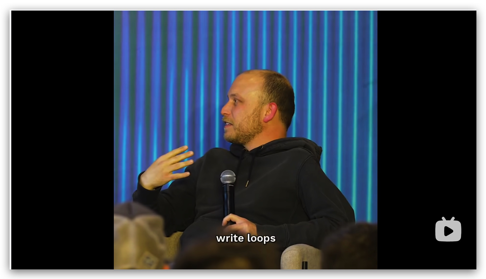
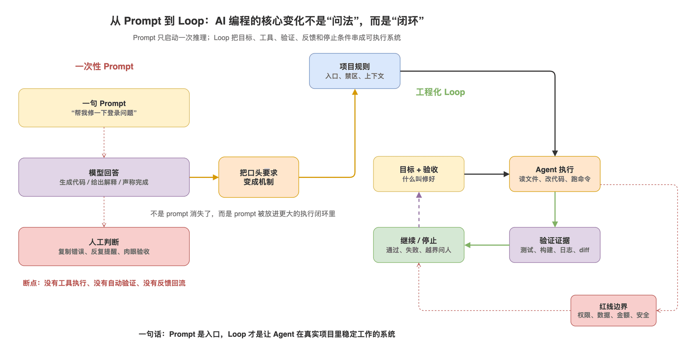
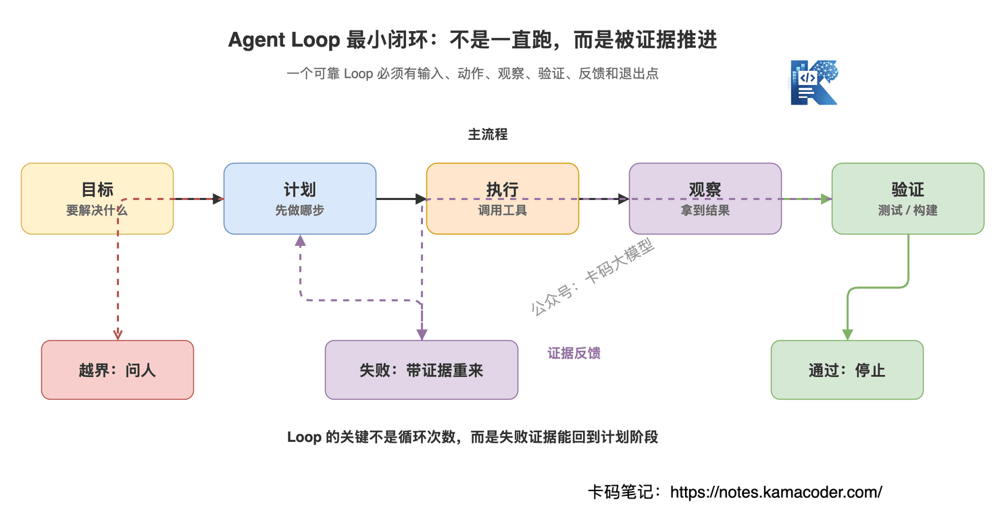
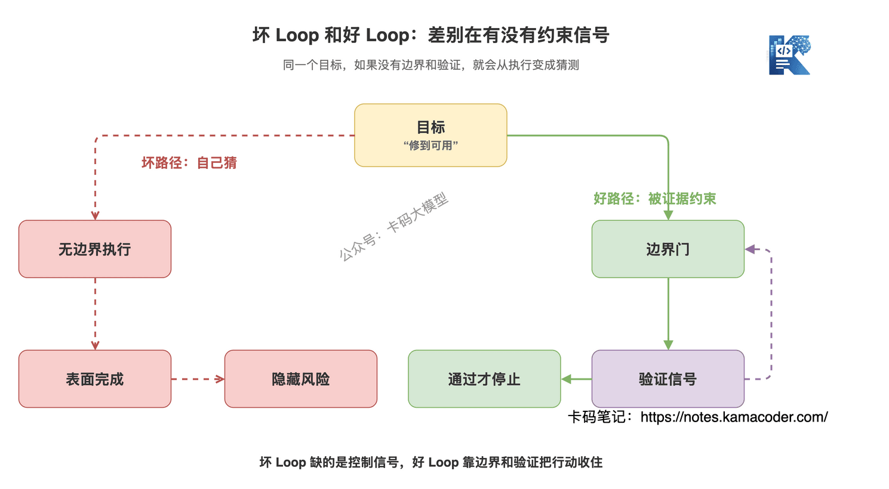
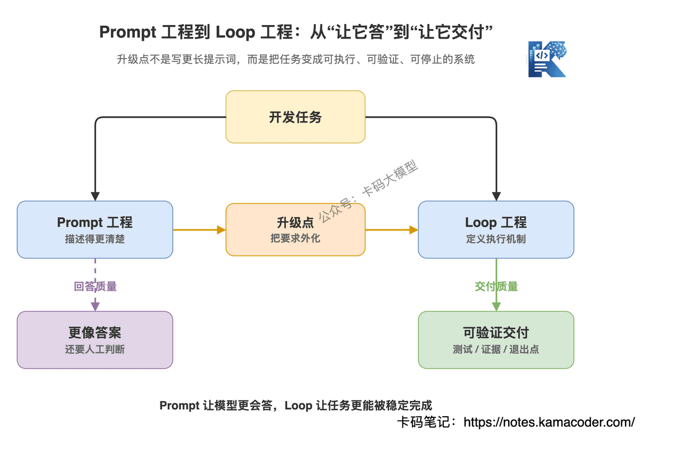
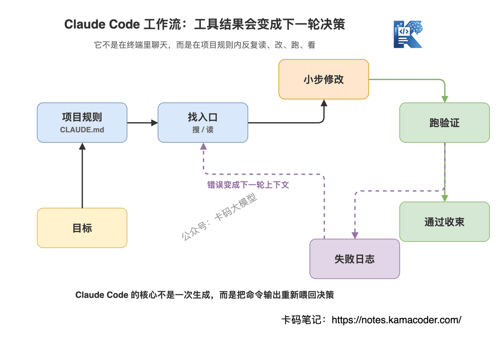
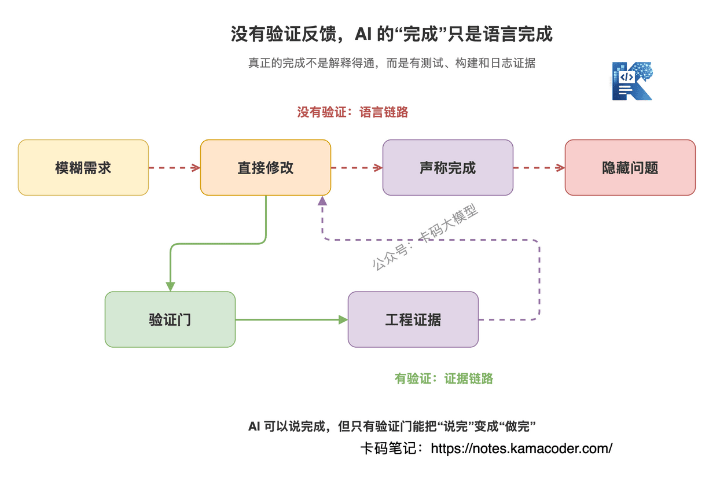
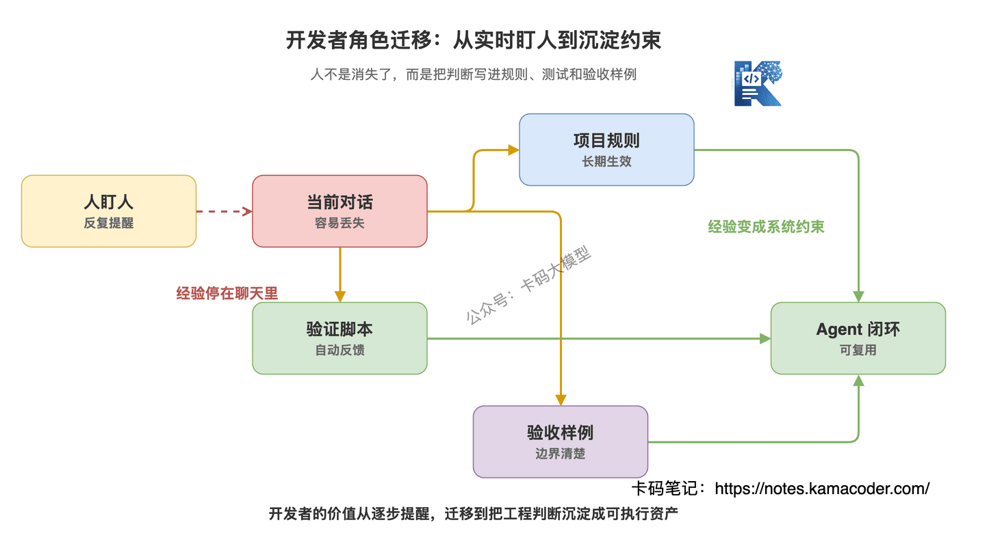
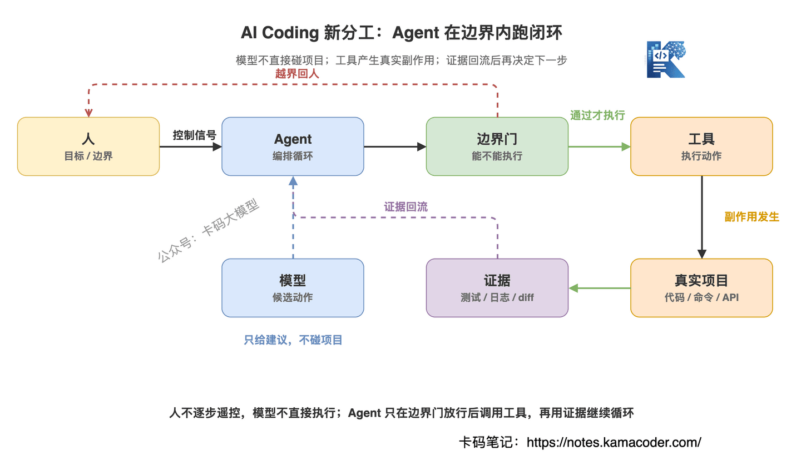

# Автор Claude Code каже «пишіть не промпти, а цикли»: що насправді змінилося в програмуванні з AI

Продовжуємо про Claude Code.

Раніше ми розбирали, [як усе-таки писати CLAUDE.md](./claude_md.md), і те, [як Claude Code розуміє велику кодову базу](./claude_code_large_codebase.md).

Усі ці статті насправді про одне:

**програмування з AI не зводиться до того, щоб узяти сильнішу модель.**

Модель важлива, але досвід визначає те, що навколо неї: ядро агента, система інструментів, пам'ять проєкту, процес перевірки, межі дозволів.

Нещодавно фразу автора Claude Code Бориса Черного взялися обговорювати всюди:

**«Я більше не пишу промптів. Я пишу цикли.»**

Повне відео інтерв'ю легко знайти в мережі.

Раніше багато хто вважав, що ключова навичка програмування з AI — «як написати розумніший промпт».

Тепер стає дедалі очевидніше: **цінність не в одному промпті, а в тому, щоб спроєктувати задачу як цикл, який рухається сам, автоматично перевіряється, виправляється після помилки і вміє вчасно спинитися.**

Про це сьогодні й поговоримо.

## 1. Чому самих промптів уже мало?

Не поспішайте знецінювати промпти.

Промпти, звісно, корисні.

Ви питаєте про якесь поняття — AI його пояснює.

Ви вставляєте шматок коду — AI переписує.

Ви просите згенерувати SQL, регулярний вираз, опис API.

У цих сценаріях промпта досить.

Бо задача коротка, межі зрозумілі, а результат людина легко оцінить.

Але програмування з AI не складається з самих таких дрібниць.

У реальному проєкті, коли ви просите Claude Code полагодити баг, одним реченням це рідко завершується.

Йому треба спершу прочитати код.

Знайти ланцюжок викликів.

Визначити, який файл змінювати, а який чіпати не можна.

Змінити реалізацію.

Прогнати тести.

Тести впали — повернутися до логів.

У логах може відкритися ще одна проблема.

А після виправлення ще й переконатися, що не з'явилося нових побічних ефектів.

І отут стає видно: **промпт — це лише початок задачі, а не механізм її завершення.**

Ви пишете:

«Полагодь проблему з невдалим входом».

Це речення виражає лише мету.

Але не каже:

- де шукати точку входу;
- які файли чіпати не можна;
- як зрозуміти, що полагоджено;
- що робити, коли тест упав;
- коли треба спинитися й запитати людину;
- яка зміна вважається виходом за межі.

Якщо все це модель має вгадати сама, буде дві проблеми.

По-перше, модель змарнує купу контексту на мацання наосліп.

По-друге, модель може виглядати дуже старанною, а насправді дедалі далі йти в хибному напрямку.

Багато хто каже: «AI пише код нестабільно». Причина не в тому, що кожен рядок поганий.

А в тому, що ви дали йому промпт, але не дали циклу, здатного стабільно працювати.

## 2. То що таке цикл?

Цикл — це не езотерика.

І не «хай AI крутиться сам до кінця світу».

Мінімальний цикл агента виглядає приблизно так:

**мета → план → виконання → спостереження → перевірка → зворотний зв'язок → наступний крок**

Перевірка пройдена — зупиняємося.

Перевірка провалена — повертаємо інформацію про невдачу й переплановуємо.

Зачепили межу — ставимо на паузу, рішення ухвалює людина.

Оце і є цикл.

Як бачите, від звичайного промпта це відрізняється сильно.

Звичайний промпт — це радше:

«Я сказав репліку — ти відповів реплікою».

Цикл — це радше:

«Я даю тобі мету, інструменти, правила й критерії приймання, ти рухаєшся сам, але на кожному кроці лишаєш докази».

Саме тому інструменти на кшталт Claude Code так сильно відрізняються від вебчату.

У вебчаті ви здебільшого розмовляєте з моделлю.

У Claude Code модель не лише відповідає.

Вона читає файли, шукає код, змінює файли, запускає команди, дивиться на помилки й виправляє далі.

Оці дії, зшиті разом, і є циклом агента.

Тож коли Борис каже «не пишу промптів, пишу цикли», він не має на увазі, що промптів не пишуть узагалі.

Він має на увазі інше: **не думайте про програмування з AI як про «як мені краще спитати», думайте як про «як мені спроєктувати виконуваний замкнений цикл».**

## 3. Поганий цикл небезпечніший за поганий промпт

Тут доведеться вилити холодної води.

Цикл звучить солідно, але поганий цикл небезпечний.

Найгірше, що зробить поганий промпт, — дасть невдалу відповідь.

Поганий цикл може крутитися й крутитися, змінювати й змінювати, палити токени й зрештою розхитати проєкт.

Багато хто, вперше взявши інструмент з агентом, одразу каже:

«Розберися сам, доки не полагодиш».

Звучить браво.

Але для агента це небезпечна інструкція.

Бо «полагодити» не визначено.

Немає тестів.

Немає критеріїв приймання.

Немає меж дозволів.

Немає умови зупинки.

Отже, він може лише дофантазувати.

А фантазія призводить до біди.

Добрий цикл мусить мати щонайменше чотири речі:

**Перше — чітку мету.**

Не «оптимізуй продуктивність», а «зменш P95 цього ендпоїнта з 800 мс до менш ніж 300 мс, не змінюючи структуру відповіді».

**Друге — виконувані інструменти.**

Не можна змушувати його лише думати.

Він має вміти читати код, ганяти тести, дивитися логи, шукати в документації, викликати скрипти.

**Третє — зворотний зв'язок із перевіркою.**

Результати тестів, лінтера, збірки, відповіді API, різниця в логах — усе це має повертатися в контекст.

**Четверте — умову зупинки.**

Що вважати завершеним?

Що вважати невдачею?

Коли обов'язково спинитися й запитати людину?

Якщо бракує хоч чогось із цих чотирьох, цикл перетворюється на «AI сам вгадує, чи він має рацію».

Це не передовий підхід.

Це небезпечно.

## 4. Інженерія промптів та інженерія циклів — різні речі

Багато хто вчив prompt engineering, де головне — як чітко сформулювати одне речення.

Наприклад:

- задати роль;
- дати контекст;
- задати формат виводу;
- дати приклади;
- дати обмеження.

Чи потрібне це все?

Звісно, потрібне.

Але в сценаріях з агентами це лише перший шар.

Важливіша інженерія циклів.

Її цікавить інше:

- як ділити задачу;
- як інформація потрапляє в контекст;
- як викликаються інструменти;
- як повертається інформація про невдачу;
- як правила зберігаються надовго;
- як автоматизувати приймання;
- як обмежити права;
- як контролювати вартість.

Помічаєте: це вже не «вміння формулювати».

Це радше інженерна спроможність.

Приклад.

Ви просите Claude Code полагодити баг у платіжному колбеку.

Той, хто пише лише промпти, скаже:

«Полагодь те, що платіжний колбек іноді падає, зверни увагу на якість коду».

Занадто розмито.

Той, хто вміє в цикли, поставить задачу так:

«Почни читати з точки входу платіжного колбека, файли міграцій бази не змінюй. Знайшовши причину відмови, викладай план змін. Після змін прожене юніт-тести платіжного модуля; якщо тести падають, виправляй передусім за журналом помилок; якщо зачіпається логіка ідемпотентності чи розрахунок сум, спершу спинися й поясни ризик, базові правила напряму не змінюй».

Тут промпт не барвистіший.

Тут просто вкладено ключові вузли циклу:

- точка входу для пошуку;
- зона заборони змін;
- етап планування;
- зворотний зв'язок від тестів;
- відновлення після помилки;
- точка паузи для високого ризику.

Оце і є різниця.

**Інженерія промптів розв'язує «як модель відповість».**

**Інженерія циклів розв'язує «як задача буде надійно виконана».**

## 5. Чому Claude Code природно пасує циклам?

Цінність Claude Code не в тому, що він переніс модель Claude у термінал.

Якби це був просто чат у терміналі, нічого дивовижного.

Сильне в ньому інше: типові дії програмування з AI зроблено системою, яку можна виконувати циклічно.

Реальний робочий процес Claude Code приблизно такий.

Ви даєте мету.

Він спершу читає правила проєкту, наприклад `CLAUDE.md`.

Далі знаходить точку входу пошуковими інструментами.

Читає відповідні файли.

Формує план змін.

Змінює код.

Запускає команди.

Дивиться на вивід.

Якщо є помилка — бере журнал помилок як новий доказ і виправляє далі.

Якщо тести пройшли — завершує зміни й віддає вам результат.

На вигляд це «AI сам собі працює».

Але якщо розібрати, усередині самі інженерні питання:

Чи точний пошук.

Чи не забруднений контекст.

Чи достатньо зрозумілі значення, що повертають інструменти.

Чи запускаються тестові команди.

Чи правильно використано повідомлення про помилку.

Чи тримають межі дозволів.

Тому я й повторюю: Claude Code — не «розумніший чат».

Це середовище виконання для агента.

Пишучи промпт, ви даєте моделі одне речення.

Пишучи цикл, ви даєте агентові спосіб працювати.

## 6. Програмування з AI без перевірки — це завершеність лише на вигляд

Чим AI найлегше обманює людину?

Не поганим кодом.

А тим, що дуже добре вміє «виглядати завершеним».

Він дасть вам вичерпне пояснення.

Перелічить, які файли змінив.

Скаже, що проблему виправлено.

І навіть обґрунтує це дуже складно.

Але без тестів, збірки, логів і людського приймання його «готово» нічого не означає.

**Відчуття завершеності в AI не дорівнює завершеності в інженерії.**

У реальному проєкті ми судимо про готовність зміни не за красою пояснення.

А за тим:

- чи пройшли юніт-тести;
- чи пройшла збірка;
- чи немає регресій на ключових шляхах;
- чи немає аномалій у логах;
- чи змінилася поведінка користувачів;
- чи покрито граничні умови.

Оце і є «очі» циклу.

Без них агентові лишається сама мовна впевненість.

А мовна впевненість не варта нічого.

Багато хто, роблячи AI-проєкти, зосереджується на шаблонах промптів.

Раджу подивитися інакше:

**спершу спитайте себе, чи є в цієї задачі сигнал зворотного зв'язку.**

Немає сигналу — не пускайте агента в автоматичний цикл.

Він не знає, що таке правильно.

Не знає, що таке неправильно.

І що далі, то езотеричніше все стане.

## 7. Розробника не замінили — змінилося його місце

Почувши «не пиши промптів, пиши цикли», дехто нервує:

то що, розробники більше не писатимуть код, а тільки правила?

Не так просто.

Точніше буде сказати: змінюється місце розробника в роботі.

Раніше ви писали кожен рядок коду власноруч.

Потім почали генерувати код за допомогою AI, але доводилося весь час за ним стежити, нагадувати й копіювати помилки туди-сюди.

А далі ці нескінченні нагадування треба осадити в правила, тести, скрипти, документацію й межі дозволів.

Тобто перетворити «людина пильнує людину» на «система обмежує».

Наприклад, раніше ви повторювали:

«Не чіпай цей файл».

Тепер це має бути записано в правила проєкту або перекрито правами.

Раніше ви щоразу казали:

«Після змін прожене тести».

Тепер тестова команда має стати кроком перевірки за замовчуванням.

Раніше ви пояснювали структуру проєкту в чаті.

Тепер ключові точки входу мають бути в `CLAUDE.md`.

Раніше ви на око визначали, чи правильно він змінив.

Тепер треба дописати тести, скрипти й приклади приймання.

Це не знецінення розробника.

Якраз навпаки.

**Що більше вміє агент, то потрібніша людина з інженерним мисленням, яка визначить, що означає «зроблено правильно».**

Той, хто не вміє програмувати, навряд чи напише добрий цикл.

Бо він не знає, де небезпечно, що треба перевіряти і яка зміна потягне ланцюжок проблем.

Тож не сприймайте цикл як «AI робить усе за мене».

Це радше так:

**розробник виносить власне інженерне судження назовні — у замкнений цикл, який агент може виконувати.**

## 8. То що ж писатимуть розробники надалі?

Якщо раніше розробник писав здебільшого код.

А тепер почав писати промпти.

То далі він дедалі більше писатиме ось це:

- цілі задач;
- правила проєкту;
- тестові випадки;
- критерії приймання;
- інтерфейси інструментів;
- межі дозволів;
- стратегії відновлення після помилок;
- метрики моніторингу й оцінювання.

Усе це разом і є кістяком циклу.

Модель відповідає за генерацію.

Агент — за виконання.

Інструменти — за зв'язок із реальним середовищем.

Тести й логи — за зворотний зв'язок.

Людина — за мету, межі й остаточне судження.

Якщо цей поділ зрозумілий, ви більше не мучитиметеся питанням «як написати магічніший промпт».

Вас почне цікавити інше:

**Чи достатньо чіткі правила в моєму проєкті?**

**Чи має моя задача перевірюваний критерій завершеності?**

**Чи дають мої тести агентові стабільний зворотний зв'язок?**

**Чи зрозумілі моделі значення, які повертають мої інструменти?**

**Чи не дадуть мої межі дозволів агентові наламати дров у продакшні?**

Оці питання і є головними, коли програмування з AI справді входить в інженерну фазу.

## 9. Як звичайному розробнику почати писати цикли?

Якщо ви поки лише вряди-годи просите AI щось написати, ускладнювати одразу не треба.

Почніть із кількох дрібних дій.

**Перше: пишіть не тільки мету, а й приймання.**

Не просто «виправ проблему з логіном».

Додайте:

«Після виправлення прожене тести модуля логіну й скажи, чи відновилися провальні випадки».

**Друге: не змушуйте одразу правити, хай спершу локалізує.**

Не кажіть із порога «просто виправ».

Спершу попросіть:

«Знайди точку входу логіну, проміжне ПЗ автентифікації й місце, де пишуться журнали помилок, перелічи можливі причини — і лише потім змінюй».

**Третє: дайте межі.**

Наприклад:

«Не змінюй схему бази даних».

«Не змінюй структуру відповідей публічного API».

«Не чіпай політику авторизації, доки не поясниш ризик».

**Четверте: те, що повторюєте щоразу, запишіть у правила проєкту.**

Якщо ви щоразу нагадуєте про те саме, перестаньте нагадувати в чаті.

Запишіть у `CLAUDE.md`.

Це і є перший крок від промпта до циклу.

**П'яте: насамперед подбайте про сигнали зворотного зв'язку.**

У проєкті без тестів працювати з агентом дуже виснажливо.

Не те щоб неможливо.

Але ви весь час судитимете вручну.

А щойно з'являться тести, лінтер і скрипт збірки, агентові буде за чим спостерігати — і цикл нарешті закрутиться.

## 10. Наостанок

У фразі Бориса варте уваги не саме «не пишу промптів».

А те, що вона нагадує:

**програмування з AI переходить від умінь вести розмову до інженерного замкненого циклу.**

Промпт — це вхід.

Цикл — це система.

Уміючи лише промпти, ви щонайбільше змусите модель відповідати ближче до бажаного.

Уміючи цикли, ви змусите агента в реальному проєкті постійно рухатися вперед, автоматично перевірятися, виправлятися після помилок і діяти в межах.

Ось у чому різниця.

Найдорожча навичка в програмуванні з AI — не вміння погукати AI на роботу.

А вміння розкласти розмиту задачу на виконуваний, перевірюваний і здатний спинитися замкнений цикл.

Оце і є інженерна спроможність.
