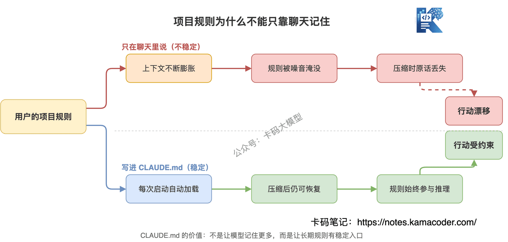
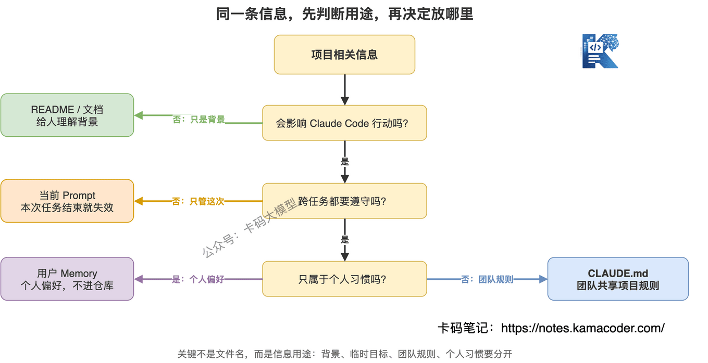
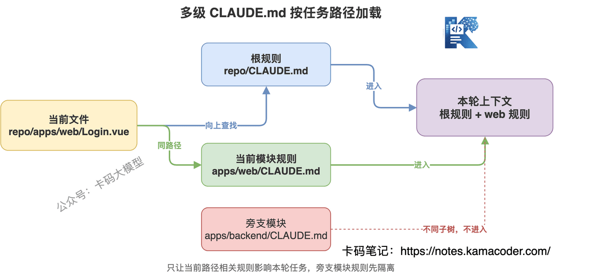
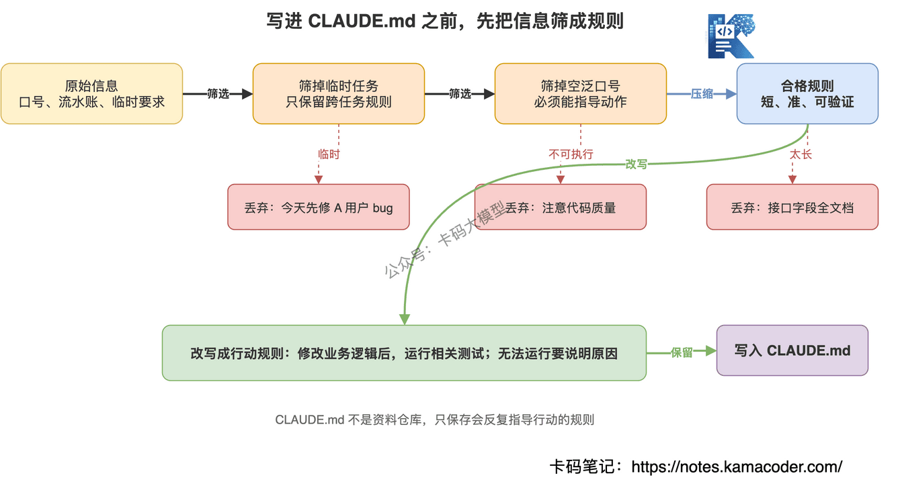
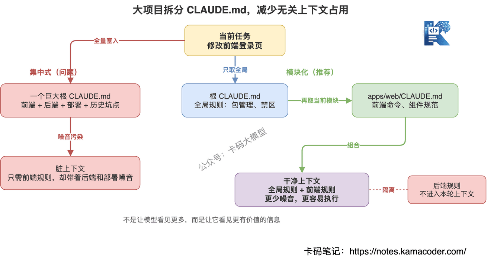

# Як усе-таки писати CLAUDE.md: пам'ять проєкту, командні домовленості й керування контекстом у Claude Code

Сьогодні про файл, який у Claude Code недооцінюють найчастіше: `CLAUDE.md`.

Хто пише код у Claude Code, той стикався з таким.

У першому раунді ви кажете: «У цьому проєкті pnpm, не використовуй npm».

За якийсь час він знову пропонує `npm install`.

Ви кажете: «Не змінюй структуру таблиць бази напряму».

Він править, править — і знову тягнеться до схеми.

Ви кажете: «Після змін прожене юніт-тести».

Він міняє код і збирається завершувати.

Тут багато хто думає: може, модель не слухається?

Не зовсім.

Більша проблема в іншому: **ви поставилися до довгострокових правил проєкту як до тимчасової балачки в чаті.**

Тимчасова балачка витискається контекстом, стискається й дедалі більше розхитується з видовженням задачі.

А правила проєкту не мають щоразу переказуватися вголос.

Саме для цього й потрібен `CLAUDE.md`.

Це не езотеричний промпт і не копія README.

Це радше «інструкція до роботи», яку Claude Code читає, перш ніж узятися за проєкт.

## Зміст

1. [Чому вам доводиться постійно перевиховувати Claude Code](#1-чому-вам-доводиться-постійно-перевиховувати-claude-code)
2. [То що таке CLAUDE.md](#2-то-що-таке-claudemd)
3. [Чим він відрізняється від README промпта та memory](#3-чим-він-відрізняється-від-readme-промпта-та-memory)
4. [Де має лежати CLAUDE.md](#4-де-має-лежати-claudemd)
5. [Що варто туди писати](#5-що-варто-туди-писати)
6. [Чого туди писати не треба](#6-чого-туди-писати-не-треба)
7. [Як писати щоб це справді працювало](#7-як-писати-щоб-це-справді-працювало)
8. [Як ділити CLAUDE.md у великому проєкті](#8-як-ділити-claudemd-у-великому-проєкті)
9. [Як CLAUDE.md впливає на контекстне вікно](#9-як-claudemd-впливає-на-контекстне-вікно)
10. [Готовий шаблон який можна скопіювати](#10-готовий-шаблон-який-можна-скопіювати)
11. [Як підтримувати CLAUDE.md у команді](#11-як-підтримувати-claudemd-у-команді)
12. [Як розповісти про це вміння на співбесіді](#12-як-розповісти-про-це-вміння-на-співбесіді)

## 1. Чому вам доводиться постійно перевиховувати Claude Code

Почнімо з дуже типової ситуації.

Ви відкриваєте старий проєкт і просите Claude Code змінити один ендпоїнт.

Спершу доводиться проговорити цілу купу:

- це проєкт на VuePress 1.x, не пиши як для VuePress 2.x;
- команди треба виконувати в теці `docs/`;
- версії залежностей не чіпай;
- скрипти розгортання не змінюй;
- у зображень у Markdown обов'язково має бути ALT;
- після змін прожене `npm run build`.

Це допомагає?

Допомагає.

Але проблема в тому, що **переказувати це доводиться щоразу, коли починається нова задача.**

А ще прикріше те, що у складній задачі контекст видовжується, і попередні вимоги тонуть у вмісті файлів, виводі команд і журналах помилок.

Вам здається, ніби Claude Code «пам'ятає» ці правила, а насправді він просто поки ще бачить їх у поточному контексті.

Щойно контекст стиснеться, обріжеться або зміниться задача — він може їх забути.

Тож правила проєкту не можна тримати лише на введенні в чат.

Їм потрібна стабільніша точка входу.

Це і є `CLAUDE.md`.

**Сприймайте його як документ передавання справ, написаний для Claude Code.**

Перш ніж новачок увійде в команду, ви розповідаєте йому:

- як запускати проєкт;
- що де лежить;
- чого чіпати не можна;
- де типові пастки;
- які перевірки прогнати перед PR.

З Claude Code так само.

Не варто розраховувати, що він щоразу намацає це сам.

Намацування марнує токени й створює ризики.

## 2. То що таке CLAUDE.md

`CLAUDE.md` — це звичайний файл Markdown.

Claude Code читає його автоматично й додає вміст у контекст проєкту.

Зверніть увагу на кілька моментів.

**По-перше, це звичайний Markdown.**

Не конфігураційний файл, не JSON, не YAML, складного синтаксису не треба.

Пишіть як звичайний документ:

```md
# Про проєкт

- Залежностями керуємо через pnpm
- Команда розробки: pnpm dev
- Команда збірки: pnpm build
- Не змінюй схему бази даних напряму
```

**По-друге, він пишеться для Claude Code.**

README здебільшого для людей, `CLAUDE.md` — здебільшого для агента програмування.

Тож не треба туди бачення продукту, довгих описів бізнесу й культури команди.

Треба інформацію, що безпосередньо впливає на дії Claude Code.

**По-третє, він потрапляє в контекст.**

Це важливо.

`CLAUDE.md` — не документ, що просто гарно лежить збоку.

Прочитавши його, Claude Code бере ці правила до подальших міркувань.

Тож він робить Claude Code стабільнішим, але й займає контекстне вікно.

Звідси принцип:

**CLAUDE.md має бути коротким, точним і виконуваним.**

Що довший, то не краще.



## 3. Чим він відрізняється від README промпта та memory

Часто питають: у мене вже є README — навіщо ще й `CLAUDE.md`?

Це різні речі.

Читач README — людина.

Там зазвичай пишуть:

- опис проєкту;
- перелік можливостей;
- спосіб встановлення;
- документацію користувача;
- правила внесення змін.

Людині ця інформація зручна, а от агентові не обов'язково ефективна.

Бо Claude Code насправді потрібні обмеження дії:

- із якої теки заходити в цю задачу;
- які файли прочитати перед зміною коду;
- якою командою перевіряти;
- яких файлів не чіпати;
- куди дивитися першим ділом за певного типу помилки.

Промпт — інше.

Промпт — це тимчасова вимога поточної задачі.

Скажімо, ви кажете: «Полагодь невдалий логін, але не чіпай бекенд-ендпоїнти».

Цій фразі місце в поточному діалозі.

Бо вона діє лише для цієї задачі.

А в `CLAUDE.md` варто класти правила, стабільні між задачами.

Наприклад:

- у проєкті скрізь TypeScript;
- яка команда тестування;
- шар API живе в `src/api`;
- UI-компоненти не звертаються до ендпоїнтів напряму;
- справжні токени комітити заборонено.

З memory теж треба розібратися.

Пам'ять Claude Code має кілька рівнів: користувацький, проєктний, корпоративний.

`CLAUDE.md` сам по собі є однією з форм пам'яті проєкту.

А от ваші особисті звички, на кшталт «спершу хочу побачити план, а потім зміни коду», краще класти в пам'ять рівня користувача.

Проєктному `CLAUDE.md` пасують саме спільні для команди правила.



Одним реченням:

**README пояснює людині, як розуміти проєкт; промпт каже моделі, що зробити цього разу; CLAUDE.md каже Claude Code, як тут заведено працювати.**

## 4. Де має лежати CLAUDE.md

Тут найлегше заплутатися.

Пам'ять Claude Code живе не в одному місці.

Типових розташувань кілька.

### 1. Рівень користувача: `~/.claude/CLAUDE.md`

Цей файл ваш особистий.

Сюди пасують ваші вподобання, стабільні між проєктами.

Наприклад:

- спершу пояснювати ризики, а вже потім змінювати код;
- надавати перевагу наявним командам проєкту;
- після змін коду за змоги запускати відповідні тести;
- відповідати українською.

Це не належить конкретному проєкту, це ваші робочі звички.

Тож не комітьте цей файл у репозиторій.

### 2. Рівень проєкту: `./CLAUDE.md` або `./.claude/CLAUDE.md`

Це найуживаніше розташування.

Сюди пасують спільні для команди правила проєкту.

Наприклад:

- архітектура проєкту;
- часті команди;
- стиль коду;
- спосіб тестування;
- зона заборонених змін;
- розбір типових проблем.

Цей файл можна класти в Git.

Тоді всі в команді, працюючи з Claude Code, отримують той самий набір правил.

### 3. Рівень підтеки: власний `CLAUDE.md` модуля

У великому репозиторії одного кореневого `CLAUDE.md` часто замало.

Наприклад:

```text
project/
  CLAUDE.md
  frontend/
    CLAUDE.md
  backend/
    CLAUDE.md
  docs/
    CLAUDE.md
```

Правила фронтенду, бекенду й документації різні.

Якщо силоміць зібрати їх в одному кореневому файлі, він дедалі довшатиме, і Claude Code лише гірше вловлюватиме головне.

Краще так: у кореневому файлі — глобальні правила, у файлах підтек — правила модулів.

В офіційній документації теж сказано, що Claude Code шукає пам'ять угору від поточної робочої теки; а `CLAUDE.md` із глибших підтек зазвичай потрапляє в контекст тоді, коли Claude читає файли відповідного піддерева.

Для великого проєкту це дуже корисно.

**Не змушуйте фронтенд-задачу тягати всі деталі бекенду, а задачу з документацією — правила бази даних.**

### 4. Особисті вподобання в проєкті: краще через import

Раніше для особистих вподобань у проєкті іноді використовували `CLAUDE.local.md`.

Але тепер радше рекомендують підключати особистий файл у пам'ять проєкту через import із `@path`.

Наприклад:

```md
# Особисті вподобання

- @~/.claude/my-project-preferences.md
```

Так особисті правила не потрапляють у репозиторій, та й для роботи з кількома worktree це зручніше.

Через `@path` можна підключати й інші документи проєкту.

Наприклад:

```md
Огляд проєкту дивись у @README.md.
Домовленості щодо тестування — у @docs/testing.md.
```

Але й тут треба стриматися.

Не підключайте одразу купу довгих документів.

Послатися на ключовий документ — добре, а зловживання import перетворює контекст на смітник.



## 5. Що варто туди писати

Чи належить якась інформація до `CLAUDE.md`, я визначаю дуже простим критерієм:

**чи впливатиме вона на дії Claude Code раз у раз?**

Якщо так — варто записати.

Якщо це стосується лише поточної задачі — у промпт.

Якщо це фон для людини — у README.

### 1. Часті команди

Це те, що треба записати насамперед.

Наприклад:

```md
## Часті команди

- Встановлення залежностей: pnpm install
- Локальна розробка: pnpm dev
- Юніт-тести: pnpm test
- Перевірка збіркою: pnpm build
```

Команди обов'язково пишіть повністю.

Особливо в монорепозиторіях чи проєктах на кшталт VuePress, де часто треба виконувати команди в конкретній теці.

Наприклад:

```md
- Усі команди виконуються в теці `docs/`.
- Сервер розробки: `cd docs && npm run dev`
- Збірка: `cd docs && npm run build`
```

Це набагато краще, ніж нагадувати щоразу.

### 2. Структура проєкту

Пишіть призначення тек, а не повне дерево файлів.

Наприклад:

```md
## Структура тек

- `src/components/`: загальні UI-компоненти
- `src/pages/`: точки входу сторінок
- `src/api/`: обгортки над ендпоїнтами, компоненти не викликають fetch напряму
- `src/store/`: глобальний стан
- `tests/`: юніт- та інтеграційні тести
```

Так Claude Code менше блукатиме.

### 3. Стандарти коду

Пишіть конкретні правила.

Не так:

```md
- Пиши елегантний код
```

Це нічого не дає.

А так:

```md
- Нові компоненти робимо функційними
- У стилях спершу беремо наявні токени, нових розсипаних кольорів не додаємо
- Помилки API обробляємо єдиною `handleApiError()`
- Логіку запитів у компонентах не пишемо
```

**Що конкретніше, то корисніше.**

### 4. Заборони

Такій інформації в `CLAUDE.md` саме місце.

Наприклад:

```md
## Заборони

- Не змінювати схему бази даних без явного прохання користувача.
- Не оновлювати версії ключових залежностей.
- Не комітити `.env`, токени й ключі.
- Не переписувати історичні файли міграцій.
- Не видаляти вже внесені користувачем зміни.
```

Найстрашніше в програмуванні з AI — не повільність, а зміни там, де чіпати не можна.

Чітко записані заборони запобігають багатьом інцидентам.

### 5. Процедура перевірки

У багатьох проєктах справа не завершується внесенням змін.

Треба чітко написати, яка зміна які перевірки вимагає.

Наприклад:

```md
## Вимоги до перевірки

- Після зміни бізнес-логіки насамперед запускати відповідні юніт-тести.
- Після зміни спільних компонентів запускати тести компонентів і збірку.
- Після зміни залежностей чи конфігурації запускати повну збірку.
- Якщо тести запустити неможливо, зазначити причину в підсумковій відповіді.
```

Так Claude Code більше схожий на надійного колегу.

### 6. Типові пастки

У проєкті є речі, які людина запам'ятовує, наступивши раз.

AI їх не знає.

Тож їх треба записати.

Наприклад:

```md
## Типові пастки

- Плагін для VuePress 1.x має бути `@vuepress/back-to-top`, а не назва плагіна з VuePress 2.x.
- У режимі dev вимкнено стеження за файлами, тож після змін треба вручну оновити сторінку в браузері.
- Для зображень використовуємо адресу з хостингу після завантаження, а не локальні тимчасові файли.
```

У чаті така інформація легко губиться.

А в `CLAUDE.md` вона дуже цінна.



## 6. Чого туди писати не треба

Головна біда `CLAUDE.md` не в тому, що його ніхто не пише.

А в тому, що багато хто пише його дедалі довшим, і зрештою він стає звалищем проєкту.

Наступного туди краще не писати.

### 1. Повну документацію API

Поля, значення, що повертаються, коди помилок — якщо їх багато, це має жити в окремому документі.

У `CLAUDE.md` щонайбільше так:

```md
- Документація API — у `docs/api.md`
- Перед зміною викликів API перевір `src/api/`
```

Не вставляйте туди кілька десятків ендпоїнтів.

### 2. Історичний журнал подій

Наприклад:

```md
- 2025-01-03 полагодили логін
- 2025-02-11 рефакторили головну
- 2025-03-07 обговорювали з продуктом колір кнопки
```

Такі записи зазвичай нічим не допомагають поточним діям.

Якщо якесь історичне рішення важливе, запишіть його як правило:

```md
- Станом автентифікації керує лише `authStore`; не дублюйте зберігання токена в компонентах сторінок.
```

Не хроніку, а висновки.

### 3. Порожні гасла

Наприклад:

```md
- Пиши якісний код
- Зважай на продуктивність
- Тримай архітектуру чистою
```

Виглядає правильно, але дій не спрямовує.

Перепишіть у виконувані правила:

```md
- Якщо на сторінці списку понад 100 записів, використовуй пагінацію, не рендери все одразу.
- Якщо спільну логіку перевикористовують більш ніж дві сторінки, винеси її в `src/hooks/`.
```

### 4. Застарілі правила

Застаріле правило небезпечніше, ніж його відсутність.

Скажімо, проєкт уже перейшов із npm на pnpm, а в `CLAUDE.md` і далі написано npm.

Claude Code слухняно й далі помилятиметься.

Тож `CLAUDE.md` — не «написав і забув».

Його треба оновлювати разом із проєктом.

### 5. Надто дрібні тимчасові задачі

Наприклад:

```md
- Сьогодні спершу полагодити баг з експортом у користувача A
```

Такому не місце в пам'яті проєкту.

Це поточний діалог.

Якщо цей запис лишиться в `CLAUDE.md` після завершення задачі, він лише забруднюватиме наступні.

## 7. Як писати щоб це справді працювало

Раджу запам'ятати три слова:

**коротко, точно, твердо.**

Коротко — не розводити полотна.

Точно — кожен пункт пов'язаний із дією.

Твердо — формулювати як чітке обмеження, а не м'яку пораду.

Наприклад, ось це:

```md
- Постарайся зважати на тести.
```

Надто м'яко.

Перепишімо:

```md
- Після зміни бізнес-логіки обов'язково запускати відповідні тести; якщо запустити неможливо, зазначити причину в підсумковій відповіді.
```

Уже значно краще.

Або ось це:

```md
- Код має відповідати стилю проєкту.
```

Надто розмито.

Перепишімо:

```md
- Нові запити до API мають бути в `src/api/`; компоненти сторінок викликають лише обгорнуті методи API.
```

Оце вже правило, яке Claude Code може виконати.

Добрий `CLAUDE.md` я ділю на 6 частин:

1. що це за проєкт;
2. як запускати команди;
3. як поділено теки;
4. як писати код;
5. чого робити не можна;
6. як перевіряти після змін.

Решту краще не додавати.

**CLAUDE.md пишуть не для того, щоб показати, що ви розумієтеся на AI, а щоб AI менше вгадував.**

## 8. Як ділити CLAUDE.md у великому проєкті

Малому проєкту досить одного кореневого `CLAUDE.md`.

Великий обов'язково треба ділити.

Особливо монорепозиторій.

Скажімо, у проєкті є:

- вебфронтенд;
- бекенд на Node;
- мобільний застосунок;
- сайт документації;
- бібліотека базових компонентів.

Якщо записати всі правила в кореневий `CLAUDE.md`, він неминуче розростеться на десяток екранів.

І Claude Code, роблячи навіть дрібну задачу, щоразу тягтиме купу нерелевантних правил.

Краща структура така:

```text
repo/
  CLAUDE.md
  apps/web/CLAUDE.md
  apps/admin/CLAUDE.md
  packages/ui/CLAUDE.md
  docs/CLAUDE.md
```

У кореневому файлі — глобальні правила:

- менеджер пакетів;
- процес роботи з Git;
- вимоги безпеки;
- глобальні заборони;
- загальний спосіб перевірки.

У файлах модулів — правила модулів:

- за що відповідають теки цього модуля;
- команда запуску модуля;
- команда тестування модуля;
- типові пастки модуля.

Тоді, працюючи з конкретним модулем, Claude Code отримує релевантніший контекст.

Це та сама логіка, що й у розмові про керування контекстом агента:

**не давати моделі бачити більше, а давати їй бачити ціннішу інформацію.**



## 9. Як CLAUDE.md впливає на контекстне вікно

Ось дуже важливий момент.

`CLAUDE.md` зручний, але не безкоштовний.

Він потрапляє в контекст Claude Code.

Контекстне вікно — як робочий стіл.

Поклали на нього правила проєкту — модель їх бачить.

Але поклали забагато — і вивід інструментів, вміст файлів і вимоги користувача витісняються.

Тож не сприймайте `CLAUDE.md` як безмежний нотатник.

В офіційних матеріалах згадано, що Claude Code застосовує до `CLAUDE.md` prompt caching.

Це знижує вартість повторного читання.

Але майте на увазі: **кеш зменшує витрати на тарифікацію, а не звільняє місце в контексті, і аж ніяк не означає, що інформації має бути більше.**

Навіть закешований `CLAUDE.md` на 300 рядків щоразу змушує модель шукати головне серед купи правил.

Звідси дві проблеми.

Перша: важливі правила тонуть.

Друга: нерелевантні правила заважають поточній задачі.

Тому я раджу:

- кореневий `CLAUDE.md` тримати в межах кількох екранів;
- кожне правило описувати по змозі одним рядком;
- довгі документи підключати посиланням або import;
- рідковживані правила виносити у відповідні підтеки;
- періодично видаляти застаріле.

**Мета CLAUDE.md — не бути великим і всеосяжним, а зробити так, щоб Claude Code, увійшовши в проєкт, менше наступав на граблі.**

## 10. Готовий шаблон який можна скопіювати

Цей шаблон можна покласти в корінь проєкту й переробити під себе.

```md
# Як працювати в цьому проєкті

## Огляд проєкту

- Це застосунок XXX, основний стек — XXX.
- Основний код у `src/`, тести в `tests/`.
- Дотримуйся наявного стилю коду, нових архітектурних підходів не вводь.

## Часті команди

- Встановлення залежностей: `pnpm install`
- Локальна розробка: `pnpm dev`
- Юніт-тести: `pnpm test`
- Перевірка збіркою: `pnpm build`

## Структура тек

- `src/components/`: загальні компоненти
- `src/pages/`: точки входу сторінок
- `src/api/`: обгортки над ендпоїнтами
- `src/hooks/`: повторно вживана бізнес-логіка
- `tests/`: тести

## Стандарти коду

- Нові запити до API мають бути в `src/api/`.
- Компоненти сторінок не викликають `fetch` напряму.
- Спільну логіку, яку перевикористовують більш ніж два модулі, виносимо в `src/hooks/`.
- Змінюючи наявну функціональність, зберігай сумісність поточних інтерфейсів.

## Заборони

- Не комітити `.env`, токени й ключі.
- Не оновлювати версії ключових залежностей без явного прохання користувача.
- Не змінювати схему бази даних без явного прохання користувача.
- Не видаляти вже внесені користувачем зміни.

## Вимоги до перевірки

- Після зміни бізнес-логіки запускати відповідні тести.
- Після зміни спільних компонентів запускати перевірку збіркою.
- Якщо тести запустити неможливо, зазначити причину в підсумковій відповіді.

## Типові пастки

- У проєкті використовується pnpm, не npm і не yarn.
- Після зміни файлів конфігурації треба перезапустити сервер розробки.
- Якщо виникла проблема з автентифікацією, спершу перевір `src/api/auth.ts` і `src/store/auth.ts`.
```

Цей шаблон не для того, щоб копіювати його в усі проєкти без змін.

Його цінність — у структурі.

Ваше завдання — замінити кожен пункт на справжнє правило вашого проєкту.

**Вигадані домовленості гірші за їх відсутність.**

## 11. Як підтримувати CLAUDE.md у команді

Якщо команда вже активно програмує з AI, раджу вести `CLAUDE.md` як інженерний актив.

Не дозвольте йому перетворитися на приватну заготовку в чиємусь ноутбуці.

Команда може робити так.

**Перше: кореневий `CLAUDE.md` проєкту — у репозиторій.**

Усі спільні для команди правила мають бути в Git.

Наприклад, команди збірки, призначення тек, стандарти коду, заборони.

**Друге: особисті вподобання — у пам'ять рівня користувача.**

Скажімо, ви любите відповіді українською, спершу план, короткі підсумки.

Це не має забруднювати командний файл проєкту.

**Третє: зміни правил проходять рев'ю, як код.**

Особливо заборони, команди тестування й архітектурні правила.

Вони прямо впливають на дії AI.

Помилилися — і ви автоматизували хибний процес.

**Четверте: наступили на граблі — одразу осадіть це.**

Якщо Claude Code раз у раз помиляється через якусь пастку проєкту, не лайте його в чаті.

Запишіть пастку в `CLAUDE.md`.

Наприклад:

```md
- Суми в платіжному модулі вимірюються в копійках, а не в гривнях.
```

Одне таке речення може запобігти багатьом помилкам.

**П'яте: регулярно видаляйте.**

`CLAUDE.md` не тільки поповнюють.

Час від часу переглядайте:

- чи немає застарілих команд;
- чи немає тек, яких уже не існує;
- чи немає повторюваних правил;
- чи не лишилися тимчасові задачі.

Що коротше й точніше, то корисніше.

## 12. Як розповісти про це вміння на співбесіді

Багато хто вважає, що вміти Claude Code означає вміти змусити його писати код.

Насправді вищий рівень — це вміння перетворити програмування з AI на стабільний процес.

`CLAUDE.md` — гарний приклад.

Якщо інтерв'юер спитає: «Як ви робите інструменти програмування з AI стабільнішими?» —

можна відповісти так:

«Я не керую правилами проєкту самими лише тимчасовими промптами. Стабільну між задачами інформацію — архітектуру проєкту, часті команди, спосіб тестування, стиль коду, зону заборонених змін — я осаджую в `CLAUDE.md`. Тоді Claude Code читає ці правила щоразу, коли заходить у проєкт: менше повторних пояснень і менше втрати обмежень після стиснення контексту.

Але я не перетворюю `CLAUDE.md` на звалище. Він потрапляє в контекст, і якщо він задовгий, увага розмивається. Тому я ділю правила на глобальні й модульні: у корені — загальні обмеження, у підтеках — деталі модулів; тимчасові задачі — у промпт, особисті вподобання — у пам'ять рівня користувача, командні правила — у проєктний `CLAUDE.md`. Головна мета — не щоб модель бачила більше, а щоб вона бачила стабільнішу й дієвішу інформацію».

Така відповідь — це вже не «я вмію користуватися інструментом».

Вона показує, що ви розумієте інженерну проблему за програмуванням з AI.

## Наостанок

`CLAUDE.md` — не магія.

Він не перетворить Claude Code миттєво на старожила, що знає всі бізнес-процеси вашої компанії.

Але він розв'язує дуже практичну проблему:

**не змушуйте AI щоразу вгадувати проєкт із нуля.**

Як запускати проєкт, як писати код, чого не чіпати, як перевіряти після змін — що раніше ці правила осаджено, то більше Claude Code схожий на надійного напарника.

Тільки не перетворюйте `CLAUDE.md` на енциклопедію.

Пишіть лише ті правила, що впливають на дії раз у раз.

Коротше, точніше, твердіше.

Цього досить.

## Джерела

- Claude Code Docs: Manage Claude's memory — https://docs.claude.com/en/docs/claude-code/memory
- Claude Help Center: Give Claude context: CLAUDE.md and better prompts — https://support.claude.com/en/articles/14553240-give-claude-context-claude-md-and-better-prompts
- Claude Help Center: Claude Code cheatsheet — https://support.claude.com/en/articles/14553413-claude-code-cheatsheet
