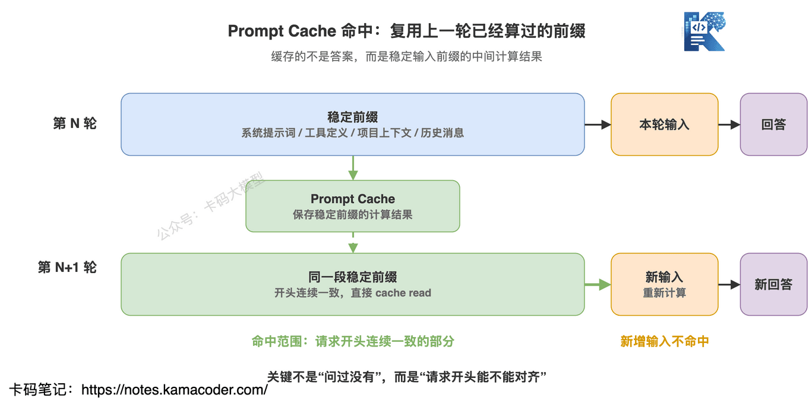
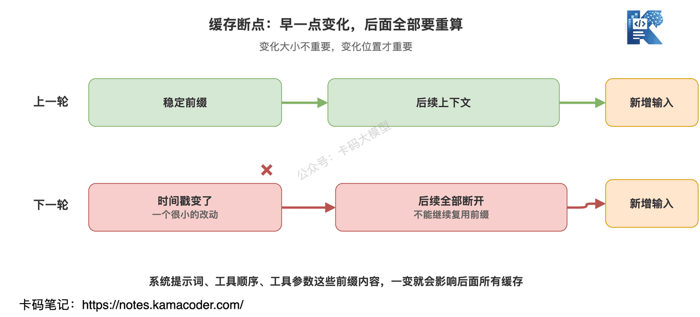
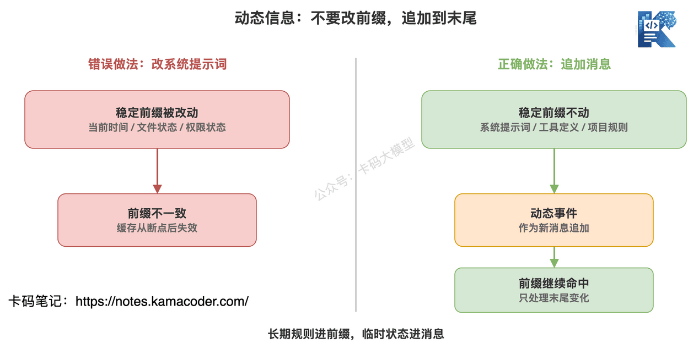
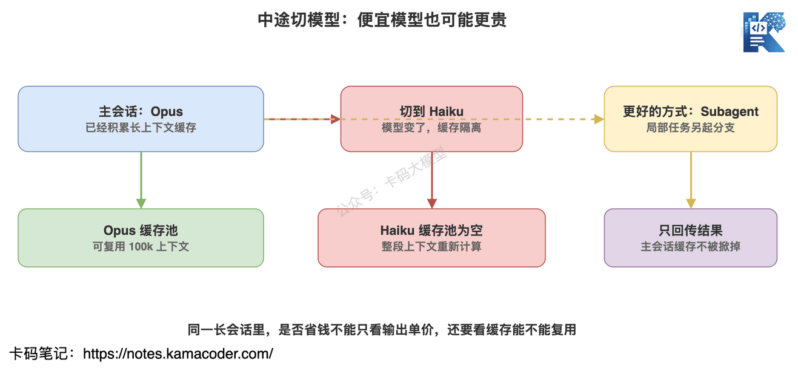
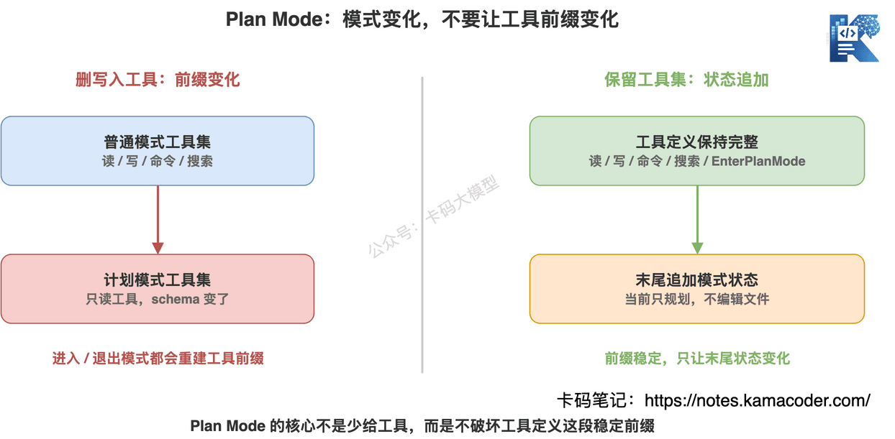
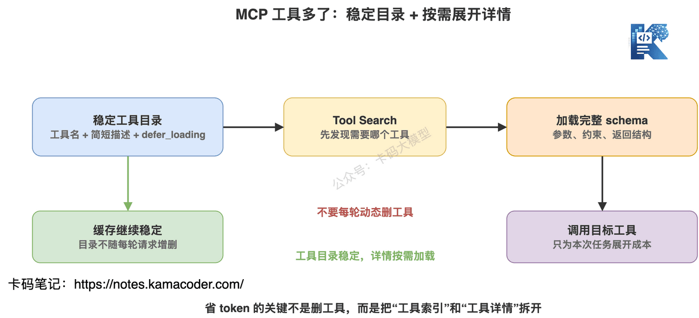
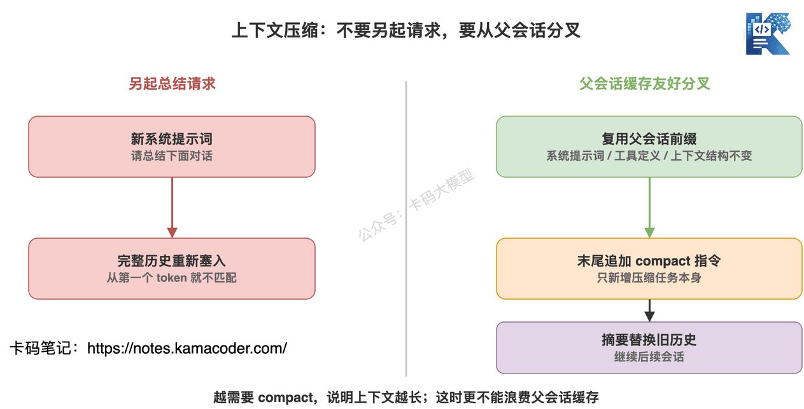
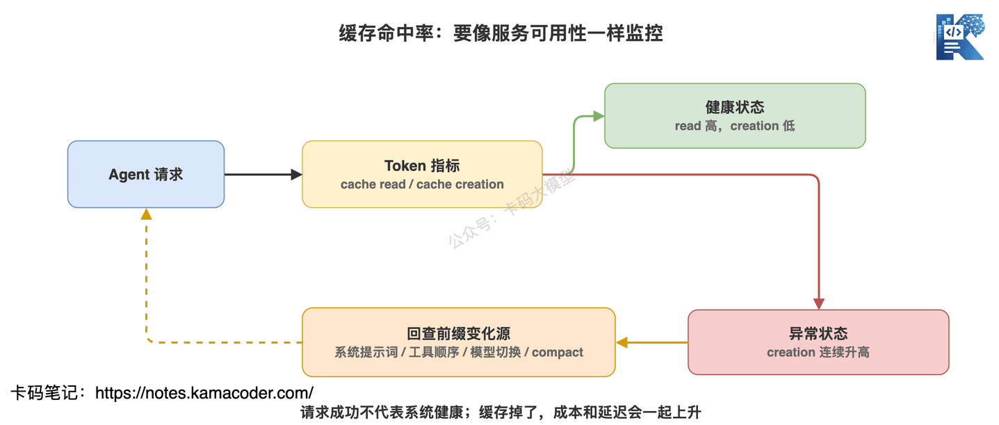

# Чому Claude Code швидкий: Prompt Cache, режим планування, завантаження інструментів MCP і стиснення контексту

Продовжуємо про Claude Code.

Раніше в нас було дві статті.

[Як усе-таки писати CLAUDE.md](./claude_md.md) — про те, як осадити правила проєкту, командні домовленості й керування контекстом.

[Як Claude Code розуміє велику кодову базу](./claude_code_large_codebase.md) — про те, як у великому репозиторії Claude Code тримається на інженерних риштуваннях: агентському пошуку, хуках, скілах, MCP і LSP.

Сьогодні копаємо ще на шар нижче.

30 квітня 2026 року Anthropic опублікувала допис «Lessons from building Claude Code: Prompt caching is everything»: https://claude.com/blog/lessons-from-building-claude-code-prompt-caching-is-everything

За заголовком здається, ніби йдеться про «оптимізацію кешу».

Але якщо так це й прочитати, буде поверхово.

Насправді допис про інше:

**довготривалий агентний продукт не може вважати Prompt Cache пізньою оптимізацією — його треба проєктувати навколо кешу з першого дня.**

Чому Claude Code в одній довгій сесії може знову й знову читати код, викликати інструменти й запускати команди, не стаючи щораунду безумно повільним і безумно дорогим?

Основа — Prompt Cache.

Не в звичайному сенсі «збережімо результат».

А в сенсі «збережімо ту стабільну частину префікса, яка не змінюється між запитами, щоб наступний запит не переобчислював увесь цей масив контексту».

Звучить просто.

Але найцінніше в дописі Anthropic те, що там сформульовано кілька контрінтуїтивних інженерних висновків:

- системний промпт не можна чіпати як заманеться;
- визначення інструментів не можна довільно додавати й прибирати;
- режим планування не можна реалізовувати підміною набору інструментів;
- коли інструментів MCP багато, економити токени динамічним вилученням інструментів не можна;
- перемикання моделі посеред сесії може вийти дорожчим;
- стиснення контексту теж має перевикористовувати кеш батьківської сесії.

Це не дрібниці.

**Саме це вирішує, чи буде агентний продукт «придатним для демонстрації», чи «придатним для тривалого використання».**

## 1. Спершу з'ясуймо: Prompt Cache кешує не відповіді

Багато хто, почувши «кеш», одразу думає:

це коли на вже поставлене питання наступного разу просто віддають готову відповідь?

Ні.

Prompt Cache кешує не відповідь моделі.

Він кешує проміжні обчислення, які модель робить, опрацьовуючи вхідний контекст.

Уявіть собі так.

У кожному раунді взаємодії з моделлю Claude Code надсилає не лише щойно введену вами фразу.

Він щоразу надсилає весь набір:

- системний промпт;
- визначення інструментів;
- правила проєкту з CLAUDE.md;
- поточний контекст проєкту;
- усі попередні повідомлення розмови;
- результати викликів інструментів;
- ваш новий ввід у цьому раунді.

Сама модель між двома запитами до API не «пам'ятає», на чому ви спинилися.

Тому кожен раунд мусить нести повний контекст.

Без кешу довга сесія що далі, то дорожча й повільніша.

Саме тому багато агентних демо спершу виглядають плавними, а трохи згодом починають гальмувати.

Вони не подурнішали раптово.

Просто контекст видовжився, і щоразу все рахується наново.

Prompt Cache розв'язує саме це:

**те, що вже пораховано й у наступному раунді буде точнісінько таким самим, рахувати вдруге не треба.**

Але тут є ключове обмеження.

Механізм спирається на збіг за префіксом.

Не «цей фрагмент приблизно такий самий».

І не «цей файл уже колись читали».

А так: від самого початку запиту неперервний відрізок вмісту має бути ідентичним — лише тоді буде влучання в кеш.

Тому Claude Code організовує запит дуже ретельно:

Шар перший — статичний системний промпт і визначення інструментів.

Ця частина має бути глобально стабільною, щоб перевикористовуватися в різних проєктах.

Шар другий — CLAUDE.md і контекст проєкту.

Ця частина стабільна в межах одного проєкту.

Шар третій — контекст сесії.

Ця частина стабільна в межах однієї сесії.

Шар четвертий — повідомлення розмови й результати інструментів.

Ця частина росте разом із діалогом.

Шар п'ятий — новий ввід цього раунду.

Щораунду змінюється лише невеличкий шматок у кінці.

Так більшість переднього вмісту влучає в кеш.

**Статичне — попереду, динамічне — позаду.**

Це найпростіший і водночас найчастіше проґавлений принцип кешування в агентних продуктах.

## 2. Чому навіть «дрібна зміна» рве кеш?

Ось найконтрінтуїтивніше в Prompt Cache.

Багато хто думає:

я ж лише підправив час у системному промпті.

Я лише змінив порядок інструментів.

Я лише оновив параметр одного інструмента.

Нічого ж страшного?

Страшне.

Бо це змінює префікс.

А щойно префікс змінився, подальший кеш уже не підхоплюється.

В оригіналі Anthropic згадує, що й сама наступала на ці граблі: детальні часові позначки в статичному системному промпті, недетермінований порядок визначень інструментів, оновлення параметрів інструмента.

Усі ці зміни виглядають дрібними.

Але з погляду кешу це забруднення префікса.

Це те саме, що змінити ключ кешу збірки у великому проєкті.

Ви ніби змінили один рядок конфігурації.

Але система кешу бачить:

стало інакше.

Отже, збираємо наново.

З агентом так само.

Якщо системний промпт щораунду несе поточну дату, а порядок визначень інструментів нестабільний, частка влучань у кеш виглядатиме сумно.

Тож, роблячи агента, треба питати не лише:

чи допомагає цей шматок промпта моделі?

А ще й:

**чи має цей вміст узагалі бути в стабільному префіксі?**

Якщо він змінюється щораунду — не кладіть його попереду.

Кладіть у повідомлення.

## 3. Динамічну інформацію кладіть у повідомлення, а не в системний промпт

Під час роботи агента динамічної інформації справді буває багато.

Наприклад:

- змінився поточний час;
- користувач змінив файл;
- змінився стан дозволів;
- увімкнено певний режим роботи;
- про якийсь результат інструмента треба нагадати моделі.

Інтуїтивно хочеться оновити системний промпт.

Наприклад, написати туди «поточна дата — 28 травня 2026 року».

Або, коли користувач змінив файл, оновити контекст проєкту записом «файл такий-то змінено».

Функціонально це працює.

Але для кешу це погано.

Бо і системний промпт, і контекст проєкту стоять попереду.

Щойно ви їх змінили — усе після них обривається.

Claude Code робить розумніше:

**динамічну інформацію додають наступним повідомленням, а не правкою стабільного префікса попереду.**

Скажімо, про зміну файлу можна додати системне нагадування в наступному повідомленні користувача чи в результаті інструмента: цей файл змінився, за потреби перечитай його.

Перевага така:

системний промпт, визначення інструментів і CLAUDE.md лишаються недоторканими.

У кінці просто з'явилося ще одне повідомлення.

І кеш далі влучає.

Саме тому, говорячи про CLAUDE.md, ми наполегливо повторювали:

у CLAUDE.md варто класти довгострокові стабільні правила.

Не треба запихати туди разові задачі, тимчасові стани й поточний прогрес.

**Довгострокові правила — у CLAUDE.md, тимчасові зміни — у повідомлення.**

Цей поділ потрібен не лише для чистоти контексту.

А й для стабільності кешу.

## 4. Не перемикайте модель посеред сесії — може вийти дорожче

Це теж контрінтуїтивно.

Багато хто міркує так:

складне питання — сильна модель.

Просте — перемкнімося на дешевшу.

Звучить розумно.

Але в довгій сесії це не обов'язково економія.

Бо Prompt Cache ізольований за моделями.

Ви наговорили в Opus 100 тис. токенів, і контекст уже закешовано.

Тут вам здається, що наступне питання просте, і ви перемикаєтеся на Haiku.

За ціною одного виводу Haiku дешевший.

Але в Haiku немає кешу від Opus.

Йому доведеться опрацювати весь контекст наново.

І виходить незручна ситуація:

**заради економії на виводі ви платите велику суму за некешований вхід.**

Тому порада Anthropic така: не міняйте моделі довільно в межах однієї довгої сесії.

Якщо змінити модель справді треба, краще зробити це через субагента.

Головна сесія лишається зі своєю моделлю і своїм кешем.

Субагент іншою моделлю розв'язує локальну задачу.

А потім повертає результат у головну сесію.

Це, по суті, повернення до того самого принципу:

**не руйнуйте стабільний префікс головної сесії.**

Головна сесія — стовбур.

Субагент — гілка.

Гілка може почати власний кеш.

Але не змушуйте стовбур зривати весь свій кеш заради дрібної задачі.

## 5. Чому режим планування не можна зробити «вилученням інструментів запису»?

Режим планування в Claude Code, певно, вам знайомий.

Увійшовши в нього, Claude Code спершу читає код, аналізує проблему й видає план, а файлів напряму не змінює.

Якби ви самі проєктували цю функцію, перша думка була б така:

у режимі планування лишаємо лише інструменти читання.

Інструменти редагування, запису файлів і виконання небезпечних команд прибираємо.

Звучить безпечно.

Але це ламає кеш.

Бо визначення інструментів — частина префікса.

Увійшли в режим планування — підмінили набір інструментів.

Вийшли — підмінили назад.

Кожне перемикання режиму чіпає префікс.

Дуже збитково.

Рішення Claude Code цікавіше.

Режим планування виражається не підміною набору інструментів.

Повний набір інструментів лишається завжди.

А EnterPlanMode і ExitPlanMode теж зроблено інструментами.

Коли користувач входить у режим планування, система дописує пояснення в кінець повідомлень:

зараз діє режим планування, треба досліджувати кодову базу, файли не редагувати, а після складання плану викликати вихід із режиму планування.

Зверніть увагу на головне:

визначення інструментів не змінилися.

Зміна сталася в кінці діалогу.

Тож префікс кешу далі влучає.

Оце й різниця між інженерним продуктом і звичайним демо.

Демо зазвичай цікавить лише «чи вдасться реалізувати функцію».

А такий продукт, як Claude Code, цікавить ще й:

**чи не зробить ця функція кожне перемикання режиму дорожчим і повільнішим?**

І ще краще те, що, оскільки EnterPlanMode сам є інструментом, модель може й самостійно вирішити ввійти в режим планування, натрапивши на складну задачу.

Функціональність гнучкіша.

А кеш не зруйновано.

## 6. Коли інструментів MCP багато, не можна щораунду динамічно їх прибирати

Зараз, роблячи агента, дуже легко підключити купу MCP.

GitHub — один.

База даних — один.

Браузер — один.

Файлова система — один.

Плюс кілька внутрішніх платформ.

Інструментів дедалі більше.

І виникає проблема:

надсилати моделі щозапиту повні схеми кількох десятків інструментів надто дорого.

Що робити?

Перша думка в багатьох така:

інструменти, не потрібні цього раунду, просто приберімо.

Скажімо, цього разу треба лише прочитати файл — то інструменти бази й браузера не надсилаємо.

Здається, це економія токенів.

Але це знову замінована зона кешу.

Бо набір інструментів змінився.

Порядок визначень інструментів змінився.

Отже, змінився і префікс кешу.

Тож підхід Claude Code — не «динамічно прибирати інструменти», а «відкладено завантажувати їхні деталі».

У стабільному префіксі можна тримати легкі заглушки.

Тобто назву інструмента, трохи метаінформації й позначку на кшталт defer_loading.

Повна схема інструмента туди не потрапляє.

Коли модель справді потребує певного інструмента, вона знаходить його через пошук інструментів і підвантажує повну схему.

Із цього дві переваги.

По-перше, стабільний префікс не змінюється від того, що інструменти то додають, то прибирають.

По-друге, повні визначення рідковживаних інструментів не з'їдають токени щораунду.

Отже, суть керування інструментами MCP не в питанні:

чи давати моделі цей інструмент саме цього раунду?

А в питанні:

**яка інформація про інструменти мусить бути присутня стабільно, а які деталі можна розгортати на вимогу?**

Цей підхід важливий і для власних агентів.

Не запихайте одразу в промпт усі можливості системи, всю документацію API й усі параметри інструментів.

Спершу дайте каталог інструментів.

А деталі розгортайте, коли знадобляться.

## 7. Стиснення контексту — це не окремий запит на підсумок

У довгій сесії рано чи пізно забракне контекстного вікна.

У Claude Code це зазвичай розв'язують через compact: попередній діалог зводять у підсумок, замінюють ним довгу історію й працюють далі.

Виглядає просто.

Але з погляду кешу тут теж є пастка.

Найочевидніший підхід такий:

надіслати моделі окремий запит.

У системному промпті написати «зроби підсумок цього діалогу».

Без інструментів.

Запхати повну історію.

Отримати підсумок.

Це, звісно, працює.

Але дорого.

Бо системний промпт, визначення інструментів і структура контексту цього запиту на підсумок геть інші, ніж у батьківської сесії.

Розбіжність починається з першого ж токена.

Увесь кеш, накопичений батьківською сесією, стає непотрібним.

Гірше того:

що нагальніша потреба в compact, то довший діалог.

А що довший діалог, то дорожчий окремий запит на підсумок.

Класичне «що серйозніша проблема, то дорожче її розв'язувати».

Claude Code робить розгалуження, дружнє до кешу.

Під час стиснення використовуються той самий системний промпт, той самий контекст користувача, той самий системний контекст і ті самі визначення інструментів, що й у батьківській сесії.

Спершу беруться повідомлення батьківської сесії.

А в кінець дописується інструкція стиснення.

З погляду API цей запит дуже схожий на попередній запит батьківської сесії.

Великий передній префікс той самий.

Новою є лише інструкція стиснення в кінці.

Так кеш батьківської сесії перевикористовується.

Звісно, з цього випливає ще одна інженерна вимога:

система мусить тримати буфер під стиснення.

Не можна чекати, доки контекстне вікно справді забʼється, і аж тоді думати: «а давайте тепер підсумуємо».

На той момент уже не лишиться місця ні під інструкцію стиснення, ні під вивід підсумку.

Тому зрілі агентні продукти лишають compact-буфер, ще поки контекст не заповнено вщент.

Для власних агентів це так само важливо.

Не сприймайте compact як реанімацію в останню мить.

Це має бути частиною керування життєвим циклом контексту.

## 8. Частку влучань у кеш треба моніторити, як доступність сервісу

В оригіналі є деталь, варта уваги:

команда Claude Code моніторить частку влучань у Prompt Cache.

Якщо вона надто низька, спрацьовує алерт, а іноді це й трактують як інцидент.

Таке ставлення багато що каже.

Багато команд, роблячи застосунки на великих моделях, моніторять лише:

- QPS;
- затримку;
- частку помилок;
- витрату токенів;
- вартість одного запиту.

На це, звісно, треба дивитися.

Але з агентом треба дивитися ще й на кеш.

Особливо в агентах із довгими сесіями.

Щойно частка влучань падає, погіршуються водночас і затримка, і вартість.

Користувач це відчуває так:

чому раптом стало повільно?

чому та сама задача сьогодні так швидко з'їдає ліміт?

А з боку розробки, якщо дивитися лише на частку успішних запитів, проблеми може бути зовсім не видно.

Бо запити ж успішні.

Просто щоразу все рахується наново.

Тож з агентом варто дивитися ще на два типи токенів.

cache creation input tokens: вхідні токени, записані в кеш цього раунду.

cache read input tokens: вхідні токени, прочитані з кешу цього раунду.

Якщо read великий, а creation малий — кеш використовується добре.

Якщо creation стабільно великий — імовірно, ваш префікс весь час змінюється.

Тоді не підозрюйте спершу модель.

Спершу перевірте:

- чи не змінюється системний промпт щораунду;
- чи стабільний порядок визначень інструментів;
- чи не додаються й не прибираються інструменти MCP динамічно;
- чи не перемикали модель посеред сесії;
- чи не робиться compact окремим запитом;
- чи не записано в префікс час, зміни файлів і стан режиму.

Багато проблем із продуктивністю агента — не проблеми моделі.

Це проблеми організації контексту.

## 9. Чим ця стаття корисна звичайному розробнику?

Хтось може сказати:

це ж деталі роботи команди Claude Code над продуктом, а я лише користуюся Claude Code чи роблю невеликий застосунок на LLM — навіщо мені це?

Потрібно.

Бо ця стаття насправді показує велику тенденцію:

**інженерія агентів — це не лише вміння підкручувати промпти й не лише вміння під'єднати кілька інструментів.**

Щоб зробити справді стабільно, треба розуміти структуру контексту, стратегію кешування, межі інструментів, перемикання моделей і життєвий цикл довгої сесії.

Якщо ви просто щодня користуєтеся Claude Code, запам'ятайте кілька речей.

Перше: не перемикайте модель часто в довгій задачі.

Одне перемикання — і наступний раунд може відчутно сповільнитися, бо кеш доведеться будувати наново.

Друге: зміни в CLAUDE.md не обов'язково діють одразу.

Він належить до контексту проєкту, що завантажується на початку сесії, тож правка посеред роботи може не вплинути на поточну сесію. Або починайте нову сесію, або окремо проговоріть зміну в поточному діалозі.

Третє: не підключайте й не від'єднуйте MCP раз у раз просто під час роботи.

Визначення інструментів MCP впливають на кеш, тож потрібні MCP краще налаштувати ще до початку задачі.

Четверте: compact краще робити в природній точці розриву.

Наприклад, після завершення підзадачі, а не раптово посеред важливого редагування.

П'яте: не запихайте всі тимчасові вимоги у файл правил проєкту.

Стабільні правила — у CLAUDE.md.

Тимчасові вимоги — просто в поточному діалозі.

Якщо ви робите агентний продукт, треба йти далі:

- структуру промпта розшаровувати за стабільністю;
- порядок визначень інструментів робити детермінованим;
- набір інструментів тримати стабільним у межах сесії;
- динамічний стан додавати повідомленнями;
- різні моделі ізолювати через субагентів;
- деталі інструментів завантажувати відкладено;
- compact робити розгалуженням, дружнім до кешу батьківської сесії;
- частку влучань у кеш ввести в моніторинг.

Це не список оптимізацій.

Це список архітектурних вимог.

## 10. Наостанок: кеш — це не трюк для економії, а фундамент агента

Зараз, говорячи про агентів, люблять говорити про планування, пам'ять, виклик інструментів і співпрацю кількох агентів.

Це все важливо.

Але якщо внизу контекст щораунду перераховується, набір інструментів щораунду змінюється, системний промпт щораунду інший, а модель перемикають з будь-якого приводу, —

то цей агент з часом неминуче стане дорожчим і повільнішим.

Тож цінність допису Anthropic не в тому, що «Prompt Cache допомагає економити».

А в тому, що:

**дизайн функціональності агентного продукту має підкорятися обмеженням кешу.**

Так із режимом планування.

Так із завантаженням інструментів MCP.

Так само й зі стисненням контексту.

Багато питань, що виглядають як продуктова взаємодія, насправді є питаннями архітектури кешу.

Саме тому Claude Code і варто вивчати.

Він не просто запхав сильну модель у CLI.

Він побудував поза моделлю цілий harness, здатний працювати довго.

А Prompt Cache — найбільш недооцінена несуча балка цього harness.

Якщо ви хочете робити інструменти для програмування з AI або справді придатні агентні системи, оригінал варто прочитати уважно.

І дивитися не лише на те, як там економлять токени.

А на те, як кеш перетворюють на принцип проєктування продукту.

Оце і є головне.
