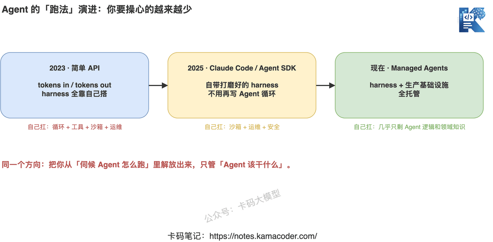
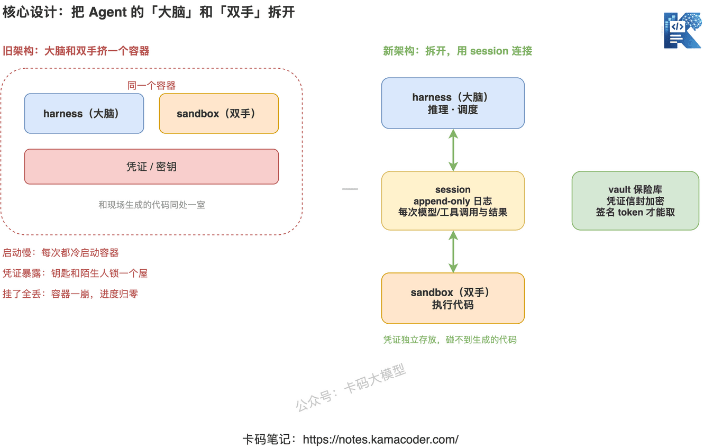
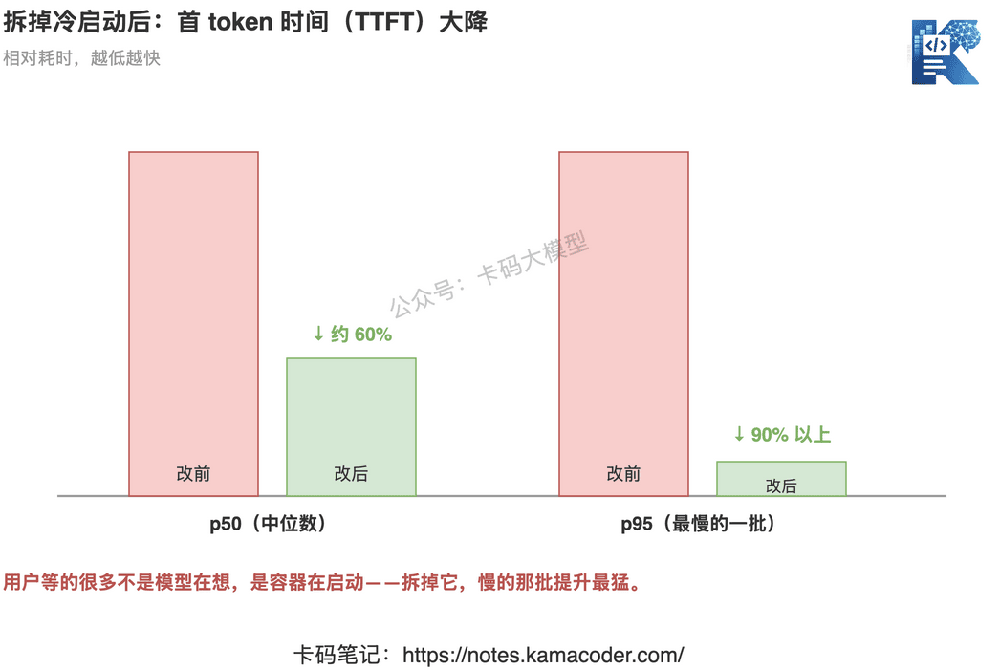

# Claude Managed Agents: як розділити «мозок» і «руки» агента — від прототипу до продакшну за кілька днів

> **Станом на вересень 2026.** Продуктові можливості й назви в цій статті швидко змінюються — перед використанням звіряйтеся з офіційною документацією.

Продовжуємо про Claude.

Попередня стаття — [Claude Skills на практиці](./claude_skills.md) — була про те, «як додати агентові спеціалізовану здатність». Ця опускається на рівень нижче, до питання фундаментальнішого, але інженерно куди болючішого: **як агент узагалі запускається і як його стабільно довести до продакшну?**

Anthropic щойно опублікувала допис «building with Claude Managed Agents», де розклала цю свою нову інфраструктуру для агентів.

Одним реченням, що таке Managed Agents: **набір композиційних API, які допомагають будувати й розгортати агентів продакшн-рівня, скорочуючи шлях команди від прототипу до запуску з «кількох місяців» до «кількох днів».**

Тут розберемо архітектурну ідею, що стоїть за цим, — а надто найважливіше рішення: **розділити «мозок» і «руки» агента.**

## Спершу лінія еволюції: як змінювався сам «спосіб запуску» агента

Щоб зрозуміти, що саме розв'язують Managed Agents, треба побачити, звідки ми прийшли.

**2023 рік, доба простого API.** Перший Claude API навмисно зробили дуже аскетичним: tokens in, tokens out — згодував токени, отримав токени. Модель лише думає, а вся «оболонка» (harness), що дає їй викликати інструменти, крутити цикл і працювати з файловою системою, лишалася на розробнику.

**2025 рік, Claude Code і Agent SDK.** Claude Code принесла власний відшліфований внутрішній harness, який згодом відкрили через Claude Agent SDK, — і розробникам більше не треба було писати цикл агента самотужки. Про цей крок ми говорили в статті [Автор Claude Code каже «пишіть не промпти, а цикли»](./claude_code_loop.md): суть агента саме в замкненому циклі «подумав — зробив — подивився на результат — подумав знову».

**Тепер, Managed Agents.** Це вже не просто harness, а **harness плюс уся продакшн-інфраструктура** під керуванням платформи. Ви зосереджуєтеся на логіці агента й предметних знаннях, а брудну роботу — запуск, масштабування, безпеку — бере на себе платформа.

## Ядро архітектури: розділити «мозок» і «руки»

Це найцінніше рішення з усього допису, і його варто розжувати.

Спершу про проблему старої архітектури. Раніше harness агента (той «мозок», що відповідає за міркування й планування) **і файлова система sandbox, якою агент оперує (ті «руки», що виконують код), часто тіснилися в одному контейнері**. На вигляд нічого страшного, але з масштабом вилазять одразу три проблеми:

- **повільний старт**: кожен запуск агента тягне холодний старт контейнера, і весь час іде саме туди;
- **відкриті облікові дані**: ваш API-ключ і пароль до бази лежать у тому самому контейнері, де агент прямо зараз генерує код, — це все одно що замкнути ключі в одній кімнаті з незнайомцем;
- **упало — і все втрачено**: контейнер падає, а з ним і весь недороблений прогрес, відновити його нічим.

Розв'язок Managed Agents прямолінійний: **рознести мозок і руки в різні місця, а між ними поставити сесію.**

Ця сесія і є ключем — це **журнал, у який можна лише дописувати (append-only) і який фіксує кожен виклик моделі, кожен виклик інструмента й кожен повернутий результат**. Мозок міркує з одного боку, руки виконують з другого, а спілкуються вони через цей потік подій, що тільки доповнюється й ніколи не переписується. Той самий append-only журнал — це та сама ідея, що й «дати Claude читати власну історію» зі статті [Claude Skills на практиці](./claude_skills.md), тільки піднята на рівень усієї архітектури виконання.

Після розділення вся конструкція складається з **трьох типів ресурсів**, і зрозумівши їх, ви зрозумієте Managed Agents:

- **Agents (агенти)**: конфігурація. Яка модель, який промпт, які інструменти доступні, які запобіжники.
- **Environments (середовища)**: контекст виконання. Контейнер sandbox і попередньо встановлені залежності.
- **Sessions (сесії)**: конкретний запуск. Повна історія подій зберігається на боці сервера, її можна спостерігати й відновлювати.

Поділ на три шари — «конфігурація / середовище / запуск» — це структура, що природно виростає з роз'єднання мозку й рук.

## Що ж це розділення дає насправді

Роз'єднували не заради краси, а щоб закрити ті три гріхи — плюс кілька справжніх продакшн-вигод.

**Перше — безпека облікових даних.** Секрети більше не живуть в одній кімнаті зі згенерованим кодом, а лежать окремо у **сховищі (vault)**. Перед записом застосовується конвертне шифрування, а щоб їх дістати, потрібен ще й підписаний токен запиту. Хай як крутиться код, який агент пише просто зараз, до ваших ключів він не дотягнеться.

**Друге — значно менша затримка.** Прибравши накладні витрати на холодний старт контейнера щоразу, **медіану часу до першого токена (p50) знизили приблизно на 60 %, а найповільніший сегмент (p95) — більш ніж на 90 %.** Ці цифри дуже красномовні: раніше користувачі чекали здебільшого не на роздуми моделі, а на запуск контейнера.

**Третє — персистентні й відновлювані сесії.** Сесія — це безперервний потік подій, тож ви **бачите в реальному часі кожен крок роботи агента**, а згодом у будь-який момент можете **продовжити конкретну сесію з того місця, де вона спинилася**. Падіння контейнера більше не означає «починай спочатку».

**Четверте — гнучке розгортання.** Можна взяти хмарний контейнер під управлінням Anthropic, щоб не морочитися; а можна розмістити sandbox у власному VPC — для дотримання вимог відповідності й того, щоб дані не залишали контур.

## Один урок, який легко проґавити, але дуже важливий

У дописі є фрагмент, що його варто винести окремо: **модель розвивається, і harness мусить розвиватися разом із нею.**

В оригіналі наведено конкретний приклад: на Claude Sonnet 4.5 агент, підходячи до кінця контексту, починав **квапитися** — відчував, що місця лишається мало, і поспіхом згортав роботу. Полагодили це, додавши в harness **скидання контексту (context reset)**. І що далі? У наступному поколінні моделі ця вада зникла, а разом із нею стала непотрібною й та оптимізація.

Це влучає в саму суть: **якщо harness підтримуєте ви, то доведеться вічно бігти за норовом моделі.** У цього покоління є свій дивний тик — ви дописуєте латку; у наступного він змінився — ви її прибираєте. Саме в цьому сенс Managed Agents: оптимізації, що стрибають туди-сюди разом із версіями моделі, бере на себе платформа.

## То кому варто брати Managed Agents

Допис дає дуже тверезу оцінку: **для переважної більшості команд підтримка власного harness — це чисті витрати, які не створюють жодної диференціації.**

Чим виграє ваш продукт? Предметними знаннями й умінням організувати контекст, а не тим, що ваш цикл агента написаний вигадливіше за чужий. Шар інфраструктури варто віддати, щойно є кому, а сили вкласти туди, де справді утворюється відрив. А щодо питання «коли агент справді потрібен, а коли ні», варто перечитати [Агент проти workflow](../app/agent_vs_workflow.md) — спершу визначитися з цим, а вже потім вирішувати, чи братися за цей стек узагалі.

Кілька клієнтських цифр теж переконливі:

- **Notion**: власний агент перетворив «дванадцять годин роботи» на двадцять хвилин;
- **Sentry**: агента для налагодження й автоматичної генерації PR **один інженер зробив за кілька тижнів** — раніше на це пішли б місяці;
- **Rakuten, Asana, Atlassian**: розгортання агентів між відділами приблизно за тиждень.

До цього додається чимало продакшн-можливостей: Memory і Dreaming (періодичний перегляд сесій, виокремлення закономірностей і впорядкування пам'яті), Outcomes (агент оцінює власну роботу за критеріями), оркестрація кількох агентів, політики доступу, вебхуки, а також MCP-тунель до серверів у вашій приватній мережі. Про сам протокол MCP читайте в статті [Протокол MCP](../app/mcp_protocol.md).

## Наостанок

Від tokens in / tokens out до власного harness, а тепер і до повного управління harness та інфраструктурою — уся ця лінія Anthropic робить, по суті, одне: **звільняє розробника від обслуговування того, «як агент працює», щоб той дбав лише про те, «що агент має робити».**

А технічною опорою всього цього є те просте й водночас ключове рішення: розділити мозок і руки. Тож навіть якщо у власному проєкті з агентами Managed Agents вам поки не знадобиться, підхід «роз'єднати міркування й виконання, з'єднавши їх append-only журналом» варто перенести у свою архітектуру.

## Посилання

- Офіційний блог Anthropic (building with Claude Managed Agents): https://claude.com/blog/building-with-claude-managed-agents
