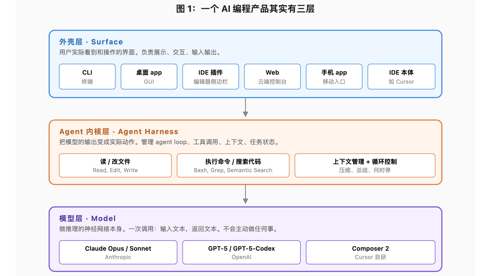
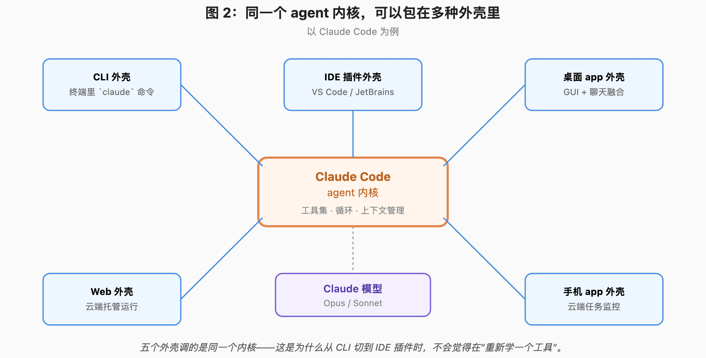

# Чим Claude Code відрізняється від Claude.ai? Три рівні архітектури AI-продуктів для програмування

Люди в розмовах постійно кажуть, що «користуються Claude». Для тих, хто не надто занурений в AI-інструменти для програмування, це формулювання геть розмите.

Показовий випадок: одна людина хвалить якусь модель, інша пробує — і каже, що нічого особливого, звичайна собі модель. Питаєш, як саме вона нею користувалася. Виявляється — через **вікно чату**.

Річ не в тому, що модель у вікні чату «дурнішає». **Річ у тому, що через вікно чату ви просто не дістанетеся до її потужності.**

Щоб модель розкрилася, потрібен добрий агент.

Веб-чат можна вважати прямою розмовою з моделлю. Щоправда, у веб-інтерфейсі теж є точка входу в хмарну консоль — її можна вважати легким агентом.

Тож дивіться: **та сама модель у різних «оболонках» поводиться разюче по-різному.** Багато хто не розрізняє веб, CLI і застосунок. Це не лише заважає дістати з моделі те, на що вона здатна, а й робить розмови про AI-програмування суцільною плутаниною.

Чому так виходить?

Бо більшість розуміє «AI-продукт для програмування» надто грубо: ніби змінити модель — це змінити продукт, ніби та сама модель скрізь працює однаково. А це не так.

Типовий діалог:

> — Чим зараз пишеш код?
> — Claude.
> — Веб чи CLI?
> — …та обома. А що, є велика різниця?

**Різниця велика.**

І це стосується не лише Claude. З Codex так само: кажеш «користуюся Codex», а співрозмовник уявляє або хмарного агента в chatgpt.com, який відкриває PR, або команду `codex` у терміналі.

З Cursor трохи легше, бо він сам по собі редактор. Але й у нього тепер є веб, мобільний застосунок і фонові агенти — це вже теж не один продукт.

Спершу здається, що проблема в плутанині назв: вендор запхав десяток різних речей під один бренд, тож користувач і губиться.

Але попрацювавши більше, розумієш: плутанина не в назвах. **Плутанина в тому, що в нас у голові надто грубе уявлення про «AI-продукт для програмування»** — ми вважаємо «модель» усім продуктом.

Щоб розплутати цей вузол, продукт треба розкласти на три рівні.

## Рівень перший: модель

Найзрозуміліший рівень. Claude Opus, Claude Sonnet, GPT-5-Codex, Composer від Cursor — це моделі.

**Модель можна уявити як чисту функцію: подали вхід — отримали вихід.** Звісно, сучасні моделі й самі вміють викликати інструменти: модель може вирішити «мені треба прочитати цей файл» чи «мені треба виконати цю команду». Але модель лише **видає вказівку**. Власне виконання цих вказівок, повернення результату назад і продовження міркування — цього циклу в моделі немає.

Межа можливостей моделі чітка: **один прохід інференсу, на вході текст, на виході текст (можливо, з вказівками на виклик інструментів).** Модель цілком можна викликати напряму через API: надіслали запит, отримали відповідь, далі робіть самі. Багато хто на початках саме так і писав код: вставляєш код у запит до API, отримуєш змінений варіант і копіюєш його до себе.

Але це вкрай неефективно. Модель має змінити три файли — ви тричі вставляєте й тричі копіюєте. Модель каже «зараз проганю тести» — а сама не може: хтось має виконати команду й вставити результат назад, щоб вона продовжила.

Цей цикл «прочитати файл → поміркувати → записати файл → запустити інструмент → поміркувати знову» і є agent loop. **Модель вирішує, що робити, а ядро виконує й керує циклом.** Ці два рівні перетинаються й не розділені повністю — про це далі.

## Рівень другий: ядро агента

Найбільш недооцінений і водночас найважливіший рівень.

**Саме він визначає, як вихід моделі перетворюється на реальні дії.**

Конкретно: розібрати у виводі моделі вказівки на виклик інструментів, реально виконати ці інструменти (прочитати файл, змінити файл, виконати shell-команду, пошукати по коду), повернути результат моделі, керувати зростанням контекстного вікна, вирішити, коли задачу можна вважати завершеною, обробити помилки й повторні спроби.

У Claude Code своє ядро агента, у Codex своє, у Cursor своє. **Різниця в дизайні цих ядер часто впливає на досвід сильніше, ніж різниця між самими моделями.**

Приклад. Модель Composer від Cursor спеціально навчена «самопідсумовуванню»: коли контекст наближається до заповнення, модель сама підсумовує, стискає й працює далі. Звучить як властивість моделі, але щоб це справді працювало, ядро агента має підіграти: зупинитися на певному порозі контексту, попросити модель підсумувати й продовжити цикл уже зі стиснутим контекстом. **Модель і ядро проєктуються разом.**

Щойно ви усвідомлюєте існування цього рівня, багато що стає на місця.

Чому та сама модель Claude у веб-чаті Claude.ai і в Claude Code CLI відчувається зовсім інакше? Бо в веб-чаті ядро агента дуже легке: кілька доступних інструментів і короткий цикл. Ядро Claude Code CLI значно складніше: повний набір інструментів, глибокий цикл, керування контекстом на рівні проєкту, skills і субагенти. **Модель та сама, ядро — ні.**

Саме тому на початку й сказано, що та сама модель у вікні чату й у CLI поводиться настільки по-різному. **Змінилася не модель, а ядро агента.**

Цікавіше зворотне. **Одне й те саме ядро агента може працювати в багатьох оболонках.** Ядро Claude Code однакове в CLI, у розширенні для VS Code, у плагіні для JetBrains, у десктопному застосунку, у хмарному вебі й у мобільному застосунку — відрізняється лише інтерфейс навколо. Тому, переходячи з CLI у плагін для IDE, ви не відчуваєте, що «вчите новий інструмент»: це справді один інструмент.

## Рівень третій: оболонка

Оболонка — це те, що користувач насправді бачить і чіпає: CLI, десктопний застосунок, веб, плагін до IDE, мобільний клієнт. Її задача — «перекласти» процес роботи ядра агента у форму, яку сприймає людина.

Здається, що це найменш технологічний рівень, але це не так. **Оболонка визначає надто багато:** як показати diff, як згортати вивід інструментів, як перемикатися між задачами, як подавати потокову відповідь, як обробляти переривання. Одне й те саме ядро агента в різних оболонках може давати кардинально різний досвід.

До того ж хороша оболонка не просто «перекладає» — деякі оболонки **підсилюють можливості самого ядра**. Наприклад, оболонка редактора Cursor інтегрує семантичний індекс кодової бази, і цей індекс безпосередньо впливає на якість пошуку по коду в ядрі агента. Тож і межа між оболонкою та ядром теж не надто чітка.

Візьмімо Claude Code. Оболонка CLI дає вам потік тексту: що бачите ви — те бачить і модель, дуже сиро й прямо. Оболонка плагіна до IDE перетворює зміни на diff, який можна переглянути, ще й з підказками в рядках. Десктопна оболонка змішує можливості агента зі звичайним чатом, тож можна паралельно розмовляти й роздавати задачі. Хмарна вебоболонка виносить усе середовище роботи агента на сервер — вимкнете комп'ютер, а він працюватиме далі.

## Підсумок

Конфігурація може виглядати, наприклад, так: модель — одна, ядро агента — від Claude, спосіб взаємодії — CLI.

Тут часто виникає непорозуміння: якщо агент від Claude, то спосіб взаємодії ж і є Claude CLI?

**Не обов'язково.** Способом взаємодії може бути VS Code із встановленим розширенням Claude Code — те саме ядро агента, просто інша оболонка.

Тож коли хтось каже «я користуюся моделлю Claude», точніше було б сказати так: клієнт — CLI, агент — Claude, модель — Opus.

Так значно зрозуміліше.
