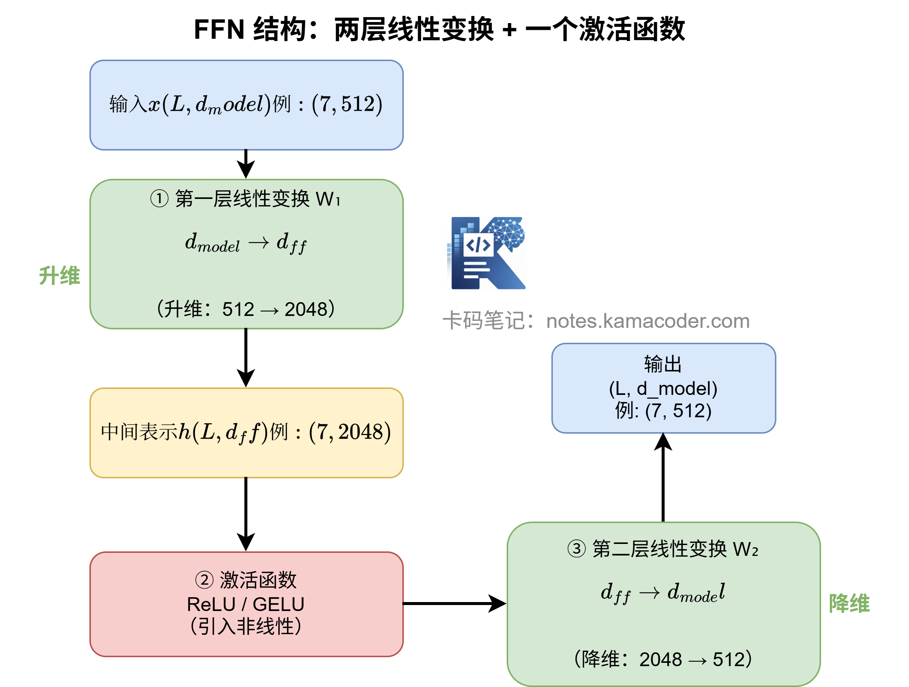
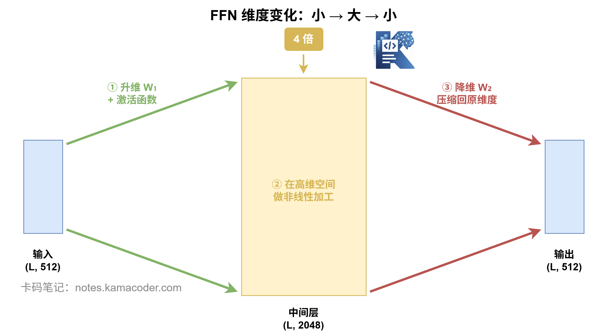
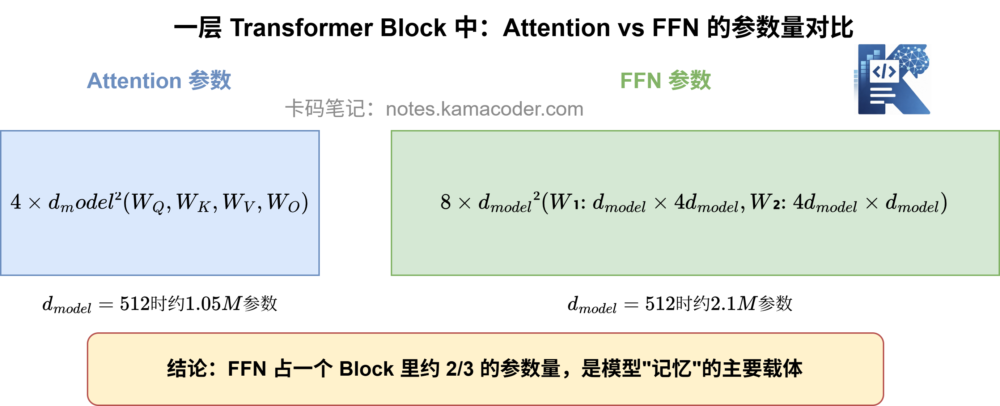

# Пишемо FFN з нуля: реалізація мережі прямого поширення Transformer

У попередній статті ми з нуля написали multi-head attention і пройшли повний процес із п'яти кроків: розбиття → паралельне обчислення → склеювання → проєкція.

Тепер напишемо власноруч інший ключовий компонент Transformer Block: **FFN (Feed-Forward Network, мережу прямого поширення)**.

Пригадуєте висновок із попередніх статей?

> Self-attention дозволяє токенам «обмінюватися інформацією», а FFN дає кожному токену «подумати самостійно» й робить глибоку нелінійну обробку.

У цій статті ми реалізуємо цей «модуль мислення» в коді, друкуючи shape на кожному кроці, щоб бачити, як змінюються дані.

> Числові твердження цієї статті перевірені скриптом
> [`tools/verify-ffn.mjs`](../../../tools/verify-ffn.mjs).

---

## Наскільки проста структура FFN?

Дуже проста: **два лінійні перетворення, а між ними функція активації.**

Формулою це виглядає так:

$$
\text{FFN}(x) = \text{Activation}(x \cdot W_1 + b_1) \cdot W_2 + b_2
$$

У три кроки:

```
вхід x（d_model вимірів）
  ↓ перше лінійне перетворення W₁（d_model → d_ff, підвищення розмірності）
  ↓ функція активації（ReLU / GELU）
  ↓ друге лінійне перетворення W₂（d_ff → d_model, зниження розмірності）
вихід（d_model вимірів）
```

Ключова деталь: **посередині розмірність спершу підвищується, а потім повертається до початкової**.

В оригінальній статті про Transformer d_model = 512, а проміжний шар d_ff = 2048 — **рівно вчетверо більше**. Далі ми окремо розберемо, чому саме так.



## Крок 1: готуємо вхід

FFN стоїть після attention, тож його входом є вихід підшару attention.

Для наочності знову візьмімо речення «Удалині росте яблуня» з довжиною послідовності L = 7 і d_model = 8 (насправді 512, тут зменшено для зручності спостереження).

```python
import numpy as np

# Гіперпараметри
L = 7          # довжина послідовності
d_model = 8    # розмірність embedding
d_ff = 32      # розмірність проміжного шару FFN (зазвичай учетверо більша за d_model)

np.random.seed(42)

# Імітуємо вихід підшару attention як вхід для FFN
x = np.random.randn(L, d_model)
print(f"Вхід FFN: {x.shape}")  # (7, 8)
```

**Вивід:**
```
Вхід FFN: (7, 8)
```

Це звичайна матриця `(L, d_model)`: 7 токенів, кожен по 8 вимірів.

## Крок 2: перше лінійне перетворення (підвищення розмірності)

Піднімаємо вхід з `d_model=8` до `d_ff=32` — для цього потрібна матриця ваг `(8, 32)`.

```python
# Ваги й зсув першого шару
W1 = np.random.randn(d_model, d_ff)  # (8, 32)
b1 = np.random.randn(d_ff)           # (32,)

# Лінійне перетворення: x @ W1 + b1
hidden = x @ W1 + b1
print(f"[після підвищення] hidden: {hidden.shape}")  # (7, 32)
```

**Вивід:**
```
[після підвищення] hidden: (7, 32)
```

Кожен токен роздувся з 8 вимірів до 32. Цей крок поки що лише лінійне перетворення, нічого «нового» воно не вносить — **справжня магія на наступному кроці.**

## Крок 3: функція активації (вносимо нелінійність)

Це найважливіший крок у FFN. Чому активація обов'язкова?

Без неї два лінійні перетворення, накладені одне на одне, по суті лишаються одним лінійним перетворенням:

$$
(x W_1)W_2 = x(W_1 W_2) = x W'
$$

Два лінійні шари = один лінійний шар, робота намарно. Тому посередині обов'язково вставляють **нелінійну функцію**, щоб модель могла вивчати складні комбінації ознак.

Поширених варіантів два:

- **ReLU:** використана в оригінальному Transformer, проста й ефективна
- **GELU:** використовується в BERT і GPT, поводиться плавніше

Спершу покажемо на ReLU:

```python
def relu(x):
    return np.maximum(0, x)

# Застосовуємо функцію активації
hidden_activated = relu(hidden)
print(f"[після активації] hidden: {hidden_activated.shape}")  # (7, 32)
print(f"Кількість від'ємних до активації: {(hidden < 0).sum()}")
print(f"Кількість від'ємних після активації: {(hidden_activated < 0).sum()}")
```

**Вивід:**
```
[після активації] hidden: (7, 32)
Кількість від'ємних до активації: 100
Кількість від'ємних після активації: 0
```

ReLU робить дуже просту річ: **усі від'ємні значення стають нулями, додатні лишаються незмінними**. Форма не змінилася, але розподіл значень — так. Оце і є «нелінійність».

Якщо хочете GELU, його можна записати так:

```python
def gelu(x):
    return 0.5 * x * (1 + np.tanh(np.sqrt(2/np.pi) * (x + 0.044715 * x**3)))
```

Сучасні великі моделі здебільшого використовують GELU або його варіації (наприклад, Llama використовує SwiGLU), але принцип той самий: після підвищення розмірності вноситься нелінійність.

## Крок 4: друге лінійне перетворення (зниження розмірності)

Після підвищення й активації матрицею `(32, 8)` повертаємо розмірність назад до 8:

```python
# Ваги й зсув другого шару
W2 = np.random.randn(d_ff, d_model)  # (32, 8)
b2 = np.random.randn(d_model)        # (8,)

# Зниження розмірності
output = hidden_activated @ W2 + b2
print(f"[після зниження] output: {output.shape}")  # (7, 8)
print(f"Форма входу:      {x.shape}")
print(f"Форма виходу:     {output.shape}")
print(f"Форми збігаються: {x.shape == output.shape}")
```

**Вивід:**
```
[після зниження] output: (7, 8)
Форма входу:      (7, 8)
Форма виходу:     (7, 8)
Форми збігаються: True
```

Вхід — `(7, 8)`, вихід теж `(7, 8)`, **форми повністю збігаються**. Саме тому FFN можна вбудувати в кожен шар Transformer Block: він не змінює «зовнішньої форми» даних, а змінює лише внутрішній «вміст інформації».



## Навіщо розширювати саме вчетверо?

Це можна зрозуміти з двох боків.

**① З погляду виразної здатності**

Нелінійній функції потрібен «достатньо широкий» простір, щоб проявитися. Якщо проміжний шар надто вузький, комбінацій ознак, які здатна вловити активація, буде обмаль; якщо надто широкий — кількість параметрів вибухне, а навчання сповільниться.

Експерименти показують, що **вчетверо дає і достатньо простору для виразності, і не надто дорого коштує.**

**② З погляду балансу обчислень**

В одному шарі Transformer Block кількість параметрів attention і FFN приблизно однакова за порядком:

- Частина attention: 4 матриці ($W_Q, W_K, W_V, W_O$), кожна $d_{model} × d_{model}$, разом $4 × d_{model}^2$
- Частина FFN: 2 матриці, $d_{model} × d_{ff} + d_{ff} × d_{model} = 2 × d_{model} × d_{ff}$

Коли $d_{ff} = 4 × d_{model}$, кількість параметрів FFN дорівнює $8 × d_{model}^2$, тобто **рівно вдвічі більше, ніж в attention**.

Це пояснює й добре відомий факт: **серед параметрів Transformer на FFN припадає більша частина** (приблизно дві третини). Значна частина справжнього «сховища знань» моделі захована саме в цих двох великих матрицях FFN.



## Повний код: пакуємо чотири кроки в клас

```python
import numpy as np

class FeedForwardNetwork:
    def __init__(self, d_model, d_ff, activation='relu'):
        """
        Feed-Forward Network

        Параметри:
            d_model: розмірність входу/виходу
            d_ff:    розмірність проміжного шару (зазвичай = 4 * d_model)
            activation: тип функції активації, 'relu' або 'gelu'
        """
        # Ваги двох лінійних перетворень
        self.W1 = np.random.randn(d_model, d_ff) * 0.01
        self.b1 = np.zeros(d_ff)
        self.W2 = np.random.randn(d_ff, d_model) * 0.01
        self.b2 = np.zeros(d_model)
        self.activation = activation

    def _activate(self, x):
        if self.activation == 'relu':
            return np.maximum(0, x)
        elif self.activation == 'gelu':
            return 0.5 * x * (1 + np.tanh(
                np.sqrt(2/np.pi) * (x + 0.044715 * x**3)
            ))

    def forward(self, x):
        # ① Перший шар: підвищення розмірності
        hidden = x @ self.W1 + self.b1
        print(f"[① підвищення] {x.shape} → {hidden.shape}")

        # ② Функція активації: вносимо нелінійність
        hidden = self._activate(hidden)
        print(f"[② активація]  shape не змінюється: {hidden.shape}")

        # ③ Другий шар: зниження розмірності
        output = hidden @ self.W2 + self.b2
        print(f"[③ зниження]   {hidden.shape} → {output.shape}")

        return output


# ——— Запуск тесту ———
if __name__ == "__main__":
    np.random.seed(42)
    L, d_model, d_ff = 7, 8, 32

    x = np.random.randn(L, d_model)
    ffn = FeedForwardNetwork(d_model, d_ff, activation='gelu')

    print("=== Feed-Forward Network ===")
    out = ffn.forward(x)
    print(f"\nФорма входу:      {x.shape}")
    print(f"Форма виходу:     {out.shape}")
    print(f"Форми збігаються: {x.shape == out.shape}")
```

**Вивід під час запуску:**
```
=== Feed-Forward Network ===
[① підвищення] (7, 8) → (7, 32)
[② активація]  shape не змінюється: (7, 32)
[③ зниження]   (7, 32) → (7, 8)

Форма входу:      (7, 8)
Форма виходу:     (7, 8)
Форми збігаються: True
```

---

## Три кроки процесу

| Крок | Операція | Форма входу | Форма виходу |
|------|------|----------|----------|
| ① Підвищення | $x · W_1 + b_1$ | $(L, d_{model})$ | $(L, d_{ff})$ |
| ② Активація | ReLU / GELU | $(L, d_{ff})$ | $(L, d_{ff})$ |
| ③ Зниження | $h · W_2 + b_2$ | $(L, d_{ff})$ | $(L, d_{model})$ |

Загальний шлях: **мале → велике → мале**. Спершу інформація «розгортається» у простір більшої вимірності, щоб функція активації її обробила, а потім «стискається» назад до початкової розмірності й передається далі.

FFN виглядає як два звичайні повнозв'язні шари, але в Transformer він робить аж ніяк не просту роботу:

1. **Підвищення + активація + зниження:** нелінійно витягує ознаки у просторі більшої вимірності, а потім стискає назад
2. **Вносить нелінійність:** компенсує слабкість self-attention, який уміє лише лінійно комбінувати
3. **Обробляє кожен токен окремо:** attention відповідає за горизонтальний обмін, FFN — за вертикальне поглиблення
4. **Несе більшу частину параметрів:** параметрів у FFN приблизно вдвічі більше, ніж в attention, і саме він є основним носієм «пам'яті» моделі

Одним реченням:

> **Attention дає токенам побачити одне одного, а FFN дає кожному токену справді «перетравити» побачене.**

На цьому ми написали власноруч обидва ключові підмодулі Transformer Block — **multi-head attention і FFN**.

У наступній статті напишемо з нуля ще й **залишкове з'єднання та LayerNorm**, а потім складемо з цих деталей повний Transformer Encoder Block.
