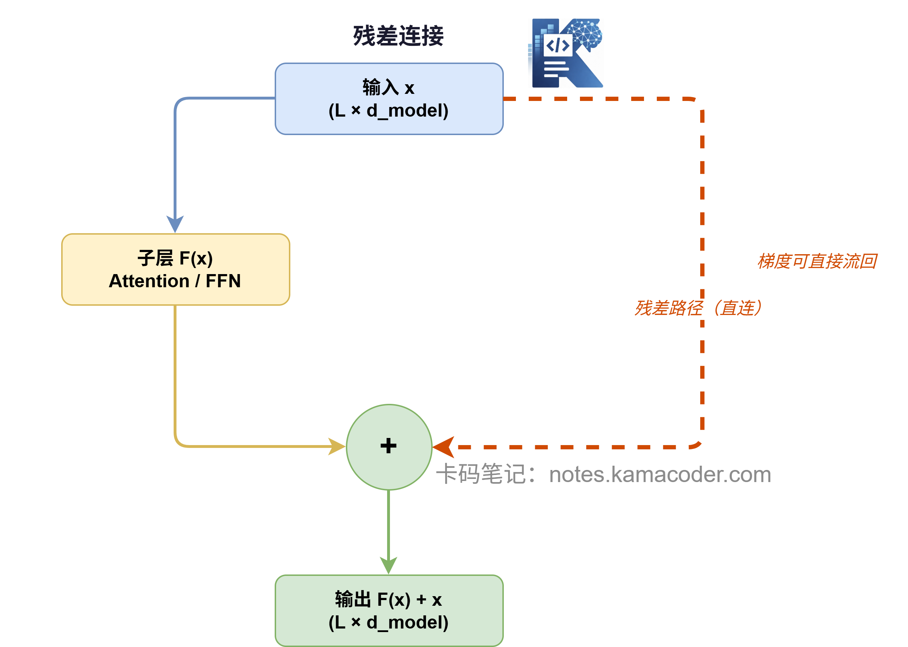
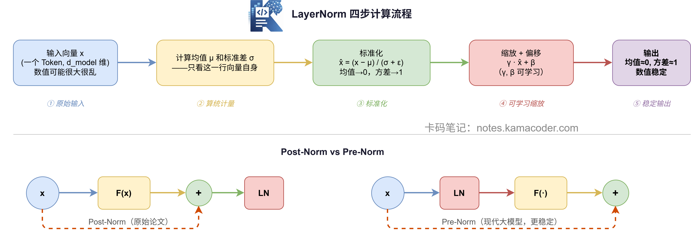

# Пишемо LayerNorm і залишкове з'єднання з нуля: не дайте базовим компонентам лишитися непоміченими

У попередній статті ми з нуля написали FFN і пройшли повний шлях: підвищення розмірності → активація → зниження розмірності.

Тепер напишемо власноруч два компоненти, яких **давно звикли вважати другорядними**: **залишкове з'єднання (residual connection)** і **нормалізацію шару (LayerNorm)**.

На вигляд вони прості, коду разом не більше 20 рядків, але без будь-якого з них Transformer не вдасться зробити глибоким.

> Числові твердження цієї статті перевірені скриптом
> [`tools/verify-layernorm.mjs`](../../../tools/verify-layernorm.mjs).

## Залишкове з'єднання

Формула залишкового з'єднання займає один рядок:

$$
\text{вихід} = F(x) + x
$$

$F(x)$ — вихід підшару (наприклад, результат attention або FFN), $x$ — вхід цього шару. Вони просто **додаються**.

І це все? Так, це все.

Але цим розв'язано фундаментальну проблему глибоких мереж: **зникання градієнта**.

Під час зворотного поширення градієнт має пройти від останнього шару аж до першого. Проходячи кожен шар, він множиться на похідну цього шару, і якщо похідна мала (скажімо, в зоні насичення сигмоїди), то за ланцюговим правилом градієнт зменшується експоненційно, і перші шари взагалі не отримують корисного навчального сигналу.

Хитрість залишкового з'єднання в тому, що воно дає градієнту **«швидкісну магістраль»**: він може оминути проміжні шари й потекти назад напряму, не множачись на кожному з них.



У коді залишкове з'єднання реалізується дуже прямолінійно:

```python
import numpy as np

def residual_connection(x, sublayer_output):
    """
    Залишкове з'єднання: просто додаємо

    Параметри:
        x:               вхід підшару, shape (L, d_model)
        sublayer_output: вихід підшару, shape (L, d_model)

    Повертає:
        shape (L, d_model), повністю збігається з входом
    """
    return x + sublayer_output

# Тест
L, d_model = 7, 8
np.random.seed(42)

x = np.random.randn(L, d_model)             # вхід підшару
sublayer_out = np.random.randn(L, d_model)  # вихід підшару (імітація)

output = residual_connection(x, sublayer_out)
print(f"Форма входу:            {x.shape}")             # (7, 8)
print(f"Вихід підшару:          {sublayer_out.shape}")  # (7, 8)
print(f"Залишковий вихід:       {output.shape}")        # (7, 8)
```

**Вивід:**
```
Форма входу:            (7, 8)
Вихід підшару:          (7, 8)
Залишковий вихід:       (7, 8)
```

Це просто додавання, форма не змінюється зовсім. Але саме це додавання дозволяє стабільно нарощувати Transformer до понад ста шарів.

## LayerNorm

Після залишкового додавання діапазон значень може стати дуже широким або нерівномірним: в одних вимірах значення величезні, в інших крихітні. На вході в наступний шар така нестабільність серйозно псує навчання.

Задача LayerNorm — **нормалізувати** вектор кожного токена: привести середнє до 0, а дисперсію до 1.

Формула така:

$$
\text{LayerNorm}(x) = \frac{x - \mu}{\sigma + \epsilon} \cdot \gamma + \beta
$$

Разом чотири кроки:

1. обчислити середнє $\mu$ цього вектора
2. обчислити стандартне відхилення $\sigma$ цього вектора
3. стандартизувати через $(x - \mu) / \sigma$, щоб кожен вимір «стиснувся» до середнього 0 і дисперсії 1
4. помножити на $\gamma$ (масштаб) і додати $\beta$ (зсув) — це навчані параметри, які дозволяють моделі самій вирішувати, «наскільки сильно нормалізувати»

Тут $\epsilon$ — дуже мале число (наприклад, 1e-5), яке не дає знаменнику стати нулем.



```python
class LayerNorm:
    def __init__(self, d_model, eps=1e-5):
        """
        LayerNorm

        Параметри:
            d_model: розмірність вектора
            eps:     мала константа проти ділення на нуль
        """
        self.gamma = np.ones(d_model)   # навчаний параметр масштабу, ініціалізується одиницями
        self.beta  = np.zeros(d_model)  # навчаний параметр зсуву, ініціалізується нулями
        self.eps   = eps

    def forward(self, x):
        """
        x: shape (L, d_model)
        """
        # Для кожного токена (кожного рядка) окремо рахуємо середнє й станд. відхилення
        mu    = x.mean(axis=-1, keepdims=True)          # (L, 1)
        sigma = x.std(axis=-1, keepdims=True)           # (L, 1)

        # Стандартизація
        x_norm = (x - mu) / (sigma + self.eps)          # (L, d_model)

        # Масштаб + зсув (broadcast на кожен рядок)
        return self.gamma * x_norm + self.beta          # (L, d_model)


# Тест
np.random.seed(42)
L, d_model = 7, 8
x = np.random.randn(L, d_model) * 10  # навмисно збільшуємо значення, імітуючи нестабільність

ln = LayerNorm(d_model)
output = ln.forward(x)

print(f"До нормалізації  - середнє: {x.mean():.2f}, станд. відхилення: {x.std():.2f}")
print(f"Після нормалізації - середнє: {output.mean():.4f}, станд. відхилення: {output.std():.4f}")
print(f"Форма входу: {x.shape}, форма виходу: {output.shape}")
```

**Вивід:**
```
До нормалізації  - середнє: -1.69, станд. відхилення: 9.13
Після нормалізації - середнє: -0.0000, станд. відхилення: 1.0000
Форма входу: (7, 8), форма виходу: (7, 8)
```

Стандартне відхилення входу близьке до 10, а після нормалізації стало 1 — значення «підтягнуто» назад у розумний діапазон, і при цьому форма не змінилася зовсім.

## Складаємо обидва разом: Add & Norm

У Transformer залишкове з'єднання й LayerNorm ніколи не розлучаються, і стандартний запис називається **Add & Norm**:

$$
\text{вихід} = \text{LayerNorm}(x + F(x))
$$

Спершу додавання (залишкове з'єднання), потім нормалізація (LayerNorm). Кожен підмодуль — байдуже, attention це чи FFN — має за собою таку конструкцію.

```python
def add_and_norm(x, sublayer_output, layer_norm):
    """
    Add & Norm: залишкове з'єднання + LayerNorm

    Параметри:
        x:               вхід підшару,  shape (L, d_model)
        sublayer_output: вихід підшару, shape (L, d_model)
        layer_norm:      екземпляр LayerNorm

    Повертає:
        shape (L, d_model)
    """
    return layer_norm.forward(x + sublayer_output)


# Повний тест
np.random.seed(42)
L, d_model = 7, 8

x            = np.random.randn(L, d_model)
attn_output  = np.random.randn(L, d_model)  # імітуємо вихід підшару attention
ffn_output   = np.random.randn(L, d_model)  # імітуємо вихід підшару FFN

ln1 = LayerNorm(d_model)
ln2 = LayerNorm(d_model)

# Підшар attention → Add & Norm
after_attn = add_and_norm(x, attn_output, ln1)
print(f"Після підшару attention: {after_attn.shape}")  # (7, 8)

# Підшар FFN → Add & Norm
after_ffn  = add_and_norm(after_attn, ffn_output, ln2)
print(f"Після підшару FFN:       {after_ffn.shape}")   # (7, 8)

print(f"\nФорма входу:      {x.shape}")
print(f"Форма виходу:     {after_ffn.shape}")
print(f"Форми збігаються: {x.shape == after_ffn.shape}")
```

**Вивід:**
```
Після підшару attention: (7, 8)
Після підшару FFN:       (7, 8)

Форма входу:      (7, 8)
Форма виходу:     (7, 8)
Форми збігаються: True
```

---

## Post-Norm проти Pre-Norm

Вище написано **Post-Norm** — саме так зроблено в оригінальній статті: спершу обчислюється підшар, потім нормалізація.

$$
\text{Post-Norm:} \quad x' = \text{LayerNorm}(x + F(x))
$$

Але сучасні великі моделі (наприклад, Llama, GPT-3) здебільшого перейшли на **Pre-Norm**: спершу нормалізація, потім обчислення підшару.

$$
\text{Pre-Norm:} \quad x' = x + F(\text{LayerNorm}(x))
$$

Різниця лише в одному рядку коду, а ефект різний: з Pre-Norm навчання стабільніше, і це особливо помітно за великої кількості шарів (від кількох десятків).

```python
# Post-Norm (оригінальний Transformer)
def post_norm(x, sublayer_fn, layer_norm):
    return layer_norm.forward(x + sublayer_fn(x))

# Pre-Norm (сучасні великі моделі)
def pre_norm(x, sublayer_fn, layer_norm):
    return x + sublayer_fn(layer_norm.forward(x))
```

Запам'ятайте різницю між цими двома варіантами: і на співбесідах, і під час читання вихідного коду вона трапляється постійно.

---

## Зведення кроків

| Компонент | Формула | Ключова роль |
|------|------|----------|
| Залишкове з'єднання | $F(x) + x$ | лишає градієнту швидкісну магістраль, не дає навчанню глибокої мережі зламатися |
| LayerNorm | $\frac{x-\mu}{\sigma} \cdot \gamma + \beta$ | повертає вектор кожного токена до середнього 0 і дисперсії 1 |
| Add & Norm | $\text{LayerNorm}(x + F(x))$ | зв'язка обох, яка чіпляється після кожного підшару |

---

На цьому всі деталі Transformer Block — multi-head attention, FFN, залишкове з'єднання й LayerNorm — ми написали власноруч.

У наступній статті ми справді **складемо з цих деталей повний Transformer Encoder Block** і рядок за рядком проженемо повний прямий прохід.
