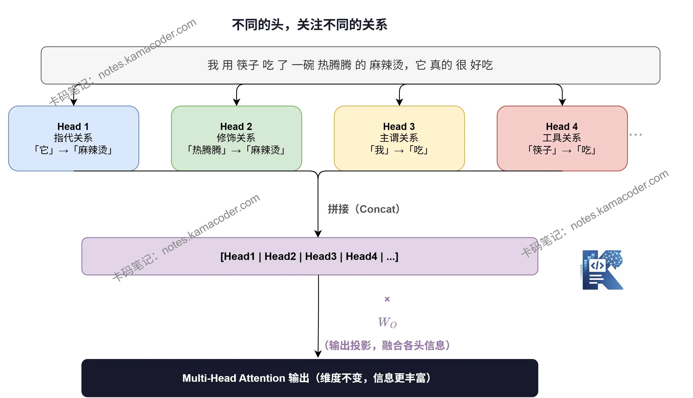
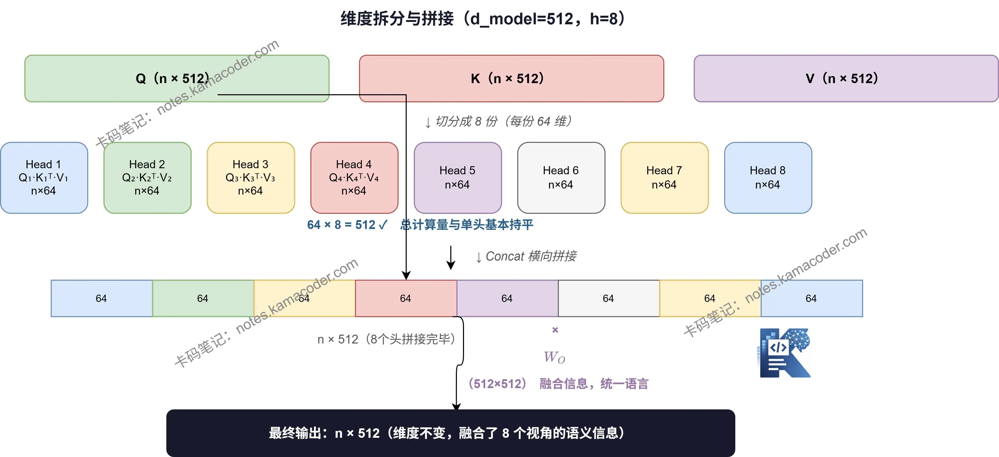

# Multi-Head Attention: чому однієї голови замало і як відбувається розбиття та склеювання

У попередній статті ми повністю пройшли процес обчислення attention — від QKᵀ через softmax до зваженого підсумовування.
Тепер поговоримо про інше: **чому Transformer використовує не один attention, а «кілька голів»?**

---

## Що не так з однією головою?

Погляньте на це речення:

> Я з'їв ложкою тарілку гарячого борщу, він справді дуже смачний

Що тут означає «він»? Борщ.

Але подумайте: які саме зв'язки модель має розібрати, щоб зрозуміти це речення?

- «він» → «борщ» (зв'язок вказівки)
- «гарячого» → «борщ» (зв'язок означення)
- «ложкою» → «з'їв» (зв'язок інструмента й дії)
- «я» → «з'їв» (зв'язок підмета й дії)

Ці зв'язки існують **одночасно**, але за природою вони абсолютно різні.

А одноголовий attention щоразу видає лише одну матрицю ваг уваги — тобто дивиться на зв'язки в реченні **з одного боку**. Годі сподіватися, що він одночасно вловить і вказівку, і означення, і граматику.

> Одна голова — це наче конспектувати статтю ручкою одного кольору: ви зможете виділити лише один вид важливого.

---

## Основна ідея кількох голів: нехай різні голови стежать за різними зв'язками

Ідея multi-head attention дуже пряма:

**замість того, щоб один attention намагався охопити все, хай кілька attention займаються кожен своїм.**

У кожної «голови» (head) є власні незалежні матриці ваг W_Q, W_K, W_V. Після навчання різні голови природним чином опановують різні типи патернів уваги:

- одні голови вловлюють **короткі граматичні залежності** (як-от «підмет — присудок — додаток»)
- інші опрацьовують **зв'язки вказівки** (на що вказує «він»)
- ще інші стежать за **позиційною інформацією** (зв'язки між сусідніми словами)

Ці голови працюють паралельно, а їхні результати наприкінці склеюються — і модель розуміє речення одразу «з кількох боків».



---

## Як розбиваються розмірності?

Ось місце, де початківці, вперше побачивши кілька голів, зазвичай губляться: **чи не зросте обсяг обчислень у h разів?**

Відповідь: **ні**. Секрет у «розбитті розмірностей».

Візьмімо d_model = 512 і h = 8 голів.

В одноголовому attention Q, K і V мають по 512 вимірів.
У multi-head attention кожна голова використовує лише **512 ÷ 8 = 64 виміри**.

Тобто це не «вісім повних attention, результати яких додали», а **розрізання 512 вимірів на 8 частин, де кожна голова відповідає за свою**:

```
початковий Q（n × 512）→ розбивається на 8 Q_i（n × 64）
початковий K（n × 512）→ розбивається на 8 K_i（n × 64）
початковий V（n × 512）→ розбивається на 8 V_i（n × 64）
```

Кожна голова робить повне обчислення attention у власному 64-вимірному підпросторі, і на виході теж дає n × 64.

**Сумарний обсяг обчислень майже такий самий, як в одноголового**, але при цьому модель одночасно «дивиться» у 8 різних підпросторів.



---

## Останній крок: склеювання й лінійне перетворення

Вісім голів відпрацювали й дали вісім матриць виходу розміру n × 64.
**Склеюємо їх горизонтально** — і повертаємося до n × 512:

```
[head₁ | head₂ | ... | head₈]  →  n × 512
```

Але на склеюванні не все закінчується: далі результат треба ще помножити на вихідну проєкційну матрицю $W_O$ (512×512), тобто зробити одне лінійне перетворення:

$$
\text{MultiHead}(Q,K,V) = \text{Concat}(\text{head}_1, ..., \text{head}_h) \cdot W^O
$$

Навіщо ще множити на $W_O$? Бо вісім голів осмислювали інформацію кожна у своєму підпросторі, і після склеювання потрібна матриця $W_O$, яка **заново інтегрує й перемішує** ці відомості, дозволяючи вивченому різними головами «поговорити» між собою, і видає єдине узгоджене представлення.

---

## Увесь процес одним поглядом

| Крок | Операція | Вхід | Вихід |
|------|------|------|------|
| ① Лінійна проєкція | множення на $W_Q, W_K, W_V$ | n × 512 | n × 512 (кожен) |
| ② Розбиття розмірностей | ділення на h частин | n × 512 | h матриць n × 64 |
| ③ Паралельний attention | кожна голова рахує незалежно | n × 64 | h матриць n × 64 |
| ④ Склеювання | Concat | h матриць n × 64 | n × 512 |
| ⑤ Вихідна проєкція | множення на $W_O$ | n × 512 | n × 512 |

На вході n × 512, на виході теж n × 512 — **розмірність не змінилася**, але у вектор кожного токена вже вплетено контекстну інформацію з кількох різних поглядів.

---

## Підсумок

Основна проблема, яку розв'язує багатоголова увага, — це **надто однобокий погляд одного attention-голови**.
Розбиття розмірностей дозволяє кільком головам працювати паралельно, кожній вивчаючи свій патерн уваги у власному низьковимірному підпросторі, а склеювання наприкінці зводить усе докупи. І все це **без зростання обсягу обчислень** суттєво підвищує здатність моделі вловлювати складні мовні зв'язки.

У наступній статті поговоримо про **positional encoding** і розберемося, чому Transformer обов'язково має знати порядок токенів.
