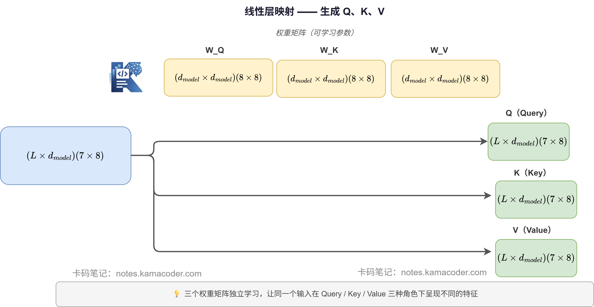
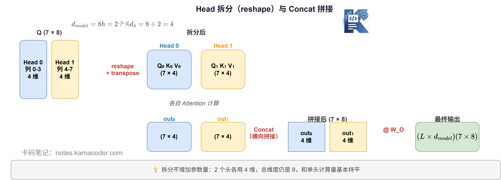

# Пишемо Multi-Head Attention з нуля: від однієї голови до багатьох

> 💻 Увесь код цієї статті зібрано в один файл, який можна запустити:
> [`code/transformer/multi_head_attention.py`](../../../code/transformer/multi_head_attention.py). Потрібен лише numpy.

У попередній статті ми з нуля реалізували найбазовіший attention і пройшли повний шлях Q, K, V → softmax → зважене підсумовування.

Тепер розширимо **одноголовий attention до multi-head attention**, напишемо це рядок за рядком і на кожному кроці друкуватимемо shape для перевірки.

Якщо ви пам'ятаєте висновок попередньої статті: проблема одноголового attention у надто однобокому погляді — за одне обчислення він здатен стежити лише за одним типом змістового зв'язку. Розв'язання з кількома головами полягає в тому, щоб розрізати розмірність і дати кільком головам працювати паралельно, кожній над своїм.

Тепер напишемо цей процес власноруч.

> У цій статті код друкує лише розмірності тензорів, без числових значень,
> тож усі виводи нижче однозначно визначаються параметрами `L=7`, `d_model=8`, `h=2`.

---

## Чим багато голів відрізняються від однієї?

Процес одноголового attention такий:

```
X → (W_Q, W_K, W_V) → Q, K, V → Attention → вихід
```

У multi-head attention додається лише три речі:

```
X → (W_Q, W_K, W_V) → Q, K, V
  → розбиття на h голів (reshape)
  → кожна голова незалежно виконує Attention
  → склеювання (concat)
  → множення на вихідну проєкційну матрицю W_O
  → підсумковий вихід
```

Тобто чотири нові дії: **розбиття → паралельне обчислення → склеювання → вихідна проєкція**.

---

## Крок 1: лінійне відображення, отримуємо Q, K, V

Цей крок абсолютно такий самий, як в одноголовому варіанті. Вхід X множиться на три матриці ваг, і виходять Q, K, V.

```python
import numpy as np

# Налаштування гіперпараметрів
L = 7        # довжина послідовності («Удалині росте яблуня», 7 токенів)
d_model = 8  # розмірність embedding (насправді 512, тут 8 для наочності)
h = 2        # кількість голів уваги (зазвичай 8 або 16)
d_k = d_model // h  # розмірність однієї голови = 8 // 2 = 4

np.random.seed(42)

# Імітуємо вхід після embedding
X = np.random.randn(L, d_model)
print(f"Вхід X: {X.shape}")  # (7, 8)

# Три матриці ваг (у реальності це навчані параметри)
W_Q = np.random.randn(d_model, d_model)
W_K = np.random.randn(d_model, d_model)
W_V = np.random.randn(d_model, d_model)

# Лінійне відображення, отримуємо Q, K, V
Q = X @ W_Q   # (7, 8) @ (8, 8) = (7, 8)
K = X @ W_K
V = X @ W_V

print(f"Q: {Q.shape}")  # (7, 8)
print(f"K: {K.shape}")  # (7, 8)
print(f"V: {V.shape}")  # (7, 8)
```

**Вивід:**
```
Вхід X: (7, 8)
Q: (7, 8)
K: (7, 8)
V: (7, 8)
```

Форми Q, K, V — усі `(L, d_model)`, так само як в одноголовому варіанті.
**Різниця в наступному кроці: одноголовий одразу рахує attention, а багатоголовий спершу «розрізає».**



## Крок 2: розбиття на голови — ділимо d_model на h частин

Це і є ключова відмінність багатоголового варіанта від одноголового.

Візьмімо $d_{model}=8$ і $h=2$: кожна голова отримує $d_k = 8 ÷ 2 = 4$ виміри.

```python
# reshape: (L, d_model) → (L, h, d_k)
Q_split = Q.reshape(L, h, d_k)
K_split = K.reshape(L, h, d_k)
V_split = V.reshape(L, h, d_k)

print(f"\nПісля розбиття:")
print(f"Q_split: {Q_split.shape}")   # (7, 2, 4)
print(f"K_split: {K_split.shape}")   # (7, 2, 4)
print(f"V_split: {V_split.shape}")   # (7, 2, 4)

# Транспонуємо в (h, L, d_k), щоб кожна голова рахувала незалежно
Q_heads = Q_split.transpose(1, 0, 2)
K_heads = K_split.transpose(1, 0, 2)
V_heads = V_split.transpose(1, 0, 2)

print(f"\nПісля транспонування (зручно для паралельних обчислень):")
print(f"Q_heads: {Q_heads.shape}")  # (2, 7, 4)
print(f"K_heads: {K_heads.shape}")  # (2, 7, 4)
print(f"V_heads: {V_heads.shape}")  # (2, 7, 4)
```

**Вивід:**
```
Після розбиття:
Q_split: (7, 2, 4)
K_split: (7, 2, 4)
V_split: (7, 2, 4)

Після транспонування (зручно для паралельних обчислень):
Q_heads: (2, 7, 4)
K_heads: (2, 7, 4)
V_heads: (2, 7, 4)
```

**Як розуміти цей reshape?**

Початкова Q має форму `(7, 8)`: 7 токенів, кожен по 8 вимірів.

Після розбиття на `(7, 2, 4)` виходить: 7 токенів, у кожного 2 погляди, кожен погляд по 4 виміри.

Після транспонування в `(2, 7, 4)` виходить: 2 голови, кожна дивиться на 7 токенів, кожен токен по 4 виміри.

Тепер нульова й перша голови можуть **незалежно й паралельно виконувати обчислення attention**.



## Крок 3: кожна голова незалежно виконує attention

Після розбиття обчислення в кожній голові абсолютно таке саме, як в одноголовому варіанті: QKᵀ → масштабування → softmax → зважування V.

```python
def softmax(x):
    e = np.exp(x - np.max(x, axis=-1, keepdims=True))
    return e / e.sum(axis=-1, keepdims=True)

def single_head_attention(Q, K, V):
    """Attention однієї голови, вхід і вихід мають форму (L, d_k)"""
    d_k = Q.shape[-1]
    scores = Q @ K.T               # (L, L)
    scores = scores / np.sqrt(d_k) # масштабування
    weights = softmax(scores)      # (L, L)
    return weights @ V             # (L, d_k)

# Обчислюємо для кожної голови окремо
head_outputs = []
for i in range(h):
    out_i = single_head_attention(Q_heads[i], K_heads[i], V_heads[i])
    head_outputs.append(out_i)
    print(f"Вихід голови {i}: {out_i.shape}")  # (7, 4)
```

**Вивід:**
```
Вихід голови 0: (7, 4)
Вихід голови 1: (7, 4)
```

Дві голови, вихід кожної — `(7, 4)`. Зверніть увагу: **кожна голова бачить те саме речення, але осмислює його у власному чотиривимірному підпросторі**, тому результати різні.

## Крок 4: concat — склеюємо голови назад

Дві голови відпрацювали. Як їх об'єднати? **Склеюванням по горизонталі**, тобто concat уздовж останнього виміру.

```python
# Спершу перетворюємо list на масив (h, L, d_k)
head_outputs = np.stack(head_outputs, axis=0)
print(f"\nПеред склеюванням (stack): {head_outputs.shape}")  # (2, 7, 4)

# Транспонуємо назад у (L, h, d_k), потім reshape у (L, d_model)
head_outputs = head_outputs.transpose(1, 0, 2)
print(f"Після транспонування: {head_outputs.shape}")  # (7, 2, 4)

concat_output = head_outputs.reshape(L, d_model)
print(f"Після склеювання (reshape): {concat_output.shape}")  # (7, 8)
```

**Вивід:**
```
Перед склеюванням (stack): (2, 7, 4)
Після транспонування: (7, 2, 4)
Після склеювання (reshape): (7, 8)
```

Чотиривимірні виходи двох голів склеїлися й знову стали восьмивимірними. **Розмірність повністю збігається з вхідною X.**

## Крок 5: вихідна проєкція W_O — даємо головам «поговорити» між собою

Після склеювання лишається останній крок: множення на вихідну проєкційну матрицю $W_O$.

```python
# Вихідна проєкційна матриця W_O: (d_model, d_model)
W_O = np.random.randn(d_model, d_model)

# Підсумковий вихід
final_output = concat_output @ W_O
print(f"\nПісля вихідної проєкції: {final_output.shape}")   # (7, 8)
print(f"Форма вхідної X:          {X.shape}")              # (7, 8)
print(f"Форми збігаються:         {final_output.shape == X.shape}")
```

**Вивід:**
```
Після вихідної проєкції: (7, 8)
Форма вхідної X:          (7, 8)
Форми збігаються:         True
```

**Навіщо ще множити на W_O?**

Після concat перші 4 виміри восьмивимірного вектора походять з голови 0, а останні 4 — з голови 1. Вони обчислювалися незалежно й між собою ще не «спілкувалися».

Матриця $W_O$ робить саме те, що дозволяє інформації різних голів **перемішатися** й утворити єдине представлення, яке передається далі в підшар FFN.

## Повний код: пакуємо п'ять кроків в одну функцію

```python
import numpy as np

def multi_head_attention(X, W_Q, W_K, W_V, W_O, h):
    """
    Повна реалізація Multi-Head Attention

    Параметри:
        X:    вхідна матриця, shape (L, d_model)
        W_Q, W_K, W_V: матриці лінійної проєкції, shape (d_model, d_model)
        W_O:  вихідна проєкційна матриця, shape (d_model, d_model)
        h:    кількість голів уваги

    Повертає:
        output: shape (L, d_model)
    """
    L, d_model = X.shape
    d_k = d_model // h

    # ① Лінійне відображення
    Q = X @ W_Q
    K = X @ W_K
    V = X @ W_V
    print(f"[① лінійне відображення] Q/K/V: {Q.shape}")

    # ② Розбиття на h голів: (L, d_model) → (h, L, d_k)
    def split_heads(M):
        return M.reshape(L, h, d_k).transpose(1, 0, 2)

    Q_h = split_heads(Q)
    K_h = split_heads(K)
    V_h = split_heads(V)
    print(f"[② розбиття на голови] Q_h/K_h/V_h: {Q_h.shape}")

    # ③ Кожна голова незалежно обчислює Attention
    def softmax(x):
        e = np.exp(x - np.max(x, axis=-1, keepdims=True))
        return e / e.sum(axis=-1, keepdims=True)

    head_outs = []
    for i in range(h):
        scores = Q_h[i] @ K_h[i].T / np.sqrt(d_k)
        attn = softmax(scores) @ V_h[i]
        head_outs.append(attn)
    print(f"[③ паралельний Attention] вихід кожної голови: {head_outs[0].shape}")

    # ④ Concat: (h, L, d_k) → (L, d_model)
    concat = np.stack(head_outs, axis=0).transpose(1, 0, 2).reshape(L, d_model)
    print(f"[④ Concat] після склеювання: {concat.shape}")

    # ⑤ Вихідна проєкція
    output = concat @ W_O
    print(f"[⑤ вихідна проєкція] підсумковий вихід: {output.shape}")

    return output


# ——— Запуск тесту ———
if __name__ == "__main__":
    np.random.seed(42)
    L, d_model, h = 7, 8, 2

    X   = np.random.randn(L, d_model)
    W_Q = np.random.randn(d_model, d_model)
    W_K = np.random.randn(d_model, d_model)
    W_V = np.random.randn(d_model, d_model)
    W_O = np.random.randn(d_model, d_model)

    print("=== Multi-Head Attention ===")
    out = multi_head_attention(X, W_Q, W_K, W_V, W_O, h)
    print(f"\nФорма входу:      {X.shape}")
    print(f"Форма виходу:     {out.shape}")
    print(f"Форми збігаються: {X.shape == out.shape}")
```

**Вивід під час запуску:**
```
=== Multi-Head Attention ===
[① лінійне відображення] Q/K/V: (7, 8)
[② розбиття на голови] Q_h/K_h/V_h: (2, 7, 4)
[③ паралельний Attention] вихід кожної голови: (7, 4)
[④ Concat] після склеювання: (7, 8)
[⑤ вихідна проєкція] підсумковий вихід: (7, 8)

Форма входу:      (7, 8)
Форма виходу:     (7, 8)
Форми збігаються: True
```

---

## П'ять кроків процесу

| Крок | Операція | Форма входу | Форма виходу |
|------|------|----------|----------|
| ① Лінійне відображення | X множиться на $W_Q / W_K / W_V$ | $(L, d_{model})$ | $(L, d_{model})$ |
| ② Розбиття на голови | reshape + transpose | $(L, d_{model})$ | $(h, L, d_k)$ |
| ③ Паралельний attention | кожна голова виконує повний attention | $(L, d_k) × h$ | $(L, d_k) × h$ |
| ④ Concat | transpose + reshape | $(h, L, d_k)$ | $(L, d_{model})$ |
| ⑤ Вихідна проєкція | множення на $W_O$ | $(L, d_{model})$ | $(L, d_{model})$ |

Від початку до кінця вхід має форму $(L, d_{model})$, і вихід теж. Посередині розмірність один раз «розділяється», а потім «зливається» назад, але загальна розмірність лишається сталою — саме це й дозволяє нашаровувати блоки Transformer один на одного.

---

У цій статті ми повністю написали власноруч усі п'ять кроків multi-head attention, і разом із коментарями це менше ніж 60 рядків коду.

Суть одним реченням:

> **Кілька голів — це не «більше параметрів», а «ті самі параметри, які паралельно осмислюють мову в кількох підпросторах».**

У наступній статті **напишемо з нуля FFN**.
