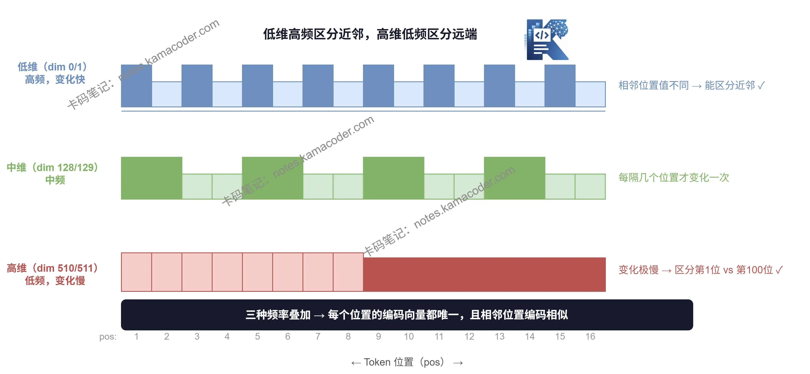

# Позиційне кодування: чому Transformer мусить знати порядок токенів і як працює синусоїдне кодування

У попередній статті ми розібралися, як працює multi-head attention: кілька голів паралельно, кожна стежить за своїми зв'язками, наприкінці все зводиться в один вихід.
Тепер поговоримо про питання, яке часто лишають поза увагою, хоча воно вкрай важливе: **що таке positional encoding і звідки Transformer знає порядок слів?**

---

## Спершу експеримент

Погляньте на ці два речення:

> я вдарив його

> він вдарив мене

Зміст протилежний, а слова використані **абсолютно ті самі**. Єдина відмінність — **порядок**.

Хороша мовна модель мусить розрізняти ці два речення. То чи вміє це Transformer?

---

## Self-attention за своєю природою не відчуває порядку

Ось один із контрінтуїтивних моментів у Transformer.

Пригадаймо обчислення self-attention: кожен токен робить скалярний добуток з **усіма іншими токенами**, з цього рахуються ваги уваги, а далі йде зважене підсумовування.

У цьому процесі **позиція токена не бере участі в обчисленнях узагалі**.
Стоїть «я» на першому місці чи на третьому — на результат QKᵀ це ніяк не впливає.

Одним реченням:

> Self-attention бачить лише «які є слова», але не бачить «де саме ці слова»

Якщо випадково перемішати порядок слів у вхідній послідовності, self-attention обчислить **точно ті самі** ваги уваги.

Це означає, що без жодних додаткових заходів «я вдарив його» і «він вдарив мене» для Transformer — **одне й те саме речення**.

## Чому RNN не має цієї проблеми?

Ви можете подумати: RNN теж працює з послідовностями — у неї така проблема є?

Немає. RNN обробляє **слово за словом у порядку**, тож інформація про позицію природно вбудована в прихований стан. Спершу обробляється перше слово, і лише потім друге: порядок жорстко закодований у самій структурі.

А одна з переваг Transformer якраз у тому, що він **може обробляти всі слова паралельно** — усі токени заходять у self-attention одночасно. Але ціна цього така: **інформація про порядок губиться**, і її треба повертати вручну.

## Розв'язання: позиційне кодування

Ідея проста: якщо сам self-attention не відчуває позиції, то **додаймо інформацію про позицію ще до входу в attention**.

Конкретно: до вектора embedding кожного токена додається вектор, що позначає його позицію. Цей вектор і називається **positional encoding (позиційне кодування)**.

$$
\text{вхід} = \text{Token Embedding} + \text{Positional Encoding}
$$

Після додавання вектор кожного токена містить одночасно й **змістову інформацію** (що це за слово), і **позиційну** (яким він іде за рахунком).

---

## Як виглядає позиційне кодування?

В оригінальній статті для генерації позиційного кодування використані **синус і косинус**, за такими формулами:

$$
PE_{(pos,\ 2i)} = \sin\left(\frac{pos}{10000^{2i/d}}\right)
$$

$$
PE_{(pos,\ 2i+1)} = \cos\left(\frac{pos}{10000^{2i/d}}\right)
$$

Розберімо ці дві формули крок за кроком.

---

## 1. Чому саме тригонометричні функції?

Позиційне кодування має відповідати кільком умовам:

1. **Кодування кожної позиції унікальне** — не може бути двох однакових позицій
2. **«Відстань» між позиціями має бути закономірною**: сусідні позиції мають кодуватися схоже, а що далі позиції одна від одної, то більша різниця
3. **Має узагальнюватися на довші послідовності** — працювати й для позицій, яких не було під час навчання

Синус і косинус природно задовольняють ці умови: накладені одна на одну хвилі різних частот працюють як «лінійка», де візерунок кожної позначки унікальний, але загалом усе підпорядковано закономірності.

## 2. Чому різні виміри мають різні частоти?

Позиційне кодування — це вектор такої самої довжини, як token embedding, скажімо 512 вимірів.

Хитрість синусоїдного кодування в тому, що **різні виміри використовують хвилі різних частот**.

- Низькі виміри: висока частота, швидка зміна → розрізняють близькі позиції (перше слово проти другого)
- Високі виміри: низька частота, повільна зміна → розрізняють далекі позиції (перше слово проти сотого)

Це наче розрізняти сусідні моменти за поділками секунд, а більші проміжки — за поділками годин: **лінійки різної точності міряють відстані різного масштабу**.

## 3. Позиційне кодування фіксоване чи навчане?

В оригінальній статті про Transformer використано **фіксоване синусоїдне кодування**: воно не бере участі в навчанні, а просто обчислюється за формулою.

Але згодом багато моделей (наприклад, BERT) перейшли на **навчане позиційне кодування**: воно теж є набором параметрів і оновлюється разом з векторами слів під час навчання.

На практиці обидва підходи дають приблизно однаковий результат, але акценти в них різні:

| | Синусоїдне (фіксоване) | Навчане |
|---|---|---|
| **Кількість параметрів** | без додаткових параметрів | додається набір позиційних параметрів |
| **Узагальнення на довгі послідовності** | теоретично можлива екстраполяція | обмежене довжиною під час навчання |
| **Показові моделі** | оригінальний Transformer | BERT, GPT-2 |

Transformer обробляє всі слова паралельно через self-attention, що дає виграш у швидкості, але водночас втрачає інформацію про порядок. Позиційне кодування й слугує для того, щоб цю інформацію повернути: ще до входу в attention позицію кожного токена «вписують» у його вектор.

Конструкція синусоїдного позиційного кодування виглядає складною, але по суті це лінійка з кількома рівнями точності: різні виміри з різними частотами разом однозначно ідентифікують кожну позицію й до того ж узагальнюються на довші послідовності.

---

У наступній статті поговоримо про **залишкові з'єднання та layer norm** і подивимося, як Transformer не дає інформації «загубитися» під час передавання від шару до шару.
